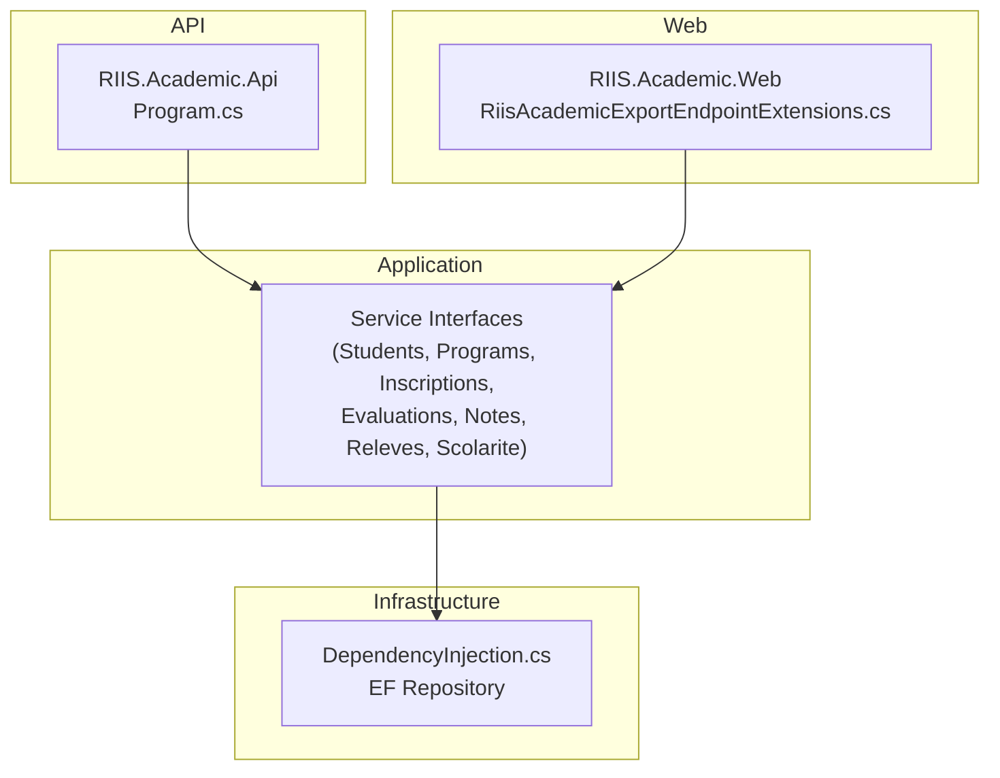
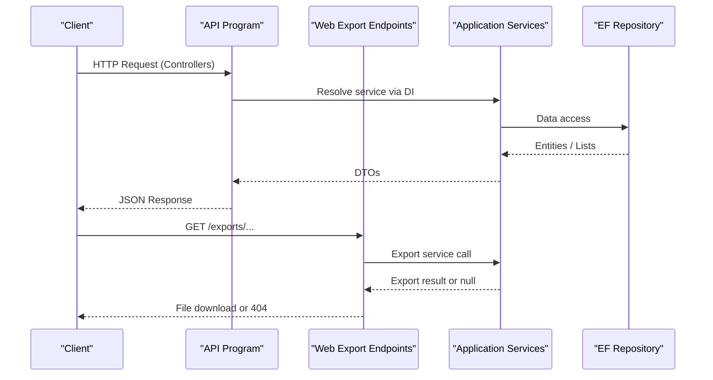
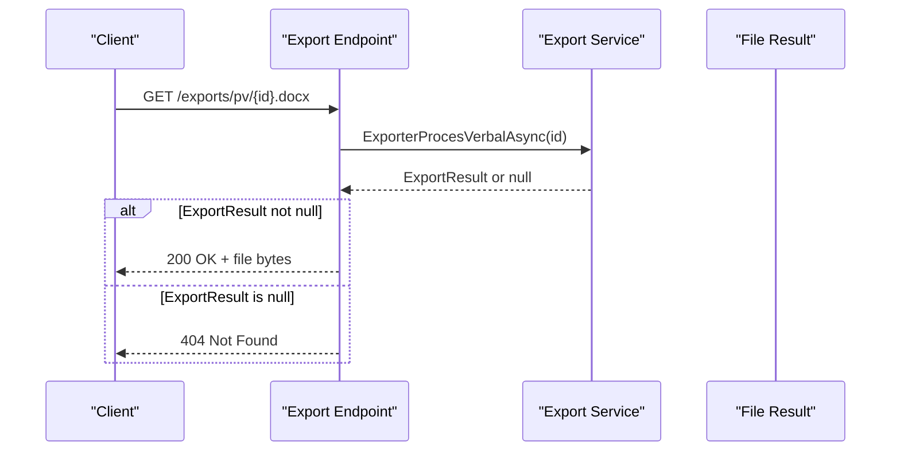
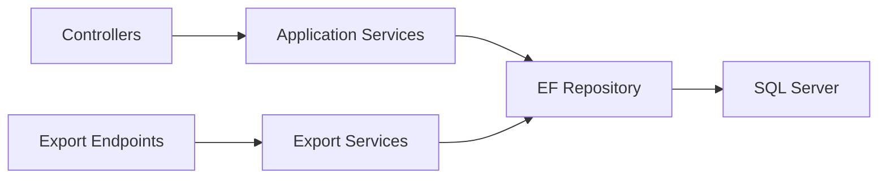

# API Layer

<cite>
**Referenced Files in This Document**
- [Program.cs](file://RIIS.Academic.Api/Program.cs)
- [RiisAcademicExportEndpointExtensions.cs](file://RIIS.Academic.Web/Extensions/RiisAcademicExportEndpointExtensions.cs)
- [DependencyInjection.cs](file://RIIS.Academic.Infrastructure/DependencyInjection.cs)
- [IRepository.cs](file://RIIS.Academic.Application/Abstractions/Persistence/IRepository.cs)
- [EfRepository.cs](file://RIIS.Academic.Infrastructure/Persistence/Repositories/EfRepository.cs)
- [IEtudiantsService.cs](file://RIIS.Academic.Application/Etudiants/Services/IEtudiantsService.cs)
- [IInscriptionsService.cs](file://RIIS.Academic.Application/Inscriptions/Services/IInscriptionsService.cs)
- [IProgrammePedagogiqueService.cs](file://RIIS.Academic.Application/Programmes/Services/IProgrammePedagogiqueService.cs)
- [IEvaluationsService.cs](file://RIIS.Academic.Application/Evaluations/Services/IEvaluationsService.cs)
- [ISaisieNotesService.cs](file://RIIS.Academic.Application/Notes/Services/ISaisieNotesService.cs)
- [ICalculNotesService.cs](file://RIIS.Academic.Application/Abstractions/Services/ICalculNotesService.cs)
- [IRelevesNotesService.cs](file://RIIS.Academic.Application/Releves/Services/IRelevesNotesService.cs)
- [IDossiersScolariteService.cs](file://RIIS.Academic.Application/Scolarite/Services/IDossiersScolariteService.cs)
</cite>

## Table of Contents
1. Introduction
2. Project Structure
3. Core Components
4. Architecture Overview
5. Detailed Component Analysis
6. Dependency Analysis
7. Performance Considerations
8. Troubleshooting Guide
9. Conclusion
10. Appendices

## Introduction
This document specifies the RESTful API surface and export endpoints exposed by the application, focusing on HTTP methods, URL patterns, request/response schemas, authentication, error handling, rate limiting considerations, and versioning strategies. It covers student management, program operations, enrollment processing, grade calculations, financial transactions, and document exports (Word and Excel). The API layer is implemented as a minimal ASP.NET Core setup with controllers mapped via standard conventions, while export endpoints are explicitly registered in the web host.

## Project Structure
The system is organized into layered projects:
- API project configures controllers and database context.
- Web project registers export endpoints and Razor components.
- Application project defines service interfaces and DTOs for each domain area.
- Infrastructure project wires dependency injection and persistence.

**Diagram sources**
- [Program.cs:5-17](file://RIIS.Academic.Api/Program.cs#L5-L17)
- [RiisAcademicExportEndpointExtensions.cs:9-91](file://RIIS.Academic.Web/Extensions/RiisAcademicExportEndpointExtensions.cs#L9-L91)
- [DependencyInjection.cs:25-60](file://RIIS.Academic.Infrastructure/DependencyInjection.cs#L25-L60)

**Section sources**
- [Program.cs:5-17](file://RIIS.Academic.Api/Program.cs#L5-L17)
- [RiisAcademicExportEndpointExtensions.cs:9-91](file://RIIS.Academic.Web/Extensions/RiisAcademicExportEndpointExtensions.cs#L9-L91)
- [DependencyInjection.cs:25-60](file://RIIS.Academic.Infrastructure/DependencyInjection.cs#L25-L60)

## Core Components
- Student Management: Service interface exposes list, get, create default, save, delete operations for students.
- Program Operations: Service interface supports CRUD over pedagogical blueprints, semesters, units, and constituent elements, plus lookups.
- Enrollment Processing: Service interface provides filtering, CRUD, and lookup helpers for enrollments.
- Grade Calculations: Calculation service computes averages, eligibility for retakes, and credits; notes entry service supplies grids and saves grades.
- Financial Transactions: Dossier and finance services manage school records, documents, validations, and payment-related data.
- Export Endpoints: Word and Excel generation for academic records and transcripts.

**Section sources**
- [IEtudiantsService.cs:5-12](file://RIIS.Academic.Application/Etudiants/Services/IEtudiantsService.cs#L5-L12)
- [IProgrammePedagogiqueService.cs:6-64](file://RIIS.Academic.Application/Programmes/Services/IProgrammePedagogiqueService.cs#L6-L64)
- [IInscriptionsService.cs:6-31](file://RIIS.Academic.Application/Inscriptions/Services/IInscriptionsService.cs#L6-L31)
- [ICalculNotesService.cs:6-11](file://RIIS.Academic.Application/Abstractions/Services/ICalculNotesService.cs#L6-L11)
- [ISaisieNotesService.cs:7-26](file://RIIS.Academic.Application/Notes/Services/ISaisieNotesService.cs#L7-L26)
- [IDossiersScolariteService.cs:5-40](file://RIIS.Academic.Application/Scolarite/Services/IDossiersScolariteService.cs#L5-L40)

## Architecture Overview
The API uses ASP.NET Core controllers and minimal APIs for exports. Controllers are discovered via convention mapping. Export endpoints are explicitly registered to produce downloadable files. Services are injected through DI configured in infrastructure.

**Diagram sources**
- [Program.cs:5-17](file://RIIS.Academic.Api/Program.cs#L5-L17)
- [RiisAcademicExportEndpointExtensions.cs:9-91](file://RIIS.Academic.Web/Extensions/RiisAcademicExportEndpointExtensions.cs#L9-L91)
- [DependencyInjection.cs:25-60](file://RIIS.Academic.Infrastructure/DependencyInjection.cs#L25-L60)
- [EfRepository.cs:6-32](file://RIIS.Academic.Infrastructure/Persistence/Repositories/EfRepository.cs#L6-L32)

## Detailed Component Analysis

### Student Management API
- Base path: /api/students (convention-based controller route prefix)
- Methods:
  - GET /api/students?recherche={query}
  - GET /api/students/{id}
  - POST /api/students (create default template)
  - PUT /api/students (save student)
  - DELETE /api/students/{id}
- Request/Response:
  - List returns array of student DTOs.
  - Single returns student DTO.
  - Create default returns empty/default student DTO.
  - Save accepts student DTO and returns updated DTO.
  - Delete returns no content on success.
- Status Codes:
  - 200 OK for successful reads/saves.
  - 201 Created for new resources (typical for POST).
  - 204 No Content for deletes.
  - 404 Not Found when resource missing.
  - 400 Bad Request for validation errors.
- Authentication: Not configured in API startup; add JWT bearer or policy if required.
- Rate Limiting: Not configured; consider adding middleware for production.
- Versioning: Not present; use URL prefix (/v1/) or header-based versioning if needed.

**Section sources**
- [IEtudiantsService.cs:5-12](file://RIIS.Academic.Application/Etudiants/Services/IEtudiantsService.cs#L5-L12)
- [Program.cs:5-17](file://RIIS.Academic.Api/Program.cs#L5-L17)

### Program Operations API
- Base path: /api/programs (controller route prefix)
- Methods:
  - GET /api/programs/maquettes
  - GET /api/programs/maquettes/hierarchy?anneeAcademiqueId=&cycleFormationId=&maquettePedagogiqueId=
  - GET /api/programs/maquettes/{id}
  - POST /api/programs/maquettes (create default)
  - PUT /api/programs/maquettes (save)
  - DELETE /api/programs/maquettes/{id}
  - GET /api/programs/semestres?maquettePedagogiqueId=
  - GET /api/programs/semestres/{id}
  - POST /api/programs/semestres (create default)
  - PUT /api/programs/semestres (save)
  - DELETE /api/programs/semestres/{id}
  - GET /api/programs/unites?semestrePedagogiqueId=
  - GET /api/programs/unites/hierarchy?filters...
  - GET /api/programs/unites/{id}
  - POST /api/programs/unites (create default)
  - PUT /api/programs/unites (save)
  - DELETE /api/programs/unites/{id}
  - GET /api/programs/elements?uniteEnseignementId=
  - GET /api/programs/elements/{id}
  - POST /api/programs/elements (create default)
  - PUT /api/programs/elements (save)
  - DELETE /api/programs/elements/{id}
  - GET /api/programs/lookups/* (academic years, cycles, parcours, maquettes, niveaux, semesters, units)
- Request/Response:
  - Returns lists or single DTOs per operation.
  - Create default returns empty DTO pre-filled with optional parent IDs.
- Status Codes: Same as above.
- Authentication/Rate Limiting/Versioning: As noted for students.

**Section sources**
- [IProgrammePedagogiqueService.cs:6-64](file://RIIS.Academic.Application/Programmes/Services/IProgrammePedagogiqueService.cs#L6-L64)

### Enrollment Processing API
- Base path: /api/enrollments (controller route prefix)
- Methods:
  - GET /api/enrollments?anneeAcademiqueId=&cycleFormationId=&niveauEtudeId=&classePedagogiqueId=
  - GET /api/enrollments/{id}
  - POST /api/enrollments (create default)
  - PUT /api/enrollments (save)
  - DELETE /api/enrollments/{id}
  - GET /api/enrollments/lookups/* (academic years, students, cycles, parcours, levels, classes, maquettes)
- Request/Response:
  - Filters return matching enrollment DTOs.
  - Create default returns empty enrollment DTO.
  - Save returns updated DTO.
- Status Codes: Standard CRUD codes.
- Authentication/Rate Limiting/Versioning: As noted.

**Section sources**
- [IInscriptionsService.cs:6-31](file://RIIS.Academic.Application/Inscriptions/Services/IInscriptionsService.cs#L6-L31)

### Evaluations and Grades API
- Evaluations:
  - GET /api/evaluations?filters...
  - GET /api/evaluations/{id}
  - POST /api/evaluations (create default)
  - PUT /api/evaluations (save)
  - DELETE /api/evaluations/{id}
  - GET /api/evaluations/lookups/* (years, cycles, semesters, units, elements, sessions)
- Grade Entry:
  - GET /api/grades/grid?evaluationAcademiqueId=&classePedagogiqueId=
  - POST /api/grades/save (submit grid)
- Grade Calculations:
  - Utility methods available via service for averages, retake eligibility, and credits.
- Request/Response:
  - Grid returns structured rows for input.
  - Save returns success or validation errors.
- Status Codes: Standard CRUD and validation codes.
- Authentication/Rate Limiting/Versioning: As noted.

**Section sources**
- [IEvaluationsService.cs:7-47](file://RIIS.Academic.Application/Evaluations/Services/IEvaluationsService.cs#L7-L47)
- [ISaisieNotesService.cs:7-26](file://RIIS.Academic.Application/Notes/Services/ISaisieNotesService.cs#L7-L26)
- [ICalculNotesService.cs:6-11](file://RIIS.Academic.Application/Abstractions/Services/ICalculNotesService.cs#L6-L11)

### Financial Transactions and School Records API
- Base path: /api/scolarite (controller route prefix)
- Methods:
  - GET /api/scolarite/dossiers?inclureInscriptionsSansDossier=&recherche=&anneeAcademiqueCode=&cycleCode=&niveauNumero=&filiereCode=&specialiteCode=
  - GET /api/scolarite/dossiers/{id}
  - POST /api/scolarite/doss/from-enrollment?inscriptionId=
  - GET /api/scolarite/admin/{dossierId}
  - PUT /api/scolarite/admin/documents (sync documents)
  - PUT /api/scolarite/admin/document (save document)
  - PUT /api/scolarite/admin/recalculate-validation/{dossierId}
- Request/Response:
  - Returns dossier DTOs and administration views.
  - Sync/save operations return updated administration DTO.
- Status Codes: Standard CRUD and business operation codes.
- Authentication/Rate Limiting/Versioning: As noted.

**Section sources**
- [IDossiersScolariteService.cs:5-40](file://RIIS.Academic.Application/Scolarite/Services/IDossiersScolariteService.cs#L5-L40)

### Export Endpoints (Word and Excel)
- Base path: /exports
- Endpoints:
  - GET /exports/pv/{procesVerbalId}.docx
    - Purpose: Download Word transcript for a class record.
    - Route Parameters: procesVerbalId (long)
    - Success: 200 OK with file stream, Content-Type set by export service, filename provided.
    - Error: 404 Not Found if export result is null.
  - GET /exports/pv/{procesVerbalId}.xlsx
    - Purpose: Download Excel transcript for a class record.
    - Route Parameters: procesVerbalId (long)
    - Success: 200 OK with file stream.
    - Error: 404 Not Found if export result is null.
  - GET /exports/pv/{procesVerbalId}.modele.docx
    - Purpose: Download Word template-based transcript for a class record.
    - Route Parameters: procesVerbalId (long)
    - Success: 200 OK with file stream.
    - Error: 404 Not Found if export result is null.
  - GET /exports/releves/{inscriptionId}.docx
    - Purpose: Download annual transcript Word document for an enrollment.
    - Route Parameters: inscriptionId (long)
    - Success: 200 OK with file stream.
    - Error: 404 Not Found if export result is null.
  - GET /exports/releves/{inscriptionId}.modele.docx
    - Purpose: Download annual transcript Word template document for an enrollment.
    - Route Parameters: inscriptionId (long)
    - Success: 200 OK with file stream.
    - Error: 404 Not Found if export result is null.
- Query Parameters: None defined for these endpoints.
- Authentication: Not configured in endpoint registration; add authorization policies if needed.
- Rate Limiting: Not configured; apply global or endpoint-specific limits in production.
- Versioning: Not present; consider /v1/ prefix for future changes.

**Diagram sources**
- [RiisAcademicExportEndpointExtensions.cs:11-25](file://RIIS.Academic.Web/Extensions/RiisAcademicExportEndpointExtensions.cs#L11-L25)
- [RiisAcademicExportEndpointExtensions.cs:27-41](file://RIIS.Academic.Web/Extensions/RiisAcademicExportEndpointExtensions.cs#L27-L41)
- [RiisAcademicExportEndpointExtensions.cs:43-57](file://RIIS.Academic.Web/Extensions/RiisAcademicExportEndpointExtensions.cs#L43-L57)
- [RiisAcademicExportEndpointExtensions.cs:59-73](file://RIIS.Academic.Web/Extensions/RiisAcademicExportEndpointExtensions.cs#L59-L73)
- [RiisAcademicExportEndpointExtensions.cs:75-89](file://RIIS.Academic.Web/Extensions/RiisAcademicExportEndpointExtensions.cs#L75-L89)

**Section sources**
- [RiisAcademicExportEndpointExtensions.cs:11-89](file://RIIS.Academic.Web/Extensions/RiisAcademicExportEndpointExtensions.cs#L11-L89)

## Dependency Analysis
- Controllers depend on application services resolved via DI.
- Export endpoints depend on export services also resolved via DI.
- All services depend on repositories for data access.
- EF repository implements generic CRUD operations.

**Diagram sources**
- [DependencyInjection.cs:25-60](file://RIIS.Academic.Infrastructure/DependencyInjection.cs#L25-L60)
- [EfRepository.cs:6-32](file://RIIS.Academic.Infrastructure/Persistence/Repositories/EfRepository.cs#L6-L32)

**Section sources**
- [DependencyInjection.cs:25-60](file://RIIS.Academic.Infrastructure/DependencyInjection.cs#L25-L60)
- [IRepository.cs:3-12](file://RIIS.Academic.Application/Abstractions/Persistence/IRepository.cs#L3-L12)
- [EfRepository.cs:6-32](file://RIIS.Academic.Infrastructure/Persistence/Repositories/EfRepository.cs#L6-L32)

## Performance Considerations
- Use pagination and filtering on list endpoints to reduce payload size.
- Leverage asynchronous operations throughout services and endpoints.
- Avoid N+1 queries in service implementations; prefer efficient joins or projections.
- Cache read-heavy reference data (lookups) where appropriate.
- For exports, ensure streaming responses and avoid loading entire datasets into memory unnecessarily.

[No sources needed since this section provides general guidance]

## Troubleshooting Guide
- 404 Not Found on exports: Indicates the requested ID does not exist or export generation returned null. Verify the ID and underlying data.
- Validation errors: Return 400 with detailed messages; ensure client handles error payloads.
- Database connectivity: Check connection string configuration and environment settings.
- Authorization failures: If auth is enabled, ensure tokens are valid and scopes match.

**Section sources**
- [RiisAcademicExportEndpointExtensions.cs:22-24](file://RIIS.Academic.Web/Extensions/RiisAcademicExportEndpointExtensions.cs#L22-L24)
- [RiisAcademicExportEndpointExtensions.cs:38-40](file://RIIS.Academic.Web/Extensions/RiisAcademicExportEndpointExtensions.cs#L38-L40)
- [RiisAcademicExportEndpointExtensions.cs:54-56](file://RIIS.Academic.Web/Extensions/RiisAcademicExportEndpointExtensions.cs#L54-L56)
- [RiisAcademicExportEndpointExtensions.cs:70-72](file://RIIS.Academic.Web/Extensions/RiisAcademicExportEndpointExtensions.cs#L70-L72)
- [RiisAcademicExportEndpointExtensions.cs:86-88](file://RIIS.Academic.Web/Extensions/RiisAcademicExportEndpointExtensions.cs#L86-L88)

## Conclusion
The API provides a comprehensive set of endpoints for managing students, programs, enrollments, evaluations, grades, and financial dossiers, along with robust export capabilities for Word and Excel documents. While authentication and rate limiting are not configured in the current setup, they can be added using ASP.NET Core features. Versioning should be introduced early to maintain backward compatibility as the API evolves.

[No sources needed since this section summarizes without analyzing specific files]

## Appendices

### Common Use Cases
- Retrieve student list with search filter and display in a table.
- Create a new student using the default template, then fill details and save.
- Fetch program hierarchy to render nested UI structures.
- Generate and download Word/Excel transcripts for class records and annual transcripts for enrollments.

### Security Considerations
- Add JWT bearer authentication for protected endpoints.
- Implement role-based authorization for sensitive operations (e.g., saving grades, financial updates).
- Validate all inputs server-side and enforce least privilege.

### Rate Limiting Strategy
- Apply global rate limiting middleware with sliding windows.
- Configure stricter limits for heavy operations like exports.

### Versioning Strategy
- Use URL versioning (/v1/) for clear evolution paths.
- Maintain deprecation notices and migration guides for breaking changes.