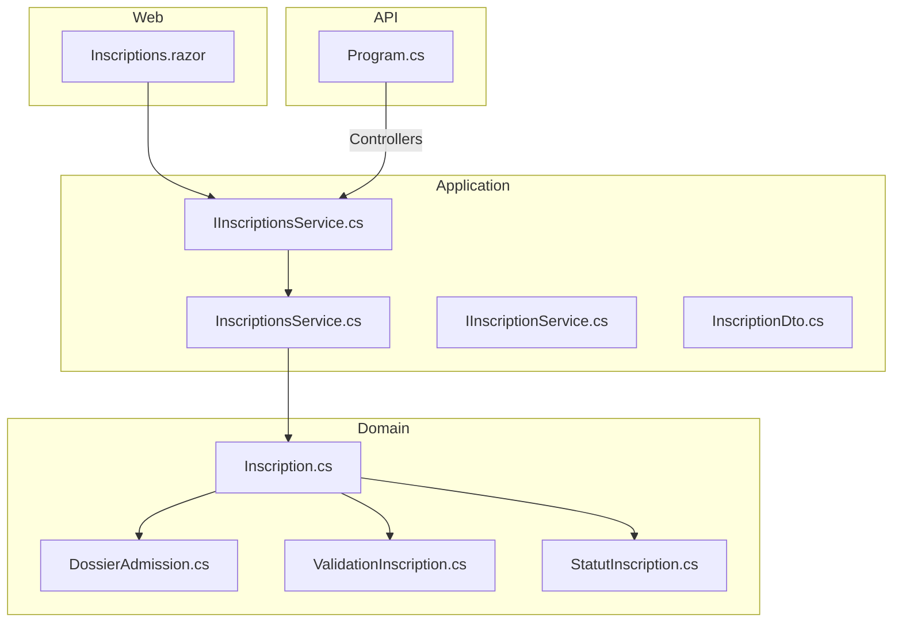
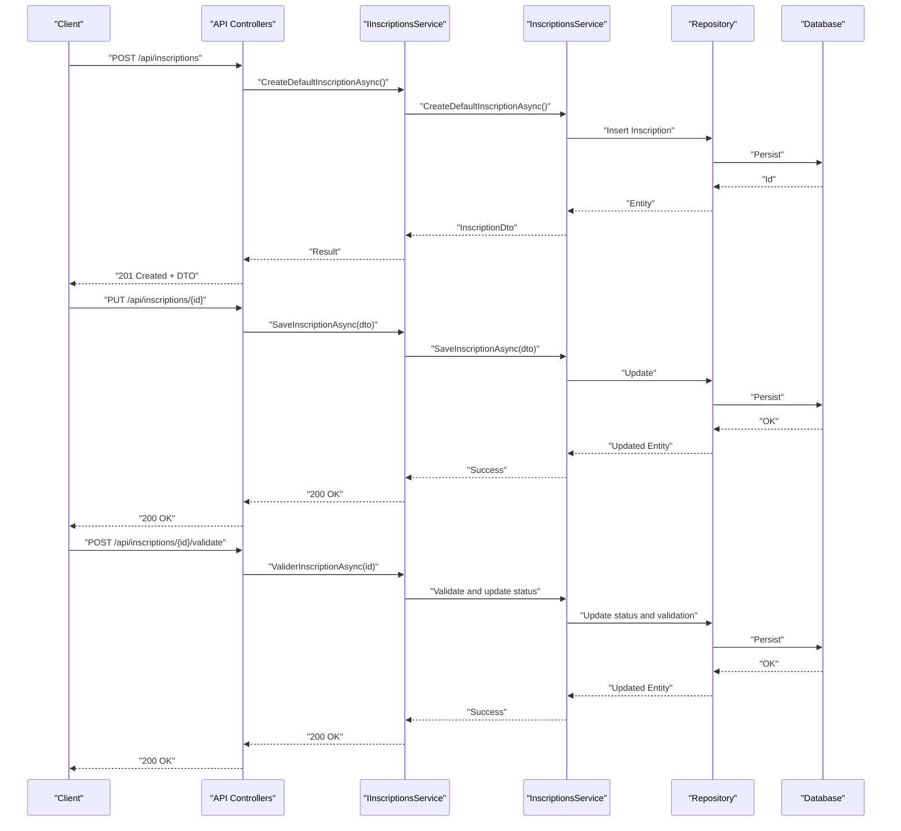
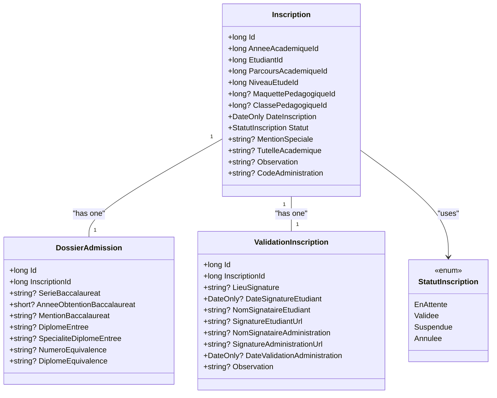
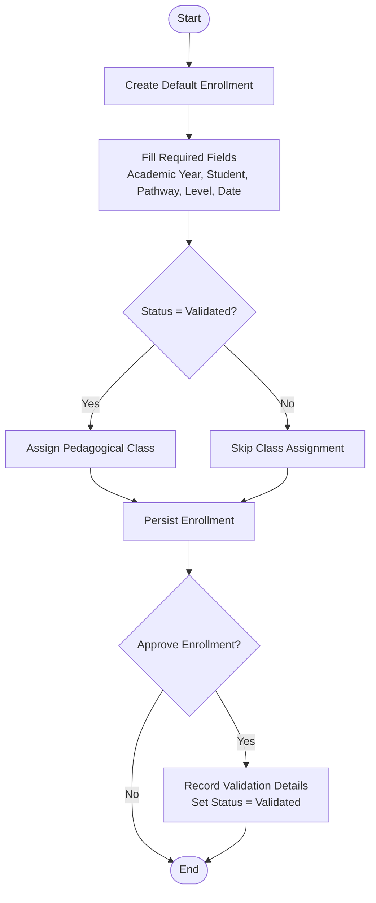
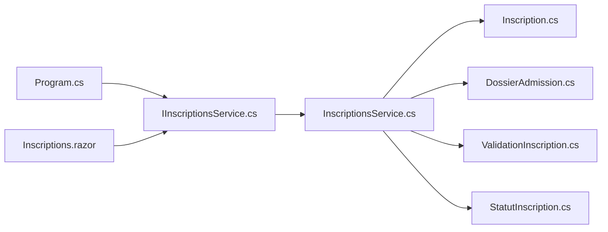

# Enrollment APIs

<cite>
**Referenced Files in This Document**
- [IInscriptionsService.cs](file://RIIS.Academic.Application/Inscriptions/Services/IInscriptionsService.cs)
- [InscriptionsService.cs](file://RIIS.Academic.Application/Inscriptions/Services/InscriptionsService.cs)
- [InscriptionDto.cs](file://RIIS.Academic.Application/Inscriptions/Dtos/InscriptionDto.cs)
- [IInscriptionService.cs](file://RIIS.Academic.Application/Abstractions/Services/IInscriptionService.cs)
- [Inscription.cs](file://RIIS.Academic.Domain/Inscriptions/Inscription.cs)
- [DossierAdmission.cs](file://RIIS.Academic.Domain/Inscriptions/DossierAdmission.cs)
- [ValidationInscription.cs](file://RIIS.Academic.Domain/Inscriptions/ValidationInscription.cs)
- [StatutInscription.cs](file://RIIS.Academic.Domain/Enums/StatutInscription.cs)
- [Program.cs](file://RIIS.Academic.Api/Program.cs)
- [Inscriptions.razor](file://RIIS.Academic.Web/Components/Pages/Inscriptions.razor)
</cite>

## Table of Contents
1. Introduction
2. Project Structure
3. Core Components
4. Architecture Overview
5. Detailed Component Analysis
6. Dependency Analysis
7. Performance Considerations
8. Troubleshooting Guide
9. Conclusion

## Introduction
This document specifies the enrollment and registration API surface for creating admission dossiers, processing registrations, and managing enrollment status transitions. It covers HTTP methods, URL patterns, request/response schemas, validation rules, workflow examples, and integration points with student and program management systems. The design follows a clean architecture with application services exposing domain operations over persistence abstractions.

## Project Structure
The enrollment feature spans multiple layers:
- Domain models define entities and enums for inscriptions, admission dossiers, validations, and statuses.
- Application services implement business logic and orchestrate data access via repository abstractions.
- Web UI consumes application services to render forms and grids; the API project configures controllers and database context.

**Diagram sources**
- [Program.cs:5-17](file://RIIS.Academic.Api/Program.cs#L5-L17)
- [IInscriptionsService.cs:6-31](file://RIIS.Academic.Application/Inscriptions/Services/IInscriptionsService.cs#L6-L31)
- [InscriptionsService.cs:8-16](file://RIIS.Academic.Application/Inscriptions/Services/InscriptionsService.cs#L8-L16)
- [InscriptionDto.cs:5-27](file://RIIS.Academic.Application/Inscriptions/Dtos/InscriptionDto.cs#L5-L27)
- [Inscription.cs:3-36](file://RIIS.Academic.Domain/Inscriptions/Inscription.cs#L3-L36)
- [DossierAdmission.cs:3-16](file://RIIS.Academic.Domain/Inscriptions/DossierAdmission.cs#L3-L16)
- [ValidationInscription.cs:3-17](file://RIIS.Academic.Domain/Inscriptions/ValidationInscription.cs#L3-L17)
- [StatutInscription.cs:3-9](file://RIIS.Academic.Domain/Enums/StatutInscription.cs#L3-L9)
- [Inscriptions.razor:1-351](file://RIIS.Academic.Web/Components/Pages/Inscriptions.razor#L1-L351)

**Section sources**
- [Program.cs:5-17](file://RIIS.Academic.Api/Program.cs#L5-L17)
- [IInscriptionsService.cs:6-31](file://RIIS.Academic.Application/Inscriptions/Services/IInscriptionsService.cs#L6-L31)
- [InscriptionsService.cs:8-16](file://RIIS.Academic.Application/Inscriptions/Services/InscriptionsService.cs#L8-L16)
- [InscriptionDto.cs:5-27](file://RIIS.Academic.Application/Inscriptions/Dtos/InscriptionDto.cs#L5-L27)
- [Inscription.cs:3-36](file://RIIS.Academic.Domain/Inscriptions/Inscription.cs#L3-L36)
- [DossierAdmission.cs:3-16](file://RIIS.Academic.Domain/Inscriptions/DossierAdmission.cs#L3-L16)
- [ValidationInscription.cs:3-17](file://RIIS.Academic.Domain/Inscriptions/ValidationInscription.cs#L3-L17)
- [StatutInscription.cs:3-9](file://RIIS.Academic.Domain/Enums/StatutInscription.cs#L3-L9)
- [Inscriptions.razor:1-351](file://RIIS.Academic.Web/Components/Pages/Inscriptions.razor#L1-L351)

## Core Components
- Inscription entity: Represents a student’s annual enrollment with academic year, student, academic pathway, study level, optional pedagogical blueprint and class, date, status, and administrative notes.
- Admission dossier: Stores baccalaureate and equivalence details linked to an inscription.
- Validation record: Captures signatures, dates, and administrative validation fields tied to an inscription.
- Status enum: Defines lifecycle states for inscriptions (pending, validated, suspended, cancelled).
- Application service interface: Provides CRUD and lookup operations for inscriptions and related references.
- Abstraction service: Exposes high-level enrollment actions such as creation and validation.

Key responsibilities:
- Create default enrollment records and persist updates.
- Retrieve filtered lists and lookups for UI-driven workflows.
- Validate and transition enrollment status through dedicated operations.

**Section sources**
- [Inscription.cs:3-36](file://RIIS.Academic.Domain/Inscriptions/Inscription.cs#L3-L36)
- [DossierAdmission.cs:3-16](file://RIIS.Academic.Domain/Inscriptions/DossierAdmission.cs#L3-L16)
- [ValidationInscription.cs:3-17](file://RIIS.Academic.Domain/Inscriptions/ValidationInscription.cs#L3-L17)
- [StatutInscription.cs:3-9](file://RIIS.Academic.Domain/Enums/StatutInscription.cs#L3-L9)
- [IInscriptionsService.cs:6-31](file://RIIS.Academic.Application/Inscriptions/Services/IInscriptionsService.cs#L6-L31)
- [IInscriptionService.cs:4-8](file://RIIS.Academic.Application/Abstractions/Services/IInscriptionService.cs#L4-L8)

## Architecture Overview
The enrollment flow is orchestrated by application services that operate on domain entities and are consumed by the web layer. Controllers are registered in the API project, enabling HTTP endpoints to invoke these services.

**Diagram sources**
- [Program.cs:5-17](file://RIIS.Academic.Api/Program.cs#L5-L17)
- [IInscriptionsService.cs:6-31](file://RIIS.Academic.Application/Inscriptions/Services/IInscriptionsService.cs#L6-L31)
- [InscriptionsService.cs:8-16](file://RIIS.Academic.Application/Inscriptions/Services/InscriptionsService.cs#L8-L16)
- [IInscriptionService.cs:4-8](file://RIIS.Academic.Application/Abstractions/Services/IInscriptionService.cs#L4-L8)

## Detailed Component Analysis

### Enrollment Lifecycle Endpoints
These endpoints cover the complete enrollment lifecycle from admission dossier creation to registration validation and status management.

- Create admission dossier and initial enrollment
  - Method: POST
  - URL: /api/inscriptions
  - Request body: InscriptionDto
  - Response: 201 Created with InscriptionDto
  - Notes: Creates a default enrollment record; admission dossier can be attached or created subsequently.

- Update enrollment (save changes)
  - Method: PUT
  - URL: /api/inscriptions/{id}
  - Request body: InscriptionDto
  - Response: 200 OK
  - Notes: Updates enrollment fields including status, academic pathway, study level, class, blueprint, and administrative notes.

- Validate enrollment (approve)
  - Method: POST
  - URL: /api/inscriptions/{id}/validate
  - Request body: Optional ValidationInscription fields if provided
  - Response: 200 OK
  - Notes: Transitions status to validated and records administrative validation details.

- List enrollments (filtered)
  - Method: GET
  - URL: /api/inscriptions?anneeAcademiqueId={}&cycleFormationId={}&niveauEtudeId={}&classePedagogiqueId={}
  - Response: 200 OK with list of InscriptionDto
  - Notes: Supports filtering by academic year, formation cycle, study level, and class.

- Get enrollment by id
  - Method: GET
  - URL: /api/inscriptions/{id}
  - Response: 200 OK with InscriptionDto
  - Notes: Returns full enrollment details for editing or review.

- Delete enrollment
  - Method: DELETE
  - URL: /api/inscriptions/{id}
  - Response: 204 No Content
  - Notes: Removes enrollment record when appropriate.

- Lookup references
  - Methods: GET
  - URLs:
    - /api/inscriptions/lookups/annees-academiques
    - /api/inscriptions/lookups/etudiants
    - /api/inscriptions/lookups/cycles-formation
    - /api/inscriptions/lookups/parcours-academiques
    - /api/inscriptions/lookups/niveaux-etude
    - /api/inscriptions/lookups/classes-pedagogiques?anneeAcademiqueId={}&cycleFormationId={}&niveauEtudeId={}
    - /api/inscriptions/lookups/maquettes-pedagogiques
  - Response: 200 OK with list of LookupDto
  - Notes: Used by UI to populate dropdowns and filters.

Request and response schema: InscriptionDto
- Fields:
  - Id: long
  - AnneeAcademiqueId: long
  - AnneeAcademiqueLibelle: string
  - EtudiantId: long
  - EtudiantMatricule: string
  - EtudiantNomComplet: string
  - ParcoursAcademiqueId: long
  - ParcoursAcademiqueLibelle: string
  - NiveauEtudeId: long
  - NiveauEtudeLibelle: string
  - MaquettePedagogiqueId: long?
  - MaquettePedagogiqueLibelle: string?
  - ClassePedagogiqueId: long?
  - ClassePedagogiqueLibelle: string?
  - DateInscription: DateOnly
  - Statut: StatutInscription
  - MentionSpeciale: string?
  - TutelleAcademique: string?
  - Observation: string?
  - CodeAdministration: string?

Validation rules and constraints:
- Required fields for new enrollment: academic year, student, academic pathway, study level, and date.
- When status is set to validated, the enrollment must be assigned to a pedagogical class.
- Academic year value must be within allowed range at the persistence layer.

Status transitions:
- EnAttente (Pending) -> Validee (Validated): On successful validation operation.
- EnAttente/Suspendue/Annulee: Administrative updates may change status based on policy.

Examples:
- Create enrollment: POST /api/inscriptions with InscriptionDto containing required fields.
- Save enrollment: PUT /api/inscriptions/{id} with updated fields.
- Validate enrollment: POST /api/inscriptions/{id}/validate to approve and assign class if needed.
- Filter enrollments: GET /api/inscriptions with query parameters.

Integration points:
- Student management: References to EtudiantId and student display fields.
- Program management: References to ParcoursAcademiqueId, MaquettePedagogiqueId, and ClassePedagogiqueId.
- Academic calendar: AnneeAcademiqueId ties enrollment to an academic year.

**Section sources**
- [IInscriptionsService.cs:6-31](file://RIIS.Academic.Application/Inscriptions/Services/IInscriptionsService.cs#L6-L31)
- [InscriptionDto.cs:5-27](file://RIIS.Academic.Application/Inscriptions/Dtos/InscriptionDto.cs#L5-L27)
- [StatutInscription.cs:3-9](file://RIIS.Academic.Domain/Enums/StatutInscription.cs#L3-L9)
- [Inscription.cs:3-36](file://RIIS.Academic.Domain/Inscriptions/Inscription.cs#L3-L36)
- [DossierAdmission.cs:3-16](file://RIIS.Academic.Domain/Inscriptions/DossierAdmission.cs#L3-L16)
- [ValidationInscription.cs:3-17](file://RIIS.Academic.Domain/Inscriptions/ValidationInscription.cs#L3-L17)
- [Inscriptions.razor:1-351](file://RIIS.Academic.Web/Components/Pages/Inscriptions.razor#L1-L351)

### Data Model Relationships

**Diagram sources**
- [Inscription.cs:3-36](file://RIIS.Academic.Domain/Inscriptions/Inscription.cs#L3-L36)
- [DossierAdmission.cs:3-16](file://RIIS.Academic.Domain/Inscriptions/DossierAdmission.cs#L3-L16)
- [ValidationInscription.cs:3-17](file://RIIS.Academic.Domain/Inscriptions/ValidationInscription.cs#L3-L17)
- [StatutInscription.cs:3-9](file://RIIS.Academic.Domain/Enums/StatutInscription.cs#L3-L9)

### Processing Logic Flowchart

**Diagram sources**
- [Inscriptions.razor:59-165](file://RIIS.Academic.Web/Components/Pages/Inscriptions.razor#L59-L165)
- [StatutInscription.cs:3-9](file://RIIS.Academic.Domain/Enums/StatutInscription.cs#L3-L9)
- [Inscription.cs:3-36](file://RIIS.Academic.Domain/Inscriptions/Inscription.cs#L3-L36)

## Dependency Analysis
The enrollment feature depends on:
- Domain entities for core data and state.
- Application services for business operations and lookups.
- Repository abstractions for persistence.
- API configuration for controller routing and database context.

**Diagram sources**
- [IInscriptionsService.cs:6-31](file://RIIS.Academic.Application/Inscriptions/Services/IInscriptionsService.cs#L6-L31)
- [InscriptionsService.cs:8-16](file://RIIS.Academic.Application/Inscriptions/Services/InscriptionsService.cs#L8-L16)
- [Inscription.cs:3-36](file://RIIS.Academic.Domain/Inscriptions/Inscription.cs#L3-L36)
- [DossierAdmission.cs:3-16](file://RIIS.Academic.Domain/Inscriptions/DossierAdmission.cs#L3-L16)
- [ValidationInscription.cs:3-17](file://RIIS.Academic.Domain/Inscriptions/ValidationInscription.cs#L3-L17)
- [StatutInscription.cs:3-9](file://RIIS.Academic.Domain/Enums/StatutInscription.cs#L3-L9)
- [Program.cs:5-17](file://RIIS.Academic.Api/Program.cs#L5-L17)
- [Inscriptions.razor:1-351](file://RIIS.Academic.Web/Components/Pages/Inscriptions.razor#L1-L351)

**Section sources**
- [IInscriptionsService.cs:6-31](file://RIIS.Academic.Application/Inscriptions/Services/IInscriptionsService.cs#L6-L31)
- [InscriptionsService.cs:8-16](file://RIIS.Academic.Application/Inscriptions/Services/InscriptionsService.cs#L8-L16)
- [Program.cs:5-17](file://RIIS.Academic.Api/Program.cs#L5-L17)
- [Inscriptions.razor:1-351](file://RIIS.Academic.Web/Components/Pages/Inscriptions.razor#L1-L351)

## Performance Considerations
- Use filtered queries for listing inscriptions to reduce payload size and improve responsiveness.
- Cache lookup lists (academic years, students, pathways, classes) where appropriate to minimize repeated calls.
- Ensure indexes exist on frequently filtered columns (e.g., academic year, pathway, level, class).
- Avoid loading large graphs; return only necessary fields in DTOs.

[No sources needed since this section provides general guidance]

## Troubleshooting Guide
Common issues and resolutions:
- Missing required fields: Ensure academic year, student, pathway, level, and date are provided before saving.
- Invalid status transition: When setting status to validated, assign a pedagogical class first.
- Persistence constraint errors: Verify academic year values fall within allowed ranges enforced by database constraints.
- Lookup failures: Confirm reference data exists for students, pathways, levels, and classes before selection.

Operational checks:
- Validate form inputs on the client side prior to submission.
- Review server-side exceptions returned by save and validate operations.
- Check database logs for constraint violations during persistence.

**Section sources**
- [Inscriptions.razor:59-165](file://RIIS.Academic.Web/Components/Pages/Inscriptions.razor#L59-L165)
- [StatutInscription.cs:3-9](file://RIIS.Academic.Domain/Enums/StatutInscription.cs#L3-L9)
- [Inscription.cs:3-36](file://RIIS.Academic.Domain/Inscriptions/Inscription.cs#L3-L36)

## Conclusion
The enrollment APIs provide a comprehensive lifecycle for managing student admissions and registrations. They support creating admission dossiers, processing registrations, validating approvals, and transitioning enrollment statuses. Integration points with student and program management ensure accurate linkage to academic structures. Following the specified schemas and validation rules enables reliable and consistent enrollment workflows across the system.

[No sources needed since this section summarizes without analyzing specific files]