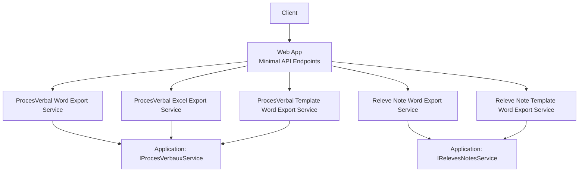
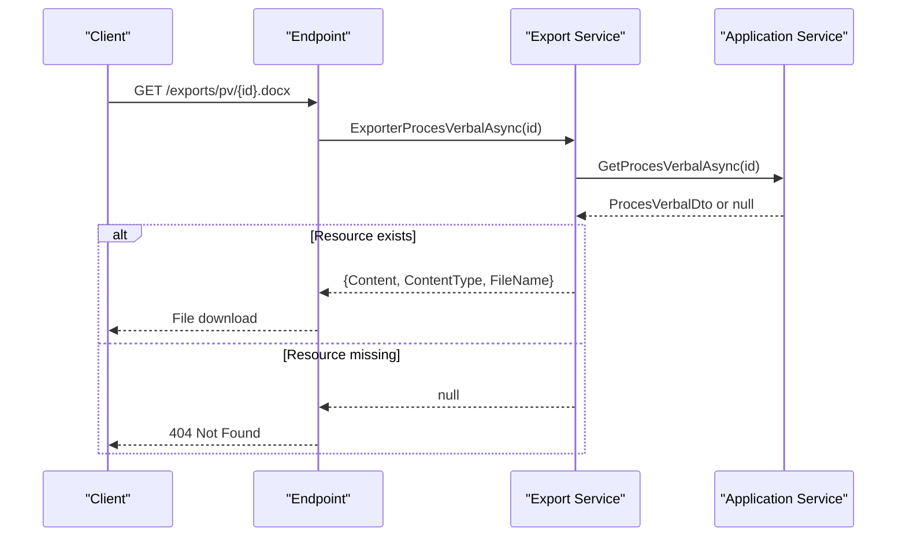
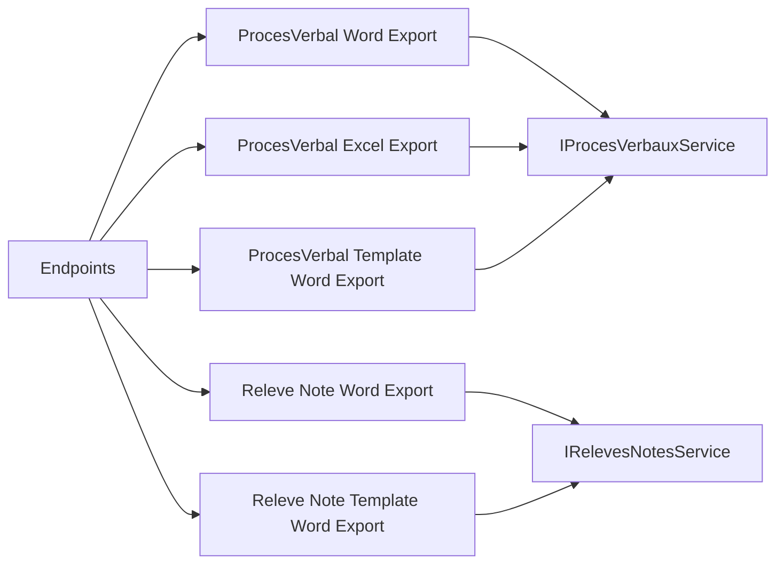

# Export and Document Generation APIs

<cite>
**Referenced Files in This Document**
- [RiisAcademicExportEndpointExtensions.cs](file://RIIS.Academic.Web/Extensions/RiisAcademicExportEndpointExtensions.cs)
- [Program.cs](file://RIIS.Academic.Web/Program.cs)
- [ProcesVerbalWordExportService.cs](file://RIIS.Academic.Infrastructure/Documents/ProcesVerbalWordExportService.cs)
- [ProcesVerbalExcelExportService.cs](file://RIIS.Academic.Infrastructure/Documents/ProcesVerbalExcelExportService.cs)
- [ProcesVerbalTemplateWordExportService.cs](file://RIIS.Academic.Infrastructure/Documents/ProcesVerbalTemplateWordExportService.cs)
- [ReleveNoteWordExportService.cs](file://RIIS.Academic.Infrastructure/Documents/ReleveNoteWordExportService.cs)
- [ReleveNoteTemplateWordExportService.cs](file://RIIS.Academic.Infrastructure/Documents/ReleveNoteTemplateWordExportService.cs)
- [IProcesVerbauxService.cs](file://RIIS.Academic.Application/ProcesVerbaux/Services/IProcesVerbauxService.cs)
- [IRelevesNotesService.cs](file://RIIS.Academic.Application/Releves/Services/IRelevesNotesService.cs)
</cite>

## Table of Contents
1. [Introduction](#introduction)
2. [Project Structure](#project-structure)
3. [Core Components](#core-components)
4. [Architecture Overview](#architecture-overview)
5. [Detailed Component Analysis](#detailed-component-analysis)
6. [Dependency Analysis](#dependency-analysis)
7. [Performance Considerations](#performance-considerations)
8. [Troubleshooting Guide](#troubleshooting-guide)
9. [Conclusion](#conclusion)

## Introduction
This document specifies the HTTP endpoints for exporting academic documents, including Word transcripts (annual student transcripts), Word meeting minutes (procedural records), Excel exports of meeting minutes, and template-based Word generation for both transcripts and meeting minutes. It covers URL patterns, parameters, response formats, download behavior, error handling, and configuration options such as template selection and export customization.

## Project Structure
The export functionality is exposed via minimal API endpoints registered in the Web project and implemented by infrastructure services that generate Office Open XML files on demand. The endpoints are mapped under a dedicated route group and rely on application services to fetch data and return binary file responses.

**Diagram sources**
- [RiisAcademicExportEndpointExtensions.cs:11-89](file://RIIS.Academic.Web/Extensions/RiisAcademicExportEndpointExtensions.cs#L11-L89)
- [Program.cs:24](file://RIIS.Academic.Web/Program.cs#L24)
- [IProcesVerbauxService.cs:17](file://RIIS.Academic.Application/ProcesVerbaux/Services/IProcesVerbauxService.cs#L17)
- [IRelevesNotesService.cs:14](file://RIIS.Academic.Application/Releves/Services/IRelevesNotesService.cs#L14)

**Section sources**
- [RiisAcademicExportEndpointExtensions.cs:11-89](file://RIIS.Academic.Web/Extensions/RiisAcademicExportEndpointExtensions.cs#L11-L89)
- [Program.cs:24](file://RIIS.Academic.Web/Program.cs#L24)

## Core Components
- Endpoint registration: Minimal API routes for Word and Excel exports are defined and mounted into the application pipeline.
- Data access: Application services provide domain data for procedural records (meeting minutes) and annual transcripts.
- Export engines: Infrastructure services generate Office Open XML content directly or from templates and return binary payloads with appropriate filenames and content types.

Key responsibilities:
- Route mapping and parameter binding
- Invocation of export services
- Returning file responses or not-found results
- Generating structured Word/Excel content with consistent styling and formatting

**Section sources**
- [RiisAcademicExportEndpointExtensions.cs:11-89](file://RIIS.Academic.Web/Extensions/RiisAcademicExportEndpointExtensions.cs#L11-L89)
- [ProcesVerbalWordExportService.cs:12-29](file://RIIS.Academic.Infrastructure/Documents/ProcesVerbalWordExportService.cs#L12-L29)
- [ProcesVerbalExcelExportService.cs:14-31](file://RIIS.Academic.Infrastructure/Documents/ProcesVerbalExcelExportService.cs#L14-L31)
- [ProcesVerbalTemplateWordExportService.cs:16-33](file://RIIS.Academic.Infrastructure/Documents/ProcesVerbalTemplateWordExportService.cs#L16-L33)
- [ReleveNoteWordExportService.cs:12-27](file://RIIS.Academic.Infrastructure/Documents/ReleveNoteWordExportService.cs#L12-L27)
- [ReleveNoteTemplateWordExportService.cs:16-33](file://RIIS.Academic.Infrastructure/Documents/ReleveNoteTemplateWordExportService.cs#L16-L33)

## Architecture Overview
The export flow is request-driven:
- A client requests an endpoint with a resource identifier (e.g., meeting minutes ID or transcript inscription ID).
- The endpoint binds the route parameter and calls the corresponding export service.
- The export service retrieves data via application services and builds an Office Open XML document or spreadsheet.
- The endpoint returns a file stream with a filename and content type; if the resource is missing, it returns a not found response.

**Diagram sources**
- [RiisAcademicExportEndpointExtensions.cs:11-25](file://RIIS.Academic.Web/Extensions/RiisAcademicExportEndpointExtensions.cs#L11-L25)
- [ProcesVerbalWordExportService.cs:12-29](file://RIIS.Academic.Infrastructure/Documents/ProcesVerbalWordExportService.cs#L12-L29)
- [IProcesVerbauxService.cs:17](file://RIIS.Academic.Application/ProcesVerbaux/Services/IProcesVerbauxService.cs#L17)

## Detailed Component Analysis

### Endpoint: Meeting Minutes Word Export
- Method: GET
- URL pattern: /exports/pv/{procesVerbalId:long}.docx
- Path parameters:
  - procesVerbalId: long (required)
- Query parameters: none
- Response:
  - Success: Binary .docx file with Content-Disposition set for download; filename generated from meeting minutes metadata
  - Failure: 404 Not Found when the meeting minutes record does not exist
- Behavior:
  - Retrieves meeting minutes data via application service
  - Builds a Word document with header info, tables, and signature blocks
  - Returns file stream with correct content type

Example request:
- GET https://yourhost/exports/pv/123.docx

**Section sources**
- [RiisAcademicExportEndpointExtensions.cs:11-25](file://RIIS.Academic.Web/Extensions/RiisAcademicExportEndpointExtensions.cs#L11-L25)
- [ProcesVerbalWordExportService.cs:12-29](file://RIIS.Academic.Infrastructure/Documents/ProcesVerbalWordExportService.cs#L12-L29)

### Endpoint: Meeting Minutes Excel Export
- Method: GET
- URL pattern: /exports/pv/{procesVerbalId:long}.xlsx
- Path parameters:
  - procesVerbalId: long (required)
- Query parameters: none
- Response:
  - Success: Binary .xlsx file with sheet named “PV” containing formatted table(s) and print settings
  - Failure: 404 Not Found when the meeting minutes record does not exist
- Behavior:
  - Retrieves meeting minutes data via application service
  - Generates an Excel workbook with headers, details, totals, and frozen panes
  - Returns file stream with correct content type

Example request:
- GET https://yourhost/exports/pv/123.xlsx

**Section sources**
- [RiisAcademicExportEndpointExtensions.cs:27-41](file://RIIS.Academic.Web/Extensions/RiisAcademicExportEndpointExtensions.cs#L27-L41)
- [ProcesVerbalExcelExportService.cs:14-31](file://RIIS.Academic.Infrastructure/Documents/ProcesVerbalExcelExportService.cs#L14-L31)

### Endpoint: Meeting Minutes Template-Based Word Export
- Method: GET
- URL pattern: /exports/pv/{procesVerbalId:long}.modele.docx
- Path parameters:
  - procesVerbalId: long (required)
- Query parameters: none
- Response:
  - Success: Binary .docx file generated from a template with placeholders replaced and table injected
  - Failure: 404 Not Found when the meeting minutes record does not exist; may throw if template is missing or placeholder not found
- Behavior:
  - Loads a template Word document from configured locations
  - Replaces text placeholders (e.g., session, cycle, class, counts)
  - Replaces a table placeholder with dynamically built table rows
  - Returns file stream with correct content type

Template customization:
- Text placeholders include identifiers for type, semester, academic year, cycle, pathway, level, class, session, status, counts, and observation fields
- Table placeholder must be present in the template to inject the detailed student table

Example request:
- GET https://yourhost/exports/pv/123.modele.docx

**Section sources**
- [RiisAcademicExportEndpointExtensions.cs:43-57](file://RIIS.Academic.Web/Extensions/RiisAcademicExportEndpointExtensions.cs#L43-L57)
- [ProcesVerbalTemplateWordExportService.cs:16-33](file://RIIS.Academic.Infrastructure/Documents/ProcesVerbalTemplateWordExportService.cs#L16-L33)
- [ProcesVerbalTemplateWordExportService.cs:70-86](file://RIIS.Academic.Infrastructure/Documents/ProcesVerbalTemplateWordExportService.cs#L70-L86)
- [ProcesVerbalTemplateWordExportService.cs:88-137](file://RIIS.Academic.Infrastructure/Documents/ProcesVerbalTemplateWordExportService.cs#L88-L137)

### Endpoint: Annual Transcript Word Export
- Method: GET
- URL pattern: /exports/releves/{inscriptionId:long}.docx
- Path parameters:
  - inscriptionId: long (required)
- Query parameters: none
- Response:
  - Success: Binary .docx transcript with student info, per-semester grades, totals, decision, and mention
  - Failure: 404 Not Found when the transcript data does not exist
- Behavior:
  - Retrieves annual transcript data via application service
  - Builds Word document with sections for each semester and summary
  - Returns file stream with correct content type

Example request:
- GET https://yourhost/exports/releves/456.docx

**Section sources**
- [RiisAcademicExportEndpointExtensions.cs:59-73](file://RIIS.Academic.Web/Extensions/RiisAcademicExportEndpointExtensions.cs#L59-L73)
- [ReleveNoteWordExportService.cs:12-27](file://RIIS.Academic.Infrastructure/Documents/ReleveNoteWordExportService.cs#L12-L27)

### Endpoint: Annual Transcript Template-Based Word Export
- Method: GET
- URL pattern: /exports/releves/{inscriptionId:long}.modele.docx
- Path parameters:
  - inscriptionId: long (required)
- Query parameters: none
- Response:
  - Success: Binary .docx transcript generated from a template with placeholders replaced and tables injected
  - Failure: 404 Not Found when the transcript data does not exist; may throw if template is missing or placeholder not found
- Behavior:
  - Loads a template Word document from configured locations
  - Replaces text placeholders (e.g., title, cycle, academic year, student name, matricule, birth date/place, field, specialty, level, averages, credits, decision, mention, date)
  - Replaces table placeholders with per-semester grade tables and summary
  - Returns file stream with correct content type

Template customization:
- Text placeholders cover all key transcript fields
- Table placeholders support injecting multiple tables (per semester) and a recap section

Example request:
- GET https://yourhost/exports/releves/456.modele.docx

**Section sources**
- [RiisAcademicExportEndpointExtensions.cs:75-89](file://RIIS.Academic.Web/Extensions/RiisAcademicExportEndpointExtensions.cs#L75-L89)
- [ReleveNoteTemplateWordExportService.cs:16-33](file://RIIS.Academic.Infrastructure/Documents/ReleveNoteTemplateWordExportService.cs#L16-L33)
- [ReleveNoteTemplateWordExportService.cs:70-86](file://RIIS.Academic.Infrastructure/Documents/ReleveNoteTemplateWordExportService.cs#L70-L86)
- [ReleveNoteTemplateWordExportService.cs:88-154](file://RIIS.Academic.Infrastructure/Documents/ReleveNoteTemplateWordExportService.cs#L88-L154)

## Dependency Analysis
Endpoints depend on:
- Application services for data retrieval:
  - IProcesVerbauxService.GetProcesVerbalAsync for meeting minutes
  - IRelevesNotesService.GenererReleveAnnuelAsync for transcripts
- Export services for generating Office Open XML content:
  - Word generation for meeting minutes and transcripts
  - Excel generation for meeting minutes
  - Template-based Word generation for both domains

**Diagram sources**
- [RiisAcademicExportEndpointExtensions.cs:11-89](file://RIIS.Academic.Web/Extensions/RiisAcademicExportEndpointExtensions.cs#L11-L89)
- [IProcesVerbauxService.cs:17](file://RIIS.Academic.Application/ProcesVerbaux/Services/IProcesVerbauxService.cs#L17)
- [IRelevesNotesService.cs:14](file://RIIS.Academic.Application/Releves/Services/IRelevesNotesService.cs#L14)

**Section sources**
- [RiisAcademicExportEndpointExtensions.cs:11-89](file://RIIS.Academic.Web/Extensions/RiisAcademicExportEndpointExtensions.cs#L11-L89)
- [IProcesVerbauxService.cs:9-17](file://RIIS.Academic.Application/ProcesVerbaux/Services/IProcesVerbauxService.cs#L9-L17)
- [IRelevesNotesService.cs:7-16](file://RIIS.Academic.Application/Releves/Services/IRelevesNotesService.cs#L7-L16)

## Performance Considerations
- All exports generate Office Open XML content in memory using streams and zip archives; large datasets can increase memory usage during generation.
- Excel and Word builders create structured XML fragments and compress them; consider caching frequently accessed data at the application service layer if repeated exports occur.
- Template-based exports load external template files; ensure templates are cached or preloaded if performance is critical.
- Avoid unnecessary re-generation by ensuring clients cache downloaded files appropriately.

[No sources needed since this section provides general guidance]

## Troubleshooting Guide
Common issues and resolutions:
- 404 Not Found:
  - Occurs when the requested resource (meeting minutes or transcript) does not exist. Verify the ID and ensure data availability.
- Template not found:
  - For template-based endpoints, if the required Word template file is missing from expected paths, an exception will be thrown indicating the template cannot be located. Ensure the template is deployed to one of the supported directories.
- Placeholder not found:
  - If the template lacks required placeholders (e.g., table placeholders), an exception will be thrown indicating the placeholder is missing. Update the template to include the necessary markers.
- Invalid IDs:
  - Ensure path parameters are valid longs; otherwise routing will fail before reaching the handler.

Error handling specifics:
- Endpoints return 404 when export services return null for missing resources.
- Template services throw exceptions for missing templates or invalid placeholders; these should be handled by the application’s global error handling middleware to return appropriate HTTP errors.

**Section sources**
- [RiisAcademicExportEndpointExtensions.cs:11-89](file://RIIS.Academic.Web/Extensions/RiisAcademicExportEndpointExtensions.cs#L11-L89)
- [ProcesVerbalTemplateWordExportService.cs:70-86](file://RIIS.Academic.Infrastructure/Documents/ProcesVerbalTemplateWordExportService.cs#L70-L86)
- [ProcesVerbalTemplateWordExportService.cs:123-137](file://RIIS.Academic.Infrastructure/Documents/ProcesVerbalTemplateWordExportService.cs#L123-L137)
- [ReleveNoteTemplateWordExportService.cs:70-86](file://RIIS.Academic.Infrastructure/Documents/ReleveNoteTemplateWordExportService.cs#L70-L86)
- [ReleveNoteTemplateWordExportService.cs:125-154](file://RIIS.Academic.Infrastructure/Documents/ReleveNoteTemplateWordExportService.cs#L125-L154)

## Conclusion
The export APIs provide straightforward GET endpoints for generating Word and Excel documents for meeting minutes and annual transcripts. They support both direct generation and template-based customization. Responses are binary downloads with appropriate filenames and content types, and failures result in clear 404 responses or explicit exceptions for template-related issues. Clients should handle these cases and cache outputs where appropriate to optimize performance.

[No sources needed since this section summarizes without analyzing specific files]