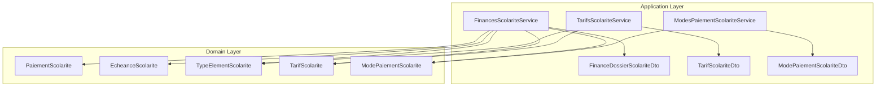
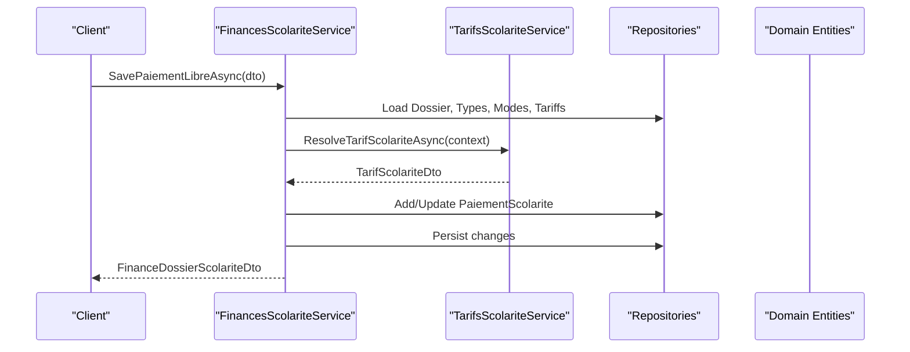
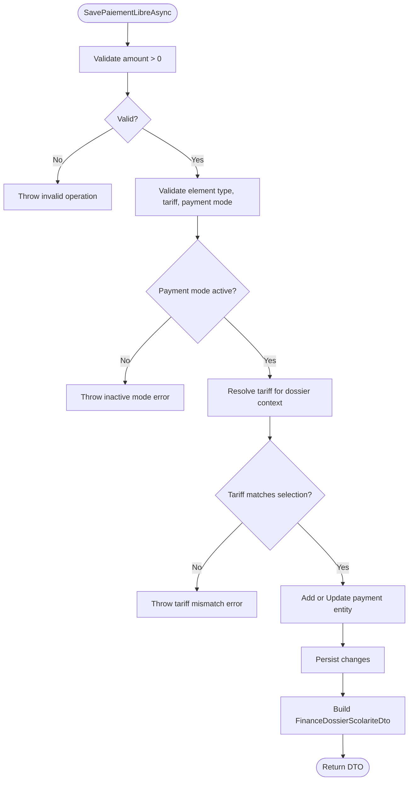
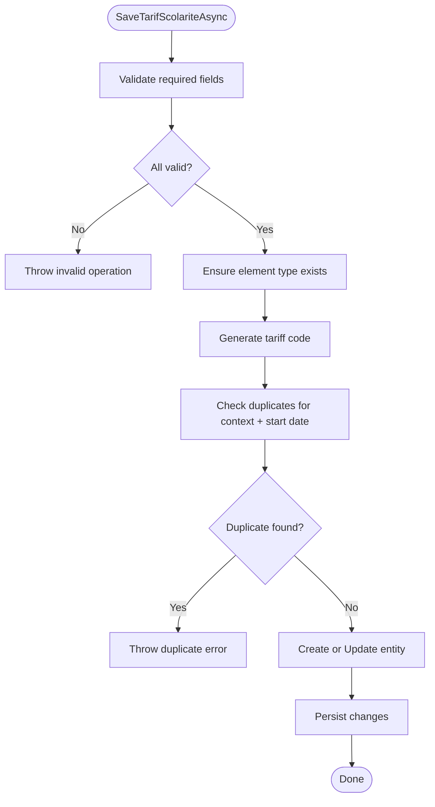
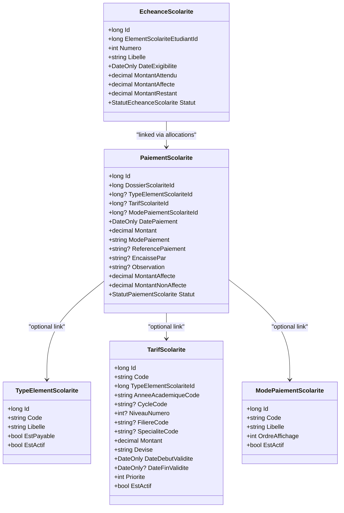
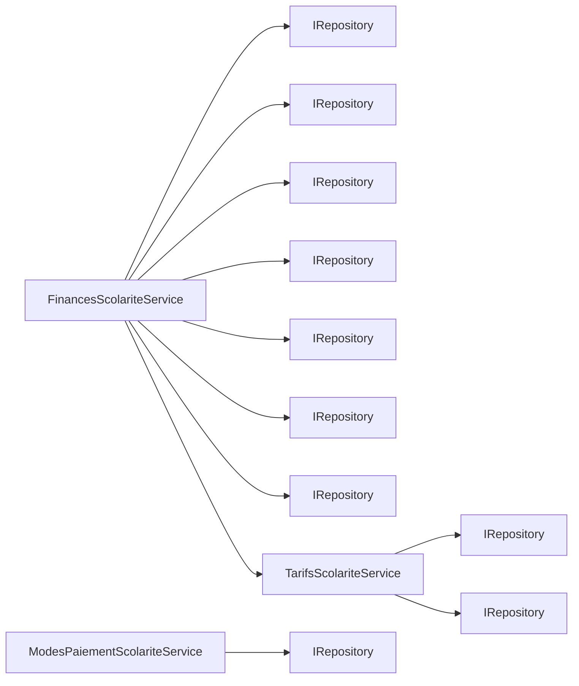

# Financial Administration APIs

<cite>
**Referenced Files in This Document**
- [FinancesScolariteService.cs](file://RIIS.Academic.Application/Scolarite/Services/FinancesScolariteService.cs)
- [ITarifsScolariteService.cs](file://RIIS.Academic.Application/Scolarite/Services/ITarifsScolariteService.cs)
- [TarifsScolariteService.cs](file://RIIS.Academic.Application/Scolarite/Services/TarifsScolariteService.cs)
- [IModesPaiementScolariteService.cs](file://RIIS.Academic.Application/Scolarite/Services/IModesPaiementScolariteService.cs)
- [ModesPaiementScolariteService.cs](file://RIIS.Academic.Application/Scolarite/Services/ModesPaiementScolariteService.cs)
- [FinanceDossierScolariteDto.cs](file://RIIS.Academic.Application/Scolarite/Dtos/FinanceDossierScolariteDto.cs)
- [TarifScolariteDto.cs](file://RIIS.Academic.Application/Scolarite/Dtos/TarifScolariteDto.cs)
- [ModePaiementScolariteDto.cs](file://RIIS.Academic.Application/Scolarite/Dtos/ModePaiementScolariteDto.cs)
- [EcheanceScolarite.cs](file://RIIS.Academic.Domain/Scolarite/EcheanceScolarite.cs)
- [PaiementScolarite.cs](file://RIIS.Academic.Domain/Scolarite/PaiementScolarite.cs)
- [TypeElementScolarite.cs](file://RIIS.Academic.Domain/Scolarite/TypeElementScolarite.cs)
- [TarifScolarite.cs](file://RIIS.Academic.Domain/Scolarite/TarifScolarite.cs)
- [ModePaiementScolarite.cs](file://RIIS.Academic.Domain/Scolarite/ModePaiementScolarite.cs)
</cite>

## Table of Contents
1. Introduction
2. Project Structure
3. Core Components
4. Architecture Overview
5. Detailed Component Analysis
6. Dependency Analysis
7. Performance Considerations
8. Troubleshooting Guide
9. Conclusion

## Introduction
This document specifies the financial administration API surface for managing tuition fees, processing payments, and handling financial transactions within the academic system. It covers endpoints for:
- Managing fee structures (tariffs)
- Processing free-form student payments
- Viewing and reconciling payment schedules (installments)
- Managing payment methods
- Reporting on student financial dossiers

The API is implemented as application services that expose operations over domain entities and DTOs. HTTP routing and controllers are not present in the analyzed files; this document defines the logical API contracts derived from service interfaces and DTOs.

## Project Structure
Financial administration functionality is organized under the Scolarite (Student Affairs) module:
- Application layer: Services and DTOs define business operations and request/response shapes
- Domain layer: Entities model students’ financial elements, installments, payments, tariffs, and payment methods

**Diagram sources**
- [FinancesScolariteService.cs:7-15](file://RIIS.Academic.Application/Scolarite/Services/FinancesScolariteService.cs#L7-L15)
- [TarifsScolariteService.cs:10-12](file://RIIS.Academic.Application/Scolarite/Services/TarifsScolariteService.cs#L10-L12)
- [ModesPaiementScolariteService.cs:7-8](file://RIIS.Academic.Application/Scolarite/Services/ModesPaiementScolariteService.cs#L7-L8)
- [FinanceDossierScolariteDto.cs:5-15](file://RIIS.Academic.Application/Scolarite/Dtos/FinanceDossierScolariteDto.cs#L5-L15)
- [TarifScolariteDto.cs:3-22](file://RIIS.Academic.Application/Scolarite/Dtos/TarifScolariteDto.cs#L3-L22)
- [ModePaiementScolariteDto.cs:3-10](file://RIIS.Academic.Application/Scolarite/Dtos/ModePaiementScolariteDto.cs#L3-L10)
- [PaiementScolarite.cs:3-28](file://RIIS.Academic.Domain/Scolarite/PaiementScolarite.cs#L3-L28)
- [EcheanceScolarite.cs:3-19](file://RIIS.Academic.Domain/Scolarite/EcheanceScolarite.cs#L3-L19)
- [TypeElementScolarite.cs:3-18](file://RIIS.Academic.Domain/Scolarite/TypeElementScolarite.cs#L3-L18)
- [TarifScolarite.cs:3-21](file://RIIS.Academic.Domain/Scolarite/TarifScolarite.cs#L3-L21)
- [ModePaiementScolarite.cs:3-12](file://RIIS.Academic.Domain/Scolarite/ModePaiementScolarite.cs#L3-L12)

**Section sources**
- [FinancesScolariteService.cs:7-15](file://RIIS.Academic.Application/Scolarite/Services/FinancesScolariteService.cs#L7-L15)
- [TarifsScolariteService.cs:10-12](file://RIIS.Academic.Application/Scolarite/Services/TarifsScolariteService.cs#L10-L12)
- [ModesPaiementScolariteService.cs:7-8](file://RIIS.Academic.Application/Scolarite/Services/ModesPaiementScolariteService.cs#L7-L8)

## Core Components
- FinancesScolariteService: Orchestrates student financial dossier data, including elements, installments, payments, and allocations. Provides operations to retrieve a full financial snapshot and save free-form payments.
- TarifsScolariteService: Manages tuition fee structures (tariffs), including listing, creating, updating, deleting, and resolving the applicable tariff for a given context.
- ModesPaiementScolariteService: Manages available payment methods (e.g., cash, bank transfer).

Key responsibilities:
- Payment creation/update with validation and status resolution
- Tariff resolution based on academic year, cycle, level, filiere, specialty, and validity dates
- Payment method CRUD with uniqueness constraints

**Section sources**
- [FinancesScolariteService.cs:17-141](file://RIIS.Academic.Application/Scolarite/Services/FinancesScolariteService.cs#L17-L141)
- [TarifsScolariteService.cs:14-193](file://RIIS.Academic.Application/Scolarite/Services/TarifsScolariteService.cs#L14-L193)
- [ModesPaiementScolariteService.cs:10-73](file://RIIS.Academic.Application/Scolarite/Services/ModesPaiementScolariteService.cs#L10-L73)

## Architecture Overview
The financial API follows a layered architecture:
- Application services encapsulate business logic and coordinate repositories
- Domain entities represent core financial concepts
- DTOs define stable request/response schemas for consumers

**Diagram sources**
- [FinancesScolariteService.cs:58-141](file://RIIS.Academic.Application/Scolarite/Services/FinancesScolariteService.cs#L58-L141)
- [TarifsScolariteService.cs:195-238](file://RIIS.Academic.Application/Scolarite/Services/TarifsScolariteService.cs#L195-L238)

## Detailed Component Analysis

### Financial Dossier Operations
Operations exposed by FinancesScolariteService:
- Get finance snapshot for a student dossier
- Retrieve available payment options per element type and tariff
- Save or update a free-form payment

Request/Response Schemas:
- Input: Free-form payment DTO fields include student dossier identifier, element type, tariff, payment mode, date, amount, reference, cashier, observation, and optional existing payment id for updates
- Output: Financial dossier DTO containing totals, elements, installments, payments, and allocations

Validation and Business Rules:
- Amount must be greater than zero
- Element type, tariff, and payment mode must be valid and active
- Resolved tariff must match the selected tariff for the dossier
- Update cannot reduce total below already allocated amount
- Payment status computed from allocated vs total amounts

**Diagram sources**
- [FinancesScolariteService.cs:58-141](file://RIIS.Academic.Application/Scolarite/Services/FinancesScolariteService.cs#L58-L141)
- [FinancesScolariteService.cs:143-193](file://RIIS.Academic.Application/Scolarite/Services/FinancesScolariteService.cs#L143-L193)
- [FinancesScolariteService.cs:332-342](file://RIIS.Academic.Application/Scolarite/Services/FinancesScolariteService.cs#L332-L342)

**Section sources**
- [FinancesScolariteService.cs:17-141](file://RIIS.Academic.Application/Scolarite/Services/FinancesScolariteService.cs#L17-L141)
- [FinanceDossierScolariteDto.cs:5-84](file://RIIS.Academic.Application/Scolarite/Dtos/FinanceDossierScolariteDto.cs#L5-L84)

### Fee Structure Management (Tariffs)
Operations exposed by TarifsScolariteService:
- List tariffs with filters (element type, academic year, cycle, level, filiere, specialty, include inactive)
- Get single tariff by id
- Create default tariff template
- Generate tariff code
- Save tariff (create/update) with validations and duplicate checks
- Delete tariff
- Resolve applicable tariff for a given context

Request/Response Schemas:
- Input: TarifScolariteDto fields include element type, academic year, cycle, level, filiere, specialty, amount, currency, validity dates, priority, active flag
- Output: List or single TarifScolariteDto with enriched labels and context description

Business Rules:
- Mandatory fields validated (element type, academic year, currency, amount, level number)
- Validity dates must be ordered correctly
- Duplicate prevention across matching context and start date
- Code generation based on normalized segments
- Priority auto-calculated if not provided

**Diagram sources**
- [TarifsScolariteService.cs:107-193](file://RIIS.Academic.Application/Scolarite/Services/TarifsScolariteService.cs#L107-L193)
- [TarifsScolariteService.cs:250-268](file://RIIS.Academic.Application/Scolarite/Services/TarifsScolariteService.cs#L250-L268)

**Section sources**
- [ITarifsScolariteService.cs:5-37](file://RIIS.Academic.Application/Scolarite/Services/ITarifsScolariteService.cs#L5-L37)
- [TarifsScolariteService.cs:14-193](file://RIIS.Academic.Application/Scolarite/Services/TarifsScolariteService.cs#L14-L193)
- [TarifScolariteDto.cs:3-22](file://RIIS.Academic.Application/Scolarite/Dtos/TarifScolariteDto.cs#L3-L22)

### Payment Methods Management
Operations exposed by ModesPaiementScolariteService:
- List payment methods (optionally include inactive)
- Create default payment method template
- Save payment method (create/update) with uniqueness constraint on code
- Delete payment method

Request/Response Schemas:
- Input: ModePaiementScolariteDto fields include code, label, display order, active flag
- Output: List or single ModePaiementScolariteDto

Business Rules:
- Code and label are mandatory
- Unique code enforced across all records

**Section sources**
- [IModesPaiementScolariteService.cs:5-20](file://RIIS.Academic.Application/Scolarite/Services/IModesPaiementScolariteService.cs#L5-L20)
- [ModesPaiementScolariteService.cs:10-73](file://RIIS.Academic.Application/Scolarite/Services/ModesPaiementScolariteService.cs#L10-L73)
- [ModePaiementScolariteDto.cs:3-10](file://RIIS.Academic.Application/Scolarite/Dtos/ModePaiementScolariteDto.cs#L3-L10)

### Data Models and Relationships
Core domain models involved in financial administration:
- Student financial element (per student): expected, allocated, remaining amounts, status
- Installment (per element): due date, number, label, expected, allocated, remaining, status
- Payment: linked to student dossier, optional element/tariff/mode references, amount, allocation tracking, status
- Tariff: links element type to monetary value with context and validity
- Payment method: code, label, ordering, active flag

**Diagram sources**
- [PaiementScolarite.cs:3-28](file://RIIS.Academic.Domain/Scolarite/PaiementScolarite.cs#L3-L28)
- [EcheanceScolarite.cs:3-19](file://RIIS.Academic.Domain/Scolarite/EcheanceScolarite.cs#L3-L19)
- [TypeElementScolarite.cs:3-18](file://RIIS.Academic.Domain/Scolarite/TypeElementScolarite.cs#L3-L18)
- [TarifScolarite.cs:3-21](file://RIIS.Academic.Domain/Scolarite/TarifScolarite.cs#L3-L21)
- [ModePaiementScolarite.cs:3-12](file://RIIS.Academic.Domain/Scolarite/ModePaiementScolarite.cs#L3-L12)

## Dependency Analysis
- FinancesScolariteService depends on multiple repositories and TarifsScolariteService to resolve applicable tariffs during payment operations
- TarifsScolariteService depends on repositories for tariffs and element types, enforcing uniqueness and generating codes
- ModesPaiementScolariteService depends on payment method repository with uniqueness enforcement

**Diagram sources**
- [FinancesScolariteService.cs:7-15](file://RIIS.Academic.Application/Scolarite/Services/FinancesScolariteService.cs#L7-L15)
- [TarifsScolariteService.cs:10-12](file://RIIS.Academic.Application/Scolarite/Services/TarifsScolariteService.cs#L10-L12)
- [ModesPaiementScolariteService.cs:7-8](file://RIIS.Academic.Application/Scolarite/Services/ModesPaiementScolariteService.cs#L7-L8)

**Section sources**
- [FinancesScolariteService.cs:7-15](file://RIIS.Academic.Application/Scolarite/Services/FinancesScolariteService.cs#L7-L15)
- [TarifsScolariteService.cs:10-12](file://RIIS.Academic.Application/Scolarite/Services/TarifsScolariteService.cs#L10-L12)
- [ModesPaiementScolariteService.cs:7-8](file://RIIS.Academic.Application/Scolarite/Services/ModesPaiementScolariteService.cs#L7-L8)

## Performance Considerations
- Batch loading: The financial dossier builder aggregates related entities (elements, installments, payments, allocations) to minimize round-trips
- Filtering: Tariff listing supports filtering by multiple dimensions to reduce payload size
- Indexing: Ensure database indexes on foreign keys (dossier ids, element ids, tariff ids) and frequently filtered columns (academic year, cycle, level, filiere, specialty)
- Caching: Consider caching static lookups like element types and payment methods when accessed frequently

[No sources needed since this section provides general guidance]

## Troubleshooting Guide
Common errors and their causes:
- Invalid payment amount: Ensure amount is greater than zero
- Missing or inactive payment mode: Verify mode exists and is active before saving
- Tariff mismatch: The resolved tariff for the dossier must match the selected tariff; re-resolve if context changed
- Duplicate tariff: Avoid creating tariffs with identical element type, context, and start date
- Insufficient allocation: When updating a payment, do not reduce total below already allocated amount

Operational tips:
- Use list endpoints with filters to validate inputs before create/update
- Normalize codes and labels consistently to avoid mismatches
- Audit logs should capture who created/updated financial records and allocations

**Section sources**
- [FinancesScolariteService.cs:65-94](file://RIIS.Academic.Application/Scolarite/Services/FinancesScolariteService.cs#L65-L94)
- [TarifsScolariteService.cs:111-136](file://RIIS.Academic.Application/Scolarite/Services/TarifsScolariteService.cs#L111-L136)
- [TarifsScolariteService.cs:250-268](file://RIIS.Academic.Application/Scolarite/Services/TarifsScolariteService.cs#L250-L268)
- [ModesPaiementScolariteService.cs:34-41](file://RIIS.Academic.Application/Scolarite/Services/ModesPaiementScolariteService.cs#L34-L41)

## Conclusion
The financial administration API provides robust capabilities for managing tuition fee structures, processing student payments, and reporting on financial dossiers. By adhering to the defined DTOs and business rules, clients can implement secure and compliant workflows for fee management and payment reconciliation. Proper validation, uniqueness checks, and context-aware tariff resolution ensure data integrity and auditability.

[No sources needed since this section summarizes without analyzing specific files]