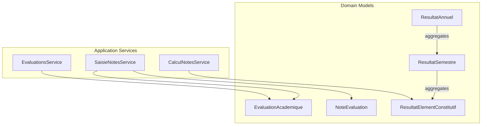
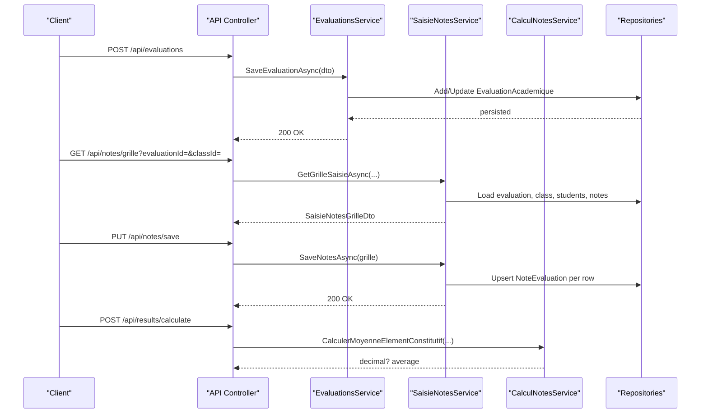
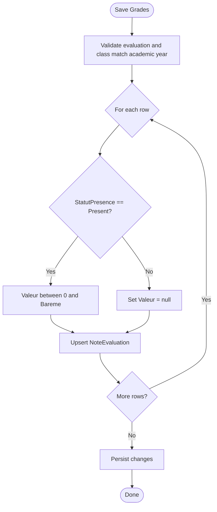
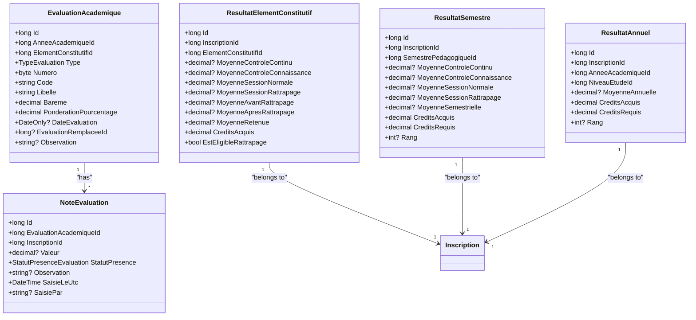
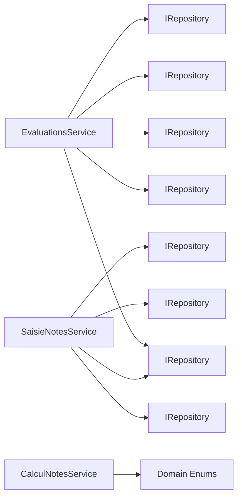

# Grade Management APIs

<cite>
**Referenced Files in This Document**
- [EvaluationsService.cs](file://RIIS.Academic.Application/Evaluations/Services/EvaluationsService.cs)
- [EvaluationAcademiqueDto.cs](file://RIIS.Academic.Application/Evaluations/Dtos/EvaluationAcademiqueDto.cs)
- [SaisieNotesService.cs](file://RIIS.Academic.Application/Notes/Services/SaisieNotesService.cs)
- [SaisieNoteLigneDto.cs](file://RIIS.Academic.Application/Notes/Dtos/SaisieNoteLigneDto.cs)
- [SaisieNotesGrilleDto.cs](file://RIIS.Academic.Application/Notes/Dtos/SaisieNotesGrilleDto.cs)
- [CalculNotesService.cs](file://RIIS.Academic.Application/Notes/Services/CalculNotesService.cs)
- [EvaluationAcademique.cs](file://RIIS.Academic.Domain/Notes/EvaluationAcademique.cs)
- [NoteEvaluation.cs](file://RIIS.Academic.Domain/Notes/NoteEvaluation.cs)
- [ResultatElementConstitutif.cs](file://RIIS.Academic.Domain/Notes/ResultatElementConstitutif.cs)
- [ResultatSemestre.cs](file://RIIS.Academic.Domain/Notes/ResultatSemestre.cs)
- [ResultatAnnuel.cs](file://RIIS.Academic.Domain/Notes/ResultatAnnuel.cs)
- [TypeEvaluation.cs](file://RIIS.Academic.Domain/Enums/TypeEvaluation.cs)
- [StatutPresenceEvaluation.cs](file://RIIS.Academic.Domain/Enums/StatutPresenceEvaluation.cs)
</cite>

## Table of Contents
1. Introduction
2. Project Structure
3. Core Components
4. Architecture Overview
5. Detailed Component Analysis
6. Dependency Analysis
7. Performance Considerations
8. Troubleshooting Guide
9. Conclusion

## Introduction
This document specifies the API surface for grade management and evaluation endpoints, focusing on:
- Managing evaluations (create, update, delete, list)
- Entering grades per student per evaluation
- Computing academic results at element, semester, and annual levels
It defines HTTP methods, URL patterns, request/response schemas, validation rules, and calculation algorithms with examples and diagrams.

## Project Structure
The grade management functionality is implemented across application services and domain models:
- Evaluations service handles evaluation lifecycle and lookups
- Notes service handles grade entry grids and persistence
- Calculation service implements scoring formulas and eligibility logic
- Domain models define evaluation, note, and result entities

**Diagram sources**
- [EvaluationsService.cs:1-643](file://RIIS.Academic.Application/Evaluations/Services/EvaluationsService.cs#L1-L643)
- [SaisieNotesService.cs:1-317](file://RIIS.Academic.Application/Notes/Services/SaisieNotesService.cs#L1-L317)
- [CalculNotesService.cs:1-25](file://RIIS.Academic.Application/Notes/Services/CalculNotesService.cs#L1-L25)
- [EvaluationAcademique.cs:1-24](file://RIIS.Academic.Domain/Notes/EvaluationAcademique.cs#L1-L24)
- [NoteEvaluation.cs:1-17](file://RIIS.Academic.Domain/Notes/NoteEvaluation.cs#L1-L17)
- [ResultatElementConstitutif.cs:1-23](file://RIIS.Academic.Domain/Notes/ResultatElementConstitutif.cs#L1-L23)
- [ResultatSemestre.cs:1-23](file://RIIS.Academic.Domain/Notes/ResultatSemestre.cs#L1-L23)
- [ResultatAnnuel.cs:1-21](file://RIIS.Academic.Domain/Notes/ResultatAnnuel.cs#L1-L21)

**Section sources**
- [EvaluationsService.cs:1-643](file://RIIS.Academic.Application/Evaluations/Services/EvaluationsService.cs#L1-L643)
- [SaisieNotesService.cs:1-317](file://RIIS.Academic.Application/Notes/Services/SaisieNotesService.cs#L1-L317)
- [CalculNotesService.cs:1-25](file://RIIS.Academic.Application/Notes/Services/CalculNotesService.cs#L1-L25)

## Core Components
- Evaluation management: CRUD and filtering by academic year, cycle, semester, unit, component, type; default creation helpers; lookup providers
- Grade entry: grid retrieval with eligibility hints; bulk save with presence and value validation
- Results computation: weighted average per component, eligibility for retake, credits acquisition

Key DTOs:
- EvaluationAcademiqueDto: evaluation metadata, weights, dates, replacement mapping
- SaisieNotesGrilleDto: grid header and rows for grade entry
- SaisieNoteLigneDto: per-student row with score, attendance, observation, eligibility flags

Enumerations:
- TypeEvaluation: ControleContinu, ControleConnaissance, SessionNormale, SessionRattrapage
- StatutPresenceEvaluation: Present, AbsenceJustifiee, AbsenceNonJustifiee, Dispense

**Section sources**
- [EvaluationAcademiqueDto.cs:1-30](file://RIIS.Academic.Application/Evaluations/Dtos/EvaluationAcademiqueDto.cs#L1-L30)
- [SaisieNotesGrilleDto.cs:1-20](file://RIIS.Academic.Application/Notes/Dtos/SaisieNotesGrilleDto.cs#L1-L20)
- [SaisieNoteLigneDto.cs:1-18](file://RIIS.Academic.Application/Notes/Dtos/SaisieNoteLigneDto.cs#L1-L18)
- [TypeEvaluation.cs:1-10](file://RIIS.Academic.Domain/Enums/TypeEvaluation.cs#L1-L10)
- [StatutPresenceEvaluation.cs:1-10](file://RIIS.Academic.Domain/Enums/StatutPresenceEvaluation.cs#L1-L10)

## Architecture Overview
The API layer exposes REST endpoints that delegate to application services. Services orchestrate data access via repositories and enforce business rules. Domain models represent core entities and relationships.

**Diagram sources**
- [EvaluationsService.cs:172-294](file://RIIS.Academic.Application/Evaluations/Services/EvaluationsService.cs#L172-L294)
- [SaisieNotesService.cs:126-295](file://RIIS.Academic.Application/Notes/Services/SaisieNotesService.cs#L126-L295)
- [CalculNotesService.cs:9-23](file://RIIS.Academic.Application/Notes/Services/CalculNotesService.cs#L9-L23)

## Detailed Component Analysis

### Evaluation Management Endpoints
Endpoints for creating, updating, deleting, and listing evaluations, plus helper lookups.

- Create default evaluation template
  - Method: POST
  - URL: /api/evaluations/default
  - Query: anneeAcademiqueId?, elementConstitutifId?, type?
  - Response: EvaluationAcademiqueDto (pre-filled code, label, weight, number)
  - Behavior: Computes next number and code prefix based on type; defaults active academic year if none provided

- Save or update evaluation
  - Method: POST/PUT
  - URL: /api/evaluations
  - Request: EvaluationAcademiqueDto
  - Response: 200 OK or error
  - Validation:
    - Academic year, EC, code, label required
    - Bareme > 0
    - PonderationPourcentage between 0 and 100
    - Retake session must reference a normal session in same year and EC
    - Only one session of each type per EC/year; unique number within type/year/EC

- Delete evaluation
  - Method: DELETE
  - URL: /api/evaluations/{id}
  - Response: 200 OK

- List evaluations
  - Method: GET
  - URL: /api/evaluations
  - Query: anneeAcademiqueId?, cycleFormationId?, semestrePedagogiqueId?, uniteEnseignementId?, elementConstitutifId?, type?
  - Response: List<EvaluationAcademiqueDto> sorted by academic year, cycle, semester, unit, component, type, number

- Lookups
  - GET /api/evaluations/annees
  - GET /api/evaluations/cycles
  - GET /api/evaluations/semestres?anneeAcademiqueId?&cycleFormationId?
  - GET /api/evaluations/unites?anneeAcademiqueId?&cycleFormationId?&semestrePedagogiqueId?
  - GET /api/evaluations/components?anneeAcademiqueId?&cycleFormationId?&semestrePedagogiqueId?&uniteEnseignementId?
  - GET /api/evaluations/sessions-normales?anneeAcademiqueId?&elementConstitutifId?

Request/Response Schema:
- EvaluationAcademiqueDto fields: Id, AnneeAcademiqueId, ElementConstitutifId, UniteEnseignementId, SemestrePedagogiqueId, CycleFormationId, Type, Numero, Code, Libelle, Bareme, PonderationPourcentage, DateEvaluation, EvaluationRemplaceeId, Observation

Validation Rules:
- Required fields enforced before persistence
- Duplicate checks for sessions and numbers
- Retake constraints validated against referenced normal session

Error Handling:
- Throws explicit errors for missing references, invalid ranges, duplicates, and constraint violations

Example Workflow:
- Create default CC for an EC in current year
- Adjust weights and schedule date
- Save and verify uniqueness

**Section sources**
- [EvaluationsService.cs:18-120](file://RIIS.Academic.Application/Evaluations/Services/EvaluationsService.cs#L18-L120)
- [EvaluationsService.cs:142-170](file://RIIS.Academic.Application/Evaluations/Services/EvaluationsService.cs#L142-L170)
- [EvaluationsService.cs:172-294](file://RIIS.Academic.Application/Evaluations/Services/EvaluationsService.cs#L172-L294)
- [EvaluationsService.cs:296-300](file://RIIS.Academic.Application/Evaluations/Services/EvaluationsService.cs#L296-L300)
- [EvaluationsService.cs:302-523](file://RIIS.Academic.Application/Evaluations/Services/EvaluationsService.cs#L302-L523)
- [EvaluationAcademiqueDto.cs:1-30](file://RIIS.Academic.Application/Evaluations/Dtos/EvaluationAcademiqueDto.cs#L1-L30)

### Grade Entry Endpoints
Endpoints to retrieve and submit grade grids for evaluations.

- Retrieve grade grid
  - Method: GET
  - URL: /api/notes/grille
  - Query: evaluationAcademiqueId, classePedagogiqueId
  - Response: SaisieNotesGrilleDto
  - Behavior:
    - Validates evaluation and class belong to same academic year
    - For retake sessions, filters eligible students based on semester results (credits acquired < required)
    - Returns existing notes and attendance status per student

- Save grades
  - Method: PUT
  - URL: /api/notes/save
  - Request: SaisieNotesGrilleDto
  - Response: 200 OK
  - Validation:
    - Each row’s InscriptionId must belong to selected class and academic year
    - If present, Valeur must be between 0 and Bareme
    - Non-present rows clear values
    - Upserts NoteEvaluation per row with timestamps and operator

Request/Response Schema:
- SaisieNotesGrilleDto: EvaluationAcademiqueId, ClassePedagogiqueId, labels, TypeEvaluation, Bareme, PonderationPourcentage, Avertissement, Lignes[]
- SaisieNoteLigneDto: NoteEvaluationId, InscriptionId, Matricule, NomComplet, Valeur?, StatutPresence, Observation?, CreditsSemestreAcquis?, CreditsSemestreRequis?, EstEligibleSessionRattrapage

Validation Rules:
- Presence vs value coupling: only present students can have scores
- Score range enforced per evaluation’s Bareme
- Integrity checks ensure rows belong to the correct context

Error Handling:
- Throws when evaluation/class not found, mismatched academic years, or invalid rows

Example Workflow:
- Fetch grid for SN session
- Enter scores for present students
- Save and confirm persistence

**Diagram sources**
- [SaisieNotesService.cs:230-295](file://RIIS.Academic.Application/Notes/Services/SaisieNotesService.cs#L230-L295)

**Section sources**
- [SaisieNotesService.cs:126-228](file://RIIS.Academic.Application/Notes/Services/SaisieNotesService.cs#L126-L228)
- [SaisieNotesService.cs:230-295](file://RIIS.Academic.Application/Notes/Services/SaisieNotesService.cs#L230-L295)
- [SaisieNotesGrilleDto.cs:1-20](file://RIIS.Academic.Application/Notes/Dtos/SaisieNotesGrilleDto.cs#L1-L20)
- [SaisieNoteLigneDto.cs:1-18](file://RIIS.Academic.Application/Notes/Dtos/SaisieNoteLigneDto.cs#L1-L18)

### Results Computation Endpoints
Endpoints to compute aggregated academic results using defined algorithms.

- Compute component average
  - Method: POST
  - URL: /api/results/component-average
  - Request: { moyenneControleContinu, moyenneControleConnaissance, moyenneSessionNormaleOuRetake }
  - Response: decimal? average
  - Algorithm: Weighted sum with 20% CC, 10% CCN, 70% SN/SR; rounded to two decimals

- Determine retake eligibility
  - Method: POST
  - URL: /api/results/retake-eligibility
  - Request: { moyenneElementConstitutif }
  - Response: boolean
  - Rule: Eligible if average < 10

- Compute credits acquired for a component
  - Method: POST
  - URL: /api/results/credits-acquired
  - Request: { elementConstitutifCredits, moyenneRetenue }
  - Response: decimal
  - Rule: If moyenneRetenue >= 10 then credits else 0

Aggregation Levels:
- ResultatElementConstitutif: stores averages per assessment type, retained average, credits, eligibility, and validation status
- ResultatSemestre: aggregates across components for a semester, including total credits, ranking, decision
- ResultatAnnuel: aggregates across semesters for the academic year, including total credits, ranking, decision

Data Model Relationships:
- ResultatElementConstitutif links to Inscription and ElementConstitutif
- ResultatSemestre links to Inscription and SemestrePedagogique
- ResultatAnnuel links to Inscription, AnneeAcademique, NiveauEtude

**Diagram sources**
- [EvaluationAcademique.cs:1-24](file://RIIS.Academic.Domain/Notes/EvaluationAcademique.cs#L1-L24)
- [NoteEvaluation.cs:1-17](file://RIIS.Academic.Domain/Notes/NoteEvaluation.cs#L1-L17)
- [ResultatElementConstitutif.cs:1-23](file://RIIS.Academic.Domain/Notes/ResultatElementConstitutif.cs#L1-L23)
- [ResultatSemestre.cs:1-23](file://RIIS.Academic.Domain/Notes/ResultatSemestre.cs#L1-L23)
- [ResultatAnnuel.cs:1-21](file://RIIS.Academic.Domain/Notes/ResultatAnnuel.cs#L1-L21)

**Section sources**
- [CalculNotesService.cs:9-23](file://RIIS.Academic.Application/Notes/Services/CalculNotesService.cs#L9-L23)
- [ResultatElementConstitutif.cs:1-23](file://RIIS.Academic.Domain/Notes/ResultatElementConstitutif.cs#L1-L23)
- [ResultatSemestre.cs:1-23](file://RIIS.Academic.Domain/Notes/ResultatSemestre.cs#L1-L23)
- [ResultatAnnuel.cs:1-21](file://RIIS.Academic.Domain/Notes/ResultatAnnuel.cs#L1-L21)

## Dependency Analysis
- EvaluationsService depends on multiple repositories to build filtered lists and perform validations
- SaisieNotesService depends on evaluation, class, inscription, student, and note repositories to assemble and persist grade grids
- CalculNotesService is stateless and provides pure functions for averages, eligibility, and credits
- Domain models define relationships that drive aggregation flows from component to semester to annual results

**Diagram sources**
- [EvaluationsService.cs:8-16](file://RIIS.Academic.Application/Evaluations/Services/EvaluationsService.cs#L8-L16)
- [SaisieNotesService.cs:8-17](file://RIIS.Academic.Application/Notes/Services/SaisieNotesService.cs#L8-L17)
- [TypeEvaluation.cs:1-10](file://RIIS.Academic.Domain/Enums/TypeEvaluation.cs#L1-L10)

**Section sources**
- [EvaluationsService.cs:8-16](file://RIIS.Academic.Application/Evaluations/Services/EvaluationsService.cs#L8-L16)
- [SaisieNotesService.cs:8-17](file://RIIS.Academic.Application/Notes/Services/SaisieNotesService.cs#L8-L17)

## Performance Considerations
- Use query parameters to filter evaluations and lookups to minimize payload sizes
- Batch operations are already supported via grid save; ensure client sends complete grids to reduce round-trips
- Avoid loading entire datasets without filters; leverage provided lookup endpoints with appropriate query parameters
- For large cohorts, consider pagination on list endpoints if added later

## Troubleshooting Guide
Common validation errors and their causes:
- Missing academic year, EC, code, or label when saving evaluation
- Invalid bareme or ponderation percentage
- Retake session referencing non-normal or mismatched session
- Duplicate session or duplicate number within same type/year/EC
- Grade out of range for present students
- Row belonging to wrong class or academic year during save

Resolution steps:
- Verify required fields and ranges before submission
- Ensure retake sessions reference valid normal sessions in the same year and EC
- Confirm student rows belong to the selected class and academic year
- Re-fetch grids after failures to refresh state

**Section sources**
- [EvaluationsService.cs:172-254](file://RIIS.Academic.Application/Evaluations/Services/EvaluationsService.cs#L172-L254)
- [SaisieNotesService.cs:126-140](file://RIIS.Academic.Application/Notes/Services/SaisieNotesService.cs#L126-L140)
- [SaisieNotesService.cs:230-295](file://RIIS.Academic.Application/Notes/Services/SaisieNotesService.cs#L230-L295)

## Conclusion
The grade management APIs provide a robust foundation for evaluating students, entering grades, and computing academic results. The services enforce strong validation and business rules, while domain models support multi-level aggregation. Clients should use the provided endpoints and adhere to the documented schemas and validation rules to ensure consistent and accurate academic records.