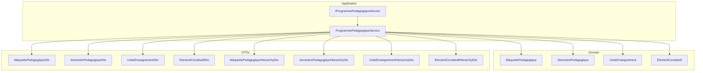
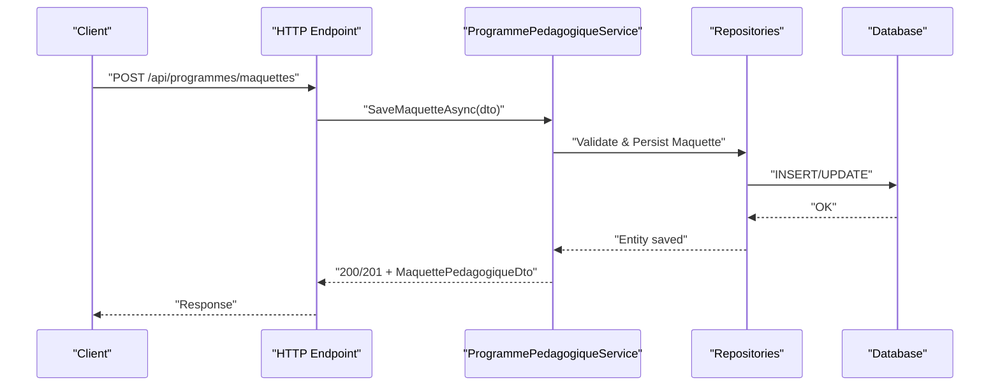
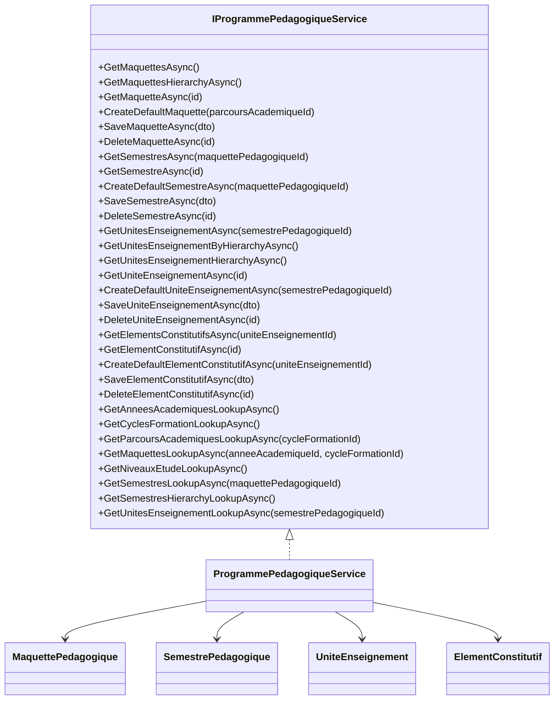

# Program Management APIs

<cite>
**Referenced Files in This Document**
- [IProgrammePedagogiqueService.cs](file://RIIS.Academic.Application/Programmes/Services/IProgrammePedagogiqueService.cs)
- [ProgrammePedagogiqueService.cs](file://RIIS.Academic.Application/Programmes/Services/ProgrammePedagogiqueService.cs)
- [MaquettePedagogiqueDto.cs](file://RIIS.Academic.Application/Programmes/Dtos/MaquettePedagogiqueDto.cs)
- [SemestrePedagogiqueDto.cs](file://RIIS.Academic.Application/Programmes/Dtos/SemestrePedagogiqueDto.cs)
- [UniteEnseignementDto.cs](file://RIIS.Academic.Application/Programmes/Dtos/UniteEnseignementDto.cs)
- [ElementConstitutifDto.cs](file://RIIS.Academic.Application/Programmes/Dtos/ElementConstitutifDto.cs)
- [MaquettePedagogiqueHierarchyDto.cs](file://RIIS.Academic.Application/Programmes/Dtos/MaquettePedagogiqueHierarchyDto.cs)
- [SemestrePedagogiqueHierarchyDto.cs](file://RIIS.Academic.Application/Programmes/Dtos/SemestrePedagogiqueHierarchyDto.cs)
- [UniteEnseignementHierarchyDto.cs](file://RIIS.Academic.Application/Programmes/Dtos/UniteEnseignementHierarchyDto.cs)
- [ElementConstitutifHierarchyDto.cs](file://RIIS.Academic.Application/Programmes/Dtos/ElementConstitutifHierarchyDto.cs)
- [MaquettePedagogique.cs](file://RIIS.Academic.Domain/Programmes/MaquettePedagogique.cs)
- [SemestrePedagogique.cs](file://RIIS.Academic.Domain/Programmes/SemestrePedagogique.cs)
- [UniteEnseignement.cs](file://RIIS.Academic.Domain/Programmes/UniteEnseignement.cs)
- [ElementConstitutif.cs](file://RIIS.Academic.Domain/Programmes/ElementConstitutif.cs)
</cite>

## Table of Contents
1. [Introduction](#introduction)
2. [Project Structure](#project-structure)
3. [Core Components](#core-components)
4. [Architecture Overview](#architecture-overview)
5. [Detailed Component Analysis](#detailed-component-analysis)
6. [Dependency Analysis](#dependency-analysis)
7. [Performance Considerations](#performance-considerations)
8. [Troubleshooting Guide](#troubleshooting-guide)
9. [Conclusion](#conclusion)

## Introduction
This document specifies the API surface for managing academic program hierarchies: cycles, filieres, parcours, maquettes (program versions), semesters, course units (unites d’enseignement), and constituent elements (elements constitutifs). It focuses on endpoints that create and manage program structures, organize semester schedules, and handle course unit composition. Where applicable, it also documents validation rules enforced by the service layer to maintain structural integrity and business constraints.

Note: The repository exposes an application service interface and implementation for program management. HTTP endpoint definitions are not present in this codebase; therefore, this document maps each service method to a recommended RESTful endpoint specification with request/response schemas derived from the DTOs.

## Project Structure
The program management feature spans three layers:
- Domain: Entities representing programs, semesters, course units, and constituent elements.
- Application: Service interface and implementation orchestrating operations and enforcing business rules.
- Data transfer objects (DTOs): Request and response models used by consumers.

**Diagram sources**
- [IProgrammePedagogiqueService.cs:6-64](file://RIIS.Academic.Application/Programmes/Services/IProgrammePedagogiqueService.cs#L6-L64)
- [ProgrammePedagogiqueService.cs:8-17](file://RIIS.Academic.Application/Programmes/Services/ProgrammePedagogiqueService.cs#L8-L17)
- [MaquettePedagogique.cs:5-30](file://RIIS.Academic.Domain/Programmes/MaquettePedagogique.cs#L5-L30)
- [SemestrePedagogique.cs:3-19](file://RIIS.Academic.Domain/Programmes/SemestrePedagogique.cs#L3-L19)
- [UniteEnseignement.cs:3-17](file://RIIS.Academic.Domain/Programmes/UniteEnseignement.cs#L3-L17)
- [ElementConstitutif.cs:3-20](file://RIIS.Academic.Domain/Programmes/ElementConstitutif.cs#L3-L20)

**Section sources**
- [IProgrammePedagogiqueService.cs:6-64](file://RIIS.Academic.Application/Programmes/Services/IProgrammePedagogiqueService.cs#L6-L64)
- [ProgrammePedagogiqueService.cs:8-17](file://RIIS.Academic.Application/Programmes/Services/ProgrammePedagogiqueService.cs#L8-L17)

## Core Components
- Maquette (Program Version): Represents a versioned academic program tied to a parcours (cycle/filiere/specialite). Supports validity dates and status.
- Semester: A numbered period within a maquette with expected credits and teaching hours.
- Course Unit (UE): A module within a semester with credits, teaching hours, ordering, and mandatory flag.
- Constituent Element (EC): A component of a UE (e.g., lecture, lab) with type, coefficient, credits, and hours.

These components form a strict hierarchy: Maquette → Semesters → Units → Elements.

**Section sources**
- [MaquettePedagogique.cs:5-30](file://RIIS.Academic.Domain/Programmes/MaquettePedagogique.cs#L5-L30)
- [SemestrePedagogique.cs:3-19](file://RIIS.Academic.Domain/Programmes/SemestrePedagogique.cs#L3-L19)
- [UniteEnseignement.cs:3-17](file://RIIS.Academic.Domain/Programmes/UniteEnseignement.cs#L3-L17)
- [ElementConstitutif.cs:3-20](file://RIIS.Academic.Domain/Programmes/ElementConstitutif.cs#L3-L20)

## Architecture Overview
The API is implemented as a set of service methods that encapsulate CRUD and hierarchical queries. Consumers interact via HTTP endpoints that map to these methods. The service enforces validation and persistence through repositories.

**Diagram sources**
- [ProgrammePedagogiqueService.cs:151-226](file://RIIS.Academic.Application/Programmes/Services/ProgrammePedagogiqueService.cs#L151-L226)

## Detailed Component Analysis

### Maquette (Program Version) Endpoints
- GET /api/programmes/maquettes
  - Purpose: List all maquettes.
  - Response: Array of MaquettePedagogiqueDto.
- GET /api/programmes/maquettes/hierarchy
  - Query params: anneeAcademiqueId?, cycleFormationId?, maquettePedagogiqueId?
  - Purpose: Retrieve hierarchical view of maquettes with nested semesters, units, and elements.
  - Response: Array of MaquettePedagogiqueHierarchyDto.
- GET /api/programmes/maquettes/{id}
  - Purpose: Get a single maquette by id.
  - Response: MaquettePedagogiqueDto or null.
- POST /api/programmes/maquettes
  - Purpose: Create a new maquette.
  - Request body: MaquettePedagogiqueDto.
  - Validation rules enforced by service:
    - ParcoursAcademiqueId must be provided.
    - Code and Libelle required; Version required and normalized to uppercase.
    - Validity dates must satisfy DateFinValidite >= DateDebutValidite.
    - Unique constraint: same parcours + code + version cannot exist.
  - Response: Saved MaquettePedagogiqueDto.
- PUT /api/programmes/maquettes/{id}
  - Purpose: Update an existing maquette.
  - Request body: MaquettePedagogiqueDto.
  - Validation: Same as create.
  - Response: Updated MaquettePedagogiqueDto.
- DELETE /api/programmes/maquettes/{id}
  - Purpose: Delete a maquette.
  - Response: 204 No Content.

Request/Response Schemas
- MaquettePedagogiqueDto fields: Id, ParcoursAcademiqueId, ParcoursAcademiqueLibelle, Code, Libelle, Version, Statut, DateDebutValidite, DateFinValidite, SourceDocument, Observation, NombreSemestres.
- MaquettePedagogiqueHierarchyDto fields: Id, ParcoursAcademiqueId, ParcoursAcademiqueLibelle, Code, Libelle, Version, Statut, DateDebutValidite, DateFinValidite, SourceDocument, Observation, Semestres (list of SemestrePedagogiqueHierarchyDto).

Business Constraints
- Uniqueness: (Parcours, Code, Version) must be unique.
- Validity window: Start date <= End date.
- Required fields: Code, Libelle, Version, ParcoursAcademiqueId.

Example Operations
- Create a new versioned program for a given parcours with a valid date range.
- Fetch hierarchical structure filtered by academic year and cycle.

**Section sources**
- [IProgrammePedagogiqueService.cs:8-17](file://RIIS.Academic.Application/Programmes/Services/IProgrammePedagogiqueService.cs#L8-L17)
- [ProgrammePedagogiqueService.cs:19-226](file://RIIS.Academic.Application/Programmes/Services/ProgrammePedagogiqueService.cs#L19-L226)
- [MaquettePedagogiqueDto.cs:5-19](file://RIIS.Academic.Application/Programmes/Dtos/MaquettePedagogiqueDto.cs#L5-L19)
- [MaquettePedagogiqueHierarchyDto.cs:5-19](file://RIIS.Academic.Application/Programmes/Dtos/MaquettePedagogiqueHierarchyDto.cs#L5-L19)

### Semester Endpoints
- GET /api/programmes/semestres
  - Query param: maquettePedagogiqueId?
  - Purpose: List semesters, optionally filtered by maquette.
  - Response: Array of SemestrePedagogiqueDto.
- GET /api/programmes/semestres/{id}
  - Purpose: Get a single semester by id.
  - Response: SemestrePedagogiqueDto or null.
- POST /api/programmes/semestres/default
  - Purpose: Create default semester template for a given maquette.
  - Request body: None (or optional maquettePedagogiqueId in query).
  - Response: SemestrePedagogiqueDto with next number and defaults.
- POST /api/programmes/semestres
  - Purpose: Create a new semester.
  - Request body: SemestrePedagogiqueDto.
  - Validation rules enforced by service:
    - MaquettePedagogiqueId required.
    - Numero must be between 1 and 10.
    - CreditsAttendus and VolumeHoraireAttendu must be non-negative.
    - Libelle required.
    - OrdreAffichage defaults to Numero if zero.
    - Uniqueness: (Maquette, Numero) must be unique.
  - Response: Saved SemestrePedagogiqueDto.
- PUT /api/programmes/semestres/{id}
  - Purpose: Update an existing semester.
  - Request body: SemestrePedagogiqueDto.
  - Validation: Same as create.
  - Response: Updated SemestrePedagogiqueDto.
- DELETE /api/programmes/semestres/{id}
  - Purpose: Delete a semester.
  - Response: 204 No Content.

Request/Response Schemas
- SemestrePedagogiqueDto fields: Id, MaquettePedagogiqueId, MaquettePedagogiqueLibelle, NiveauEtudeId, NiveauEtudeLibelle, Numero, Libelle, CreditsAttendus, VolumeHoraireAttendu, OrdreAffichage, NombreUnitesEnseignement.

Business Constraints
- Numero range: 1–10.
- Non-negative credits and hours.
- Unique (Maquette, Numero).

Example Operations
- Create a semester with number 1 under a specific maquette.
- Retrieve all semesters for a maquette and order them by display order and number.

**Section sources**
- [IProgrammePedagogiqueService.cs:19-23](file://RIIS.Academic.Application/Programmes/Services/IProgrammePedagogiqueService.cs#L19-L23)
- [ProgrammePedagogiqueService.cs:234-358](file://RIIS.Academic.Application/Programmes/Services/ProgrammePedagogiqueService.cs#L234-L358)
- [SemestrePedagogiqueDto.cs:3-16](file://RIIS.Academic.Application/Programmes/Dtos/SemestrePedagogiqueDto.cs#L3-L16)

### Course Unit (UE) Endpoints
- GET /api/programmes/unites
  - Query param: semestrePedagogiqueId?
  - Purpose: List course units, optionally filtered by semester.
  - Response: Array of UniteEnseignementDto.
- GET /api/programmes/unites/hierarchy
  - Query params: anneeAcademiqueId?, cycleFormationId?, parcoursAcademiqueId?, semestrePedagogiqueId?
  - Purpose: Retrieve units grouped by filtered semesters with nested elements.
  - Response: Array of UniteEnseignementHierarchyDto.
- GET /api/programmes/unites/{id}
  - Purpose: Get a single unit by id.
  - Response: UniteEnseignementDto or null.
- POST /api/programmes/unites/default
  - Purpose: Create default unit template for a given semester.
  - Request body: None (or optional semestrePedagogiqueId in query).
  - Response: UniteEnseignementDto with next order and defaults.
- POST /api/programmes/unites
  - Purpose: Create a new unit.
  - Request body: UniteEnseignementDto.
  - Validation rules enforced by service:
    - SemestrePedagogiqueId required.
    - Credits and VolumeHoraire must be non-negative.
    - Code and Libelle required.
    - Uniqueness: (Semester, Code) must be unique.
  - Response: Saved UniteEnseignementDto.
- PUT /api/programmes/unites/{id}
  - Purpose: Update an existing unit.
  - Request body: UniteEnseignementDto.
  - Validation: Same as create.
  - Response: Updated UniteEnseignementDto.
- DELETE /api/programmes/unites/{id}
  - Purpose: Delete a unit.
  - Response: 204 No Content.

Request/Response Schemas
- UniteEnseignementDto fields: Id, SemestrePedagogiqueId, SemestrePedagogiqueLibelle, Code, Libelle, Credits, VolumeHoraire, OrdreAffichage, EstObligatoire, NombreElementsConstitutifs.
- UniteEnseignementHierarchyDto fields: Id, SemestrePedagogiqueId, SemestrePedagogiqueLibelle, Code, Libelle, Credits, VolumeHoraire, OrdreAffichage, EstObligatoire, ElementsConstitutifs (list of ElementConstitutifHierarchyDto).

Business Constraints
- Non-negative credits and hours.
- Unique (Semester, Code).

Example Operations
- Add a new unit to a semester with a unique code and positive credits.
- Retrieve units for a specific semester ordered by display order and code.

**Section sources**
- [IProgrammePedagogiqueService.cs:25-41](file://RIIS.Academic.Application/Programmes/Services/IProgrammePedagogiqueService.cs#L25-L41)
- [ProgrammePedagogiqueService.cs:360-580](file://RIIS.Academic.Application/Programmes/Services/ProgrammePedagogiqueService.cs#L360-L580)
- [UniteEnseignementDto.cs:3-15](file://RIIS.Academic.Application/Programmes/Dtos/UniteEnseignementDto.cs#L3-L15)
- [UniteEnseignementHierarchyDto.cs:3-15](file://RIIS.Academic.Application/Programmes/Dtos/UniteEnseignementHierarchyDto.cs#L3-L15)

### Constituent Element (EC) Endpoints
- GET /api/programmes/elements
  - Query param: uniteEnseignementId?
  - Purpose: List constituent elements, optionally filtered by unit.
  - Response: Array of ElementConstitutifDto.
- GET /api/programmes/elements/{id}
  - Purpose: Get a single element by id.
  - Response: ElementConstitutifDto or null.
- POST /api/programmes/elements/default
  - Purpose: Create default element template for a given unit.
  - Request body: None (or optional uniteEnseignementId in query).
  - Response: ElementConstitutifDto with next order and defaults.
- POST /api/programmes/elements
  - Purpose: Create a new element.
  - Request body: ElementConstitutifDto.
  - Validation rules enforced by service:
    - UniteEnseignementId required.
    - Credits, Coefficient, VolumeHoraire must be non-negative.
    - Libelle required; Code optional but normalized if provided.
    - Coefficient defaults to 1 if zero.
    - Uniqueness: (Unit, Code) must be unique when Code is provided.
    - Uniqueness: (Unit, OrdreAffichage) must be unique.
  - Response: Saved ElementConstitutifDto.
- PUT /api/programmes/elements/{id}
  - Purpose: Update an existing element.
  - Request body: ElementConstitutifDto.
  - Validation: Same as create.
  - Response: Updated ElementConstitutifDto.
- DELETE /api/programmes/elements/{id}
  - Purpose: Delete an element.
  - Response: 204 No Content.

Request/Response Schemas
- ElementConstitutifDto fields: Id, UniteEnseignementId, UniteEnseignementLibelle, Code, Libelle, Type, Credits, Coefficient, VolumeHoraire, OrdreAffichage, EstObligatoire, Observation.
- ElementConstitutifHierarchyDto fields: Id, Code, Libelle, Type, Credits, Coefficient, VolumeHoraire, OrdreAffichage, EstObligatoire, Observation.

Business Constraints
- Non-negative credits, coefficient, and hours.
- Unique (Unit, Code) when Code is present.
- Unique (Unit, OrdreAffichage).

Example Operations
- Add a lecture-type element to a unit with a unique code and positive hours.
- Retrieve all elements for a unit ordered by display order and label.

**Section sources**
- [IProgrammePedagogiqueService.cs:43-47](file://RIIS.Academic.Application/Programmes/Services/IProgrammePedagogiqueService.cs#L43-L47)
- [ProgrammePedagogiqueService.cs:582-718](file://RIIS.Academic.Application/Programmes/Services/ProgrammePedagogiqueService.cs#L582-L718)
- [ElementConstitutifDto.cs:5-19](file://RIIS.Academic.Application/Programmes/Dtos/ElementConstitutifDto.cs#L5-L19)
- [ElementConstitutifHierarchyDto.cs:5-17](file://RIIS.Academic.Application/Programmes/Dtos/ElementConstitutifHierarchyDto.cs#L5-L17)

### Lookup Endpoints
- GET /api/programmes/lookups/annees-academiques
  - Response: Array of LookupDto (Id, Libelle).
- GET /api/programmes/lookups/cycles
  - Response: Array of LookupDto (active cycles only).
- GET /api/programmes/lookups/parcours
  - Query param: cycleFormationId?
  - Response: Array of LookupDto (active parcours only).
- GET /api/programmes/lookups/maquettes
  - Query params: anneeAcademiqueId?, cycleFormationId?
  - Response: Array of LookupDto (filtered maquettes).
- GET /api/programmes/lookups/niveaux-etude
  - Response: Array of LookupDto.
- GET /api/programmes/lookups/semestres
  - Query param: maquettePedagogiqueId?
  - Response: Array of LookupDto.
- GET /api/programmes/lookups/semestres-hierarchy
  - Query params: anneeAcademiqueId?, cycleFormationId?, parcoursAcademiqueId?
  - Response: Array of LookupDto (hierarchical semesters).
- GET /api/programmes/lookups/unites
  - Query param: semestrePedagogiqueId?
  - Response: Array of LookupDto.

These endpoints support UI dropdowns and filters across program management screens.

**Section sources**
- [IProgrammePedagogiqueService.cs:49-64](file://RIIS.Academic.Application/Programmes/Services/IProgrammePedagogiqueService.cs#L49-L64)
- [ProgrammePedagogiqueService.cs:720-779](file://RIIS.Academic.Application/Programmes/Services/ProgrammePedagogiqueService.cs#L720-L779)

## Dependency Analysis
The service depends on domain entities and repositories to enforce business rules and persist data. DTOs define the contract for requests and responses.

**Diagram sources**
- [IProgrammePedagogiqueService.cs:6-64](file://RIIS.Academic.Application/Programmes/Services/IProgrammePedagogiqueService.cs#L6-L64)
- [ProgrammePedagogiqueService.cs:8-17](file://RIIS.Academic.Application/Programmes/Services/ProgrammePedagogiqueService.cs#L8-L17)
- [MaquettePedagogique.cs:5-30](file://RIIS.Academic.Domain/Programmes/MaquettePedagogique.cs#L5-L30)
- [SemestrePedagogique.cs:3-19](file://RIIS.Academic.Domain/Programmes/SemestrePedagogique.cs#L3-L19)
- [UniteEnseignement.cs:3-17](file://RIIS.Academic.Domain/Programmes/UniteEnseignement.cs#L3-L17)
- [ElementConstitutif.cs:3-20](file://RIIS.Academic.Domain/Programmes/ElementConstitutif.cs#L3-L20)

**Section sources**
- [IProgrammePedagogiqueService.cs:6-64](file://RIIS.Academic.Application/Programmes/Services/IProgrammePedagogiqueService.cs#L6-L64)
- [ProgrammePedagogiqueService.cs:8-17](file://RIIS.Academic.Application/Programmes/Services/ProgrammePedagogiqueService.cs#L8-L17)

## Performance Considerations
- Hierarchical queries load multiple entity sets and filter in memory; consider pagination or server-side filtering for large datasets.
- Use lookup endpoints to minimize payload size for dropdowns and filters.
- Avoid repeated full-list scans by leveraging query parameters where supported.

[No sources needed since this section provides general guidance]

## Troubleshooting Guide
Common validation errors and their causes:
- Missing or invalid ParcoursAcademiqueId for maquette creation/update.
- Invalid date range: end date before start date.
- Duplicate maquette: same parcours + code + version already exists.
- Invalid semester number: outside 1–10 range.
- Negative credits or hours for semester/unit/element.
- Duplicate semester number within a maquette.
- Duplicate unit code within a semester.
- Duplicate element code within a unit (when code provided).
- Duplicate display order within a unit.

Resolution steps:
- Ensure required fields are provided and correctly formatted.
- Verify uniqueness constraints before submission.
- Adjust numeric ranges and non-negative values.
- For hierarchical views, confirm filter parameters match available data.

**Section sources**
- [ProgrammePedagogiqueService.cs:151-226](file://RIIS.Academic.Application/Programmes/Services/ProgrammePedagogiqueService.cs#L151-L226)
- [ProgrammePedagogiqueService.cs:290-358](file://RIIS.Academic.Application/Programmes/Services/ProgrammePedagogiqueService.cs#L290-L358)
- [ProgrammePedagogiqueService.cs:518-580](file://RIIS.Academic.Application/Programmes/Services/ProgrammePedagogiqueService.cs#L518-L580)
- [ProgrammePedagogiqueService.cs:634-718](file://RIIS.Academic.Application/Programmes/Services/ProgrammePedagogiqueService.cs#L634-L718)

## Conclusion
The program management APIs provide comprehensive capabilities to model and maintain academic program hierarchies with strong validation and consistency guarantees. By following the endpoint specifications and validation rules outlined here, clients can reliably create and manage programs, semesters, units, and constituent elements while preserving structural integrity across the academic calendar.

[No sources needed since this section summarizes without analyzing specific files]