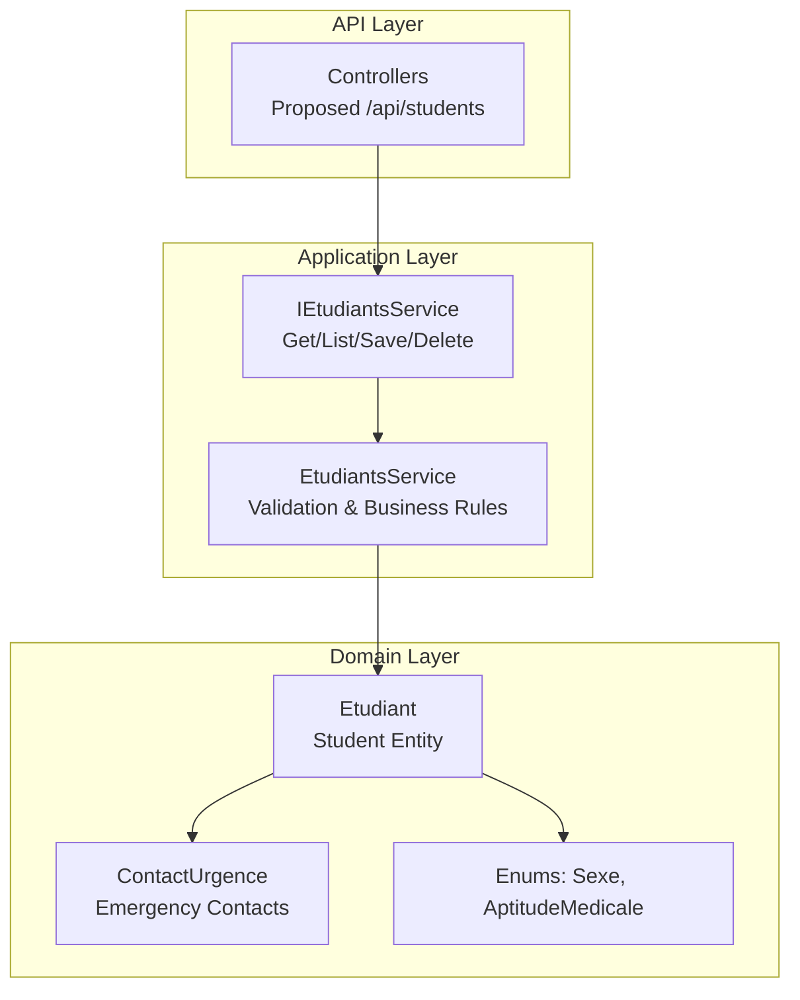
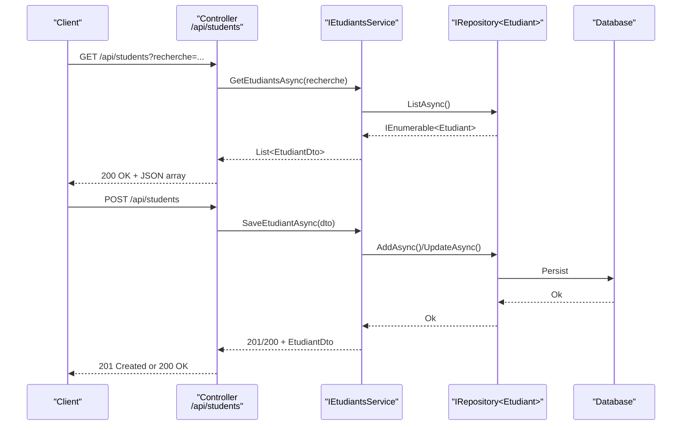
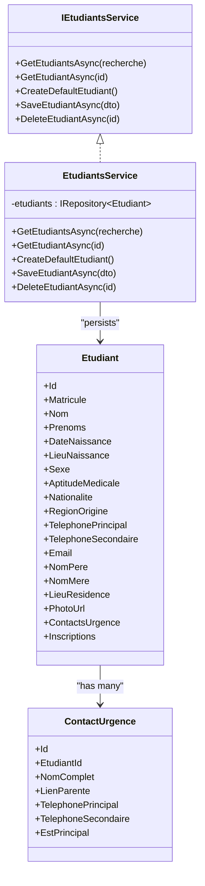

# Student Management APIs

<cite>
**Referenced Files in This Document**
- [EtudiantDto.cs](file://RIIS.Academic.Application/Etudiants/Dtos/EtudiantDto.cs)
- [IEtudiantsService.cs](file://RIIS.Academic.Application/Etudiants/Services/IEtudiantsService.cs)
- [EtudiantsService.cs](file://RIIS.Academic.Application/Etudiants/Services/EtudiantsService.cs)
- [Etudiant.cs](file://RIIS.Academic.Domain/Etudiants/Etudiant.cs)
- [ContactUrgence.cs](file://RIIS.Academic.Domain/Etudiants/ContactUrgence.cs)
- [Sexe.cs](file://RIIS.Academic.Domain/Enums/Sexe.cs)
- [AptitudeMedicale.cs](file://RIIS.Academic.Domain/Enums/AptitudeMedicale.cs)
- [Program.cs](file://RIIS.Academic.Api/Program.cs)
</cite>

## Table of Contents
1. [Introduction](#introduction)
2. [Project Structure](#project-structure)
3. [Core Components](#core-components)
4. [Architecture Overview](#architecture-overview)
5. [Detailed Component Analysis](#detailed-component-analysis)
6. [Dependency Analysis](#dependency-analysis)
7. [Performance Considerations](#performance-considerations)
8. [Troubleshooting Guide](#troubleshooting-guide)
9. [Conclusion](#conclusion)

## Introduction
This document specifies the student management API surface for creating, reading, updating, and deleting student records. It defines HTTP methods, URL patterns, request/response schemas, validation rules, error handling, authentication requirements, status codes, and common administrative workflows. The design is derived from the application service layer and domain models to ensure consistency with the system’s data model and business rules.

Note: The current repository exposes a Blazor web UI that consumes the application services directly. The API specification below describes how these capabilities should be exposed as REST endpoints for external clients or future integration points.

## Project Structure
The student management capability spans three layers:
- Domain: Defines the student entity and related types (contact information).
- Application: Provides use cases via an interface and implementation for listing, retrieving, saving, and deleting students, including search and validation.
- API: Minimal ASP.NET Core host configured to map controllers; student controllers are not present yet, so this document proposes the intended endpoints.

**Diagram sources**
- [IEtudiantsService.cs:5-12](file://RIIS.Academic.Application/Etudiants/Services/IEtudiantsService.cs#L5-L12)
- [EtudiantsService.cs:7-127](file://RIIS.Academic.Application/Etudiants/Services/EtudiantsService.cs#L7-L127)
- [Etudiant.cs:3-27](file://RIIS.Academic.Domain/Etudiants/Etudiant.cs#L3-L27)
- [ContactUrgence.cs:3-14](file://RIIS.Academic.Domain/Etudiants/ContactUrgence.cs#L3-L14)
- [Sexe.cs:3-8](file://RIIS.Academic.Domain/Enums/Sexe.cs#L3-L8)
- [AptitudeMedicale.cs:3-8](file://RIIS.Academic.Domain/Enums/AptitudeMedicale.cs#L3-L8)

**Section sources**
- [Program.cs:5-17](file://RIIS.Academic.Api/Program.cs#L5-L17)

## Core Components
- Student DTO: Represents the contract for client requests/responses. Includes identity, personal details, contact fields, and optional photo URL.
- Student Service Interface: Declares operations for listing, retrieval, creation/update, and deletion.
- Student Service Implementation: Implements search across multiple fields, required field validation, uniqueness checks for matricule, and persistence via repository.
- Domain Models: Student entity with relationships to emergency contacts and enumerations for sex and medical fitness.

Key responsibilities:
- List students with optional text search across matricule, name, surname, phone, email.
- Retrieve a single student by ID.
- Create or update a student with validation and normalization.
- Delete a student by ID.

**Section sources**
- [EtudiantDto.cs:5-25](file://RIIS.Academic.Application/Etudiants/Dtos/EtudiantDto.cs#L5-L25)
- [IEtudiantsService.cs:5-12](file://RIIS.Academic.Application/Etudiants/Services/IEtudiantsService.cs#L5-L12)
- [EtudiantsService.cs:9-127](file://RIIS.Academic.Application/Etudiants/Services/EtudiantsService.cs#L9-L127)
- [Etudiant.cs:3-27](file://RIIS.Academic.Domain/Etudiants/Etudiant.cs#L3-L27)
- [ContactUrgence.cs:3-14](file://RIIS.Academic.Domain/Etudiants/ContactUrgence.cs#L3-L14)

## Architecture Overview
The proposed REST API aligns with the application service layer. Controllers would translate HTTP requests into service calls and return standardized responses.

**Diagram sources**
- [IEtudiantsService.cs:5-12](file://RIIS.Academic.Application/Etudiants/Services/IEtudiantsService.cs#L5-L12)
- [EtudiantsService.cs:9-127](file://RIIS.Academic.Application/Etudiants/Services/EtudiantsService.cs#L9-L127)

## Detailed Component Analysis

### Authentication and Authorization
- Authentication: Not implemented in the API project currently. Clients must integrate with the organization’s authentication provider (e.g., JWT bearer tokens) at the gateway or middleware level before reaching controllers.
- Authorization: Role-based access control should restrict student administration to authorized roles (e.g., Admin, Registrar).

### Base Path and Conventions
- Base path: /api
- Content-Type: application/json
- Date formats: ISO 8601 (e.g., yyyy-MM-dd)
- Enum values: Use string names matching domain enums.

### Endpoints

#### List Students
- Method: GET
- URL: /api/students
- Query parameters:
  - recherche: string (optional) — case-insensitive substring match on matricule, nom, prenoms, telephonePrincipal, email
- Response: 200 OK
- Body: Array of EtudiantDto
- Errors:
  - 400 Bad Request if query parameters are malformed
  - 500 Internal Server Error on unexpected failures

Example response body schema:
- Array of objects with fields defined in EtudiantDto.

**Section sources**
- [EtudiantsService.cs:9-33](file://RIIS.Academic.Application/Etudiants/Services/EtudiantsService.cs#L9-L33)
- [EtudiantDto.cs:5-25](file://RIIS.Academic.Application/Etudiants/Dtos/EtudiantDto.cs#L5-L25)

#### Get Student by ID
- Method: GET
- URL: /api/students/{id}
- Path parameter: id (long)
- Response:
  - 200 OK with EtudiantDto when found
  - 404 Not Found when not found
- Errors:
  - 400 Bad Request if id is invalid
  - 500 Internal Server Error on unexpected failures

**Section sources**
- [IEtudiantsService.cs:7-8](file://RIIS.Academic.Application/Etudiants/Services/IEtudiantsService.cs#L7-L8)
- [EtudiantsService.cs:35-40](file://RIIS.Academic.Application/Etudiants/Services/EtudiantsService.cs#L35-L40)

#### Create Student
- Method: POST
- URL: /api/students
- Request body: EtudiantDto (create shape; Id ignored)
- Validation rules:
  - Required: Nom, Prenoms, LieuNaissance, Nationalite, TelephonePrincipal
  - Optional: Matricule (unique), RegionOrigine, TelephoneSecondaire, Email, NomPere, NomMere, LieuResidence, PhotoUrl, DateNaissance, Sexe, AptitudeMedicale
  - Matricule uniqueness enforced against existing records (excluding current record when updating)
- Response:
  - 201 Created with EtudiantDto when successful
  - 400 Bad Request for validation errors or duplicate matricule
  - 500 Internal Server Error on unexpected failures

Error scenarios:
- Missing required fields → 400 with message indicating which field(s) are required.
- Duplicate matricule → 400 with message indicating conflict.

**Section sources**
- [EtudiantsService.cs:53-96](file://RIIS.Academic.Application/Etudiants/Services/EtudiantsService.cs#L53-L96)
- [EtudiantDto.cs:5-25](file://RIIS.Academic.Application/Etudiants/Dtos/EtudiantDto.cs#L5-L25)

#### Update Student
- Method: PUT
- URL: /api/students/{id}
- Path parameter: id (long)
- Request body: EtudiantDto (update shape; Id must match path)
- Validation rules: Same as create, plus Id must exist for update semantics.
- Response:
  - 200 OK with updated EtudiantDto when successful
  - 404 Not Found if student does not exist
  - 400 Bad Request for validation errors or duplicate matricule
  - 500 Internal Server Error on unexpected failures

**Section sources**
- [EtudiantsService.cs:97-121](file://RIIS.Academic.Application/Etudiants/Services/EtudiantsService.cs#L97-L121)

#### Delete Student
- Method: DELETE
- URL: /api/students/{id}
- Path parameter: id (long)
- Response:
  - 204 No Content on success
  - 404 Not Found if student does not exist
  - 500 Internal Server Error on unexpected failures

**Section sources**
- [IEtudiantsService.cs:11](file://RIIS.Academic.Application/Etudiants/Services/IEtudiantsService.cs#L11)
- [EtudiantsService.cs:123-127](file://RIIS.Academic.Application/Etudiants/Services/EtudiantsService.cs#L123-L127)

### Data Models and Schemas

#### EtudiantDto
- Fields:
  - Id: long
  - Matricule: string? (nullable; unique constraint enforced on save)
  - Nom: string (required)
  - Prenoms: string (required)
  - DateNaissance: date (ISO 8601)
  - LieuNaissance: string (required)
  - Sexe: enum (Sexe)
  - AptitudeMedicale: enum (AptitudeMedicale)
  - Nationalite: string (required)
  - RegionOrigine: string?
  - TelephonePrincipal: string (required)
  - TelephoneSecondaire: string?
  - Email: string?
  - NomPere: string?
  - NomMere: string?
  - LieuResidence: string?
  - PhotoUrl: string?

Notes:
- String fields are trimmed; empty strings become null where nullable.
- Enums:
  - Sexe: NonRenseigne, Masculin, Feminin
  - AptitudeMedicale: NonRenseignee, Apte, Inapte

**Section sources**
- [EtudiantDto.cs:5-25](file://RIIS.Academic.Application/Etudiants/Dtos/EtudiantDto.cs#L5-L25)
- [Sexe.cs:3-8](file://RIIS.Academic.Domain/Enums/Sexe.cs#L3-L8)
- [AptitudeMedicale.cs:3-8](file://RIIS.Academic.Domain/Enums/AptitudeMedicale.cs#L3-L8)

#### ContactUrgence (Emergency Contact)
- Purpose: Stores emergency contacts associated with a student.
- Fields:
  - Id: long
  - EtudiantId: long (FK to student)
  - NomComplet: string (required)
  - LienParente: string?
  - TelephonePrincipal: string (required)
  - TelephoneSecondaire: string?
  - EstPrincipal: bool (default true)

Relationships:
- One-to-many from Etudiant to ContactUrgence.

**Section sources**
- [ContactUrgence.cs:3-14](file://RIIS.Academic.Domain/Etudiants/ContactUrgence.cs#L3-L14)
- [Etudiant.cs:25-26](file://RIIS.Academic.Domain/Etudiants/Etudiant.cs#L25-L26)

### Request/Response Examples

- List Students
  - Request: GET /api/students?recherche=dupont
  - Response: 200 OK
    - Body: [ { "id": 1, "matricule": "ETU001", "nom": "Dupont", "prenoms": "Jean", ... } ]

- Get Student
  - Request: GET /api/students/1
  - Response: 200 OK
    - Body: { "id": 1, "matricule": "ETU001", "nom": "Dupont", "prenoms": "Jean", ... }

- Create Student
  - Request: POST /api/students
    - Body: { "matricule": "ETU002", "nom": "Martin", "prenoms": "Alice", "lieuNaissance": "Douala", "nationalite": "Camerounaise", "telephonePrincipal": "+2376XXXXXXXX", "dateNaissance": "2000-05-12", "sexe": "Feminin", "aptitudeMedicale": "Apte" }
  - Response: 201 Created
    - Body: { "id": 2, "matricule": "ETU002", "nom": "MARTIN", "prenoms": "Alice", ... }

- Update Student
  - Request: PUT /api/students/2
    - Body: { "id": 2, "matricule": "ETU002", "nom": "Martin", "prenoms": "Alice", "email": "alice@example.com", ... }
  - Response: 200 OK
    - Body: Updated EtudiantDto

- Delete Student
  - Request: DELETE /api/students/2
  - Response: 204 No Content

### Validation Rules
- Required fields: Nom, Prenoms, LieuNaissance, Nationalite, TelephonePrincipal
- Normalization:
  - Strings are trimmed; empty becomes null for nullable fields
  - Nom is uppercased during save
- Uniqueness:
  - Matricule must be unique across students (case-insensitive comparison)
- Enums:
  - Sexe and AptitudeMedicale must be valid enum values

**Section sources**
- [EtudiantsService.cs:53-73](file://RIIS.Academic.Application/Etudiants/Services/EtudiantsService.cs#L53-L73)
- [EtudiantsService.cs:154-171](file://RIIS.Academic.Application/Etudiants/Services/EtudiantsService.cs#L154-L171)

### Error Handling Scenarios
- 400 Bad Request:
  - Missing required fields
  - Invalid enum value
  - Duplicate matricule
- 404 Not Found:
  - Student not found for GET/PUT/DELETE
- 500 Internal Server Error:
  - Unexpected server-side exceptions

Error response format (recommended):
- { "type": "...", "title": "...", "status": 400, "detail": "Human-readable message", "instance": "/api/students" }

**Section sources**
- [EtudiantsService.cs:62-73](file://RIIS.Academic.Application/Etudiants/Services/EtudiantsService.cs#L62-L73)
- [EtudiantsService.cs:161-171](file://RIIS.Academic.Application/Etudiants/Services/EtudiantsService.cs#L161-L171)

### Common Use Cases
- Onboard a new student:
  - POST /api/students with required fields; handle 201 Created
- Search for a student:
  - GET /api/students?recherche=<query>; filter by matricule, name, phone, email
- Update student profile:
  - PUT /api/students/{id}; ensure all required fields are present
- Remove a student:
  - DELETE /api/students/{id}; confirm 204 No Content

## Dependency Analysis
The student API depends on the application service layer and domain models. The following diagram shows key dependencies and their roles.

**Diagram sources**
- [IEtudiantsService.cs:5-12](file://RIIS.Academic.Application/Etudiants/Services/IEtudiantsService.cs#L5-L12)
- [EtudiantsService.cs:7-127](file://RIIS.Academic.Application/Etudiants/Services/EtudiantsService.cs#L7-L127)
- [Etudiant.cs:3-27](file://RIIS.Academic.Domain/Etudiants/Etudiant.cs#L3-L27)
- [ContactUrgence.cs:3-14](file://RIIS.Academic.Domain/Etudiants/ContactUrgence.cs#L3-L14)

**Section sources**
- [IEtudiantsService.cs:5-12](file://RIIS.Academic.Application/Etudiants/Services/IEtudiantsService.cs#L5-L12)
- [EtudiantsService.cs:7-127](file://RIIS.Academic.Application/Etudiants/Services/EtudiantsService.cs#L7-L127)
- [Etudiant.cs:3-27](file://RIIS.Academic.Domain/Etudiants/Etudiant.cs#L3-L27)
- [ContactUrgence.cs:3-14](file://RIIS.Academic.Domain/Etudiants/ContactUrgence.cs#L3-L14)

## Performance Considerations
- Search performance:
  - Current search loads all students and filters in memory. For large datasets, consider server-side filtering or pagination.
- Pagination:
  - Introduce page size and page number query parameters to reduce payload sizes.
- Indexing:
  - Ensure database indexes on frequently searched columns (e.g., Matricule, Nom, Email).
- Caching:
  - Cache read-only lists for short periods if appropriate.

[No sources needed since this section provides general guidance]

## Troubleshooting Guide
Common issues and resolutions:
- Validation errors:
  - Ensure all required fields are provided and properly formatted.
  - Check enum values for Sexe and AptitudeMedicale.
- Duplicate matricule:
  - Verify matricule uniqueness before submission.
- Not found errors:
  - Confirm the student exists before attempting updates or deletions.
- Unexpected server errors:
  - Inspect logs for stack traces and underlying causes.

Operational tips:
- Log validation failures with context (field names).
- Return consistent error payloads for clients to handle gracefully.

**Section sources**
- [EtudiantsService.cs:53-73](file://RIIS.Academic.Application/Etudiants/Services/EtudiantsService.cs#L53-L73)
- [EtudiantsService.cs:161-171](file://RIIS.Academic.Application/Etudiants/Services/EtudiantsService.cs#L161-L171)

## Conclusion
This document defines a complete set of student management endpoints aligned with the application service layer and domain models. It covers CRUD operations, validation, error handling, and common workflows. Implementing controllers over the existing services will provide a robust, maintainable API for student administration.

[No sources needed since this section summarizes without analyzing specific files]