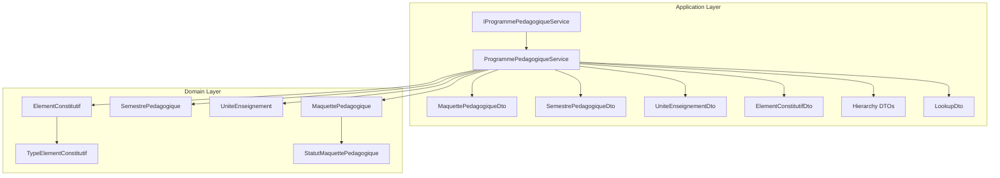
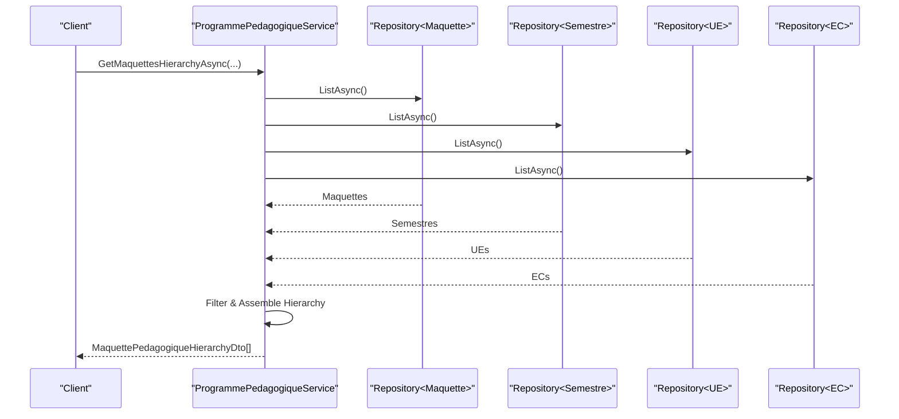
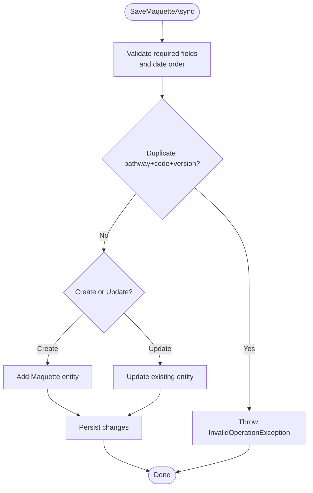
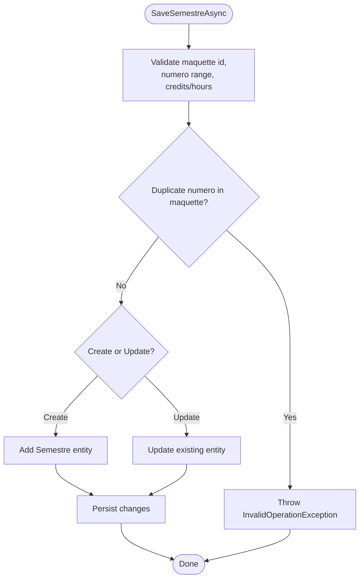
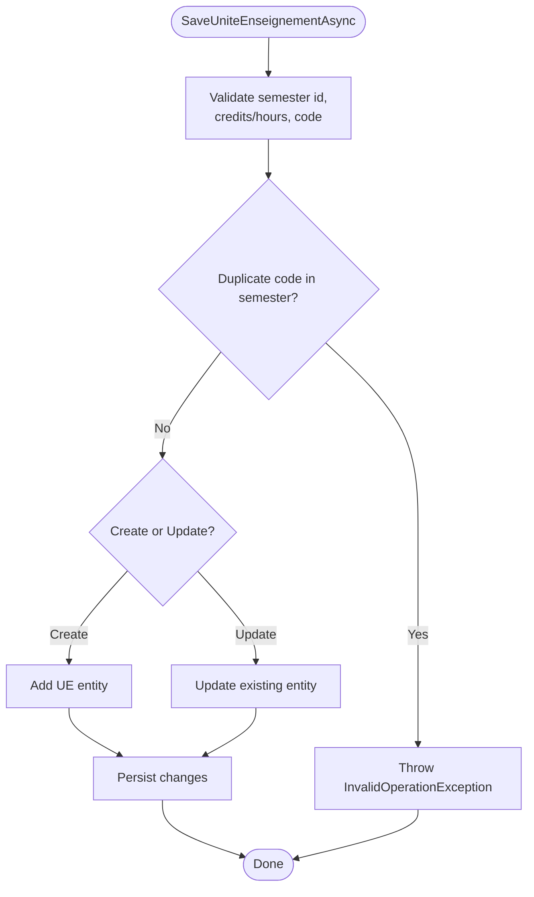
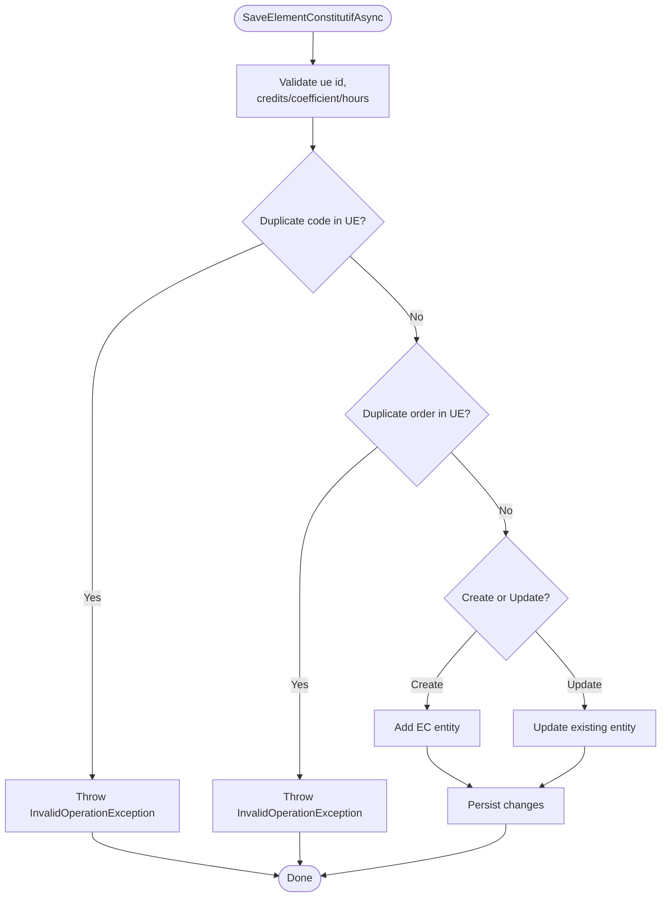
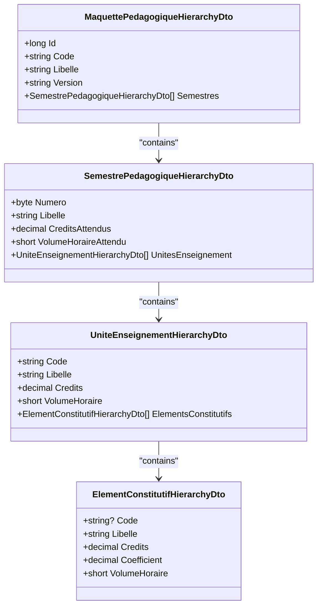
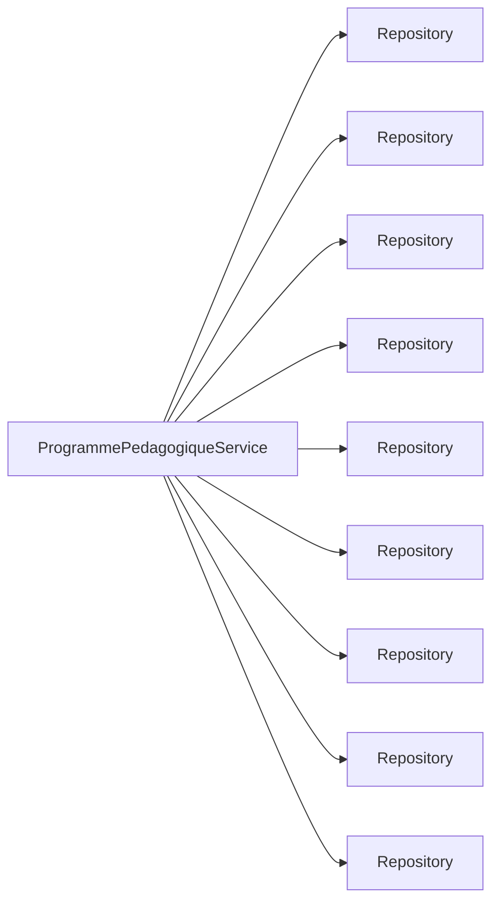

# Academic Program Services

<cite>
**Referenced Files in This Document**
- [IProgrammePedagogiqueService.cs](file://RIIS.Academic.Application/Programmes/Services/IProgrammePedagogiqueService.cs)
- [ProgrammePedagogiqueService.cs](file://RIIS.Academic.Application/Programmes/Services/ProgrammePedagogiqueService.cs)
- [MaquettePedagogiqueDto.cs](file://RIIS.Academic.Application/Programmes/Dtos/MaquettePedagogiqueDto.cs)
- [SemestrePedagogiqueDto.cs](file://RIIS.Academic.Application/Programmes/Dtos/SemestrePedagogiqueDto.cs)
- [UniteEnseignementDto.cs](file://RIIS.Academic.Application/Programmes/Dtos/UniteEnseignementDto.cs)
- [ElementConstitutifDto.cs](file://RIIS.Academic.Application/Programmes/Dtos/ElementConstitutifDto.cs)
- [MaquettePedagogiqueHierarchyDto.cs](file://RIIS.Academic.Application/Programmes/Dtos/MaquettePedagogiqueHierarchyDto.cs)
- [SemestrePedagogiqueHierarchyDto.cs](file://RIIS.Academic.Application/Programmes/Dtos/SemestrePedagogiqueHierarchyDto.cs)
- [UniteEnseignementHierarchyDto.cs](file://RIIS.Academic.Application/Programmes/Dtos/UniteEnseignementHierarchyDto.cs)
- [ElementConstitutifHierarchyDto.cs](file://RIIS.Academic.Application/Programmes/Dtos/ElementConstitutifHierarchyDto.cs)
- [LookupDto.cs](file://RIIS.Academic.Application/Common/Dtos/LookupDto.cs)
- [MaquettePedagogique.cs](file://RIIS.Academic.Domain/Programmes/MaquettePedagogique.cs)
- [SemestrePedagogique.cs](file://RIIS.Academic.Domain/Programmes/SemestrePedagogique.cs)
- [UniteEnseignement.cs](file://RIIS.Academic.Domain/Programmes/UniteEnseignement.cs)
- [ElementConstitutif.cs](file://RIIS.Academic.Domain/Programmes/ElementConstitutif.cs)
- [TypeElementConstitutif.cs](file://RIIS.Academic.Domain/Enums/TypeElementConstitutif.cs)
- [StatutMaquettePedagogique.cs](file://RIIS.Academic.Domain/Enums/StatutMaquettePedagogique.cs)
</cite>

## Table of Contents
1. Introduction
2. Project Structure
3. Core Components
4. Architecture Overview
5. Detailed Component Analysis
6. Dependency Analysis
7. Performance Considerations
8. Troubleshooting Guide
9. Conclusion

## Introduction
This document explains the Academic Program services that manage the hierarchical structure of educational programs. It covers the IProgrammePedagogiqueService interface and its ProgrammePedagogiqueService implementation, focusing on program frameworks (maquettes), semesters, course units (UE), and constituent elements (EC). It also documents DTOs for each level, methods for creation, scheduling, assignment, and academic calendar lookups, as well as validation rules and integrity checks enforced by the service layer.

## Project Structure
The program management feature is implemented in the Application layer with domain entities in the Domain layer:
- Application layer:
  - Services: IProgrammePedagogiqueService and ProgrammePedagogiqueService
  - Dtos: flat and hierarchy DTOs for Maquette, Semestre, UE, EC; LookupDto for dropdowns
- Domain layer:
  - Entities: MaquettePedagogique, SemestrePedagogique, UniteEnseignement, ElementConstitutif
  - Enums: TypeElementConstitutif, StatutMaquettePedagogique

**Diagram sources**
- [IProgrammePedagogiqueService.cs:6-64](file://RIIS.Academic.Application/Programmes/Services/IProgrammePedagogiqueService.cs#L6-L64)
- [ProgrammePedagogiqueService.cs:8-17](file://RIIS.Academic.Application/Programmes/Services/ProgrammePedagogiqueService.cs#L8-L17)
- [MaquettePedagogiqueDto.cs:5-19](file://RIIS.Academic.Application/Programmes/Dtos/MaquettePedagogiqueDto.cs#L5-L19)
- [SemestrePedagogiqueDto.cs:3-16](file://RIIS.Academic.Application/Programmes/Dtos/SemestrePedagogiqueDto.cs#L3-L16)
- [UniteEnseignementDto.cs:3-15](file://RIIS.Academic.Application/Programmes/Dtos/UniteEnseignementDto.cs#L3-L15)
- [ElementConstitutifDto.cs:5-19](file://RIIS.Academic.Application/Programmes/Dtos/ElementConstitutifDto.cs#L5-L19)
- [MaquettePedagogique.cs:5-30](file://RIIS.Academic.Domain/Programmes/MaquettePedagogique.cs#L5-L30)
- [SemestrePedagogique.cs:3-19](file://RIIS.Academic.Domain/Programmes/SemestrePedagogique.cs#L3-L19)
- [UniteEnseignement.cs:3-17](file://RIIS.Academic.Domain/Programmes/UniteEnseignement.cs#L3-L17)
- [ElementConstitutif.cs:3-20](file://RIIS.Academic.Domain/Programmes/ElementConstitutif.cs#L3-L20)
- [TypeElementConstitutif.cs:3-10](file://RIIS.Academic.Domain/Enums/TypeElementConstitutif.cs#L3-L10)
- [StatutMaquettePedagogique.cs:3-8](file://RIIS.Academic.Domain/Enums/StatutMaquettePedagogique.cs#L3-L8)

**Section sources**
- [IProgrammePedagogiqueService.cs:6-64](file://RIIS.Academic.Application/Programmes/Services/IProgrammePedagogiqueService.cs#L6-L64)
- [ProgrammePedagogiqueService.cs:8-17](file://RIIS.Academic.Application/Programmes/Services/ProgrammePedagogiqueService.cs#L8-L17)

## Core Components
- IProgrammePedagogiqueService defines the contract for managing:
  - Maquettes (program frameworks): list, hierarchy, get, create default, save, delete
  - Semestres (semesters): list, get, create default, save, delete
  - Unites d’enseignement (course units): list, hierarchy, get, create default, save, delete
  - Elements constitutifs (constituent elements): list, get, create default, save, delete
  - Lookups for academic years, cycles, pathways, maquettes, levels, semesters, and UEs
- ProgrammePedagogiqueService implements the contract using repository abstractions to read/write domain entities and map to/from DTOs.

Key responsibilities:
- Build hierarchical views across Maquette → Semestre → UE → EC
- Provide filtered lists based on academic year, cycle, pathway, or specific IDs
- Enforce business rules during save operations (validation and uniqueness)
- Generate sensible defaults for new items

**Section sources**
- [IProgrammePedagogiqueService.cs:6-64](file://RIIS.Academic.Application/Programmes/Services/IProgrammePedagogiqueService.cs#L6-L64)
- [ProgrammePedagogiqueService.cs:19-149](file://RIIS.Academic.Application/Programmes/Services/ProgrammePedagogiqueService.cs#L19-L149)

## Architecture Overview
The service layer orchestrates data access via repositories and maps between domain entities and DTOs. Hierarchical queries assemble nested structures for UI consumption.

**Diagram sources**
- [ProgrammePedagogiqueService.cs:33-130](file://RIIS.Academic.Application/Programmes/Services/ProgrammePedagogiqueService.cs#L33-L130)

## Detailed Component Analysis

### Program Frameworks (Maquettes)
- Purpose: Represent a versioned academic program framework tied to a study pathway and validity period.
- Key DTO fields: Id, ParcoursAcademiqueId, Code, Libelle, Version, Statut, DateDebutValidite, DateFinValidite, SourceDocument, Observation, NombreSemestres.
- Creation: CreateDefaultMaquette initializes defaults (version, status).
- Save rules:
  - Required fields: parcours, code, libelle, version
  - Validity dates must be ordered (end >= start)
  - Uniqueness: same pathway + code + version must be unique
- Deletion: Removes the framework.

**Diagram sources**
- [ProgrammePedagogiqueService.cs:151-226](file://RIIS.Academic.Application/Programmes/Services/ProgrammePedagogiqueService.cs#L151-L226)

**Section sources**
- [MaquettePedagogiqueDto.cs:5-19](file://RIIS.Academic.Application/Programmes/Dtos/MaquettePedagogiqueDto.cs#L5-L19)
- [ProgrammePedagogiqueService.cs:143-232](file://RIIS.Academic.Application/Programmes/Services/ProgrammePedagogiqueService.cs#L143-L232)
- [MaquettePedagogique.cs:5-30](file://RIIS.Academic.Domain/Programmes/MaquettePedagogique.cs#L5-L30)
- [StatutMaquettePedagogique.cs:3-8](file://RIIS.Academic.Domain/Enums/StatutMaquettePedagogique.cs#L3-L8)

### Semesters
- Purpose: Organize UEs within a maquette; define expected credits and hours per semester.
- Key DTO fields: Id, MaquettePedagogiqueId, Numero, Libelle, CreditsAttendus, VolumeHoraireAttendu, OrdreAffichage, NombreUnitesEnseignement.
- Creation: CreateDefaultSemestre computes next number and sets defaults for credits/hours.
- Save rules:
  - Must belong to a valid maquette
  - Numero must be between 1 and 10
  - Credits and hours must be non-negative
  - Unique Numero per maquette
- Deletion: Removes the semester.

**Diagram sources**
- [ProgrammePedagogiqueService.cs:290-352](file://RIIS.Academic.Application/Programmes/Services/ProgrammePedagogiqueService.cs#L290-L352)

**Section sources**
- [SemestrePedagogiqueDto.cs:3-16](file://RIIS.Academic.Application/Programmes/Dtos/SemestrePedagogiqueDto.cs#L3-L16)
- [ProgrammePedagogiqueService.cs:269-358](file://RIIS.Academic.Application/Programmes/Services/ProgrammePedagogiqueService.cs#L269-L358)
- [SemestrePedagogique.cs:3-19](file://RIIS.Academic.Domain/Programmes/SemestrePedagogique.cs#L3-L19)

### Course Units (UE)
- Purpose: Group constituent elements (ECs) within a semester; track credits, hours, and mandatory flag.
- Key DTO fields: Id, SemestrePedagogiqueId, Code, Libelle, Credits, VolumeHoraire, OrdreAffichage, EstObligatoire, NombreElementsConstitutifs.
- Creation: CreateDefaultUniteEnseignement assigns next order and defaults.
- Save rules:
  - Must belong to a valid semester
  - Non-negative credits and hours
  - Unique Code per semester
- Deletion: Removes the unit.

**Diagram sources**
- [ProgrammePedagogiqueService.cs:518-574](file://RIIS.Academic.Application/Programmes/Services/ProgrammePedagogiqueService.cs#L518-L574)

**Section sources**
- [UniteEnseignementDto.cs:3-15](file://RIIS.Academic.Application/Programmes/Dtos/UniteEnseignementDto.cs#L3-L15)
- [ProgrammePedagogiqueService.cs:499-580](file://RIIS.Academic.Application/Programmes/Services/ProgrammePedagogiqueService.cs#L499-L580)
- [UniteEnseignement.cs:3-17](file://RIIS.Academic.Domain/Programmes/UniteEnseignement.cs#L3-L17)

### Constituent Elements (EC)
- Purpose: Atomic teaching activities within a UE; include type, credits, coefficient, hours, and ordering.
- Key DTO fields: Id, UniteEnseignementId, Code, Libelle, Type, Credits, Coefficient, VolumeHoraire, OrdreAffichage, EstObligatoire, Observation.
- Creation: CreateDefaultElementConstitutif assigns next order and defaults (type Cours, coefficient 1).
- Save rules:
  - Must belong to a valid UE
  - Non-negative credits, coefficient, hours
  - Optional Code uniqueness per UE
  - Unique OrdreAffichage per UE
- Deletion: Removes the element.

**Diagram sources**
- [ProgrammePedagogiqueService.cs:634-712](file://RIIS.Academic.Application/Programmes/Services/ProgrammePedagogiqueService.cs#L634-L712)

**Section sources**
- [ElementConstitutifDto.cs:5-19](file://RIIS.Academic.Application/Programmes/Dtos/ElementConstitutifDto.cs#L5-L19)
- [ProgrammePedagogiqueService.cs:613-718](file://RIIS.Academic.Application/Programmes/Services/ProgrammePedagogiqueService.cs#L613-L718)
- [ElementConstitutif.cs:3-20](file://RIIS.Academic.Domain/Programmes/ElementConstitutif.cs#L3-L20)
- [TypeElementConstitutif.cs:3-10](file://RIIS.Academic.Domain/Enums/TypeElementConstitutif.cs#L3-L10)

### Hierarchy and Filtering
- Hierarchical DTOs provide nested structures for UI trees:
  - MaquettePedagogiqueHierarchyDto contains SemestrePedagogiqueHierarchyDto
  - SemestrePedagogiqueHierarchyDto contains UniteEnseignementHierarchyDto
  - UniteEnseignementHierarchyDto contains ElementConstitutifHierarchyDto
- Filtering supports:
  - By academic year, cycle, pathway, and specific IDs
  - Ordered by display order and semantic keys (e.g., semestre numero, ue code)

**Diagram sources**
- [MaquettePedagogiqueHierarchyDto.cs:5-19](file://RIIS.Academic.Application/Programmes/Dtos/MaquettePedagogiqueHierarchyDto.cs#L5-L19)
- [SemestrePedagogiqueHierarchyDto.cs:3-13](file://RIIS.Academic.Application/Programmes/Dtos/SemestrePedagogiqueHierarchyDto.cs#L3-L13)
- [UniteEnseignementHierarchyDto.cs:3-15](file://RIIS.Academic.Application/Programmes/Dtos/UniteEnseignementHierarchyDto.cs#L3-L15)
- [ElementConstitutifHierarchyDto.cs:5-17](file://RIIS.Academic.Application/Programmes/Dtos/ElementConstitutifHierarchyDto.cs#L5-L17)

**Section sources**
- [ProgrammePedagogiqueService.cs:33-130](file://RIIS.Academic.Application/Programmes/Services/ProgrammePedagogiqueService.cs#L33-L130)
- [ProgrammePedagogiqueService.cs:418-486](file://RIIS.Academic.Application/Programmes/Services/ProgrammePedagogiqueService.cs#L418-L486)

### Academic Calendar Management (Lookups)
- Provides lookup lists for UI dropdowns:
  - Academic years, training cycles, academic pathways, maquettes, study levels, semesters, and UEs
- Filtering and formatting:
  - Pathways and cycles can be filtered by active status and ordered by display order
  - Maquettes formatted as “Code - Libelle (Version)”

**Section sources**
- [IProgrammePedagogiqueService.cs:49-64](file://RIIS.Academic.Application/Programmes/Services/IProgrammePedagogiqueService.cs#L49-L64)
- [ProgrammePedagogiqueService.cs:720-779](file://RIIS.Academic.Application/Programmes/Services/ProgrammePedagogiqueService.cs#L720-L779)
- [LookupDto.cs:3-7](file://RIIS.Academic.Application/Common/Dtos/LookupDto.cs#L3-L7)

## Dependency Analysis
- Service depends on multiple repositories for reading/writing domain entities:
  - MaquettePedagogique, SemestrePedagogique, UniteEnseignement, ElementConstitutif
  - Referentiels: AnneeAcademique, CycleFormation, ParcoursAcademique, NiveauEtude
  - ClassePedagogique for filtering by academic year/class context
- DTOs are used for input/output; hierarchy DTOs aggregate related entities for UI consumption.

**Diagram sources**
- [ProgrammePedagogiqueService.cs:8-17](file://RIIS.Academic.Application/Programmes/Services/ProgrammePedagogiqueService.cs#L8-L17)

**Section sources**
- [ProgrammePedagogiqueService.cs:8-17](file://RIIS.Academic.Application/Programmes/Services/ProgrammePedagogiqueService.cs#L8-L17)

## Performance Considerations
- Hierarchical queries load all relevant entities into memory and filter in-process. For large datasets, consider:
  - Server-side filtering and projection at the repository/EF layer
  - Pagination for large lists
  - Caching for static lookups (cycles, levels)
- Sorting is performed in-memory; ensure indexes exist on frequently filtered columns if moving logic to the database.

[No sources needed since this section provides general guidance]

## Troubleshooting Guide
Common validation errors thrown by the service:
- Missing or invalid required fields (e.g., missing parcours, code, libelle, version)
- Invalid date ranges (end date before start date)
- Duplicate entries (e.g., duplicate pathway+code+version for maquette; duplicate semester number; duplicate UE code; duplicate EC code or order)
- Negative values for credits, coefficients, or hours

Resolution steps:
- Ensure all required fields are provided and correctly formatted
- Verify uniqueness constraints before saving
- Confirm numeric ranges and date ordering
- Use lookup endpoints to validate referenced IDs exist

**Section sources**
- [ProgrammePedagogiqueService.cs:151-226](file://RIIS.Academic.Application/Programmes/Services/ProgrammePedagogiqueService.cs#L151-L226)
- [ProgrammePedagogiqueService.cs:290-352](file://RIIS.Academic.Application/Programmes/Services/ProgrammePedagogiqueService.cs#L290-L352)
- [ProgrammePedagogiqueService.cs:518-574](file://RIIS.Academic.Application/Programmes/Services/ProgrammePedagogiqueService.cs#L518-L574)
- [ProgrammePedagogiqueService.cs:634-712](file://RIIS.Academic.Application/Programmes/Services/ProgrammePedagogiqueService.cs#L634-L712)

## Conclusion
The Academic Program services provide a robust, layered approach to managing program frameworks, semesters, course units, and constituent elements. The interface clearly separates concerns, while the implementation enforces critical validation rules and builds hierarchical views suitable for user interfaces. Lookups support dynamic UI configuration, and the design allows for future enhancements such as server-side filtering and caching to improve scalability.

[No sources needed since this section summarizes without analyzing specific files]