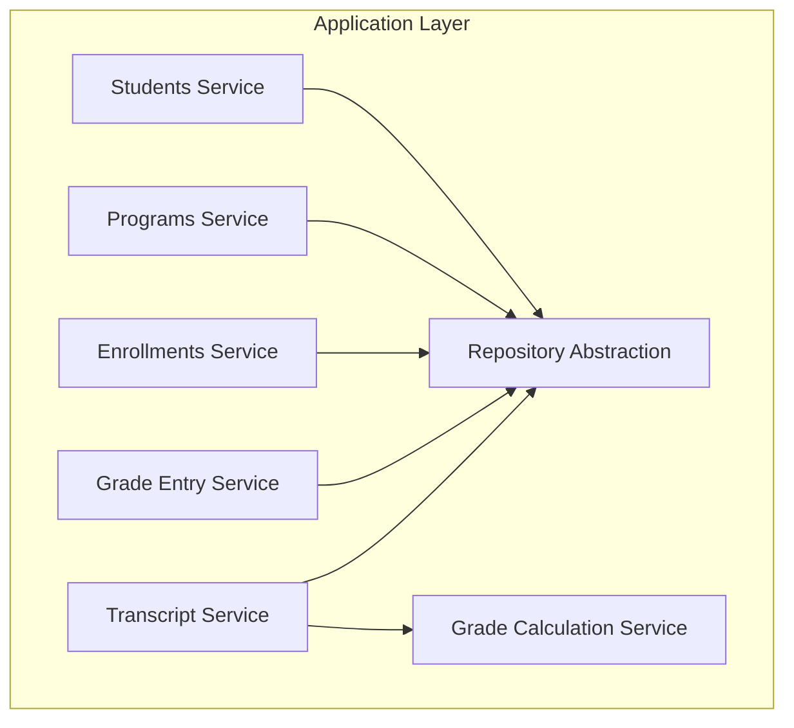
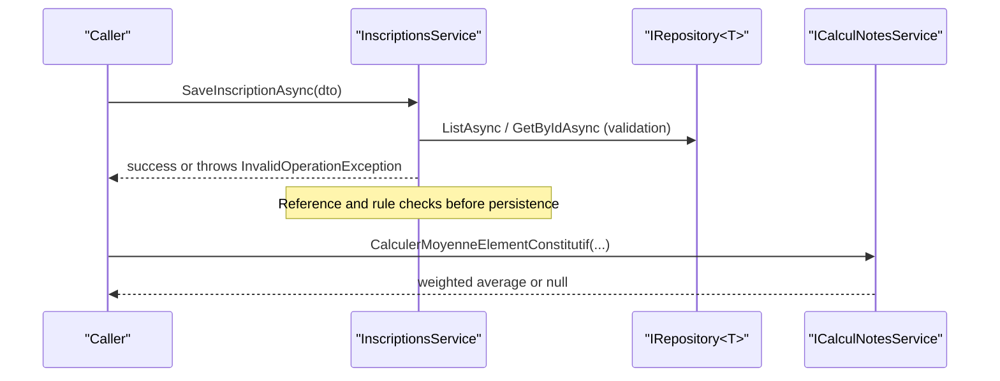
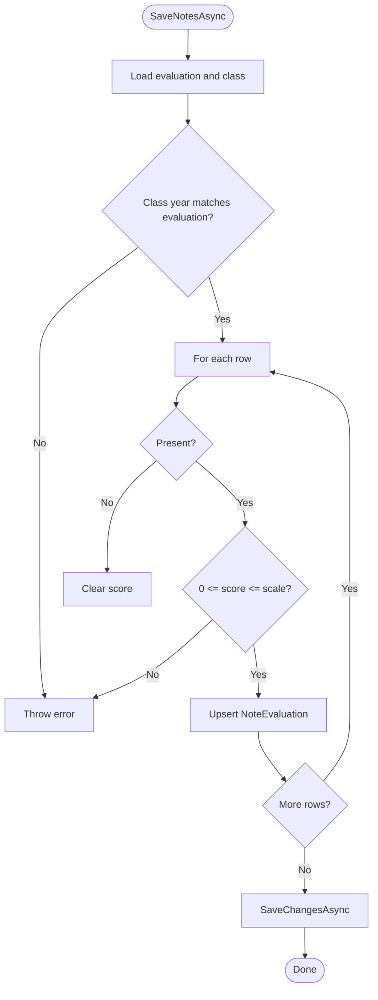
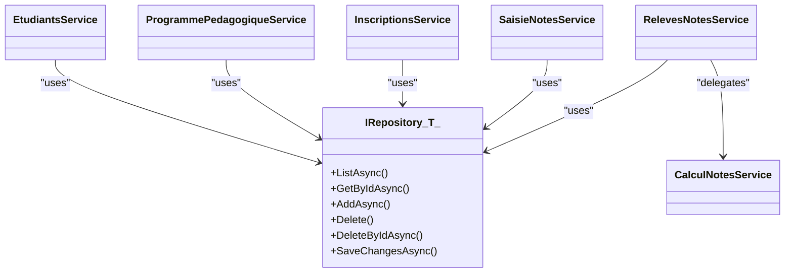

# Application Layer

<cite>
**Referenced Files in This Document**
- [IRepository.cs](file://RIIS.Academic.Application/Abstractions/Persistence/IRepository.cs)
- [ICalculNotesService.cs](file://RIIS.Academic.Application/Abstractions/Services/ICalculNotesService.cs)
- [IInscriptionService.cs](file://RIIS.Academic.Application/Abstractions/Services/IInscriptionService.cs)
- [IProcesVerbalService.cs](file://RIIS.Academic.Application/Abstractions/Services/IProcesVerbalService.cs)
- [IEtudiantsService.cs](file://RIIS.Academic.Application/Etudiants/Services/IEtudiantsService.cs)
- [EtudiantsService.cs](file://RIIS.Academic.Application/Etudiants/Services/EtudiantsService.cs)
- [EtudiantDto.cs](file://RIIS.Academic.Application/Etudiants/Dtos/EtudiantDto.cs)
- [IProgrammePedagogiqueService.cs](file://RIIS.Academic.Application/Programmes/Services/IProgrammePedagogiqueService.cs)
- [ProgrammePedagogiqueService.cs](file://RIIS.Academic.Application/Programmes/Services/ProgrammePedagogiqueService.cs)
- [IInscriptionsService.cs](file://RIIS.Academic.Application/Inscriptions/Services/IInscriptionsService.cs)
- [InscriptionsService.cs](file://RIIS.Academic.Application/Inscriptions/Services/InscriptionsService.cs)
- [InscriptionDto.cs](file://RIIS.Academic.Application/Inscriptions/Dtos/InscriptionDto.cs)
- [ISaisieNotesService.cs](file://RIIS.Academic.Application/Notes/Services/ISaisieNotesService.cs)
- [SaisieNotesService.cs](file://RIIS.Academic.Application/Notes/Services/SaisieNotesService.cs)
- [CalculNotesService.cs](file://RIIS.Academic.Application/Notes/Services/CalculNotesService.cs)
- [SaisieNotesGrilleDto.cs](file://RIIS.Academic.Application/Notes/Dtos/SaisieNotesGrilleDto.cs)
- [IRelevesNotesService.cs](file://RIIS.Academic.Application/Releves/Services/IRelevesNotesService.cs)
- [RelevesNotesService.cs](file://RIIS.Academic.Application/Releves/Services/RelevesNotesService.cs)
- [LookupDto.cs](file://RIIS.Academic.Application/Common/Dtos/LookupDto.cs)
</cite>

## Table of Contents
1. Introduction
2. Project Structure
3. Core Components
4. Architecture Overview
5. Detailed Component Analysis
6. Dependency Analysis
7. Performance Considerations
8. Troubleshooting Guide
9. Conclusion

## Introduction
This document describes the Application Layer services and business logic orchestration for an academic management system. It focuses on service interfaces and implementations that coordinate student management, program management, enrollment processing, and grade calculation. It explains use case orchestration patterns (command/query style), service composition via dependency injection, DTOs, input validation, error handling strategies, and transaction boundaries through repository persistence calls. It also documents cross-cutting concerns such as lookups, hierarchy queries, and integration with domain entities and infrastructure repositories.

## Project Structure
The Application Layer is organized by feature modules:
- Students (Etudiants): CRUD over students with search and validation
- Programs (Programmes): Hierarchical curriculum model (maquette, semester, unit, constituent element)
- Enrollments (Inscriptions): Enrollment lifecycle and reference integrity
- Grades (Notes): Grade entry grid and grade computation
- Transcripts (Releves): Annual transcript generation using computed grades
- Shared abstractions: Repository interface and reusable services (grade calculation, enrollment creation/validation, process-verbal generation)

**Diagram sources**
- [IEtudiantsService.cs:5-12](file://RIIS.Academic.Application/Etudiants/Services/IEtudiantsService.cs#L5-L12)
- [IProgrammePedagogiqueService.cs:6-64](file://RIIS.Academic.Application/Programmes/Services/IProgrammePedagogiqueService.cs#L6-L64)
- [IInscriptionsService.cs:6-31](file://RIIS.Academic.Application/Inscriptions/Services/IInscriptionsService.cs#L6-L31)
- [ISaisieNotesService.cs:7-26](file://RIIS.Academic.Application/Notes/Services/ISaisieNotesService.cs#L7-L26)
- [IRelevesNotesService.cs:5-17](file://RIIS.Academic.Application/Releves/Services/IRelevesNotesService.cs#L5-L17)
- [ICalculNotesService.cs:6-10](file://RIIS.Academic.Application/Abstractions/Services/ICalculNotesService.cs#L6-L10)
- [IRepository.cs:3-12](file://RIIS.Academic.Application/Abstractions/Persistence/IRepository.cs#L3-L12)

**Section sources**
- [IRepository.cs:3-12](file://RIIS.Academic.Application/Abstractions/Persistence/IRepository.cs#L3-L12)
- [IEtudiantsService.cs:5-12](file://RIIS.Academic.Application/Etudiants/Services/IEtudiantsService.cs#L5-L12)
- [IProgrammePedagogiqueService.cs:6-64](file://RIIS.Academic.Application/Programmes/Services/IProgrammePedagogiqueService.cs#L6-L64)
- [IInscriptionsService.cs:6-31](file://RIIS.Academic.Application/Inscriptions/Services/IInscriptionsService.cs#L6-L31)
- [ISaisieNotesService.cs:7-26](file://RIIS.Academic.Application/Notes/Services/ISaisieNotesService.cs#L7-L26)
- [IRelevesNotesService.cs:5-17](file://RIIS.Academic.Application/Releves/Services/IRelevesNotesService.cs#L5-L17)
- [ICalculNotesService.cs:6-10](file://RIIS.Academic.Application/Abstractions/Services/ICalculNotesService.cs#L6-L10)

## Core Components
- Student Management: Query, create default, save, delete; includes search normalization and uniqueness constraints.
- Program Management: Hierarchical CRUD for maquettes, semesters, units, constituent elements; lookup helpers; hierarchy builders.
- Enrollment Processing: Create default, save with reference checks and business rules; lookups for dropdowns.
- Grade Entry: Build a grade entry grid per evaluation/class; validate presence and score ranges; persist notes.
- Transcript Generation: Aggregate per-student results across semesters; compute averages, credits, mentions, decisions.
- Grade Calculation: Weighted average per constituent element; eligibility for retake; credit acquisition.

Key DTOs:
- EtudiantDto: Student profile fields and computed full name.
- InscriptionDto: Enrollment data with display labels and status.
- SaisieNotesGrilleDto: Grid of rows for grade entry with metadata and warnings.
- LookupDto: Generic id-label pair used across lookups.

**Section sources**
- [EtudiantDto.cs:5-25](file://RIIS.Academic.Application/Etudiants/Dtos/EtudiantDto.cs#L5-L25)
- [InscriptionDto.cs:5-27](file://RIIS.Academic.Application/Inscriptions/Dtos/InscriptionDto.cs#L5-L27)
- [SaisieNotesGrilleDto.cs:5-19](file://RIIS.Academic.Application/Notes/Dtos/SaisieNotesGrilleDto.cs#L5-L19)
- [LookupDto.cs:3-7](file://RIIS.Academic.Application/Common/Dtos/LookupDto.cs#L3-L7)

## Architecture Overview
The Application Layer exposes use-case-oriented services that:
- Accept DTOs and identifiers from callers (API/Web).
- Validate inputs and enforce business rules.
- Compose operations across multiple domain entities via repositories.
- Persist changes through SaveChangesAsync calls.
- Return DTOs or derived aggregates to callers.

**Diagram sources**
- [InscriptionsService.cs:108-191](file://RIIS.Academic.Application/Inscriptions/Services/InscriptionsService.cs#L108-L191)
- [IRepository.cs:3-12](file://RIIS.Academic.Application/Abstractions/Persistence/IRepository.cs#L3-L12)
- [ICalculNotesService.cs:6-10](file://RIIS.Academic.Application/Abstractions/Services/ICalculNotesService.cs#L6-L10)

## Detailed Component Analysis

### Student Management (Etudiants)
Responsibilities:
- Search and list students with optional text search across key fields.
- Create default student template.
- Save new or update existing student with required field validation and matricule uniqueness.
- Delete student.

Key methods and signatures:
- GetEtudiantsAsync(recherche?, cancellationToken) -> List<EtudiantDto>
- GetEtudiantAsync(id, cancellationToken) -> EtudiantDto?
- CreateDefaultEtudiant() -> EtudiantDto
- SaveEtudiantAsync(dto, cancellationToken) -> Task
- DeleteEtudiantAsync(id, cancellationToken) -> Task

Validation and rules:
- Required fields enforced; matricule uniqueness checked against existing records.
- Optional fields normalized to null when empty.

Error handling:
- Throws InvalidOperationException for missing required fields or duplicate matricule.

Transaction scope:
- Each save/delete performs repository Add/Update/Delete followed by SaveChangesAsync.

Usage example (conceptual):
- Fetch defaults for UI form, then call SaveEtudiantAsync after user edits.

**Section sources**
- [IEtudiantsService.cs:5-12](file://RIIS.Academic.Application/Etudiants/Services/IEtudiantsService.cs#L5-L12)
- [EtudiantsService.cs:9-127](file://RIIS.Academic.Application/Etudiants/Services/EtudiantsService.cs#L9-L127)
- [EtudiantDto.cs:5-25](file://RIIS.Academic.Application/Etudiants/Dtos/EtudiantDto.cs#L5-L25)

### Program Management (Programmes)
Responsibilities:
- Manage hierarchical curriculum: Maquette -> Semestre -> UniteEnseignement -> ElementConstitutif.
- Provide flat lists and hierarchy views for UI.
- Provide lookups for filters and cascading selects.

Key methods and signatures (selected):
- GetMaquettesAsync(cancellationToken) -> List<MaquettePedagogiqueDto>
- GetMaquettesHierarchyAsync(anneeAcademiqueId?, cycleFormationId?, maquettePedagogiqueId?, cancellationToken) -> List<MaquettePedagogiqueHierarchyDto>
- GetSemestresAsync(maquettePedagogiqueId?, cancellationToken) -> List<SemestrePedagogiqueDto>
- GetUnitesEnseignementByHierarchyAsync(...filters...) -> List<UniteEnseignementDto>
- GetElementsConstitutifsAsync(uniteEnseignementId?, cancellationToken) -> List<ElementConstitutifDto>
- Lookups: AnneesAcademiques, CyclesFormation, ParcoursAcademiques, Maquettes, NiveauxEtude, Semestres, UnitesEnseignement

Validation and rules:
- Required references validated (e.g., maquette must belong to a parcours).
- Duplicate detection for codes and versions within scopes.
- Ordering and display order enforced.

Error handling:
- Throws InvalidOperationException for invalid references, duplicates, or out-of-range values.

Transaction scope:
- Each Save method persists a single entity type and calls SaveChangesAsync.

Usage example (conceptual):
- Load hierarchy for editing curriculum structure; cascade updates propagate via separate saves.

**Section sources**
- [IProgrammePedagogiqueService.cs:6-64](file://RIIS.Academic.Application/Programmes/Services/IProgrammePedagogiqueService.cs#L6-L64)
- [ProgrammePedagogiqueService.cs:19-718](file://RIIS.Academic.Application/Programmes/Services/ProgrammePedagogiqueService.cs#L19-L718)

### Enrollment Processing (Inscriptions)
Responsibilities:
- List enrollments with filters (academic year, cycle, level, class).
- Create default enrollment with current date and pending status.
- Save enrollment with comprehensive reference and coherence checks.
- Provide lookups for all related entities.

Key methods and signatures:
- GetInscriptionsAsync(anneeAcademiqueId?, cycleFormationId?, niveauEtudeId?, classePedagogiqueId?, cancellationToken) -> List<InscriptionDto>
- GetInscriptionAsync(id, cancellationToken) -> InscriptionDto?
- CreateDefaultInscriptionAsync(cancellationToken) -> InscriptionDto
- SaveInscriptionAsync(dto, cancellationToken) -> Task
- DeleteInscriptionAsync(id, cancellationToken) -> Task
- Lookups: Academic years, students, cycles, parcours, levels, classes, maquettes

Validation and rules:
- Required references validated (year, student, parcours, level).
- If status is validated, a pedagogical class must be assigned.
- Class must match year, parcours, and level; maquette compatibility enforced.
- Prevent duplicate enrollment per student/year.

Error handling:
- Throws InvalidOperationException for missing references, incompatible selections, or duplicates.

Transaction scope:
- Single SaveChangesAsync per save operation.

Usage example (conceptual):
- Populate form with lookups; on submit, call SaveInscriptionAsync; handle errors for UI feedback.

**Section sources**
- [IInscriptionsService.cs:6-31](file://RIIS.Academic.Application/Inscriptions/Services/IInscriptionsService.cs#L6-L31)
- [InscriptionsService.cs:18-197](file://RIIS.Academic.Application/Inscriptions/Services/InscriptionsService.cs#L18-L197)
- [InscriptionDto.cs:5-27](file://RIIS.Academic.Application/Inscriptions/Dtos/InscriptionDto.cs#L5-L27)

### Grade Entry (Notes)
Responsibilities:
- Provide lookups for academic year, class, units, constituent elements, evaluations.
- Build a grade entry grid for a specific evaluation and class, including eligibility hints for retake sessions.
- Save grades with presence and value validation against the evaluation scale.

Key methods and signatures:
- GetEvaluationsLookup(anneeAcademiqueId?, uniteEnseignementId?, elementConstitutifId?, typeEvaluation?, cancellationToken) -> List<LookupDto>
- GetGrilleSaisieAsync(evaluationAcademiqueId, classePedagogiqueId, cancellationToken) -> SaisieNotesGrilleDto
- SaveNotesAsync(grille, saisiePar?, cancellationToken) -> Task

Validation and rules:
- Class must belong to the same academic year as the evaluation.
- For present students, scores must be between 0 and the evaluation’s scale.
- Retake session filtering uses semester results when available.

Error handling:
- Throws InvalidOperationException for missing evaluation/class or mismatched academic year.

Transaction scope:
- Batch updates/inserts for note rows followed by a single SaveChangesAsync.

Usage example (conceptual):
- Load grid, edit rows, then call SaveNotesAsync; surface any validation errors to the user.

**Diagram sources**
- [SaisieNotesService.cs:230-295](file://RIIS.Academic.Application/Notes/Services/SaisieNotesService.cs#L230-L295)

**Section sources**
- [ISaisieNotesService.cs:7-26](file://RIIS.Academic.Application/Notes/Services/ISaisieNotesService.cs#L7-L26)
- [SaisieNotesService.cs:126-295](file://RIIS.Academic.Application/Notes/Services/SaisieNotesService.cs#L126-L295)
- [SaisieNotesGrilleDto.cs:5-19](file://RIIS.Academic.Application/Notes/Dtos/SaisieNotesGrilleDto.cs#L5-L19)

### Grade Calculation (Notes)
Responsibilities:
- Compute final average per constituent element using weighted contributions from continuous assessment, knowledge control, and session results.
- Determine eligibility for retake based on final average.
- Calculate acquired credits based on threshold.

Key methods and signatures:
- CalculerMoyenneElementConstitutif(moyenneCcon?, moyenneCc?, moyenneSnOuSr?) -> decimal?
- EstEligibleRattrapage(moyenneElementConstitutif?) -> bool
- CalculerCreditsAcquis(elementConstitutif, moyenneRetenue?) -> decimal

Business rules:
- Final average is a weighted sum of components; returns null if any component is missing.
- Retake eligibility when final average is below threshold.
- Credits awarded only when final average meets passing threshold.

Usage example (conceptual):
- Transcript service computes per-element averages and delegates to this service for final metrics.

**Section sources**
- [ICalculNotesService.cs:6-10](file://RIIS.Academic.Application/Abstractions/Services/ICalculNotesService.cs#L6-L10)
- [CalculNotesService.cs:7-24](file://RIIS.Academic.Application/Notes/Services/CalculNotesService.cs#L7-L24)

### Transcript Generation (Releves)
Responsibilities:
- List eligible students for transcripts with filters.
- Generate annual transcript for a given enrollment, aggregating semester results, computing averages, credits, mention, and decision.

Key methods and signatures:
- GetEtudiantsDisponiblesAsync(anneeAcademiqueId?, cycleFormationId?, niveauEtudeId?, classePedagogiqueId?, cancellationToken) -> List<ReleveNoteEtudiantDisponibleDto>
- GenererReleveAnnuelAsync(inscriptionId, cancellationToken) -> ReleveNoteAnnuelDto?

Processing logic:
- Resolve appropriate maquette for the enrollment/parcours.
- For each relevant semester, build lines per constituent element, compute averages using session types, apply grade calculation service, and aggregate credits.
- Compute annual average, mention, and decision based on thresholds.

Error handling:
- Throws InvalidOperationException for missing referenced entities or incompatible configuration.

Transaction scope:
- Read-only aggregation; no persistence writes.

Usage example (conceptual):
- Select student, call GenererReleveAnnuelAsync, render PDF/Word export via infrastructure layer.

**Section sources**
- [IRelevesNotesService.cs:5-17](file://RIIS.Academic.Application/Releves/Services/IRelevesNotesService.cs#L5-L17)
- [RelevesNotesService.cs:25-200](file://RIIS.Academic.Application/Releves/Services/RelevesNotesService.cs#L25-L200)

## Dependency Analysis
- Services depend on IRepository<T> for persistence abstraction, enabling testability and decoupling from infrastructure.
- Cross-service composition: Transcript service composes grade calculation via ICalculNotesService.
- Lookups are provided by services to support UI filtering and cascading selects.

**Diagram sources**
- [IRepository.cs:3-12](file://RIIS.Academic.Application/Abstractions/Persistence/IRepository.cs#L3-L12)
- [EtudiantsService.cs:7-127](file://RIIS.Academic.Application/Etudiants/Services/EtudiantsService.cs#L7-L127)
- [ProgrammePedagogiqueService.cs:8-17](file://RIIS.Academic.Application/Programmes/Services/ProgrammePedagogiqueService.cs#L8-L17)
- [InscriptionsService.cs:8-16](file://RIIS.Academic.Application/Inscriptions/Services/InscriptionsService.cs#L8-L16)
- [SaisieNotesService.cs:8-17](file://RIIS.Academic.Application/Notes/Services/SaisieNotesService.cs#L8-L17)
- [RelevesNotesService.cs:8-23](file://RIIS.Academic.Application/Releves/Services/RelevesNotesService.cs#L8-L23)
- [ICalculNotesService.cs:6-10](file://RIIS.Academic.Application/Abstractions/Services/ICalculNotesService.cs#L6-L10)

**Section sources**
- [IRepository.cs:3-12](file://RIIS.Academic.Application/Abstractions/Persistence/IRepository.cs#L3-L12)
- [RelevesNotesService.cs:8-23](file://RIIS.Academic.Application/Releves/Services/RelevesNotesService.cs#L8-L23)

## Performance Considerations
- In-memory filtering: Many services load entire entity sets into memory and filter client-side. For large datasets, consider server-side pagination and query projection at the repository level.
- Hierarchy queries: Building hierarchies involves multiple joins and ordering; caching frequently accessed lookups may improve responsiveness.
- Bulk operations: Saving many notes in one transaction reduces round-trips but increases lock contention; ensure appropriate batching and timeouts.
- CancellationToken usage: All async methods accept cancellation tokens; propagate them to long-running operations to support responsive UIs.

[No sources needed since this section provides general guidance]

## Troubleshooting Guide
Common errors and causes:
- Missing required fields: Validation throws InvalidOperationException; check required fields in DTOs before saving.
- Duplicate entries: Matricule uniqueness, semester numbers, UE codes, EC codes; verify uniqueness constraints in save flows.
- Reference mismatches: Ensure selected IDs exist and are compatible (e.g., class belongs to academic year; maquette compatible with parcours).
- Evaluation-class mismatch: Grade entry requires matching academic year; otherwise, an exception is thrown.

Recommended debugging steps:
- Inspect DTO values and normalization behavior.
- Verify lookups return expected options.
- Log exceptions and their messages to identify failing validations.

**Section sources**
- [EtudiantsService.cs:53-127](file://RIIS.Academic.Application/Etudiants/Services/EtudiantsService.cs#L53-L127)
- [InscriptionsService.cs:108-197](file://RIIS.Academic.Application/Inscriptions/Services/InscriptionsService.cs#L108-L197)
- [SaisieNotesService.cs:126-295](file://RIIS.Academic.Application/Notes/Services/SaisieNotesService.cs#L126-L295)

## Conclusion
The Application Layer provides clear, use-case-driven services that encapsulate business rules, validate inputs, compose domain operations, and persist changes via a repository abstraction. It supports complex workflows such as curriculum management, enrollment processing, grade entry, and transcript generation while maintaining separation from infrastructure details. The design encourages testability, extensibility, and consistent error handling across features.

[No sources needed since this section summarizes without analyzing specific files]