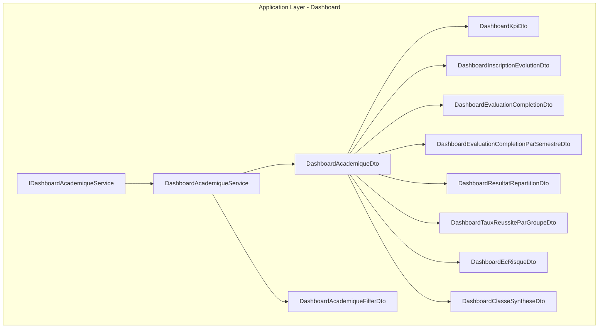
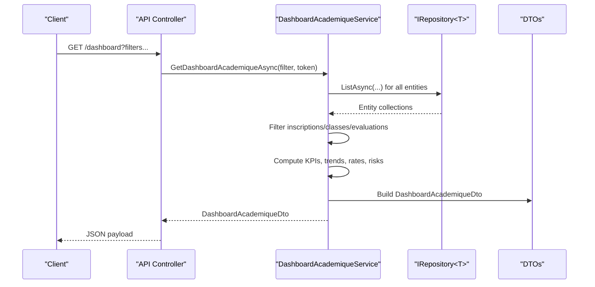
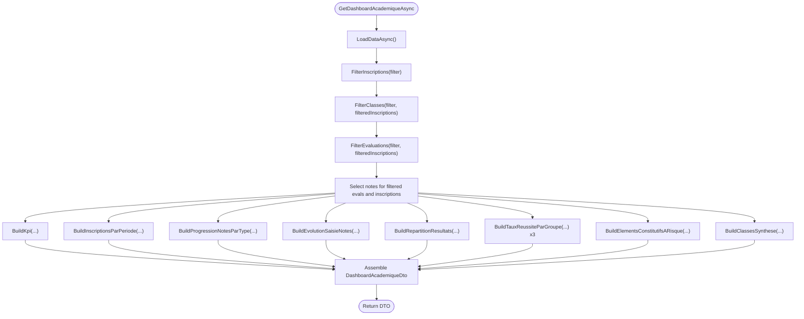
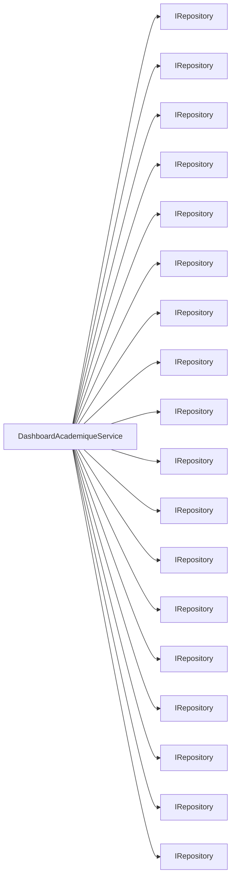

# Dashboard & Analytics Services

<cite>
**Referenced Files in This Document**
- [IDashboardAcademiqueService.cs](file://src/RIIS.Academic.Application/Dashboard/Services/IDashboardAcademiqueService.cs)
- [DashboardAcademiqueService.cs](file://src/RIIS.Academic.Application/Dashboard/Services/DashboardAcademiqueService.cs)
- [DashboardAcademiqueDto.cs](file://src/RIIS.Academic.Application/Dashboard/Dtos/DashboardAcademiqueDto.cs)
- [DashboardKpiDto.cs](file://src/RIIS.Academic.Application/Dashboard/Dtos/DashboardKpiDto.cs)
- [DashboardAcademiqueFilterDto.cs](file://src/RIIS.Academic.Application/Dashboard/Dtos/DashboardAcademiqueFilterDto.cs)
- [DashboardInscriptionEvolutionDto.cs](file://src/RIIS.Academic.Application/Dashboard/Dtos/DashboardInscriptionEvolutionDto.cs)
- [DashboardEvaluationCompletionDto.cs](file://src/RIIS.Academic.Application/Dashboard/Dtos/DashboardEvaluationCompletionDto.cs)
- [DashboardEvaluationCompletionParSemestreDto.cs](file://src/RIIS.Academic.Application/Dashboard/Dtos/DashboardEvaluationCompletionParSemestreDto.cs)
- [DashboardResultatRepartitionDto.cs](file://src/RIIS.Academic.Application/Dashboard/Dtos/DashboardResultatRepartitionDto.cs)
- [DashboardTauxReussiteParGroupeDto.cs](file://src/RIIS.Academic.Application/Dashboard/Dtos/DashboardTauxReussiteParGroupeDto.cs)
- [DashboardEcRisqueDto.cs](file://src/RIIS.Academic.Application/Dashboard/Dtos/DashboardEcRisqueDto.cs)
- [DashboardClasseSyntheseDto.cs](file://src/RIIS.Academic.Application/Dashboard/Dtos/DashboardClasseSyntheseDto.cs)
</cite>

## Table of Contents
1. [Introduction](#introduction)
2. [Project Structure](#project-structure)
3. [Core Components](#core-components)
4. [Architecture Overview](#architecture-overview)
5. [Detailed Component Analysis](#detailed-component-analysis)
6. [Dependency Analysis](#dependency-analysis)
7. [Performance Considerations](#performance-considerations)
8. [Troubleshooting Guide](#troubleshooting-guide)
9. [Conclusion](#conclusion)

## Introduction
This document provides comprehensive documentation for the Dashboard and Analytics services that deliver academic performance metrics and statistical reporting. It focuses on the IDashboardAcademiqueService interface and its implementation, DashboardAcademiqueService, which aggregates data from multiple academic domains to compute KPIs, enrollment statistics, graduation rates, evaluation completion progress, and class-level analytics. The service exposes a single primary method that returns a rich DTO containing all dashboard sections, enabling real-time dashboards with filtering by academic year, cycle, level, program, specialty, class, curriculum, semester, and session code.

## Project Structure
The dashboard feature resides in the Application layer under the Dashboard namespace:
- Services: IDashboardAcademiqueService and DashboardAcademiqueService
- Dtos: A set of strongly-typed response models for each dashboard section (KPIs, enrollment evolution, evaluation completion, result distribution, success rates by group, at-risk elements, and class synthesis)

**Diagram sources**
- [IDashboardAcademiqueService.cs:5-10](file://src/RIIS.Academic.Application/Dashboard/Services/IDashboardAcademiqueService.cs#L5-L10)
- [DashboardAcademiqueService.cs:7-58](file://src/RIIS.Academic.Application/Dashboard/Services/DashboardAcademiqueService.cs#L7-L58)
- [DashboardAcademiqueDto.cs:3-17](file://src/RIIS.Academic.Application/Dashboard/Dtos/DashboardAcademiqueDto.cs#L3-L17)
- [DashboardKpiDto.cs:3-21](file://src/RIIS.Academic.Application/Dashboard/Dtos/DashboardKpiDto.cs#L3-L21)
- [DashboardAcademiqueFilterDto.cs:3-14](file://src/RIIS.Academic.Application/Dashboard/Dtos/DashboardAcademiqueFilterDto.cs#L3-L14)
- [DashboardInscriptionEvolutionDto.cs:3-8](file://src/RIIS.Academic.Application/Dashboard/Dtos/DashboardInscriptionEvolutionDto.cs#L3-L8)
- [DashboardEvaluationCompletionDto.cs:3-11](file://src/RIIS.Academic.Application/Dashboard/Dtos/DashboardEvaluationCompletionDto.cs#L3-L11)
- [DashboardEvaluationCompletionParSemestreDto.cs:3-12](file://src/RIIS.Academic.Application/Dashboard/Dtos/DashboardEvaluationCompletionParSemestreDto.cs#L3-L12)
- [DashboardResultatRepartitionDto.cs:3-10](file://src/RIIS.Academic.Application/Dashboard/Dtos/DashboardResultatRepartitionDto.cs#L3-L10)
- [DashboardTauxReussiteParGroupeDto.cs:3-14](file://src/RIIS.Academic.Application/Dashboard/Dtos/DashboardTauxReussiteParGroupeDto.cs#L3-L14)
- [DashboardEcRisqueDto.cs:3-16](file://src/RIIS.Academic.Application/Dashboard/Dtos/DashboardEcRisqueDto.cs#L3-L16)
- [DashboardClasseSyntheseDto.cs:3-32](file://src/RIIS.Academic.Application/Dashboard/Dtos/DashboardClasseSyntheseDto.cs#L3-L32)

**Section sources**
- [IDashboardAcademiqueService.cs:5-10](file://src/RIIS.Academic.Application/Dashboard/Services/IDashboardAcademiqueService.cs#L5-L10)
- [DashboardAcademiqueService.cs:7-58](file://src/RIIS.Academic.Application/Dashboard/Services/DashboardAcademiqueService.cs#L7-L58)
- [DashboardAcademiqueDto.cs:3-17](file://src/RIIS.Academic.Application/Dashboard/Dtos/DashboardAcademiqueDto.cs#L3-L17)

## Core Components
- IDashboardAcademiqueService: Defines the contract for retrieving the full academic dashboard snapshot via GetDashboardAcademiqueAsync with optional filters and cancellation support.
- DashboardAcademiqueService: Implements the contract by loading domain entities from multiple repositories, applying filters, computing KPIs and analytics, and assembling the response DTO.

Key responsibilities:
- Data aggregation across academic years, cycles, programs, classes, evaluations, notes, results, and administrative outputs
- Filtering by academic context and curriculum scope
- Computing enrollment trends, evaluation completion rates, result distributions, success rates by groups, at-risk elements, and class summaries
- Returning a single cohesive DTO for UI consumption

**Section sources**
- [IDashboardAcademiqueService.cs:5-10](file://src/RIIS.Academic.Application/Dashboard/Services/IDashboardAcademiqueService.cs#L5-L10)
- [DashboardAcademiqueService.cs:27-58](file://src/RIIS.Academic.Application/Dashboard/Services/DashboardAcademiqueService.cs#L27-L58)

## Architecture Overview
The service follows a layered approach:
- Presentation/API consumes IDashboardAcademiqueService
- Application service orchestrates data retrieval and computation
- Domain entities are accessed through generic repositories
- Results are mapped into strongly typed DTOs for efficient serialization

**Diagram sources**
- [DashboardAcademiqueService.cs:27-79](file://src/RIIS.Academic.Application/Dashboard/Services/DashboardAcademiqueService.cs#L27-L79)
- [DashboardAcademiqueDto.cs:3-17](file://src/RIIS.Academic.Application/Dashboard/Dtos/DashboardAcademiqueDto.cs#L3-L17)

## Detailed Component Analysis

### IDashboardAcademiqueService
- Purpose: Exposes a single method to retrieve the complete academic dashboard snapshot with optional filters and cancellation.
- Input: Optional filter object and cancellation token.
- Output: DashboardAcademiqueDto containing all dashboard sections.

**Section sources**
- [IDashboardAcademiqueService.cs:5-10](file://src/RIIS.Academic.Application/Dashboard/Services/IDashboardAcademiqueService.cs#L5-L10)

### DashboardAcademiqueService
- Responsibilities:
  - Load all relevant domain entities once per request via repositories
  - Apply multi-criteria filters to inscriptions, classes, and evaluations
  - Compute KPIs, enrollment evolution, evaluation completion by type and semester, result distribution, success rates by cycle/level/program, at-risk elements, and class synthesis
  - Assemble and return DashboardAcademiqueDto

- Key methods:
  - GetDashboardAcademiqueAsync: Entry point orchestrating load, filter, compute, and assemble
  - LoadDataAsync: Bulk loads entities from repositories
  - FilterInscriptions/FilterClasses/FilterEvaluations: Context-aware filtering
  - BuildKpi: Aggregates counts, averages, and percentages for overall health
  - BuildInscriptionsParPeriode: Enrollment trend over time
  - BuildProgressionNotesParType: Evaluation completion by type
  - BuildEvolutionSaisieNotes: Completion by semester and evaluation type
  - BuildRepartitionResultats: Distribution of outcomes (admitted, retake, fail, not calculated)
  - BuildTauxReussiteParGroupe: Success rate grouped by cycle, level, or program
  - BuildElementsConstitutifsARisque: At-risk elements based on failure rates and averages
  - BuildClassesSynthese: Class-level summary including grades, credits, and outputs

**Diagram sources**
- [DashboardAcademiqueService.cs:27-58](file://src/RIIS.Academic.Application/Dashboard/Services/DashboardAcademiqueService.cs#L27-L58)
- [DashboardAcademiqueService.cs:60-79](file://src/RIIS.Academic.Application/Dashboard/Services/DashboardAcademiqueService.cs#L60-L79)
- [DashboardAcademiqueService.cs:81-207](file://src/RIIS.Academic.Application/Dashboard/Services/DashboardAcademiqueService.cs#L81-L207)
- [DashboardAcademiqueService.cs:209-467](file://src/RIIS.Academic.Application/Dashboard/Services/DashboardAcademiqueService.cs#L209-L467)

**Section sources**
- [DashboardAcademiqueService.cs:27-58](file://src/RIIS.Academic.Application/Dashboard/Services/DashboardAcademiqueService.cs#L27-L58)
- [DashboardAcademiqueService.cs:60-79](file://src/RIIS.Academic.Application/Dashboard/Services/DashboardAcademiqueService.cs#L60-L79)
- [DashboardAcademiqueService.cs:81-207](file://src/RIIS.Academic.Application/Dashboard/Services/DashboardAcademiqueService.cs#L81-L207)
- [DashboardAcademiqueService.cs:209-467](file://src/RIIS.Academic.Application/Dashboard/Services/DashboardAcademiqueService.cs#L209-L467)

### DTOs and Models
- DashboardAcademiqueDto: Root response containing generation timestamp, applied filters, KPIs, and all analytics lists
- DashboardKpiDto: High-level metrics including counts, averages, success/retake/failure rates, and output availability
- DashboardAcademiqueFilterDto: Filters for academic year, cycle, level, program, specialty, class, curriculum, semester, and session code
- DashboardInscriptionEvolutionDto: Monthly enrollment counts with ordering
- DashboardEvaluationCompletionDto: Completion metrics per evaluation type
- DashboardEvaluationCompletionParSemestreDto: Completion metrics per semester and evaluation type
- DashboardResultatRepartitionDto: Outcome distribution with labels and colors
- DashboardTauxReussiteParGroupeDto: Success rate grouped by cycle, level, or program
- DashboardEcRisqueDto: At-risk elements with average, failure count, and failure rate
- DashboardClasseSyntheseDto: Class-level summary including enrollment, grading coverage, averages, credits, outcomes, and outputs

**Section sources**
- [DashboardAcademiqueDto.cs:3-17](file://src/RIIS.Academic.Application/Dashboard/Dtos/DashboardAcademiqueDto.cs#L3-L17)
- [DashboardKpiDto.cs:3-21](file://src/RIIS.Academic.Application/Dashboard/Dtos/DashboardKpiDto.cs#L3-L21)
- [DashboardAcademiqueFilterDto.cs:3-14](file://src/RIIS.Academic.Application/Dashboard/Dtos/DashboardAcademiqueFilterDto.cs#L3-L14)
- [DashboardInscriptionEvolutionDto.cs:3-8](file://src/RIIS.Academic.Application/Dashboard/Dtos/DashboardInscriptionEvolutionDto.cs#L3-L8)
- [DashboardEvaluationCompletionDto.cs:3-11](file://src/RIIS.Academic.Application/Dashboard/Dtos/DashboardEvaluationCompletionDto.cs#L3-L11)
- [DashboardEvaluationCompletionParSemestreDto.cs:3-12](file://src/RIIS.Academic.Application/Dashboard/Dtos/DashboardEvaluationCompletionParSemestreDto.cs#L3-L12)
- [DashboardResultatRepartitionDto.cs:3-10](file://src/RIIS.Academic.Application/Dashboard/Dtos/DashboardResultatRepartitionDto.cs#L3-L10)
- [DashboardTauxReussiteParGroupeDto.cs:3-14](file://src/RIIS.Academic.Application/Dashboard/Dtos/DashboardTauxReussiteParGroupeDto.cs#L3-L14)
- [DashboardEcRisqueDto.cs:3-16](file://src/RIIS.Academic.Application/Dashboard/Dtos/DashboardEcRisqueDto.cs#L3-L16)
- [DashboardClasseSyntheseDto.cs:3-32](file://src/RIIS.Academic.Application/Dashboard/Dtos/DashboardClasseSyntheseDto.cs#L3-L32)

## Dependency Analysis
- The service depends on multiple IRepository<T> instances for domain entities spanning referentials, programs, classes, enrollments, evaluations, notes, results, and administrative outputs
- Cohesion is high within the service; coupling is to repository abstractions only, promoting testability and separation of concerns
- No circular dependencies are evident; the service reads from repositories and writes to DTOs

**Diagram sources**
- [DashboardAcademiqueService.cs:7-25](file://src/RIIS.Academic.Application/Dashboard/Services/DashboardAcademiqueService.cs#L7-L25)

**Section sources**
- [DashboardAcademiqueService.cs:7-25](file://src/RIIS.Academic.Application/Dashboard/Services/DashboardAcademiqueService.cs#L7-L25)

## Performance Considerations
- Single-pass data loading: All required entities are loaded once per request via repositories to minimize round-trips and enable in-memory filtering and aggregation
- In-memory filtering: After loading, filtering is performed using LINQ over collections, leveraging hash sets for fast membership checks when matching IDs
- Grouping and aggregation: Uses efficient grouping and aggregation operations to compute KPIs, trends, and rates
- Avoided N+1 queries: By loading entire entity sets and joining in memory, the service avoids repeated database calls during analysis
- Caching strategy: No in-process caching is implemented in the service; consider adding application-level caching (e.g., distributed cache) for read-heavy scenarios where data changes infrequently
- Pagination: Not used in this service; if datasets grow significantly, consider introducing server-side pagination or pre-aggregated materialized views
- Concurrency: Supports cancellation tokens to allow request cancellation during long-running computations

[No sources needed since this section provides general guidance]

## Troubleshooting Guide
- Empty or unexpected results:
  - Verify filter values (academic year, cycle, level, program, specialty, class, curriculum, semester, session code) match existing entities
  - Ensure related entities exist (e.g., semesters linked to units, evaluations linked to semesters)
- Incorrect KPIs or rates:
  - Check decision and validation status mappings used to classify admitted, retake, and failure outcomes
  - Confirm expected note counts are computed based on evaluation types and curriculum compatibility
- Performance issues:
  - Large datasets may cause slow responses due to in-memory processing; consider caching or pre-aggregation
  - Validate repository implementations for efficient ListAsync calls and appropriate indexing on frequently filtered fields

**Section sources**
- [DashboardAcademiqueService.cs:209-246](file://src/RIIS.Academic.Application/Dashboard/Services/DashboardAcademiqueService.cs#L209-L246)
- [DashboardAcademiqueService.cs:315-335](file://src/RIIS.Academic.Application/Dashboard/Services/DashboardAcademiqueService.cs#L315-L335)
- [DashboardAcademiqueService.cs:583-590](file://src/RIIS.Academic.Application/Dashboard/Services/DashboardAcademiqueService.cs#L583-L590)

## Conclusion
The Dashboard and Analytics services provide a robust, unified view of academic performance through a single endpoint that aggregates and computes key metrics across multiple academic domains. The design emphasizes clarity, testability, and maintainability by separating concerns between interfaces, services, and DTOs. With careful consideration of dataset size and access patterns, additional optimizations such as caching and pre-aggregation can further enhance responsiveness while preserving accuracy and comprehensiveness.