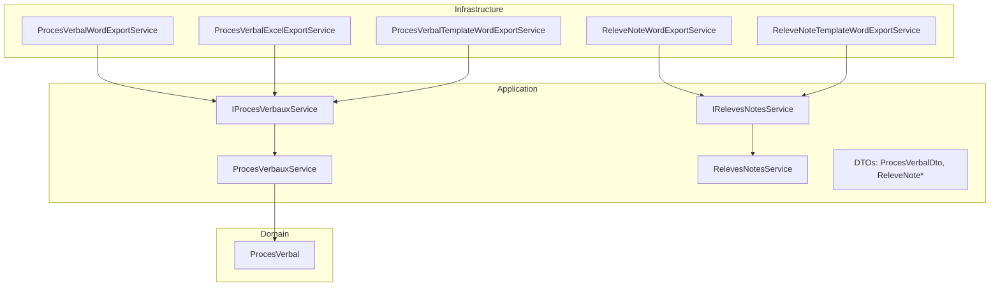
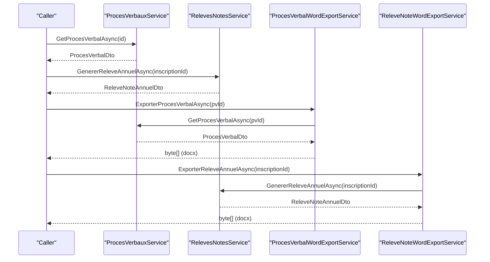
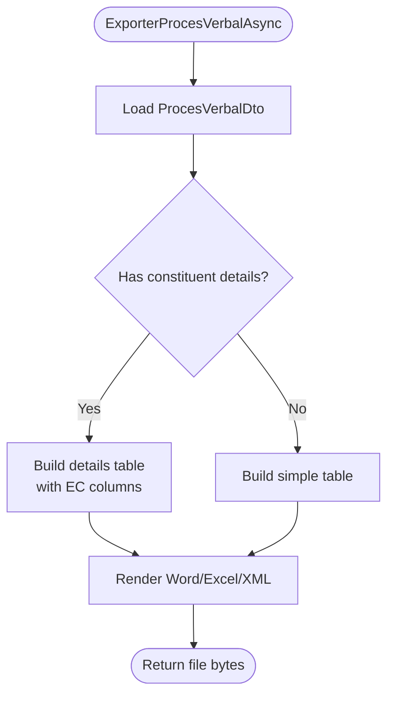
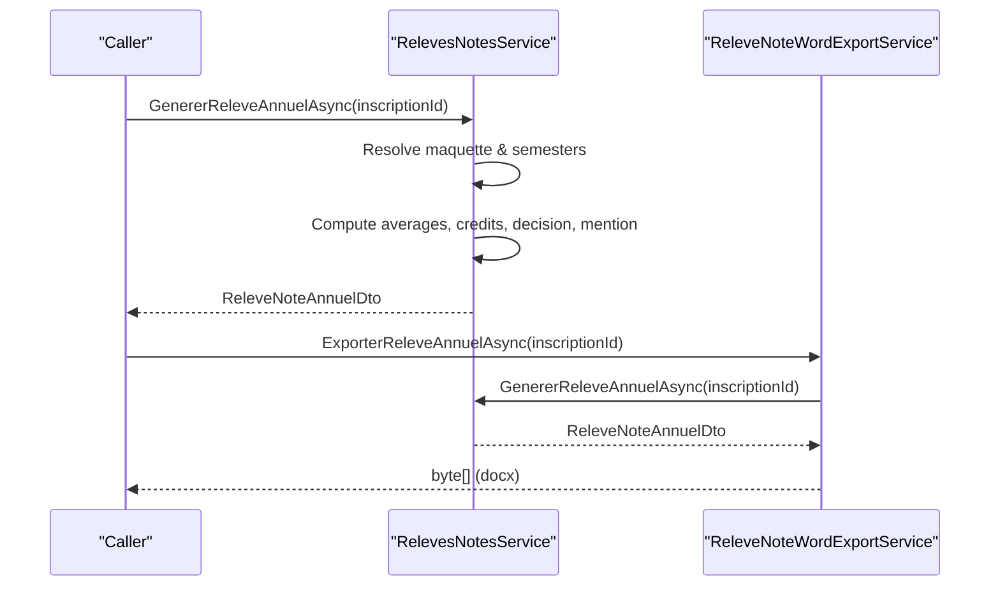
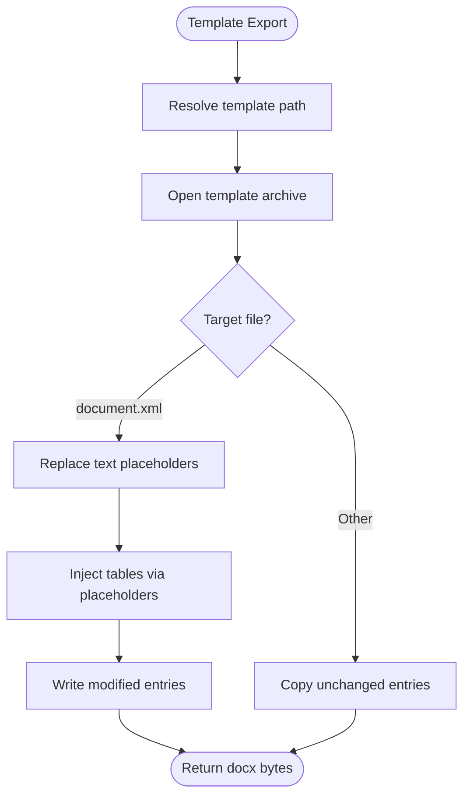
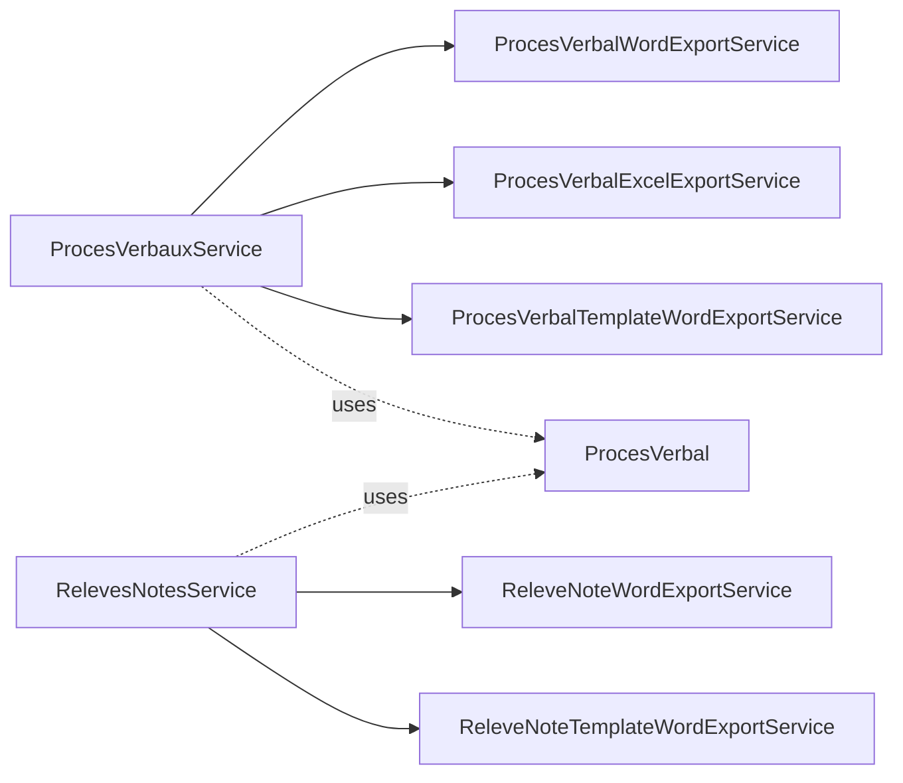

# Document Generation Services

<cite>
**Referenced Files in This Document**
- [IProcesVerbauxService.cs](file://src/RIIS.Academic.Application/ProcesVerbaux/Services/IProcesVerbauxService.cs)
- [ProcesVerbauxService.cs](file://src/RIIS.Academic.Application/ProcesVerbaux/Services/ProcesVerbauxService.cs)
- [ProcesVerbalDto.cs](file://src/RIIS.Academic.Application/ProcesVerbaux/Dtos/ProcesVerbalDto.cs)
- [IRelevesNotesService.cs](file://src/RIIS.Academic.Application/Releves/Services/IRelevesNotesService.cs)
- [RelevesNotesService.cs](file://src/RIIS.Academic.Application/Releves/Services/RelevesNotesService.cs)
- [ReleveNoteAnnuelDto.cs](file://src/RIIS.Academic.Application/Releves/Dtos/ReleveNoteAnnuelDto.cs)
- [ReleveNoteSemestreDto.cs](file://src/RIIS.Academic.Application/Releves/Dtos/ReleveNoteSemestreDto.cs)
- [ProcesVerbalWordExportService.cs](file://src/RIIS.Academic.Infrastructure/Documents/ProcesVerbalWordExportService.cs)
- [ProcesVerbalExcelExportService.cs](file://src/RIIS.Academic.Infrastructure/Documents/ProcesVerbalExcelExportService.cs)
- [ProcesVerbalTemplateWordExportService.cs](file://src/RIIS.Academic.Infrastructure/Documents/ProcesVerbalTemplateWordExportService.cs)
- [ReleveNoteWordExportService.cs](file://src/RIIS.Academic.Infrastructure/Documents/ReleveNoteWordExportService.cs)
- [ReleveNoteTemplateWordExportService.cs](file://src/RIIS.Academic.Infrastructure/Documents/ReleveNoteTemplateWordExportService.cs)
- [ProcesVerbal.cs](file://src/RIIS.Academic.Domain/ProcesVerbaux/ProcesVerbal.cs)
</cite>

## Table of Contents
1. Introduction
2. Project Structure
3. Core Components
4. Architecture Overview
5. Detailed Component Analysis
6. Dependency Analysis
7. Performance Considerations
8. Troubleshooting Guide
9. Conclusion

## Introduction
This document explains the Document Generation services that produce official transcripts, meeting minutes (Proces Verbaux), and academic certificates. It covers:
- Meeting minutes processing via IProcesVerbauxService
- Transcript generation via IRelevesNotesService
- Export services for Word and Excel outputs
- DTOs used for templates, content mapping, and export formats
- Template processing, data binding, rendering, and batch-oriented workflows
- Integration with domain entities to ensure accurate academic records and institutional compliance

## Project Structure
The solution is organized by layers:
- Application layer defines services and DTOs for business logic and data shaping
- Infrastructure layer implements document generation (Word/Excel) and template-based rendering
- Domain layer provides core entities such as ProcesVerbal and related academic structures

**Diagram sources**
- [IProcesVerbauxService.cs:7-30](file://src/RIIS.Academic.Application/ProcesVerbaux/Services/IProcesVerbauxService.cs#L7-L30)
- [ProcesVerbauxService.cs:9-16](file://src/RIIS.Academic.Application/ProcesVerbaux/Services/ProcesVerbauxService.cs#L9-L16)
- [IRelevesNotesService.cs:5-17](file://src/RIIS.Academic.Application/Releves/Services/IRelevesNotesService.cs#L5-L17)
- [RelevesNotesService.cs:8-23](file://src/RIIS.Academic.Application/Releves/Services/RelevesNotesService.cs#L8-L23)
- [ProcesVerbal.cs:3-23](file://src/RIIS.Academic.Domain/ProcesVerbaux/ProcesVerbal.cs#L3-L23)

**Section sources**
- [IProcesVerbauxService.cs:7-30](file://src/RIIS.Academic.Application/ProcesVerbaux/Services/IProcesVerbauxService.cs#L7-L30)
- [ProcesVerbauxService.cs:9-16](file://src/RIIS.Academic.Application/ProcesVerbaux/Services/ProcesVerbauxService.cs#L9-L16)
- [IRelevesNotesService.cs:5-17](file://src/RIIS.Academic.Application/Releves/Services/IRelevesNotesService.cs#L5-L17)
- [RelevesNotesService.cs:8-23](file://src/RIIS.Academic.Application/Releves/Services/RelevesNotesService.cs#L8-L23)
- [ProcesVerbal.cs:3-23](file://src/RIIS.Academic.Domain/ProcesVerbaux/ProcesVerbal.cs#L3-L23)

## Core Components
- IProcesVerbauxService: Provides queries for meeting minutes (Proces Verbaux) including filtering by academic year, cycle, class, semester, and type; returns DTOs enriched with labels and aggregates.
- ProcesVerbauxService: Implements filtering, joins across domain entities, builds DTOs, parses embedded JSON details for constituent elements, and computes summary statistics.
- IRelevesNotesService: Exposes methods to list eligible students and generate an annual transcript DTO for a given enrollment.
- RelevesNotesService: Resolves pedagogical blueprint, semesters, units, constituent elements, evaluations, and grades; calculates averages, credits, decisions, mentions, and grades per semester and annually.
- Export services:
  - Word exports: Build Office Open XML documents directly or from templates by replacing placeholders and injecting tables.
  - Excel export: Build spreadsheet XML with headers, merged cells, styles, and print settings.

**Section sources**
- [IProcesVerbauxService.cs:7-30](file://src/RIIS.Academic.Application/ProcesVerbaux/Services/IProcesVerbauxService.cs#L7-L30)
- [ProcesVerbauxService.cs:18-87](file://src/RIIS.Academic.Application/ProcesVerbaux/Services/ProcesVerbauxService.cs#L18-L87)
- [IRelevesNotesService.cs:5-17](file://src/RIIS.Academic.Application/Releves/Services/IRelevesNotesService.cs#L5-L17)
- [RelevesNotesService.cs:25-200](file://src/RIIS.Academic.Application/Releves/Services/RelevesNotesService.cs#L25-L200)
- [ProcesVerbalWordExportService.cs:10-45](file://src/RIIS.Academic.Infrastructure/Documents/ProcesVerbalWordExportService.cs#L10-L45)
- [ProcesVerbalExcelExportService.cs:10-50](file://src/RIIS.Academic.Infrastructure/Documents/ProcesVerbalExcelExportService.cs#L10-L50)
- [ReleveNoteWordExportService.cs:10-43](file://src/RIIS.Academic.Infrastructure/Documents/ReleveNoteWordExportService.cs#L10-L43)
- [ReleveNoteTemplateWordExportService.cs:11-68](file://src/RIIS.Academic.Infrastructure/Documents/ReleveNoteTemplateWordExportService.cs#L11-L68)
- [ProcesVerbalTemplateWordExportService.cs:11-68](file://src/RIIS.Academic.Infrastructure/Documents/ProcesVerbalTemplateWordExportService.cs#L11-L68)

## Architecture Overview
The architecture separates concerns into application services (data gathering and transformation) and infrastructure exporters (document rendering). DTOs act as stable contracts between layers.

**Diagram sources**
- [ProcesVerbauxService.cs:62-87](file://src/RIIS.Academic.Application/ProcesVerbaux/Services/ProcesVerbauxService.cs#L62-L87)
- [RelevesNotesService.cs:93-200](file://src/RIIS.Academic.Application/Releves/Services/RelevesNotesService.cs#L93-L200)
- [ProcesVerbalWordExportService.cs:12-45](file://src/RIIS.Academic.Infrastructure/Documents/ProcesVerbalWordExportService.cs#L12-L45)
- [ReleveNoteWordExportService.cs:12-43](file://src/RIIS.Academic.Infrastructure/Documents/ReleveNoteWordExportService.cs#L12-L43)

## Detailed Component Analysis

### Meeting Minutes Processing (Proces Verbaux)
- Querying and filtering: Supports filters by academic year, cycle, class, semester number, and type. Aggregates are computed (min/max average, counts by decision).
- Data binding: Enriches IDs with human-readable labels (cycle, pathway, class, semester) and maps nested JSON details for constituent elements.
- Rendering:
  - Word export: Builds Office Open XML document with header info, student table (simple or detailed), and signature block.
  - Excel export: Produces a worksheet with merged headers, frozen panes, column widths, and styled notes.
  - Template Word export: Loads a template .docx, replaces text placeholders, and injects a table placeholder with generated rows.

**Diagram sources**
- [ProcesVerbalWordExportService.cs:32-89](file://src/RIIS.Academic.Infrastructure/Documents/ProcesVerbalWordExportService.cs#L32-L89)
- [ProcesVerbalExcelExportService.cs:34-139](file://src/RIIS.Academic.Infrastructure/Documents/ProcesVerbalExcelExportService.cs#L34-L139)
- [ProcesVerbalTemplateWordExportService.cs:36-68](file://src/RIIS.Academic.Infrastructure/Documents/ProcesVerbalTemplateWordExportService.cs#L36-L68)

**Section sources**
- [ProcesVerbauxService.cs:18-87](file://src/RIIS.Academic.Application/ProcesVerbaux/Services/ProcesVerbauxService.cs#L18-L87)
- [ProcesVerbauxService.cs:180-243](file://src/RIIS.Academic.Application/ProcesVerbaux/Services/ProcesVerbauxService.cs#L180-L243)
- [ProcesVerbauxService.cs:245-377](file://src/RIIS.Academic.Application/ProcesVerbaux/Services/ProcesVerbauxService.cs#L245-L377)
- [ProcesVerbalDto.cs:5-40](file://src/RIIS.Academic.Application/ProcesVerbaux/Dtos/ProcesVerbalDto.cs#L5-L40)
- [ProcesVerbalWordExportService.cs:12-45](file://src/RIIS.Academic.Infrastructure/Documents/ProcesVerbalWordExportService.cs#L12-L45)
- [ProcesVerbalExcelExportService.cs:14-50](file://src/RIIS.Academic.Infrastructure/Documents/ProcesVerbalExcelExportService.cs#L14-L50)
- [ProcesVerbalTemplateWordExportService.cs:16-68](file://src/RIIS.Academic.Infrastructure/Documents/ProcesVerbalTemplateWordExportService.cs#L16-L68)

### Transcript Generation (Annual Notes)
- Eligibility: Lists available students filtered by academic year, cycle, study level, and class.
- Generation: Resolves pedagogical blueprint, semesters, units, constituent elements, evaluations, and grades; computes per-element averages, final scores, credits, and decisions; aggregates semester and annual summaries; determines mention and decision.
- Rendering:
  - Word export: Builds a structured transcript with student info, per-semester tables, recap table, decision/mention line, and signature area.
  - Template Word export: Loads a template, replaces placeholders (e.g., student name, cycle, year), and injects tables where placeholders exist.

**Diagram sources**
- [RelevesNotesService.cs:93-200](file://src/RIIS.Academic.Application/Releves/Services/RelevesNotesService.cs#L93-L200)
- [ReleveNoteWordExportService.cs:12-43](file://src/RIIS.Academic.Infrastructure/Documents/ReleveNoteWordExportService.cs#L12-L43)
- [ReleveNoteTemplateWordExportService.cs:16-68](file://src/RIIS.Academic.Infrastructure/Documents/ReleveNoteTemplateWordExportService.cs#L16-L68)

**Section sources**
- [RelevesNotesService.cs:25-91](file://src/RIIS.Academic.Application/Releves/Services/RelevesNotesService.cs#L25-L91)
- [RelevesNotesService.cs:93-200](file://src/RIIS.Academic.Application/Releves/Services/RelevesNotesService.cs#L93-L200)
- [ReleveNoteAnnuelDto.cs:3-25](file://src/RIIS.Academic.Application/Releves/Dtos/ReleveNoteAnnuelDto.cs#L3-L25)
- [ReleveNoteSemestreDto.cs:3-13](file://src/RIIS.Academic.Application/Releves/Dtos/ReleveNoteSemestreDto.cs#L3-L13)
- [ReleveNoteWordExportService.cs:30-93](file://src/RIIS.Academic.Infrastructure/Documents/ReleveNoteWordExportService.cs#L30-L93)
- [ReleveNoteTemplateWordExportService.cs:88-178](file://src/RIIS.Academic.Infrastructure/Documents/ReleveNoteTemplateWordExportService.cs#L88-L178)

### DTOs for Templates, Content Mapping, and Export Formats
- ProcesVerbalDto: Encapsulates meeting minutes metadata, labels, aggregates, and lines with constituent element details. Used by all PV exports.
- ReleveNoteAnnuelDto: Encapsulates transcript header, per-semester lists, resume, annual average, credits, decision, and mention.
- ReleveNoteSemestreDto: Encapsulates per-semester totals, averages, credits, and grade.

These DTOs decouple domain complexity from presentation and enable consistent rendering across Word and Excel.

**Section sources**
- [ProcesVerbalDto.cs:5-40](file://src/RIIS.Academic.Application/ProcesVerbaux/Dtos/ProcesVerbalDto.cs#L5-L40)
- [ReleveNoteAnnuelDto.cs:3-25](file://src/RIIS.Academic.Application/Releves/Dtos/ReleveNoteAnnuelDto.cs#L3-L25)
- [ReleveNoteSemestreDto.cs:3-13](file://src/RIIS.Academic.Application/Releves/Dtos/ReleveNoteSemestreDto.cs#L3-L13)

### Template Management and Format Conversion
- Template discovery: Template services locate .docx templates at runtime from multiple candidate paths and throw if missing.
- Placeholder replacement: Text placeholders (e.g., {{TITRE}}, {{CYCLE_FORMATION}}) are replaced in document.xml; table placeholders (e.g., {{RELEVE_TABLES}}, {{PV_TABLE}}) are replaced with generated XML tables.
- Direct rendering: Non-template Word and Excel exporters build Office Open XML parts programmatically, ensuring deterministic output without external templates.

**Diagram sources**
- [ReleveNoteTemplateWordExportService.cs:70-86](file://src/RIIS.Academic.Infrastructure/Documents/ReleveNoteTemplateWordExportService.cs#L70-L86)
- [ReleveNoteTemplateWordExportService.cs:88-178](file://src/RIIS.Academic.Infrastructure/Documents/ReleveNoteTemplateWordExportService.cs#L88-L178)
- [ProcesVerbalTemplateWordExportService.cs:70-86](file://src/RIIS.Academic.Infrastructure/Documents/ProcesVerbalTemplateWordExportService.cs#L70-L86)
- [ProcesVerbalTemplateWordExportService.cs:88-147](file://src/RIIS.Academic.Infrastructure/Documents/ProcesVerbalTemplateWordExportService.cs#L88-L147)

**Section sources**
- [ReleveNoteTemplateWordExportService.cs:70-86](file://src/RIIS.Academic.Infrastructure/Documents/ReleveNoteTemplateWordExportService.cs#L70-L86)
- [ReleveNoteTemplateWordExportService.cs:88-178](file://src/RIIS.Academic.Infrastructure/Documents/ReleveNoteTemplateWordExportService.cs#L88-L178)
- [ProcesVerbalTemplateWordExportService.cs:70-86](file://src/RIIS.Academic.Infrastructure/Documents/ProcesVerbalTemplateWordExportService.cs#L70-L86)
- [ProcesVerbalTemplateWordExportService.cs:88-147](file://src/RIIS.Academic.Infrastructure/Documents/ProcesVerbalTemplateWordExportService.cs#L88-L147)

### Batch Generation Operations
- Meeting minutes: The service exposes listing and lookup methods suitable for iterating over many items and exporting each to Word/Excel or template-based Word files.
- Transcripts: Generate per-student annual transcripts in loops over eligible students returned by the availability query.

Operational guidance:
- Use cancellation tokens to support long-running batches.
- Stream or chunk large result sets when integrating with UI or APIs.
- Cache lookups (e.g., cycles, classes, semesters) within a single request scope to avoid repeated loads.

**Section sources**
- [IProcesVerbauxService.cs:9-29](file://src/RIIS.Academic.Application/ProcesVerbaux/Services/IProcesVerbauxService.cs#L9-L29)
- [ProcesVerbauxService.cs:18-87](file://src/RIIS.Academic.Application/ProcesVerbaux/Services/ProcesVerbauxService.cs#L18-L87)
- [IRelevesNotesService.cs:7-16](file://src/RIIS.Academic.Application/Releves/Services/IRelevesNotesService.cs#L7-L16)
- [RelevesNotesService.cs:25-91](file://src/RIIS.Academic.Application/Releves/Services/RelevesNotesService.cs#L25-L91)

## Dependency Analysis
- Application services depend on repositories for domain entities and compute DTOs.
- Export services depend on application services to obtain DTOs and then render documents.
- Template services additionally depend on filesystem access to locate templates.

**Diagram sources**
- [ProcesVerbauxService.cs:9-16](file://src/RIIS.Academic.Application/ProcesVerbaux/Services/ProcesVerbauxService.cs#L9-L16)
- [RelevesNotesService.cs:8-23](file://src/RIIS.Academic.Application/Releves/Services/RelevesNotesService.cs#L8-L23)
- [ProcesVerbalWordExportService.cs:10-18](file://src/RIIS.Academic.Infrastructure/Documents/ProcesVerbalWordExportService.cs#L10-L18)
- [ProcesVerbalExcelExportService.cs:10-18](file://src/RIIS.Academic.Infrastructure/Documents/ProcesVerbalExcelExportService.cs#L10-L18)
- [ProcesVerbalTemplateWordExportService.cs:11-22](file://src/RIIS.Academic.Infrastructure/Documents/ProcesVerbalTemplateWordExportService.cs#L11-L22)
- [ReleveNoteWordExportService.cs:10-16](file://src/RIIS.Academic.Infrastructure/Documents/ReleveNoteWordExportService.cs#L10-L16)
- [ReleveNoteTemplateWordExportService.cs:11-22](file://src/RIIS.Academic.Infrastructure/Documents/ReleveNoteTemplateWordExportService.cs#L11-L22)
- [ProcesVerbal.cs:3-23](file://src/RIIS.Academic.Domain/ProcesVerbaux/ProcesVerbal.cs#L3-L23)

**Section sources**
- [ProcesVerbauxService.cs:9-16](file://src/RIIS.Academic.Application/ProcesVerbaux/Services/ProcesVerbauxService.cs#L9-L16)
- [RelevesNotesService.cs:8-23](file://src/RIIS.Academic.Application/Releves/Services/RelevesNotesService.cs#L8-L23)
- [ProcesVerbal.cs:3-23](file://src/RIIS.Academic.Domain/ProcesVerbaux/ProcesVerbal.cs#L3-L23)

## Performance Considerations
- In-memory aggregation: Both services load full entity collections into memory and filter in-process. For large datasets, consider pagination or server-side filtering at the repository layer.
- JSON parsing: Constituent details are parsed from JSON strings; errors are handled gracefully but add overhead. Ensure data integrity upstream.
- XML generation: Direct XML builders avoid external dependencies and are efficient; however, very large tables may increase memory usage. Consider streaming or chunked rendering for massive outputs.
- Template loading: Template resolution occurs per export; cache template streams if generating many documents in a short time.

[No sources needed since this section provides general guidance]

## Troubleshooting Guide
- Missing template: Template-based exports throw when the expected .docx template cannot be found. Verify template placement and permissions.
- Invalid or missing data: If required domain references are missing (e.g., student, academic year, pathway), services throw explicit exceptions during transcript generation. Validate inputs before calling.
- Empty results: Exporters return null when underlying data is not found; handle null responses in callers.
- Formatting issues: Note colors and styling rely on thresholds; verify numeric formatting and culture settings for decimal separators.

**Section sources**
- [ReleveNoteTemplateWordExportService.cs:70-86](file://src/RIIS.Academic.Infrastructure/Documents/ReleveNoteTemplateWordExportService.cs#L70-L86)
- [ProcesVerbalTemplateWordExportService.cs:70-86](file://src/RIIS.Academic.Infrastructure/Documents/ProcesVerbalTemplateWordExportService.cs#L70-L86)
- [RelevesNotesService.cs:119-134](file://src/RIIS.Academic.Application/Releves/Services/RelevesNotesService.cs#L119-L134)
- [ProcesVerbalWordExportService.cs:12-30](file://src/RIIS.Academic.Infrastructure/Documents/ProcesVerbalWordExportService.cs#L12-L30)
- [ReleveNoteWordExportService.cs:12-28](file://src/RIIS.Academic.Infrastructure/Documents/ReleveNoteWordExportService.cs#L12-L28)

## Conclusion
The Document Generation services provide robust, layered capabilities for producing official transcripts and meeting minutes in multiple formats. Application services encapsulate complex academic calculations and data enrichment, while infrastructure exporters deliver consistent, compliant outputs via direct XML generation or template-based rendering. By leveraging DTOs and clear separation of concerns, the system supports scalable batch operations and maintains high quality and accuracy for institutional records.