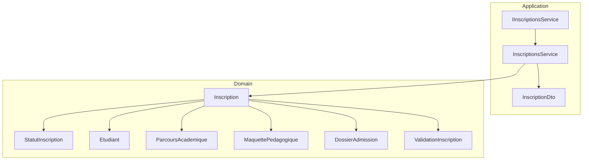
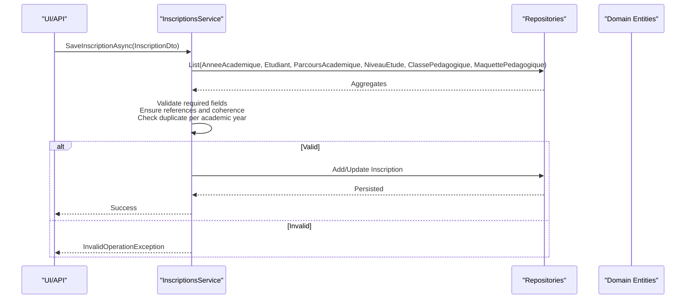
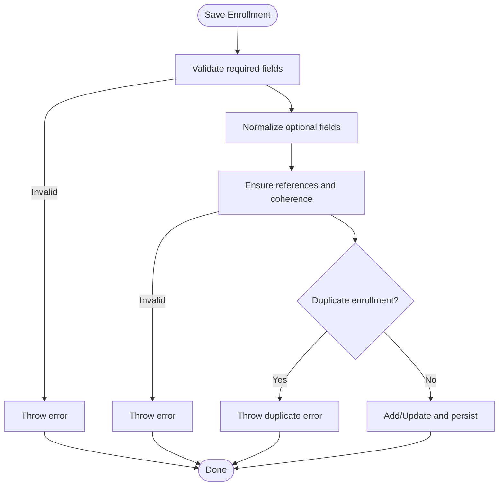
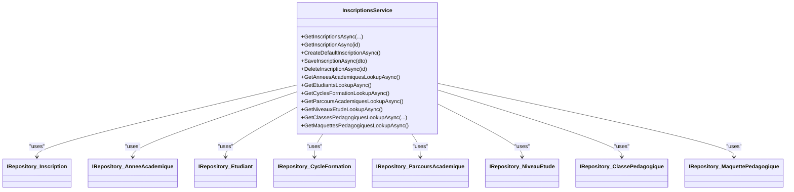

# Enrollment Services

<cite>
**Referenced Files in This Document**
- [IInscriptionsService.cs](file://RIIS.Academic.Application/Inscriptions/Services/IInscriptionsService.cs)
- [InscriptionsService.cs](file://RIIS.Academic.Application/Inscriptions/Services/InscriptionsService.cs)
- [InscriptionDto.cs](file://RIIS.Academic.Application/Inscriptions/Dtos/InscriptionDto.cs)
- [Inscription.cs](file://RIIS.Academic.Domain/Inscriptions/Inscription.cs)
- [DossierAdmission.cs](file://RIIS.Academic.Domain/Inscriptions/DossierAdmission.cs)
- [ValidationInscription.cs](file://RIIS.Academic.Domain/Inscriptions/ValidationInscription.cs)
- [StatutInscription.cs](file://RIIS.Academic.Domain/Enums/StatutInscription.cs)
- [Etudiant.cs](file://RIIS.Academic.Domain/Etudiants/Etudiant.cs)
- [ParcoursAcademique.cs](file://RIIS.Academic.Domain/Parcours/ParcoursAcademique.cs)
- [MaquettePedagogique.cs](file://RIIS.Academic.Domain/Programmes/MaquettePedagogique.cs)
- [IInscriptionService.cs](file://RIIS.Academic.Application/Abstractions/Services/IInscriptionService.cs)
</cite>

## Table of Contents
1. Introduction
2. Project Structure
3. Core Components
4. Architecture Overview
5. Detailed Component Analysis
6. Dependency Analysis
7. Performance Considerations
8. Troubleshooting Guide
9. Conclusion

## Introduction
This document explains the enrollment services that manage student admission and registration workflows. It focuses on the IInscriptionsService interface and its InscriptionsService implementation, covering admission application processing, enrollment validation, status tracking, and the complete registration lifecycle. It also documents the InscriptionDto data model and the data flow between admission and enrollment stages, including business rules for eligibility checks, prerequisite validation, and capacity management. Integration points with student management and academic program services are described to support end-to-end enrollment operations.

## Project Structure
The enrollment feature spans Application and Domain layers:
- Application layer exposes service interfaces and DTOs for UI and API consumption.
- Domain layer defines entities and enums that represent the enrollment state and relationships.
- Infrastructure provides persistence configuration and repository abstractions used by the service.

**Diagram sources**
- [IInscriptionsService.cs:6-31](file://RIIS.Academic.Application/Inscriptions/Services/IInscriptionsService.cs#L6-L31)
- [InscriptionsService.cs:8-16](file://RIIS.Academic.Application/Inscriptions/Services/InscriptionsService.cs#L8-L16)
- [InscriptionDto.cs:5-27](file://RIIS.Academic.Application/Inscriptions/Dtos/InscriptionDto.cs#L5-L27)
- [Inscription.cs:3-36](file://RIIS.Academic.Domain/Inscriptions/Inscription.cs#L3-L36)
- [StatutInscription.cs:3-9](file://RIIS.Academic.Domain/Enums/StatutInscription.cs#L3-L9)
- [Etudiant.cs:3-27](file://RIIS.Academic.Domain/Etudiants/Etudiant.cs#L3-L27)
- [ParcoursAcademique.cs:3-23](file://RIIS.Academic.Domain/Parcours/ParcoursAcademique.cs#L3-L23)
- [MaquettePedagogique.cs:5-30](file://RIIS.Academic.Domain/Programmes/MaquettePedagogique.cs#L5-L30)
- [DossierAdmission.cs:3-16](file://RIIS.Academic.Domain/Inscriptions/DossierAdmission.cs#L3-L16)
- [ValidationInscription.cs:3-17](file://RIIS.Academic.Domain/Inscriptions/ValidationInscription.cs#L3-L17)

**Section sources**
- [IInscriptionsService.cs:6-31](file://RIIS.Academic.Application/Inscriptions/Services/IInscriptionsService.cs#L6-L31)
- [InscriptionsService.cs:8-16](file://RIIS.Academic.Application/Inscriptions/Services/InscriptionsService.cs#L8-L16)
- [InscriptionDto.cs:5-27](file://RIIS.Academic.Application/Inscriptions/Dtos/InscriptionDto.cs#L5-L27)
- [Inscription.cs:3-36](file://RIIS.Academic.Domain/Inscriptions/Inscription.cs#L3-L36)
- [StatutInscription.cs:3-9](file://RIIS.Academic.Domain/Enums/StatutInscription.cs#L3-L9)
- [Etudiant.cs:3-27](file://RIIS.Academic.Domain/Etudiants/Etudiant.cs#L3-L27)
- [ParcoursAcademique.cs:3-23](file://RIIS.Academic.Domain/Parcours/ParcoursAcademique.cs#L3-L23)
- [MaquettePedagogique.cs:5-30](file://RIIS.Academic.Domain/Programmes/MaquettePedagogique.cs#L5-L30)
- [DossierAdmission.cs:3-16](file://RIIS.Academic.Domain/Inscriptions/DossierAdmission.cs#L3-L16)
- [ValidationInscription.cs:3-17](file://RIIS.Academic.Domain/Inscriptions/ValidationInscription.cs#L3-L17)

## Core Components
- IInscriptionsService: Defines query, create, save, delete, and lookup operations for enrollments.
- InscriptionsService: Implements CRUD and enrichment logic, validates references and coherence, enforces business rules, and persists changes via repositories.
- InscriptionDto: Data transfer object representing an enrollment record with display labels and status.
- Domain entities: Inscription, Etudiant, ParcoursAcademique, MaquettePedagogique, DossierAdmission, ValidationInscription, and StatutInscription define the core data model and lifecycle states.

Key responsibilities:
- Admission application processing: Create default enrollment, validate required fields, ensure referential integrity, and prevent duplicates per academic year.
- Enrollment validation: Validate class assignment, academic program compatibility, and status constraints (e.g., validated enrollment must be assigned to a pedagogical class).
- Registration lifecycle management: Track status transitions and integrate with validation records and admission dossiers.

**Section sources**
- [IInscriptionsService.cs:6-31](file://RIIS.Academic.Application/Inscriptions/Services/IInscriptionsService.cs#L6-L31)
- [InscriptionsService.cs:18-197](file://RIIS.Academic.Application/Inscriptions/Services/InscriptionsService.cs#L18-L197)
- [InscriptionDto.cs:5-27](file://RIIS.Academic.Application/Inscriptions/Dtos/InscriptionDto.cs#L5-L27)
- [Inscription.cs:3-36](file://RIIS.Academic.Domain/Inscriptions/Inscription.cs#L3-L36)
- [StatutInscription.cs:3-9](file://RIIS.Academic.Domain/Enums/StatutInscription.cs#L3-L9)

## Architecture Overview
The enrollment workflow integrates multiple domain services through repository abstractions:
- Queries load all relevant aggregates once and filter in memory for performance and simplicity.
- Save operations validate inputs, ensure reference consistency, enforce uniqueness, and persist changes.
- Lookups provide dropdown options for UI filtering and selection.

**Diagram sources**
- [InscriptionsService.cs:108-191](file://RIIS.Academic.Application/Inscriptions/Services/InscriptionsService.cs#L108-L191)
- [Inscription.cs:3-36](file://RIIS.Academic.Domain/Inscriptions/Inscription.cs#L3-L36)

## Detailed Component Analysis

### IInscriptionsService Interface
- GetInscriptionsAsync: Retrieves enrollments with optional filters by academic year, cycle formation, study level, and pedagogical class; returns enriched DTOs.
- GetInscriptionAsync: Loads a single enrollment by ID with full context.
- CreateDefaultInscriptionAsync: Creates a new enrollment initialized with default values (current date, waiting status, default academic year).
- SaveInscriptionAsync: Validates and persists enrollment changes.
- DeleteInscriptionAsync: Removes an enrollment by ID.
- Lookup methods: Provide filtered lists for UI components (academic years, students, cycles, pathways, levels, classes, pedagogical blueprints).

**Section sources**
- [IInscriptionsService.cs:6-31](file://RIIS.Academic.Application/Inscriptions/Services/IInscriptionsService.cs#L6-L31)

### InscriptionsService Implementation
Core behaviors:
- Filtering and enrichment:
  - Loads all related aggregates once and applies filters for academic year, cycle formation, study level, and pedagogical class.
  - Enriches results with human-readable labels for academic year, student name, pathway, level, class, and blueprint.
- Default creation:
  - Initializes a new enrollment with current date and waiting status, selecting the active or most recent academic year.
- Save workflow:
  - Validates required fields (academic year, student, pathway, study level).
  - Enforces rule: validated status requires assignment to a pedagogical class.
  - Normalizes nullable text fields to avoid empty strings.
  - Ensures references exist and are coherent (academic year matches class, class belongs to pathway and level, blueprint compatible with pathway).
  - Prevents duplicate enrollment for the same student and academic year.
  - Adds or updates the Inscription entity and persists changes.
- Deletion:
  - Deletes by ID and persists.
- Lookups:
  - Returns ordered and formatted lookups for UI selection, including active-only filters where applicable.

Business rules enforced:
- Required fields: Academic year, student, pathway, study level.
- Status constraint: When status is validated, a pedagogical class must be assigned.
- Reference integrity: Class must belong to the same academic year, pathway, and level as the enrollment.
- Blueprint compatibility: Blueprint must match the pathway’s cycle, level, department, and specialty.
- Uniqueness: One enrollment per student per academic year.

Data normalization:
- Trims and nullifies empty strings for optional text fields.

**Section sources**
- [InscriptionsService.cs:18-73](file://RIIS.Academic.Application/Inscriptions/Services/InscriptionsService.cs#L18-L73)
- [InscriptionsService.cs:75-93](file://RIIS.Academic.Application/Inscriptions/Services/InscriptionsService.cs#L75-L93)
- [InscriptionsService.cs:95-106](file://RIIS.Academic.Application/Inscriptions/Services/InscriptionsService.cs#L95-L106)
- [InscriptionsService.cs:108-191](file://RIIS.Academic.Application/Inscriptions/Services/InscriptionsService.cs#L108-L191)
- [InscriptionsService.cs:193-197](file://RIIS.Academic.Application/Inscriptions/Services/InscriptionsService.cs#L193-L197)
- [InscriptionsService.cs:199-311](file://RIIS.Academic.Application/Inscriptions/Services/InscriptionsService.cs#L199-L311)
- [InscriptionsService.cs:313-382](file://RIIS.Academic.Application/Inscriptions/Services/InscriptionsService.cs#L313-L382)
- [InscriptionsService.cs:384-455](file://RIIS.Academic.Application/Inscriptions/Services/InscriptionsService.cs#L384-L455)

### InscriptionDto Structure and Data Flow
- Fields include identifiers and labels for academic year, student, pathway, study level, pedagogical blueprint, and pedagogical class.
- Includes enrollment date, status, and administrative notes.
- Data flow:
  - Read path: Domain entities are loaded, filtered, and mapped to DTOs with labels for UI display.
  - Write path: DTOs are validated, normalized, and mapped back to domain entities before persistence.

**Section sources**
- [InscriptionDto.cs:5-27](file://RIIS.Academic.Application/Inscriptions/Dtos/InscriptionDto.cs#L5-L27)
- [InscriptionsService.cs:394-439](file://RIIS.Academic.Application/Inscriptions/Services/InscriptionsService.cs#L394-L439)

### Domain Model and Lifecycle
- Inscription: Central entity linking student, academic year, pathway, level, blueprint, and class; includes audit fields and relationships to admission dossier, validation, school affairs, evaluations, and results.
- StatutInscription: Enumerates statuses (waiting, validated, suspended, canceled).
- DossierAdmission: Stores admission details associated with an enrollment.
- ValidationInscription: Captures signatures and administrative validation details linked one-to-one with an enrollment.
- Related entities: Student, Pathway, Pedagogical Blueprint provide context for eligibility and compatibility checks.

Lifecycle highlights:
- Creation: New enrollment starts in waiting status.
- Validation: Administrative validation can transition to validated when prerequisites and assignments are satisfied.
- Suspension/Cancellation: Status can be updated based on policy or administrative decisions.

**Section sources**
- [Inscription.cs:3-36](file://RIIS.Academic.Domain/Inscriptions/Inscription.cs#L3-L36)
- [StatutInscription.cs:3-9](file://RIIS.Academic.Domain/Enums/StatutInscription.cs#L3-L9)
- [DossierAdmission.cs:3-16](file://RIIS.Academic.Domain/Inscriptions/DossierAdmission.cs#L3-L16)
- [ValidationInscription.cs:3-17](file://RIIS.Academic.Domain/Inscriptions/ValidationInscription.cs#L3-L17)
- [Etudiant.cs:3-27](file://RIIS.Academic.Domain/Etudiants/Etudiant.cs#L3-L27)
- [ParcoursAcademique.cs:3-23](file://RIIS.Academic.Domain/Parcours/ParcoursAcademique.cs#L3-L23)
- [MaquettePedagogique.cs:5-30](file://RIIS.Academic.Domain/Programmes/MaquettePedagogique.cs#L5-L30)

### Admission Processing and Enrollment Confirmation
- Admission application processing:
  - Create default enrollment initializes necessary fields and defaults.
  - Save operation validates required fields and ensures no duplicate enrollment per academic year.
- Enrollment confirmation:
  - Requires assignment to a pedagogical class when transitioning to validated status.
  - Ensures class and blueprint compatibility with pathway and level.
- Status tracking:
  - Uses StatutInscription to reflect current stage (waiting, validated, suspended, canceled).

**Diagram sources**
- [InscriptionsService.cs:108-191](file://RIIS.Academic.Application/Inscriptions/Services/InscriptionsService.cs#L108-L191)
- [InscriptionsService.cs:313-382](file://RIIS.Academic.Application/Inscriptions/Services/InscriptionsService.cs#L313-L382)

**Section sources**
- [InscriptionsService.cs:95-106](file://RIIS.Academic.Application/Inscriptions/Services/InscriptionsService.cs#L95-L106)
- [InscriptionsService.cs:108-191](file://RIIS.Academic.Application/Inscriptions/Services/InscriptionsService.cs#L108-L191)
- [StatutInscription.cs:3-9](file://RIIS.Academic.Domain/Enums/StatutInscription.cs#L3-L9)

### Business Rules: Eligibility, Prerequisites, Capacity
- Eligibility checks:
  - Academic year, student, pathway, and study level must be present and valid.
  - If validated, a pedagogical class must be assigned.
- Prerequisite validation:
  - Pedagogical blueprint must be compatible with the selected pathway (cycle, level, department, specialty).
  - Class must belong to the same academic year, pathway, and level as the enrollment.
- Capacity management:
  - Current implementation prevents duplicate enrollments per student per academic year.
  - Additional capacity enforcement (e.g., class seat limits) would require integration with class capacity metadata and additional validation logic not present in the analyzed code.

**Section sources**
- [InscriptionsService.cs:108-191](file://RIIS.Academic.Application/Inscriptions/Services/InscriptionsService.cs#L108-L191)
- [InscriptionsService.cs:313-382](file://RIIS.Academic.Application/Inscriptions/Services/InscriptionsService.cs#L313-L382)

### Integration with Student Management and Academic Program Services
- Student management:
  - Uses student repository to validate existence and build lookup lists for UI selection.
- Academic programs:
  - Uses pathway and blueprint repositories to validate compatibility and provide filtered lists for selection.
- Cross-service coordination:
  - The service orchestrates multiple repositories to ensure consistent state across enrollment, student, and program domains.

**Section sources**
- [InscriptionsService.cs:18-73](file://RIIS.Academic.Application/Inscriptions/Services/InscriptionsService.cs#L18-L73)
- [InscriptionsService.cs:199-311](file://RIIS.Academic.Application/Inscriptions/Services/InscriptionsService.cs#L199-L311)
- [InscriptionsService.cs:313-382](file://RIIS.Academic.Application/Inscriptions/Services/InscriptionsService.cs#L313-L382)

## Dependency Analysis
The InscriptionsService depends on multiple repositories to read and write domain entities. It coordinates data from student, pathway, blueprint, and class domains to enforce business rules and enrich DTOs.

**Diagram sources**
- [InscriptionsService.cs:8-16](file://RIIS.Academic.Application/Inscriptions/Services/InscriptionsService.cs#L8-L16)

**Section sources**
- [InscriptionsService.cs:8-16](file://RIIS.Academic.Application/Inscriptions/Services/InscriptionsService.cs#L8-L16)

## Performance Considerations
- Batch loading: The service loads all related aggregates once per method call and performs in-memory filtering and mapping, reducing round trips to the database.
- Sorting and ordering: Results are sorted by academic year label, class label, and student name for consistent UI presentation.
- Lookup optimization: Lookups apply filters (e.g., active-only) and format labels efficiently for UI dropdowns.
- Potential improvements:
  - For large datasets, consider server-side pagination and filtering at the repository level.
  - Introduce caching for frequently accessed lookups if needed.

[No sources needed since this section provides general guidance]

## Troubleshooting Guide
Common errors and their causes:
- Missing required fields:
  - Academic year, student, pathway, or study level not provided triggers validation errors.
- Duplicate enrollment:
  - Attempting to create another enrollment for the same student and academic year fails.
- Incompatible class or blueprint:
  - Class does not belong to the academic year, pathway, or level; blueprint not compatible with pathway.
- Status constraint violation:
  - Setting status to validated without assigning a pedagogical class.

Resolution steps:
- Ensure all required fields are set correctly.
- Verify that the selected class and blueprint match the enrollment’s academic year, pathway, and level.
- Assign a pedagogical class before marking enrollment as validated.
- Check for existing enrollments for the student in the target academic year.

**Section sources**
- [InscriptionsService.cs:108-191](file://RIIS.Academic.Application/Inscriptions/Services/InscriptionsService.cs#L108-L191)
- [InscriptionsService.cs:313-382](file://RIIS.Academic.Application/Inscriptions/Services/InscriptionsService.cs#L313-L382)

## Conclusion
The enrollment services provide a robust foundation for managing student admission and registration workflows. The IInscriptionsService interface defines clear operations, while InscriptionsService implements comprehensive validation, reference integrity checks, and lifecycle management. The InscriptionDto facilitates rich UI interactions with labeled data. Integration with student and academic program domains ensures accurate eligibility and prerequisite validation. Future enhancements may include advanced capacity management and server-side optimizations for large-scale scenarios.

[No sources needed since this section summarizes without analyzing specific files]