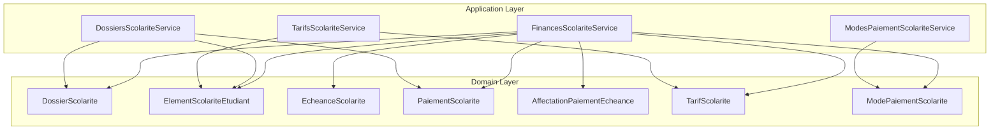
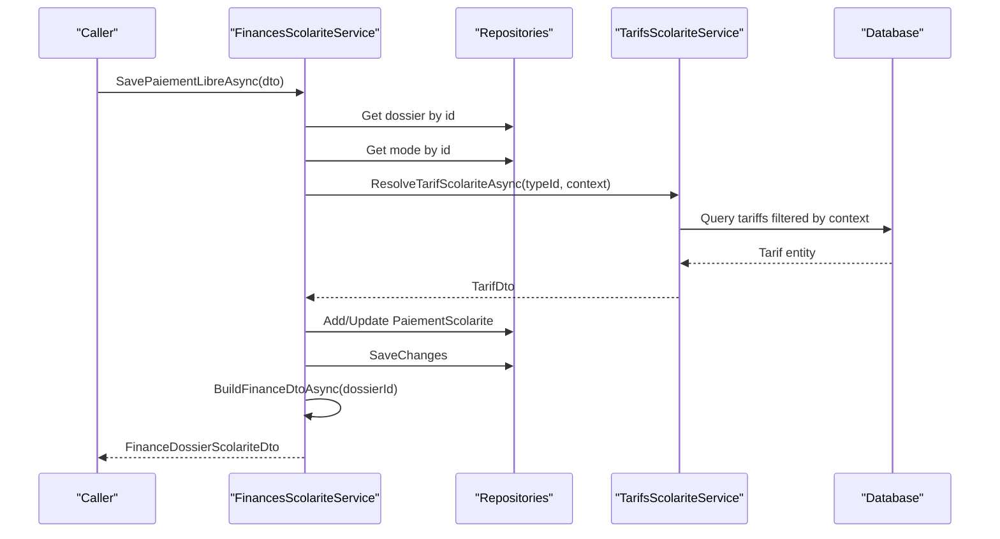
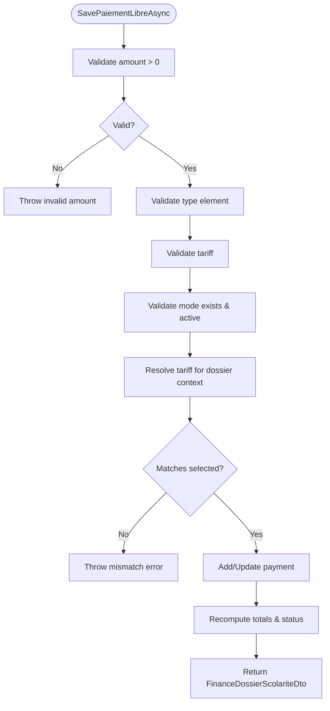
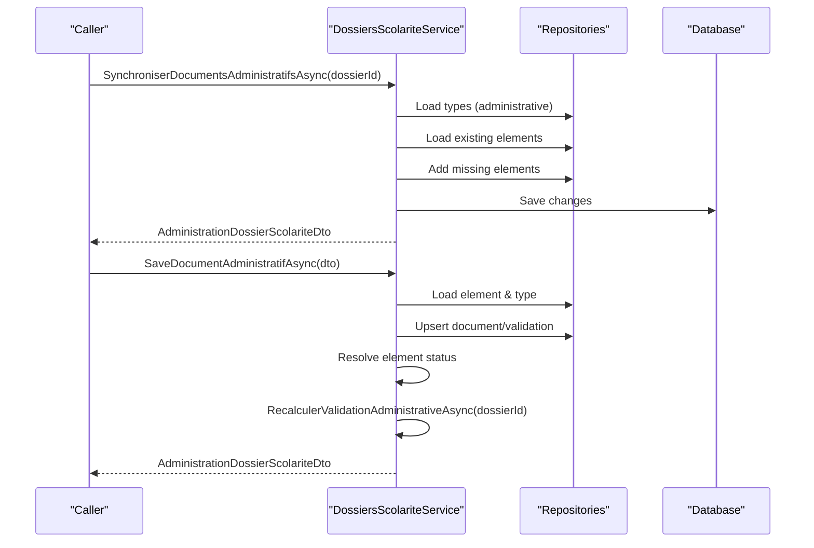
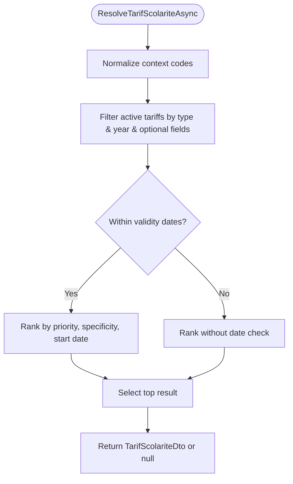
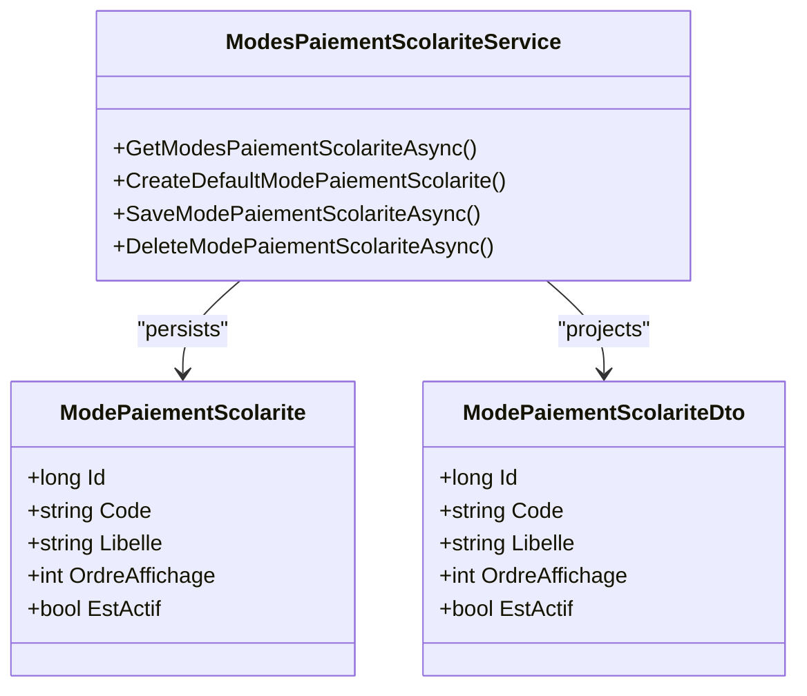
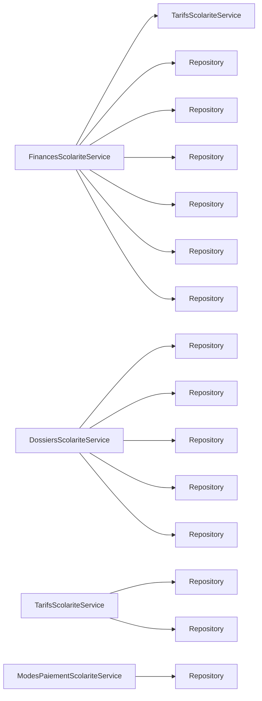

# Financial Administration Services

<cite>
**Referenced Files in This Document**
- [FinancesScolariteService.cs](file://RIIS.Academic.Application/Scolarite/Services/FinancesScolariteService.cs)
- [DossiersScolariteService.cs](file://RIIS.Academic.Application/Scolarite/Services/DossiersScolariteService.cs)
- [TarifsScolariteService.cs](file://RIIS.Academic.Application/Scolarite/Services/TarifsScolariteService.cs)
- [ModesPaiementScolariteService.cs](file://RIIS.Academic.Application/Scolarite/Services/ModesPaiementScolariteService.cs)
- [FinanceDossierScolariteDto.cs](file://RIIS.Academic.Application/Scolarite/Dtos/FinanceDossierScolariteDto.cs)
- [TarifScolariteDto.cs](file://RIIS.Academic.Application/Scolarite/Dtos/TarifScolariteDto.cs)
- [ModePaiementScolariteDto.cs](file://RIIS.Academic.Application/Scolarite/Dtos/ModePaiementScolariteDto.cs)
- [TypeElementScolariteDto.cs](file://RIIS.Academic.Application/Scolarite/Dtos/TypeElementScolariteDto.cs)
- [PaiementScolarite.cs](file://RIIS.Academic.Domain/Scolarite/PaiementScolarite.cs)
- [EcheanceScolarite.cs](file://RIIS.Academic.Domain/Scolarite/EcheanceScolarite.cs)
- [AffectationPaiementEcheance.cs](file://RIIS.Academic.Domain/Scolarite/AffectationPaiementEcheance.cs)
- [ModePaiementScolarite.cs](file://RIIS.Academic.Domain/Scolarite/ModePaiementScolarite.cs)
- [TarifScolarite.cs](file://RIIS.Academic.Domain/Scolarite/TarifScolarite.cs)
- [DossierScolarite.cs](file://RIIS.Academic.Domain/Scolarite/DossierScolarite.cs)
- [ElementScolariteEtudiant.cs](file://RIIS.Academic.Domain/Scolarite/ElementScolariteEtudiant.cs)
</cite>

## Table of Contents
1. Introduction
2. Project Structure
3. Core Components
4. Architecture Overview
5. Detailed Component Analysis
6. Dependency Analysis
7. Performance Considerations
8. Troubleshooting Guide
9. Conclusion

## Introduction
This document explains the financial administration services that manage tuition fees, payments, and related workflows for student files. It covers:
- FinancesScolariteService for payment processing and allocation
- DossiersScolariteService for student file lifecycle and administrative validation
- TarifsScolariteService for fee configuration and tariff resolution
- ModesPaiementScolariteService for payment methods management
It also documents DTOs for financial transactions, fee structures, and payment records; outlines business rules for fee schedules, payment deadlines, and validations; and describes integration points with student enrollment and external payment systems.

## Project Structure
The financial domain is implemented across Application services and Domain entities:
- Application layer: services orchestrate operations and expose DTOs to callers (e.g., UI or API).
- Domain layer: entities model core concepts such as student files, elements, installments, payments, allocations, tariffs, and payment methods.

**Diagram sources**
- [FinancesScolariteService.cs:7-15](file://RIIS.Academic.Application/Scolarite/Services/FinancesScolariteService.cs#L7-L15)
- [DossiersScolariteService.cs:7-21](file://RIIS.Academic.Application/Scolarite/Services/DossiersScolariteService.cs#L7-L21)
- [TarifsScolariteService.cs:10-12](file://RIIS.Academic.Application/Scolarite/Services/TarifsScolariteService.cs#L10-L12)
- [ModesPaiementScolariteService.cs:7-8](file://RIIS.Academic.Application/Scolarite/Services/ModesPaiementScolariteService.cs#L7-L8)
- [DossierScolarite.cs:1-29](file://RIIS.Academic.Domain/Scolarite/DossierScolarite.cs#L1-L29)
- [ElementScolariteEtudiant.cs:1-26](file://RIIS.Academic.Domain/Scolarite/ElementScolariteEtudiant.cs#L1-L26)
- [EcheanceScolarite.cs:1-20](file://RIIS.Academic.Domain/Scolarite/EcheanceScolarite.cs#L1-L20)
- [PaiementScolarite.cs:1-29](file://RIIS.Academic.Domain/Scolarite/PaiementScolarite.cs#L1-L29)
- [AffectationPaiementEcheance.cs:1-15](file://RIIS.Academic.Domain/Scolarite/AffectationPaiementEcheance.cs#L1-L15)
- [TarifScolarite.cs:1-22](file://RIIS.Academic.Domain/Scolarite/TarifScolarite.cs#L1-L22)
- [ModePaiementScolarite.cs:1-13](file://RIIS.Academic.Domain/Scolarite/ModePaiementScolarite.cs#L1-L13)

**Section sources**
- [FinancesScolariteService.cs:7-15](file://RIIS.Academic.Application/Scolarite/Services/FinancesScolariteService.cs#L7-L15)
- [DossiersScolariteService.cs:7-21](file://RIIS.Academic.Application/Scolarite/Services/DossiersScolariteService.cs#L7-L21)
- [TarifsScolariteService.cs:10-12](file://RIIS.Academic.Application/Scolarite/Services/TarifsScolariteService.cs#L10-L12)
- [ModesPaiementScolariteService.cs:7-8](file://RIIS.Academic.Application/Scolarite/Services/ModesPaiementScolariteService.cs#L7-L8)

## Core Components
- FinancesScolariteService: orchestrates payment capture, tariff resolution, installment view, and allocation reporting for a student file.
- DossiersScolariteService: manages student file creation from enrollment, administrative document synchronization/validation, and overall status computation.
- TarifsScolariteService: defines fee schedules, resolves applicable tariffs by context, and enforces uniqueness and validity rules.
- ModesPaiementScolariteService: maintains available payment methods and their display order.

Key responsibilities:
- Payment processing: validate inputs, persist payments, compute statuses, and build financial summaries.
- Student file management: synchronize administrative items, update statuses based on documents and payments.
- Fee configuration: create, update, delete tariffs; resolve active tariffs per academic year, cycle, level, filiere, specialty.
- Payment methods: CRUD for modes with code uniqueness and ordering.

**Section sources**
- [FinancesScolariteService.cs:17-141](file://RIIS.Academic.Application/Scolarite/Services/FinancesScolariteService.cs#L17-L141)
- [DossiersScolariteService.cs:115-275](file://RIIS.Academic.Application/Scolarite/Services/DossiersScolariteService.cs#L115-L275)
- [TarifsScolariteService.cs:14-193](file://RIIS.Academic.Application/Scolarite/Services/TarifsScolariteService.cs#L14-L193)
- [ModesPaiementScolariteService.cs:10-73](file://RIIS.Academic.Application/Scolarite/Services/ModesPaiementScolariteService.cs#L10-L73)

## Architecture Overview
The services use repositories to access domain entities and coordinate business logic. DTOs are used to project data for consumers.

**Diagram sources**
- [FinancesScolariteService.cs:58-141](file://RIIS.Academic.Application/Scolarite/Services/FinancesScolariteService.cs#L58-L141)
- [TarifsScolariteService.cs:195-238](file://RIIS.Academic.Application/Scolarite/Services/TarifsScolariteService.cs#L195-L238)

## Detailed Component Analysis

### FinancesScolariteService
Responsibilities:
- Retrieve financial summary for a student file
- Provide options for type-element tariffs for payment selection
- Save free-form payments with validations
- Build comprehensive financial DTO including elements, installments, payments, and allocations

Key flows:
- Payment save flow validates amount, type, tariff, and payment method; ensures tariff matches current context; persists new or updated payment; recomputes totals and returns updated financial view.
- Financial view aggregates elements, installments, payments, and allocations, computing totals and statuses.

Business rules enforced:
- Payment amount must be greater than zero
- Type element and tariff must be provided and valid
- Payment method must exist and be active
- Selected tariff must match resolved tariff for the dossier context
- Updated payment cannot reduce below already allocated amount
- Payment status computed from allocated vs total amounts

**Diagram sources**
- [FinancesScolariteService.cs:58-141](file://RIIS.Academic.Application/Scolarite/Services/FinancesScolariteService.cs#L58-L141)
- [FinancesScolariteService.cs:143-193](file://RIIS.Academic.Application/Scolarite/Services/FinancesScolariteService.cs#L143-L193)
- [FinancesScolariteService.cs:264-302](file://RIIS.Academic.Application/Scolarite/Services/FinancesScolariteService.cs#L264-L302)
- [FinancesScolariteService.cs:332-342](file://RIIS.Academic.Application/Scolarite/Services/FinancesScolariteService.cs#L332-L342)

**Section sources**
- [FinancesScolariteService.cs:17-141](file://RIIS.Academic.Application/Scolarite/Services/FinancesScolariteService.cs#L17-L141)
- [FinancesScolariteService.cs:143-193](file://RIIS.Academic.Application/Scolarite/Services/FinancesScolariteService.cs#L143-L193)
- [FinancesScolariteService.cs:264-302](file://RIIS.Academic.Application/Scolarite/Services/FinancesScolariteService.cs#L264-L302)
- [FinancesScolariteService.cs:332-342](file://RIIS.Academic.Application/Scolarite/Services/FinancesScolariteService.cs#L332-L342)

### DossiersScolariteService
Responsibilities:
- List and retrieve student files with filters and search
- Synchronize administrative elements for a dossier
- Save administrative documents and validations
- Recalculate administrative and financial statuses
- Create or retrieve a student file from an enrollment

Key flows:
- Administrative synchronization creates missing administrative elements based on configured types.
- Saving documents/validations updates element status and recalculates dossier statuses based on completeness and initial payments.
- Status computation considers mandatory pieces and presence of active payments.

**Diagram sources**
- [DossiersScolariteService.cs:128-162](file://RIIS.Academic.Application/Scolarite/Services/DossiersScolariteService.cs#L128-L162)
- [DossiersScolariteService.cs:164-252](file://RIIS.Academic.Application/Scolarite/Services/DossiersScolariteService.cs#L164-L252)
- [DossiersScolariteService.cs:254-275](file://RIIS.Academic.Application/Scolarite/Services/DossiersScolariteService.cs#L254-L275)

**Section sources**
- [DossiersScolariteService.cs:23-93](file://RIIS.Academic.Application/Scolarite/Services/DossiersScolariteService.cs#L23-L93)
- [DossiersScolariteService.cs:115-162](file://RIIS.Academic.Application/Scolarite/Services/DossiersScolariteService.cs#L115-L162)
- [DossiersScolariteService.cs:164-275](file://RIIS.Academic.Application/Scolarite/Services/DossiersScolariteService.cs#L164-L275)

### TarifsScolariteService
Responsibilities:
- List tariffs with filtering by type, academic year, cycle, level, filiere, specialty
- Create default tariff template
- Generate unique codes for tariffs
- Save/update/delete tariffs with validation and uniqueness checks
- Resolve the most appropriate active tariff for a given context

Resolution algorithm:
- Filter by type, academic year, and optional cycle/level/filiere/specialty
- Enforce date validity window relative to reference date
- Prefer higher priority and more specific context (cycle/level/filiere/specialty)
- Fallback to non-date-valid if needed but still matching criteria

**Diagram sources**
- [TarifsScolariteService.cs:195-238](file://RIIS.Academic.Application/Scolarite/Services/TarifsScolariteService.cs#L195-L238)
- [TarifsScolariteService.cs:318-330](file://RIIS.Academic.Application/Scolarite/Services/TarifsScolariteService.cs#L318-L330)

**Section sources**
- [TarifsScolariteService.cs:14-70](file://RIIS.Academic.Application/Scolarite/Services/TarifsScolariteService.cs#L14-L70)
- [TarifsScolariteService.cs:87-193](file://RIIS.Academic.Application/Scolarite/Services/TarifsScolariteService.cs#L87-L193)
- [TarifsScolariteService.cs:195-238](file://RIIS.Academic.Application/Scolarite/Services/TarifsScolariteService.cs#L195-L238)
- [TarifsScolariteService.cs:250-268](file://RIIS.Academic.Application/Scolarite/Services/TarifsScolariteService.cs#L250-L268)

### ModesPaiementScolariteService
Responsibilities:
- List payment methods with optional inclusion of inactive ones
- Create default payment method template
- Save/update/delete payment methods with code uniqueness enforcement

**Diagram sources**
- [ModesPaiementScolariteService.cs:7-8](file://RIIS.Academic.Application/Scolarite/Services/ModesPaiementScolariteService.cs#L7-L8)
- [ModesPaiementScolariteService.cs:10-73](file://RIIS.Academic.Application/Scolarite/Services/ModesPaiementScolariteService.cs#L10-L73)
- [ModePaiementScolarite.cs:1-13](file://RIIS.Academic.Domain/Scolarite/ModePaiementScolarite.cs#L1-L13)
- [ModePaiementScolariteDto.cs:1-11](file://RIIS.Academic.Application/Scolarite/Dtos/ModePaiementScolariteDto.cs#L1-L11)

**Section sources**
- [ModesPaiementScolariteService.cs:10-73](file://RIIS.Academic.Application/Scolarite/Services/ModesPaiementScolariteService.cs#L10-L73)

## Dependency Analysis
- FinancesScolariteService depends on:
  - Repositories for dossiers, types, elements, installments, payments, payment methods, and allocations
  - TarifsScolariteService for resolving applicable tariffs
- DossiersScolariteService depends on:
  - Repositories for inscriptions, students, academic references, and administrative elements/documents/validations/payments
- TarifsScolariteService depends on:
  - Repositories for tariffs and type elements
- ModesPaiementScolariteService depends on:
  - Repository for payment methods

**Diagram sources**
- [FinancesScolariteService.cs:7-15](file://RIIS.Academic.Application/Scolarite/Services/FinancesScolariteService.cs#L7-L15)
- [DossiersScolariteService.cs:7-21](file://RIIS.Academic.Application/Scolarite/Services/DossiersScolariteService.cs#L7-L21)
- [TarifsScolariteService.cs:10-12](file://RIIS.Academic.Application/Scolarite/Services/TarifsScolariteService.cs#L10-L12)
- [ModesPaiementScolariteService.cs:7-8](file://RIIS.Academic.Application/Scolarite/Services/ModesPaiementScolariteService.cs#L7-L8)

**Section sources**
- [FinancesScolariteService.cs:7-15](file://RIIS.Academic.Application/Scolarite/Services/FinancesScolariteService.cs#L7-L15)
- [DossiersScolariteService.cs:7-21](file://RIIS.Academic.Application/Scolarite/Services/DossiersScolariteService.cs#L7-L21)
- [TarifsScolariteService.cs:10-12](file://RIIS.Academic.Application/Scolarite/Services/TarifsScolariteService.cs#L10-L12)
- [ModesPaiementScolariteService.cs:7-8](file://RIIS.Academic.Application/Scolarite/Services/ModesPaiementScolariteService.cs#L7-L8)

## Performance Considerations
- Batch loading: Services load large collections via repository ListAsync and filter in memory; consider adding query-level filtering where possible to reduce payload sizes.
- Indexing: Ensure database indexes on frequently filtered fields (e.g., AnneeAcademiqueCode, CycleCode, NiveauNumero, FiliereCode, SpecialiteCode, TypeElementScolariteId).
- Caching: For read-heavy scenarios (e.g., tariff lists), consider caching results keyed by context to reduce repeated queries.
- Allocation performance: When building financial views, minimize repeated lookups by using hash sets for IDs and preloading related entities.

[No sources needed since this section provides general guidance]

## Troubleshooting Guide
Common errors and resolutions:
- Invalid payment amount: Ensure amount is greater than zero before saving.
- Missing or inactive payment method: Verify mode exists and is active.
- Tariff mismatch: Confirm selected tariff matches the resolved tariff for the dossier’s academic context.
- Duplicate tariff: Avoid creating tariffs with identical type, context, and start date; adjust one of the fields.
- Administrative incompleteness: Complete mandatory documents and validations to move dossier to regular status.

Operational tips:
- Use GetOptionsTypesElementsTarifsPaiementAsync to present only valid tariff options for the current dossier context.
- After updating documents or validations, call RecalculerValidationAdministrativeAsync to refresh statuses.
- For payment updates, ensure MontantAffecte does not exceed new Montant.

**Section sources**
- [FinancesScolariteService.cs:58-141](file://RIIS.Academic.Application/Scolarite/Services/FinancesScolariteService.cs#L58-L141)
- [TarifsScolariteService.cs:250-268](file://RIIS.Academic.Application/Scolarite/Services/TarifsScolariteService.cs#L250-L268)
- [DossiersScolariteService.cs:254-275](file://RIIS.Academic.Application/Scolarite/Services/DossiersScolariteService.cs#L254-L275)

## Conclusion
The financial administration services provide a robust framework for managing tuition fees, payments, and student file statuses. TarifsScolariteService ensures accurate fee resolution based on academic context; FinancesScolariteService handles payment capture and financial summaries; DossiersScolariteService integrates administrative requirements with financial state; and ModesPaiementScolariteService standardizes payment methods. Together, they support clear business rules, consistent validations, and extensible workflows suitable for integration with enrollment systems and external payment providers.

[No sources needed since this section summarizes without analyzing specific files]