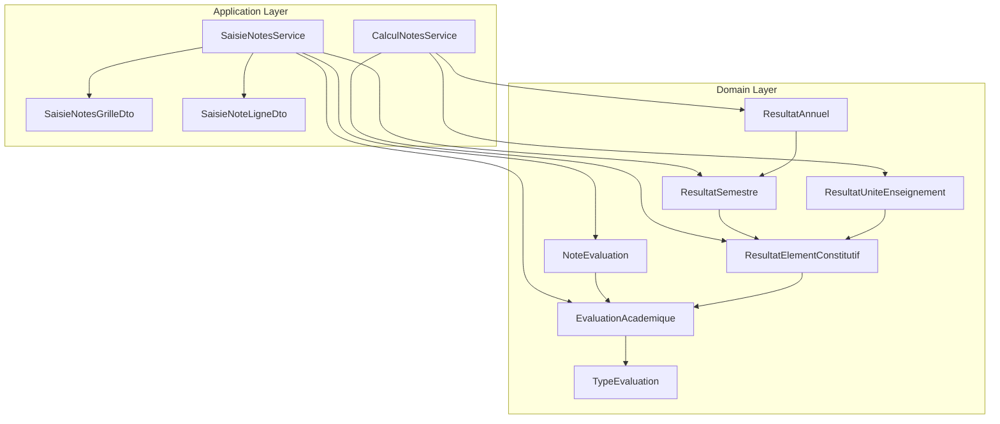
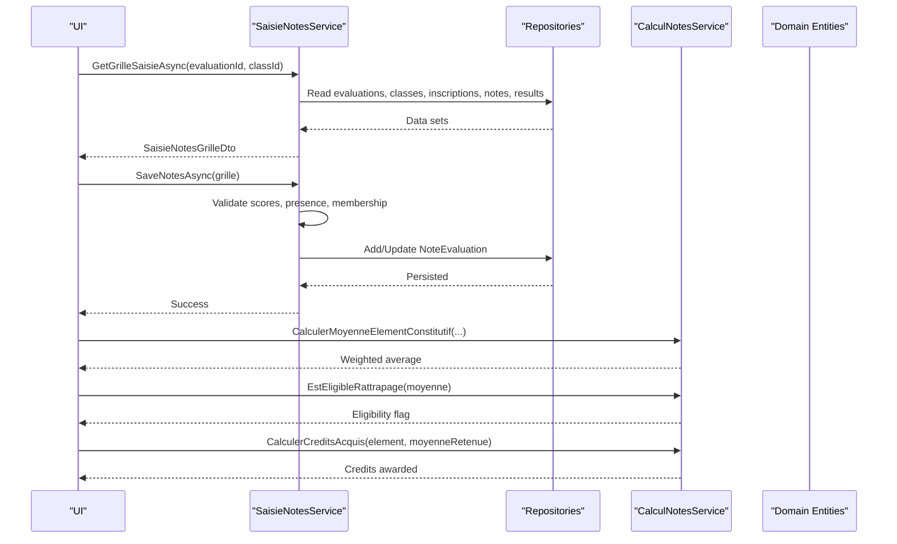
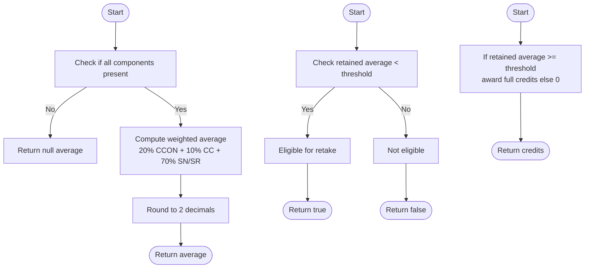
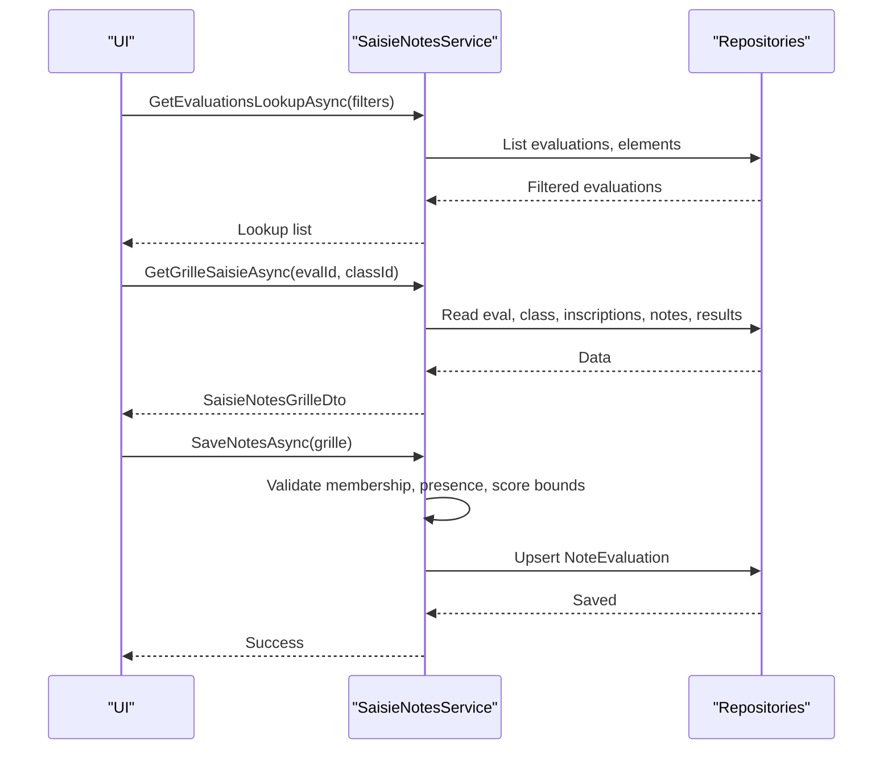
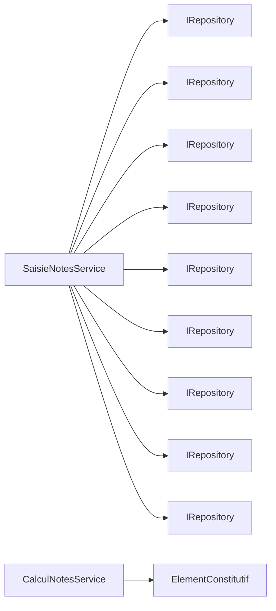

# Grade Calculation Services

<cite>
**Referenced Files in This Document**
- [CalculNotesService.cs](file://RIIS.Academic.Application/Notes/Services/CalculNotesService.cs)
- [ICalculNotesService.cs](file://RIIS.Academic.Application/Abstractions/Services/ICalculNotesService.cs)
- [SaisieNotesService.cs](file://RIIS.Academic.Application/Notes/Services/SaisieNotesService.cs)
- [ISaisieNotesService.cs](file://RIIS.Academic.Application/Notes/Services/ISaisieNotesService.cs)
- [SaisieNotesGrilleDto.cs](file://RIIS.Academic.Application/Notes/Dtos/SaisieNotesGrilleDto.cs)
- [SaisieNoteLigneDto.cs](file://RIIS.Academic.Application/Notes/Dtos/SaisieNoteLigneDto.cs)
- [EvaluationAcademique.cs](file://RIIS.Academic.Domain/Notes/EvaluationAcademique.cs)
- [NoteEvaluation.cs](file://RIIS.Academic.Domain/Notes/NoteEvaluation.cs)
- [TypeEvaluation.cs](file://RIIS.Academic.Domain/Enums/TypeEvaluation.cs)
- [ResultatSemestre.cs](file://RIIS.Academic.Domain/Notes/ResultatSemestre.cs)
- [ResultatAnnuel.cs](file://RIIS.Academic.Domain/Notes/ResultatAnnuel.cs)
- [ResultatUniteEnseignement.cs](file://RIIS.Academic.Domain/Notes/ResultatUniteEnseignement.cs)
- [ResultatElementConstitutif.cs](file://RIIS.Academic.Domain/Notes/ResultatElementConstitutif.cs)
</cite>

## Table of Contents
1. Introduction
2. Project Structure
3. Core Components
4. Architecture Overview
5. Detailed Component Analysis
6. Dependency Analysis
7. Performance Considerations
8. Troubleshooting Guide
9. Conclusion

## Introduction
This document explains the grade calculation services that support the complete lifecycle of academic grading: capturing grades, computing averages and credits, and aggregating results across units, semesters, and academic years. It focuses on:
- CalculNotesService for grade computation algorithms (weighted averages, eligibility, credit allocation).
- ISaisieNotesService and SaisieNotesService for grade input operations and workflows.
- SaisieNotesGrilleDto and SaisieNoteLigneDto for grid-based grade entry and line item management.
- Integration with evaluation and result entities to enable end-to-end grade management.

## Project Structure
The grade calculation feature spans the Application layer (services and DTOs) and the Domain layer (entities and enums). The key modules are:
- Notes services: SaisieNotesService (input workflow), CalculNotesService (computation).
- Notes DTOs: SaisieNotesGrilleDto and SaisieNoteLigneDto for UI binding and validation.
- Domain models: EvaluationAcademique, NoteEvaluation, ResultatElementConstitutif, ResultatSemestre, ResultatUniteEnseignement, ResultatAnnuel, and TypeEvaluation.

**Diagram sources**
- [SaisieNotesService.cs:8-17](file://RIIS.Academic.Application/Notes/Services/SaisieNotesService.cs#L8-L17)
- [CalculNotesService.cs:7-24](file://RIIS.Academic.Application/Notes/Services/CalculNotesService.cs#L7-L24)
- [SaisieNotesGrilleDto.cs:5-19](file://RIIS.Academic.Application/Notes/Dtos/SaisieNotesGrilleDto.cs#L5-L19)
- [SaisieNoteLigneDto.cs:5-17](file://RIIS.Academic.Application/Notes/Dtos/SaisieNoteLigneDto.cs#L5-L17)
- [EvaluationAcademique.cs:3-23](file://RIIS.Academic.Domain/Notes/EvaluationAcademique.cs#L3-L23)
- [NoteEvaluation.cs:3-16](file://RIIS.Academic.Domain/Notes/NoteEvaluation.cs#L3-L16)
- [ResultatElementConstitutif.cs:3-22](file://RIIS.Academic.Domain/Notes/ResultatElementConstitutif.cs#L3-L22)
- [ResultatSemestre.cs:3-22](file://RIIS.Academic.Domain/Notes/ResultatSemestre.cs#L3-L22)
- [ResultatUniteEnseignement.cs:3-16](file://RIIS.Academic.Domain/Notes/ResultatUniteEnseignement.cs#L3-L16)
- [ResultatAnnuel.cs:3-20](file://RIIS.Academic.Domain/Notes/ResultatAnnuel.cs#L3-L20)
- [TypeEvaluation.cs:3-9](file://RIIS.Academic.Domain/Enums/TypeEvaluation.cs#L3-L9)

**Section sources**
- [SaisieNotesService.cs:8-17](file://RIIS.Academic.Application/Notes/Services/SaisieNotesService.cs#L8-L17)
- [CalculNotesService.cs:7-24](file://RIIS.Academic.Application/Notes/Services/CalculNotesService.cs#L7-L24)
- [SaisieNotesGrilleDto.cs:5-19](file://RIIS.Academic.Application/Notes/Dtos/SaisieNotesGrilleDto.cs#L5-L19)
- [SaisieNoteLigneDto.cs:5-17](file://RIIS.Academic.Application/Notes/Dtos/SaisieNoteLigneDto.cs#L5-L17)
- [EvaluationAcademique.cs:3-23](file://RIIS.Academic.Domain/Notes/EvaluationAcademique.cs#L3-L23)
- [NoteEvaluation.cs:3-16](file://RIIS.Academic.Domain/Notes/NoteEvaluation.cs#L3-L16)
- [ResultatElementConstitutif.cs:3-22](file://RIIS.Academic.Domain/Notes/ResultatElementConstitutif.cs#L3-L22)
- [ResultatSemestre.cs:3-22](file://RIIS.Academic.Domain/Notes/ResultatSemestre.cs#L3-L22)
- [ResultatUniteEnseignement.cs:3-16](file://RIIS.Academic.Domain/Notes/ResultatUniteEnseignement.cs#L3-L16)
- [ResultatAnnuel.cs:3-20](file://RIIS.Academic.Domain/Notes/ResultatAnnuel.cs#L3-L20)
- [TypeEvaluation.cs:3-9](file://RIIS.Academic.Domain/Enums/TypeEvaluation.cs#L3-L9)

## Core Components
- CalculNotesService: Implements core grade computation logic including weighted average calculation for an element of instruction, eligibility for retake sessions, and credit acquisition based on a retained average.
- SaisieNotesService: Provides lookup helpers, builds the grade entry grid for a given evaluation and class, validates and persists student grades, and enforces business rules such as score bounds and presence status handling.
- DTOs:
  - SaisieNotesGrilleDto: Represents the header context and list of student rows for a grade entry session.
  - SaisieNoteLigneDto: Represents a single student’s grade row, including optional observation and eligibility flags.

Key responsibilities:
- Input: Load lookups, build grids, validate inputs, persist notes.
- Computation: Weighted averages per element, retake eligibility, credits awarded.
- Aggregation: Semestral, unit-level, and annual results are modeled by domain entities and used by downstream processes.

**Section sources**
- [ICalculNotesService.cs:6-11](file://RIIS.Academic.Application/Abstractions/Services/ICalculNotesService.cs#L6-L11)
- [CalculNotesService.cs:7-24](file://RIIS.Academic.Application/Notes/Services/CalculNotesService.cs#L7-L24)
- [ISaisieNotesService.cs:7-26](file://RIIS.Academic.Application/Notes/Services/ISaisieNotesService.cs#L7-L26)
- [SaisieNotesService.cs:8-317](file://RIIS.Academic.Application/Notes/Services/SaisieNotesService.cs#L8-L317)
- [SaisieNotesGrilleDto.cs:5-19](file://RIIS.Academic.Application/Notes/Dtos/SaisieNotesGrilleDto.cs#L5-L19)
- [SaisieNoteLigneDto.cs:5-17](file://RIIS.Academic.Application/Notes/Dtos/SaisieNoteLigneDto.cs#L5-L17)

## Architecture Overview
The grade management flow integrates user input, validation, persistence, and computation:
- Users enter grades via a grid bound to SaisieNotesGrilleDto and SaisieNoteLigneDto.
- SaisieNotesService validates and persists NoteEvaluation records linked to EvaluationAcademique.
- CalculNotesService computes per-element averages and determines eligibility and credits.
- Downstream processes aggregate results into ResultatElementConstitutif, ResultatSemestre, ResultatUniteEnseignement, and ResultatAnnuel.

**Diagram sources**
- [SaisieNotesService.cs:126-228](file://RIIS.Academic.Application/Notes/Services/SaisieNotesService.cs#L126-L228)
- [SaisieNotesService.cs:230-295](file://RIIS.Academic.Application/Notes/Services/SaisieNotesService.cs#L230-L295)
- [CalculNotesService.cs:9-23](file://RIIS.Academic.Application/Notes/Services/CalculNotesService.cs#L9-L23)
- [EvaluationAcademique.cs:3-23](file://RIIS.Academic.Domain/Notes/EvaluationAcademique.cs#L3-L23)
- [NoteEvaluation.cs:3-16](file://RIIS.Academic.Domain/Notes/NoteEvaluation.cs#L3-L16)

## Detailed Component Analysis

### CalculNotesService: Grade Computation Algorithms
Responsibilities:
- Compute the weighted average for an Element Constitutif using components:
  - Continuous assessment (CCON) weight: 20%
  - Knowledge control (CC) weight: 10%
  - Session normal or retake (SN/SR) weight: 70%
- Determine retake eligibility when the retained average is below the threshold.
- Award credits for an Element Constitutif if the retained average meets the passing threshold.

Algorithm highlights:
- Weighted average formula combines three components with fixed weights and rounds to two decimals.
- Retake eligibility is based on a simple threshold comparison against the retained average.
- Credit allocation is conditional on meeting the passing average.

**Diagram sources**
- [CalculNotesService.cs:9-23](file://RIIS.Academic.Application/Notes/Services/CalculNotesService.cs#L9-L23)

**Section sources**
- [ICalculNotesService.cs:6-11](file://RIIS.Academic.Application/Abstractions/Services/ICalculNotesService.cs#L6-L11)
- [CalculNotesService.cs:7-24](file://RIIS.Academic.Application/Notes/Services/CalculNotesService.cs#L7-L24)

### SaisieNotesService: Grade Input Operations and Workflows
Responsibilities:
- Provide lookups for academic years, pedagogical classes, teaching units, constituent elements, and evaluations.
- Build the grade entry grid for a selected evaluation and class, including eligibility filtering for retake sessions.
- Validate and persist student grades with presence status and observations.

Key behaviors:
- Grid building:
  - Validates evaluation and class belong to the same academic year.
  - For retake sessions, filters students based on semester results where credits acquired are less than required.
  - Populates each row with student info, existing note values, presence status, and eligibility flags.
- Saving grades:
  - Validates that each row belongs to the selected class and academic year.
  - Enforces score bounds between 0 and the evaluation’s maximum score (bareme) when present.
  - Clears score when absence is recorded.
  - Upserts NoteEvaluation records with timestamps and operator metadata.

**Diagram sources**
- [SaisieNotesService.cs:73-124](file://RIIS.Academic.Application/Notes/Services/SaisieNotesService.cs#L73-L124)
- [SaisieNotesService.cs:126-228](file://RIIS.Academic.Application/Notes/Services/SaisieNotesService.cs#L126-L228)
- [SaisieNotesService.cs:230-295](file://RIIS.Academic.Application/Notes/Services/SaisieNotesService.cs#L230-L295)

**Section sources**
- [ISaisieNotesService.cs:7-26](file://RIIS.Academic.Application/Notes/Services/ISaisieNotesService.cs#L7-L26)
- [SaisieNotesService.cs:19-124](file://RIIS.Academic.Application/Notes/Services/SaisieNotesService.cs#L19-L124)
- [SaisieNotesService.cs:126-228](file://RIIS.Academic.Application/Notes/Services/SaisieNotesService.cs#L126-L228)
- [SaisieNotesService.cs:230-295](file://RIIS.Academic.Application/Notes/Services/SaisieNotesService.cs#L230-L295)

### DTOs: SaisieNotesGrilleDto and SaisieNoteLigneDto
Purpose:
- SaisieNotesGrilleDto: Carries evaluation context (IDs, labels, type, scoring scale, weighting), warnings, and the list of student rows.
- SaisieNoteLigneDto: Captures per-student data including existing note ID, enrollment ID, identifiers, optional score, presence status, observation, semester credits, and retake eligibility.

Usage:
- Bound to UI grids for efficient multi-row editing.
- Validated server-side before persistence.

**Section sources**
- [SaisieNotesGrilleDto.cs:5-19](file://RIIS.Academic.Application/Notes/Dtos/SaisieNotesGrilleDto.cs#L5-L19)
- [SaisieNoteLigneDto.cs:5-17](file://RIIS.Academic.Application/Notes/Dtos/SaisieNoteLigneDto.cs#L5-L17)

### Evaluation Types, Scoring Systems, and Academic Performance Metrics
Evaluation types:
- Continuous assessment (ControleContinu)
- Knowledge control (ControleConnaissance)
- Normal session (SessionNormale)
- Retake session (SessionRattrapage)

Scoring system:
- Each evaluation defines a maximum score (bareme) and a percentage weight (ponderation pourcentage) within its context.
- Scores must be within 0..bareme when present; absent statuses clear the score.

Performance metrics:
- Per-element results include multiple component averages, pre/post-retake averages, retained average, and credits acquired.
- Semester results aggregate averages and track credits vs. required credits, ranking, validation status, and jury decision.
- Unit-level results capture average and credits vs. expected credits.
- Annual results summarize yearly average, total credits vs. required, ranking, validation status, and jury decision.

**Section sources**
- [TypeEvaluation.cs:3-9](file://RIIS.Academic.Domain/Enums/TypeEvaluation.cs#L3-L9)
- [EvaluationAcademique.cs:3-23](file://RIIS.Academic.Domain/Notes/EvaluationAcademique.cs#L3-L23)
- [ResultatElementConstitutif.cs:3-22](file://RIIS.Academic.Domain/Notes/ResultatElementConstitutif.cs#L3-L22)
- [ResultatSemestre.cs:3-22](file://RIIS.Academic.Domain/Notes/ResultatSemestre.cs#L3-L22)
- [ResultatUniteEnseignement.cs:3-16](file://RIIS.Academic.Domain/Notes/ResultatUniteEnseignement.cs#L3-L16)
- [ResultatAnnuel.cs:3-20](file://RIIS.Academic.Domain/Notes/ResultatAnnuel.cs#L3-L20)

## Dependency Analysis
Coupling and cohesion:
- SaisieNotesService depends on multiple repositories to assemble grids and persist notes, demonstrating high cohesion around grade entry workflows.
- CalculNotesService is lightweight and focused on pure computations, minimizing side effects and coupling.
- DTOs decouple UI concerns from domain models, improving maintainability.

Direct dependencies:
- SaisieNotesService -> Repositories for AnneeAcademique, ClassePedagogique, Inscription, Etudiant, EvaluationAcademique, NoteEvaluation, ElementConstitutif, UniteEnseignement, ResultatSemestre.
- CalculNotesService -> Domain models for ElementConstitutif and numeric thresholds.

Potential circular dependencies:
- None observed; services depend on domain models and repositories without reverse dependencies.

External integrations:
- Persistence via generic repository abstraction.
- UI integration through DTOs.

**Diagram sources**
- [SaisieNotesService.cs:8-17](file://RIIS.Academic.Application/Notes/Services/SaisieNotesService.cs#L8-L17)
- [CalculNotesService.cs:7-24](file://RIIS.Academic.Application/Notes/Services/CalculNotesService.cs#L7-L24)

**Section sources**
- [SaisieNotesService.cs:8-17](file://RIIS.Academic.Application/Notes/Services/SaisieNotesService.cs#L8-L17)
- [CalculNotesService.cs:7-24](file://RIIS.Academic.Application/Notes/Services/CalculNotesService.cs#L7-L24)

## Performance Considerations
- Batch reads: SaisieNotesService performs multiple ListAsync calls; consider batching or projection to reduce memory footprint when datasets grow large.
- Filtering early: Apply filters at the repository level where possible to minimize client-side processing.
- Avoid repeated queries: Cache lookups within a request scope if reused frequently.
- Rounding precision: Use consistent rounding for averages to avoid floating-point drift.
- Validation cost: Validate presence and score bounds before database writes to reduce round-trips.

[No sources needed since this section provides general guidance]

## Troubleshooting Guide
Common issues and resolutions:
- Missing evaluation or class:
  - Ensure both exist and belong to the same academic year before opening the grid.
- Class mismatch:
  - Verify that the selected class matches the evaluation’s academic year.
- Invalid score range:
  - Scores must be between 0 and the evaluation’s bareme when present; otherwise, an error is raised.
- Absent status:
  - When absence is recorded, the score should be cleared automatically.
- Retake eligibility:
  - For retake sessions, ensure semester results are calculated; otherwise, a warning indicates provisional display of all students.

Operational tips:
- Use the provided lookup methods to filter evaluations by academic year, unit, element, and type.
- Confirm that semester results exist for accurate retake filtering.

**Section sources**
- [SaisieNotesService.cs:126-140](file://RIIS.Academic.Application/Notes/Services/SaisieNotesService.cs#L126-L140)
- [SaisieNotesService.cs:162-185](file://RIIS.Academic.Application/Notes/Services/SaisieNotesService.cs#L162-L185)
- [SaisieNotesService.cs:230-267](file://RIIS.Academic.Application/Notes/Services/SaisieNotesService.cs#L230-L267)

## Conclusion
The grade calculation services provide a robust foundation for managing academic grades:
- SaisieNotesService streamlines grade entry with strong validation and contextual filtering.
- CalculNotesService encapsulates core algorithms for weighted averages, retake eligibility, and credit allocation.
- DTOs enable clean separation between UI and domain logic.
- Domain entities model comprehensive aggregation points across elements, semesters, units, and academic years.

Together, these components support a complete grade management lifecycle from input to aggregated performance metrics.

[No sources needed since this section summarizes without analyzing specific files]