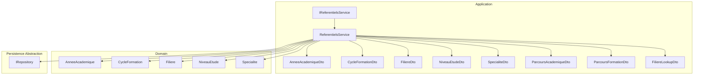
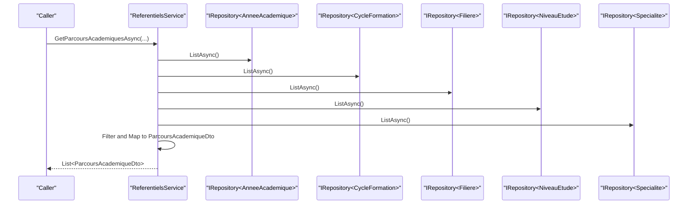
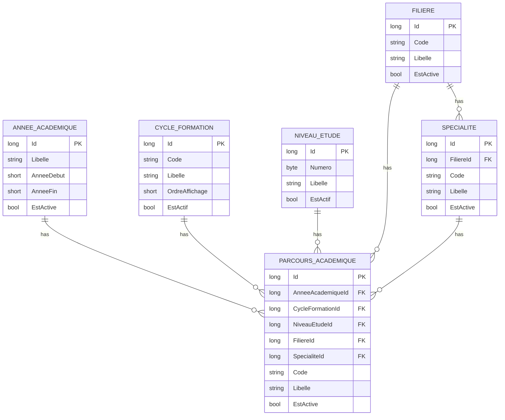
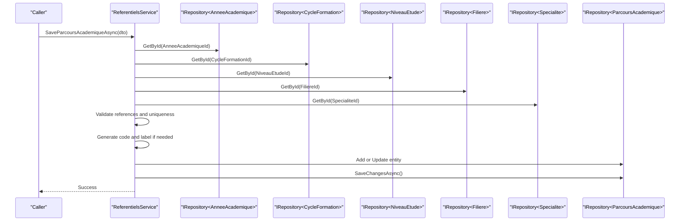
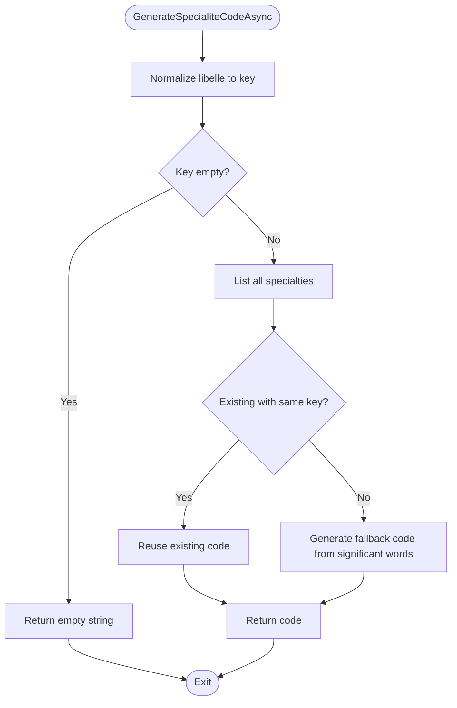
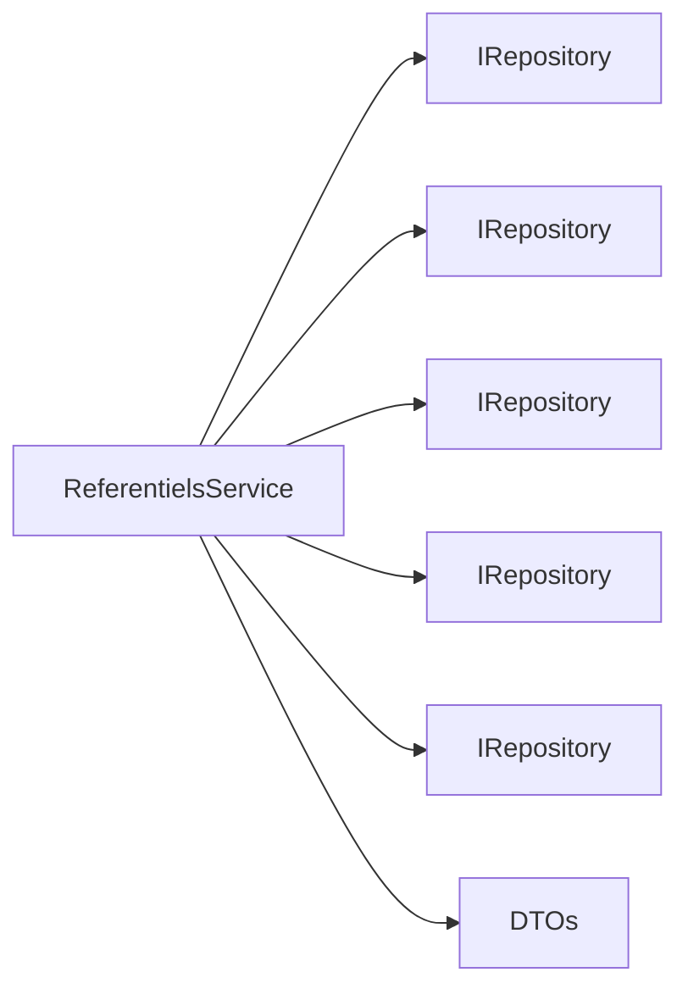

# Reference Data Services

<cite>
**Referenced Files in This Document**
- [IReferentielsService.cs](file://RIIS.Academic.Application/Referentiels/Services/IReferentielsService.cs)
- [ReferentielsService.cs](file://RIIS.Academic.Application/Referentiels/Services/ReferentielsService.cs)
- [AnneeAcademiqueDto.cs](file://RIIS.Academic.Application/Referentiels/Dtos/AnneeAcademiqueDto.cs)
- [CycleFormationDto.cs](file://RIIS.Academic.Application/Referentiels/Dtos/CycleFormationDto.cs)
- [FiliereDto.cs](file://RIIS.Academic.Application/Referentiels/Dtos/FiliereDto.cs)
- [NiveauEtudeDto.cs](file://RIIS.Academic.Application/Referentiels/Dtos/NiveauEtudeDto.cs)
- [SpecialiteDto.cs](file://RIIS.Academic.Application/Referentiels/Dtos/SpecialiteDto.cs)
- [ParcoursAcademiqueDto.cs](file://RIIS.Academic.Application/Referentiels/Dtos/ParcoursAcademiqueDto.cs)
- [ParcoursFormationDto.cs](file://RIIS.Academic.Application/Referentiels/Dtos/ParcoursFormationDto.cs)
- [FiliereLookupDto.cs](file://RIIS.Academic.Application/Referentiels/Dtos/FiliereLookupDto.cs)
- [AnneeAcademique.cs](file://RIIS.Academic.Domain/Referentiels/AnneeAcademique.cs)
- [CycleFormation.cs](file://RIIS.Academic.Domain/Referentiels/CycleFormation.cs)
- [Filiere.cs](file://RIIS.Academic.Domain/Referentiels/Filiere.cs)
- [NiveauEtude.cs](file://RIIS.Academic.Domain/Referentiels/NiveauEtude.cs)
- [Specialite.cs](file://RIIS.Academic.Domain/Referentiels/Specialite.cs)
- [IRepository.cs](file://RIIS.Academic.Application/Abstractions/Persistence/IRepository.cs)
</cite>

## Table of Contents
1. [Introduction](#introduction)
2. [Project Structure](#project-structure)
3. [Core Components](#core-components)
4. [Architecture Overview](#architecture-overview)
5. [Detailed Component Analysis](#detailed-component-analysis)
6. [Dependency Analysis](#dependency-analysis)
7. [Performance Considerations](#performance-considerations)
8. [Troubleshooting Guide](#troubleshooting-guide)
9. [Conclusion](#conclusion)

## Introduction
This document describes the Reference Data services that manage institutional master data for academic cycles, programs, study levels, and administrative classifications. It focuses on the IReferentielsService interface and its ReferentielsService implementation, which provide CRUD operations, lookup methods, and hierarchical navigation across reference entities such as Academic Year, Training Cycle, Study Level, Program (Major), and Specialty. It also documents the associated DTOs, validation rules, data integrity constraints, and performance considerations for frequently accessed reference data.

## Project Structure
The Reference Data feature spans three layers:
- Application layer: service interface and implementation, plus DTOs
- Domain layer: reference entities and their relationships
- Infrastructure layer: persistence via a generic repository abstraction

**Diagram sources**
- [IReferentielsService.cs:5-45](file://RIIS.Academic.Application/Referentiels/Services/IReferentielsService.cs#L5-L45)
- [ReferentielsService.cs:7-13](file://RIIS.Academic.Application/Referentiels/Services/ReferentielsService.cs#L7-L13)
- [AnneeAcademique.cs:3-14](file://RIIS.Academic.Domain/Referentiels/AnneeAcademique.cs#L3-L14)
- [CycleFormation.cs:3-12](file://RIIS.Academic.Domain/Referentiels/CycleFormation.cs#L3-L12)
- [Filiere.cs:3-12](file://RIIS.Academic.Domain/Referentiels/Filiere.cs#L3-L12)
- [NiveauEtude.cs:3-13](file://RIIS.Academic.Domain/Referentiels/NiveauEtude.cs#L3-L13)
- [Specialite.cs:3-13](file://RIIS.Academic.Domain/Referentiels/Specialite.cs#L3-L13)

**Section sources**
- [IReferentielsService.cs:5-45](file://RIIS.Academic.Application/Referentiels/Services/IReferentielsService.cs#L5-L45)
- [ReferentielsService.cs:7-13](file://RIIS.Academic.Application/Referentiels/Services/ReferentielsService.cs#L7-L13)

## Core Components
- IReferentielsService defines the application contract for managing reference data:
  - Academic Year: list, create default, save, delete
  - Training Cycle: list, create default, save, delete
  - Study Level: list, create default, save, delete
  - Program (Major): list, create default, save, delete
  - Specialty: list, create default, code generation, save, delete
  - Lookups: active programs for dropdowns
  - Hierarchical queries: filtered lists of academic pathways by year, cycle, level, program, specialty

- ReferentielsService implements the contract using domain entities through a generic repository. It performs:
  - Validation and normalization of codes and labels
  - Business rule enforcement (e.g., academic year span, required references)
  - Unique combination checks for academic pathways
  - Code and label generation for specialties and pathways
  - Mapping from domain entities to DTOs with enriched display fields

**Section sources**
- [IReferentielsService.cs:5-45](file://RIIS.Academic.Application/Referentiels/Services/IReferentielsService.cs#L5-L45)
- [ReferentielsService.cs:15-709](file://RIIS.Academic.Application/Referentiels/Services/ReferentielsService.cs#L15-L709)

## Architecture Overview
The service layer orchestrates reads/writes against domain entities via repositories. DTOs are used to decouple the UI from domain models and to carry enriched information for display.

**Diagram sources**
- [ReferentielsService.cs:150-212](file://RIIS.Academic.Application/Referentiels/Services/ReferentielsService.cs#L150-L212)
- [IRepository.cs](file://RIIS.Academic.Application/Abstractions/Persistence/IRepository.cs)

## Detailed Component Analysis

### IReferentielsService Interface
- Responsibilities:
  - CRUD over Academic Year, Training Cycle, Study Level, Program, Specialty
  - Create default templates for new records
  - Generate unique codes for specialties
  - Provide filtered and sorted lists for UI consumption
  - Support hierarchical navigation via filters (year, cycle, level, program, specialty)

Key method groups:
- Academic Year: GetAnneesAcademiquesAsync, CreateDefaultAnneeAcademique, SaveAnneeAcademiqueAsync, DeleteAnneeAcademiqueAsync
- Training Cycle: GetCyclesFormationAsync, CreateDefaultCycleFormation, SaveCycleFormationAsync, DeleteCycleFormationAsync
- Study Level: GetNiveauxEtudeAsync, CreateDefaultNiveauEtudeAsync, SaveNiveauEtudeAsync, DeleteNiveauEtudeAsync
- Program: GetFilieresAsync, CreateDefaultFiliere, SaveFiliereAsync, DeleteFiliereAsync
- Specialty: GetSpecialitesAsync, CreateDefaultSpecialite, GenerateSpecialiteCodeAsync, SaveSpecialiteAsync, DeleteSpecialiteAsync
- Lookups: GetFilieresActivesLookupAsync
- Pathways: GetParcoursFormationAsync, GetParcoursAcademiquesAsync, CreateDefaultParcoursAcademique, SaveParcoursAcademiqueAsync, DeleteParcoursAcademiqueAsync

**Section sources**
- [IReferentielsService.cs:5-45](file://RIIS.Academic.Application/Referentiels/Services/IReferentielsService.cs#L5-L45)

### ReferentielsService Implementation
- Persistence: Uses IRepository<T> for all reference entities.
- Read operations:
  - Lists are ordered for consistent UI presentation (e.g., by display order or alphabetical).
  - Enriched DTOs include related entity names and codes for display.
- Write operations:
  - Validate required fields and business rules before persisting.
  - Normalize codes to uppercase and trim whitespace.
  - Generate codes and labels when not provided.
  - Enforce uniqueness constraints for academic pathway combinations.
- Error handling:
  - Throws explicit exceptions for invalid inputs or missing references.

Validation and business rules implemented:
- Academic Year:
  - Label is required.
  - End year must be exactly start year + 1.
- Academic Pathway:
  - All referenced IDs (year, cycle, level, program, specialty) are required.
  - Specialty must belong to the selected program.
  - Unique combination of (year, cycle, level, program, specialty) enforced.
  - Code and label generated if not provided; label composed from referenced entities.
- Specialty:
  - Program ID is required.
  - Label is required.
  - Code is auto-generated from label if empty; normalized and deduplicated logic applied.
- Study Level:
  - Number must be >= 1.
  - Label is required.
- Training Cycle and Program:
  - Code and label are required; codes normalized to uppercase.

Code generation details:
- Specialty code:
  - Normalizes label into a stable key.
  - If an existing specialty shares the same normalized key, reuses its code.
  - Fallback generates a short code from significant words.
- Academic pathway code:
  - Composed from year suffix, cycle code, level number, program code, and specialty code.

Mapping and enrichment:
- Pathway DTOs include both IDs and display-friendly codes/libelles for year, cycle, level, program, and specialty.

**Section sources**
- [ReferentielsService.cs:15-709](file://RIIS.Academic.Application/Referentiels/Services/ReferentielsService.cs#L15-L709)

### DTOs
- AnneeAcademiqueDto: Represents an academic year with label, start/end years, and active flag.
- CycleFormationDto: Represents a training cycle with code, label, display order, and active flag.
- FiliereDto: Represents a program/major with code, label, and active flag.
- NiveauEtudeDto: Represents a study level with numeric position, label, and active flag.
- SpecialiteDto: Represents a specialty linked to a program, with code, label, and active flag.
- ParcoursAcademiqueDto: Aggregates a pathway with full context (IDs and display values) for year, cycle, level, program, specialty.
- ParcoursFormationDto: Similar to above but without year context.
- FiliereLookupDto: Lightweight DTO for dropdowns containing only id and label.

These DTOs isolate UI concerns and reduce payload size where appropriate.

**Section sources**
- [AnneeAcademiqueDto.cs:3-10](file://RIIS.Academic.Application/Referentiels/Dtos/AnneeAcademiqueDto.cs#L3-L10)
- [CycleFormationDto.cs:3-10](file://RIIS.Academic.Application/Referentiels/Dtos/CycleFormationDto.cs#L3-L10)
- [FiliereDto.cs:3-9](file://RIIS.Academic.Application/Referentiels/Dtos/FiliereDto.cs#L3-L9)
- [NiveauEtudeDto.cs:3-9](file://RIIS.Academic.Application/Referentiels/Dtos/NiveauEtudeDto.cs#L3-L9)
- [SpecialiteDto.cs:3-12](file://RIIS.Academic.Application/Referentiels/Dtos/SpecialiteDto.cs#L3-L12)
- [ParcoursAcademiqueDto.cs:3-24](file://RIIS.Academic.Application/Referentiels/Dtos/ParcoursAcademiqueDto.cs#L3-L24)
- [ParcoursFormationDto.cs:3-18](file://RIIS.Academic.Application/Referentiels/Dtos/ParcoursFormationDto.cs#L3-L18)
- [FiliereLookupDto.cs:3-7](file://RIIS.Academic.Application/Referentiels/Dtos/FiliereLookupDto.cs#L3-L7)

### Domain Entities and Relationships
Reference entities model institutional hierarchy:
- Academic Year links to pathways, classes, and enrollments.
- Training Cycle links to pathways.
- Study Level links to pathways, enrollments, and semesters.
- Program links to specialties and pathways.
- Specialty belongs to a Program and links to pathways.

**Diagram sources**
- [AnneeAcademique.cs:3-14](file://RIIS.Academic.Domain/Referentiels/AnneeAcademique.cs#L3-L14)
- [CycleFormation.cs:3-12](file://RIIS.Academic.Domain/Referentiels/CycleFormation.cs#L3-L12)
- [NiveauEtude.cs:3-13](file://RIIS.Academic.Domain/Referentiels/NiveauEtude.cs#L3-L13)
- [Filiere.cs:3-12](file://RIIS.Academic.Domain/Referentiels/Filiere.cs#L3-L12)
- [Specialite.cs:3-13](file://RIIS.Academic.Domain/Referentiels/Specialite.cs#L3-L13)

### API Workflows

#### Save Academic Pathway Workflow

**Diagram sources**
- [ReferentielsService.cs:221-308](file://RIIS.Academic.Application/Referentiels/Services/ReferentielsService.cs#L221-L308)

#### Generate Specialty Code Workflow

**Diagram sources**
- [ReferentielsService.cs:446-483](file://RIIS.Academic.Application/Referentiels/Services/ReferentielsService.cs#L446-L483)

### Validation Rules and Data Integrity Constraints
- Required fields:
  - Labels for Academic Year, Cycle, Program, Specialty, Study Level.
  - Numeric positions for Study Level must be >= 1.
  - Academic Year span constraint: end = start + 1.
- Referential integrity:
  - Academic Pathway requires valid IDs for year, cycle, level, program, specialty.
  - Specialty must belong to the selected program.
- Uniqueness:
  - Academic Pathway combination (year, cycle, level, program, specialty) must be unique.
- Code normalization:
  - Codes are trimmed and uppercased.
  - Specialty code reuse based on normalized label key.

**Section sources**
- [ReferentielsService.cs:45-76](file://RIIS.Academic.Application/Referentiels/Services/ReferentielsService.cs#L45-L76)
- [ReferentielsService.cs:221-308](file://RIIS.Academic.Application/Referentiels/Services/ReferentielsService.cs#L221-L308)
- [ReferentielsService.cs:318-345](file://RIIS.Academic.Application/Referentiels/Services/ReferentielsService.cs#L318-L345)
- [ReferentielsService.cs:371-396](file://RIIS.Academic.Application/Referentiels/Services/ReferentielsService.cs#L371-L396)
- [ReferentielsService.cs:552-591](file://RIIS.Academic.Application/Referentiels/Services/ReferentielsService.cs#L552-L591)
- [ReferentielsService.cs:624-653](file://RIIS.Academic.Application/Referentiels/Services/ReferentielsService.cs#L624-L653)

### Synchronization Mechanisms
- The service uses a unit-of-work pattern via repository SaveChangesAsync calls after each mutation.
- No explicit distributed synchronization or caching is implemented within the service; consistency relies on database transactions per operation.

**Section sources**
- [ReferentielsService.cs:75-82](file://RIIS.Academic.Application/Referentiels/Services/ReferentielsService.cs#L75-L82)
- [ReferentielsService.cs:307-314](file://RIIS.Academic.Application/Referentiels/Services/ReferentielsService.cs#L307-L314)
- [ReferentielsService.cs:344-351](file://RIIS.Academic.Application/Referentiels/Services/ReferentielsService.cs#L344-L351)
- [ReferentielsService.cs:395-402](file://RIIS.Academic.Application/Referentiels/Services/ReferentielsService.cs#L395-L402)
- [ReferentielsService.cs:590-597](file://RIIS.Academic.Application/Referentiels/Services/ReferentielsService.cs#L590-L597)
- [ReferentielsService.cs:652-659](file://RIIS.Academic.Application/Referentiels/Services/ReferentielsService.cs#L652-L659)

## Dependency Analysis
- Coupling:
  - ReferentielsService depends on IRepository<T> for all reference entities, promoting loose coupling to persistence.
  - DTOs depend only on primitive types and simple structures, minimizing coupling to domain models.
- Cohesion:
  - Each method group corresponds to a single aggregate (e.g., Specialty, Academic Pathway), maintaining high cohesion.
- External dependencies:
  - None beyond .NET base libraries and the repository abstraction.

**Diagram sources**
- [ReferentielsService.cs:7-13](file://RIIS.Academic.Application/Referentiels/Services/ReferentielsService.cs#L7-L13)
- [IRepository.cs](file://RIIS.Academic.Application/Abstractions/Persistence/IRepository.cs)

**Section sources**
- [ReferentielsService.cs:7-13](file://RIIS.Academic.Application/Referentiels/Services/ReferentielsService.cs#L7-L13)

## Performance Considerations
- In-memory joins and filtering:
  - Several read methods load entire tables into memory and perform LINQ filtering/joins. For small reference datasets this is acceptable; for large catalogs consider server-side filtering or pagination.
- Ordering:
  - Consistent ordering reduces UI churn and improves perceived performance.
- Code generation:
  - Specialty code generation scans all specialties; cache the list if called frequently.
- Recommendations:
  - Introduce caching for read-only reference lists (e.g., cycles, programs, levels) with appropriate invalidation on writes.
  - Use projection queries to minimize payload size.
  - Consider indexing on frequently filtered columns (e.g., codes, active flags).

[No sources needed since this section provides general guidance]

## Troubleshooting Guide
Common errors and resolutions:
- Invalid academic year span:
  - Ensure end year equals start year + 1.
- Missing required references:
  - Validate that all foreign keys (year, cycle, level, program, specialty) exist before saving pathways.
- Specialty mismatch:
  - Confirm the selected specialty belongs to the chosen program.
- Duplicate pathway:
  - Avoid creating multiple pathways with the same combination of year, cycle, level, program, and specialty.
- Empty or invalid codes/labels:
  - Provide non-empty labels; codes will be normalized and can be auto-generated where supported.

Exception types thrown:
- InvalidOperationException for validation failures and missing references.

**Section sources**
- [ReferentielsService.cs:45-76](file://RIIS.Academic.Application/Referentiels/Services/ReferentielsService.cs#L45-L76)
- [ReferentielsService.cs:221-308](file://RIIS.Academic.Application/Referentiels/Services/ReferentielsService.cs#L221-L308)
- [ReferentielsService.cs:552-591](file://RIIS.Academic.Application/Referentiels/Services/ReferentielsService.cs#L552-L591)
- [ReferentielsService.cs:624-653](file://RIIS.Academic.Application/Referentiels/Services/ReferentielsService.cs#L624-L653)

## Conclusion
The Reference Data services provide a robust, validated, and user-friendly API for managing institutional master data. The clear separation between interfaces, implementations, DTOs, and domain entities supports maintainability and testability. With careful attention to performance patterns like caching and efficient querying, these services can scale effectively as the volume of reference data grows.