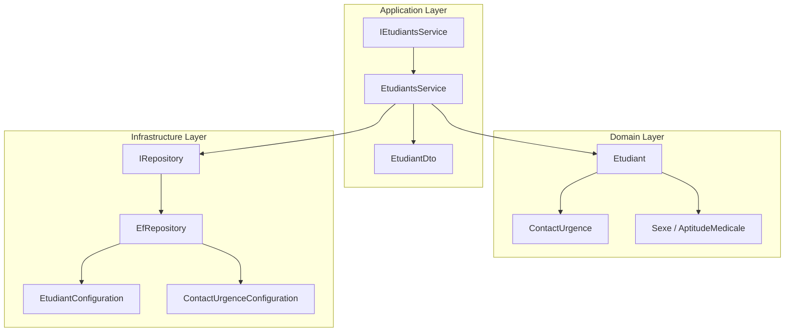
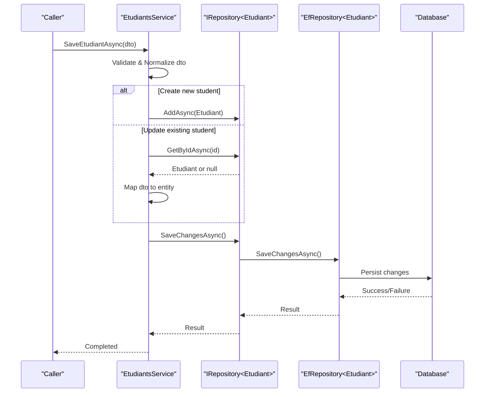
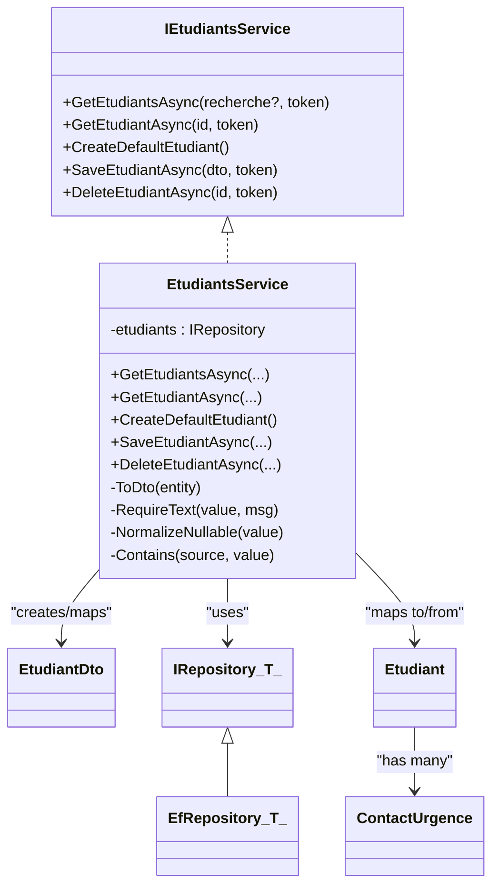

# Student Management Services

<cite>
**Referenced Files in This Document**
- [IEtudiantsService.cs](file://RIIS.Academic.Application/Etudiants/Services/IEtudiantsService.cs)
- [EtudiantsService.cs](file://RIIS.Academic.Application/Etudiants/Services/EtudiantsService.cs)
- [EtudiantDto.cs](file://RIIS.Academic.Application/Etudiants/Dtos/EtudiantDto.cs)
- [Etudiant.cs](file://RIIS.Academic.Domain/Etudiants/Etudiant.cs)
- [ContactUrgence.cs](file://RIIS.Academic.Domain/Etudiants/ContactUrgence.cs)
- [IRepository.cs](file://RIIS.Academic.Application/Abstractions/Persistence/IRepository.cs)
- [EfRepository.cs](file://RIIS.Academic.Infrastructure/Persistence/Repositories/EfRepository.cs)
- [EtudiantConfiguration.cs](file://RIIS.Academic.Infrastructure/Persistence/Configurations/Etudiants/EtudiantConfiguration.cs)
- [ContactUrgenceConfiguration.cs](file://RIIS.Academic.Infrastructure/Persistence/Configurations/Etudiants/ContactUrgenceConfiguration.cs)
- [Sexe.cs](file://RIIS.Academic.Domain/Enums/Sexe.cs)
- [AptitudeMedicale.cs](file://RIIS.Academic.Domain/Enums/AptitudeMedicale.cs)
</cite>

## Table of Contents
1. [Introduction](#introduction)
2. [Project Structure](#project-structure)
3. [Core Components](#core-components)
4. [Architecture Overview](#architecture-overview)
5. [Detailed Component Analysis](#detailed-component-analysis)
6. [Dependency Analysis](#dependency-analysis)
7. [Performance Considerations](#performance-considerations)
8. [Troubleshooting Guide](#troubleshooting-guide)
9. [Conclusion](#conclusion)

## Introduction
This document provides comprehensive documentation for the Student Management services within the academic system. It focuses on the IEtudiantsService interface and its EtudiantsService implementation, covering CRUD operations, student lifecycle management, contact information handling, data transformation patterns between DTOs and domain entities, validation rules, business constraints, error handling strategies, and integration with the infrastructure layer for data persistence.

## Project Structure
The Student Management feature spans multiple layers:
- Application layer: service interfaces and implementations, DTOs
- Domain layer: entity models and enums
- Infrastructure layer: repository abstraction and Entity Framework configuration

**Diagram sources**
- [IEtudiantsService.cs:5-12](file://RIIS.Academic.Application/Etudiants/Services/IEtudiantsService.cs#L5-L12)
- [EtudiantsService.cs:7-127](file://RIIS.Academic.Application/Etudiants/Services/EtudiantsService.cs#L7-L127)
- [EtudiantDto.cs:5-25](file://RIIS.Academic.Application/Etudiants/Dtos/EtudiantDto.cs#L5-L25)
- [Etudiant.cs:3-27](file://RIIS.Academic.Domain/Etudiants/Etudiant.cs#L3-L27)
- [ContactUrgence.cs:3-14](file://RIIS.Academic.Domain/Etudiants/ContactUrgence.cs#L3-L14)
- [IRepository.cs:3-12](file://RIIS.Academic.Application/Abstractions/Persistence/IRepository.cs#L3-L12)
- [EfRepository.cs:6-32](file://RIIS.Academic.Infrastructure/Persistence/Repositories/EfRepository.cs#L6-L32)
- [EtudiantConfiguration.cs:6-32](file://RIIS.Academic.Infrastructure/Persistence/Configurations/Etudiants/EtudiantConfiguration.cs#L6-L32)
- [ContactUrgenceConfiguration.cs:6-20](file://RIIS.Academic.Infrastructure/Persistence/Configurations/Etudiants/ContactUrgenceConfiguration.cs#L6-L20)

**Section sources**
- [IEtudiantsService.cs:5-12](file://RIIS.Academic.Application/Etudiants/Services/IEtudiantsService.cs#L5-L12)
- [EtudiantsService.cs:7-127](file://RIIS.Academic.Application/Etudiants/Services/EtudiantsService.cs#L7-L127)
- [EtudiantDto.cs:5-25](file://RIIS.Academic.Application/Etudiants/Dtos/EtudiantDto.cs#L5-L25)
- [Etudiant.cs:3-27](file://RIIS.Academic.Domain/Etudiants/Etudiant.cs#L3-L27)
- [ContactUrgence.cs:3-14](file://RIIS.Academic.Domain/Etudiants/ContactUrgence.cs#L3-L14)
- [IRepository.cs:3-12](file://RIIS.Academic.Application/Abstractions/Persistence/IRepository.cs#L3-L12)
- [EfRepository.cs:6-32](file://RIIS.Academic.Infrastructure/Persistence/Repositories/EfRepository.cs#L6-L32)
- [EtudiantConfiguration.cs:6-32](file://RIIS.Academic.Infrastructure/Persistence/Configurations/Etudiants/EtudiantConfiguration.cs#L6-L32)
- [ContactUrgenceConfiguration.cs:6-20](file://RIIS.Academic.Infrastructure/Persistence/Configurations/Etudiants/ContactUrgenceConfiguration.cs#L6-L20)

## Core Components
- IEtudiantsService: Defines the application API for student operations (list, get, create default, save, delete).
- EtudiantsService: Implements business logic for student CRUD, including search, validation, normalization, and persistence via IRepository<Etudiant>.
- EtudiantDto: Data transfer object representing a student record used by the application layer.
- Etudiant: Domain entity representing a student with relationships to emergency contacts and enrollments.
- ContactUrgence: Domain entity for student emergency contacts.
- IRepository<T>: Generic repository abstraction for persistence operations.
- EfRepository<T>: EF-based implementation of IRepository<T>.
- EF configurations: Define table mappings, constraints, indexes, and relationships.

Key responsibilities:
- Search and list students with optional filtering across key fields.
- Create default student DTO with sensible defaults.
- Validate and normalize input before persisting.
- Enforce unique matricule constraint at the application level.
- Map between DTOs and domain entities.

**Section sources**
- [IEtudiantsService.cs:5-12](file://RIIS.Academic.Application/Etudiants/Services/IEtudiantsService.cs#L5-L12)
- [EtudiantsService.cs:7-127](file://RIIS.Academic.Application/Etudiants/Services/EtudiantsService.cs#L7-L127)
- [EtudiantDto.cs:5-25](file://RIIS.Academic.Application/Etudiants/Dtos/EtudiantDto.cs#L5-L25)
- [Etudiant.cs:3-27](file://RIIS.Academic.Domain/Etudiants/Etudiant.cs#L3-L27)
- [ContactUrgence.cs:3-14](file://RIIS.Academic.Domain/Etudiants/ContactUrgence.cs#L3-L14)
- [IRepository.cs:3-12](file://RIIS.Academic.Application/Abstractions/Persistence/IRepository.cs#L3-L12)
- [EfRepository.cs:6-32](file://RIIS.Academic.Infrastructure/Persistence/Repositories/EfRepository.cs#L6-L32)
- [EtudiantConfiguration.cs:6-32](file://RIIS.Academic.Infrastructure/Persistence/Configurations/Etudiants/EtudiantConfiguration.cs#L6-L32)
- [ContactUrgenceConfiguration.cs:6-20](file://RIIS.Academic.Infrastructure/Persistence/Configurations/Etudiants/ContactUrgenceConfiguration.cs#L6-L20)

## Architecture Overview
The service layer orchestrates business logic while delegating persistence to the repository abstraction. The repository uses Entity Framework under the hood, configured via EF configurations.

**Diagram sources**
- [EtudiantsService.cs:53-127](file://RIIS.Academic.Application/Etudiants/Services/EtudiantsService.cs#L53-L127)
- [IRepository.cs:6-12](file://RIIS.Academic.Application/Abstractions/Persistence/IRepository.cs#L6-L12)
- [EfRepository.cs:17-32](file://RIIS.Academic.Infrastructure/Persistence/Repositories/EfRepository.cs#L17-L32)

## Detailed Component Analysis

### IEtudiantsService Interface
Defines the contract for student operations:
- GetEtudiantsAsync(recherche?, cancellationToken?): Returns a list of students, optionally filtered by a search string across key fields.
- GetEtudiantAsync(id, cancellationToken?): Returns a single student by ID.
- CreateDefaultEtudiant(): Creates a default student DTO with predefined values.
- SaveEtudiantAsync(dto, cancellationToken?): Validates, normalizes, and persists a student DTO.
- DeleteEtudiantAsync(id, cancellationToken?): Deletes a student by ID.

Parameters and return types are aligned with asynchronous patterns and cancellation support.

**Section sources**
- [IEtudiantsService.cs:5-12](file://RIIS.Academic.Application/Etudiants/Services/IEtudiantsService.cs#L5-L12)

### EtudiantsService Implementation
Responsibilities:
- List and search: Retrieves all students and applies case-insensitive substring matching on Matricule, Nom, Prenoms, TelephonePrincipal, Email when a search term is provided. Results are sorted by last name then first name and mapped to DTOs.
- Single retrieval: Fetches a student by ID and maps to DTO if found.
- Default creation: Provides a default DTO with reasonable defaults for date of birth, place of birth, sex, medical fitness, nationality, and primary phone.
- Save logic:
  - Normalizes nullable strings (trim and convert empty to null).
  - Requires non-empty text for critical fields; throws an exception if missing.
  - Enforces uniqueness of Matricule across existing records (excluding current entity during updates).
  - Creates or updates the domain entity based on DTO values.
  - Persists changes via repository.
- Delete: Removes a student by ID and persists.

Validation and normalization helpers:
- RequireText: Ensures required fields are present and trimmed; throws InvalidOperationException with a descriptive message.
- NormalizeNullable: Trims strings and converts blank values to null.
- Contains: Case-insensitive substring check for search.

Error handling:
- Throws InvalidOperationException for missing required fields and duplicate matricule.
- Safe deletion when entity not found.

Data mapping:
- ToDto: Maps domain entity to DTO.
- Save flow maps DTO to domain entity fields.

Usage examples:
- Create: Instantiate a default DTO via CreateDefaultEtudiant(), populate fields, call SaveEtudiantAsync().
- Update: Retrieve via GetEtudiantAsync(), modify DTO properties, call SaveEtudiantAsync().
- Query: Use GetEtudiantsAsync() with optional search term.
- Delete: Call DeleteEtudiantAsync(id).

**Section sources**
- [EtudiantsService.cs:7-173](file://RIIS.Academic.Application/Etudiants/Services/EtudiantsService.cs#L7-L173)

### EtudiantDto
Represents a student record for application-layer operations. Includes:
- Identifiers and personal details (ID, Matricule, Nom, Prenoms, DateNaissance, LieuNaissance).
- Enumerated attributes (Sexe, AptitudeMedicale).
- Nationality and origin region.
- Contact information (primary and secondary phone, email).
- Parent names and residence location.
- Optional photo URL.
- Computed property NomComplet combining last and first names.

Transformation pattern:
- Created from domain entity via ToDto in the service.
- Used as input to SaveEtudiantAsync to update or create entities.

**Section sources**
- [EtudiantDto.cs:5-25](file://RIIS.Academic.Application/Etudiants/Dtos/EtudiantDto.cs#L5-L25)
- [EtudiantsService.cs:129-149](file://RIIS.Academic.Application/Etudiants/Services/EtudiantsService.cs#L129-L149)

### Domain Entities and Relationships
- Etudiant: Core student entity with required fields, enumerations, and relationships to ContactsUrgence and Inscriptions. Includes audit/versioning fields.
- ContactUrgence: Emergency contact linked to a student with fields for full name, relationship, phones, and whether it is the principal contact.

Relationships:
- One-to-many: Etudiant has many ContactUrgence entries.
- Cascade delete configured so removing a student removes associated emergency contacts.

**Section sources**
- [Etudiant.cs:3-27](file://RIIS.Academic.Domain/Etudiants/Etudiant.cs#L3-L27)
- [ContactUrgence.cs:3-14](file://RIIS.Academic.Domain/Etudiants/ContactUrgence.cs#L3-L14)
- [ContactUrgenceConfiguration.cs:16-19](file://RIIS.Academic.Infrastructure/Persistence/Configurations/Etudiants/ContactUrgenceConfiguration.cs#L16-L19)

### Repository Abstraction and Implementation
- IRepository<T>: Defines generic persistence operations (list, get by id, add, delete, delete by id, save changes).
- EfRepository<T>: Implements repository using Entity Framework with AsNoTracking for reads and standard change tracking for writes.

Integration points:
- EtudiantsService depends on IRepository<Etudiant>, enabling testability and decoupling from EF specifics.
- EfRepository binds to RiisAcademicDbContext for database access.

**Section sources**
- [IRepository.cs:3-12](file://RIIS.Academic.Application/Abstractions/Persistence/IRepository.cs#L3-L12)
- [EfRepository.cs:6-32](file://RIIS.Academic.Infrastructure/Persistence/Repositories/EfRepository.cs#L6-L32)

### EF Configurations and Constraints
- EtudiantConfiguration:
  - Table name and primary key.
  - Unique index on Matricule (nullable filter).
  - Max lengths and required flags for core fields.
  - Enums stored as strings with max length.
  - Row versioning for concurrency control.
  - Index on Nom for performance.
- ContactUrgenceConfiguration:
  - Table name and primary key.
  - Required fields and max lengths.
  - Relationship to Etudiant with cascade delete.

These configurations enforce data integrity at the database level, complementing application-level validations.

**Section sources**
- [EtudiantConfiguration.cs:6-32](file://RIIS.Academic.Infrastructure/Persistence/Configurations/Etudiants/EtudiantConfiguration.cs#L6-L32)
- [ContactUrgenceConfiguration.cs:6-20](file://RIIS.Academic.Infrastructure/Persistence/Configurations/Etudiants/ContactUrgenceConfiguration.cs#L6-L20)

### Enums
- Sexe: NonRenseigne, Masculin, Feminin.
- AptitudeMedicale: NonRenseignee, Apte, Inapte.

Used in student records to capture gender and medical fitness status.

**Section sources**
- [Sexe.cs:3-8](file://RIIS.Academic.Domain/Enums/Sexe.cs#L3-L8)
- [AptitudeMedicale.cs:3-8](file://RIIS.Academic.Domain/Enums/AptitudeMedicale.cs#L3-L8)

## Dependency Analysis
The following diagram shows how components depend on each other:

**Diagram sources**
- [IEtudiantsService.cs:5-12](file://RIIS.Academic.Application/Etudiants/Services/IEtudiantsService.cs#L5-L12)
- [EtudiantsService.cs:7-173](file://RIIS.Academic.Application/Etudiants/Services/EtudiantsService.cs#L7-L173)
- [EtudiantDto.cs:5-25](file://RIIS.Academic.Application/Etudiants/Dtos/EtudiantDto.cs#L5-L25)
- [Etudiant.cs:3-27](file://RIIS.Academic.Domain/Etudiants/Etudiant.cs#L3-L27)
- [ContactUrgence.cs:3-14](file://RIIS.Academic.Domain/Etudiants/ContactUrgence.cs#L3-L14)
- [IRepository.cs:3-12](file://RIIS.Academic.Application/Abstractions/Persistence/IRepository.cs#L3-L12)
- [EfRepository.cs:6-32](file://RIIS.Academic.Infrastructure/Persistence/Repositories/EfRepository.cs#L6-L32)

## Performance Considerations
- Read operations use AsNoTracking for efficient listing without change tracking overhead.
- Sorting is applied in-memory after fetching; consider server-side filtering/sorting for large datasets.
- Unique matricule check loads all records to detect duplicates; for high-volume scenarios, rely on database unique index and handle constraint violations at the database layer.
- Indexes on Nom and unique Matricule improve query performance and enforce uniqueness.

[No sources needed since this section provides general guidance]

## Troubleshooting Guide
Common issues and resolutions:
- Missing required fields: SaveEtudiantAsync throws InvalidOperationException when Nom, Prenoms, LieuNaissance, Nationalite, or TelephonePrincipal are empty or whitespace-only. Ensure these fields are populated before saving.
- Duplicate matricule: If a matricule already exists for another student, SaveEtudiantAsync throws InvalidOperationException. Check for conflicts before saving or handle database constraint errors.
- Not found during update: If GetByIdAsync returns null during update, the service does nothing; verify the ID exists before attempting updates.
- Deletion safety: Deleting a student cascades to emergency contacts due to configuration; ensure referential integrity is acceptable.

Operational tips:
- Use CreateDefaultEtudiant() to initialize a DTO with safe defaults, then fill required fields.
- Normalize inputs to avoid trailing spaces causing false mismatches.
- Leverage search filters to narrow results efficiently.

**Section sources**
- [EtudiantsService.cs:53-127](file://RIIS.Academic.Application/Etudiants/Services/EtudiantsService.cs#L53-L127)
- [EtudiantConfiguration.cs:12-15](file://RIIS.Academic.Infrastructure/Persistence/Configurations/Etudiants/EtudiantConfiguration.cs#L12-L15)
- [ContactUrgenceConfiguration.cs:16-19](file://RIIS.Academic.Infrastructure/Persistence/Configurations/Etudiants/ContactUrgenceConfiguration.cs#L16-L19)

## Conclusion
The Student Management services provide a robust, layered approach to managing student data. The IEtudiantsService defines clear operations, while EtudiantsService encapsulates validation, normalization, and persistence logic. The DTO-to-entity mapping ensures clean separation between application and domain concerns. Database configurations enforce data integrity through constraints and indexes. Together, these components deliver reliable CRUD functionality, search capabilities, and lifecycle management for students and their emergency contacts.

[No sources needed since this section summarizes without analyzing specific files]