# Academic Program Services

<cite>
**Referenced Files in This Document**
- [IProgrammePedagogiqueService.cs](file://RIIS.Academic.Application/Programmes/Services/IProgrammePedagogiqueService.cs)
- [ProgrammePedagogiqueService.cs](file://RIIS.Academic.Application/Programmes/Services/ProgrammePedagogiqueService.cs)
- [MaquettePedagogiqueDto.cs](file://RIIS.Academic.Application/Programmes/Dtos/MaquettePedagogiqueDto.cs)
- [SemestrePedagogiqueDto.cs](file://RIIS.Academic.Application/Programmes/Dtos/SemestrePedagogiqueDto.cs)
- [UniteEnseignementDto.cs](file://RIIS.Academic.Application/Programmes/Dtos/UniteEnseignementDto.cs)
- [ElementConstitutifDto.cs](file://RIIS.Academic.Application/Programmes/Dtos/ElementConstitutifDto.cs)
- [MaquettePedagogiqueHierarchyDto.cs](file://RIIS.Academic.Application/Programmes/Dtos/MaquettePedagogiqueHierarchyDto.cs)
- [SemestrePedagogiqueHierarchyDto.cs](file://RIIS.Academic.Application/Programmes/Dtos/SemestrePedagogiqueHierarchyDto.cs)
- [UniteEnseignementHierarchyDto.cs](file://RIIS.Academic.Application/Programmes/Dtos/UniteEnseignementHierarchyDto.cs)
- [ElementConstitutifHierarchyDto.cs](file://RIIS.Academic.Application/Programmes/Dtos/ElementConstitutifHierarchyDto.cs)
- [LookupDto.cs](file://RIIS.Academic.Application/Common/Dtos/LookupDto.cs)
- [MaquettePedagogique.cs](file://RIIS.Academic.Domain/Programmes/MaquettePedagogique.cs)
- [SemestrePedagogique.cs](file://RIIS.Academic.Domain/Programmes/SemestrePedagogique.cs)
- [UniteEnseignement.cs](file://RIIS.Academic.Domain/Programmes/UniteEnseignement.cs)
- [ElementConstitutif.cs](file://RIIS.Academic.Domain/Programmes/ElementConstitutif.cs)
- [StatutMaquettePedagogique.cs](file://RIIS.Academic.Domain/Enums/StatutMaquettePedagogique.cs)
- [TypeElementConstitutif.cs](file://RIIS.Academic.Domain/Enums/TypeElementConstitutif.cs)
</cite>

## Table of Contents
1. Introduction
2. Project Structure
3. Core Components
4. Architecture Overview
5. Detailed Component Analysis
6. Dependency Analysis
7. Performance Considerations
8. Troubleshooting Guide
9. Conclusion

## Introduction
This document explains the Academic Program service layer that manages program hierarchies across Maquette Pedagogique (program structure), Semestre Pedagogique (semester management), Unite Enseignement (course units), and Element Constitutif (constituent elements). It focuses on the IProgrammePedagogiqueService interface and its ProgrammePedagogiqueService implementation, detailing DTOs, hierarchical relationships, validation rules, credit calculations, and academic calendar coordination. Practical examples illustrate creating program structures, scheduling semesters, and managing course dependencies.

## Project Structure
The Academic Program services reside in the Application layer under Programmes. The interface defines CRUD and hierarchy operations for programs, semesters, courses, and constituent elements, along with lookup helpers for academic years, cycles, pathways, and related entities. The implementation orchestrates persistence via repositories and applies business rules during save operations.

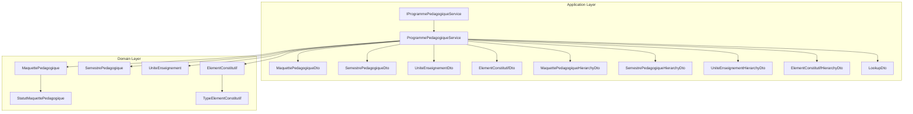

**Diagram sources**
- [IProgrammePedagogiqueService.cs:6-64](file://RIIS.Academic.Application/Programmes/Services/IProgrammePedagogiqueService.cs#L6-L64)
- [ProgrammePedagogiqueService.cs:8-17](file://RIIS.Academic.Application/Programmes/Services/ProgrammePedagogiqueService.cs#L8-L17)
- [MaquettePedagogiqueDto.cs:5-19](file://RIIS.Academic.Application/Programmes/Dtos/MaquettePedagogiqueDto.cs#L5-L19)
- [SemestrePedagogiqueDto.cs:3-16](file://RIIS.Academic.Application/Programmes/Dtos/SemestrePedagogiqueDto.cs#L3-L16)
- [UniteEnseignementDto.cs:3-15](file://RIIS.Academic.Application/Programmes/Dtos/UniteEnseignementDto.cs#L3-L15)
- [ElementConstitutifDto.cs:5-19](file://RIIS.Academic.Application/Programmes/Dtos/ElementConstitutifDto.cs#L5-L19)
- [MaquettePedagogiqueHierarchyDto.cs:5-18](file://RIIS.Academic.Application/Programmes/Dtos/MaquettePedagogiqueHierarchyDto.cs#L5-L18)
- [SemestrePedagogiqueHierarchyDto.cs:3-13](file://RIIS.Academic.Application/Programmes/Dtos/SemestrePedagogiqueHierarchyDto.cs#L3-L13)
- [UniteEnseignementHierarchyDto.cs:3-15](file://RIIS.Academic.Application/Programmes/Dtos/UniteEnseignementHierarchyDto.cs#L3-L15)
- [ElementConstitutifHierarchyDto.cs:5-17](file://RIIS.Academic.Application/Programmes/Dtos/ElementConstitutifHierarchyDto.cs#L5-L17)
- [LookupDto.cs:3-7](file://RIIS.Academic.Application/Common/Dtos/LookupDto.cs#L3-L7)
- [MaquettePedagogique.cs:5-30](file://RIIS.Academic.Domain/Programmes/MaquettePedagogique.cs#L5-L30)
- [SemestrePedagogique.cs:3-19](file://RIIS.Academic.Domain/Programmes/SemestrePedagogique.cs#L3-L19)
- [UniteEnseignement.cs:3-17](file://RIIS.Academic.Domain/Programmes/UniteEnseignement.cs#L3-L17)
- [ElementConstitutif.cs:3-20](file://RIIS.Academic.Domain/Programmes/ElementConstitutif.cs#L3-L20)
- [StatutMaquettePedagogique.cs:3-8](file://RIIS.Academic.Domain/Enums/StatutMaquettePedagogique.cs#L3-L8)
- [TypeElementConstitutif.cs:3-10](file://RIIS.Academic.Domain/Enums/TypeElementConstitutif.cs#L3-L10)

**Section sources**
- [IProgrammePedagogiqueService.cs:6-64](file://RIIS.Academic.Application/Programmes/Services/IProgrammePedagogiqueService.cs#L6-L64)
- [ProgrammePedagogiqueService.cs:8-17](file://RIIS.Academic.Application/Programmes/Services/ProgrammePedagogiqueService.cs#L8-L17)

## Core Components
- IProgrammePedagogiqueService: Defines operations to list, create, update, delete, and query hierarchies for programs, semesters, courses, and constituent elements; provides lookups for academic years, cycles, pathways, and related entities.
- ProgrammePedagogiqueService: Implements the interface, applying validation, uniqueness constraints, default value generation, and mapping between domain entities and DTOs/hierarchies.

Key responsibilities:
- Program (Maquette) lifecycle: create defaults, validate codes/versions/dates, ensure uniqueness per pathway, persist changes.
- Semester lifecycle: assign to a program, validate numbering and targets, ensure uniqueness per program.
- Course (UE) lifecycle: assign to a semester, validate credits/volume hours, enforce code uniqueness within semester.
- Constituent element (EC) lifecycle: assign to a course, validate credits/coefficient/volume hours, enforce code and order uniqueness within course.
- Hierarchical queries: build nested DTOs representing program → semester → course → constituent elements.
- Lookups: provide filtered lists for UI dropdowns and filters.

**Section sources**
- [IProgrammePedagogiqueService.cs:6-64](file://RIIS.Academic.Application/Programmes/Services/IProgrammePedagogiqueService.cs#L6-L64)
- [ProgrammePedagogiqueService.cs:19-232](file://RIIS.Academic.Application/Programmes/Services/ProgrammePedagogiqueService.cs#L19-L232)
- [ProgrammePedagogiqueService.cs:234-718](file://RIIS.Academic.Application/Programmes/Services/ProgrammePedagogiqueService.cs#L234-L718)
- [ProgrammePedagogiqueService.cs:720-779](file://RIIS.Academic.Application/Programmes/Services/ProgrammePedagogiqueService.cs#L720-L779)

## Architecture Overview
The service layer sits between application consumers (API/Web) and persistence via generic repositories. It enforces business rules and transforms data into DTOs or hierarchy DTOs for consumption by UI components.

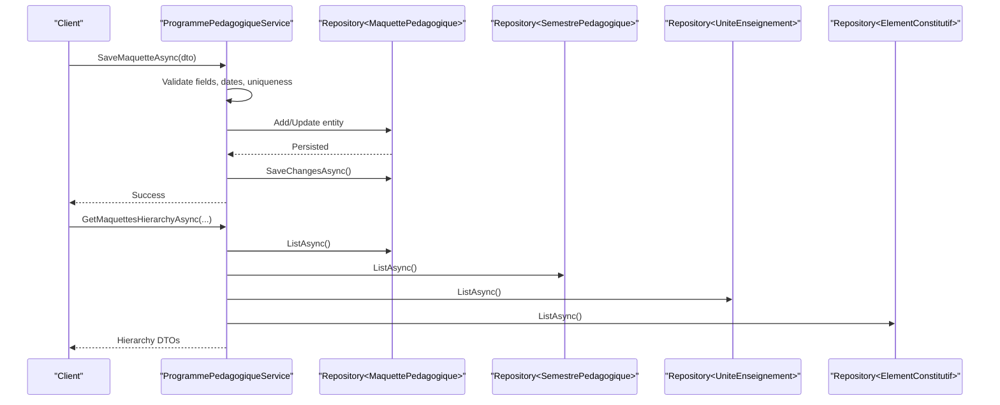

**Diagram sources**
- [ProgrammePedagogiqueService.cs:151-226](file://RIIS.Academic.Application/Programmes/Services/ProgrammePedagogiqueService.cs#L151-L226)
- [ProgrammePedagogiqueService.cs:33-130](file://RIIS.Academic.Application/Programmes/Services/ProgrammePedagogiqueService.cs#L33-L130)

## Detailed Component Analysis

### Interface: IProgrammePedagogiqueService
- Program operations: list, get by id, create default, save, delete; supports filtering by academic year, cycle, pathway, and specific program.
- Semester operations: list, get by id, create default, save, delete; optional filter by program.
- Course (UE) operations: list, get by id, create default, save, delete; supports hierarchical listing by academic context and semester.
- Constituent element (EC) operations: list, get by id, create default, save, delete; optional filter by course.
- Lookups: academic years, training cycles, academic pathways, programs, study levels, semesters, courses.

**Section sources**
- [IProgrammePedagogiqueService.cs:6-64](file://RIIS.Academic.Application/Programmes/Services/IProgrammePedagogiqueService.cs#L6-L64)

### Implementation: ProgrammePedagogiqueService
- Validation and normalization:
  - Required fields enforced for each entity type.
  - Date range validation for program validity period.
  - Code normalization and case handling where applicable.
  - Uniqueness checks at appropriate scopes (program per pathway/code/version; semester number per program; UE code per semester; EC code and display order per UE).
- Defaults:
  - Program: default version and draft status.
  - Semester: next sequential number, default labels and target credits/hours.
  - UE: next display order, default mandatory flag.
  - EC: next display order, default type and coefficient.
- Persistence:
  - Create vs Update branching based on Id.
  - Save changes after each operation.
- Hierarchical queries:
  - Build nested DTOs from flat repository results, ordering by display order and semantic keys.
  - Filter by academic context using helper methods.
- Lookups:
  - Provide active and ordered lists for UI selection.

**Section sources**
- [ProgrammePedagogiqueService.cs:143-232](file://RIIS.Academic.Application/Programmes/Services/ProgrammePedagogiqueService.cs#L143-L232)
- [ProgrammePedagogiqueService.cs:269-358](file://RIIS.Academic.Application/Programmes/Services/ProgrammePedagogiqueService.cs#L269-L358)
- [ProgrammePedagogiqueService.cs:499-580](file://RIIS.Academic.Application/Programmes/Services/ProgrammePedagogiqueService.cs#L499-L580)
- [ProgrammePedagogiqueService.cs:613-718](file://RIIS.Academic.Application/Programmes/Services/ProgrammePedagogiqueService.cs#L613-L718)
- [ProgrammePedagogiqueService.cs:33-130](file://RIIS.Academic.Application/Programmes/Services/ProgrammePedagogiqueService.cs#L33-L130)
- [ProgrammePedagogiqueService.cs:418-486](file://RIIS.Academic.Application/Programmes/Services/ProgrammePedagogiqueService.cs#L418-L486)
- [ProgrammePedagogiqueService.cs:720-779](file://RIIS.Academic.Application/Programmes/Services/ProgrammePedagogiqueService.cs#L720-L779)

### Data Models and DTOs

#### Program (Maquette Pedagogique)
- Domain entity includes identifiers for cycle, study level, department, specialization, plus code, label, version, status, validity dates, source document, observation, and navigation properties including semesters.
- DTO adds pathway label and semester count for presentation.
- Hierarchy DTO nests semesters for tree views.

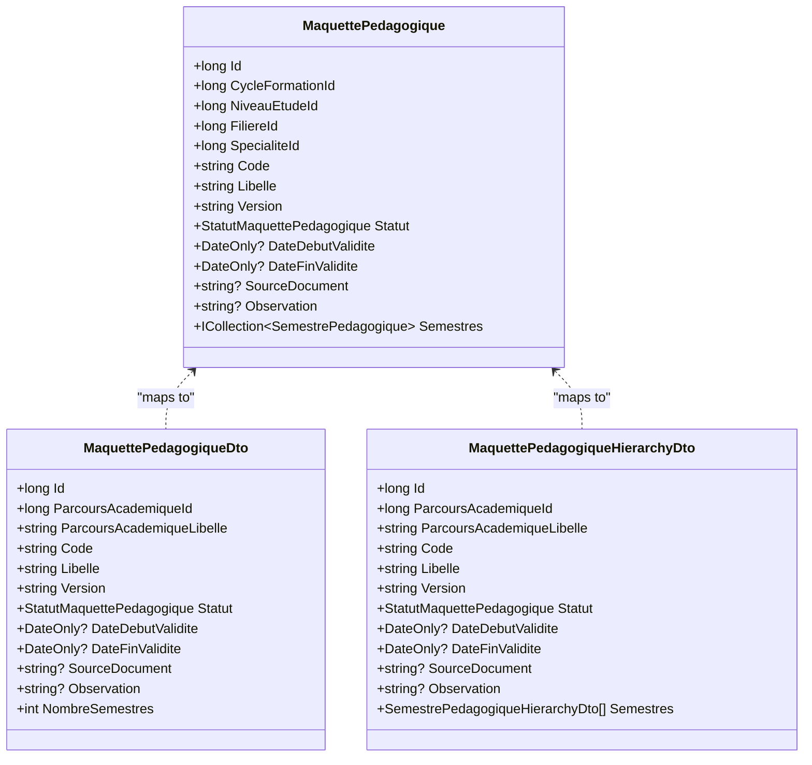

**Diagram sources**
- [MaquettePedagogique.cs:5-30](file://RIIS.Academic.Domain/Programmes/MaquettePedagogique.cs#L5-L30)
- [MaquettePedagogiqueDto.cs:5-19](file://RIIS.Academic.Application/Programmes/Dtos/MaquettePedagogiqueDto.cs#L5-L19)
- [MaquettePedagogiqueHierarchyDto.cs:5-18](file://RIIS.Academic.Application/Programmes/Dtos/MaquettePedagogiqueHierarchyDto.cs#L5-L18)

**Section sources**
- [MaquettePedagogique.cs:5-30](file://RIIS.Academic.Domain/Programmes/MaquettePedagogique.cs#L5-L30)
- [MaquettePedagogiqueDto.cs:5-19](file://RIIS.Academic.Application/Programmes/Dtos/MaquettePedagogiqueDto.cs#L5-L19)
- [MaquettePedagogiqueHierarchyDto.cs:5-18](file://RIIS.Academic.Application/Programmes/Dtos/MaquettePedagogiqueHierarchyDto.cs#L5-L18)

#### Semester (Semestre Pedagogique)
- Domain entity links to program and optionally study level; stores number, label, expected credits and volume hours, display order; navigates to courses and results.
- DTO includes program label, study level label, counts for UI.
- Hierarchy DTO nests courses.

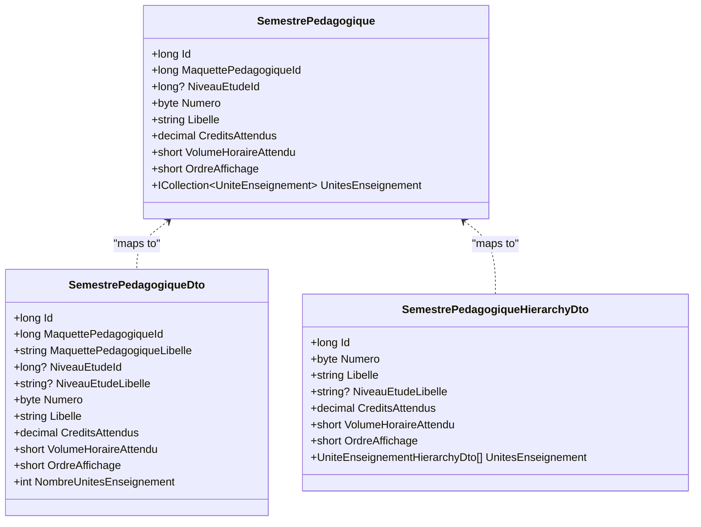

**Diagram sources**
- [SemestrePedagogique.cs:3-19](file://RIIS.Academic.Domain/Programmes/SemestrePedagogique.cs#L3-L19)
- [SemestrePedagogiqueDto.cs:3-16](file://RIIS.Academic.Application/Programmes/Dtos/SemestrePedagogiqueDto.cs#L3-L16)
- [SemestrePedagogiqueHierarchyDto.cs:3-13](file://RIIS.Academic.Application/Programmes/Dtos/SemestrePedagogiqueHierarchyDto.cs#L3-L13)

**Section sources**
- [SemestrePedagogique.cs:3-19](file://RIIS.Academic.Domain/Programmes/SemestrePedagogique.cs#L3-L19)
- [SemestrePedagogiqueDto.cs:3-16](file://RIIS.Academic.Application/Programmes/Dtos/SemestrePedagogiqueDto.cs#L3-L16)
- [SemestrePedagogiqueHierarchyDto.cs:3-13](file://RIIS.Academic.Application/Programmes/Dtos/SemestrePedagogiqueHierarchyDto.cs#L3-L13)

#### Course Unit (Unite Enseignement)
- Domain entity belongs to a semester; stores code, label, credits, volume hours, display order, mandatory flag; navigates to constituent elements and results.
- DTO includes semester label and constituent element count.
- Hierarchy DTO nests constituent elements.

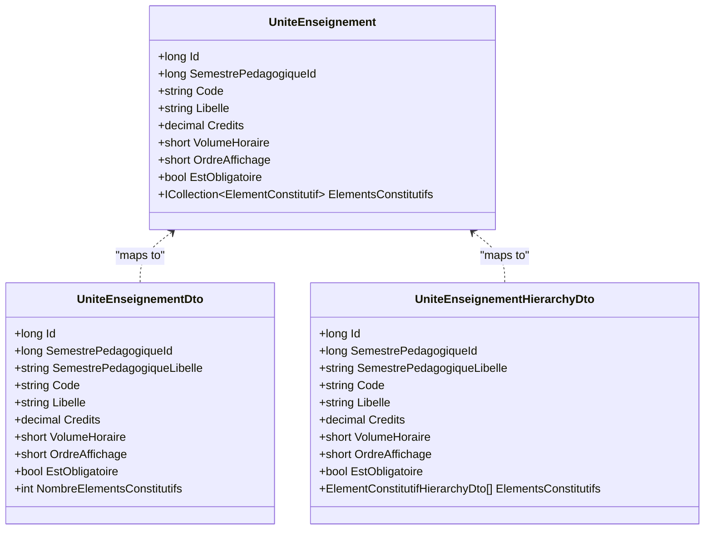

**Diagram sources**
- [UniteEnseignement.cs:3-17](file://RIIS.Academic.Domain/Programmes/UniteEnseignement.cs#L3-L17)
- [UniteEnseignementDto.cs:3-15](file://RIIS.Academic.Application/Programmes/Dtos/UniteEnseignementDto.cs#L3-L15)
- [UniteEnseignementHierarchyDto.cs:3-15](file://RIIS.Academic.Application/Programmes/Dtos/UniteEnseignementHierarchyDto.cs#L3-L15)

**Section sources**
- [UniteEnseignement.cs:3-17](file://RIIS.Academic.Domain/Programmes/UniteEnseignement.cs#L3-L17)
- [UniteEnseignementDto.cs:3-15](file://RIIS.Academic.Application/Programmes/Dtos/UniteEnseignementDto.cs#L3-L15)
- [UniteEnseignementHierarchyDto.cs:3-15](file://RIIS.Academic.Application/Programmes/Dtos/UniteEnseignementHierarchyDto.cs#L3-L15)

#### Constituent Element (Element Constitutif)
- Domain entity belongs to a course; stores optional code, label, type, credits, coefficient, volume hours, display order, mandatory flag, observation; navigates to evaluations and results.
- DTO includes course label and detailed attributes.
- Hierarchy DTO mirrors attributes for tree rendering.

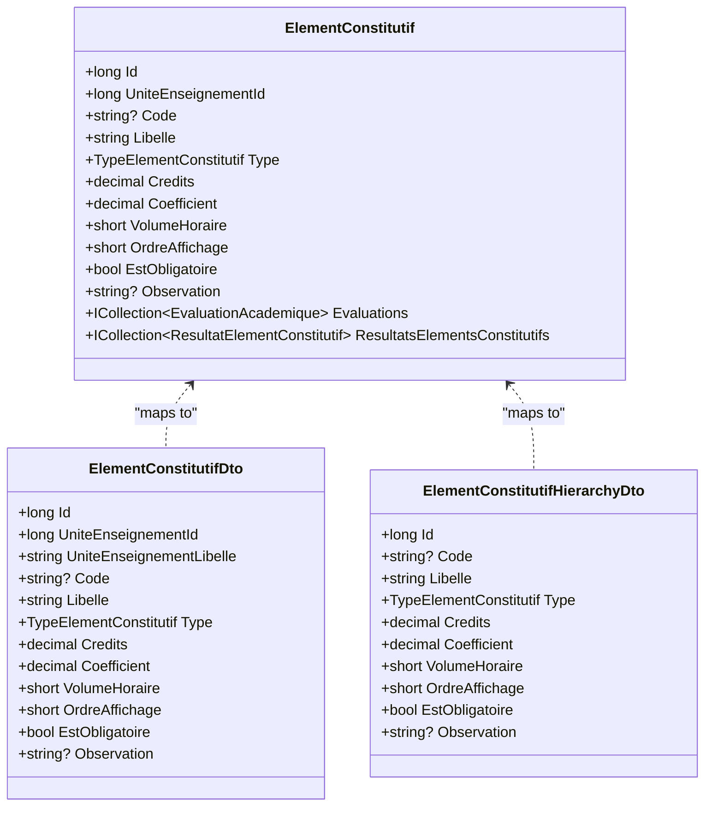

**Diagram sources**
- [ElementConstitutif.cs:3-20](file://RIIS.Academic.Domain/Programmes/ElementConstitutif.cs#L3-L20)
- [ElementConstitutifDto.cs:5-19](file://RIIS.Academic.Application/Programmes/Dtos/ElementConstitutifDto.cs#L5-L19)
- [ElementConstitutifHierarchyDto.cs:5-17](file://RIIS.Academic.Application/Programmes/Dtos/ElementConstitutifHierarchyDto.cs#L5-L17)

**Section sources**
- [ElementConstitutif.cs:3-20](file://RIIS.Academic.Domain/Programmes/ElementConstitutif.cs#L3-L20)
- [ElementConstitutifDto.cs:5-19](file://RIIS.Academic.Application/Programmes/Dtos/ElementConstitutifDto.cs#L5-L19)
- [ElementConstitutifHierarchyDto.cs:5-17](file://RIIS.Academic.Application/Programmes/Dtos/ElementConstitutifHierarchyDto.cs#L5-L17)

### Hierarchical Relationship Management
- Program contains multiple semesters.
- Each semester contains multiple course units.
- Each course unit contains multiple constituent elements.
- Hierarchical DTOs reflect this nesting for efficient UI rendering and reporting.

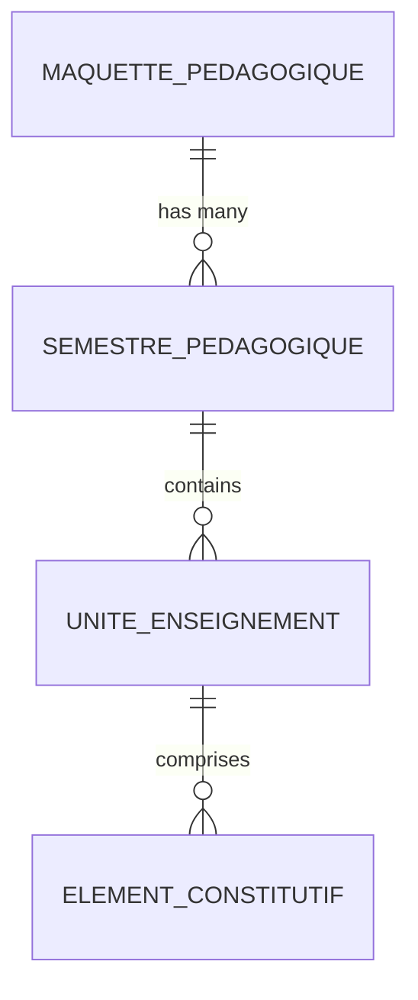

**Diagram sources**
- [MaquettePedagogique.cs:24-29](file://RIIS.Academic.Domain/Programmes/MaquettePedagogique.cs#L24-L29)
- [SemestrePedagogique.cs:14-17](file://RIIS.Academic.Domain/Programmes/SemestrePedagogique.cs#L14-L17)
- [UniteEnseignement.cs:14-16](file://RIIS.Academic.Domain/Programmes/UniteEnseignement.cs#L14-L16)
- [ElementConstitutif.cs:17-19](file://RIIS.Academic.Domain/Programmes/ElementConstitutif.cs#L17-L19)

### Examples

#### Creating a Program Structure
- Use CreateDefaultMaquette to initialize a draft program linked to an academic pathway.
- Populate code, label, version, validity dates, and optional metadata.
- SaveMaquetteAsync validates required fields, ensures no duplicate code+version for the same pathway, and persists the program.

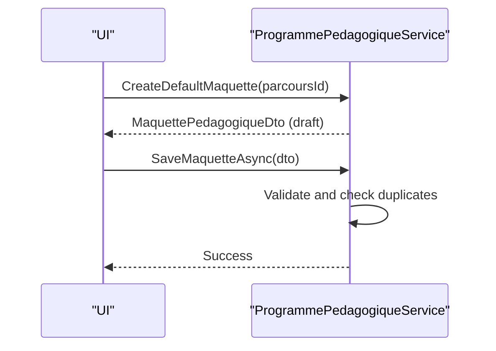

**Diagram sources**
- [ProgrammePedagogiqueService.cs:143-149](file://RIIS.Academic.Application/Programmes/Services/ProgrammePedagogiqueService.cs#L143-L149)
- [ProgrammePedagogiqueService.cs:151-226](file://RIIS.Academic.Application/Programmes/Services/ProgrammePedagogiqueService.cs#L151-L226)

**Section sources**
- [ProgrammePedagogiqueService.cs:143-226](file://RIIS.Academic.Application/Programmes/Services/ProgrammePedagogiqueService.cs#L143-L226)

#### Scheduling Semesters
- Use CreateDefaultSemestreAsync to generate a new semester with next sequential number and default targets.
- Assign to a program, set label, credits, and volume hours.
- SaveSemestreAsync validates number range, non-negative targets, and uniqueness of semester number within the program.

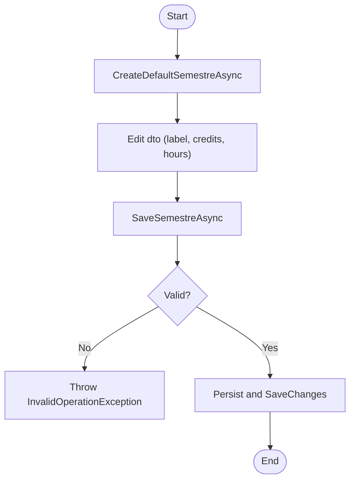

**Diagram sources**
- [ProgrammePedagogiqueService.cs:269-288](file://RIIS.Academic.Application/Programmes/Services/ProgrammePedagogiqueService.cs#L269-L288)
- [ProgrammePedagogiqueService.cs:290-352](file://RIIS.Academic.Application/Programmes/Services/ProgrammePedagogiqueService.cs#L290-L352)

**Section sources**
- [ProgrammePedagogiqueService.cs:269-352](file://RIIS.Academic.Application/Programmes/Services/ProgrammePedagogiqueService.cs#L269-L352)

#### Managing Course Dependencies
- Courses are organized within semesters; constituent elements define evaluation types and weights.
- While explicit prerequisite edges are not modeled here, dependency logic can be enforced by validating that referenced courses exist and by ensuring consistent credit accumulation per semester and program.
- Use GetUnitesEnseignementByHierarchyAsync to retrieve courses filtered by academic context and semester.

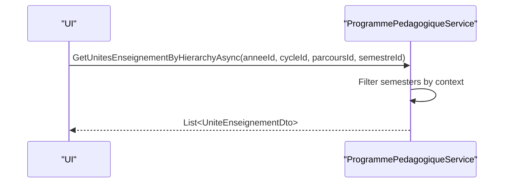

**Diagram sources**
- [ProgrammePedagogiqueService.cs:382-416](file://RIIS.Academic.Application/Programmes/Services/ProgrammePedagogiqueService.cs#L382-L416)

**Section sources**
- [ProgrammePedagogiqueService.cs:382-416](file://RIIS.Academic.Application/Programmes/Services/ProgrammePedagogiqueService.cs#L382-L416)

### Prerequisite Validation
- No explicit prerequisite references are defined in the analyzed files. Dependency enforcement is achieved through:
  - Referential integrity via foreign keys (semester belongs to program, course belongs to semester, element belongs to course).
  - Validation that referenced IDs exist before saving.
  - Uniqueness constraints to prevent ambiguous definitions.

**Section sources**
- [ProgrammePedagogiqueService.cs:151-226](file://RIIS.Academic.Application/Programmes/Services/ProgrammePedagogiqueService.cs#L151-L226)
- [ProgrammePedagogiqueService.cs:290-352](file://RIIS.Academic.Application/Programmes/Services/ProgrammePedagogiqueService.cs#L290-L352)
- [ProgrammePedagogiqueService.cs:518-574](file://RIIS.Academic.Application/Programmes/Services/ProgrammePedagogiqueService.cs#L518-L574)
- [ProgrammePedagogiqueService.cs:634-712](file://RIIS.Academic.Application/Programmes/Services/ProgrammePedagogiqueService.cs#L634-L712)

### Credit Calculations
- Semester-level targets: CreditsAttendus and VolumeHoraireAttendu represent expected totals per semester.
- Course-level credits: Credits per course unit contribute toward semester totals.
- Constituent-level contributions: Credits and Coefficient per element influence weighted scoring and aggregation downstream.
- Aggregation is typically performed when computing results; the service layer ensures valid inputs for such calculations.

**Section sources**
- [SemestrePedagogique.cs:10-11](file://RIIS.Academic.Domain/Programmes/SemestrePedagogique.cs#L10-L11)
- [UniteEnseignement.cs:9-10](file://RIIS.Academic.Domain/Programmes/UniteEnseignement.cs#L9-L10)
- [ElementConstitutif.cs:10-12](file://RIIS.Academic.Domain/Programmes/ElementConstitutif.cs#L10-L12)

### Academic Calendar Coordination
- Program validity window: DateDebutValidite and DateFinValidide constrain effective periods.
- Filtering by academic year: Lookups and hierarchy queries support narrowing by Annee AcademiqueId to align with calendar terms.
- Semester numbering and display order: Ensure predictable sequencing within a program’s academic plan.

**Section sources**
- [MaquettePedagogique.cs:18-19](file://RIIS.Academic.Domain/Programmes/MaquettePedagogique.cs#L18-L19)
- [ProgrammePedagogiqueService.cs:720-779](file://RIIS.Academic.Application/Programmes/Services/ProgrammePedagogiqueService.cs#L720-L779)
- [ProgrammePedagogiqueService.cs:33-130](file://RIIS.Academic.Application/Programmes/Services/ProgrammePedagogiqueService.cs#L33-L130)

## Dependency Analysis
- Service depends on generic repositories for all program-related entities and reference data (academic years, cycles, pathways, classes, study levels).
- DTOs depend on domain enums for status and element types.
- Hierarchical DTOs compose multiple layers to reduce client-side joins.

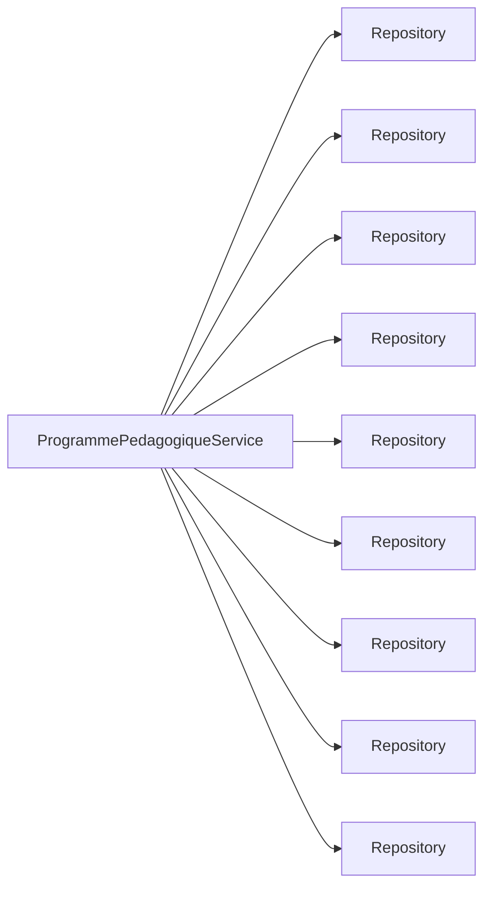

**Diagram sources**
- [ProgrammePedagogiqueService.cs:8-17](file://RIIS.Academic.Application/Programmes/Services/ProgrammePedagogiqueService.cs#L8-L17)

**Section sources**
- [ProgrammePedagogiqueService.cs:8-17](file://RIIS.Academic.Application/Programmes/Services/ProgrammePedagogiqueService.cs#L8-L17)

## Performance Considerations
- Batch loading: The service loads entire sets from repositories and filters in memory; consider pagination or server-side filtering for large datasets.
- Ordering: Consistent ordering by display order and semantic keys improves UI performance and reduces client sorting overhead.
- Duplicate checks: In-memory scans for uniqueness may scale poorly; consider database-level unique constraints or indexed queries.
- Hierarchy building: Nested DTO construction is efficient but can be optimized by pre-indexing collections by foreign keys.

[No sources needed since this section provides general guidance]

## Troubleshooting Guide
Common errors and their causes:
- Missing required fields: Thrown when essential properties like code, label, or parent IDs are absent.
- Invalid date ranges: Thrown when end date precedes start date.
- Duplicate entries: Thrown when uniqueness constraints are violated (e.g., same code+version for a pathway, same semester number within a program, same UE code within a semester, same EC code or order within a course).
- Negative values: Thrown for negative credits, coefficients, or volume hours.

Resolution steps:
- Ensure all required fields are provided and correctly formatted.
- Verify date ranges and numeric constraints.
- Check for existing records with conflicting codes or numbers.
- Confirm referential integrity (valid parent IDs).

**Section sources**
- [ProgrammePedagogiqueService.cs:151-226](file://RIIS.Academic.Application/Programmes/Services/ProgrammePedagogiqueService.cs#L151-L226)
- [ProgrammePedagogiqueService.cs:290-352](file://RIIS.Academic.Application/Programmes/Services/ProgrammePedagogiqueService.cs#L290-L352)
- [ProgrammePedagogiqueService.cs:518-574](file://RIIS.Academic.Application/Programmes/Services/ProgrammePedagogiqueService.cs#L518-L574)
- [ProgrammePedagogiqueService.cs:634-712](file://RIIS.Academic.Application/Programmes/Services/ProgrammePedagogiqueService.cs#L634-L712)

## Conclusion
The Academic Program service layer provides a robust foundation for managing program hierarchies, enforcing business rules, and exposing rich hierarchical data to clients. Through clear interfaces, well-defined DTOs, and disciplined validation, it supports program creation, semester scheduling, course organization, and constituent element management while coordinating with academic calendars and enabling reliable credit accounting.

[No sources needed since this section summarizes without analyzing specific files]