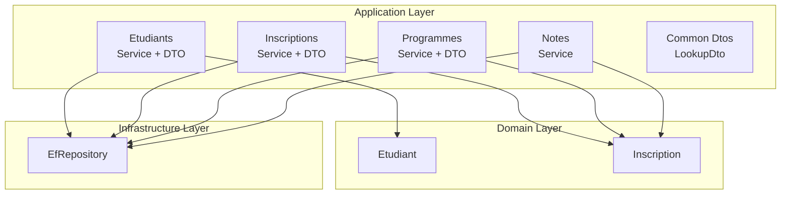
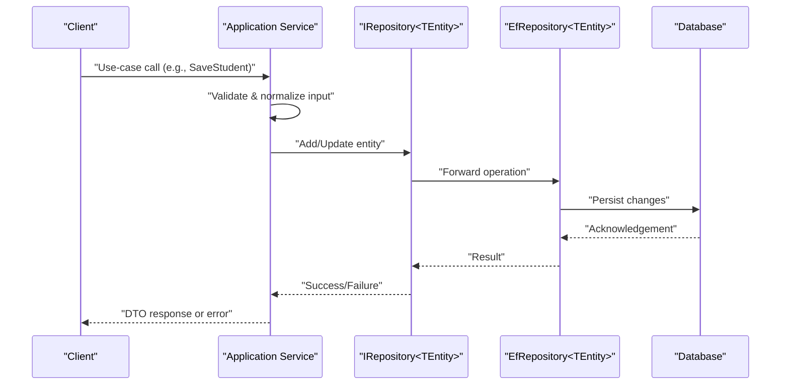
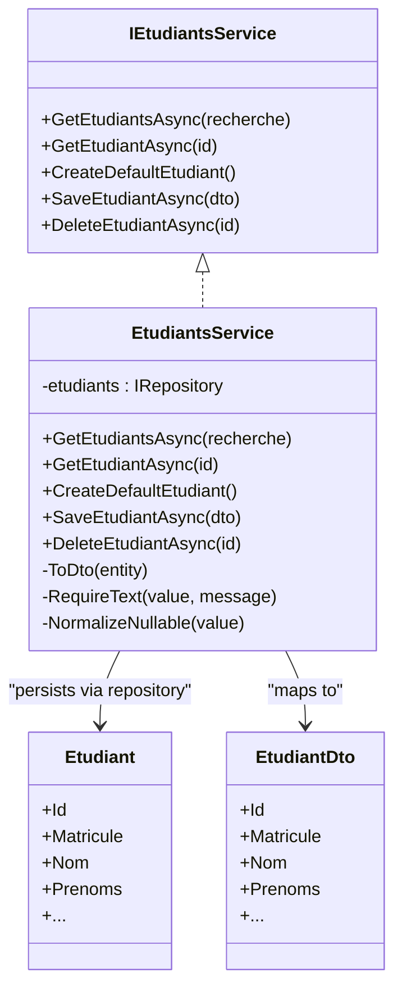
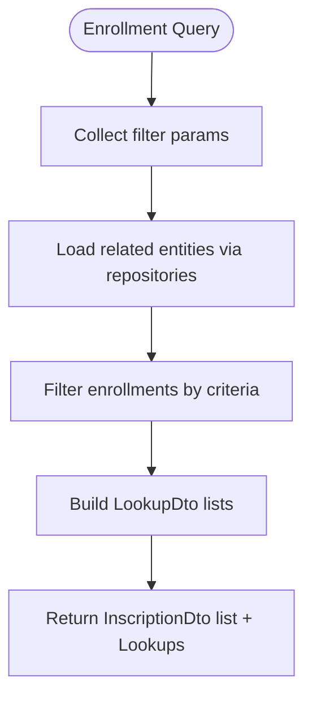
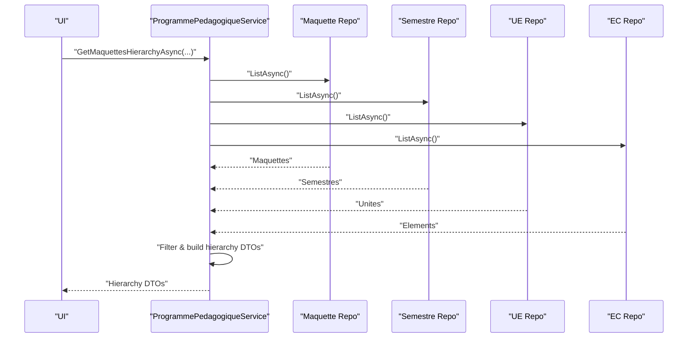
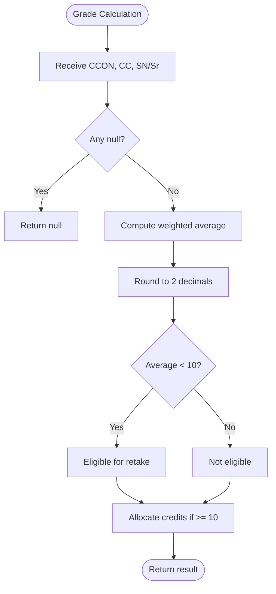
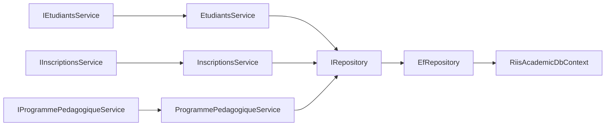

# Application Layer

<cite>
**Referenced Files in This Document**
- [IRepository.cs](file://RIIS.Academic.Application/Abstractions/Persistence/IRepository.cs)
- [EfRepository.cs](file://RIIS.Academic.Infrastructure/Persistence/Repositories/EfRepository.cs)
- [IEtudiantsService.cs](file://RIIS.Academic.Application/Etudiants/Services/IEtudiantsService.cs)
- [EtudiantsService.cs](file://RIIS.Academic.Application/Etudiants/Services/EtudiantsService.cs)
- [EtudiantDto.cs](file://RIIS.Academic.Application/Etudiants/Dtos/EtudiantDto.cs)
- [IInscriptionsService.cs](file://RIIS.Academic.Application/Inscriptions/Services/IInscriptionsService.cs)
- [LookupDto.cs](file://RIIS.Academic.Application/Common/Dtos/LookupDto.cs)
- [IProgrammePedagogiqueService.cs](file://RIIS.Academic.Application/Programmes/Services/IProgrammePedagogiqueService.cs)
- [ProgrammePedagogiqueService.cs](file://RIIS.Academic.Application/Programmes/Services/ProgrammePedagogiqueService.cs)
- [ICalculNotesService.cs](file://RIIS.Academic.Application/Abstractions/Services/ICalculNotesService.cs)
- [CalculNotesService.cs](file://RIIS.Academic.Application/Notes/Services/CalculNotesService.cs)
- [Etudiant.cs](file://RIIS.Academic.Domain/Etudiants/Etudiant.cs)
- [Inscription.cs](file://RIIS.Academic.Domain/Inscriptions/Inscription.cs)
</cite>

## Table of Contents
1. Introduction
2. Project Structure
3. Core Components
4. Architecture Overview
5. Detailed Component Analysis
6. Dependency Analysis
7. Performance Considerations
8. Troubleshooting Guide
9. Conclusion

## Introduction
This document explains the Application Layer’s service orchestration and use case implementation for an academic management system. It focuses on:
- The Service Layer pattern with interfaces such as IEtudiantsService, IInscriptionsService, and IProgrammePedagogiqueService
- DTO usage for cross-layer data transfer and mapping strategies between domain entities and application contracts
- Repository abstraction via IRepository to decouple data access from business logic
- Application-level business logic, workflow orchestration, and coordination between domain entities and infrastructure
- Typical use cases: student enrollment processing, grade calculation workflows, and program management operations

## Project Structure
The Application Layer is organized by bounded contexts (e.g., Etudiants, Inscriptions, Programmes, Notes). Each context exposes:
- A service interface defining use-case operations
- A service implementation orchestrating domain entities and repository calls
- DTOs that represent request/response payloads and lookup lists

**Diagram sources**
- [IEtudiantsService.cs:1-13](file://RIIS.Academic.Application/Etudiants/Services/IEtudiantsService.cs#L1-L13)
- [IInscriptionsService.cs:1-32](file://RIIS.Academic.Application/Inscriptions/Services/IInscriptionsService.cs#L1-L32)
- [IProgrammePedagogiqueService.cs:1-65](file://RIIS.Academic.Application/Programmes/Services/IProgrammePedagogiqueService.cs#L1-L65)
- [CalculNotesService.cs:1-25](file://RIIS.Academic.Application/Notes/Services/CalculNotesService.cs#L1-L25)
- [Etudiant.cs:1-28](file://RIIS.Academic.Domain/Etudiants/Etudiant.cs#L1-L28)
- [Inscription.cs:1-37](file://RIIS.Academic.Domain/Inscriptions/Inscription.cs#L1-L37)
- [EfRepository.cs:1-34](file://RIIS.Academic.Infrastructure/Persistence/Repositories/EfRepository.cs#L1-L34)

**Section sources**
- [IEtudiantsService.cs:1-13](file://RIIS.Academic.Application/Etudiants/Services/IEtudiantsService.cs#L1-L13)
- [IInscriptionsService.cs:1-32](file://RIIS.Academic.Application/Inscriptions/Services/IInscriptionsService.cs#L1-L32)
- [IProgrammePedagogiqueService.cs:1-65](file://RIIS.Academic.Application/Programmes/Services/IProgrammePedagogiqueService.cs#L1-L65)
- [LookupDto.cs:1-8](file://RIIS.Academic.Application/Common/Dtos/LookupDto.cs#L1-L8)

## Core Components
- IRepository<TEntity>: Generic persistence abstraction providing ListAsync, GetByIdAsync, AddAsync, Delete/DeleteByIdAsync, SaveChangesAsync.
- EfRepository<TEntity>: Concrete implementation using Entity Framework Core with AsNoTracking for reads and transactional writes via SaveChangesAsync.
- IEtudiantsService / EtudiantsService: Student CRUD and search; maps Etudiant domain entity to/from EtudiantDto; enforces validation and uniqueness constraints.
- IInscriptionsService: Enrollment queries, lookups, and lifecycle operations; coordinates multiple domain aggregates through repositories.
- IProgrammePedagogiqueService / ProgrammePedagogiqueService: Manages pedagogical programs (maquettes), semesters, teaching units, and constituent elements; builds hierarchy DTOs and performs complex filtering and duplicate checks.
- CalculNotesService: Grade calculation utilities (weighted averages, eligibility for retakes, credit allocation).

Key responsibilities:
- Orchestrate domain operations without leaking infrastructure details
- Validate inputs and enforce business rules at the application boundary
- Map between DTOs and domain entities
- Coordinate multi-entity workflows (e.g., enrollment, grading, program configuration)

**Section sources**
- [IRepository.cs:1-13](file://RIIS.Academic.Application/Abstractions/Persistence/IRepository.cs#L1-L13)
- [EfRepository.cs:1-34](file://RIIS.Academic.Infrastructure/Persistence/Repositories/EfRepository.cs#L1-L34)
- [IEtudiantsService.cs:1-13](file://RIIS.Academic.Application/Etudiants/Services/IEtudiantsService.cs#L1-L13)
- [EtudiantsService.cs:1-173](file://RIIS.Academic.Application/Etudiants/Services/EtudiantsService.cs#L1-L173)
- [IInscriptionsService.cs:1-32](file://RIIS.Academic.Application/Inscriptions/Services/IInscriptionsService.cs#L1-L32)
- [IProgrammePedagogiqueService.cs:1-65](file://RIIS.Academic.Application/Programmes/Services/IProgrammePedagogiqueService.cs#L1-L65)
- [ProgrammePedagogiqueService.cs:1-800](file://RIIS.Academic.Application/Programmes/Services/ProgrammePedagogiqueService.cs#L1-L800)
- [CalculNotesService.cs:1-25](file://RIIS.Academic.Application/Notes/Services/CalculNotesService.cs#L1-L25)

## Architecture Overview
The Application Layer sits between presentation/API and Domain/Infrastructure. Services define use-case boundaries and coordinate:
- Input validation and normalization
- Data retrieval and transformation via repositories
- Business rule enforcement and workflow orchestration
- Mapping to DTOs for stable contracts across layers

**Diagram sources**
- [EtudiantsService.cs:53-127](file://RIIS.Academic.Application/Etudiants/Services/EtudiantsService.cs#L53-L127)
- [EfRepository.cs:17-32](file://RIIS.Academic.Infrastructure/Persistence/Repositories/EfRepository.cs#L17-L32)

## Detailed Component Analysis

### Student Management (Etudiants)
- Interface: IEtudiantsService defines list, get, create default, save, delete operations.
- Implementation: EtudiantsService
  - Reads all students via repository, applies optional text search across key fields, sorts, and maps to EtudiantDto.
  - Save flow validates required fields, normalizes nullable strings, enforces unique matricule, creates or updates Etudiant entity, and persists changes.
  - Delete removes by id and persists.
- DTO: EtudiantDto represents the client-facing shape with computed properties (e.g., NomComplet).

**Diagram sources**
- [IEtudiantsService.cs:1-13](file://RIIS.Academic.Application/Etudiants/Services/IEtudiantsService.cs#L1-L13)
- [EtudiantsService.cs:1-173](file://RIIS.Academic.Application/Etudiants/Services/EtudiantsService.cs#L1-L173)
- [Etudiant.cs:1-28](file://RIIS.Academic.Domain/Etudiants/Etudiant.cs#L1-L28)
- [EtudiantDto.cs:1-26](file://RIIS.Academic.Application/Etudiants/Dtos/EtudiantDto.cs#L1-L26)

**Section sources**
- [IEtudiantsService.cs:1-13](file://RIIS.Academic.Application/Etudiants/Services/IEtudiantsService.cs#L1-L13)
- [EtudiantsService.cs:1-173](file://RIIS.Academic.Application/Etudiants/Services/EtudiantsService.cs#L1-L173)
- [EtudiantDto.cs:1-26](file://RIIS.Academic.Application/Etudiants/Dtos/EtudiantDto.cs#L1-L26)

### Enrollment Processing (Inscriptions)
- Interface: IInscriptionsService provides filtered listing, single item retrieval, defaults, save/delete, and multiple lookup endpoints (academic year, student, cycle, level, class, pedagogical blueprint).
- Use case highlights:
  - Filtering enrollments by academic year, cycle, level, and class
  - Populating dropdowns and filters via LookupDto collections
  - Coordinating multiple domain aggregates through repositories

**Diagram sources**
- [IInscriptionsService.cs:1-32](file://RIIS.Academic.Application/Inscriptions/Services/IInscriptionsService.cs#L1-L32)
- [LookupDto.cs:1-8](file://RIIS.Academic.Application/Common/Dtos/LookupDto.cs#L1-L8)

**Section sources**
- [IInscriptionsService.cs:1-32](file://RIIS.Academic.Application/Inscriptions/Services/IInscriptionsService.cs#L1-L32)
- [LookupDto.cs:1-8](file://RIIS.Academic.Application/Common/Dtos/LookupDto.cs#L1-L8)

### Program Management (Programmes)
- Interface: IProgrammePedagogiqueService manages MaquettePedagogique, SemestrePedagogique, UniteEnseignement, ElementConstitutif, plus extensive lookups and hierarchy builders.
- Implementation: ProgrammePedagogiqueService
  - Builds hierarchical DTOs aggregating semesters, units, and constituent elements
  - Enforces uniqueness (e.g., maquette code+version per pathway, semester number per maquette, unit code per semester, EC code/order per unit)
  - Validates date ranges, positive numeric fields, and required references
  - Provides filtered lists and lookups for UI-driven navigation

**Diagram sources**
- [IProgrammePedagogiqueService.cs:1-65](file://RIIS.Academic.Application/Programmes/Services/IProgrammePedagogiqueService.cs#L1-L65)
- [ProgrammePedagogiqueService.cs:1-800](file://RIIS.Academic.Application/Programmes/Services/ProgrammePedagogiqueService.cs#L1-L800)

**Section sources**
- [IProgrammePedagogiqueService.cs:1-65](file://RIIS.Academic.Application/Programmes/Services/IProgrammePedagogiqueService.cs#L1-L65)
- [ProgrammePedagogiqueService.cs:1-800](file://RIIS.Academic.Application/Programmes/Services/ProgrammePedagogiqueService.cs#L1-L800)

### Grade Calculation Workflow (Notes)
- CalculNotesService encapsulates grade computation rules:
  - Weighted average for constituent element grades
  - Eligibility check for retake based on threshold
  - Credit allocation based on retained average

**Diagram sources**
- [CalculNotesService.cs:1-25](file://RIIS.Academic.Application/Notes/Services/CalculNotesService.cs#L1-L25)

**Section sources**
- [CalculNotesService.cs:1-25](file://RIIS.Academic.Application/Notes/Services/CalculNotesService.cs#L1-L25)

## Dependency Analysis
- Application services depend on:
  - Domain entities for state and behavior
  - IRepository<TEntity> for persistence abstraction
  - Common DTOs for shared contracts (e.g., LookupDto)
- Infrastructure implements IRepository<TEntity> using EF Core DbContext
- No direct coupling to database technology in Application Layer

**Diagram sources**
- [IRepository.cs:1-13](file://RIIS.Academic.Application/Abstractions/Persistence/IRepository.cs#L1-L13)
- [EfRepository.cs:1-34](file://RIIS.Academic.Infrastructure/Persistence/Repositories/EfRepository.cs#L1-L34)

**Section sources**
- [IRepository.cs:1-13](file://RIIS.Academic.Application/Abstractions/Persistence/IRepository.cs#L1-L13)
- [EfRepository.cs:1-34](file://RIIS.Academic.Infrastructure/Persistence/Repositories/EfRepository.cs#L1-L34)

## Performance Considerations
- Read paths use AsNoTracking for performance when entities are not modified.
- In-memory filtering and ordering after ListAsync can be optimized by pushing filters to the database layer where possible.
- Hierarchy builders aggregate multiple repositories; consider batching or projection-based queries to reduce round-trips.
- Validation and duplicate checks occur before persistence to avoid unnecessary writes.

[No sources needed since this section provides general guidance]

## Troubleshooting Guide
Common issues and handling patterns:
- Validation failures: Services throw explicit exceptions for missing or invalid inputs (e.g., required fields, negative values, invalid date ranges).
- Uniqueness violations: Duplicate checks raise errors (e.g., duplicate matricule, duplicate maquette code+version, duplicate semester numbers, duplicate unit codes, duplicate EC codes/orders).
- Persistence errors: SaveChangesAsync propagates underlying database exceptions; ensure proper transaction handling at higher layers.
- Lookup mismatches: Ensure referenced IDs exist before saving (e.g., ensuring maquette exists before saving a semester).

Operational tips:
- Log exception messages and context for user-friendly error display
- Normalize inputs early to prevent downstream inconsistencies
- Use cancellation tokens to support responsive UI during long-running operations

**Section sources**
- [EtudiantsService.cs:53-127](file://RIIS.Academic.Application/Etudiants/Services/EtudiantsService.cs#L53-L127)
- [ProgrammePedagogiqueService.cs:151-226](file://RIIS.Academic.Application/Programmes/Services/ProgrammePedagogiqueService.cs#L151-L226)
- [ProgrammePedagogiqueService.cs:290-352](file://RIIS.Academic.Application/Programmes/Services/ProgrammePedagogiqueService.cs#L290-L352)
- [ProgrammePedagogiqueService.cs:518-574](file://RIIS.Academic.Application/Programmes/Services/ProgrammePedagogiqueService.cs#L518-L574)
- [ProgrammePedagogiqueService.cs:634-712](file://RIIS.Academic.Application/Programmes/Services/ProgrammePedagogiqueService.cs#L634-L712)

## Conclusion
The Application Layer cleanly separates concerns by:
- Exposing well-defined service interfaces per feature area
- Using DTOs to stabilize contracts and simplify mapping
- Abstracting persistence behind IRepository to keep business logic infrastructure-agnostic
- Encapsulating application-level workflows and business rules in services
This design supports maintainability, testability, and evolution of the academic management system while enabling clear use cases like student enrollment, grade calculations, and program management.

[No sources needed since this section summarizes without analyzing specific files]