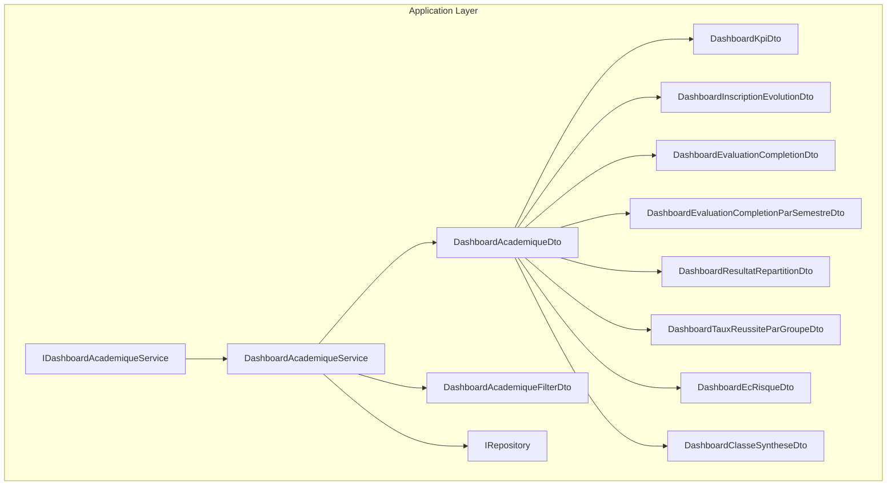
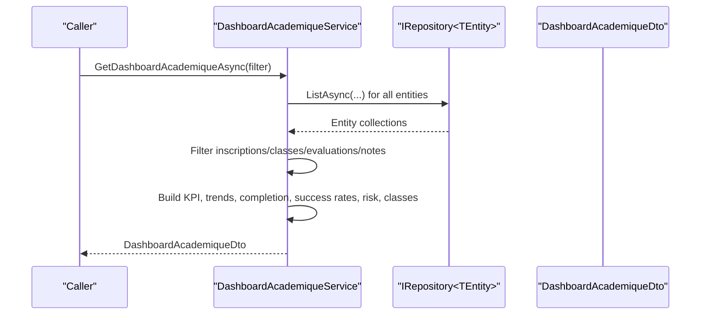
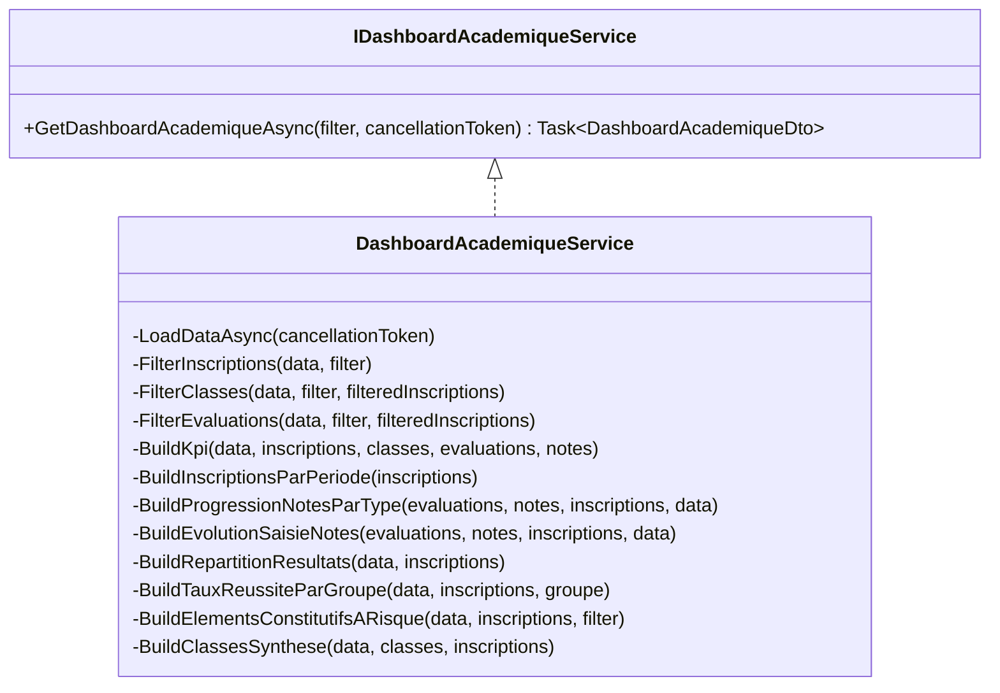
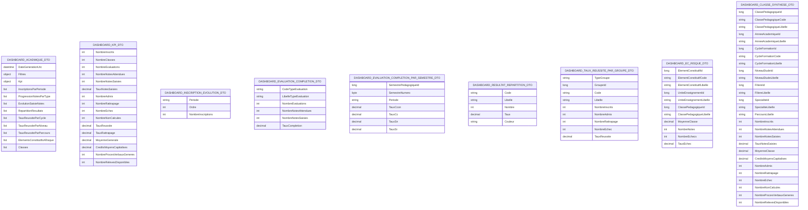
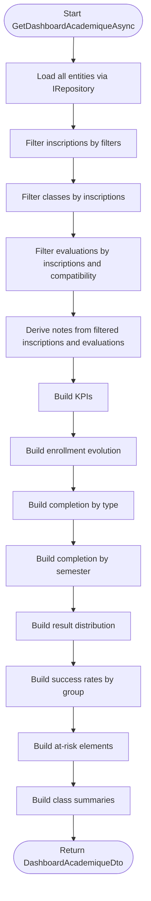
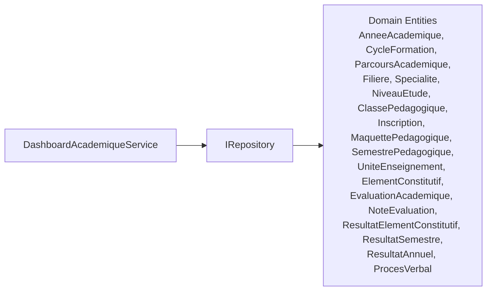

# Dashboard & Analytics Services

<cite>
**Referenced Files in This Document**
- [IDashboardAcademiqueService.cs](file://src/RIIS.Academic.Application/Dashboard/Services/IDashboardAcademiqueService.cs)
- [DashboardAcademiqueService.cs](file://src/RIIS.Academic.Application/Dashboard/Services/DashboardAcademiqueService.cs)
- [DashboardAcademiqueDto.cs](file://src/RIIS.Academic.Application/Dashboard/Dtos/DashboardAcademiqueDto.cs)
- [DashboardKpiDto.cs](file://src/RIIS.Academic.Application/Dashboard/Dtos/DashboardKpiDto.cs)
- [DashboardInscriptionEvolutionDto.cs](file://src/RIIS.Academic.Application/Dashboard/Dtos/DashboardInscriptionEvolutionDto.cs)
- [DashboardEvaluationCompletionDto.cs](file://src/RIIS.Academic.Application/Dashboard/Dtos/DashboardEvaluationCompletionDto.cs)
- [DashboardEvaluationCompletionParSemestreDto.cs](file://src/RIIS.Academic.Application/Dashboard/Dtos/DashboardEvaluationCompletionParSemestreDto.cs)
- [DashboardResultatRepartitionDto.cs](file://src/RIIS.Academic.Application/Dashboard/Dtos/DashboardResultatRepartitionDto.cs)
- [DashboardTauxReussiteParGroupeDto.cs](file://src/RIIS.Academic.Application/Dashboard/Dtos/DashboardTauxReussiteParGroupeDto.cs)
- [DashboardEcRisqueDto.cs](file://src/RIIS.Academic.Application/Dashboard/Dtos/DashboardEcRisqueDto.cs)
- [DashboardClasseSyntheseDto.cs](file://src/RIIS.Academic.Application/Dashboard/Dtos/DashboardClasseSyntheseDto.cs)
- [DashboardAcademiqueFilterDto.cs](file://src/RIIS.Academic.Application/Dashboard/Dtos/DashboardAcademiqueFilterDto.cs)
- [IRepository.cs](file://src/RIIS.Academic.Application/Abstractions/Persistence/IRepository.cs)
</cite>

## Table of Contents
1. [Introduction](#introduction)
2. [Project Structure](#project-structure)
3. [Core Components](#core-components)
4. [Architecture Overview](#architecture-overview)
5. [Detailed Component Analysis](#detailed-component-analysis)
6. [Dependency Analysis](#dependency-analysis)
7. [Performance Considerations](#performance-considerations)
8. [Troubleshooting Guide](#troubleshooting-guide)
9. [Conclusion](#conclusion)

## Introduction
This document explains the Dashboard and Analytics service layer for academic analytics and KPI reporting. It focuses on the IDashboardAcademiqueService interface and its implementation, the rich set of DTOs used to represent dashboard data, and the data aggregation strategies that power enrollment evolution, completion rates, performance metrics, and class summaries. It also covers filtering options, report generation patterns, integration with multiple domain data sources via a generic repository abstraction, and recommended caching strategies for performance and real-time updates.

## Project Structure
The dashboard feature is implemented in the Application layer under the Dashboard namespace:
- Services define the contract and implementation for fetching and aggregating dashboard data.
- Dtos define strongly-typed responses for KPIs, trends, completion rates, success rates by group, risk elements, and class summaries.
- The service depends on a generic persistence abstraction to load all relevant domain entities once per request and then performs in-memory filtering and aggregation.

**Diagram sources**
- [IDashboardAcademiqueService.cs:5-10](file://src/RIIS.Academic.Application/Dashboard/Services/IDashboardAcademiqueService.cs#L5-L10)
- [DashboardAcademiqueService.cs:7-25](file://src/RIIS.Academic.Application/Dashboard/Services/DashboardAcademiqueService.cs#L7-L25)
- [DashboardAcademiqueDto.cs:3-17](file://src/RIIS.Academic.Application/Dashboard/Dtos/DashboardAcademiqueDto.cs#L3-L17)
- [DashboardKpiDto.cs:3-21](file://src/RIIS.Academic.Application/Dashboard/Dtos/DashboardKpiDto.cs#L3-L21)
- [DashboardInscriptionEvolutionDto.cs:3-8](file://src/RIIS.Academic.Application/Dashboard/Dtos/DashboardInscriptionEvolutionDto.cs#L3-L8)
- [DashboardEvaluationCompletionDto.cs:3-11](file://src/RIIS.Academic.Application/Dashboard/Dtos/DashboardEvaluationCompletionDto.cs#L3-L11)
- [DashboardEvaluationCompletionParSemestreDto.cs:3-12](file://src/RIIS.Academic.Application/Dashboard/Dtos/DashboardEvaluationCompletionParSemestreDto.cs#L3-L12)
- [DashboardResultatRepartitionDto.cs:3-10](file://src/RIIS.Academic.Application/Dashboard/Dtos/DashboardResultatRepartitionDto.cs#L3-L10)
- [DashboardTauxReussiteParGroupeDto.cs:3-14](file://src/RIIS.Academic.Application/Dashboard/Dtos/DashboardTauxReussiteParGroupeDto.cs#L3-L14)
- [DashboardEcRisqueDto.cs:3-16](file://src/RIIS.Academic.Application/Dashboard/Dtos/DashboardEcRisqueDto.cs#L3-L16)
- [DashboardClasseSyntheseDto.cs:3-32](file://src/RIIS.Academic.Application/Dashboard/Dtos/DashboardClasseSyntheseDto.cs#L3-L32)
- [DashboardAcademiqueFilterDto.cs:3-14](file://src/RIIS.Academic.Application/Dashboard/Dtos/DashboardAcademiqueFilterDto.cs#L3-L14)
- [IRepository.cs:3-12](file://src/RIIS.Academic.Application/Abstractions/Persistence/IRepository.cs#L3-L12)

**Section sources**
- [IDashboardAcademiqueService.cs:5-10](file://src/RIIS.Academic.Application/Dashboard/Services/IDashboardAcademiqueService.cs#L5-L10)
- [DashboardAcademiqueService.cs:7-25](file://src/RIIS.Academic.Application/Dashboard/Services/DashboardAcademiqueService.cs#L7-L25)
- [DashboardAcademiqueDto.cs:3-17](file://src/RIIS.Academic.Application/Dashboard/Dtos/DashboardAcademiqueDto.cs#L3-L17)
- [IRepository.cs:3-12](file://src/RIIS.Academic.Application/Abstractions/Persistence/IRepository.cs#L3-L12)

## Core Components
- IDashboardAcademiqueService: Exposes a single method to retrieve a comprehensive academic dashboard snapshot with optional filters.
- DashboardAcademiqueService: Loads all required domain entities into memory, applies filters, aggregates metrics, and returns a fully populated DashboardAcademiqueDto.
- DTOs: Strongly typed response models for KPIs, enrollment evolution, evaluation completion (by type and semester), result distribution, success rates by group, at-risk elements, and class summaries.

Key responsibilities:
- Data loading: Fetches all related entities once per call using IRepository<List<T>>.
- Filtering: Applies multi-criteria filters across academic year, cycle, level, filiere, specialty, class, program, semester, and session code.
- Aggregation: Computes KPIs, trends, completion rates, success rates, risk indicators, and class-level summaries.
- Composition: Assembles all pieces into a single DashboardAcademiqueDto response.

**Section sources**
- [IDashboardAcademiqueService.cs:5-10](file://src/RIIS.Academic.Application/Dashboard/Services/IDashboardAcademiqueService.cs#L5-L10)
- [DashboardAcademiqueService.cs:27-58](file://src/RIIS.Academic.Application/Dashboard/Services/DashboardAcademiqueService.cs#L27-L58)
- [DashboardAcademiqueDto.cs:3-17](file://src/RIIS.Academic.Application/Dashboard/Dtos/DashboardAcademiqueDto.cs#L3-L17)

## Architecture Overview
The service follows a read-model pattern optimized for dashboards:
- Load phase: Bulk-load all necessary entities from repositories into a local structure.
- Filter phase: Narrow down inscriptions, classes, evaluations, and notes based on provided filters.
- Aggregate phase: Compute KPIs, trends, completion rates, success rates, risk elements, and class summaries.
- Compose phase: Build and return a single DTO containing all dashboard sections.

**Diagram sources**
- [DashboardAcademiqueService.cs:27-79](file://src/RIIS.Academic.Application/Dashboard/Services/DashboardAcademiqueService.cs#L27-L79)
- [IRepository.cs:3-12](file://src/RIIS.Academic.Application/Abstractions/Persistence/IRepository.cs#L3-L12)

## Detailed Component Analysis

### IDashboardAcademiqueService and DashboardAcademiqueService
- Contract: Single async method returning a full dashboard snapshot with an optional filter.
- Implementation highlights:
  - Loads all referenced entities once per call to minimize round-trips.
  - Applies layered filtering to inscriptions, classes, and evaluations; derives notes accordingly.
  - Builds KPIs, enrollment evolution, evaluation completion (by type and semester), result distribution, success rates by cycle/level/parcours, at-risk elements, and class summaries.
  - Uses helper methods for averages, percentages, and grouping logic.

**Diagram sources**
- [IDashboardAcademiqueService.cs:5-10](file://src/RIIS.Academic.Application/Dashboard/Services/IDashboardAcademiqueService.cs#L5-L10)
- [DashboardAcademiqueService.cs:7-657](file://src/RIIS.Academic.Application/Dashboard/Services/DashboardAcademiqueService.cs#L7-L657)

**Section sources**
- [IDashboardAcademiqueService.cs:5-10](file://src/RIIS.Academic.Application/Dashboard/Services/IDashboardAcademiqueService.cs#L5-L10)
- [DashboardAcademiqueService.cs:27-79](file://src/RIIS.Academic.Application/Dashboard/Services/DashboardAcademiqueService.cs#L27-L79)
- [DashboardAcademiqueService.cs:209-657](file://src/RIIS.Academic.Application/Dashboard/Services/DashboardAcademiqueService.cs#L209-L657)

### DTOs and Data Models
- DashboardAcademiqueDto: Root response containing timestamp, applied filters, KPIs, and all dashboard sections.
- DashboardKpiDto: High-level metrics including counts, rates, averages, credits, and generated artifacts.
- Enrollment Evolution: DashboardInscriptionEvolutionDto provides monthly enrollment counts with ordering.
- Evaluation Completion:
  - By type: DashboardEvaluationCompletionDto shows expected vs entered notes per evaluation type.
  - By semester: DashboardEvaluationCompletionParSemestreDto shows completion rates per evaluation type within each semester.
- Result Distribution: DashboardResultatRepartitionDto categorizes outcomes (admitted, retake, failure, not calculated) with counts and percentages.
- Success Rates by Group: DashboardTauxReussiteParGroupeDto groups by cycle, level, or parcours and reports success metrics.
- At-Risk Elements: DashboardEcRisqueDto identifies elements with high failure rates and low averages.
- Class Summary: DashboardClasseSyntheseDto aggregates per-class statistics, including enrollment, note entry rates, averages, credits, and outputs.

**Diagram sources**
- [DashboardAcademiqueDto.cs:3-17](file://src/RIIS.Academic.Application/Dashboard/Dtos/DashboardAcademiqueDto.cs#L3-L17)
- [DashboardKpiDto.cs:3-21](file://src/RIIS.Academic.Application/Dashboard/Dtos/DashboardKpiDto.cs#L3-L21)
- [DashboardInscriptionEvolutionDto.cs:3-8](file://src/RIIS.Academic.Application/Dashboard/Dtos/DashboardInscriptionEvolutionDto.cs#L3-L8)
- [DashboardEvaluationCompletionDto.cs:3-11](file://src/RIIS.Academic.Application/Dashboard/Dtos/DashboardEvaluationCompletionDto.cs#L3-L11)
- [DashboardEvaluationCompletionParSemestreDto.cs:3-12](file://src/RIIS.Academic.Application/Dashboard/Dtos/DashboardEvaluationCompletionParSemestreDto.cs#L3-L12)
- [DashboardResultatRepartitionDto.cs:3-10](file://src/RIIS.Academic.Application/Dashboard/Dtos/DashboardResultatRepartitionDto.cs#L3-L10)
- [DashboardTauxReussiteParGroupeDto.cs:3-14](file://src/RIIS.Academic.Application/Dashboard/Dtos/DashboardTauxReussiteParGroupeDto.cs#L3-L14)
- [DashboardEcRisqueDto.cs:3-16](file://src/RIIS.Academic.Application/Dashboard/Dtos/DashboardEcRisqueDto.cs#L3-L16)
- [DashboardClasseSyntheseDto.cs:3-32](file://src/RIIS.Academic.Application/Dashboard/Dtos/DashboardClasseSyntheseDto.cs#L3-L32)

**Section sources**
- [DashboardAcademiqueDto.cs:3-17](file://src/RIIS.Academic.Application/Dashboard/Dtos/DashboardAcademiqueDto.cs#L3-L17)
- [DashboardKpiDto.cs:3-21](file://src/RIIS.Academic.Application/Dashboard/Dtos/DashboardKpiDto.cs#L3-L21)
- [DashboardInscriptionEvolutionDto.cs:3-8](file://src/RIIS.Academic.Application/Dashboard/Dtos/DashboardInscriptionEvolutionDto.cs#L3-L8)
- [DashboardEvaluationCompletionDto.cs:3-11](file://src/RIIS.Academic.Application/Dashboard/Dtos/DashboardEvaluationCompletionDto.cs#L3-L11)
- [DashboardEvaluationCompletionParSemestreDto.cs:3-12](file://src/RIIS.Academic.Application/Dashboard/Dtos/DashboardEvaluationCompletionParSemestreDto.cs#L3-L12)
- [DashboardResultatRepartitionDto.cs:3-10](file://src/RIIS.Academic.Application/Dashboard/Dtos/DashboardResultatRepartitionDto.cs#L3-L10)
- [DashboardTauxReussiteParGroupeDto.cs:3-14](file://src/RIIS.Academic.Application/Dashboard/Dtos/DashboardTauxReussiteParGroupeDto.cs#L3-L14)
- [DashboardEcRisqueDto.cs:3-16](file://src/RIIS.Academic.Application/Dashboard/Dtos/DashboardEcRisqueDto.cs#L3-L16)
- [DashboardClasseSyntheseDto.cs:3-32](file://src/RIIS.Academic.Application/Dashboard/Dtos/DashboardClasseSyntheseDto.cs#L3-L32)

### Data Aggregation Strategies
- Bulk loading: All relevant entities are loaded once into memory to enable fast in-memory joins and aggregations.
- Filtering pipeline:
  - Inscriptions are filtered by academic year, cycle, level, filiere, specialty, class, program, semester, and derived from semester selection.
  - Classes are narrowed to those associated with filtered inscriptions and optionally by class id.
  - Evaluations are filtered by academic year and compatibility with programs/parcours, plus optional semester and session code filters.
  - Notes are derived from filtered inscriptions and evaluations.
- Metric calculations:
  - KPIs: Counts of inscriptions, classes, evaluations, expected/entered notes, admission/retake/failure counts, success/retake rates, average grade, average credits, number of generated records (minutes, transcripts).
  - Enrollment evolution: Monthly grouping of inscription dates with ordered periods.
  - Evaluation completion:
    - By type: Expected vs entered notes per evaluation type.
    - By semester: Completion rates per evaluation type within each semester.
  - Result distribution: Categorization into admitted, retake, failure, not calculated with counts and percentages.
  - Success rates by group: Grouping by cycle, level, or parcours with success metrics.
  - At-risk elements: Grouping by element with average retained scores and failure rate; limited to top entries.
  - Class summary: Per-class enrollment, note entry rates, averages, credits, outcomes, and artifact counts.

**Diagram sources**
- [DashboardAcademiqueService.cs:27-79](file://src/RIIS.Academic.Application/Dashboard/Services/DashboardAcademiqueService.cs#L27-L79)
- [DashboardAcademiqueService.cs:81-207](file://src/RIIS.Academic.Application/Dashboard/Services/DashboardAcademiqueService.cs#L81-L207)
- [DashboardAcademiqueService.cs:209-657](file://src/RIIS.Academic.Application/Dashboard/Services/DashboardAcademiqueService.cs#L209-L657)

**Section sources**
- [DashboardAcademiqueService.cs:27-79](file://src/RIIS.Academic.Application/Dashboard/Services/DashboardAcademiqueService.cs#L27-L79)
- [DashboardAcademiqueService.cs:81-207](file://src/RIIS.Academic.Application/Dashboard/Services/DashboardAcademiqueService.cs#L81-L207)
- [DashboardAcademiqueService.cs:209-657](file://src/RIIS.Academic.Application/Dashboard/Services/DashboardAcademiqueService.cs#L209-L657)

### Filtering Options and Report Generation
- Filters supported:
  - Academic year, cycle, level, filiere, specialty, class, program, semester, and session code.
  - Semester filter narrows evaluations by resolving their parent semester and matching program compatibility.
- Report composition:
  - A single DTO aggregates all dashboard sections, enabling efficient UI rendering and export.
  - Each section includes computed metrics and labels suitable for charts and tables.

**Section sources**
- [DashboardAcademiqueFilterDto.cs:3-14](file://src/RIIS.Academic.Application/Dashboard/Dtos/DashboardAcademiqueFilterDto.cs#L3-L14)
- [DashboardAcademiqueService.cs:81-207](file://src/RIIS.Academic.Application/Dashboard/Services/DashboardAcademiqueService.cs#L81-L207)
- [DashboardAcademiqueDto.cs:3-17](file://src/RIIS.Academic.Application/Dashboard/Dtos/DashboardAcademiqueDto.cs#L3-L17)

### Integration with Multiple Data Sources
- The service integrates with numerous domain entities through a generic repository abstraction:
  - Academic references: academic years, cycles, levels, programs, semesters, units, elements.
  - Operational data: classes, inscriptions, evaluations, notes, results, minutes, transcripts.
- This design decouples the dashboard logic from persistence details and allows swapping implementations without changing business rules.

**Section sources**
- [DashboardAcademiqueService.cs:7-25](file://src/RIIS.Academic.Application/Dashboard/Services/DashboardAcademiqueService.cs#L7-L25)
- [IRepository.cs:3-12](file://src/RIIS.Academic.Application/Abstractions/Persistence/IRepository.cs#L3-L12)

## Dependency Analysis
The service has many direct dependencies on domain entities via IRepository<T>. Cohesion is high around dashboard aggregation; coupling is primarily through the generic repository interface.

**Diagram sources**
- [DashboardAcademiqueService.cs:7-25](file://src/RIIS.Academic.Application/Dashboard/Services/DashboardAcademiqueService.cs#L7-L25)
- [IRepository.cs:3-12](file://src/RIIS.Academic.Application/Abstractions/Persistence/IRepository.cs#L3-L12)

**Section sources**
- [DashboardAcademiqueService.cs:7-25](file://src/RIIS.Academic.Application/Dashboard/Services/DashboardAcademiqueService.cs#L7-L25)
- [IRepository.cs:3-12](file://src/RIIS.Academic.Application/Abstractions/Persistence/IRepository.cs#L3-L12)

## Performance Considerations
- Current strategy:
  - Bulk load all entities once per call to avoid N+1 queries and enable fast in-memory filtering/aggregation.
  - Use HashSet lookups for efficient membership checks during filtering.
  - Compute averages and percentages with safe guards against empty sets.
- Optimization opportunities:
  - Caching:
    - Cache reference data (academic years, cycles, levels, programs, semesters, units, elements) with short TTLs since they change infrequently.
    - Cache aggregated snapshots keyed by filter combinations for hot endpoints.
  - Selective loading:
    - For large datasets, consider loading only needed subsets (e.g., by academic year) before in-memory aggregation.
  - Indexing:
    - Ensure database indexes on foreign keys and commonly filtered columns (e.g., academic year, program ids) to speed up initial loads.
  - Parallelism:
    - Where safe, parallelize independent repository calls to reduce latency.
  - Real-time updates:
    - Implement cache invalidation on write operations (inscriptions, notes, results) to keep dashboards fresh.
    - Consider background refresh jobs for heavy computations.

[No sources needed since this section provides general guidance]

## Troubleshooting Guide
- Empty or unexpected results:
  - Verify filter values and ensure they match existing entity ids.
  - Check semester resolution logic when filtering by semester; ensure evaluations map to valid semesters and compatible programs.
- Incorrect percentages or averages:
  - Confirm denominator totals are non-zero; helper methods guard against division by zero but may return zero defaults.
  - Validate that expected notes calculation considers program compatibility and academic year alignment.
- Performance issues:
  - Large datasets can cause slow in-memory processing; apply selective loading or caching as suggested.
  - Monitor repository ListAsync calls; consider batching or pagination if applicable.
- Data consistency:
  - Ensure transactions or consistent snapshots are used when reading related entities to avoid inconsistent states during writes.

**Section sources**
- [DashboardAcademiqueService.cs:81-207](file://src/RIIS.Academic.Application/Dashboard/Services/DashboardAcademiqueService.cs#L81-L207)
- [DashboardAcademiqueService.cs:502-617](file://src/RIIS.Academic.Application/Dashboard/Services/DashboardAcademiqueService.cs#L502-L617)

## Conclusion
The Dashboard and Analytics service layer provides a robust, cohesive approach to academic analytics and KPI reporting. It centralizes complex aggregations behind a simple interface, delivers a comprehensive DTO for UI consumption, and leverages a generic repository abstraction for clean separation of concerns. With careful caching, selective loading, and indexing, it can scale to support real-time dashboards while maintaining clarity and maintainability.