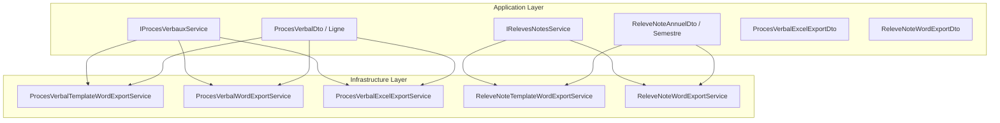
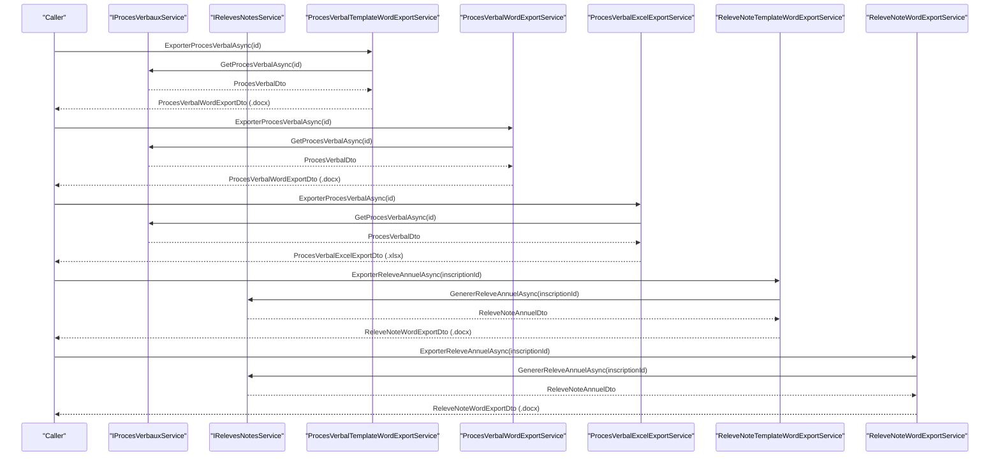
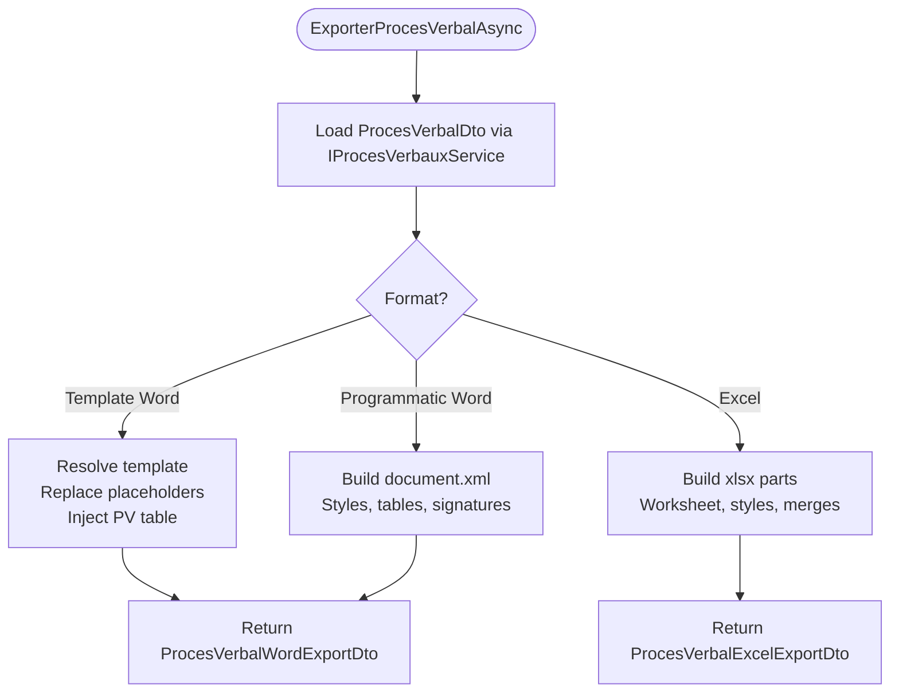
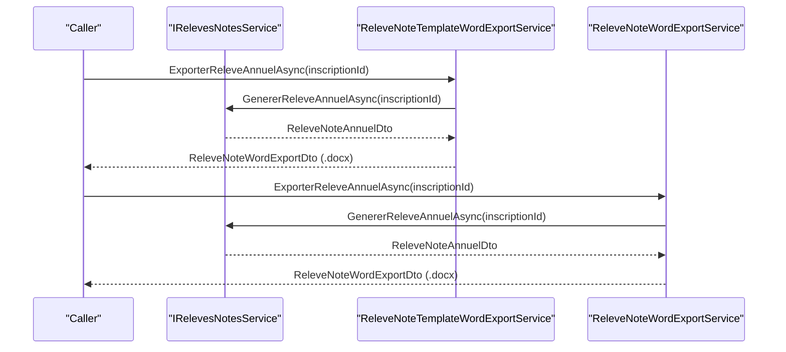
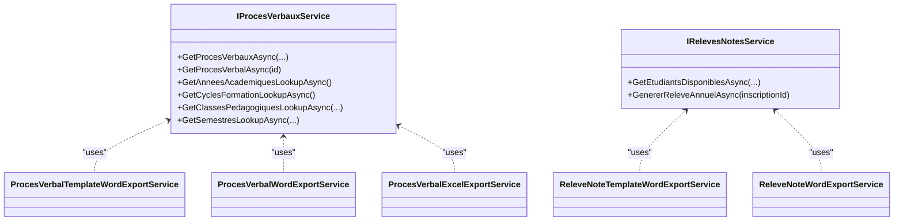

# Document Generation Services

<cite>
**Referenced Files in This Document**
- [IProcesVerbauxService.cs](file://RIIS.Academic.Application/ProcesVerbaux/Services/IProcesVerbauxService.cs)
- [IRelevesNotesService.cs](file://RIIS.Academic.Application/Releves/Services/IRelevesNotesService.cs)
- [ProcesVerbalDto.cs](file://RIIS.Academic.Application/ProcesVerbaux/Dtos/ProcesVerbalDto.cs)
- [ProcesVerbalLigneDto.cs](file://RIIS.Academic.Application/ProcesVerbaux/Dtos/ProcesVerbalLigneDto.cs)
- [ProcesVerbalExcelExportDto.cs](file://RIIS.Academic.Application/ProcesVerbaux/Dtos/ProcesVerbalExcelExportDto.cs)
- [ReleveNoteWordExportDto.cs](file://RIIS.Academic.Application/Releves/Dtos/ReleveNoteWordExportDto.cs)
- [ReleveNoteAnnuelDto.cs](file://RIIS.Academic.Application/Releves/Dtos/ReleveNoteAnnuelDto.cs)
- [ReleveNoteSemestreDto.cs](file://RIIS.Academic.Application/Releves/Dtos/ReleveNoteSemestreDto.cs)
- [ProcesVerbalTemplateWordExportService.cs](file://RIIS.Academic.Infrastructure/Documents/ProcesVerbalTemplateWordExportService.cs)
- [ProcesVerbalWordExportService.cs](file://RIIS.Academic.Infrastructure/Documents/ProcesVerbalWordExportService.cs)
- [ProcesVerbalExcelExportService.cs](file://RIIS.Academic.Infrastructure/Documents/ProcesVerbalExcelExportService.cs)
- [ReleveNoteTemplateWordExportService.cs](file://RIIS.Academic.Infrastructure/Documents/ReleveNoteTemplateWordExportService.cs)
- [ReleveNoteWordExportService.cs](file://RIIS.Academic.Infrastructure/Documents/ReleveNoteWordExportService.cs)
</cite>

## Table of Contents
1. Introduction
2. Project Structure
3. Core Components
4. Architecture Overview
5. Detailed Component Analysis
6. Dependency Analysis
7. Performance Considerations
8. Troubleshooting Guide
9. Conclusion

## Introduction
This document explains the Document Generation service layer for official academic outputs: meeting minutes (Proces Verbal) and transcripts (Relevé de Notes). It covers the application interfaces, data transfer objects (DTOs), template-based Word generation, Excel export, formatting options, and how to use these services to produce batched documents.

## Project Structure
The document generation capabilities are split across two layers:
- Application layer: defines service contracts and DTOs for domain-specific exports.
- Infrastructure layer: implements Word and Excel generation using Open XML structures or templates.

**Diagram sources**
- [IProcesVerbauxService.cs:7-30](file://RIIS.Academic.Application/ProcesVerbaux/Services/IProcesVerbauxService.cs#L7-L30)
- [IRelevesNotesService.cs:5-17](file://RIIS.Academic.Application/Releves/Services/IRelevesNotesService.cs#L5-L17)
- [ProcesVerbalDto.cs:5-40](file://RIIS.Academic.Application/ProcesVerbaux/Dtos/ProcesVerbalDto.cs#L5-L40)
- [ReleveNoteAnnuelDto.cs:3-25](file://RIIS.Academic.Application/Releves/Dtos/ReleveNoteAnnuelDto.cs#L3-L25)
- [ProcesVerbalTemplateWordExportService.cs:11-34](file://RIIS.Academic.Infrastructure/Documents/ProcesVerbalTemplateWordExportService.cs#L11-L34)
- [ProcesVerbalWordExportService.cs:10-45](file://RIIS.Academic.Infrastructure/Documents/ProcesVerbalWordExportService.cs#L10-L45)
- [ProcesVerbalExcelExportService.cs:10-50](file://RIIS.Academic.Infrastructure/Documents/ProcesVerbalExcelExportService.cs#L10-L50)
- [ReleveNoteTemplateWordExportService.cs:11-34](file://RIIS.Academic.Infrastructure/Documents/ReleveNoteTemplateWordExportService.cs#L11-L34)
- [ReleveNoteWordExportService.cs:10-43](file://RIIS.Academic.Infrastructure/Documents/ReleveNoteWordExportService.cs#L10-L43)

**Section sources**
- [IProcesVerbauxService.cs:7-30](file://RIIS.Academic.Application/ProcesVerbaux/Services/IProcesVerbauxService.cs#L7-L30)
- [IRelevesNotesService.cs:5-17](file://RIIS.Academic.Application/Releves/Services/IRelevesNotesService.cs#L5-L17)

## Core Components
- IProcesVerbauxService: Provides queries for meeting minutes (Proces Verbal) including filtering by academic year, cycle, class, semester, and type; and lookup helpers for UI filters.
- IRelevesNotesService: Provides retrieval of available students for transcript generation and annual transcript generation for a given enrollment.

Key DTOs:
- ProcesVerbalDto: Represents a complete meeting minutes record with metadata, summary statistics, and student lines. Includes derived labels for session type and status.
- ProcesVerbalLigneDto: Represents a single student line within a meeting minutes, including grades, credits, ranking, decision, and constituent elements.
- ReleveNoteAnnuelDto: Annual transcript aggregate with student info, per-semester details, resume totals, final decision and mention.
- ReleveNoteSemestreDto: Semester-level transcript with lines, totals, average, credits, and grade.
- Export DTOs:
  - ProcesVerbalExcelExportDto: Excel output envelope with file name, content type, and bytes.
  - ReleveNoteWordExportDto: Word output envelope with file name, content type, and bytes.

**Section sources**
- [IProcesVerbauxService.cs:7-30](file://RIIS.Academic.Application/ProcesVerbaux/Services/IProcesVerbauxService.cs#L7-L30)
- [IRelevesNotesService.cs:5-17](file://RIIS.Academic.Application/Releves/Services/IRelevesNotesService.cs#L5-L17)
- [ProcesVerbalDto.cs:5-40](file://RIIS.Academic.Application/ProcesVerbaux/Dtos/ProcesVerbalDto.cs#L5-L40)
- [ProcesVerbalLigneDto.cs:5-24](file://RIIS.Academic.Application/ProcesVerbaux/Dtos/ProcesVerbalLigneDto.cs#L5-L24)
- [ReleveNoteAnnuelDto.cs:3-25](file://RIIS.Academic.Application/Releves/Dtos/ReleveNoteAnnuelDto.cs#L3-L25)
- [ReleveNoteSemestreDto.cs:3-13](file://RIIS.Academic.Application/Releves/Dtos/ReleveNoteSemestreDto.cs#L3-L13)
- [ProcesVerbalExcelExportDto.cs:3-8](file://RIIS.Academic.Application/ProcesVerbaux/Dtos/ProcesVerbalExcelExportDto.cs#L3-L8)
- [ReleveNoteWordExportDto.cs:3-8](file://RIIS.Academic.Application/Releves/Dtos/ReleveNoteWordExportDto.cs#L3-L8)

## Architecture Overview
Two families of exporters exist:
- Template-based Word: Uses an existing .docx template, replaces placeholders, and injects tables into designated markers.
- Programmatic Word/Excel: Builds Office Open XML parts from scratch (document.xml, styles.xml, workbook/sheet XML) and packages them into .docx/.xlsx.

**Diagram sources**
- [ProcesVerbalTemplateWordExportService.cs:16-34](file://RIIS.Academic.Infrastructure/Documents/ProcesVerbalTemplateWordExportService.cs#L16-L34)
- [ProcesVerbalWordExportService.cs:12-30](file://RIIS.Academic.Infrastructure/Documents/ProcesVerbalWordExportService.cs#L12-L30)
- [ProcesVerbalExcelExportService.cs:14-32](file://RIIS.Academic.Infrastructure/Documents/ProcesVerbalExcelExportService.cs#L14-L32)
- [ReleveNoteTemplateWordExportService.cs:16-34](file://RIIS.Academic.Infrastructure/Documents/ReleveNoteTemplateWordExportService.cs#L16-L34)
- [ReleveNoteWordExportService.cs:12-28](file://RIIS.Academic.Infrastructure/Documents/ReleveNoteWordExportService.cs#L12-L28)
- [IProcesVerbauxService.cs:9-17](file://RIIS.Academic.Application/ProcesVerbaux/Services/IProcesVerbauxService.cs#L9-L17)
- [IRelevesNotesService.cs:7-16](file://RIIS.Academic.Application/Releves/Services/IRelevesNotesService.cs#L7-L16)

## Detailed Component Analysis

### Meeting Minutes (Proces Verbal)
- Data model:
  - ProcesVerbalDto aggregates header metadata, summary counts, and a list of student lines.
  - Each line includes student identity, averages, credits, rank, decision label, and constituent element details.
- Export formats:
  - Word (template-based): Loads a .docx template, replaces text placeholders, and substitutes a table placeholder with generated table XML.
  - Word (programmatic): Builds a full Word document XML with headers, info table, detail table, and signature area.
  - Excel: Generates a styled worksheet with merged headers, frozen panes, print setup, and conditional note colors.

**Diagram sources**
- [ProcesVerbalTemplateWordExportService.cs:36-68](file://RIIS.Academic.Infrastructure/Documents/ProcesVerbalTemplateWordExportService.cs#L36-L68)
- [ProcesVerbalWordExportService.cs:32-89](file://RIIS.Academic.Infrastructure/Documents/ProcesVerbalWordExportService.cs#L32-L89)
- [ProcesVerbalExcelExportService.cs:34-139](file://RIIS.Academic.Infrastructure/Documents/ProcesVerbalExcelExportService.cs#L34-L139)
- [IProcesVerbauxService.cs:9-17](file://RIIS.Academic.Application/ProcesVerbaux/Services/IProcesVerbauxService.cs#L9-L17)

**Section sources**
- [ProcesVerbalDto.cs:5-40](file://RIIS.Academic.Application/ProcesVerbaux/Dtos/ProcesVerbalDto.cs#L5-L40)
- [ProcesVerbalLigneDto.cs:5-24](file://RIIS.Academic.Application/ProcesVerbaux/Dtos/ProcesVerbalLigneDto.cs#L5-L24)
- [ProcesVerbalTemplateWordExportService.cs:88-137](file://RIIS.Academic.Infrastructure/Documents/ProcesVerbalTemplateWordExportService.cs#L88-L137)
- [ProcesVerbalWordExportService.cs:91-165](file://RIIS.Academic.Infrastructure/Documents/ProcesVerbalWordExportService.cs#L91-L165)
- [ProcesVerbalExcelExportService.cs:141-253](file://RIIS.Academic.Infrastructure/Documents/ProcesVerbalExcelExportService.cs#L141-L253)

### Transcripts (Relevé de Notes)
- Data model:
  - ReleveNoteAnnuelDto contains student identification, academic context, per-semester lists, annual resume, averages, credits, decision, and mention.
  - ReleveNoteSemestreDto groups lines by unit and provides totals and averages.
- Export formats:
  - Word (template-based): Loads a .docx template, replaces text placeholders, and injects semester tables and resume table at a marker.
  - Word (programmatic): Builds a formal transcript layout with headers, student info table, semester tables, recap, decision, and signature blocks.

**Diagram sources**
- [ReleveNoteTemplateWordExportService.cs:16-34](file://RIIS.Academic.Infrastructure/Documents/ReleveNoteTemplateWordExportService.cs#L16-L34)
- [ReleveNoteWordExportService.cs:12-28](file://RIIS.Academic.Infrastructure/Documents/ReleveNoteWordExportService.cs#L12-L28)
- [IRelevesNotesService.cs:7-16](file://RIIS.Academic.Application/Releves/Services/IRelevesNotesService.cs#L7-L16)

**Section sources**
- [ReleveNoteAnnuelDto.cs:3-25](file://RIIS.Academic.Application/Releves/Dtos/ReleveNoteAnnuelDto.cs#L3-L25)
- [ReleveNoteSemestreDto.cs:3-13](file://RIIS.Academic.Application/Releves/Dtos/ReleveNoteSemestreDto.cs#L3-L13)
- [ReleveNoteTemplateWordExportService.cs:88-178](file://RIIS.Academic.Infrastructure/Documents/ReleveNoteTemplateWordExportService.cs#L88-L178)
- [ReleveNoteWordExportService.cs:45-93](file://RIIS.Academic.Infrastructure/Documents/ReleveNoteWordExportService.cs#L45-L93)

### Template Management and Data Binding
- Template resolution:
  - Searches multiple locations for template files and throws if not found.
- Placeholder replacement:
  - Text placeholders are replaced in all text nodes of the Word document XML.
  - Table placeholders are identified by specific markers and replaced with generated table XML fragments.
- Placeholders used:
  - Meeting minutes: session type, semester, academic year, cycle, pathway, level, class, semester number, session code, status, student counts, observation.
  - Transcript: title, cycle, academic year, student name, matricule, birth date/place, filière, specialty, level, annual average, capitalized/required credits, decision, mention, edition date.

**Section sources**
- [ProcesVerbalTemplateWordExportService.cs:70-137](file://RIIS.Academic.Infrastructure/Documents/ProcesVerbalTemplateWordExportService.cs#L70-L137)
- [ReleveNoteTemplateWordExportService.cs:70-154](file://RIIS.Academic.Infrastructure/Documents/ReleveNoteTemplateWordExportService.cs#L70-L154)

### Formatting Options
- Word styling:
  - Headers, titles, subtitles, and body paragraphs use distinct styles with size, color, alignment, and spacing.
  - Tables have borders, fixed layouts, cell margins, and header rows.
  - Conditional coloring for grades (e.g., pass/fail thresholds).
- Excel styling:
  - Custom fonts, fills, borders, and number formats.
  - Merged cells for grouped headers and frozen panes for readability.
  - Print settings: landscape orientation, page margins, and fitting.

**Section sources**
- [ProcesVerbalWordExportService.cs:263-389](file://RIIS.Academic.Infrastructure/Documents/ProcesVerbalWordExportService.cs#L263-L389)
- [ReleveNoteWordExportService.cs:211-321](file://RIIS.Academic.Infrastructure/Documents/ReleveNoteWordExportService.cs#L211-L321)
- [ProcesVerbalExcelExportService.cs:287-315](file://RIIS.Academic.Infrastructure/Documents/ProcesVerbalExcelExportService.cs#L287-L315)
- [ProcesVerbalExcelExportService.cs:449-500](file://RIIS.Academic.Infrastructure/Documents/ProcesVerbalExcelExportService.cs#L449-L500)

### Batch Processing and Export Customization
- Batch processing:
  - Iterate over multiple IDs (meeting minutes or enrollments) and call the corresponding exporter methods sequentially or concurrently.
  - Aggregate results into a collection of exported DTOs for download or archival.
- Export customization:
  - Choose between template-based and programmatic Word outputs depending on branding needs.
  - Use Excel export for analytical review or further manipulation.
  - Customize file names via slugified combinations of academic year, session code, class, student name, and matricule.

[No sources needed since this section provides general guidance]

## Dependency Analysis

**Diagram sources**
- [IProcesVerbauxService.cs:7-30](file://RIIS.Academic.Application/ProcesVerbaux/Services/IProcesVerbauxService.cs#L7-L30)
- [IRelevesNotesService.cs:5-17](file://RIIS.Academic.Application/Releves/Services/IRelevesNotesService.cs#L5-L17)
- [ProcesVerbalTemplateWordExportService.cs:11-34](file://RIIS.Academic.Infrastructure/Documents/ProcesVerbalTemplateWordExportService.cs#L11-L34)
- [ProcesVerbalWordExportService.cs:10-45](file://RIIS.Academic.Infrastructure/Documents/ProcesVerbalWordExportService.cs#L10-L45)
- [ProcesVerbalExcelExportService.cs:10-50](file://RIIS.Academic.Infrastructure/Documents/ProcesVerbalExcelExportService.cs#L10-L50)
- [ReleveNoteTemplateWordExportService.cs:11-34](file://RIIS.Academic.Infrastructure/Documents/ReleveNoteTemplateWordExportService.cs#L11-L34)
- [ReleveNoteWordExportService.cs:10-43](file://RIIS.Academic.Infrastructure/Documents/ReleveNoteWordExportService.cs#L10-L43)

**Section sources**
- [IProcesVerbauxService.cs:7-30](file://RIIS.Academic.Application/ProcesVerbaux/Services/IProcesVerbauxService.cs#L7-L30)
- [IRelevesNotesService.cs:5-17](file://RIIS.Academic.Application/Releves/Services/IRelevesNotesService.cs#L5-L17)

## Performance Considerations
- Avoid loading large templates repeatedly; reuse resolved paths where possible.
- Prefer streaming when building large documents to reduce memory pressure.
- For batch operations, consider parallel execution with bounded concurrency to avoid resource saturation.
- Minimize string concatenation in tight loops; use builders consistently.
- Cache lookups for static configuration (e.g., column widths, style definitions) if reused frequently.

[No sources needed since this section provides general guidance]

## Troubleshooting Guide
Common issues and resolutions:
- Missing Word template:
  - Ensure the template file exists in one of the searched directories; otherwise, a file-not-found exception is thrown during template resolution.
- Missing placeholder in template:
  - If the expected table or paragraph placeholder marker is not found, an invalid operation exception is raised indicating the missing marker.
- Null data:
  - Exporters return null when underlying data cannot be retrieved; callers should handle null returns gracefully.

**Section sources**
- [ProcesVerbalTemplateWordExportService.cs:70-86](file://RIIS.Academic.Infrastructure/Documents/ProcesVerbalTemplateWordExportService.cs#L70-L86)
- [ProcesVerbalTemplateWordExportService.cs:123-137](file://RIIS.Academic.Infrastructure/Documents/ProcesVerbalTemplateWordExportService.cs#L123-L137)
- [ReleveNoteTemplateWordExportService.cs:70-86](file://RIIS.Academic.Infrastructure/Documents/ReleveNoteTemplateWordExportService.cs#L70-L86)
- [ReleveNoteTemplateWordExportService.cs:125-154](file://RIIS.Academic.Infrastructure/Documents/ReleveNoteTemplateWordExportService.cs#L125-L154)

## Conclusion
The Document Generation service layer provides robust, extensible mechanisms to produce official academic documents in Word and Excel. By leveraging both template-driven and programmatic approaches, it supports flexible branding, precise formatting, and scalable batch processing. The clear separation between application contracts and infrastructure implementations enables maintainability and future enhancements such as additional export formats or advanced templating features.