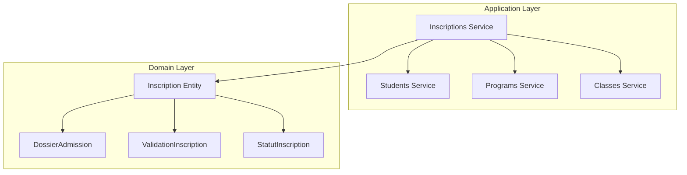
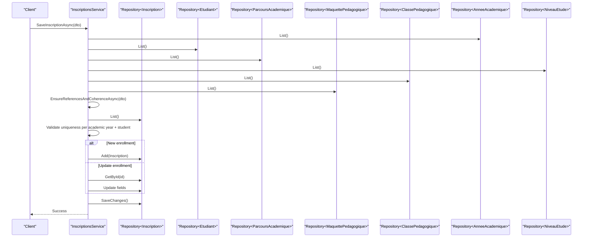
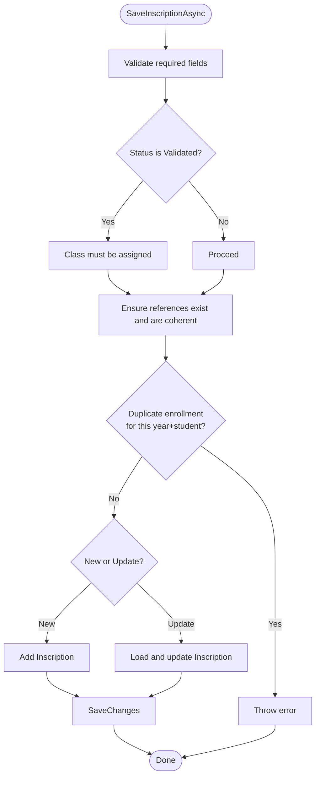
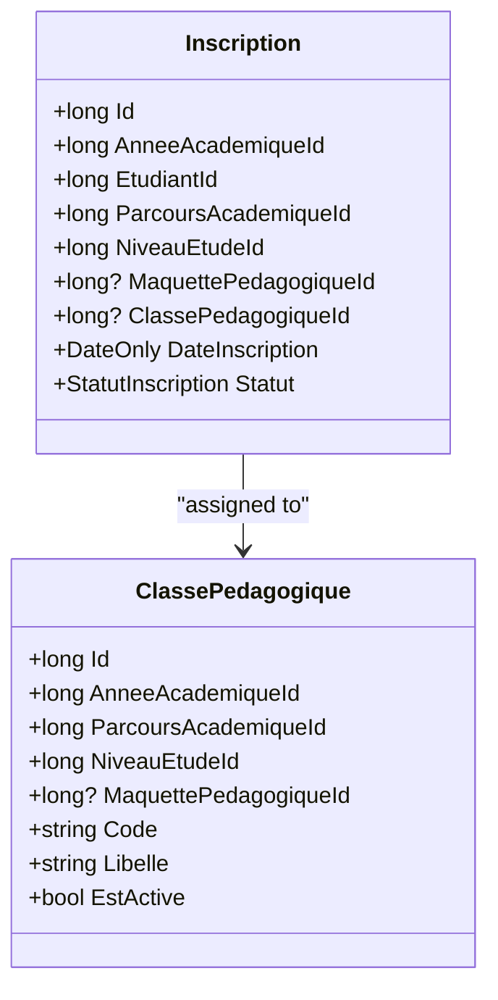
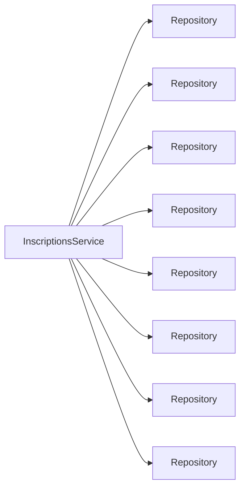

# Enrollment & Registration Services

<cite>
**Referenced Files in This Document**
- [IInscriptionsService.cs](file://RIIS.Academic.Application/Inscriptions/Services/IInscriptionsService.cs)
- [InscriptionsService.cs](file://RIIS.Academic.Application/Inscriptions/Services/InscriptionsService.cs)
- [InscriptionDto.cs](file://RIIS.Academic.Application/Inscriptions/Dtos/InscriptionDto.cs)
- [Inscription.cs](file://RIIS.Academic.Domain/Inscriptions/Inscription.cs)
- [DossierAdmission.cs](file://RIIS.Academic.Domain/Inscriptions/DossierAdmission.cs)
- [ValidationInscription.cs](file://RIIS.Academic.Domain/Inscriptions/ValidationInscription.cs)
- [StatutInscription.cs](file://RIIS.Academic.Domain/Enums/StatutInscription.cs)
- [IEtudiantsService.cs](file://RIIS.Academic.Application/Etudiants/Services/IEtudiantsService.cs)
- [EtudiantsService.cs](file://RIIS.Academic.Application/Etudiants/Services/EtudiantsService.cs)
- [IProgrammePedagogiqueService.cs](file://RIIS.Academic.Application/Programmes/Services/IProgrammePedagogiqueService.cs)
- [ProgrammePedagogiqueService.cs](file://RIIS.Academic.Application/Programmes/Services/ProgrammePedagogiqueService.cs)
- [IClassesPedagogiquesService.cs](file://RIIS.Academic.Application/ClassesPedagogiques/Services/IClassesPedagogiquesService.cs)
- [ClassesPedagogiquesService.cs](file://RIIS.Academic.Application/ClassesPedagogiques/Services/ClassesPedagogiquesService.cs)
</cite>

## Table of Contents
1. Introduction
2. Project Structure
3. Core Components
4. Architecture Overview
5. Detailed Component Analysis
6. Dependency Analysis
7. Performance Considerations
8. Troubleshooting Guide
9. Conclusion

## Introduction
This document explains the Enrollment and Registration service layer with a focus on student enrollment workflows. It covers the IInscriptionsService interface and InscriptionsService implementation, the InscriptionDto data transfer object, admission process management via related domain entities, registration validation rules, and enrollment status tracking. It also details integration points with student management and academic program services, and addresses enrollment conflict resolution, capacity management through class assignments, and approval processes.

## Project Structure
The enrollment feature spans Application and Domain layers:
- Application.Inscriptions exposes the service interface and implementation for enrollment operations and lookups.
- Application.Etudiants provides student lookup and management used by enrollment flows.
- Application.Programmes provides academic program (curriculum) definitions and hierarchies used to validate program compatibility during enrollment.
- Application.ClassesPedagogiques manages pedagogical classes and their effective enrollment counts.
- Domain.Inscriptions defines the core enrollment entity and related admission and validation records.
- Domain.Enums includes enrollment status values.

**Diagram sources**
- [InscriptionsService.cs:8-16](file://RIIS.Academic.Application/Inscriptions/Services/InscriptionsService.cs#L8-L16)
- [Inscription.cs:3-36](file://RIIS.Academic.Domain/Inscriptions/Inscription.cs#L3-L36)
- [DossierAdmission.cs:3-16](file://RIIS.Academic.Domain/Inscriptions/DossierAdmission.cs#L3-L16)
- [ValidationInscription.cs:3-17](file://RIIS.Academic.Domain/Inscriptions/ValidationInscription.cs#L3-L17)
- [StatutInscription.cs:3-9](file://RIIS.Academic.Domain/Enums/StatutInscription.cs#L3-L9)

**Section sources**
- [IInscriptionsService.cs:6-31](file://RIIS.Academic.Application/Inscriptions/Services/IInscriptionsService.cs#L6-L31)
- [InscriptionsService.cs:8-16](file://RIIS.Academic.Application/Inscriptions/Services/InscriptionsService.cs#L8-L16)
- [Inscription.cs:3-36](file://RIIS.Academic.Domain/Inscriptions/Inscription.cs#L3-L36)

## Core Components
- IInscriptionsService: Declares CRUD and lookup operations for enrollments, including filtering by academic year, cycle, study level, and pedagogical class, plus creation of default enrollment DTOs.
- InscriptionsService: Implements business logic for enrollment queries, validations, persistence, and reference integrity checks across students, programs, classes, and curricula.
- InscriptionDto: Transfer object carrying enrollment data and display labels for UI binding and API contracts.
- Domain entities: Inscription, DossierAdmission, ValidationInscription, and StatutInscription define the enrollment model and lifecycle states.

Key responsibilities:
- Querying and filtering enrollments with rich context labels.
- Creating default enrollment templates pre-filled with current academic year and pending status.
- Saving enrollments with strict validation and uniqueness constraints.
- Ensuring referential integrity between academic year, student, program, study level, curriculum, and class.
- Providing lookup lists for UI dropdowns and filters.

**Section sources**
- [IInscriptionsService.cs:6-31](file://RIIS.Academic.Application/Inscriptions/Services/IInscriptionsService.cs#L6-L31)
- [InscriptionsService.cs:18-191](file://RIIS.Academic.Application/Inscriptions/Services/InscriptionsService.cs#L18-L191)
- [InscriptionDto.cs:5-27](file://RIIS.Academic.Application/Inscriptions/Dtos/InscriptionDto.cs#L5-L27)
- [Inscription.cs:3-36](file://RIIS.Academic.Domain/Inscriptions/Inscription.cs#L3-L36)
- [StatutInscription.cs:3-9](file://RIIS.Academic.Domain/Enums/StatutInscription.cs#L3-L9)

## Architecture Overview
The enrollment service orchestrates cross-cutting references to ensure valid and coherent enrollment records. It integrates with:
- Student management for student existence and identity.
- Academic programs for curriculum and hierarchy validation.
- Pedagogical classes for assignment and capacity visibility.
- Domain enums for enrollment status transitions.

**Diagram sources**
- [InscriptionsService.cs:108-191](file://RIIS.Academic.Application/Inscriptions/Services/InscriptionsService.cs#L108-L191)
- [InscriptionsService.cs:313-382](file://RIIS.Academic.Application/Inscriptions/Services/InscriptionsService.cs#L313-L382)

**Section sources**
- [InscriptionsService.cs:108-191](file://RIIS.Academic.Application/Inscriptions/Services/InscriptionsService.cs#L108-L191)
- [InscriptionsService.cs:313-382](file://RIIS.Academic.Application/Inscriptions/Services/InscriptionsService.cs#L313-L382)

## Detailed Component Analysis

### IInscriptionsService and InscriptionsService
Responsibilities:
- GetInscriptionsAsync: Retrieves enrollments with optional filters and enriches results with labels from related entities.
- GetInscriptionAsync: Loads a single enrollment with full context labels.
- CreateDefaultInscriptionAsync: Builds a new enrollment template with default academic year and pending status.
- SaveInscriptionAsync: Validates required fields, ensures referential integrity, enforces uniqueness per academic year and student, and persists changes.
- DeleteInscriptionAsync: Removes an enrollment record.
- Lookup methods: Provide filtered lists for UI selection (academic years, students, cycles, programs, levels, classes, curricula).

Validation highlights:
- Required fields: academic year, student, program, study level.
- Validated status rule: validated enrollments must be assigned to a pedagogical class.
- Reference checks: all referenced IDs must exist; class must match academic year, program, and study level; curriculum must be compatible with program.
- Uniqueness: prevents duplicate enrollment for the same student and academic year.

**Diagram sources**
- [InscriptionsService.cs:108-191](file://RIIS.Academic.Application/Inscriptions/Services/InscriptionsService.cs#L108-L191)
- [InscriptionsService.cs:313-382](file://RIIS.Academic.Application/Inscriptions/Services/InscriptionsService.cs#L313-L382)

**Section sources**
- [IInscriptionsService.cs:6-31](file://RIIS.Academic.Application/Inscriptions/Services/IInscriptionsService.cs#L6-L31)
- [InscriptionsService.cs:18-191](file://RIIS.Academic.Application/Inscriptions/Services/InscriptionsService.cs#L18-L191)
- [InscriptionsService.cs:313-382](file://RIIS.Academic.Application/Inscriptions/Services/InscriptionsService.cs#L313-L382)

### InscriptionDto and Data Flow
InscriptionDto carries both identifiers and human-readable labels for UI rendering and API responses. It includes:
- Identifiers: academic year, student, program, study level, curriculum, class.
- Labels: computed from related entities for display.
- Enrollment metadata: date, status, special mention, academic supervisor, observation, administrative code.

Data flow:
- Queries load raw entities and map them to DTOs with labels using helper mappings.
- Saves accept DTOs and persist corresponding domain entities after validation.

**Section sources**
- [InscriptionDto.cs:5-27](file://RIIS.Academic.Application/Inscriptions/Dtos/InscriptionDto.cs#L5-L27)
- [InscriptionsService.cs:394-449](file://RIIS.Academic.Application/Inscriptions/Services/InscriptionsService.cs#L394-L449)

### Admission Process Management
Admission-related data is modeled by:
- DossierAdmission: captures entry qualifications and equivalencies linked to an enrollment.
- ValidationInscription: captures signatures, dates, and administrative validation observations tied to an enrollment.

These entities enable end-to-end tracking from admission documentation to final administrative validation.

**Section sources**
- [DossierAdmission.cs:3-16](file://RIIS.Academic.Domain/Inscriptions/DossierAdmission.cs#L3-L16)
- [ValidationInscription.cs:3-17](file://RIIS.Academic.Domain/Inscriptions/ValidationInscription.cs#L3-L17)
- [Inscription.cs:21-30](file://RIIS.Academic.Domain/Inscriptions/Inscription.cs#L21-L30)

### Enrollment Status Tracking
Enrollment status is governed by StatutInscription:
- Pending (default), Validated, Suspended, Cancelled.
- Business rule enforced: validated enrollments must be assigned to a pedagogical class.

Status transitions are typically driven by administrative approvals captured in ValidationInscription and reflected in the enrollment’s Statut field.

**Section sources**
- [StatutInscription.cs:3-9](file://RIIS.Academic.Domain/Enums/StatutInscription.cs#L3-L9)
- [InscriptionsService.cs:130-133](file://RIIS.Academic.Application/Inscriptions/Services/InscriptionsService.cs#L130-L133)

### Integration with Student Management
Integration points:
- Student lookup and validation during enrollment save.
- Enrollment list enrichment uses student information to compute labels like full name and matricule.
- Students service supports search and CRUD, enabling administrators to manage student master data independently.

Operational notes:
- Enrollment uniqueness is enforced per student and academic year.
- Student existence is verified before saving enrollments.

**Section sources**
- [IEtudiantsService.cs:5-12](file://RIIS.Academic.Application/Etudiants/Services/IEtudiantsService.cs#L5-L12)
- [EtudiantsService.cs:53-121](file://RIIS.Academic.Application/Etudiants/Services/EtudiantsService.cs#L53-L121)
- [InscriptionsService.cs:115-118](file://RIIS.Academic.Application/Inscriptions/Services/InscriptionsService.cs#L115-L118)
- [InscriptionsService.cs:321-325](file://RIIS.Academic.Application/Inscriptions/Services/InscriptionsService.cs#L321-L325)

### Integration with Academic Program Services
Integration points:
- Program (ParcoursAcademique) and curriculum (MaquettePedagogique) references are validated for coherence with the enrollment’s program and study level.
- Curriculum compatibility check ensures that the selected curriculum matches the program’s cycle, level, department, and specialization.
- Programs service provides hierarchical views and lookups to assist in selecting appropriate curricula and semesters.

Operational notes:
- When a pedagogical class is assigned, its associated curriculum can be auto-populated if not explicitly set.
- Curriculum selection is constrained to those compatible with the chosen program.

**Section sources**
- [IProgrammePedagogiqueService.cs:6-64](file://RIIS.Academic.Application/Programmes/Services/IProgrammePedagogiqueService.cs#L6-L64)
- [ProgrammePedagogiqueService.cs:151-226](file://RIIS.Academic.Application/Programmes/Services/ProgrammePedagogiqueService.cs#L151-L226)
- [InscriptionsService.cs:367-382](file://RIIS.Academic.Application/Inscriptions/Services/InscriptionsService.cs#L367-L382)
- [InscriptionsService.cs:444-448](file://RIIS.Academic.Application/Inscriptions/Services/InscriptionsService.cs#L444-L448)

### Capacity Management and Class Assignment
Capacity management is achieved through pedagogical classes:
- Classes link academic year, program, study level, and curriculum.
- Effective enrollment count (capacity usage) is computed by counting validated enrollments assigned to each class.
- Enrollment save enforces that a validated enrollment must be assigned to a class, and the class must match the enrollment’s academic year, program, and study level.

**Diagram sources**
- [ClassesPedagogiquesService.cs:240-273](file://RIIS.Academic.Application/ClassesPedagogiques/Services/ClassesPedagogiquesService.cs#L240-L273)
- [Inscription.cs:3-36](file://RIIS.Academic.Domain/Inscriptions/Inscription.cs#L3-L36)

**Section sources**
- [ClassesPedagogiquesService.cs:16-41](file://RIIS.Academic.Application/ClassesPedagogiques/Services/ClassesPedagogiquesService.cs#L16-L41)
- [ClassesPedagogiquesService.cs:240-273](file://RIIS.Academic.Application/ClassesPedagogiques/Services/ClassesPedagogiquesService.cs#L240-L273)
- [InscriptionsService.cs:130-133](file://RIIS.Academic.Application/Inscriptions/Services/InscriptionsService.cs#L130-L133)
- [InscriptionsService.cs:339-365](file://RIIS.Academic.Application/Inscriptions/Services/InscriptionsService.cs#L339-L365)

### Approval Processes
Approval workflow is represented by:
- ValidationInscription: stores signature locations, dates, signatory names, and administrative validation dates/observations.
- Enrollment status reflects the outcome of the approval process (e.g., transitioning to Validated upon successful administrative validation).

While the service does not enforce state machine transitions directly, it ensures that validated enrollments are bound to a class, aligning operational readiness with administrative approval.

**Section sources**
- [ValidationInscription.cs:3-17](file://RIIS.Academic.Domain/Inscriptions/ValidationInscription.cs#L3-L17)
- [InscriptionsService.cs:130-133](file://RIIS.Academic.Application/Inscriptions/Services/InscriptionsService.cs#L130-L133)

### Examples of Workflows

- Enrollment creation:
  - Use CreateDefaultInscriptionAsync to initialize a new enrollment with the current academic year and pending status.
  - Populate required fields (student, program, study level), optionally assign a class and curriculum.
  - Call SaveInscriptionAsync to persist after validation passes.

- Program assignment:
  - Select a program (ParcoursAcademique) and ensure curriculum compatibility.
  - If assigning a class, the system may auto-fill curriculum based on class properties.

- Validation workflow:
  - Assign a class when setting status to Validated.
  - Record administrative validation details in ValidationInscription and update enrollment status accordingly.

[No sources needed since this section provides conceptual examples without quoting specific code]

## Dependency Analysis
The enrollment service depends on multiple repositories to maintain referential integrity and provide enriched data:
- Direct dependencies: Inscription, AnneeAcademique, Etudiant, CycleFormation, ParcoursAcademique, NiveauEtude, ClassePedagogique, MaquettePedagogique.
- Indirect integrations: Student service for master data, Programs service for curriculum hierarchies, Classes service for capacity metrics.

**Diagram sources**
- [InscriptionsService.cs:8-16](file://RIIS.Academic.Application/Inscriptions/Services/InscriptionsService.cs#L8-L16)

**Section sources**
- [InscriptionsService.cs:8-16](file://RIIS.Academic.Application/Inscriptions/Services/InscriptionsService.cs#L8-L16)

## Performance Considerations
- Bulk listing and filtering: The service loads entire collections into memory and applies LINQ filters. For large datasets, consider server-side filtering or pagination at the repository layer.
- Label computation: Mapping to DTOs performs multiple lookups; caching frequently accessed reference lists (e.g., academic years, programs) could reduce repeated queries.
- Duplicate checks: Uniqueness checks scan existing enrollments; indexing on (AnneeAcademiqueId, EtudiantId) would improve performance.
- Capacity calculation: Counting validated enrollments per class is efficient but can be optimized with aggregated queries if class volumes grow significantly.

[No sources needed since this section provides general guidance]

## Troubleshooting Guide
Common errors and resolutions:
- Missing required fields: Ensure academic year, student, program, and study level are provided.
- Invalid status transition: To mark an enrollment as Validated, assign a pedagogical class that matches the enrollment’s academic year, program, and study level.
- Referential integrity failures: Verify that all referenced IDs exist and are consistent (e.g., class belongs to the correct academic year and program).
- Duplicate enrollment: Prevent creating another enrollment for the same student and academic year; update the existing record instead.
- Curriculum mismatch: Ensure the selected curriculum is compatible with the chosen program’s cycle, level, department, and specialization.

**Section sources**
- [InscriptionsService.cs:110-133](file://RIIS.Academic.Application/Inscriptions/Services/InscriptionsService.cs#L110-L133)
- [InscriptionsService.cs:142-151](file://RIIS.Academic.Application/Inscriptions/Services/InscriptionsService.cs#L142-L151)
- [InscriptionsService.cs:313-382](file://RIIS.Academic.Application/Inscriptions/Services/InscriptionsService.cs#L313-L382)

## Conclusion
The Enrollment and Registration service layer provides robust support for student enrollment workflows through clear interfaces, comprehensive validation, and strong integration with student and program domains. It ensures data integrity, supports capacity management via class assignments, and enables structured approval processes. By adhering to the defined validation rules and leveraging the provided lookups and helpers, developers can implement reliable enrollment features that scale with institutional needs.