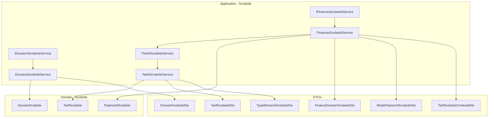
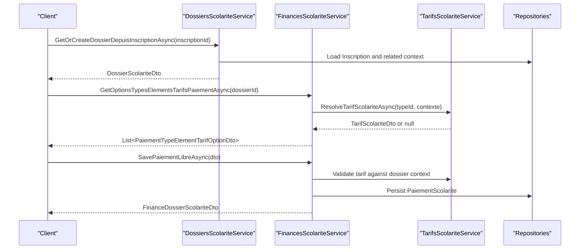
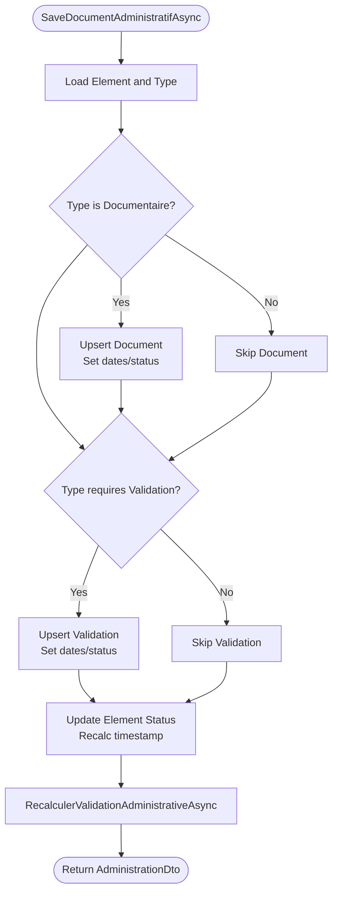
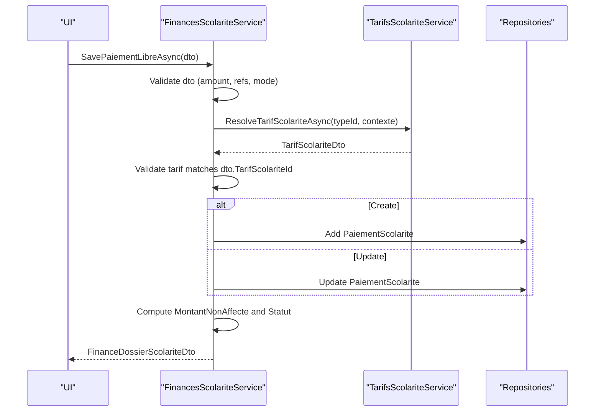
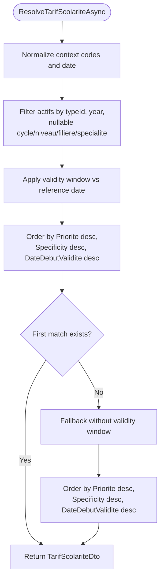
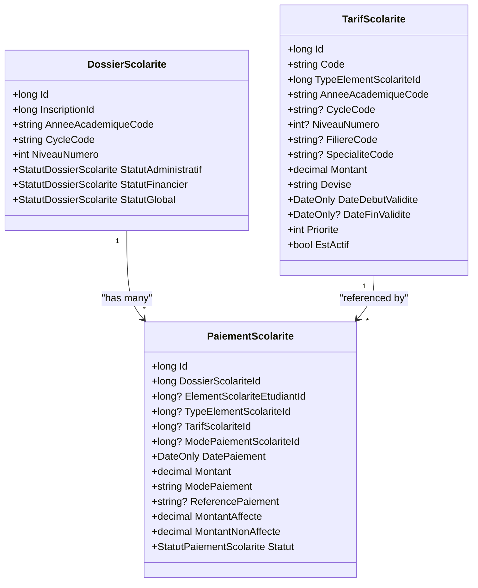
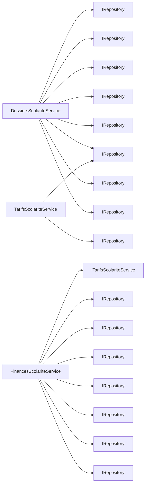

# Financial Administration Services

<cite>
**Referenced Files in This Document**
- [IDossiersScolariteService.cs](file://RIIS.Academic.Application/Scolarite/Services/IDossiersScolariteService.cs)
- [IFinancesScolariteService.cs](file://RIIS.Academic.Application/Scolarite/Services/IFinancesScolariteService.cs)
- [ITarifsScolariteService.cs](file://RIIS.Academic.Application/Scolarite/Services/ITarifsScolariteService.cs)
- [DossierScolariteDto.cs](file://RIIS.Academic.Application/Scolarite/Dtos/DossierScolariteDto.cs)
- [TarifScolariteDto.cs](file://RIIS.Academic.Application/Scolarite/Dtos/TarifScolariteDto.cs)
- [FinanceDossierScolariteDto.cs](file://RIIS.Academic.Application/Scolarite/Dtos/FinanceDossierScolariteDto.cs)
- [ModePaiementScolariteDto.cs](file://RIIS.Academic.Application/Scolarite/Dtos/ModePaiementScolariteDto.cs)
- [TarifScolariteContexteDto.cs](file://RIIS.Academic.Application/Scolarite/Dtos/TarifScolariteContexteDto.cs)
- [TypeElementScolariteDto.cs](file://RIIS.Academic.Application/Scolarite/Dtos/TypeElementScolariteDto.cs)
- [DossiersScolariteService.cs](file://RIIS.Academic.Application/Scolarite/Services/DossiersScolariteService.cs)
- [FinancesScolariteService.cs](file://RIIS.Academic.Application/Scolarite/Services/FinancesScolariteService.cs)
- [TarifsScolariteService.cs](file://RIIS.Academic.Application/Scolarite/Services/TarifsScolariteService.cs)
- [DossierScolarite.cs](file://RIIS.Academic.Domain/Scolarite/DossierScolarite.cs)
- [TarifScolarite.cs](file://RIIS.Academic.Domain/Scolarite/TarifScolarite.cs)
- [PaiementScolarite.cs](file://RIIS.Academic.Domain/Scolarite/PaiementScolarite.cs)
</cite>

## Table of Contents
1. Introduction
2. Project Structure
3. Core Components
4. Architecture Overview
5. Detailed Component Analysis
6. Dependency Analysis
7. Performance Considerations
8. Troubleshooting Guide
9. Conclusion

## Introduction
This document explains the Financial Administration service layer for managing tuition, payments, and financial records. It focuses on three core interfaces: IDossiersScolariteService (student financial files), IFinancesScolariteService (payments and balances), and ITarifsScolariteService (tuition fee structure). It also documents key DTOs for DossierScolarite, TarifScolarite, and payment-related objects, and describes workflows for fee resolution, payment recording, and financial reporting. Integration with enrollment services and patterns for external financial institution communication are outlined.

## Project Structure
The financial administration features reside in the Application layer under Scolarite, with domain models in the Domain layer. Services implement business logic and orchestrate persistence via repositories. DTOs define contracts for UI and API consumption.

**Diagram sources**
- [IDossiersScolariteService.cs:5-40](file://RIIS.Academic.Application/Scolarite/Services/IDossiersScolariteService.cs#L5-L40)
- [IFinancesScolariteService.cs:5-18](file://RIIS.Academic.Application/Scolarite/Services/IFinancesScolariteService.cs#L5-L18)
- [ITarifsScolariteService.cs:5-37](file://RIIS.Academic.Application/Scolarite/Services/ITarifsScolariteService.cs#L5-L37)
- [DossiersScolariteService.cs:7-21](file://RIIS.Academic.Application/Scolarite/Services/DossiersScolariteService.cs#L7-L21)
- [FinancesScolariteService.cs:7-15](file://RIIS.Academic.Application/Scolarite/Services/FinancesScolariteService.cs#L7-L15)
- [TarifsScolariteService.cs:10-12](file://RIIS.Academic.Application/Scolarite/Services/TarifsScolariteService.cs#L10-L12)
- [DossierScolarite.cs:3-28](file://RIIS.Academic.Domain/Scolarite/DossierScolarite.cs#L3-L28)
- [TarifScolarite.cs:3-21](file://RIIS.Academic.Domain/Scolarite/TarifScolarite.cs#L3-L21)
- [PaiementScolarite.cs:3-28](file://RIIS.Academic.Domain/Scolarite/PaiementScolarite.cs#L3-L28)

**Section sources**
- [IDossiersScolariteService.cs:5-40](file://RIIS.Academic.Application/Scolarite/Services/IDossiersScolariteService.cs#L5-L40)
- [IFinancesScolariteService.cs:5-18](file://RIIS.Academic.Application/Scolarite/Services/IFinancesScolariteService.cs#L5-L18)
- [ITarifsScolariteService.cs:5-37](file://RIIS.Academic.Application/Scolarite/Services/ITarifsScolariteService.cs#L5-L37)
- [DossiersScolariteService.cs:7-21](file://RIIS.Academic.Application/Scolarite/Services/DossiersScolariteService.cs#L7-L21)
- [FinancesScolariteService.cs:7-15](file://RIIS.Academic.Application/Scolarite/Services/FinancesScolariteService.cs#L7-L15)
- [TarifsScolariteService.cs:10-12](file://RIIS.Academic.Application/Scolarite/Services/TarifsScolariteService.cs#L10-L12)
- [DossierScolarite.cs:3-28](file://RIIS.Academic.Domain/Scolarite/DossierScolarite.cs#L3-L28)
- [TarifScolarite.cs:3-21](file://RIIS.Academic.Domain/Scolarite/TarifScolarite.cs#L3-L21)
- [PaiementScolarite.cs:3-28](file://RIIS.Academic.Domain/Scolarite/PaiementScolarite.cs#L3-L28)

## Core Components
- IDossiersScolariteService: Manages student financial files (dossiers), including listing, retrieval, creation from enrollment, administrative synchronization, document saving, and recalculating validation status.
- IFinancesScolariteService: Manages finances per dossier, including retrieving a financial snapshot, listing available payment options (type-element + tarif), and recording free-form payments.
- ITarifsScolariteService: Manages tuition fees (tarifs), including listing, creating defaults, generating codes, saving/deleting, and resolving the applicable tarif for a given context.

Key DTOs:
- DossierScolariteDto: Snapshot of a student’s academic file with statuses and identifiers.
- TarifScolariteDto: Represents a tuition fee record with amount, currency, validity dates, priority, and contextual filters.
- FinanceDossierScolariteDto: Aggregates elements, deadlines (échéances), payments, and allocations for a dossier.
- ModePaiementScolariteDto: Payment method metadata used when recording payments.
- TarifScolariteContexteDto: Context parameters used to resolve the correct tarif.
- TypeElementScolariteDto: Defines types of school elements (fees, documents, validations) and their properties.

**Section sources**
- [IDossiersScolariteService.cs:5-40](file://RIIS.Academic.Application/Scolarite/Services/IDossiersScolariteService.cs#L5-L40)
- [IFinancesScolariteService.cs:5-18](file://RIIS.Academic.Application/Scolarite/Services/IFinancesScolariteService.cs#L5-L18)
- [ITarifsScolariteService.cs:5-37](file://RIIS.Academic.Application/Scolarite/Services/ITarifsScolariteService.cs#L5-L37)
- [DossierScolariteDto.cs:5-29](file://RIIS.Academic.Application/Scolarite/Dtos/DossierScolariteDto.cs#L5-L29)
- [TarifScolariteDto.cs:3-22](file://RIIS.Academic.Application/Scolarite/Dtos/TarifScolariteDto.cs#L3-L22)
- [FinanceDossierScolariteDto.cs:5-83](file://RIIS.Academic.Application/Scolarite/Dtos/FinanceDossierScolariteDto.cs#L5-L83)
- [ModePaiementScolariteDto.cs:3-10](file://RIIS.Academic.Application/Scolarite/Dtos/ModePaiementScolariteDto.cs#L3-L10)
- [TarifScolariteContexteDto.cs:3-11](file://RIIS.Academic.Application/Scolarite/Dtos/TarifScolariteContexteDto.cs#L3-L11)
- [TypeElementScolariteDto.cs:5-17](file://RIIS.Academic.Application/Scolarite/Dtos/TypeElementScolariteDto.cs#L5-L17)

## Architecture Overview
The services follow a layered approach:
- Application services expose use cases through interfaces and coordinate data access via repositories.
- Domain entities model core concepts (dossier, tarif, payment).
- DTOs decouple UI/API contracts from internal models.
- TarifsScolariteService provides reusable fee resolution logic consumed by FinancesScolariteService.

**Diagram sources**
- [DossiersScolariteService.cs:277-317](file://RIIS.Academic.Application/Scolarite/Services/DossiersScolariteService.cs#L277-L317)
- [FinancesScolariteService.cs:28-56](file://RIIS.Academic.Application/Scolarite/Services/FinancesScolariteService.cs#L28-L56)
- [FinancesScolariteService.cs:58-141](file://RIIS.Academic.Application/Scolarite/Services/FinancesScolariteService.cs#L58-L141)
- [TarifsScolariteService.cs:195-238](file://RIIS.Academic.Application/Scolarite/Services/TarifsScolariteService.cs#L195-L238)

## Detailed Component Analysis

### IDossiersScolariteService and DossiersScolariteService
Responsibilities:
- Query dossiers with filters (academic year, cycle, level, filiere, speciality) and optional inclusion of enrollments without dossiers.
- Retrieve a single dossier or create one from an enrollment if missing.
- Synchronize administrative documents and validations for a dossier based on configured element types.
- Save administrative documents and validations, updating element statuses accordingly.
- Recalculate administrative and financial statuses based on document completeness and initial payments.

Key behaviors:
- Creates a snapshot of academic context at dossier creation time.
- Builds an administration view aggregating required documents and initial payments to determine authorization reasons.
- Updates global statuses based on document completion and payment presence.

**Diagram sources**
- [DossiersScolariteService.cs:164-252](file://RIIS.Academic.Application/Scolarite/Services/DossiersScolariteService.cs#L164-L252)
- [DossiersScolariteService.cs:254-275](file://RIIS.Academic.Application/Scolarite/Services/DossiersScolariteService.cs#L254-L275)

**Section sources**
- [IDossiersScolariteService.cs:5-40](file://RIIS.Academic.Application/Scolarite/Services/IDossiersScolariteService.cs#L5-L40)
- [DossiersScolariteService.cs:23-93](file://RIIS.Academic.Application/Scolarite/Services/DossiersScolariteService.cs#L23-L93)
- [DossiersScolariteService.cs:95-126](file://RIIS.Academic.Application/Scolarite/Services/DossiersScolariteService.cs#L95-L126)
- [DossiersScolariteService.cs:128-162](file://RIIS.Academic.Application/Scolarite/Services/DossiersScolariteService.cs#L128-L162)
- [DossiersScolariteService.cs:164-275](file://RIIS.Academic.Application/Scolarite/Services/DossiersScolariteService.cs#L164-L275)
- [DossiersScolariteService.cs:277-317](file://RIIS.Academic.Application/Scolarite/Services/DossiersScolariteService.cs#L277-L317)

### IFinancesScolariteService and FinancesScolariteService
Responsibilities:
- Provide a financial snapshot for a dossier including totals, elements, deadlines, payments, and allocations.
- Enumerate payable type-elements with resolved tarifs for the current dossier context.
- Record free-form payments with validation and update the financial snapshot.

Payment workflow highlights:
- Validates amount > 0, required references, and active payment mode.
- Resolves the applicable tarif for the selected type-element and validates it matches the request.
- Persists new or updated payments, computes non-allocated amounts, and updates status.

**Diagram sources**
- [FinancesScolariteService.cs:58-141](file://RIIS.Academic.Application/Scolarite/Services/FinancesScolariteService.cs#L58-L141)
- [FinancesScolariteService.cs:264-279](file://RIIS.Academic.Application/Scolarite/Services/FinancesScolariteService.cs#L264-L279)
- [TarifsScolariteService.cs:195-238](file://RIIS.Academic.Application/Scolarite/Services/TarifsScolariteService.cs#L195-L238)

**Section sources**
- [IFinancesScolariteService.cs:5-18](file://RIIS.Academic.Application/Scolarite/Services/IFinancesScolariteService.cs#L5-L18)
- [FinancesScolariteService.cs:17-26](file://RIIS.Academic.Application/Scolarite/Services/FinancesScolariteService.cs#L17-L26)
- [FinancesScolariteService.cs:28-56](file://RIIS.Academic.Application/Scolarite/Services/FinancesScolariteService.cs#L28-L56)
- [FinancesScolariteService.cs:58-141](file://RIIS.Academic.Application/Scolarite/Services/FinancesScolariteService.cs#L58-L141)
- [FinancesScolariteService.cs:143-193](file://RIIS.Academic.Application/Scolarite/Services/FinancesScolariteService.cs#L143-L193)
- [FinancesScolariteService.cs:264-302](file://RIIS.Academic.Application/Scolarite/Services/FinancesScolariteService.cs#L264-L302)

### ITarifsScolariteService and TarifsScolariteService
Responsibilities:
- List and filter tarifs by type-element, academic year, cycle, level, filiere, speciality, and activity status.
- Create default tarif templates and generate stable codes.
- Save and delete tarifs with validation and duplicate checks.
- Resolve the applicable tarif for a given context using priority and specificity rules.

Fee resolution algorithm:
- Filters actif tarifs matching type-element, academic year, and nullable context fields.
- Applies date validity window relative to a reference date.
- Orders by priority first, then specificity (more specific contexts win), then earliest effective date.

**Diagram sources**
- [TarifsScolariteService.cs:195-238](file://RIIS.Academic.Application/Scolarite/Services/TarifsScolariteService.cs#L195-L238)

**Section sources**
- [ITarifsScolariteService.cs:5-37](file://RIIS.Academic.Application/Scolarite/Services/ITarifsScolariteService.cs#L5-L37)
- [TarifsScolariteService.cs:14-70](file://RIIS.Academic.Application/Scolarite/Services/TarifsScolariteService.cs#L14-L70)
- [TarifsScolariteService.cs:72-94](file://RIIS.Academic.Application/Scolarite/Services/TarifsScolariteService.cs#L72-L94)
- [TarifsScolariteService.cs:96-105](file://RIIS.Academic.Application/Scolarite/Services/TarifsScolariteService.cs#L96-L105)
- [TarifsScolariteService.cs:107-185](file://RIIS.Academic.Application/Scolarite/Services/TarifsScolariteService.cs#L107-L185)
- [TarifsScolariteService.cs:187-193](file://RIIS.Academic.Application/Scolarite/Services/TarifsScolariteService.cs#L187-L193)
- [TarifsScolariteService.cs:195-238](file://RIIS.Academic.Application/Scolarite/Services/TarifsScolariteService.cs#L195-L238)

### Data Models and Relationships

**Diagram sources**
- [DossierScolarite.cs:3-28](file://RIIS.Academic.Domain/Scolarite/DossierScolarite.cs#L3-L28)
- [TarifScolarite.cs:3-21](file://RIIS.Academic.Domain/Scolarite/TarifScolarite.cs#L3-L21)
- [PaiementScolarite.cs:3-28](file://RIIS.Academic.Domain/Scolarite/PaiementScolarite.cs#L3-L28)

## Dependency Analysis
- DossiersScolariteService depends on multiple repositories to assemble administrative views and compute statuses.
- FinancesScolariteService depends on TarifsScolariteService for fee resolution and on repositories for payments, elements, deadlines, and modes.
- TarifsScolariteService depends on repositories for tarifs and types, and enforces uniqueness and validation constraints.

**Diagram sources**
- [DossiersScolariteService.cs:7-21](file://RIIS.Academic.Application/Scolarite/Services/DossiersScolariteService.cs#L7-L21)
- [FinancesScolariteService.cs:7-15](file://RIIS.Academic.Application/Scolarite/Services/FinancesScolariteService.cs#L7-L15)
- [TarifsScolariteService.cs:10-12](file://RIIS.Academic.Application/Scolarite/Services/TarifsScolariteService.cs#L10-L12)

**Section sources**
- [DossiersScolariteService.cs:7-21](file://RIIS.Academic.Application/Scolarite/Services/DossiersScolariteService.cs#L7-L21)
- [FinancesScolariteService.cs:7-15](file://RIIS.Academic.Application/Scolarite/Services/FinancesScolariteService.cs#L7-L15)
- [TarifsScolariteService.cs:10-12](file://RIIS.Academic.Application/Scolarite/Services/TarifsScolariteService.cs#L10-L12)

## Performance Considerations
- Batch loading: Services load full collections into memory for filtering; consider pagination or server-side queries for large datasets.
- Indexing: Ensure indexes on foreign keys (DossierScolariteId, TypeElementScolariteId, etc.) and frequently filtered fields (AnneeAcademiqueCode, CycleCode, NiveauNumero).
- Caching: Cache static lookups (types, modes) and computed snapshots where appropriate.
- Avoid N+1: Use eager loading or batched joins when building finance and administration DTOs.

[No sources needed since this section provides general guidance]

## Troubleshooting Guide
Common issues and resolutions:
- Missing dossier for enrollment: Use GetOrCreateDossierDepuisInscriptionAsync to ensure a dossier exists before financial operations.
- Invalid payment amount or references: SavePaiementLibreAsync enforces positive amounts and required references; validate inputs before calling.
- Tarif mismatch: If the selected tarif does not match the resolved tarif for the dossier context, the operation will fail; refresh options via GetOptionsTypesElementsTarifsPaiementAsync.
- Inactive payment mode: Ensure the chosen payment mode is active; otherwise, the save operation will reject.
- Administrative blockage: If documents are rejected or validations are rejected, element status becomes blocked; review and correct documents/validations.

Operational tips:
- After saving documents or validations, call RecalculerValidationAdministrativeAsync to update statuses consistently.
- When exporting reports, rely on FinanceDossierScolariteDto aggregates for totals and breakdowns.

**Section sources**
- [DossiersScolariteService.cs:128-162](file://RIIS.Academic.Application/Scolarite/Services/DossiersScolariteService.cs#L128-L162)
- [DossiersScolariteService.cs:254-275](file://RIIS.Academic.Application/Scolarite/Services/DossiersScolariteService.cs#L254-L275)
- [FinancesScolariteService.cs:58-141](file://RIIS.Academic.Application/Scolarite/Services/FinancesScolariteService.cs#L58-L141)
- [FinancesScolariteService.cs:28-56](file://RIIS.Academic.Application/Scolarite/Services/FinancesScolariteService.cs#L28-L56)

## Conclusion
The Financial Administration service layer provides robust capabilities for managing student financial files, tuition fees, and payments. IDossiersScolariteService ensures administrative readiness and status computation; IFinancesScolariteService handles payment recording and financial reporting; ITarifsScolariteService governs fee structures and resolution logic. Together, they enable accurate tuition calculation, reliable payment processing, and comprehensive financial visibility. For integration with external financial institutions, encapsulate communication within dedicated adapters invoked from FinancesScolariteService after successful payment persistence.

[No sources needed since this section summarizes without analyzing specific files]