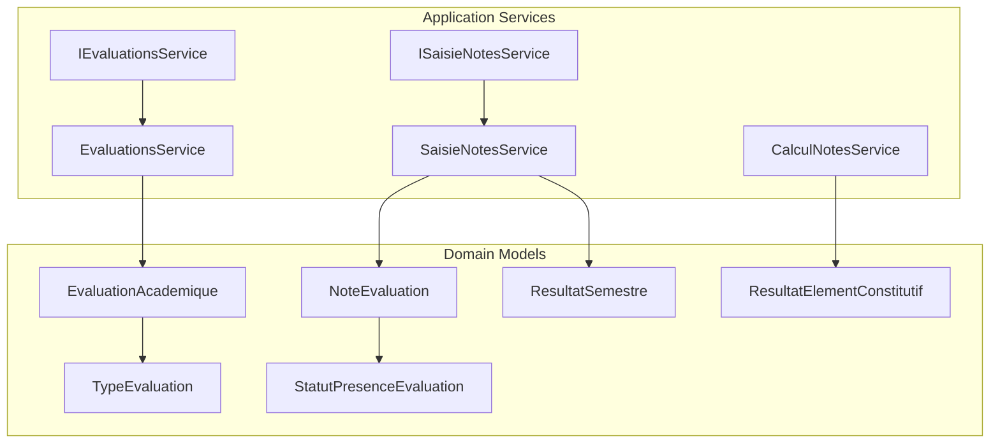
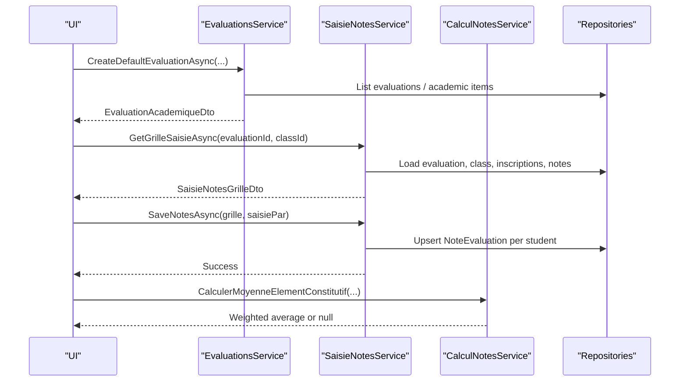
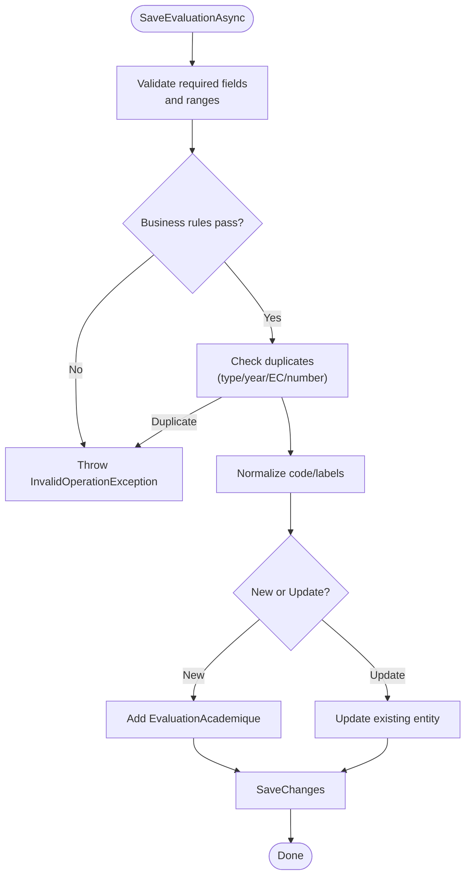
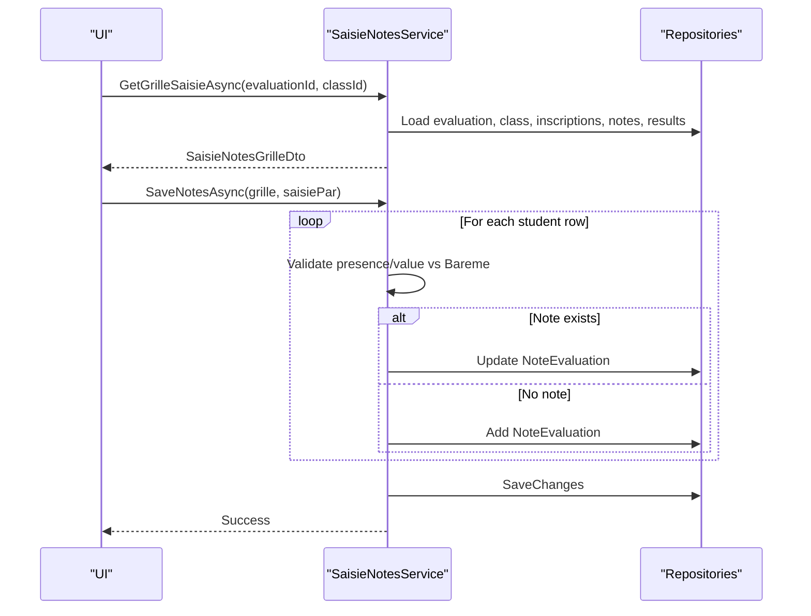
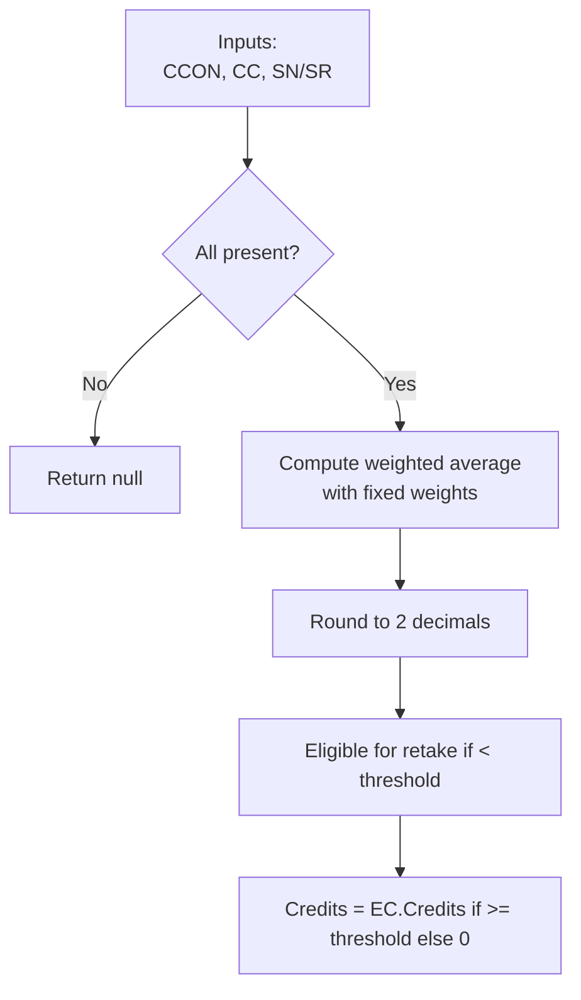
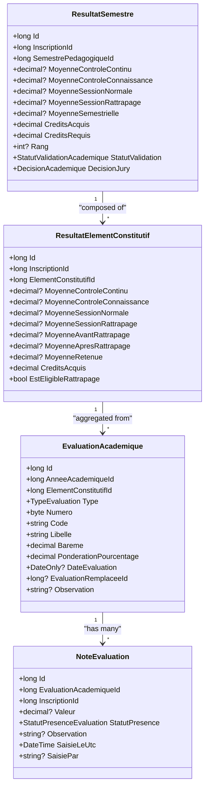
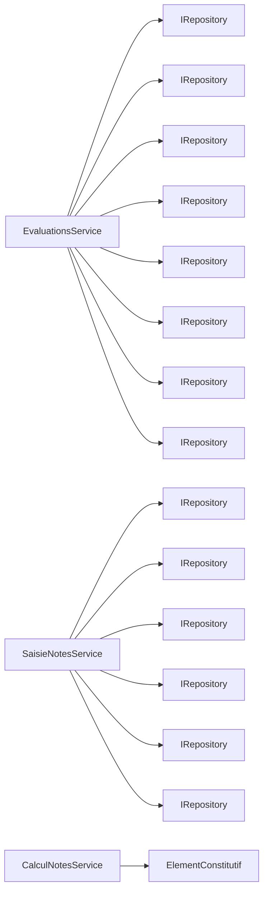

# Grade & Evaluation Services

<cite>
**Referenced Files in This Document**
- [IEvaluationsService.cs](file://RIIS.Academic.Application/Evaluations/Services/IEvaluationsService.cs)
- [EvaluationsService.cs](file://RIIS.Academic.Application/Evaluations/Services/EvaluationsService.cs)
- [EvaluationAcademiqueDto.cs](file://RIIS.Academic.Application/Evaluations/Dtos/EvaluationAcademiqueDto.cs)
- [ISaisieNotesService.cs](file://RIIS.Academic.Application/Notes/Services/ISaisieNotesService.cs)
- [SaisieNotesService.cs](file://RIIS.Academic.Application/Notes/Services/SaisieNotesService.cs)
- [CalculNotesService.cs](file://RIIS.Academic.Application/Notes/Services/CalculNotesService.cs)
- [SaisieNoteLigneDto.cs](file://RIIS.Academic.Application/Notes/Dtos/SaisieNoteLigneDto.cs)
- [SaisieNotesGrilleDto.cs](file://RIIS.Academic.Application/Notes/Dtos/SaisieNotesGrilleDto.cs)
- [EvaluationAcademique.cs](file://RIIS.Academic.Domain/Notes/EvaluationAcademique.cs)
- [NoteEvaluation.cs](file://RIIS.Academic.Domain/Notes/NoteEvaluation.cs)
- [ResultatElementConstitutif.cs](file://RIIS.Academic.Domain/Notes/ResultatElementConstitutif.cs)
- [ResultatSemestre.cs](file://RIIS.Academic.Domain/Notes/ResultatSemestre.cs)
- [TypeEvaluation.cs](file://RIIS.Academic.Domain/Enums/TypeEvaluation.cs)
- [StatutPresenceEvaluation.cs](file://RIIS.Academic.Domain/Enums/StatutPresenceEvaluation.cs)
</cite>

## Table of Contents
1. Introduction
2. Project Structure
3. Core Components
4. Architecture Overview
5. Detailed Component Analysis
6. Dependency Analysis
7. Performance Considerations
8. Troubleshooting Guide
9. Conclusion

## Introduction
This document explains the Grade and Evaluation service layer that manages academic evaluations, grade entry, and result computation. It focuses on:
- Managing evaluations via IEvaluationsService and EvaluationsService
- Bulk grade entry via ISaisieNotesService and SaisieNotesService
- Grade calculation logic in CalculNotesService
- Structured grade input models SaisieNoteLigneDto and SaisieNotesGrilleDto
- Grading scales, weight calculations, eligibility for retake sessions, and academic standing determination
- Integration with academic program structures (academic year, cycle, semester, unit, constituent element)

## Project Structure
The grade and evaluation capabilities are implemented across Application services and Domain models:
- Evaluations: definition, lookup, creation, and persistence of academic evaluations
- Notes: bulk grade capture per class and evaluation, validation, and persistence
- Calculations: aggregation of scores into constituent-level results and credit allocation
- Data transfer objects: structured inputs for grade grids and evaluation metadata

**Diagram sources**
- [IEvaluationsService.cs:7-47](file://RIIS.Academic.Application/Evaluations/Services/IEvaluationsService.cs#L7-L47)
- [EvaluationsService.cs:8-16](file://RIIS.Academic.Application/Evaluations/Services/EvaluationsService.cs#L8-L16)
- [ISaisieNotesService.cs:7-26](file://RIIS.Academic.Application/Notes/Services/ISaisieNotesService.cs#L7-L26)
- [SaisieNotesService.cs:8-17](file://RIIS.Academic.Application/Notes/Services/SaisieNotesService.cs#L8-L17)
- [CalculNotesService.cs:7-24](file://RIIS.Academic.Application/Notes/Services/CalculNotesService.cs#L7-L24)
- [EvaluationAcademique.cs:3-23](file://RIIS.Academic.Domain/Notes/EvaluationAcademique.cs#L3-L23)
- [NoteEvaluation.cs:3-16](file://RIIS.Academic.Domain/Notes/NoteEvaluation.cs#L3-L16)
- [ResultatElementConstitutif.cs:3-22](file://RIIS.Academic.Domain/Notes/ResultatElementConstitutif.cs#L3-L22)
- [ResultatSemestre.cs:3-22](file://RIIS.Academic.Domain/Notes/ResultatSemestre.cs#L3-L22)
- [TypeEvaluation.cs:3-9](file://RIIS.Academic.Domain/Enums/TypeEvaluation.cs#L3-L9)
- [StatutPresenceEvaluation.cs:3-9](file://RIIS.Academic.Domain/Enums/StatutPresenceEvaluation.cs#L3-L9)

**Section sources**
- [IEvaluationsService.cs:7-47](file://RIIS.Academic.Application/Evaluations/Services/IEvaluationsService.cs#L7-L47)
- [ISaisieNotesService.cs:7-26](file://RIIS.Academic.Application/Notes/Services/ISaisieNotesService.cs#L7-L26)
- [EvaluationsService.cs:8-16](file://RIIS.Academic.Application/Evaluations/Services/EvaluationsService.cs#L8-L16)
- [SaisieNotesService.cs:8-17](file://RIIS.Academic.Application/Notes/Services/SaisieNotesService.cs#L8-L17)
- [EvaluationAcademique.cs:3-23](file://RIIS.Academic.Domain/Notes/EvaluationAcademique.cs#L3-L23)
- [NoteEvaluation.cs:3-16](file://RIIS.Academic.Domain/Notes/NoteEvaluation.cs#L3-L16)
- [ResultatElementConstitutif.cs:3-22](file://RIIS.Academic.Domain/Notes/ResultatElementConstitutif.cs#L3-L22)
- [ResultatSemestre.cs:3-22](file://RIIS.Academic.Domain/Notes/ResultatSemestre.cs#L3-L22)
- [TypeEvaluation.cs:3-9](file://RIIS.Academic.Domain/Enums/TypeEvaluation.cs#L3-L9)
- [StatutPresenceEvaluation.cs:3-9](file://RIIS.Academic.Domain/Enums/StatutPresenceEvaluation.cs#L3-L9)

## Core Components
- IEvaluationsService: Defines operations to list, retrieve, create default, save, and delete academic evaluations; provides lookups for academic years, cycles, semesters, units, constituent elements, and normal sessions.
- EvaluationsService: Implements evaluation CRUD, filtering by academic structure, default generation, and validation rules for codes, labels, scales, weights, and session relationships.
- ISaisieNotesService: Provides lookups for academic context and a grid-based grade entry API for a given evaluation and class.
- SaisieNotesService: Builds a grade grid, validates presence and values against the evaluation scale, persists or updates NoteEvaluation records, and filters eligible students for retake sessions based on semester results.
- CalculNotesService: Computes constituent-level averages using defined weights, determines retake eligibility, and calculates credits earned based on thresholds.
- Dtos: SaisieNoteLigneDto represents a single student’s row in the grade grid; SaisieNotesGrilleDto represents the full grid including metadata and per-student rows.

**Section sources**
- [IEvaluationsService.cs:7-47](file://RIIS.Academic.Application/Evaluations/Services/IEvaluationsService.cs#L7-L47)
- [EvaluationsService.cs:17-294](file://RIIS.Academic.Application/Evaluations/Services/EvaluationsService.cs#L17-L294)
- [ISaisieNotesService.cs:7-26](file://RIIS.Academic.Application/Notes/Services/ISaisieNotesService.cs#L7-L26)
- [SaisieNotesService.cs:126-295](file://RIIS.Academic.Application/Notes/Services/SaisieNotesService.cs#L126-L295)
- [CalculNotesService.cs:7-24](file://RIIS.Academic.Application/Notes/Services/CalculNotesService.cs#L7-L24)
- [SaisieNoteLigneDto.cs:5-17](file://RIIS.Academic.Application/Notes/Dtos/SaisieNoteLigneDto.cs#L5-L17)
- [SaisieNotesGrilleDto.cs:5-19](file://RIIS.Academic.Application/Notes/Dtos/SaisieNotesGrilleDto.cs#L5-L19)

## Architecture Overview
The system separates concerns between evaluation management, grade capture, and calculation:
- EvaluationsService orchestrates evaluation definitions and their relationship to academic programs.
- SaisieNotesService handles bulk grade entry for a selected evaluation and class, enforcing validation and persisting notes.
- CalculNotesService encapsulates scoring formulas and decision rules used when computing constituent-level outcomes.

**Diagram sources**
- [EvaluationsService.cs:142-294](file://RIIS.Academic.Application/Evaluations/Services/EvaluationsService.cs#L142-L294)
- [SaisieNotesService.cs:126-295](file://RIIS.Academic.Application/Notes/Services/SaisieNotesService.cs#L126-L295)
- [CalculNotesService.cs:9-23](file://RIIS.Academic.Application/Notes/Services/CalculNotesService.cs#L9-L23)

## Detailed Component Analysis

### IEvaluationsService and EvaluationsService
Responsibilities:
- Query evaluations with multi-criteria filters tied to academic hierarchy (year, cycle, semester, unit, constituent element).
- Create default evaluations with computed code, label, number, and default weighting.
- Persist evaluations with strict validation: required fields, valid scale, percentage bounds, and business rules for retake sessions replacing normal sessions.
- Provide lookups for all relevant academic entities.

Key behaviors:
- Default ponderation varies by evaluation type.
- Duplicate prevention ensures uniqueness per type, year, and constituent element.
- Retake sessions must reference a normal session within the same year and constituent element.

**Diagram sources**
- [EvaluationsService.cs:172-294](file://RIIS.Academic.Application/Evaluations/Services/EvaluationsService.cs#L172-L294)

**Section sources**
- [IEvaluationsService.cs:7-47](file://RIIS.Academic.Application/Evaluations/Services/IEvaluationsService.cs#L7-L47)
- [EvaluationsService.cs:17-294](file://RIIS.Academic.Application/Evaluations/Services/EvaluationsService.cs#L17-L294)
- [EvaluationAcademiqueDto.cs:5-29](file://RIIS.Academic.Application/Evaluations/Dtos/EvaluationAcademiqueDto.cs#L5-L29)

### ISaisieNotesService and SaisieNotesService
Responsibilities:
- Provide lookups for academic context and evaluations.
- Build a grade grid for an evaluation and class, including student info, current notes, and eligibility flags.
- Validate and persist grades in bulk.

Grade grid behavior:
- Filters eligible students for retake sessions based on semester results.
- Validates presence and value range against the evaluation’s scale.
- Upserts NoteEvaluation records with timestamps and operator tracking.

**Diagram sources**
- [SaisieNotesService.cs:126-295](file://RIIS.Academic.Application/Notes/Services/SaisieNotesService.cs#L126-L295)

**Section sources**
- [ISaisieNotesService.cs:7-26](file://RIIS.Academic.Application/Notes/Services/ISaisieNotesService.cs#L7-L26)
- [SaisieNotesService.cs:19-295](file://RIIS.Academic.Application/Notes/Services/SaisieNotesService.cs#L19-L295)
- [SaisieNoteLigneDto.cs:5-17](file://RIIS.Academic.Application/Notes/Dtos/SaisieNoteLigneDto.cs#L5-L17)
- [SaisieNotesGrilleDto.cs:5-19](file://RIIS.Academic.Application/Notes/Dtos/SaisieNotesGrilleDto.cs#L5-L19)

### CalculNotesService: Grade Calculation and Aggregation
Responsibilities:
- Compute constituent-level averages using weighted contributions from continuous assessment, knowledge control, and session scores.
- Determine retake eligibility based on threshold.
- Calculate credits earned based on retained average.

Algorithm details:
- Weighted average combines three components with fixed weights.
- Retake eligibility is true when the constituent average is below the passing threshold.
- Credits are awarded only when the retained average meets or exceeds the passing threshold.

**Diagram sources**
- [CalculNotesService.cs:9-23](file://RIIS.Academic.Application/Notes/Services/CalculNotesService.cs#L9-L23)

**Section sources**
- [CalculNotesService.cs:7-24](file://RIIS.Academic.Application/Notes/Services/CalculNotesService.cs#L7-L24)
- [ResultatElementConstitutif.cs:3-22](file://RIIS.Academic.Domain/Notes/ResultatElementConstitutif.cs#L3-L22)

### Data Models and Relationships

**Diagram sources**
- [EvaluationAcademique.cs:3-23](file://RIIS.Academic.Domain/Notes/EvaluationAcademique.cs#L3-L23)
- [NoteEvaluation.cs:3-16](file://RIIS.Academic.Domain/Notes/NoteEvaluation.cs#L3-L16)
- [ResultatElementConstitutif.cs:3-22](file://RIIS.Academic.Domain/Notes/ResultatElementConstitutif.cs#L3-L22)
- [ResultatSemestre.cs:3-22](file://RIIS.Academic.Domain/Notes/ResultatSemestre.cs#L3-L22)

## Dependency Analysis
- EvaluationsService depends on multiple repositories to filter and assemble evaluation data across the academic hierarchy.
- SaisieNotesService depends on repositories for evaluations, classes, inscriptions, students, notes, and semester results to build and validate grade grids.
- CalculNotesService is stateless and encapsulates pure calculation logic used by higher layers when computing constituent-level outcomes.

**Diagram sources**
- [EvaluationsService.cs:8-16](file://RIIS.Academic.Application/Evaluations/Services/EvaluationsService.cs#L8-L16)
- [SaisieNotesService.cs:8-17](file://RIIS.Academic.Application/Notes/Services/SaisieNotesService.cs#L8-L17)
- [CalculNotesService.cs:7-24](file://RIIS.Academic.Application/Notes/Services/CalculNotesService.cs#L7-L24)

**Section sources**
- [EvaluationsService.cs:8-16](file://RIIS.Academic.Application/Evaluations/Services/EvaluationsService.cs#L8-L16)
- [SaisieNotesService.cs:8-17](file://RIIS.Academic.Application/Notes/Services/SaisieNotesService.cs#L8-L17)
- [CalculNotesService.cs:7-24](file://RIIS.Academic.Application/Notes/Services/CalculNotesService.cs#L7-L24)

## Performance Considerations
- Bulk grade saving iterates per student row; ensure efficient repository queries and minimal round-trips where possible.
- Filtering in EvaluationsService uses in-memory sets for IDs to reduce repeated joins; consider database-side filtering for very large datasets.
- Avoid unnecessary loading of full entity graphs; load only needed identifiers and map to DTOs efficiently.
- Use CancellationToken consistently to support cancellation during long-running operations.

[No sources needed since this section provides general guidance]

## Troubleshooting Guide
Common validation errors and their causes:
- Missing or invalid evaluation fields: Ensure academic year, constituent element, code, label, scale, and percentage are provided and within allowed ranges.
- Invalid retake session configuration: A retake session must replace a normal session within the same academic year and constituent element.
- Duplicate evaluation: Only one evaluation per type, academic year, and constituent element is allowed; numbers must be unique within that scope.
- Grade out of range: Student grades must be between 0 and the evaluation’s scale when marked present; absent/dispened statuses clear the value.
- Class mismatch: The selected class must belong to the same academic year as the evaluation.

Operational tips:
- When building the grade grid for retake sessions, if no semester results exist yet, all students may be shown provisionally; compute semester results first to filter eligible students accurately.
- Track who entered grades and when via operator and timestamp fields for auditability.

**Section sources**
- [EvaluationsService.cs:172-294](file://RIIS.Academic.Application/Evaluations/Services/EvaluationsService.cs#L172-L294)
- [SaisieNotesService.cs:126-295](file://RIIS.Academic.Application/Notes/Services/SaisieNotesService.cs#L126-L295)

## Conclusion
The Grade and Evaluation service layer provides a robust foundation for managing academic evaluations and capturing grades at scale. EvaluationsService enforces domain rules for evaluation setup and integrity, while SaisieNotesService enables efficient, validated bulk entry of grades per class and evaluation. CalculNotesService centralizes scoring logic and decision rules for constituent-level outcomes and credit allocation. Together, these components integrate tightly with academic program structures to support accurate grading workflows and reliable result computation.

[No sources needed since this section summarizes without analyzing specific files]