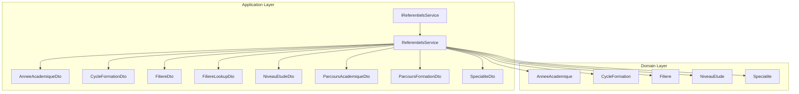
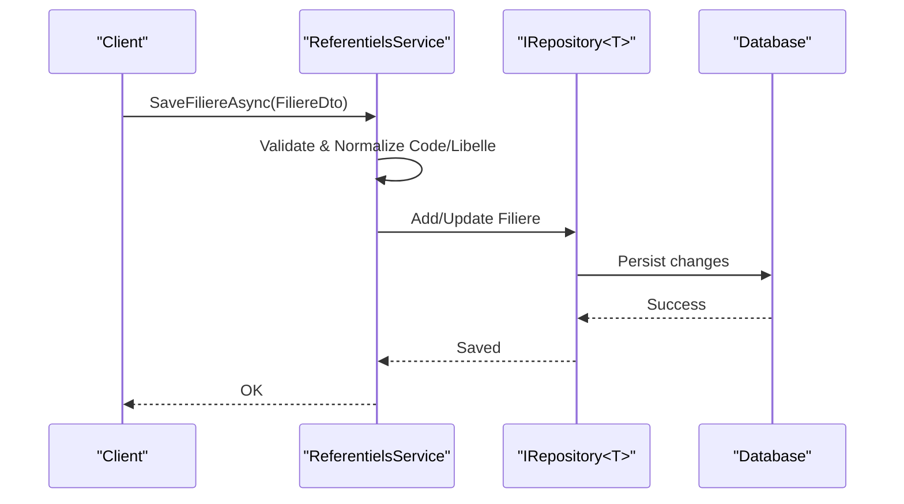
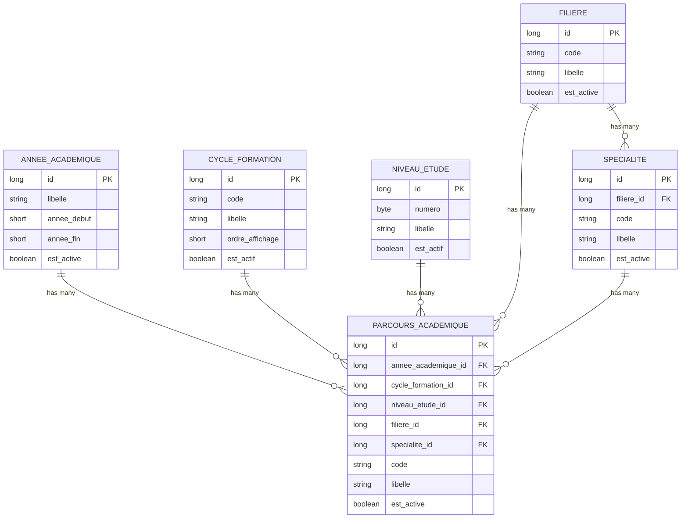
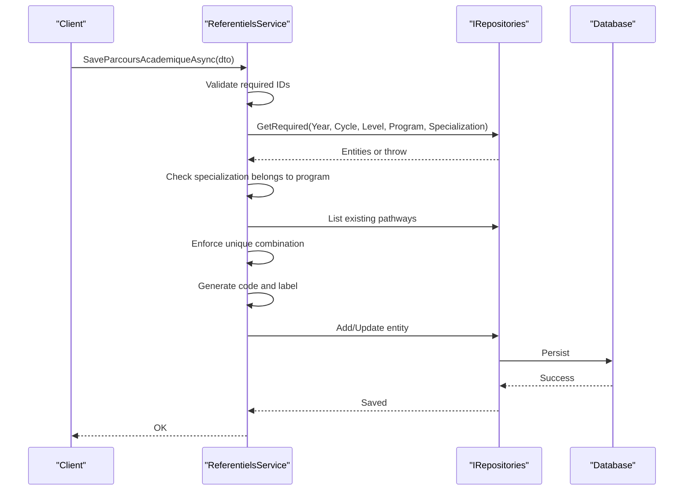
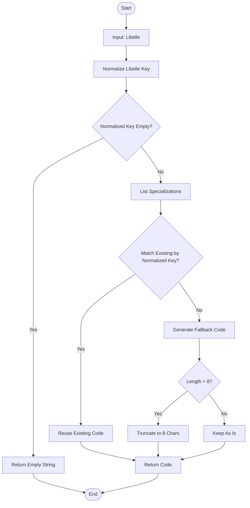
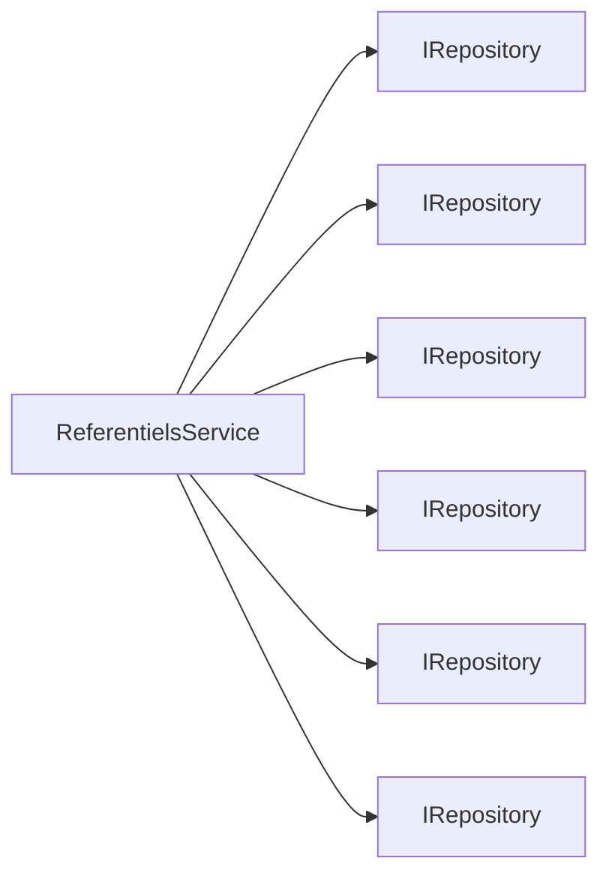

# Reference Data Services

<cite>
**Referenced Files in This Document**
- [IReferentielsService.cs](file://RIIS.Academic.Application/Referentiels/Services/IReferentielsService.cs)
- [ReferentielsService.cs](file://RIIS.Academic.Application/Referentiels/Services/ReferentielsService.cs)
- [AnneeAcademiqueDto.cs](file://RIIS.Academic.Application/Referentiels/Dtos/AnneeAcademiqueDto.cs)
- [CycleFormationDto.cs](file://RIIS.Academic.Application/Referentiels/Dtos/CycleFormationDto.cs)
- [FiliereDto.cs](file://RIIS.Academic.Application/Referentiels/Dtos/FiliereDto.cs)
- [FiliereLookupDto.cs](file://RIIS.Academic.Application/Referentiels/Dtos/FiliereLookupDto.cs)
- [NiveauEtudeDto.cs](file://RIIS.Academic.Application/Referentiels/Dtos/NiveauEtudeDto.cs)
- [ParcoursAcademiqueDto.cs](file://RIIS.Academic.Application/Referentiels/Dtos/ParcoursAcademiqueDto.cs)
- [ParcoursFormationDto.cs](file://RIIS.Academic.Application/Referentiels/Dtos/ParcoursFormationDto.cs)
- [SpecialiteDto.cs](file://RIIS.Academic.Application/Referentiels/Dtos/SpecialiteDto.cs)
- [AnneeAcademique.cs](file://RIIS.Academic.Domain/Referentiels/AnneeAcademique.cs)
- [CycleFormation.cs](file://RIIS.Academic.Domain/Referentiels/CycleFormation.cs)
- [Filiere.cs](file://RIIS.Academic.Domain/Referentiels/Filiere.cs)
- [NiveauEtude.cs](file://RIIS.Academic.Domain/Referentiels/NiveauEtude.cs)
- [Specialite.cs](file://RIIS.Academic.Domain/Referentiels/Specialite.cs)
</cite>

## Table of Contents
1. Introduction
2. Project Structure
3. Core Components
4. Architecture Overview
5. Detailed Component Analysis
6. Dependency Analysis
7. Performance Considerations
8. Troubleshooting Guide
9. Conclusion

## Introduction
This document explains the Reference Data service layer that manages institutional reference data for academic operations. It focuses on the IReferentielsService interface and its ReferentielsService implementation, covering entities such as Academic Year (AnneeAcademique), Education Cycle (CycleFormation), Program (Filiere), Study Level (NiveauEtude), Specialization (Specialite), and their combinations into Academic Pathways (ParcoursAcademique). The service provides CRUD operations, lookup endpoints, hierarchy maintenance, validation rules, code generation, and standardized terminology support across application modules.

## Project Structure
The Reference Data feature is organized under the Application layer with a clear separation between interfaces, implementations, DTOs, and domain models:
- Interface and implementation: IReferentielsService and ReferentielsService
- DTOs: strongly-typed contracts for each reference entity and composite views
- Domain entities: canonical models used by persistence and other layers

**Diagram sources**
- [IReferentielsService.cs:5-45](file://RIIS.Academic.Application/Referentiels/Services/IReferentielsService.cs#L5-L45)
- [ReferentielsService.cs:7-13](file://RIIS.Academic.Application/Referentiels/Services/ReferentielsService.cs#L7-L13)
- [AnneeAcademiqueDto.cs:3-10](file://RIIS.Academic.Application/Referentiels/Dtos/AnneeAcademiqueDto.cs#L3-L10)
- [CycleFormationDto.cs:3-10](file://RIIS.Academic.Application/Referentiels/Dtos/CycleFormationDto.cs#L3-L10)
- [FiliereDto.cs:3-9](file://RIIS.Academic.Application/Referentiels/Dtos/FiliereDto.cs#L3-L9)
- [FiliereLookupDto.cs:1-10](file://RIIS.Academic.Application/Referentiels/Dtos/FiliereLookupDto.cs#L1-L10)
- [NiveauEtudeDto.cs:3-9](file://RIIS.Academic.Application/Referentiels/Dtos/NiveauEtudeDto.cs#L3-L9)
- [ParcoursAcademiqueDto.cs:3-24](file://RIIS.Academic.Application/Referentiels/Dtos/ParcoursAcademiqueDto.cs#L3-L24)
- [ParcoursFormationDto.cs:3-18](file://RIIS.Academic.Application/Referentiels/Dtos/ParcoursFormationDto.cs#L3-L18)
- [SpecialiteDto.cs:3-12](file://RIIS.Academic.Application/Referentiels/Dtos/SpecialiteDto.cs#L3-L12)
- [AnneeAcademique.cs:3-14](file://RIIS.Academic.Domain/Referentiels/AnneeAcademique.cs#L3-L14)
- [CycleFormation.cs:3-12](file://RIIS.Academic.Domain/Referentiels/CycleFormation.cs#L3-L12)
- [Filiere.cs:3-12](file://RIIS.Academic.Domain/Referentiels/Filiere.cs#L3-L12)
- [NiveauEtude.cs:3-13](file://RIIS.Academic.Domain/Referentiels/NiveauEtude.cs#L3-L13)
- [Specialite.cs:3-13](file://RIIS.Academic.Domain/Referentiels/Specialite.cs#L3-L13)

**Section sources**
- [IReferentielsService.cs:5-45](file://RIIS.Academic.Application/Referentiels/Services/IReferentielsService.cs#L5-L45)
- [ReferentielsService.cs:7-13](file://RIIS.Academic.Application/Referentiels/Services/ReferentielsService.cs#L7-L13)

## Core Components
- IReferentielsService defines the contract for managing reference data:
  - Academic Year: list, create default, save, delete
  - Education Cycle: list, create default, save, delete
  - Programs (Filiere): list, create default, save, delete
  - Specializations (Specialite): list, lookup active programs, create default, generate code, save, delete
  - Study Levels (NiveauEtude): list, create default, save, delete
  - Academic Pathways (ParcoursAcademique): filtered list, create default, save, delete
  - Training Pathways (ParcoursFormation): enriched list including cycle/program/specialization details

- ReferentielsService implements these operations using repositories for persistence, applying validation, normalization, and business rules.

Key responsibilities:
- Lookup data management: provide lists and lookups for UI and downstream services
- Hierarchy maintenance: ensure valid relationships (e.g., specialization belongs to program; pathway links year, cycle, level, program, specialization)
- Data validation: enforce required fields, numeric constraints, and consistency checks
- Standardized terminology: normalize codes and labels, generate consistent identifiers

**Section sources**
- [IReferentielsService.cs:7-44](file://RIIS.Academic.Application/Referentiels/Services/IReferentielsService.cs#L7-L44)
- [ReferentielsService.cs:15-709](file://RIIS.Academic.Application/Referentiels/Services/ReferentielsService.cs#L15-L709)

## Architecture Overview
The service layer sits between consumers (API/Web) and persistence via generic repositories. It orchestrates reads/writes, enforces business rules, and returns DTOs to decouple UI from domain models.

**Diagram sources**
- [ReferentielsService.cs:371-396](file://RIIS.Academic.Application/Referentiels/Services/ReferentielsService.cs#L371-L396)
- [FiliereDto.cs:3-9](file://RIIS.Academic.Application/Referentiels/Dtos/FiliereDto.cs#L3-L9)
- [Filiere.cs:3-12](file://RIIS.Academic.Domain/Referentiels/Filiere.cs#L3-L12)

## Detailed Component Analysis

### Academic Year (AnneeAcademique)
- Purpose: Define academic periods with start/end years and active flag.
- Operations:
  - List sorted by start year descending
  - Create default with current year range and active
  - Save with validation: label required, end = start + 1
  - Delete

Validation and behavior:
- Label must be present
- End year must equal start year + 1
- Default creation sets next academic year range and active status

**Section sources**
- [ReferentielsService.cs:15-82](file://RIIS.Academic.Application/Referentiels/Services/ReferentielsService.cs#L15-L82)
- [AnneeAcademiqueDto.cs:3-10](file://RIIS.Academic.Application/Referentiels/Dtos/AnneeAcademiqueDto.cs#L3-L10)
- [AnneeAcademique.cs:3-14](file://RIIS.Academic.Domain/Referentiels/AnneeAcademique.cs#L3-L14)

### Education Cycle (CycleFormation)
- Purpose: Define education cycles (e.g., Bachelor, Master) with display order and active status.
- Operations:
  - List ordered by display order then label
  - Create default empty DTO
  - Save with normalized code and required label
  - Delete

Normalization:
- Codes are uppercased and trimmed
- Display order controls UI ordering

**Section sources**
- [ReferentielsService.cs:84-100](file://RIIS.Academic.Application/Referentiels/Services/ReferentielsService.cs#L84-L100)
- [ReferentielsService.cs:316-351](file://RIIS.Academic.Application/Referentiels/Services/ReferentielsService.cs#L316-L351)
- [CycleFormationDto.cs:3-10](file://RIIS.Academic.Application/Referentiels/Dtos/CycleFormationDto.cs#L3-L10)
- [CycleFormation.cs:3-12](file://RIIS.Academic.Domain/Referentiels/CycleFormation.cs#L3-L12)

### Program (Filiere)
- Purpose: Define academic programs within cycles.
- Operations:
  - List sorted by label
  - Create default empty DTO
  - Save with normalized code and required label
  - Delete
  - Lookup active programs for dropdowns

Validation:
- Code normalized and required
- Label required
- Active flag supports filtering

**Section sources**
- [ReferentielsService.cs:353-402](file://RIIS.Academic.Application/Referentiels/Services/ReferentielsService.cs#L353-L402)
- [FiliereDto.cs:3-9](file://RIIS.Academic.Application/Referentiels/Dtos/FiliereDto.cs#L3-L9)
- [FiliereLookupDto.cs:1-10](file://RIIS.Academic.Application/Referentiels/Dtos/FiliereLookupDto.cs#L1-L10)
- [Filiere.cs:3-12](file://RIIS.Academic.Domain/Referentiels/Filiere.cs#L3-L12)

### Specialization (Specialite)
- Purpose: Define specializations under a program.
- Operations:
  - List joined with program labels for display
  - Create default with optional program and cycle prefill
  - Generate code based on label or reuse existing normalized key
  - Save with required program, label, and normalized code
  - Delete

Code generation:
- If no code provided, generate from label using normalization and fallback algorithm
- Reuse existing code when label matches normalized key

Validation:
- Program ID required
- Label required
- Code normalized and required

**Section sources**
- [ReferentielsService.cs:404-483](file://RIIS.Academic.Application/Referentiels/Services/ReferentielsService.cs#L404-L483)
- [ReferentielsService.cs:552-597](file://RIIS.Academic.Application/Referentiels/Services/ReferentielsService.cs#L552-L597)
- [SpecialiteDto.cs:3-12](file://RIIS.Academic.Application/Referentiels/Dtos/SpecialiteDto.cs#L3-L12)
- [Specialite.cs:3-13](file://RIIS.Academic.Domain/Referentiels/Specialite.cs#L3-L13)

### Study Level (NiveauEtude)
- Purpose: Define study levels with numeric ordering and labels.
- Operations:
  - List sorted by number
  - Create default with next sequential number
  - Save with minimum number validation and required label
  - Delete

Validation:
- Number must be >= 1
- Label required
- Auto-incremented default number avoids gaps

**Section sources**
- [ReferentielsService.cs:599-659](file://RIIS.Academic.Application/Referentiels/Services/ReferentielsService.cs#L599-L659)
- [NiveauEtudeDto.cs:3-9](file://RIIS.Academic.Application/Referentiels/Dtos/NiveauEtudeDto.cs#L3-L9)
- [NiveauEtude.cs:3-13](file://RIIS.Academic.Domain/Referentiels/NiveauEtude.cs#L3-L13)

### Academic Pathway (ParcoursAcademique)
- Purpose: Link an academic year with a combination of cycle, level, program, and specialization to form a concrete pathway.
- Operations:
  - Filtered list by year, cycle, level, program, specialization; include/exclude inactive
  - Create default with optional year prefilled
  - Save with comprehensive validation and uniqueness enforcement
  - Delete

Business rules:
- All references (year, cycle, level, program, specialization) required
- Specialization must belong to selected program
- Unique combination per academic year and referenced entities
- Code and label generated if not provided

Code and label generation:
- Code format includes year suffix, cycle code, level number, program code, specialization code
- Label composes readable text from all components

Enriched mapping:
- Maps to DTOs with denormalized codes and labels for efficient UI rendering

**Section sources**
- [ReferentielsService.cs:102-212](file://RIIS.Academic.Application/Referentiels/Services/ReferentielsService.cs#L102-L212)
- [ReferentielsService.cs:214-314](file://RIIS.Academic.Application/Referentiels/Services/ReferentielsService.cs#L214-L314)
- [ReferentielsService.cs:485-541](file://RIIS.Academic.Application/Referentiels/Services/ReferentielsService.cs#L485-L541)
- [ParcoursAcademiqueDto.cs:3-24](file://RIIS.Academic.Application/Referentiels/Dtos/ParcoursAcademiqueDto.cs#L3-L24)
- [ParcoursFormationDto.cs:3-18](file://RIIS.Academic.Application/Referentiels/Dtos/ParcoursFormationDto.cs#L3-L18)

### Data Models Diagram

**Diagram sources**
- [AnneeAcademique.cs:3-14](file://RIIS.Academic.Domain/Referentiels/AnneeAcademique.cs#L3-L14)
- [CycleFormation.cs:3-12](file://RIIS.Academic.Domain/Referentiels/CycleFormation.cs#L3-L12)
- [NiveauEtude.cs:3-13](file://RIIS.Academic.Domain/Referentiels/NiveauEtude.cs#L3-L13)
- [Filiere.cs:3-12](file://RIIS.Academic.Domain/Referentiels/Filiere.cs#L3-L12)
- [Specialite.cs:3-13](file://RIIS.Academic.Domain/Referentiels/Specialite.cs#L3-L13)

### Sequence: Save Academic Pathway

**Diagram sources**
- [ReferentielsService.cs:221-308](file://RIIS.Academic.Application/Referentiels/Services/ReferentielsService.cs#L221-L308)

### Flowchart: Specialization Code Generation

**Diagram sources**
- [ReferentielsService.cs:446-483](file://RIIS.Academic.Application/Referentiels/Services/ReferentielsService.cs#L446-L483)

## Dependency Analysis
- Coupling:
  - ReferentielsService depends on IRepository<T> abstractions for persistence, keeping it infrastructure-agnostic
  - Strong cohesion around reference data entities and their DTOs
- External dependencies:
  - Generic repository pattern abstracts EF Core or other storage
  - No direct ORM usage in service layer
- Potential risks:
  - In-memory joins and filters may scale poorly with large datasets; consider server-side filtering where possible
  - Duplicate checks load full collections; indexing and query optimization can mitigate performance issues

**Diagram sources**
- [ReferentielsService.cs:7-13](file://RIIS.Academic.Application/Referentiels/Services/ReferentielsService.cs#L7-L13)

**Section sources**
- [ReferentielsService.cs:7-13](file://RIIS.Academic.Application/Referentiels/Services/ReferentielsService.cs#L7-L13)

## Performance Considerations
- Use server-side filtering for large reference datasets where supported by repositories
- Avoid unnecessary joins in memory; prefer database-level queries when possible
- Index foreign keys and frequently filtered columns (e.g., EstActive, Numero, OrdreAffichage)
- Cache read-only lookups (e.g., active programs) at API or caching layer if accessed frequently

[No sources needed since this section provides general guidance]

## Troubleshooting Guide
Common validation errors and their causes:
- Academic Year:
  - End year must equal start year + 1
  - Label required
- Academic Pathway:
  - All referenced IDs required
  - Specialization must belong to selected program
  - Unique combination enforced per academic year and references
- Specialization:
  - Program ID required
  - Label required
  - Code normalized and required; auto-generated if missing
- Study Level:
  - Number must be >= 1
  - Label required

Error handling approach:
- Validation failures throw InvalidOperationException with descriptive messages
- Missing references throw explicit errors during required entity retrieval

Operational tips:
- Ensure referential integrity before saving pathways
- Use lookup endpoints to populate dropdowns with active items only
- When updating, verify entity existence before mutation

**Section sources**
- [ReferentielsService.cs:45-82](file://RIIS.Academic.Application/Referentiels/Services/ReferentielsService.cs#L45-L82)
- [ReferentielsService.cs:221-308](file://RIIS.Academic.Application/Referentiels/Services/ReferentielsService.cs#L221-L308)
- [ReferentielsService.cs:552-597](file://RIIS.Academic.Application/Referentiels/Services/ReferentielsService.cs#L552-L597)
- [ReferentielsService.cs:624-659](file://RIIS.Academic.Application/Referentiels/Services/ReferentielsService.cs#L624-L659)

## Conclusion
The Reference Data service layer provides a robust, validated, and normalized foundation for institutional reference data. It ensures consistent terminology, enforces hierarchy and integrity rules, and exposes clean DTOs for consumption by other modules. By centralizing logic for code generation, labeling, and relationship validation, it standardizes how academic structures are represented throughout the system, enabling reliable downstream features like enrollment, scheduling, and reporting.