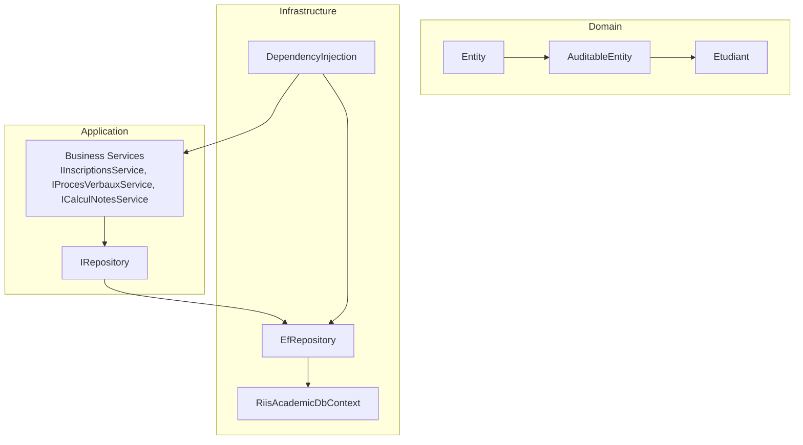
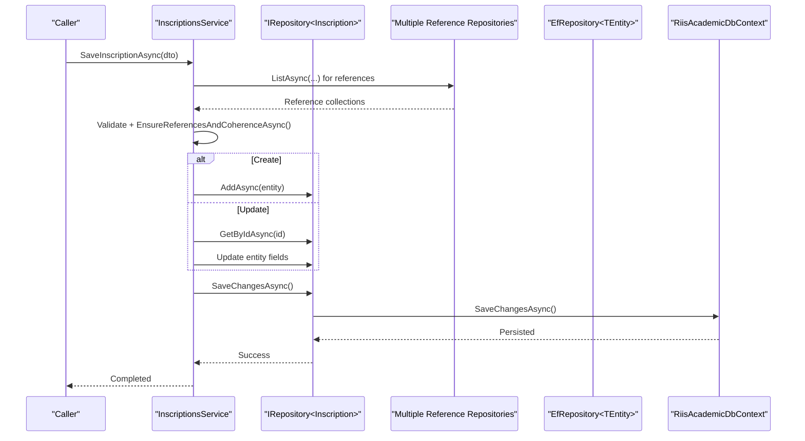
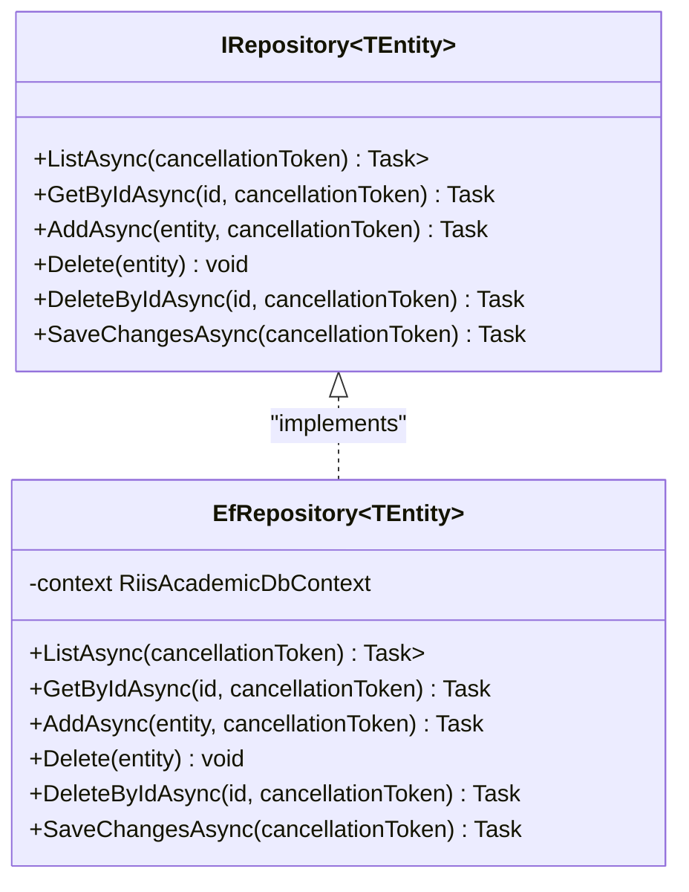
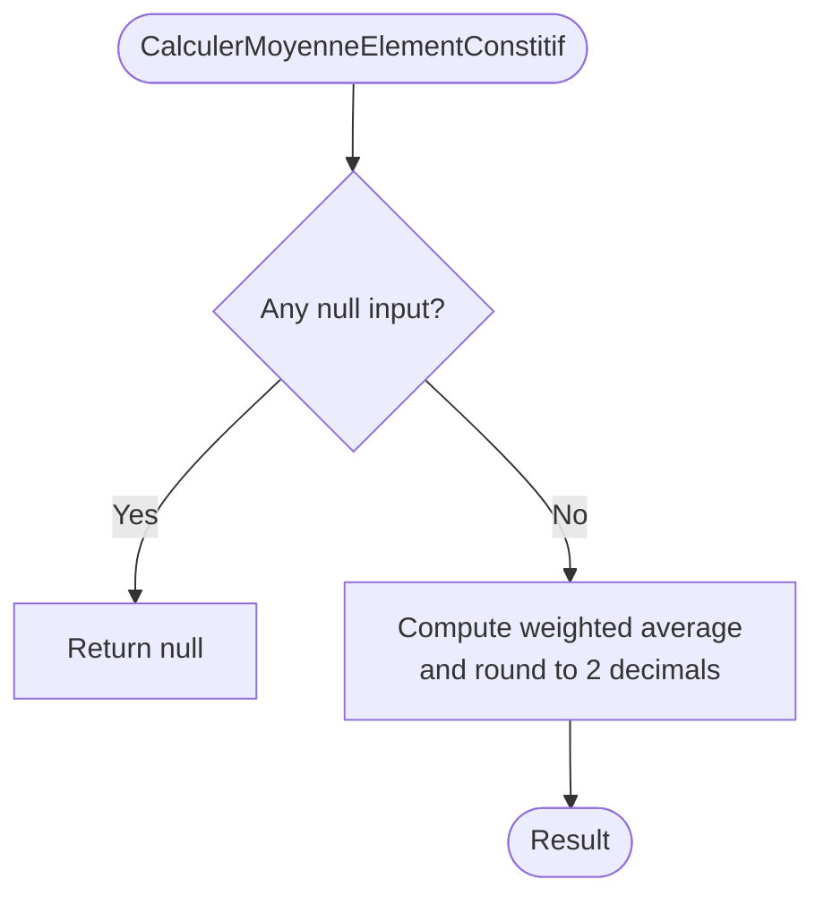
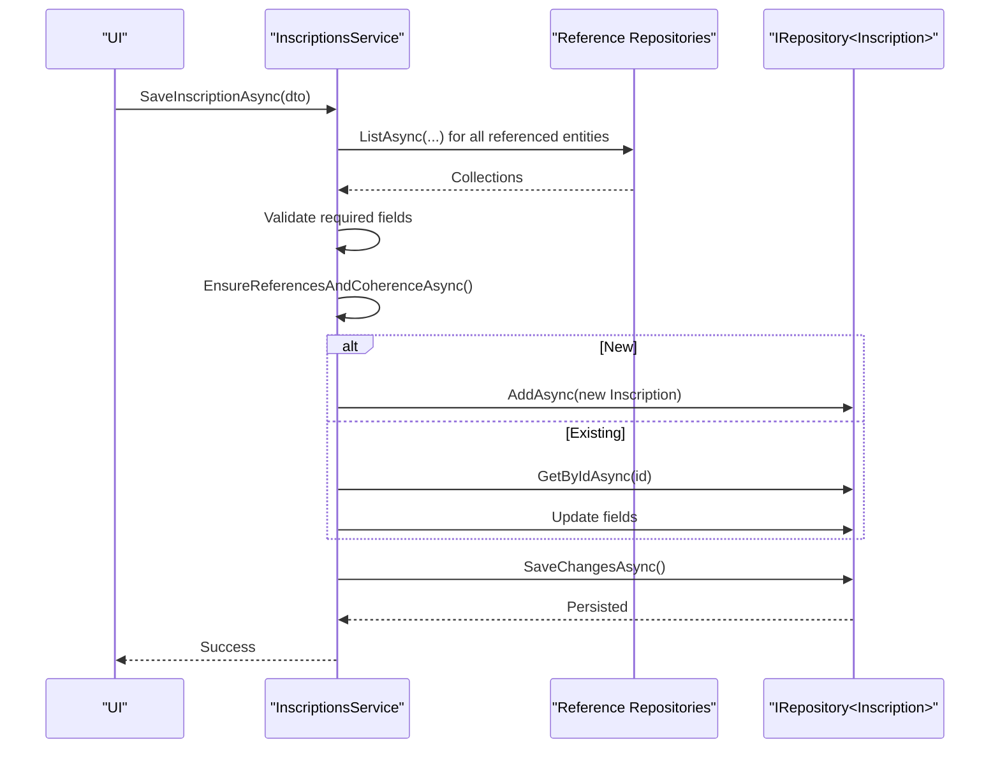
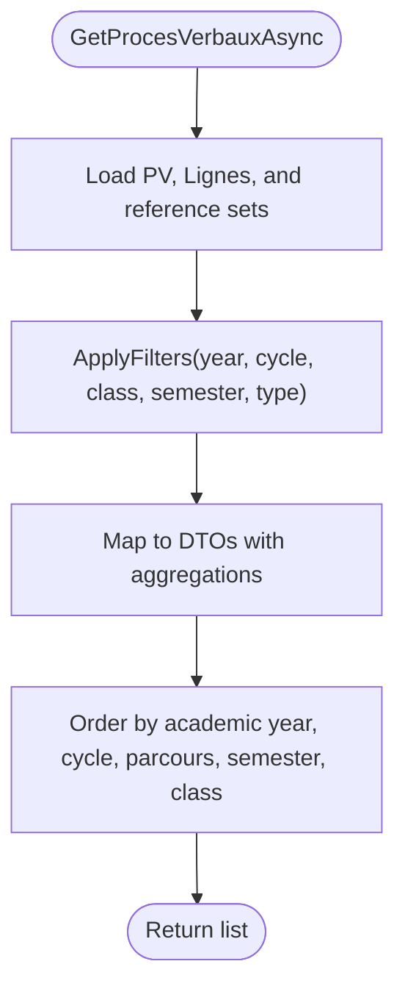
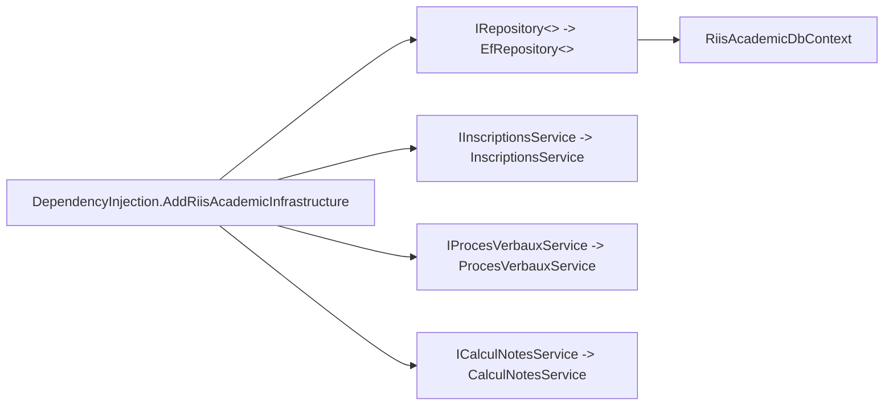
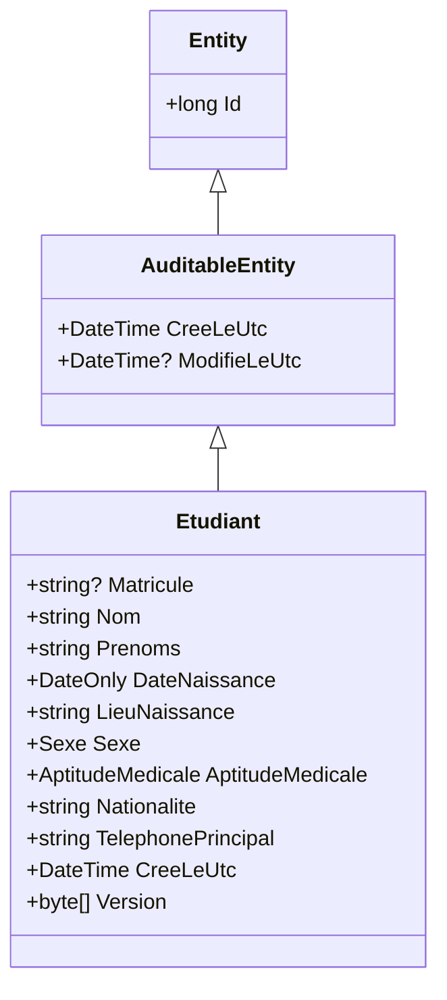
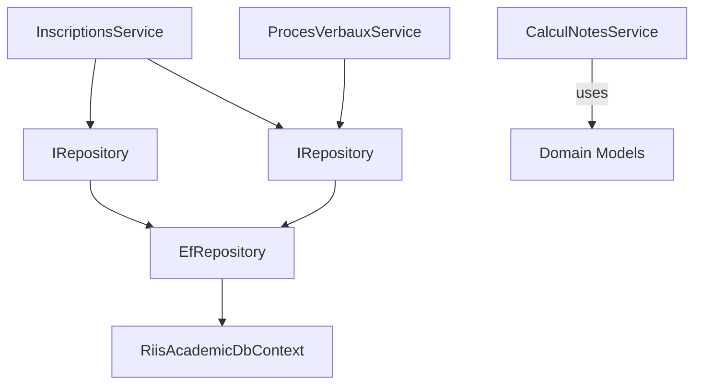

# Service Architecture & Patterns

<cite>
**Referenced Files in This Document**
- [IRepository.cs](file://RIIS.Academic.Application/Abstractions/Persistence/IRepository.cs)
- [EfRepository.cs](file://RIIS.Academic.Infrastructure/Persistence/Repositories/EfRepository.cs)
- [ICalculNotesService.cs](file://RIIS.Academic.Application/Abstractions/Services/ICalculNotesService.cs)
- [CalculNotesService.cs](file://RIIS.Academic.Application/Notes/Services/CalculNotesService.cs)
- [IInscriptionService.cs](file://RIIS.Academic.Application/Abstractions/Services/IInscriptionService.cs)
- [IInscriptionsService.cs](file://RIIS.Academic.Application/Inscriptions/Services/IInscriptionsService.cs)
- [InscriptionsService.cs](file://RIIS.Academic.Application/Inscriptions/Services/InscriptionsService.cs)
- [IProcesVerbalService.cs](file://RIIS.Academic.Application/Abstractions/Services/IProcesVerbalService.cs)
- [IProcesVerbauxService.cs](file://RIIS.Academic.Application/ProcesVerbaux/Services/IProcesVerbauxService.cs)
- [ProcesVerbauxService.cs](file://RIIS.Academic.Application/ProcesVerbaux/Services/ProcesVerbauxService.cs)
- [DependencyInjection.cs](file://RIIS.Academic.Infrastructure/DependencyInjection.cs)
- [RiisAcademicDbContext.cs](file://RIIS.Academic.Infrastructure/Persistence/RiisAcademicDbContext.cs)
- [Etudiant.cs](file://RIIS.Academic.Domain/Etudiants/Etudiant.cs)
- [Entity.cs](file://RIIS.Academic.Domain/Common/Entity.cs)
- [AuditableEntity.cs](file://RIIS.Academic.Domain/Common/AuditableEntity.cs)
</cite>

## Table of Contents
1. Introduction
2. Project Structure
3. Core Components
4. Architecture Overview
5. Detailed Component Analysis
6. Dependency Analysis
7. Performance Considerations
8. Troubleshooting Guide
9. Conclusion

## Introduction
This document explains the Application Layer’s service architecture and design patterns, focusing on how services orchestrate business workflows, coordinate between domain entities and infrastructure components, and decouple data access through a repository abstraction. It covers interface-based abstractions such as IRepository, ICalculNotesService, IInscriptionService, and IProcesVerbalService; demonstrates service composition and dependency injection; and outlines lifecycle management, error handling strategies, and transaction boundaries.

## Project Structure
The solution follows Clean Architecture principles:
- Domain layer defines entities and enums (e.g., Etudiant, Entity base classes).
- Application layer contains use-case services and DTOs, with interfaces defining contracts and implementations orchestrating business logic.
- Infrastructure layer provides persistence via EF Core and registers dependencies.

**Diagram sources**
- [IRepository.cs:3-11](file://RIIS.Academic.Application/Abstractions/Persistence/IRepository.cs#L3-L11)
- [EfRepository.cs:6-32](file://RIIS.Academic.Infrastructure/Persistence/Repositories/EfRepository.cs#L6-L32)
- [DependencyInjection.cs:25-60](file://RIIS.Academic.Infrastructure/DependencyInjection.cs#L25-L60)
- [RiisAcademicDbContext.cs:6-49](file://RIIS.Academic.Infrastructure/Persistence/RiisAcademicDbContext.cs#L6-L49)
- [Entity.cs:4-7](file://RIIS.Academic.Domain/Common/Entity.cs#L4-L7)
- [AuditableEntity.cs:4-8](file://RIIS.Academic.Domain/Common/AuditableEntity.cs#L4-L8)
- [Etudiant.cs:3-27](file://RIIS.Academic.Domain/Etudiants/Etudiant.cs#L3-L27)

**Section sources**
- [IRepository.cs:3-11](file://RIIS.Academic.Application/Abstractions/Persistence/IRepository.cs#L3-L11)
- [DependencyInjection.cs:25-60](file://RIIS.Academic.Infrastructure/DependencyInjection.cs#L25-L60)
- [RiisAcademicDbContext.cs:6-49](file://RIIS.Academic.Infrastructure/Persistence/RiisAcademicDbContext.cs#L6-L49)

## Core Components
- Repository abstraction: IRepository<TEntity> defines generic CRUD operations and SaveChangesAsync to persist changes.
- Repository implementation: EfRepository<TEntity> uses EF Core DbContext for data access with AsNoTracking for reads.
- Business services: Services implement domain-specific workflows using multiple repositories and domain models.
- Dependency injection: All services and repositories are registered as scoped, aligning with per-request lifetimes.

Key responsibilities:
- Decouple application logic from persistence details.
- Encapsulate validation, reference integrity checks, and DTO mapping.
- Provide consistent async APIs with cancellation support.

**Section sources**
- [IRepository.cs:3-11](file://RIIS.Academic.Application/Abstractions/Persistence/IRepository.cs#L3-L11)
- [EfRepository.cs:6-32](file://RIIS.Academic.Infrastructure/Persistence/Repositories/EfRepository.cs#L6-L32)
- [DependencyInjection.cs:25-60](file://RIIS.Academic.Infrastructure/DependencyInjection.cs#L25-L60)

## Architecture Overview
The Application Layer composes multiple repositories to fulfill use cases. Services validate inputs, enforce business rules, map to/from DTOs, and persist changes via repositories. The Infrastructure layer wires everything together with DI and EF Core.

**Diagram sources**
- [InscriptionsService.cs:108-191](file://RIIS.Academic.Application/Inscriptions/Services/InscriptionsService.cs#L108-L191)
- [EfRepository.cs:17-32](file://RIIS.Academic.Infrastructure/Persistence/Repositories/EfRepository.cs#L17-L32)
- [RiisAcademicDbContext.cs:6-49](file://RIIS.Academic.Infrastructure/Persistence/RiisAcademicDbContext.cs#L6-L49)

## Detailed Component Analysis

### Repository Abstraction Pattern
- Purpose: Provide a uniform data access contract independent of storage technology.
- Operations: ListAsync, GetByIdAsync, AddAsync, Delete/DeleteByIdAsync, SaveChangesAsync.
- Implementation: EfRepository<TEntity> leverages EF Core Set<T>, AsNoTracking for queries, and SaveChangesAsync for writes.

**Diagram sources**
- [IRepository.cs:3-11](file://RIIS.Academic.Application/Abstractions/Persistence/IRepository.cs#L3-L11)
- [EfRepository.cs:6-32](file://RIIS.Academic.Infrastructure/Persistence/Repositories/EfRepository.cs#L6-L32)

**Section sources**
- [IRepository.cs:3-11](file://RIIS.Academic.Application/Abstractions/Persistence/IRepository.cs#L3-L11)
- [EfRepository.cs:6-32](file://RIIS.Academic.Infrastructure/Persistence/Repositories/EfRepository.cs#L6-L32)

### Calcul Notes Service (Pure Business Logic)
- Role: Encapsulates grade calculation rules and eligibility decisions without side effects.
- Methods: Compute weighted average, determine retake eligibility, compute acquired credits based on thresholds.

**Diagram sources**
- [CalculNotesService.cs:9-17](file://RIIS.Academic.Application/Notes/Services/CalculNotesService.cs#L9-L17)

**Section sources**
- [ICalculNotesService.cs:6-10](file://RIIS.Academic.Application/Abstractions/Services/ICalculNotesService.cs#L6-L10)
- [CalculNotesService.cs:7-24](file://RIIS.Academic.Application/Notes/Services/CalculNotesService.cs#L7-L24)

### Inscription Workflows (Create/Update/Validate)
- Responsibilities:
  - Build default DTOs.
  - Validate required fields and business constraints.
  - Ensure referential integrity across academic year, student, program, level, class, and curriculum.
  - Persist new or updated entities and save changes.

**Diagram sources**
- [InscriptionsService.cs:95-191](file://RIIS.Academic.Application/Inscriptions/Services/InscriptionsService.cs#L95-L191)

**Section sources**
- [IInscriptionService.cs:4-8](file://RIIS.Academic.Application/Abstractions/Services/IInscriptionService.cs#L4-L8)
- [IInscriptionsService.cs:6-31](file://RIIS.Academic.Application/Inscriptions/Services/IInscriptionsService.cs#L6-L31)
- [InscriptionsService.cs:95-191](file://RIIS.Academic.Application/Inscriptions/Services/InscriptionsService.cs#L95-L191)

### Proces Verbaux Queries and Filtering
- Responsibilities:
  - Fetch and filter records by academic year, cycle, class, semester number, and type.
  - Compose DTOs including related lookups and aggregated metrics.
  - Parse and present nested JSON details safely.

**Diagram sources**
- [ProcesVerbauxService.cs:18-59](file://RIIS.Academic.Application/ProcesVerbaux/Services/ProcesVerbauxService.cs#L18-L59)
- [ProcesVerbauxService.cs:180-243](file://RIIS.Academic.Application/ProcesVerbaux/Services/ProcesVerbauxService.cs#L180-L243)

**Section sources**
- [IProcesVerbalService.cs:4-7](file://RIIS.Academic.Application/Abstractions/Services/IProcesVerbalService.cs#L4-L7)
- [IProcesVerbauxService.cs:7-30](file://RIIS.Academic.Application/ProcesVerbaux/Services/IProcesVerbauxService.cs#L7-L30)
- [ProcesVerbauxService.cs:18-59](file://RIIS.Academic.Application/ProcesVerbaux/Services/ProcesVerbauxService.cs#L18-L59)

### Service Composition and Dependency Injection
- Composition: Services receive multiple IRepository<T> instances via constructor injection to coordinate cross-entity workflows.
- Registration: All services and repositories are registered as Scoped in DependencyInjection, ensuring one instance per request.
- Context: DbContext is configured with SQL Server and also registered as Transient per options lifetime.

**Diagram sources**
- [DependencyInjection.cs:25-60](file://RIIS.Academic.Infrastructure/DependencyInjection.cs#L25-L60)
- [RiisAcademicDbContext.cs:6-49](file://RIIS.Academic.Infrastructure/Persistence/RiisAcademicDbContext.cs#L6-L49)

**Section sources**
- [DependencyInjection.cs:25-60](file://RIIS.Academic.Infrastructure/DependencyInjection.cs#L25-L60)

### Domain Entities and Base Types
- Entity base: Provides Id property for all entities.
- AuditableEntity: Adds creation and modification timestamps.
- Etudiant: Example domain entity with relationships and audit fields.

**Diagram sources**
- [Entity.cs:4-7](file://RIIS.Academic.Domain/Common/Entity.cs#L4-L7)
- [AuditableEntity.cs:4-8](file://RIIS.Academic.Domain/Common/AuditableEntity.cs#L4-L8)
- [Etudiant.cs:3-27](file://RIIS.Academic.Domain/Etudiants/Etudiant.cs#L3-L27)

**Section sources**
- [Entity.cs:4-7](file://RIIS.Academic.Domain/Common/Entity.cs#L4-L7)
- [AuditableEntity.cs:4-8](file://RIIS.Academic.Domain/Common/AuditableEntity.cs#L4-L8)
- [Etudiant.cs:3-27](file://RIIS.Academic.Domain/Etudiants/Etudiant.cs#L3-L27)

## Dependency Analysis
- Coupling: Services depend on abstractions (IRepository<T>) rather than concrete EF types, reducing coupling to infrastructure.
- Cohesion: Each service encapsulates a single business capability (e.g., inscriptions, grades, process verbaux).
- External dependencies: EF Core DbContext and SQL Server configuration are isolated in Infrastructure.

**Diagram sources**
- [InscriptionsService.cs:8-16](file://RIIS.Academic.Application/Inscriptions/Services/InscriptionsService.cs#L8-L16)
- [ProcesVerbauxService.cs:9-16](file://RIIS.Academic.Application/ProcesVerbaux/Services/ProcesVerbauxService.cs#L9-L16)
- [EfRepository.cs:6-32](file://RIIS.Academic.Infrastructure/Persistence/Repositories/EfRepository.cs#L6-L32)
- [RiisAcademicDbContext.cs:6-49](file://RIIS.Academic.Infrastructure/Persistence/RiisAcademicDbContext.cs#L6-L49)

**Section sources**
- [InscriptionsService.cs:8-16](file://RIIS.Academic.Application/Inscriptions/Services/InscriptionsService.cs#L8-L16)
- [ProcesVerbauxService.cs:9-16](file://RIIS.Academic.Application/ProcesVerbaux/Services/ProcesVerbauxService.cs#L9-L16)
- [DependencyInjection.cs:25-60](file://RIIS.Academic.Infrastructure/DependencyInjection.cs#L25-L60)

## Performance Considerations
- Read performance: Use AsNoTracking for read-only queries to avoid change tracking overhead.
- Query shape: Prefer loading necessary reference sets once and filtering in memory when appropriate, as seen in services that batch-load references and then apply filters.
- Pagination: For large datasets, consider adding pagination at the repository or service layer to reduce payload size.
- Indexing: Ensure database indexes support common filter keys (e.g., academic year, cycle, class, status).
- Cancellation: Propagate CancellationToken through async calls to support responsive UI and resource cleanup.

[No sources needed since this section provides general guidance]

## Troubleshooting Guide
Common issues and strategies:
- Validation errors: Services throw InvalidOperationException for missing or invalid inputs (e.g., mandatory fields, incompatible references). Wrap service calls in try/catch at the API boundary to return user-friendly messages.
- Referential integrity: Ensure references exist before saving; services perform explicit checks and raise descriptive errors if not found.
- Duplicate constraints: Detect duplicates in-memory before persisting (e.g., unique matricule or registration per academic year).
- Transaction boundaries: Each SaveChangesAsync call persists changes for the current context scope. For multi-step transactions spanning multiple repositories within a single service method, ensure they execute within the same DbContext scope and commit atomically. If you need explicit transactions across multiple contexts or external resources, wrap the operation in an explicit transaction.

**Section sources**
- [InscriptionsService.cs:108-191](file://RIIS.Academic.Application/Inscriptions/Services/InscriptionsService.cs#L108-L191)
- [ClassesPedagogiquesService.cs:77-142](file://RIIS.Academic.Application/ClassesPedagogiques/Services/ClassesPedagogiquesService.cs#L77-L142)
- [EtudiantsService.cs:53-121](file://RIIS.Academic.Application/Etudiants/Services/EtudiantsService.cs#L53-L121)

## Conclusion
The Application Layer implements a clean separation of concerns:
- Interfaces define stable contracts for services and repositories.
- Services compose repositories to orchestrate complex workflows while keeping domain logic centralized.
- Infrastructure abstracts persistence details and wires dependencies via DI.
Adhering to these patterns ensures maintainability, testability, and scalability. When implementing new services, follow established conventions: define an interface, inject required repositories, validate inputs, enforce business rules, map to DTOs, and persist changes with SaveChangesAsync within a scoped lifetime.

[No sources needed since this section summarizes without analyzing specific files]