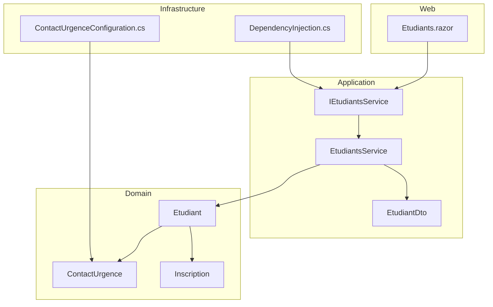
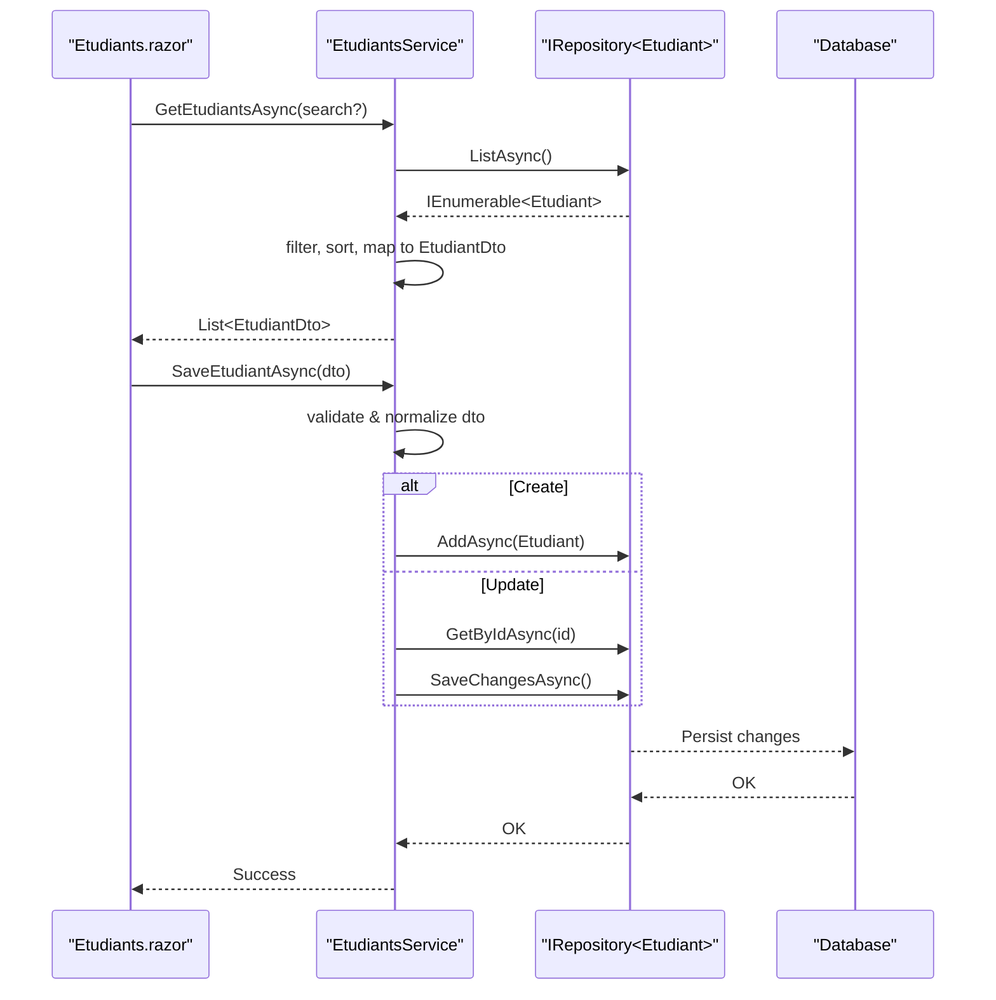
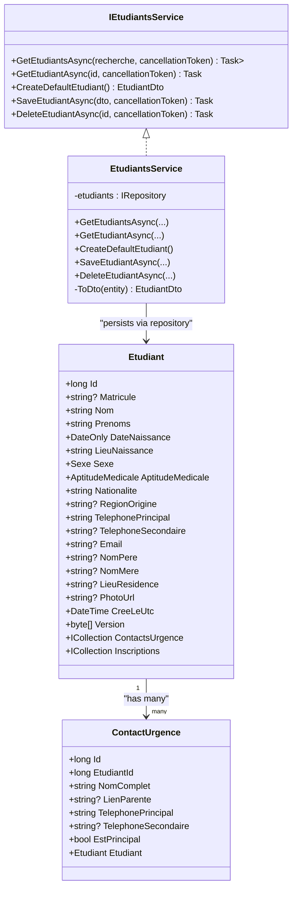

# Student Management Services

<cite>
**Referenced Files in This Document**
- [IEtudiantsService.cs](file://RIIS.Academic.Application/Etudiants/Services/IEtudiantsService.cs)
- [EtudiantsService.cs](file://RIIS.Academic.Application/Etudiants/Services/EtudiantsService.cs)
- [EtudiantDto.cs](file://RIIS.Academic.Application/Etudiants/Dtos/EtudiantDto.cs)
- [Etudiant.cs](file://RIIS.Academic.Domain/Etudiants/Etudiant.cs)
- [ContactUrgence.cs](file://RIIS.Academic.Domain/Etudiants/ContactUrgence.cs)
- [Inscription.cs](file://RIIS.Academic.Domain/Inscriptions/Inscription.cs)
- [IInscriptionsService.cs](file://RIIS.Academic.Application/Inscriptions/Services/IInscriptionsService.cs)
- [IEvaluationsService.cs](file://RIIS.Academic.Application/Evaluations/Services/IEvaluationsService.cs)
- [Etudiants.razor](file://RIIS.Academic.Web/Components/Pages/Etudiants.razor)
- [DependencyInjection.cs](file://RIIS.Academic.Infrastructure/DependencyInjection.cs)
- [ContactUrgenceConfiguration.cs](file://RIIS.Academic.Infrastructure/Persistence/Configurations/Etudiants/ContactUrgenceConfiguration.cs)
</cite>

## Table of Contents
1. [Introduction](#introduction)
2. [Project Structure](#project-structure)
3. [Core Components](#core-components)
4. [Architecture Overview](#architecture-overview)
5. [Detailed Component Analysis](#detailed-component-analysis)
6. [Dependency Analysis](#dependency-analysis)
7. [Performance Considerations](#performance-considerations)
8. [Troubleshooting Guide](#troubleshooting-guide)
9. [Conclusion](#conclusion)

## Introduction
This document explains the Student Management service layer with a focus on the IEtudiantsService interface and EtudiantsService implementation. It covers student lifecycle operations (create, update, delete, query), data transfer via EtudiantDto, profile management including contact information, and how emergency contacts relate to students. It also outlines integration patterns with enrollment and grade management services and provides typical usage scenarios for registration, status updates, and validation.

## Project Structure
The student management feature spans multiple layers:
- Application layer: service interfaces and implementations, DTOs
- Domain layer: entities and relationships
- Infrastructure layer: dependency injection and persistence configuration
- Web layer: Blazor page that consumes the service

**Diagram sources**
- [IEtudiantsService.cs:5-12](file://RIIS.Academic.Application/Etudiants/Services/IEtudiantsService.cs#L5-L12)
- [EtudiantsService.cs:7-127](file://RIIS.Academic.Application/Etudiants/Services/EtudiantsService.cs#L7-L127)
- [EtudiantDto.cs:5-25](file://RIIS.Academic.Application/Etudiants/Dtos/EtudiantDto.cs#L5-L25)
- [Etudiant.cs:3-27](file://RIIS.Academic.Domain/Etudiants/Etudiant.cs#L3-L27)
- [ContactUrgence.cs:3-14](file://RIIS.Academic.Domain/Etudiants/ContactUrgence.cs#L3-L14)
- [Inscription.cs:3-36](file://RIIS.Academic.Domain/Inscriptions/Inscription.cs#L3-L36)
- [DependencyInjection.cs:36-40](file://RIIS.Academic.Infrastructure/DependencyInjection.cs#L36-L40)
- [ContactUrgenceConfiguration.cs:6-20](file://RIIS.Academic.Infrastructure/Persistence/Configurations/Etudiants/ContactUrgenceConfiguration.cs#L6-L20)

**Section sources**
- [IEtudiantsService.cs:5-12](file://RIIS.Academic.Application/Etudiants/Services/IEtudiantsService.cs#L5-L12)
- [EtudiantsService.cs:7-127](file://RIIS.Academic.Application/Etudiants/Services/EtudiantsService.cs#L7-L127)
- [EtudiantDto.cs:5-25](file://RIIS.Academic.Application/Etudiants/Dtos/EtudiantDto.cs#L5-L25)
- [Etudiant.cs:3-27](file://RIIS.Academic.Domain/Etudiants/Etudiant.cs#L3-L27)
- [ContactUrgence.cs:3-14](file://RIIS.Academic.Domain/Etudiants/ContactUrgence.cs#L3-L14)
- [Inscription.cs:3-36](file://RIIS.Academic.Domain/Inscriptions/Inscription.cs#L3-L36)
- [DependencyInjection.cs:36-40](file://RIIS.Academic.Infrastructure/DependencyInjection.cs#L36-L40)
- [ContactUrgenceConfiguration.cs:6-20](file://RIIS.Academic.Infrastructure/Persistence/Configurations/Etudiants/ContactUrgenceConfiguration.cs#L6-L20)

## Core Components
- IEtudiantsService defines the application contract for student operations: listing with search, single retrieval, default creation, saving, and deletion.
- EtudiantsService implements these operations using a generic repository over the Etudiant domain entity. It includes validation, normalization, and mapping to/from EtudiantDto.
- EtudiantDto is the data transfer object used by the web layer and services to carry student data across boundaries.
- Domain entities Etudiant and ContactUrgence model the student profile and emergency contacts, with relationships configured in infrastructure.

Key responsibilities:
- Querying: list all students with optional text search across key fields; sort by last name then first name.
- Creation: provide a default student template for UI prefill.
- Updates: validate required fields, normalize optional fields, enforce unique matricule, persist changes.
- Deletion: remove a student by id.

**Section sources**
- [IEtudiantsService.cs:5-12](file://RIIS.Academic.Application/Etudiants/Services/IEtudiantsService.cs#L5-L12)
- [EtudiantsService.cs:9-127](file://RIIS.Academic.Application/Etudiants/Services/EtudiantsService.cs#L9-L127)
- [EtudiantDto.cs:5-25](file://RIIS.Academic.Application/Etudiants/Dtos/EtudiantDto.cs#L5-L25)
- [Etudiant.cs:3-27](file://RIIS.Academic.Domain/Etudiants/Etudiant.cs#L3-L27)

## Architecture Overview
The service layer follows clean architecture principles:
- The web layer injects IEtudiantsService and calls it from the Blazor page.
- The service uses a repository abstraction to access the database through EF Core.
- Domain entities define business rules and relationships; infrastructure configures persistence and dependency injection.

**Diagram sources**
- [Etudiants.razor:186-237](file://RIIS.Academic.Web/Components/Pages/Etudiants.razor#L186-L237)
- [EtudiantsService.cs:9-127](file://RIIS.Academic.Application/Etudiants/Services/EtudiantsService.cs#L9-L127)

## Detailed Component Analysis

### IEtudiantsService Interface
Defines the public API for student management:
- GetEtudiantsAsync: returns a list with optional text search across matricule, last name, first names, phone, email.
- GetEtudiantAsync: retrieves a single student by id.
- CreateDefaultEtudiant: returns a pre-filled DTO for new student forms.
- SaveEtudiantAsync: validates and persists student data (create or update).
- DeleteEtudiantAsync: deletes a student by id.

**Section sources**
- [IEtudiantsService.cs:5-12](file://RIIS.Academic.Application/Etudiants/Services/IEtudiantsService.cs#L5-L12)

### EtudiantsService Implementation
Responsibilities and behaviors:
- Search and sorting: trims search input, filters by multiple fields case-insensitively, sorts by last name then first names, maps to DTOs.
- Default creation: initializes common defaults for date of birth, place of birth, gender, medical fitness, nationality, and primary phone.
- Validation and normalization:
  - Requires non-empty values for last name, first names, place of birth, nationality, and primary phone.
  - Normalizes nullable strings by trimming and converting empty/whitespace to null.
  - Enforces uniqueness of matricule across existing students (excluding current record when updating).
- Persistence:
  - Creates a new Etudiant if Id is zero; otherwise loads existing entity and updates fields.
  - Persists changes via repository save.
- Mapping:
  - ToDto maps domain entity properties to DTO fields.

Error handling:
- Throws InvalidOperationException for missing required fields or duplicate matricule.

Complexity considerations:
- Search performs client-side filtering after loading all records; suitable for moderate datasets. For large datasets, consider server-side filtering.

**Section sources**
- [EtudiantsService.cs:9-127](file://RIIS.Academic.Application/Etudiants/Services/EtudiantsService.cs#L9-L127)
- [EtudiantsService.cs:129-171](file://RIIS.Academic.Application/Etudiants/Services/EtudiantsService.cs#L129-L171)

### EtudiantDto Data Transfer Object
Fields include identity, academic identifiers, personal details, contact info, family references, residence, and photo URL. Provides a computed full name property combining last name and first names.

Mapping strategy:
- One-to-one mapping between EtudiantDto and Etudiant entity within the service’s ToDto method.
- Optional fields are normalized before persistence to avoid storing whitespace-only values.

**Section sources**
- [EtudiantDto.cs:5-25](file://RIIS.Academic.Application/Etudiants/Dtos/EtudiantDto.cs#L5-L25)
- [EtudiantsService.cs:129-149](file://RIIS.Academic.Application/Etudiants/Services/EtudiantsService.cs#L129-L149)

### Student Profile Management and Contact Information
- Personal profile fields: matricule, last name, first names, date of birth, place of birth, gender, medical fitness, nationality, region of origin, primary and secondary phone, email, father/mother names, residence location, photo URL.
- Required fields enforced at save time ensure data integrity for core identity and contact information.
- Optional fields are normalized to null when empty, preventing accidental blank entries.

Emergency contacts:
- Domain model supports multiple emergency contacts per student via a one-to-many relationship.
- Each emergency contact includes full name, relationship, primary/secondary phones, and a flag indicating the principal contact.
- Relationship is configured with cascade delete, ensuring contacts are removed when a student is deleted.

Note: The current EtudiantsService does not expose CRUD for emergency contacts; they are managed elsewhere or via direct domain operations.

**Section sources**
- [Etudiant.cs:3-27](file://RIIS.Academic.Domain/Etudiants/Etudiant.cs#L3-L27)
- [ContactUrgence.cs:3-14](file://RIIS.Academic.Domain/Etudiants/ContactUrgence.cs#L3-L14)
- [ContactUrgenceConfiguration.cs:6-20](file://RIIS.Academic.Infrastructure/Persistence/Configurations/Etudiants/ContactUrgenceConfiguration.cs#L6-L20)

### Typical Student Operations and Examples
- Registration (Create):
  - UI calls CreateDefaultEtudiant to prefill form fields.
  - On submit, SaveEtudiantAsync validates inputs, checks matricule uniqueness, creates a new Etudiant, and persists.
- Update:
  - Edit loads an existing student into a DTO.
  - SaveEtudiantAsync updates fields and persists changes.
- Query/Search:
  - GetEtudiantsAsync supports free-text search across key fields and returns sorted results.
- Delete:
  - DeleteEtudiantAsync removes a student by id.

Validation examples:
- Missing last name triggers an error message during save.
- Duplicate matricule triggers an error indicating the identifier is already in use.

**Section sources**
- [Etudiants.razor:199-237](file://RIIS.Academic.Web/Components/Pages/Etudiants.razor#L199-L237)
- [EtudiantsService.cs:42-127](file://RIIS.Academic.Application/Etudiants/Services/EtudiantsService.cs#L42-L127)

### Relationships with Enrollment and Grade Management
- Enrollment (Inscription):
  - Inscription links a student to an academic year, program, level, class, and evaluation context.
  - InscriptionsService enforces uniqueness of enrollment per student per academic year.
- Grades (Evaluations):
  - Evaluations are tied to academic contexts and can be associated with enrollments and students indirectly via program structures.
- Integration pattern:
  - While EtudiantsService focuses on student profiles, downstream processes like enrollment and grading reference the student via foreign keys and IDs.
  - Ensure student existence before creating enrollments or grades; handle referential integrity at the database level.

**Section sources**
- [Inscription.cs:3-36](file://RIIS.Academic.Domain/Inscriptions/Inscription.cs#L3-L36)
- [IInscriptionsService.cs:6-31](file://RIIS.Academic.Application/Inscriptions/Services/IInscriptionsService.cs#L6-L31)
- [IEvaluationsService.cs:7-47](file://RIIS.Academic.Application/Evaluations/Services/IEvaluationsService.cs#L7-L47)

### Web Layer Integration Patterns
- Dependency Injection:
  - IEtudiantsService is registered in infrastructure DI container for scoped lifetime.
- Blazor Page:
  - Injects IEtudiantsService to load lists, create/edit forms, and perform actions.
  - Uses Radzen components for form binding, validation, and grid display.
  - Handles success/error notifications based on service outcomes.

**Section sources**
- [DependencyInjection.cs:36-40](file://RIIS.Academic.Infrastructure/DependencyInjection.cs#L36-L40)
- [Etudiants.razor:1-272](file://RIIS.Academic.Web/Components/Pages/Etudiants.razor#L1-L272)

## Dependency Analysis
- Service dependencies:
  - EtudiantsService depends on IRepository<Etudiant> for persistence.
  - No direct coupling to enrollment or grade services; relationships are modeled via domain entities and IDs.
- Infrastructure wiring:
  - DI registers repositories and services, enabling constructor injection throughout the application.
- Entity relationships:
  - Etudiant has collections for emergency contacts and enrollments.
  - ContactUrgence points back to Etudiant with cascade delete configured.

**Diagram sources**
- [IEtudiantsService.cs:5-12](file://RIIS.Academic.Application/Etudiants/Services/IEtudiantsService.cs#L5-L12)
- [EtudiantsService.cs:7-127](file://RIIS.Academic.Application/Etudiants/Services/EtudiantsService.cs#L7-L127)
- [Etudiant.cs:3-27](file://RIIS.Academic.Domain/Etudiants/Etudiant.cs#L3-L27)
- [ContactUrgence.cs:3-14](file://RIIS.Academic.Domain/Etudiants/ContactUrgence.cs#L3-L14)

**Section sources**
- [EtudiantsService.cs:7-127](file://RIIS.Academic.Application/Etudiants/Services/EtudiantsService.cs#L7-L127)
- [Etudiant.cs:3-27](file://RIIS.Academic.Domain/Etudiants/Etudiant.cs#L3-L27)
- [ContactUrgence.cs:3-14](file://RIIS.Academic.Domain/Etudiants/ContactUrgence.cs#L3-L14)

## Performance Considerations
- Search performance: Current implementation loads all students into memory and filters client-side. For large datasets, implement server-side filtering or pagination at the repository level.
- Sorting: Ordering by last name and first names is straightforward but may benefit from indexing on frequently queried columns.
- Validation overhead: Minimal; validation occurs before persistence. Consider moving complex validations to dedicated validators if needed.
- Concurrency: Entities include versioning fields; ensure optimistic concurrency handling is considered when extending functionality.

[No sources needed since this section provides general guidance]

## Troubleshooting Guide
Common issues and resolutions:
- Validation errors:
  - Missing required fields (last name, first names, place of birth, nationality, primary phone) will throw exceptions during save. Ensure UI binds correctly and required validators are present.
- Duplicate matricule:
  - Saving a student with an existing matricule (different from current record) throws an exception. Check matricule uniqueness before submission.
- Empty optional fields:
  - Optional fields are normalized to null if empty; verify expected behavior in UI and downstream logic.
- Emergency contacts:
  - If deleting a student, contacts are cascaded due to configuration; confirm this aligns with business rules.

Operational tips:
- Use GetEtudiantAsync to fetch a student before editing to populate the form accurately.
- Handle exceptions in the web layer to display meaningful messages to users.

**Section sources**
- [EtudiantsService.cs:53-127](file://RIIS.Academic.Application/Etudiants/Services/EtudiantsService.cs#L53-L127)
- [ContactUrgenceConfiguration.cs:16-19](file://RIIS.Academic.Infrastructure/Persistence/Configurations/Etudiants/ContactUrgenceConfiguration.cs#L16-L19)

## Conclusion
The Student Management service layer provides a clear, validated, and maintainable API for managing student profiles. The IEtudiantsService and EtudiantsService encapsulate lifecycle operations, while EtudiantDto serves as a stable boundary for data exchange. Domain relationships support comprehensive student records, including emergency contacts and enrollments. Integration with enrollment and grade management is achieved through well-defined entity relationships and service boundaries. The web layer integrates seamlessly via dependency injection and Blazor components, offering a robust user experience for student administration tasks.

[No sources needed since this section summarizes without analyzing specific files]