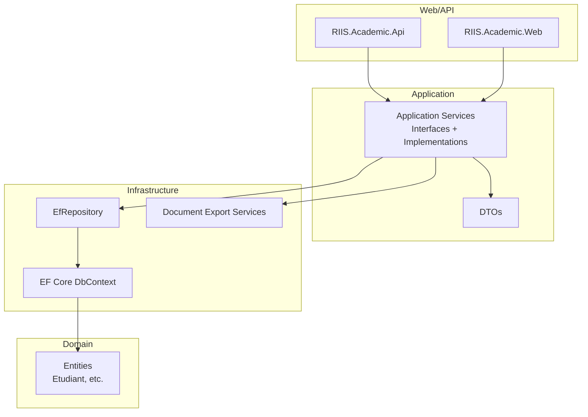
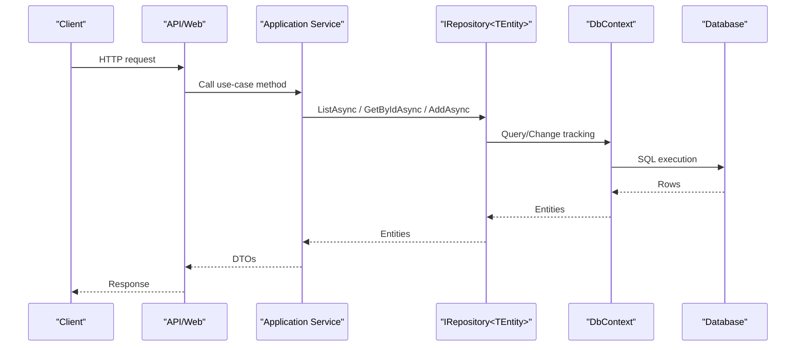
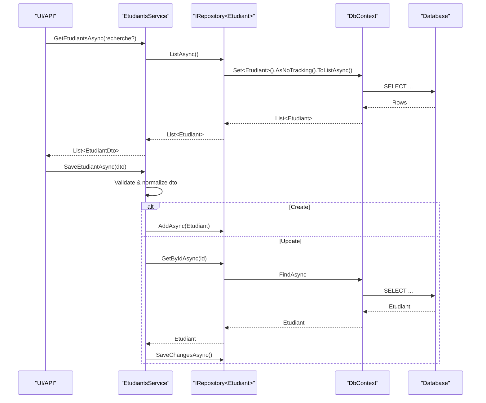
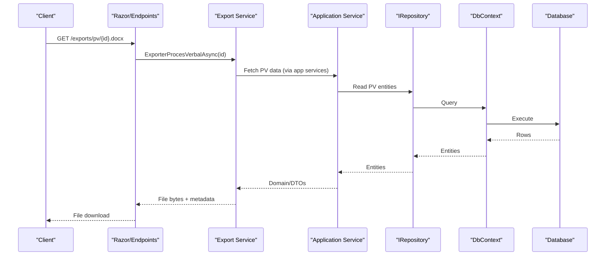
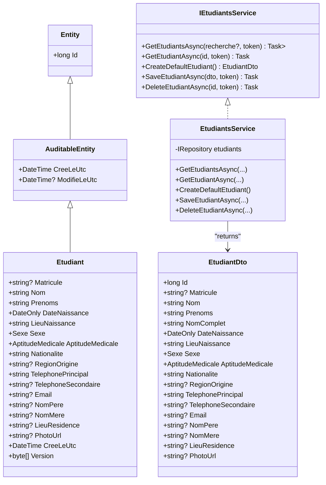
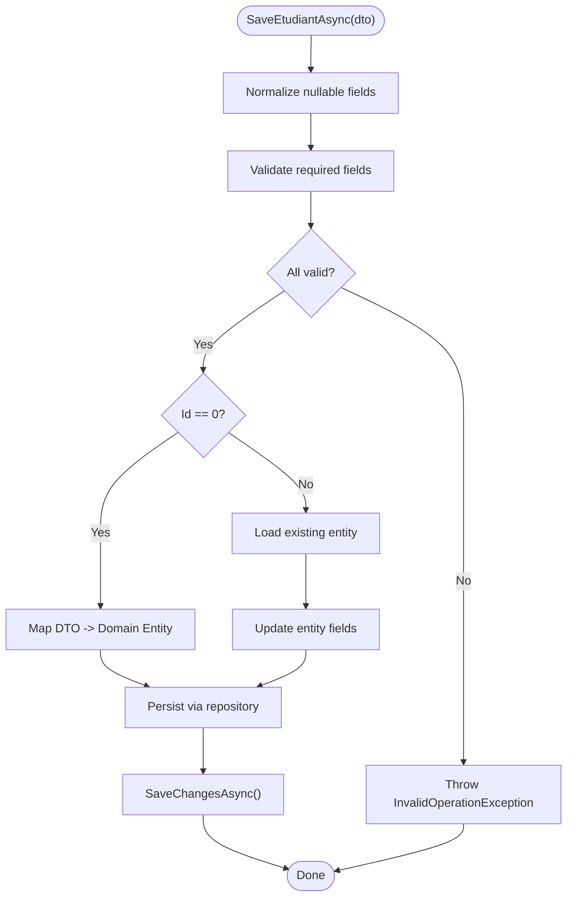
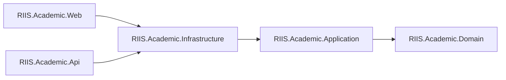

# Architecture Guide

<cite>
**Referenced Files in This Document**
- [Program.cs](file://RIIS.Academic.Api/Program.cs)
- [Program.cs](file://RIIS.Academic.Web/Program.cs)
- [DependencyInjection.cs](file://RIIS.Academic.Infrastructure/DependencyInjection.cs)
- [IRepository.cs](file://RIIS.Academic.Application/Abstractions/Persistence/IRepository.cs)
- [EfRepository.cs](file://RIIS.Academic.Infrastructure/Persistence/Repositories/EfRepository.cs)
- [RiisAcademicDbContext.cs](file://RIIS.Academic.Infrastructure/Persistence/RiisAcademicDbContext.cs)
- [Etudiant.cs](file://RIIS.Academic.Domain/Etudiants/Etudiant.cs)
- [Entity.cs](file://RIIS.Academic.Domain/Common/Entity.cs)
- [AuditableEntity.cs](file://RIIS.Academic.Domain/Common/AuditableEntity.cs)
- [IEtudiantsService.cs](file://RIIS.Academic.Application/Etudiants/Services/IEtudiantsService.cs)
- [EtudiantsService.cs](file://RIIS.Academic.Application/Etudiants/Services/EtudiantsService.cs)
- [EtudiantDto.cs](file://RIIS.Academic.Application/Etudiants/Dtos/EtudiantDto.cs)
- [RiisAcademicExportEndpointExtensions.cs](file://RIIS.Academic.Web/Extensions/RiisAcademicExportEndpointExtensions.cs)
</cite>

## Table of Contents
1. Introduction
2. Project Structure
3. Core Components
4. Architecture Overview
5. Detailed Component Analysis
6. Dependency Analysis
7. Performance Considerations
8. Troubleshooting Guide
9. Conclusion

## Introduction
This document describes the Clean Architecture implementation of the RIIS Academic Management System across four layers: Domain, Application, Infrastructure, and Web/API. It explains layer responsibilities, design patterns (Repository, Service Layer, DTO, Dependency Injection), component interactions, data flows, integration points, and cross-cutting concerns such as validation and error handling. It also includes diagrams that map to actual source files to illustrate how requests move through the system and how data is persisted.

## Project Structure
The solution is organized into distinct projects aligned with Clean Architecture principles:
- Domain: Pure business entities and enums without framework dependencies.
- Application: Use cases and orchestration via services; defines interfaces for persistence and external capabilities; uses DTOs to decouple from domain models.
- Infrastructure: Concrete implementations of repositories and external integrations (EF Core DbContext, file exports).
- Web/API: Entry points for HTTP endpoints and Razor components; wires infrastructure via DI.

**Diagram sources**
- [Program.cs:1-18](file://RIIS.Academic.Api/Program.cs#L1-L18)
- [Program.cs:1-27](file://RIIS.Academic.Web/Program.cs#L1-L27)
- [DependencyInjection.cs:23-60](file://RIIS.Academic.Infrastructure/DependencyInjection.cs#L23-L60)
- [RiisAcademicDbContext.cs:6-49](file://RIIS.Academic.Infrastructure/Persistence/RiisAcademicDbContext.cs#L6-L49)
- [EfRepository.cs:6-32](file://RIIS.Academic.Infrastructure/Persistence/Repositories/EfRepository.cs#L6-L32)
- [Etudiant.cs:1-28](file://RIIS.Academic.Domain/Etudiants/Etudiant.cs#L1-L28)

**Section sources**
- [Program.cs:1-18](file://RIIS.Academic.Api/Program.cs#L1-L18)
- [Program.cs:1-27](file://RIIS.Academic.Web/Program.cs#L1-L27)
- [DependencyInjection.cs:23-60](file://RIIS.Academic.Infrastructure/DependencyInjection.cs#L23-L60)

## Core Components
- Domain layer:
  - Base entity types provide common identity and audit fields.
  - Business entities encapsulate core academic concepts (e.g., student).
- Application layer:
  - Service interfaces define use-case boundaries.
  - Service implementations coordinate operations, validate inputs, and translate between DTOs and domain entities.
  - DTOs represent stable contracts for UI and APIs.
- Infrastructure layer:
  - EfRepository implements generic CRUD over EF Core.
  - RiisAcademicDbContext configures entity sets and applies configurations.
  - Export services implement document generation (Word/Excel).
- Web/API layer:
  - Minimal controllers or endpoint extensions expose functionality.
  - DI registration centralizes service lifetimes and database configuration.

Key patterns:
- Repository pattern abstracts data access behind IRepository<TEntity>.
- Service Layer pattern encapsulates business workflows in application services.
- DTO pattern isolates presentation concerns from domain models.
- Dependency Injection centralizes wiring and lifetime management.

**Section sources**
- [Entity.cs:1-8](file://RIIS.Academic.Domain/Common/Entity.cs#L1-L8)
- [AuditableEntity.cs:1-9](file://RIIS.Academic.Domain/Common/AuditableEntity.cs#L1-L9)
- [Etudiant.cs:1-28](file://RIIS.Academic.Domain/Etudiants/Etudiant.cs#L1-L28)
- [IRepository.cs:1-13](file://RIIS.Academic.Application/Abstractions/Persistence/IRepository.cs#L1-L13)
- [IEtudiantsService.cs:1-13](file://RIIS.Academic.Application/Etudiants/Services/IEtudiantsService.cs#L1-L13)
- [EtudiantsService.cs:1-173](file://RIIS.Academic.Application/Etudiants/Services/EtudiantsService.cs#L1-L173)
- [EfRepository.cs:1-34](file://RIIS.Academic.Infrastructure/Persistence/Repositories/EfRepository.cs#L1-L34)
- [RiisAcademicDbContext.cs:1-51](file://RIIS.Academic.Infrastructure/Persistence/RiisAcademicDbContext.cs#L1-L51)
- [DependencyInjection.cs:23-60](file://RIIS.Academic.Infrastructure/DependencyInjection.cs#L23-L60)

## Architecture Overview
The system follows a layered architecture where the Web/API layer invokes Application services, which use Domain entities and Infrastructure abstractions. Data persistence is handled by EF Core via a shared DbContext.

**Diagram sources**
- [Program.cs:1-18](file://RIIS.Academic.Api/Program.cs#L1-L18)
- [Program.cs:1-27](file://RIIS.Academic.Web/Program.cs#L1-L27)
- [EtudiantsService.cs:1-173](file://RIIS.Academic.Application/Etudiants/Services/EtudiantsService.cs#L1-L173)
- [IRepository.cs:1-13](file://RIIS.Academic.Application/Abstractions/Persistence/IRepository.cs#L1-L13)
- [EfRepository.cs:1-34](file://RIIS.Academic.Infrastructure/Persistence/Repositories/EfRepository.cs#L1-L34)
- [RiisAcademicDbContext.cs:1-51](file://RIIS.Academic.Infrastructure/Persistence/RiisAcademicDbContext.cs#L1-L51)

## Detailed Component Analysis

### Student Management Flow (Use Case)
This flow demonstrates a typical read/write scenario using the Student feature.

**Diagram sources**
- [IEtudiantsService.cs:1-13](file://RIIS.Academic.Application/Etudiants/Services/IEtudiantsService.cs#L1-L13)
- [EtudiantsService.cs:1-173](file://RIIS.Academic.Application/Etudiants/Services/EtudiantsService.cs#L1-L173)
- [IRepository.cs:1-13](file://RIIS.Academic.Application/Abstractions/Persistence/IRepository.cs#L1-L13)
- [EfRepository.cs:1-34](file://RIIS.Academic.Infrastructure/Persistence/Repositories/EfRepository.cs#L1-L34)
- [RiisAcademicDbContext.cs:1-51](file://RIIS.Academic.Infrastructure/Persistence/RiisAcademicDbContext.cs#L1-L51)

**Section sources**
- [IEtudiantsService.cs:1-13](file://RIIS.Academic.Application/Etudiants/Services/IEtudiantsService.cs#L1-L13)
- [EtudiantsService.cs:1-173](file://RIIS.Academic.Application/Etudiants/Services/EtudiantsService.cs#L1-L173)
- [IRepository.cs:1-13](file://RIIS.Academic.Application/Abstractions/Persistence/IRepository.cs#L1-L13)
- [EfRepository.cs:1-34](file://RIIS.Academic.Infrastructure/Persistence/Repositories/EfRepository.cs#L1-L34)
- [RiisAcademicDbContext.cs:1-51](file://RIIS.Academic.Infrastructure/Persistence/RiisAcademicDbContext.cs#L1-L51)

### Export Endpoints (Integration Pattern)
The Web layer exposes export endpoints that directly invoke Infrastructure export services to generate downloadable documents.

**Diagram sources**
- [RiisAcademicExportEndpointExtensions.cs:1-94](file://RIIS.Academic.Web/Extensions/RiisAcademicExportEndpointExtensions.cs#L1-L94)
- [DependencyInjection.cs:23-60](file://RIIS.Academic.Infrastructure/DependencyInjection.cs#L23-L60)
- [IRepository.cs:1-13](file://RIIS.Academic.Application/Abstractions/Persistence/IRepository.cs#L1-L13)
- [EfRepository.cs:1-34](file://RIIS.Academic.Infrastructure/Persistence/Repositories/EfRepository.cs#L1-L34)
- [RiisAcademicDbContext.cs:1-51](file://RIIS.Academic.Infrastructure/Persistence/RiisAcademicDbContext.cs#L1-L51)

**Section sources**
- [RiisAcademicExportEndpointExtensions.cs:1-94](file://RIIS.Academic.Web/Extensions/RiisAcademicExportEndpointExtensions.cs#L1-L94)

### Class Model (Domain and Application)

**Diagram sources**
- [Entity.cs:1-8](file://RIIS.Academic.Domain/Common/Entity.cs#L1-L8)
- [AuditableEntity.cs:1-9](file://RIIS.Academic.Domain/Common/AuditableEntity.cs#L1-L9)
- [Etudiant.cs:1-28](file://RIIS.Academic.Domain/Etudiants/Etudiant.cs#L1-L28)
- [IEtudiantsService.cs:1-13](file://RIIS.Academic.Application/Etudiants/Services/IEtudiantsService.cs#L1-L13)
- [EtudiantsService.cs:1-173](file://RIIS.Academic.Application/Etudiants/Services/EtudiantsService.cs#L1-L173)
- [EtudiantDto.cs:1-26](file://RIIS.Academic.Application/Etudiants/Dtos/EtudiantDto.cs#L1-L26)

**Section sources**
- [Entity.cs:1-8](file://RIIS.Academic.Domain/Common/Entity.cs#L1-L8)
- [AuditableEntity.cs:1-9](file://RIIS.Academic.Domain/Common/AuditableEntity.cs#L1-L9)
- [Etudiant.cs:1-28](file://RIIS.Academic.Domain/Etudiants/Etudiant.cs#L1-L28)
- [IEtudiantsService.cs:1-13](file://RIIS.Academic.Application/Etudiants/Services/IEtudiantsService.cs#L1-L13)
- [EtudiantsService.cs:1-173](file://RIIS.Academic.Application/Etudiants/Services/EtudiantsService.cs#L1-L173)
- [EtudiantDto.cs:1-26](file://RIIS.Academic.Application/Etudiants/Dtos/EtudiantDto.cs#L1-L26)

### Validation and Error Handling Flow

**Diagram sources**
- [EtudiantsService.cs:53-127](file://RIIS.Academic.Application/Etudiants/Services/EtudiantsService.cs#L53-L127)

**Section sources**
- [EtudiantsService.cs:53-127](file://RIIS.Academic.Application/Etudiants/Services/EtudiantsService.cs#L53-L127)

## Dependency Analysis
- The Web/API project depends on Infrastructure for DI registration and EF Core setup.
- Application depends only on Domain and its own abstractions (no framework coupling).
- Infrastructure depends on Application abstractions (interfaces) and Domain entities.
- No circular dependencies are present; directionality is strict: Web/API → Application → Domain; Infrastructure → Application (interfaces) + Domain.

**Diagram sources**
- [Program.cs:1-27](file://RIIS.Academic.Web/Program.cs#L1-L27)
- [Program.cs:1-18](file://RIIS.Academic.Api/Program.cs#L1-L18)
- [DependencyInjection.cs:23-60](file://RIIS.Academic.Infrastructure/DependencyInjection.cs#L23-L60)

**Section sources**
- [Program.cs:1-27](file://RIIS.Academic.Web/Program.cs#L1-L27)
- [Program.cs:1-18](file://RIIS.Academic.Api/Program.cs#L1-L18)
- [DependencyInjection.cs:23-60](file://RIIS.Academic.Infrastructure/DependencyInjection.cs#L23-L60)

## Performance Considerations
- Read queries use AsNoTracking to avoid change-tracking overhead when entities are not modified.
- DbContext is registered with Transient lifetime in Infrastructure DI, aligning with per-request usage patterns.
- DTOs reduce payload size and prevent accidental exposure of internal state.
- For high-volume reads, consider pagination and selective projection at the query level within services or repositories.
- Avoid N+1 queries by ensuring related data is loaded explicitly when needed.

[No sources needed since this section provides general guidance]

## Troubleshooting Guide
- Missing connection string: The Infrastructure DI resolves the connection string based on environment configuration; if absent, an exception is thrown during startup.
- Validation errors: Service methods throw exceptions for invalid input; ensure callers handle these appropriately and return user-friendly messages.
- Not found responses: Export endpoints return NotFound when requested resources do not exist.
- Database connectivity: Verify EF Core configuration and connection strings in both API and Web entry points.

**Section sources**
- [DependencyInjection.cs:63-73](file://RIIS.Academic.Infrastructure/DependencyInjection.cs#L63-L73)
- [EtudiantsService.cs:53-127](file://RIIS.Academic.Application/Etudiants/Services/EtudiantsService.cs#L53-L127)
- [RiisAcademicExportEndpointExtensions.cs:11-89](file://RIIS.Academic.Web/Extensions/RiisAcademicExportEndpointExtensions.cs#L11-L89)

## Conclusion
The RIIS Academic Management System employs a well-structured Clean Architecture with clear separation of concerns. The Domain layer holds pure business logic, the Application layer orchestrates use cases with DTOs, the Infrastructure layer provides concrete persistence and integrations, and the Web/API layer exposes controlled entry points. Patterns like Repository, Service Layer, DTO, and Dependency Injection promote testability, maintainability, and scalability. The provided diagrams and references map directly to the codebase to aid understanding and future evolution.