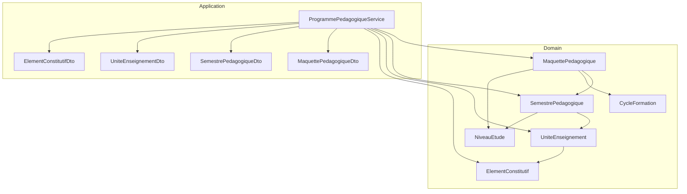
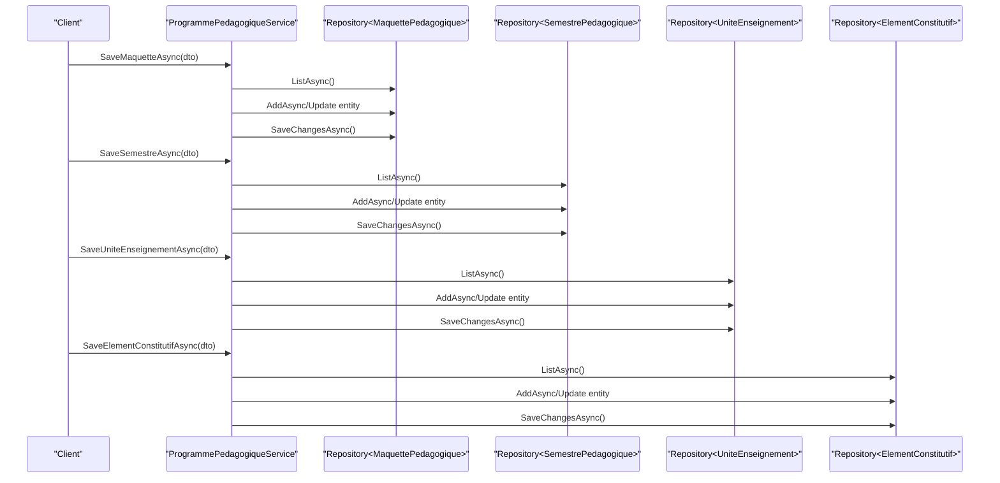
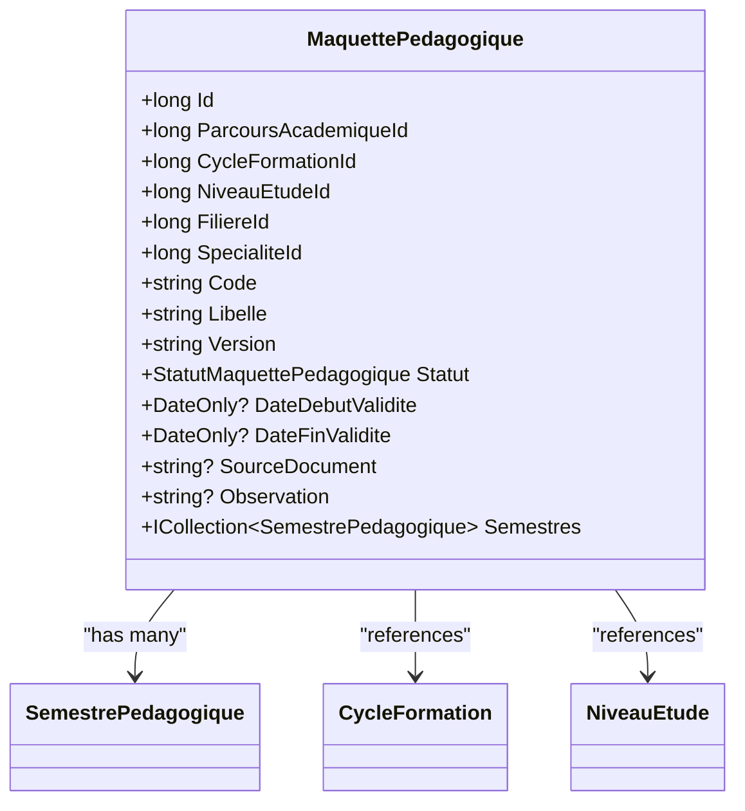
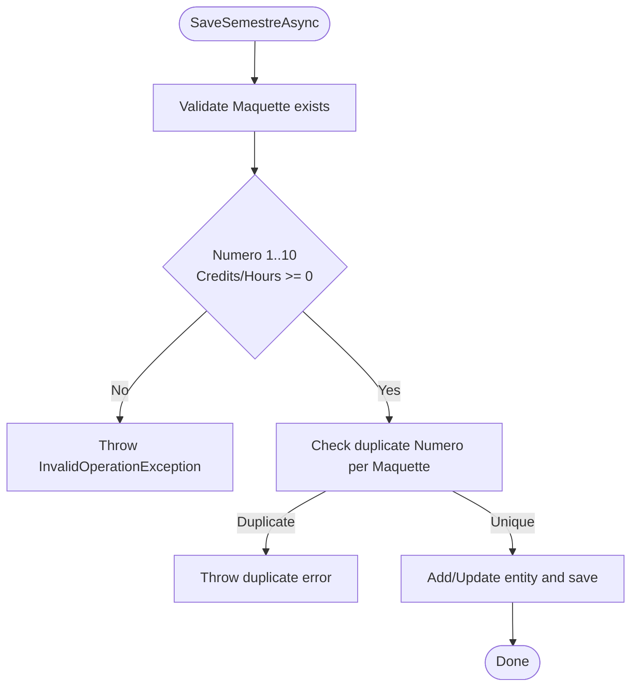
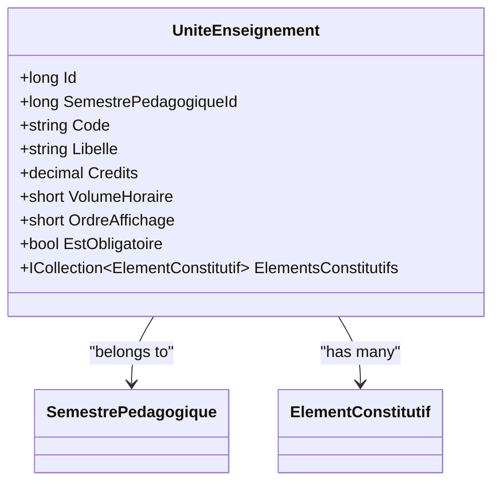
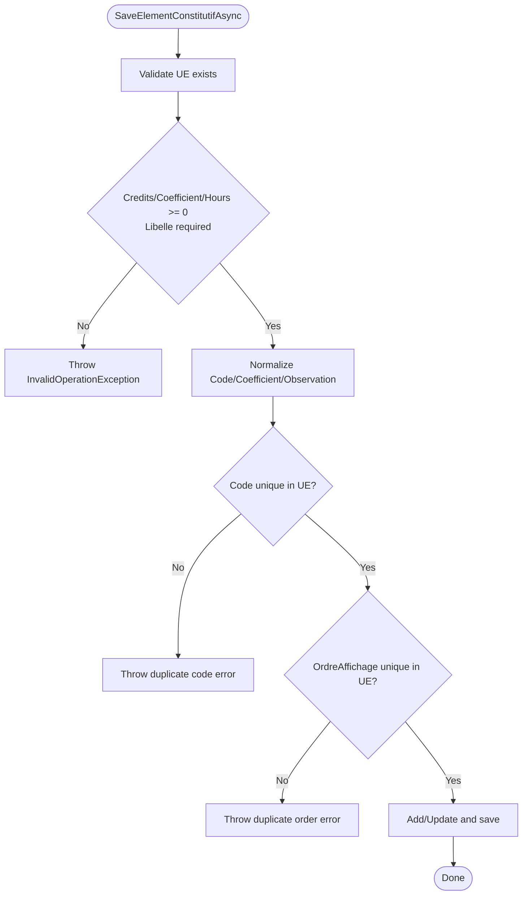
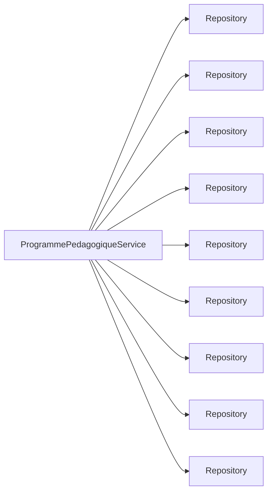

# Academic Programs Domain

<cite>
**Referenced Files in This Document**
- [MaquettePedagogique.cs](file://RIIS.Academic.Domain/Programmes/MaquettePedagogique.cs)
- [SemestrePedagogique.cs](file://RIIS.Academic.Domain/Programmes/SemestrePedagogique.cs)
- [UniteEnseignement.cs](file://RIIS.Academic.Domain/Programmes/UniteEnseignement.cs)
- [ElementConstitutif.cs](file://RIIS.Academic.Domain/Programmes/ElementConstitutif.cs)
- [StatutMaquettePedagogique.cs](file://RIIS.Academic.Domain/Enums/StatutMaquettePedagogique.cs)
- [TypeElementConstitutif.cs](file://RIIS.Academic.Domain/Enums/TypeElementConstitutif.cs)
- [CycleFormation.cs](file://RIIS.Academic.Domain/Referentiels/CycleFormation.cs)
- [NiveauEtude.cs](file://RIIS.Academic.Domain/Referentiels/NiveauEtude.cs)
- [IProgrammePedagogiqueService.cs](file://RIIS.Academic.Application/Programmes/Services/IProgrammePedagogiqueService.cs)
- [ProgrammePedagogiqueService.cs](file://RIIS.Academic.Application/Programmes/Services/ProgrammePedagogiqueService.cs)
- [MaquettePedagogiqueDto.cs](file://RIIS.Academic.Application/Programmes/Dtos/MaquettePedagogiqueDto.cs)
- [SemestrePedagogiqueDto.cs](file://RIIS.Academic.Application/Programmes/Dtos/SemestrePedagogiqueDto.cs)
- [UniteEnseignementDto.cs](file://RIIS.Academic.Application/Programmes/Dtos/UniteEnseignementDto.cs)
- [ElementConstitutifDto.cs](file://RIIS.Academic.Application/Programmes/Dtos/ElementConstitutifDto.cs)
</cite>

## Table of Contents
1. Introduction
2. Project Structure
3. Core Components
4. Architecture Overview
5. Detailed Component Analysis
6. Dependency Analysis
7. Performance Considerations
8. Troubleshooting Guide
9. Conclusion

## Introduction
This document explains the Academic Programs domain model and its business logic for academic planning. The hierarchy starts with MaquettePedagogique (Academic Program), which contains SemestrePedagogique (Semesters), which contain UniteEnseignement (Course Units), which contain ElementConstitutif (Constituent Elements). It covers entity relationships, validation rules enforced by the application service, and practical examples such as creating a program, scheduling semesters, organizing course units, and managing constituent elements. Prerequisite management is addressed conceptually based on available domain entities.

## Project Structure
The Academic Programs domain spans:
- Domain layer: core entities and enums that define the hierarchical structure and shared types
- Application layer: services and DTOs that implement business rules, validation, and data access orchestration
- Referential entities: CycleFormation and NiveauEtude provide context for programs and semesters

**Diagram sources**
- [MaquettePedagogique.cs:5-30](file://RIIS.Academic.Domain/Programmes/MaquettePedagogique.cs#L5-L30)
- [SemestrePedagogique.cs:3-19](file://RIIS.Academic.Domain/Programmes/SemestrePedagogique.cs#L3-L19)
- [UniteEnseignement.cs:3-17](file://RIIS.Academic.Domain/Programmes/UniteEnseignement.cs#L3-L17)
- [ElementConstitutif.cs:3-20](file://RIIS.Academic.Domain/Programmes/ElementConstitutif.cs#L3-L20)
- [CycleFormation.cs:3-12](file://RIIS.Academic.Domain/Referentiels/CycleFormation.cs#L3-L12)
- [NiveauEtude.cs:3-13](file://RIIS.Academic.Domain/Referentiels/NiveauEtude.cs#L3-L13)
- [ProgrammePedagogiqueService.cs:8-17](file://RIIS.Academic.Application/Programmes/Services/ProgrammePedagogiqueService.cs#L8-L17)
- [MaquettePedagogiqueDto.cs:5-19](file://RIIS.Academic.Application/Programmes/Dtos/MaquettePedagogiqueDto.cs#L5-L19)
- [SemestrePedagogiqueDto.cs:3-16](file://RIIS.Academic.Application/Programmes/Dtos/SemestrePedagogiqueDto.cs#L3-L16)
- [UniteEnseignementDto.cs:3-15](file://RIIS.Academic.Application/Programmes/Dtos/UniteEnseignementDto.cs#L3-L15)
- [ElementConstitutifDto.cs:5-19](file://RIIS.Academic.Application/Programmes/Dtos/ElementConstitutifDto.cs#L5-L19)

**Section sources**
- [MaquettePedagogique.cs:5-30](file://RIIS.Academic.Domain/Programmes/MaquettePedagogique.cs#L5-L30)
- [SemestrePedagogique.cs:3-19](file://RIIS.Academic.Domain/Programmes/SemestrePedagogique.cs#L3-L19)
- [UniteEnseignement.cs:3-17](file://RIIS.Academic.Domain/Programmes/UniteEnseignement.cs#L3-L17)
- [ElementConstitutif.cs:3-20](file://RIIS.Academic.Domain/Programmes/ElementConstitutif.cs#L3-L20)
- [CycleFormation.cs:3-12](file://RIIS.Academic.Domain/Referentiels/CycleFormation.cs#L3-L12)
- [NiveauEtude.cs:3-13](file://RIIS.Academic.Domain/Referentiels/NiveauEtude.cs#L3-L13)
- [ProgrammePedagogiqueService.cs:8-17](file://RIIS.Academic.Application/Programmes/Services/ProgrammePedagogiqueService.cs#L8-L17)

## Core Components
- MaquettePedagogique (Academic Program): Represents a versioned academic program bound to a study path (cycle, level, stream, specialty). It has validity dates, status, and holds semesters.
- SemestrePedagogique (Semester): Belongs to a program, carries semester number, label, expected credits/hours, and display order. Holds course units.
- UniteEnseignement (Course Unit): Belongs to a semester, defines code, label, credits, hours, ordering, and whether it is mandatory. Holds constituent elements.
- ElementConstitutif (Constituent Element): Belongs to a course unit, defines type (course, internship, project, thesis, other), credits, coefficient, hours, ordering, and whether it is mandatory.

Relationships:
- One MaquettePedagogique has many SemestrePedagogique
- One SemestrePedagogique has many UniteEnseignement
- One UniteEnseignement has many ElementConstitutif
- MaquettePedagogique references CycleFormation, NiveauEtude, Filiere, Specialite
- SemestrePedagogique optionally references NiveauEtude

Validation and business rules (enforced in the service):
- Program creation/update requires a valid study path; unique combination of cycle/level/stream/specialty plus code/version
- Validity date range must be consistent (end >= start)
- Semester number must be between 1 and 10; unique per program; non-negative credits and hours
- Course unit code must be unique within a semester; non-negative credits and hours
- Constituent element code must be unique within a course unit; non-negative credits/coefficient/hours; default coefficient normalized to 1 if zero
- Display ordering uniqueness enforced for constituent elements within a course unit

Examples of usage patterns:
- Create a default program, then save with required fields and validity dates
- Create default semesters with auto-incremented numbers and defaults for credits/hours
- Add course units with codes and labels, set credits/hours and mandatory flag
- Add constituent elements with types, coefficients, and volumes

**Section sources**
- [MaquettePedagogique.cs:5-30](file://RIIS.Academic.Domain/Programmes/MaquettePedagogique.cs#L5-L30)
- [SemestrePedagogique.cs:3-19](file://RIIS.Academic.Domain/Programmes/SemestrePedagogique.cs#L3-L19)
- [UniteEnseignement.cs:3-17](file://RIIS.Academic.Domain/Programmes/UniteEnseignement.cs#L3-L17)
- [ElementConstitutif.cs:3-20](file://RIIS.Academic.Domain/Programmes/ElementConstitutif.cs#L3-L20)
- [StatutMaquettePedagogique.cs:3-8](file://RIIS.Academic.Domain/Enums/StatutMaquettePedagogique.cs#L3-L8)
- [TypeElementConstitutif.cs:3-10](file://RIIS.Academic.Domain/Enums/TypeElementConstitutif.cs#L3-L10)
- [ProgrammePedagogiqueService.cs:143-226](file://RIIS.Academic.Application/Programmes/Services/ProgrammePedagogiqueService.cs#L143-L226)
- [ProgrammePedagogiqueService.cs:269-352](file://RIIS.Academic.Application/Programmes/Services/ProgrammePedagogiqueService.cs#L269-L352)
- [ProgrammePedagogiqueService.cs:499-574](file://RIIS.Academic.Application/Programmes/Services/ProgrammePedagogiqueService.cs#L499-L574)
- [ProgrammePedagogiqueService.cs:613-712](file://RIIS.Academic.Application/Programmes/Services/ProgrammePedagogiqueService.cs#L613-L712)

## Architecture Overview
The application service coordinates reads/writes across domain entities and referential lookups. It exposes methods to list, create, update, and delete each level of the hierarchy, and provides hierarchical views that assemble related data efficiently.

**Diagram sources**
- [ProgrammePedagogiqueService.cs:151-226](file://RIIS.Academic.Application/Programmes/Services/ProgrammePedagogiqueService.cs#L151-L226)
- [ProgrammePedagogiqueService.cs:290-352](file://RIIS.Academic.Application/Programmes/Services/ProgrammePedagogiqueService.cs#L290-L352)
- [ProgrammePedagogiqueService.cs:518-574](file://RIIS.Academic.Application/Programmes/Services/ProgrammePedagogiqueService.cs#L518-L574)
- [ProgrammePedagogiqueService.cs:634-712](file://RIIS.Academic.Application/Programmes/Services/ProgrammePedagogiqueService.cs#L634-L712)

## Detailed Component Analysis

### MaquettePedagogique (Academic Program)
- Purpose: Versioned academic program tied to a study path (cycle, level, stream, specialty) with optional validity window and status
- Key properties: Code, Libelle, Version, Statut, DateDebutValidite, DateFinValidite, SourceDocument, Observation
- Relationships: Many SemestrePedagogique; references CycleFormation, NiveauEtude, Filiere, Specialite
- Validation highlights:
  - Requires a valid parcours (study path)
  - Unique code+version per study path combination
  - Validity dates must be ordered correctly

**Diagram sources**
- [MaquettePedagogique.cs:5-30](file://RIIS.Academic.Domain/Programmes/MaquettePedagogique.cs#L5-L30)
- [SemestrePedagogique.cs:3-19](file://RIIS.Academic.Domain/Programmes/SemestrePedagogique.cs#L3-L19)
- [CycleFormation.cs:3-12](file://RIIS.Academic.Domain/Referentiels/CycleFormation.cs#L3-L12)
- [NiveauEtude.cs:3-13](file://RIIS.Academic.Domain/Referentiels/NiveauEtude.cs#L3-L13)

**Section sources**
- [MaquettePedagogique.cs:5-30](file://RIIS.Academic.Domain/Programmes/MaquettePedagogique.cs#L5-L30)
- [StatutMaquettePedagogique.cs:3-8](file://RIIS.Academic.Domain/Enums/StatutMaquettePedagogique.cs#L3-L8)
- [ProgrammePedagogiqueService.cs:143-226](file://RIIS.Academic.Application/Programmes/Services/ProgrammePedagogiqueService.cs#L143-L226)

### SemestrePedagogique (Semester)
- Purpose: Defines a teaching period within a program with expected workload and credits
- Key properties: Numero, Libelle, CreditsAttendus, VolumeHoraireAttendu, OrdreAffichage
- Relationships: Belongs to MaquettePedagogique; optional NiveauEtude; contains many UniteEnseignement
- Validation highlights:
  - Number must be between 1 and 10
  - Non-negative credits and hours
  - Unique number per program

**Diagram sources**
- [ProgrammePedagogiqueService.cs:290-352](file://RIIS.Academic.Application/Programmes/Services/ProgrammePedagogiqueService.cs#L290-L352)

**Section sources**
- [SemestrePedagogique.cs:3-19](file://RIIS.Academic.Domain/Programmes/SemestrePedagogique.cs#L3-L19)
- [ProgrammePedagogiqueService.cs:269-352](file://RIIS.Academic.Application/Programmes/Services/ProgrammePedagogiqueService.cs#L269-L352)

### UniteEnseignement (Course Unit)
- Purpose: A teachable unit within a semester with credits, hours, and mandatory flag
- Key properties: Code, Libelle, Credits, VolumeHoraire, OrdreAffichage, EstObligatoire
- Relationships: Belongs to SemestrePedagogique; contains many ElementConstitutif
- Validation highlights:
  - Code unique within semester
  - Non-negative credits and hours

**Diagram sources**
- [UniteEnseignement.cs:3-17](file://RIIS.Academic.Domain/Programmes/UniteEnseignement.cs#L3-L17)
- [ElementConstitutif.cs:3-20](file://RIIS.Academic.Domain/Programmes/ElementConstitutif.cs#L3-L20)
- [SemestrePedagogique.cs:3-19](file://RIIS.Academic.Domain/Programmes/SemestrePedagogique.cs#L3-L19)

**Section sources**
- [UniteEnseignement.cs:3-17](file://RIIS.Academic.Domain/Programmes/UniteEnseignement.cs#L3-L17)
- [ProgrammePedagogiqueService.cs:499-574](file://RIIS.Academic.Application/Programmes/Services/ProgrammePedagogiqueService.cs#L499-L574)

### ElementConstitutif (Constituent Element)
- Purpose: A specific teaching/assessment component within a course unit
- Key properties: Code (optional), Libelle, Type, Credits, Coefficient, VolumeHoraire, OrdreAffichage, EstObligatoire
- Relationships: Belongs to UniteEnseignement
- Validation highlights:
  - Code unique within unit (when provided)
  - Non-negative credits/coefficient/hours
  - Default coefficient normalized to 1 when zero
  - Display order uniqueness within unit

**Diagram sources**
- [ProgrammePedagogiqueService.cs:634-712](file://RIIS.Academic.Application/Programmes/Services/ProgrammePedagogiqueService.cs#L634-L712)

**Section sources**
- [ElementConstitutif.cs:3-20](file://RIIS.Academic.Domain/Programmes/ElementConstitutif.cs#L3-L20)
- [TypeElementConstitutif.cs:3-10](file://RIIS.Academic.Domain/Enums/TypeElementConstitutif.cs#L3-L10)
- [ProgrammePedagogiqueService.cs:613-712](file://RIIS.Academic.Application/Programmes/Services/ProgrammePedagogiqueService.cs#L613-L712)

### DTOs and Hierarchy Views
- DTOs expose read-friendly shapes including parent labels and counts (e.g., NombreSemestres, NombreUnitesEnseignement, NombreElementsConstitutifs)
- Hierarchy methods build nested structures for UI consumption, assembling semesters, units, and elements with proper ordering

**Section sources**
- [MaquettePedagogiqueDto.cs:5-19](file://RIIS.Academic.Application/Programmes/Dtos/MaquettePedagogiqueDto.cs#L5-L19)
- [SemestrePedagogiqueDto.cs:3-16](file://RIIS.Academic.Application/Programmes/Dtos/SemestrePedagogiqueDto.cs#L3-L16)
- [UniteEnseignementDto.cs:3-15](file://RIIS.Academic.Application/Programmes/Dtos/UniteEnseignementDto.cs#L3-L15)
- [ElementConstitutifDto.cs:5-19](file://RIIS.Academic.Application/Programmes/Dtos/ElementConstitutifDto.cs#L5-L19)
- [ProgrammePedagogiqueService.cs:33-130](file://RIIS.Academic.Application/Programmes/Services/ProgrammePedagogiqueService.cs#L33-L130)
- [ProgrammePedagogiqueService.cs:418-486](file://RIIS.Academic.Application/Programmes/Services/ProgrammePedagogiqueService.cs#L418-L486)

## Dependency Analysis
The service depends on repositories for all domain entities and performant filtering via in-memory collections after initial loads. It also uses referential entities to validate and filter programs and semesters.

**Diagram sources**
- [ProgrammePedagogiqueService.cs:8-17](file://RIIS.Academic.Application/Programmes/Services/ProgrammePedagogiqueService.cs#L8-L17)

**Section sources**
- [ProgrammePedagogiqueService.cs:8-17](file://RIIS.Academic.Application/Programmes/Services/ProgrammePedagogiqueService.cs#L8-L17)

## Performance Considerations
- Bulk listing followed by in-memory filtering is used in several methods; consider indexing or server-side filtering for large datasets
- Hierarchical queries load multiple tables once and then filter in memory; ensure appropriate indexes on foreign keys (e.g., MaquettePedagogiqueId, SemestrePedagogiqueId, UniteEnseignementId)
- Avoid repeated full scans by caching lookups where feasible at the service boundary
- Use pagination for large lists in future enhancements

[No sources needed since this section provides general guidance]

## Troubleshooting Guide
Common validation errors and their causes:
- Invalid program study path or missing required fields: Ensure a valid parcours is selected and code/libelle/version are provided
- Duplicate program: Same code and version already exist for the same study path combination
- Invalid validity dates: End date must be greater than or equal to start date
- Invalid semester number or duplicates: Number must be between 1 and 10 and unique per program
- Negative credits/hours: All numeric workload fields must be non-negative
- Duplicate unit code: Must be unique within the semester
- Duplicate constituent element code or order: Must be unique within the course unit
- Missing referenced entities: Ensure referenced IDs (program, semester, unit) exist before saving

Where these are enforced:
- Program save validations and uniqueness checks
- Semester save validations and uniqueness checks
- Unit save validations and uniqueness checks
- Constituent element save validations and normalization

**Section sources**
- [ProgrammePedagogiqueService.cs:151-226](file://RIIS.Academic.Application/Programmes/Services/ProgrammePedagogiqueService.cs#L151-L226)
- [ProgrammePedagogiqueService.cs:290-352](file://RIIS.Academic.Application/Programmes/Services/ProgrammePedagogiqueService.cs#L290-L352)
- [ProgrammePedagogiqueService.cs:518-574](file://RIIS.Academic.Application/Programmes/Services/ProgrammePedagogiqueService.cs#L518-L574)
- [ProgrammePedagogiqueService.cs:634-712](file://RIIS.Academic.Application/Programmes/Services/ProgrammePedagogiqueService.cs#L634-L712)

## Conclusion
The Academic Programs domain models a clear, versioned hierarchy from programs down to constituent elements, with robust validation and business rules implemented in the application service. This design supports academic planning workflows such as defining programs, scheduling semesters, structuring course units, and detailing constituent elements. Referential entities provide context for alignment with cycles, levels, and study paths. For prerequisite management, the current domain does not include explicit prerequisite links; any prerequisite logic would need to be added as additional relationships or metadata on course units or constituent elements.

[No sources needed since this section summarizes without analyzing specific files]