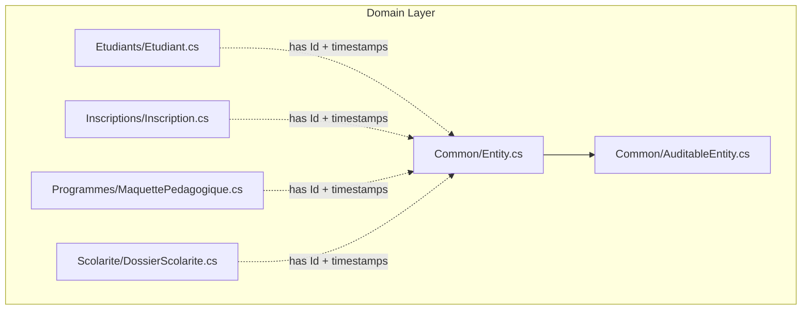
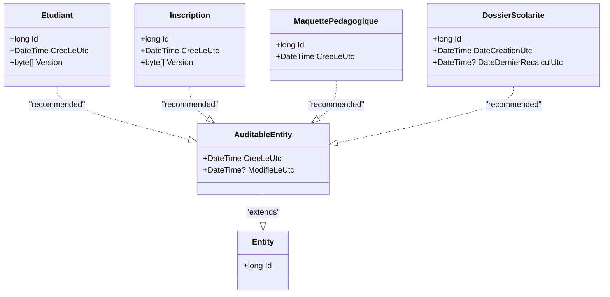
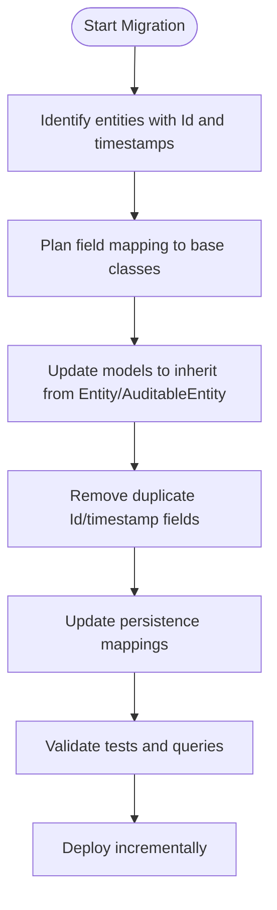
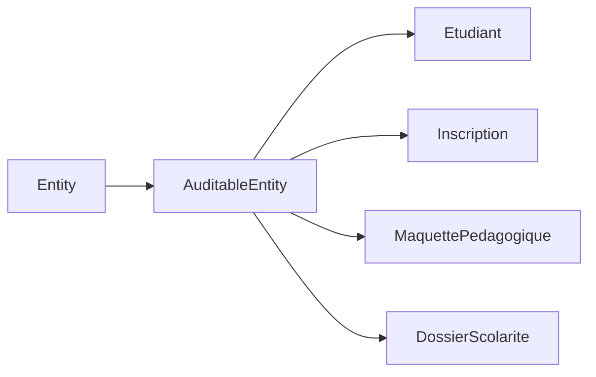

# Core Entities & Base Classes

<cite>
**Referenced Files in This Document**
- [Entity.cs](file://src/RIIS.Academic.Domain/Common/Entity.cs)
- [AuditableEntity.cs](file://src/RIIS.Academic.Domain/Common/AuditableEntity.cs)
- [Etudiant.cs](file://src/RIIS.Academic.Domain/Etudiants/Etudiant.cs)
- [Inscription.cs](file://src/RIIS.Academic.Domain/Inscriptions/Inscription.cs)
- [MaquettePedagogique.cs](file://src/RIIS.Academic.Domain/Programmes/MaquettePedagogique.cs)
- [DossierScolarite.cs](file://src/RIIS.Academic.Domain/Scolarite/DossierScolarite.cs)
</cite>

## Table of Contents
1. Introduction
2. Project Structure
3. Core Components
4. Architecture Overview
5. Detailed Component Analysis
6. Dependency Analysis
7. Performance Considerations
8. Troubleshooting Guide
9. Conclusion

## Introduction
This document explains the core entity base classes in the Domain Layer and how they establish a consistent foundation for domain entities. It focuses on:
- Entity: the minimal base providing a unique identifier.
- AuditableEntity: an extension that adds creation and modification timestamps to support audit trails.

It also shows how current domain entities model these concepts directly (for example, by including Id and timestamp fields), and outlines recommended migration paths to inherit from the base classes for consistency and reduced duplication.

## Project Structure
The base classes live under the Domain Layer’s Common folder. Many domain entities currently define their own Id and timestamp properties inline rather than inheriting from the base classes. This section highlights where the base classes are defined and where similar patterns exist across the domain.

**Diagram sources**
- [Entity.cs:1-8](file://src/RIIS.Academic.Domain/Common/Entity.cs#L1-L8)
- [AuditableEntity.cs:1-9](file://src/RIIS.Academic.Domain/Common/AuditableEntity.cs#L1-L9)
- [Etudiant.cs:1-28](file://src/RIIS.Academic.Domain/Etudiants/Etudiant.cs#L1-L28)
- [Inscription.cs:1-37](file://src/RIIS.Academic.Domain/Inscriptions/Inscription.cs#L1-L37)
- [MaquettePedagogique.cs:1-31](file://src/RIIS.Academic.Domain/Programmes/MaquettePedagogique.cs#L1-L31)
- [DossierScolarite.cs:1-29](file://src/RIIS.Academic.Domain/Scolarite/DossierScolarite.cs#L1-L29)

**Section sources**
- [Entity.cs:1-8](file://src/RIIS.Academic.Domain/Common/Entity.cs#L1-L8)
- [AuditableEntity.cs:1-9](file://src/RIIS.Academic.Domain/Common/AuditableEntity.cs#L1-L9)
- [Etudiant.cs:1-28](file://src/RIIS.Academic.Domain/Etudiants/Etudiant.cs#L1-L28)
- [Inscription.cs:1-37](file://src/RIIS.Academic.Domain/Inscriptions/Inscription.cs#L1-L37)
- [MaquettePedagogique.cs:1-31](file://src/RIIS.Academic.Domain/Programmes/MaquettePedagogique.cs#L1-L31)
- [DossierScolarite.cs:1-29](file://src/RIIS.Academic.Domain/Scolarite/DossierScolarite.cs#L1-L29)

## Core Components
- Entity: Provides a universal long-typed identifier for all domain entities.
- AuditableEntity: Extends Entity with UTC-based timestamps for creation and last update.

These base classes centralize common concerns:
- Identity: Ensures every entity can be uniquely identified.
- Auditability: Captures when records are created and last modified using UTC times for consistency across time zones.

Current state:
- The base classes exist but are not yet inherited by domain entities.
- Many entities already include Id and timestamp fields locally, which suggests a future migration to inheritance will reduce duplication and enforce consistency.

**Section sources**
- [Entity.cs:1-8](file://src/RIIS.Academic.Domain/Common/Entity.cs#L1-L8)
- [AuditableEntity.cs:1-9](file://src/RIIS.Academic.Domain/Common/AuditableEntity.cs#L1-L9)

## Architecture Overview
The intended architecture positions Entity as the root of the domain class hierarchy and AuditableEntity as the standard base for most entities. Domain entities should inherit from one of these bases to gain shared behavior and consistent modeling.

**Diagram sources**
- [Entity.cs:1-8](file://src/RIIS.Academic.Domain/Common/Entity.cs#L1-L8)
- [AuditableEntity.cs:1-9](file://src/RIIS.Academic.Domain/Common/AuditableEntity.cs#L1-L9)
- [Etudiant.cs:1-28](file://src/RIIS.Academic.Domain/Etudiants/Etudiant.cs#L1-L28)
- [Inscription.cs:1-37](file://src/RIIS.Academic.Domain/Inscriptions/Inscription.cs#L1-L37)
- [MaquettePedagogique.cs:1-31](file://src/RIIS.Academic.Domain/Programmes/MaquettePedagogique.cs#L1-L31)
- [DossierScolarite.cs:1-29](file://src/RIIS.Academic.Domain/Scolarite/DossierScolarite.cs#L1-L29)

## Detailed Component Analysis

### Entity
- Purpose: Defines the canonical identity field for all domain entities.
- Impact: Guarantees a uniform way to identify entities across the system.
- Current usage: Present in multiple entities as a local property; ideal target for inheritance.

Benefits of adopting Entity via inheritance:
- Single source of truth for identity.
- Simplifies repository contracts and queries.
- Reduces duplication across entities.

**Section sources**
- [Entity.cs:1-8](file://src/RIIS.Academic.Domain/Common/Entity.cs#L1-L8)

### AuditableEntity
- Purpose: Adds creation and modification timestamps in UTC to support auditing and lifecycle tracking.
- Fields:
  - Creation timestamp: set automatically at creation time.
  - Modification timestamp: nullable, updated on changes.
- Benefits:
  - Consistent audit trail across entities.
  - Timezone-safe timestamps using UTC.
  - Enables change history and compliance reporting.

Adoption guidance:
- Replace local timestamp fields with inherited ones once migration is complete.
- Ensure persistence layer maps these fields consistently.

**Section sources**
- [AuditableEntity.cs:1-9](file://src/RIIS.Academic.Domain/Common/AuditableEntity.cs#L1-L9)

### How Current Entities Model Identity and Timestamps
Several domain entities already include Id and timestamp fields locally. This demonstrates the need to migrate to base class inheritance for consistency.

- Etudiant: Includes Id and a creation timestamp along with concurrency control via a version field.
- Inscription: Includes Id and a creation timestamp plus a version field.
- MaquettePedagogique: Includes Id and a creation timestamp.
- DossierScolarite: Includes Id and creation/recalculation timestamps.

Migration examples:
- Etudiant: Move Id and creation timestamp to AuditableEntity inheritance; keep Version if needed for concurrency.
- Inscription: Migrate Id and creation timestamp to AuditableEntity; retain Version.
- MaquettePedagogique: Migrate Id and creation timestamp to AuditableEntity.
- DossierScolarite: Migrate Id and creation timestamp to AuditableEntity; consider mapping DateDernierRecalculUtc to a business-specific concept or keep it alongside the inherited update timestamp.

**Section sources**
- [Etudiant.cs:1-28](file://src/RIIS.Academic.Domain/Etudiants/Etudiant.cs#L1-L28)
- [Inscription.cs:1-37](file://src/RIIS.Academic.Domain/Inscriptions/Inscription.cs#L1-L37)
- [MaquettePedagogique.cs:1-31](file://src/RIIS.Academic.Domain/Programmes/MaquettePedagogique.cs#L1-L31)
- [DossierScolarite.cs:1-29](file://src/RIIS.Academic.Domain/Scolarite/DossierScolarite.cs#L1-L29)

### Recommended Inheritance Flow
When migrating, follow this sequence to ensure data integrity and minimal disruption:

[No sources needed since this diagram shows conceptual workflow, not actual code structure]

## Dependency Analysis
- Cohesion: Entity and AuditableEntity encapsulate cross-cutting concerns (identity and auditability).
- Coupling: Domain entities depend on these bases to avoid duplicating common fields.
- External dependencies: None beyond standard types (e.g., DateTime, long).

Potential risks:
- Circular dependencies: Not present between base classes and entities.
- Migration risk: Ensure persistence mappings are updated before removing local fields.

**Diagram sources**
- [Entity.cs:1-8](file://src/RIIS.Academic.Domain/Common/Entity.cs#L1-L8)
- [AuditableEntity.cs:1-9](file://src/RIIS.Academic.Domain/Common/AuditableEntity.cs#L1-L9)
- [Etudiant.cs:1-28](file://src/RIIS.Academic.Domain/Etudiants/Etudiant.cs#L1-L28)
- [Inscription.cs:1-37](file://src/RIIS.Academic.Domain/Inscriptions/Inscription.cs#L1-L37)
- [MaquettePedagogique.cs:1-31](file://src/RIIS.Academic.Domain/Programmes/MaquettePedagogique.cs#L1-L31)
- [DossierScolarite.cs:1-29](file://src/RIIS.Academic.Domain/Scolarite/DossierScolarite.cs#L1-L29)

**Section sources**
- [Entity.cs:1-8](file://src/RIIS.Academic.Domain/Common/Entity.cs#L1-L8)
- [AuditableEntity.cs:1-9](file://src/RIIS.Academic.Domain/Common/AuditableEntity.cs#L1-L9)

## Performance Considerations
- Using base classes reduces duplication and improves maintainability, indirectly improving performance by reducing maintenance overhead.
- Storing timestamps in UTC avoids conversion costs and inconsistencies.
- Keep concurrency fields (like Version) separate from audit fields to avoid unnecessary updates during read-heavy operations.

[No sources needed since this section provides general guidance]

## Troubleshooting Guide
Common issues and resolutions:
- Duplicate Id/timestamp fields after migration:
  - Ensure local fields are removed once inheritance is applied.
  - Verify persistence mappings no longer reference removed fields.
- Timezone inconsistencies:
  - Use UTC timestamps consistently; rely on inherited fields from AuditableEntity.
- Concurrency conflicts:
  - Preserve existing concurrency mechanisms (e.g., Version) alongside audit fields.

Validation steps:
- Run unit tests covering entity creation and updates.
- Confirm database schema reflects mapped fields correctly.
- Check application logs for unexpected nulls or type mismatches.

[No sources needed since this section provides general guidance]

## Conclusion
The Domain Layer defines two foundational base classes:
- Entity: centralizes identity.
- AuditableEntity: centralizes creation and modification timestamps in UTC.

While many domain entities currently define these fields locally, migrating them to inherit from these base classes will:
- Eliminate duplication.
- Enforce consistent modeling.
- Improve maintainability and clarity.

Adopting this approach ensures a strong, consistent foundation for all domain entities across the application.

[No sources needed since this section summarizes without analyzing specific files]