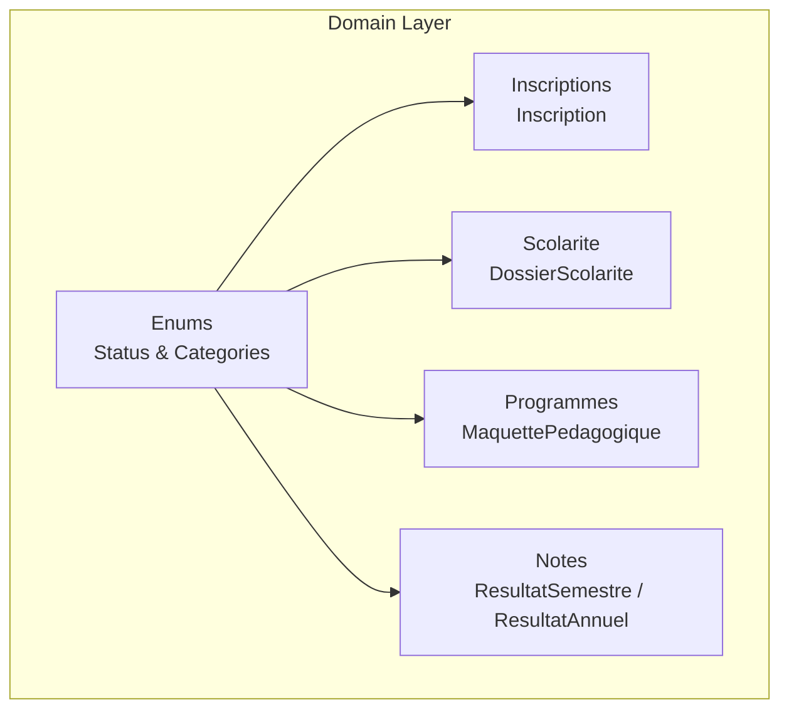
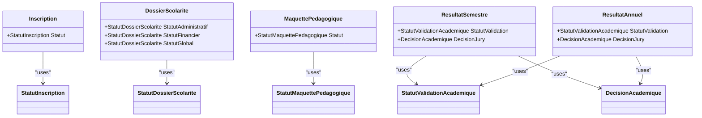
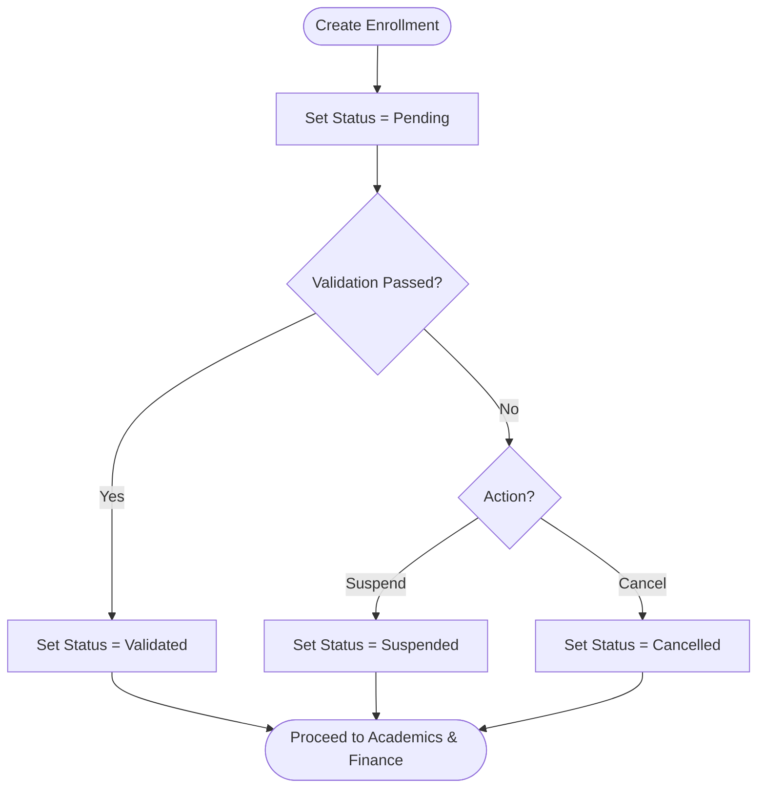
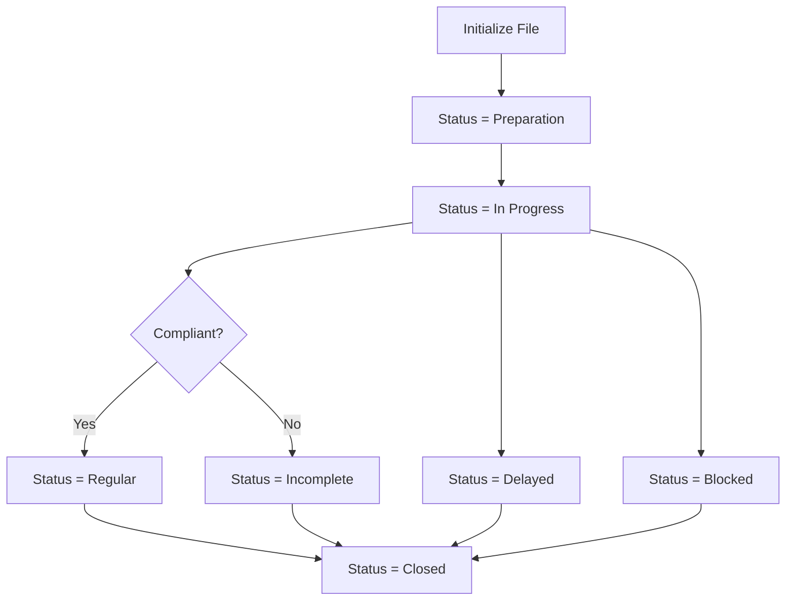
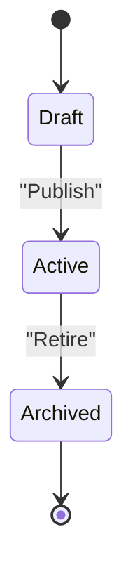
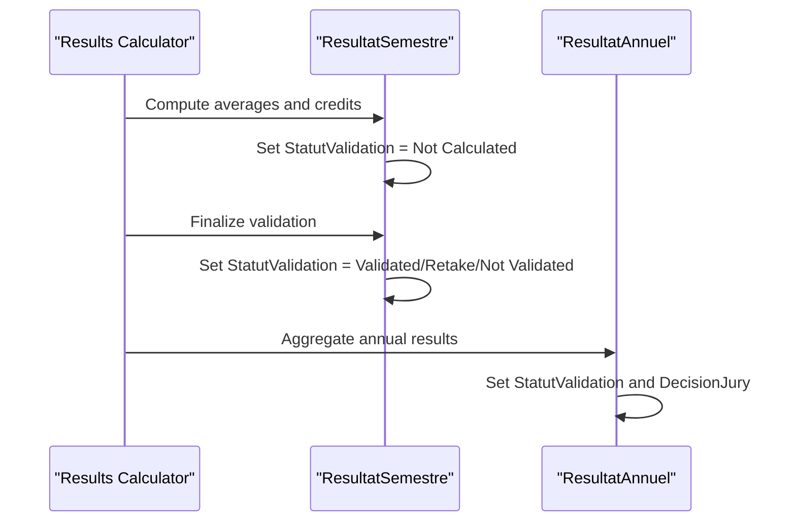
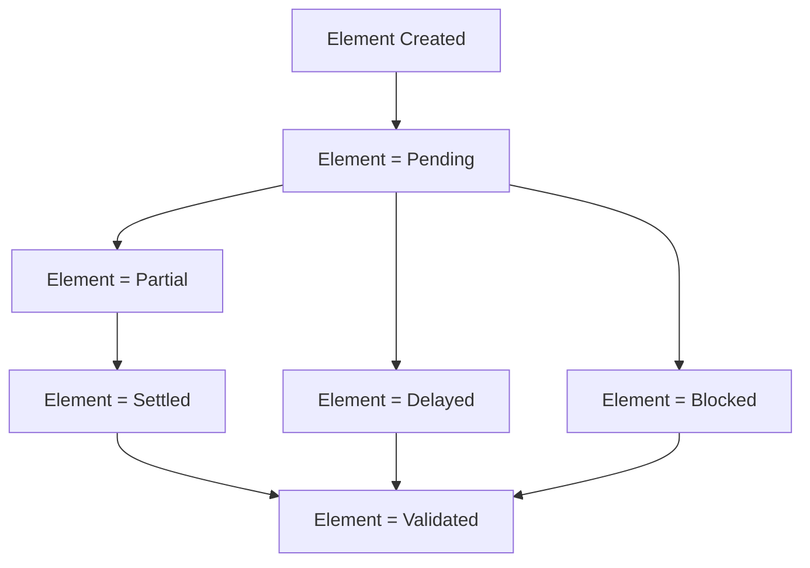
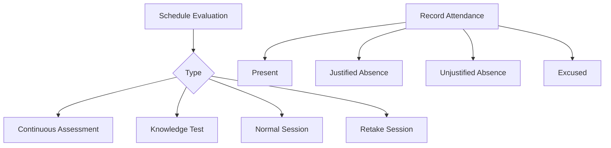
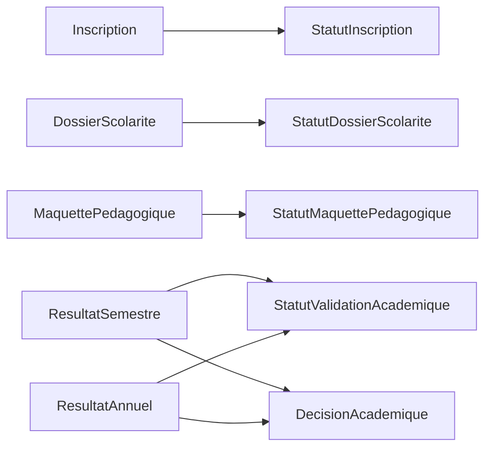

# Domain Enums & Constants

<cite>
**Referenced Files in This Document**
- [StatutDossierScolarite.cs](file://RIIS.Academic.Domain/Enums/StatutDossierScolarite.cs)
- [StatutInscription.cs](file://RIIS.Academic.Domain/Enums/StatutInscription.cs)
- [StatutMaquettePedagogique.cs](file://RIIS.Academic.Domain/Enums/StatutMaquettePedagogique.cs)
- [DecisionAcademique.cs](file://RIIS.Academic.Domain/Enums/DecisionAcademique.cs)
- [StatutValidationAcademique.cs](file://RIIS.Academic.Domain/Enums/StatutValidationAcademique.cs)
- [StatutValidationScolarite.cs](file://RIIS.Academic.Domain/Enums/StatutValidationScolarite.cs)
- [StatutElementScolarite.cs](file://RIIS.Academic.Domain/Enums/StatutElementScolarite.cs)
- [StatutPaiementScolarite.cs](file://RIIS.Academic.Domain/Enums/StatutPaiementScolarite.cs)
- [StatutEcheanceScolarite.cs](file://RIIS.Academic.Domain/Enums/StatutEcheanceScolarite.cs)
- [TypeEvaluation.cs](file://RIIS.Academic.Domain/Enums/TypeEvaluation.cs)
- [StatutPresenceEvaluation.cs](file://RIIS.Academic.Domain/Enums/StatutPresenceEvaluation.cs)
- [CategorieTypeElementScolarite.cs](file://RIIS.Academic.Domain/Enums/CategorieTypeElementScolarite.cs)
- [Inscription.cs](file://RIIS.Academic.Domain/Inscriptions/Inscription.cs)
- [DossierScolarite.cs](file://RIIS.Academic.Domain/Scolarite/DossierScolarite.cs)
- [MaquettePedagogique.cs](file://RIIS.Academic.Domain/Programmes/MaquettePedagogique.cs)
- [ResultatAnnuel.cs](file://RIIS.Academic.Domain/Notes/ResultatAnnuel.cs)
- [ResultatSemestre.cs](file://RIIS.Academic.Domain/Notes/ResultatSemestre.cs)
</cite>

## Table of Contents
1. Introduction
2. Project Structure
3. Core Components
4. Architecture Overview
5. Detailed Component Analysis
6. Dependency Analysis
7. Performance Considerations
8. Troubleshooting Guide
9. Conclusion

## Introduction
This document explains the domain enums and constants that define business states and categories across the academic system. It focuses on status enums such as Student File Status, Enrollment Status, Program Status, and decision enums like Academic Decision. It also shows how these enums enforce business rules, maintain data consistency, and represent valid state transitions and categorical data within domain entities.

## Project Structure
The enums are defined in the Domain layer under a dedicated Enums folder and are consumed by domain entities in Inscriptions, Scolarite, Programmes, and Notes. This separation ensures that business vocabulary is centralized and consistently enforced throughout the application.

**Diagram sources**
- [StatutInscription.cs:3-9](file://RIIS.Academic.Domain/Enums/StatutInscription.cs#L3-L9)
- [StatutDossierScolarite.cs:3-11](file://RIIS.Academic.Domain/Enums/StatutDossierScolarite.cs#L3-L11)
- [StatutMaquettePedagogique.cs:3-7](file://RIIS.Academic.Domain/Enums/StatutMaquettePedagogique.cs#L3-L7)
- [DecisionAcademique.cs:3-8](file://RIIS.Academic.Domain/Enums/DecisionAcademique.cs#L3-L8)
- [StatutValidationAcademique.cs:3-8](file://RIIS.Academic.Domain/Enums/StatutValidationAcademique.cs#L3-L8)
- [Inscription.cs:13](file://RIIS.Academic.Domain/Inscriptions/Inscription.cs#L13)
- [DossierScolarite.cs:17-19](file://RIIS.Academic.Domain/Scolarite/DossierScolarite.cs#L17-L19)
- [MaquettePedagogique.cs:17](file://RIIS.Academic.Domain/Programmes/MaquettePedagogique.cs#L17)
- [ResultatSemestre.cs:16-17](file://RIIS.Academic.Domain/Notes/ResultatSemestre.cs#L16-L17)
- [ResultatAnnuel.cs:13-14](file://RIIS.Academic.Domain/Notes/ResultatAnnuel.cs#L13-L14)

**Section sources**
- [StatutInscription.cs:3-9](file://RIIS.Academic.Domain/Enums/StatutInscription.cs#L3-L9)
- [StatutDossierScolarite.cs:3-11](file://RIIS.Academic.Domain/Enums/StatutDossierScolarite.cs#L3-L11)
- [StatutMaquettePedagogique.cs:3-7](file://RIIS.Academic.Domain/Enums/StatutMaquettePedagogique.cs#L3-L7)
- [DecisionAcademique.cs:3-8](file://RIIS.Academic.Domain/Enums/DecisionAcademique.cs#L3-L8)
- [StatutValidationAcademique.cs:3-8](file://RIIS.Academic.Domain/Enums/StatutValidationAcademique.cs#L3-L8)
- [Inscription.cs:13](file://RIIS.Academic.Domain/Inscriptions/Inscription.cs#L13)
- [DossierScolarite.cs:17-19](file://RIIS.Academic.Domain/Scolarite/DossierScolarite.cs#L17-L19)
- [MaquettePedagogique.cs:17](file://RIIS.Academic.Domain/Programmes/MaquettePedagogique.cs#L17)
- [ResultatSemestre.cs:16-17](file://RIIS.Academic.Domain/Notes/ResultatSemestre.cs#L16-L17)
- [ResultatAnnuel.cs:13-14](file://RIIS.Academic.Domain/Notes/ResultatAnnuel.cs#L13-L14)

## Core Components
This section summarizes the key enums and their role in enforcing business rules.

- StatutDossierScolarite (Student File Status): Represents administrative, financial, and overall status for a student file. Used to track lifecycle stages from preparation through closure and to coordinate cross-functional validations.
- StatutInscription (Enrollment Status): Captures enrollment lifecycle states such as pending, validated, suspended, or cancelled. Enforces consistent enrollment workflow outcomes.
- StatutMaquettePedagogique (Program Status): Controls program versioning and visibility with draft, active, and archived states. Ensures only appropriate versions are used for enrollments and results.
- DecisionAcademique (Academic Decision): Encodes jury decisions including not deliberated, passed, allowed retake, and deferred. Drives downstream processes like progression and transcript generation.
- StatutValidationAcademique (Academic Validation Status): Indicates calculation and validation phases (not calculated, validated, retake, not validated). Coordinates result computation and finalization.
- StatutValidationScolarite (Administrative/Financial Validation Status): Tracks administrative and financial validation steps (pending, validated, rejected, cancelled).
- StatutElementScolarite, StatutPaiementScolarite, StatutEcheanceScolarite: Model billing elements, payments, and due dates with granular statuses to support accurate financial tracking and enforcement.
- TypeEvaluation, StatutPresenceEvaluation: Categorize evaluation types and attendance presence to standardize assessment workflows.
- CategorieTypeElementScolarite: Classifies school fee elements into fees, documents, validations, services, or other categories for reporting and processing.

These enums provide a shared vocabulary and guardrails that prevent invalid states and ensure consistent behavior across modules.

**Section sources**
- [StatutDossierScolarite.cs:3-11](file://RIIS.Academic.Domain/Enums/StatutDossierSolarite.cs#L3-L11)
- [StatutInscription.cs:3-9](file://RIIS.Academic.Domain/Enums/StatutInscription.cs#L3-L9)
- [StatutMaquettePedagogique.cs:3-7](file://RIIS.Academic.Domain/Enums/StatutMaquettePedagogique.cs#L3-L7)
- [DecisionAcademique.cs:3-8](file://RIIS.Academic.Domain/Enums/DecisionAcademique.cs#L3-L8)
- [StatutValidationAcademique.cs:3-8](file://RIIS.Academic.Domain/Enums/StatutValidationAcademique.cs#L3-L8)
- [StatutValidationScolarite.cs:3-8](file://RIIS.Academic.Domain/Enums/StatutValidationScolarite.cs#L3-L8)
- [StatutElementScolarite.cs:3-12](file://RIIS.Academic.Domain/Enums/StatutElementScolarite.cs#L3-L12)
- [StatutPaiementScolarite.cs:3-8](file://RIIS.Academic.Domain/Enums/StatutPaiementScolarite.cs#L3-L8)
- [StatutEcheanceScolarite.cs:3-10](file://RIIS.Academic.Domain/Enums/StatutEcheanceScolarite.cs#L3-L10)
- [TypeEvaluation.cs:3-8](file://RIIS.Academic.Domain/Enums/TypeEvaluation.cs#L3-L8)
- [StatutPresenceEvaluation.cs:3-8](file://RIIS.Academic.Domain/Enums/StatutPresenceEvaluation.cs#L3-L8)
- [CategorieTypeElementScolarite.cs:3-9](file://RIIS.Academic.Domain/Enums/CategorieTypeElementScolarite.cs#L3-L9)

## Architecture Overview
The enums are consumed by core domain entities to model stateful business objects. The following diagram maps where each enum is applied in the domain model.

**Diagram sources**
- [Inscription.cs:13](file://RIIS.Academic.Domain/Inscriptions/Inscription.cs#L13)
- [DossierScolarite.cs:17-19](file://RIIS.Academic.Domain/Scolarite/DossierScolarite.cs#L17-L19)
- [MaquettePedagogique.cs:17](file://RIIS.Academic.Domain/Programmes/MaquettePedagogique.cs#L17)
- [ResultatSemestre.cs:16-17](file://RIIS.Academic.Domain/Notes/ResultatSemestre.cs#L16-L17)
- [ResultatAnnuel.cs:13-14](file://RIIS.Academic.Domain/Notes/ResultatAnnuel.cs#L13-L14)

## Detailed Component Analysis

### Enrollment Status (StatutInscription)
- Purpose: Models the lifecycle of an enrollment from pending to validated, suspended, or cancelled.
- Business Rules:
  - New enrollments start in a pending state.
  - Validated enrollments enable subsequent academic and financial processes.
  - Suspended or cancelled states block further progression until resolved.
- Entity Usage:
  - Inscription holds the current enrollment status and drives UI and workflow logic.

**Diagram sources**
- [StatutInscription.cs:3-9](file://RIIS.Academic.Domain/Enums/StatutInscription.cs#L3-L9)
- [Inscription.cs:13](file://RIIS.Academic.Domain/Inscriptions/Inscription.cs#L13)

**Section sources**
- [StatutInscription.cs:3-9](file://RIIS.Academic.Domain/Enums/StatutInscription.cs#L3-L9)
- [Inscription.cs:13](file://RIIS.Academic.Domain/Inscriptions/Inscription.cs#L13)

### Student File Status (StatutDossierScolarite)
- Purpose: Tracks administrative, financial, and overall status of a student file across its lifecycle.
- Business Rules:
  - Administrative and financial statuses can evolve independently but influence the global status.
  - States include preparation, in progress, regular, incomplete, delayed, blocked, and closed.
- Entity Usage:
  - DossierScolarite exposes separate statuses for administrative, financial, and global views.

**Diagram sources**
- [StatutDossierScolarite.cs:3-11](file://RIIS.Academic.Domain/Enums/StatutDossierScolarite.cs#L3-L11)
- [DossierScolarite.cs:17-19](file://RIIS.Academic.Domain/Scolarite/DossierScolarite.cs#L17-L19)

**Section sources**
- [StatutDossierScolarite.cs:3-11](file://RIIS.Academic.Domain/Enums/StatutDossierScolarite.cs#L3-L11)
- [DossierScolarite.cs:17-19](file://RIIS.Academic.Domain/Scolarite/DossierScolarite.cs#L17-L19)

### Program Status (StatutMaquettePedagogique)
- Purpose: Manages program versions through draft, active, and archived states.
- Business Rules:
  - Draft programs are editable and not yet published.
  - Active programs are available for enrollments and assessments.
  - Archived programs are preserved for historical reference.
- Entity Usage:
  - MaquettePedagogique stores the current program status and validity dates.

**Diagram sources**
- [StatutMaquettePedagogique.cs:3-7](file://RIIS.Academic.Domain/Enums/StatutMaquettePedagogique.cs#L3-L7)
- [MaquettePedagogique.cs:17](file://RIIS.Academic.Domain/Programmes/MaquettePedagogique.cs#L17)

**Section sources**
- [StatutMaquettePedagogique.cs:3-7](file://RIIS.Academic.Domain/Enums/StatutMaquettePedagogique.cs#L3-L7)
- [MaquettePedagogique.cs:17](file://RIIS.Academic.Domain/Programmes/MaquettePedagogique.cs#L17)

### Academic Results and Decisions (StatutValidationAcademique and DecisionAcademique)
- Purpose: Capture the validation phase and final jury decision for semester and annual results.
- Business Rules:
  - Validation progresses from not calculated to validated, retake, or not validated.
  - Jury decisions include not deliberated, passed, allowed retake, and deferred.
- Entity Usage:
  - ResultatSemestre and ResultatAnnuel store both validation status and jury decision.

**Diagram sources**
- [StatutValidationAcademique.cs:3-8](file://RIIS.Academic.Domain/Enums/StatutValidationAcademique.cs#L3-L8)
- [DecisionAcademique.cs:3-8](file://RIIS.Academic.Domain/Enums/DecisionAcademique.cs#L3-L8)
- [ResultatSemestre.cs:16-17](file://RIIS.Academic.Domain/Notes/ResultatSemestre.cs#L16-L17)
- [ResultatAnnuel.cs:13-14](file://RIIS.Academic.Domain/Notes/ResultatAnnuel.cs#L13-L14)

**Section sources**
- [StatutValidationAcademique.cs:3-8](file://RIIS.Academic.Domain/Enums/StatutValidationAcademique.cs#L3-L8)
- [DecisionAcademique.cs:3-8](file://RIIS.Academic.Domain/Enums/DecisionAcademique.cs#L3-L8)
- [ResultatSemestre.cs:16-17](file://RIIS.Academic.Domain/Notes/ResultatSemestre.cs#L16-L17)
- [ResultatAnnuel.cs:13-14](file://RIIS.Academic.Domain/Notes/ResultatAnnuel.cs#L13-L14)

### Financial Lifecycle (StatutElementScolarite, StatutPaiementScolarite, StatutEcheanceScolarite)
- Purpose: Model the lifecycle of billable elements, payments, and due dates with precise statuses.
- Business Rules:
  - Elements move from not started to pending, partial, settled, delayed, blocked, validated, or not applicable.
  - Payments transition from unassigned to partially assigned, assigned, or cancelled.
  - Due dates progress from not due, pending, partial, paid, delayed, or cancelled.
- Entity Usage:
  - These enums are used across Scolarite entities to enforce financial integrity and reporting accuracy.

**Diagram sources**
- [StatutElementScolarite.cs:3-12](file://RIIS.Academic.Domain/Enums/StatutElementScolarite.cs#L3-L12)
- [StatutPaiementScolarite.cs:3-8](file://RIIS.Academic.Domain/Enums/StatutPaiementScolarite.cs#L3-L8)
- [StatutEcheanceScolarite.cs:3-10](file://RIIS.Academic.Domain/Enums/StatutEcheanceScolarite.cs#L3-L10)

**Section sources**
- [StatutElementScolarite.cs:3-12](file://RIIS.Academic.Domain/Enums/StatutElementScolarite.cs#L3-L12)
- [StatutPaiementScolarite.cs:3-8](file://RIIS.Academic.Domain/Enums/StatutPaiementScolarite.cs#L3-L8)
- [StatutEcheanceScolarite.cs:3-10](file://RIIS.Academic.Domain/Enums/StatutEcheanceScolarite.cs#L3-L10)

### Assessment Types and Attendance (TypeEvaluation, StatutPresenceEvaluation)
- Purpose: Standardize evaluation categories and attendance presence for consistent assessment handling.
- Business Rules:
  - Evaluation types include continuous assessment, knowledge tests, normal session, and retake session.
  - Presence states include present, justified absence, unjustified absence, and excused.
- Entity Usage:
  - These enums inform scoring, eligibility, and reporting logic in assessment workflows.

**Diagram sources**
- [TypeEvaluation.cs:3-8](file://RIIS.Academic.Domain/Enums/TypeEvaluation.cs#L3-L8)
- [StatutPresenceEvaluation.cs:3-8](file://RIIS.Academic.Domain/Enums/StatutPresenceEvaluation.cs#L3-L8)

**Section sources**
- [TypeEvaluation.cs:3-8](file://RIIS.Academic.Domain/Enums/TypeEvaluation.cs#L3-L8)
- [StatutPresenceEvaluation.cs:3-8](file://RIIS.Academic.Domain/Enums/StatutPresenceEvaluation.cs#L3-L8)

### School Fee Categories (CategorieTypeElementScolarite)
- Purpose: Classify school fee elements into fees, documents, validations, services, or other categories.
- Business Rules:
  - Categories drive reporting, permissions, and processing rules per element type.
- Entity Usage:
  - Applied to school fee elements to group and manage diverse charge types consistently.

**Section sources**
- [CategorieTypeElementScolarite.cs:3-9](file://RIIS.Academic.Domain/Enums/CategorieTypeElementScolarite.cs#L3-L9)

## Dependency Analysis
The following diagram highlights how domain entities depend on specific enums to enforce business constraints.

**Diagram sources**
- [Inscription.cs:13](file://RIIS.Academic.Domain/Inscriptions/Inscription.cs#L13)
- [DossierScolarite.cs:17-19](file://RIIS.Academic.Domain/Scolarite/DossierScolarite.cs#L17-L19)
- [MaquettePedagogique.cs:17](file://RIIS.Academic.Domain/Programmes/MaquettePedagogique.cs#L17)
- [ResultatSemestre.cs:16-17](file://RIIS.Academic.Domain/Notes/ResultatSemestre.cs#L16-L17)
- [ResultatAnnuel.cs:13-14](file://RIIS.Academic.Domain/Notes/ResultatAnnuel.cs#L13-L14)

**Section sources**
- [Inscription.cs:13](file://RIIS.Academic.Domain/Inscriptions/Inscription.cs#L13)
- [DossierScolarite.cs:17-19](file://RIIS.Academic.Domain/Scolarite/DossierScolarite.cs#L17-L19)
- [MaquettePedagogique.cs:17](file://RIIS.Academic.Domain/Programmes/MaquettePedagogique.cs#L17)
- [ResultatSemestre.cs:16-17](file://RIIS.Academic.Domain/Notes/ResultatSemestre.cs#L16-L17)
- [ResultatAnnuel.cs:13-14](file://RIIS.Academic.Domain/Notes/ResultatAnnuel.cs#L13-L14)

## Performance Considerations
- Enum usage avoids string comparisons and reduces database storage size compared to free-form text fields.
- Centralized enums minimize duplication and improve query performance via constrained value sets.
- Using enums in indexes (where applicable) can speed up filtering and reporting queries.

## Troubleshooting Guide
Common issues and resolutions when working with domain enums:

- Invalid state assignment:
  - Symptom: Attempting to set an entity property to an unsupported enum value.
  - Resolution: Ensure all transitions use values defined in the corresponding enum; validate inputs before persistence.
- Inconsistent global status:
  - Symptom: Global student file status does not reflect administrative or financial updates.
  - Resolution: Recalculate global status based on administrative and financial statuses after any change.
- Stale program version:
  - Symptom: Enrollments referencing archived programs.
  - Resolution: Restrict enrollments to active programs; archive only when no active dependencies exist.
- Misapplied financial statuses:
  - Symptom: Payment or due date statuses out of sync with actual transactions.
  - Resolution: Apply atomic updates to related financial entities and reconcile statuses after each transaction.

[No sources needed since this section provides general guidance]

## Conclusion
Domain enums and constants form the backbone of business rule enforcement in the academic system. By centralizing states and categories, they ensure data consistency, clear lifecycle management, and reliable reporting across enrollment, academics, and finance domains. Adopting these enums consistently across entities and services helps maintain predictable behavior and simplifies maintenance and evolution of the application.

[No sources needed since this section summarizes without analyzing specific files]