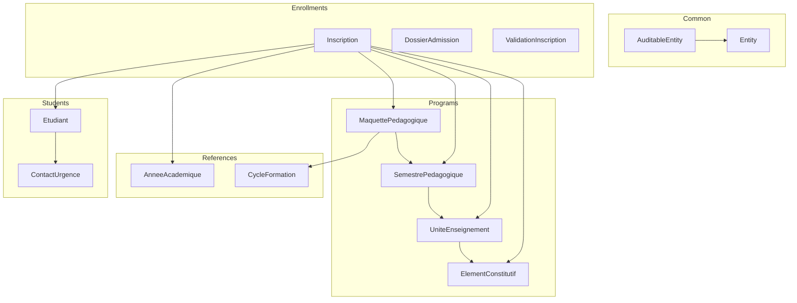
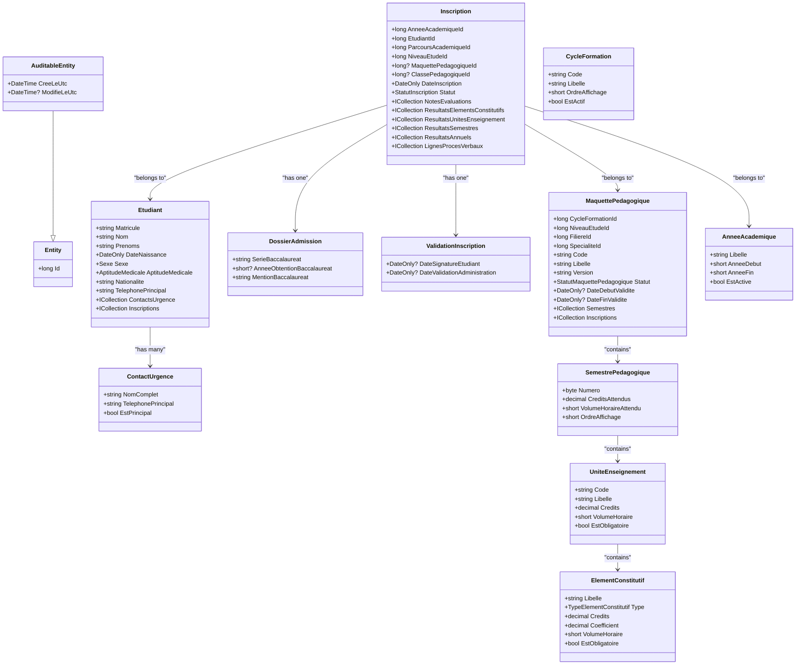
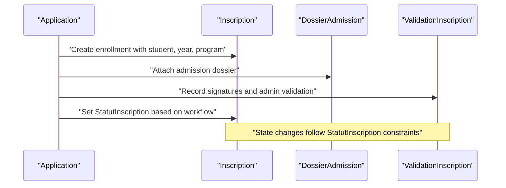
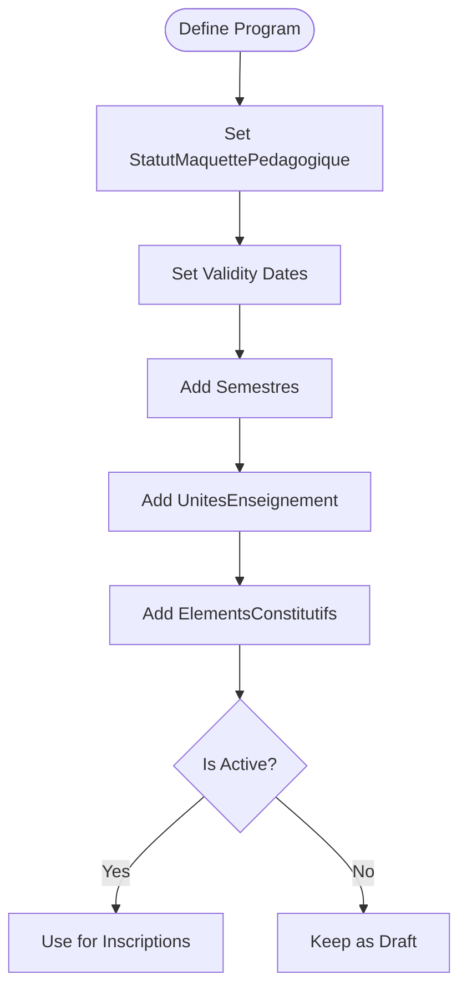
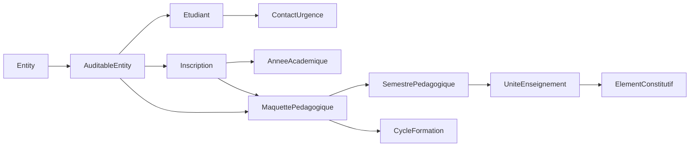

# Domain Layer

<cite>
**Referenced Files in This Document**
- [Entity.cs](file://RIIS.Academic.Domain/Common/Entity.cs)
- [AuditableEntity.cs](file://RIIS.Academic.Domain/Common/AuditableEntity.cs)
- [Etudiant.cs](file://RIIS.Academic.Domain/Etudiants/Etudiant.cs)
- [ContactUrgence.cs](file://RIIS.Academic.Domain/Etudiants/ContactUrgence.cs)
- [Inscription.cs](file://RIIS.Academic.Domain/Inscriptions/Inscription.cs)
- [DossierAdmission.cs](file://RIIS.Academic.Domain/Inscriptions/DossierAdmission.cs)
- [ValidationInscription.cs](file://RIIS.Academic.Domain/Inscriptions/ValidationInscription.cs)
- [MaquettePedagogique.cs](file://RIIS.Academic.Domain/Programmes/MaquettePedagogique.cs)
- [SemestrePedagogique.cs](file://RIIS.Academic.Domain/Programmes/SemestrePedagogique.cs)
- [UniteEnseignement.cs](file://RIIS.Academic.Domain/Programmes/UniteEnseignement.cs)
- [ElementConstitutif.cs](file://RIIS.Academic.Domain/Programmes/ElementConstitutif.cs)
- [AnneeAcademique.cs](file://RIIS.Academic.Domain/Referentiels/AnneeAcademique.cs)
- [CycleFormation.cs](file://RIIS.Academic.Domain/Referentiels/CycleFormation.cs)
- [StatutInscription.cs](file://RIIS.Academic.Domain/Enums/StatutInscription.cs)
- [StatutMaquettePedagogique.cs](file://RIIS.Academic.Domain/Enums/StatutMaquettePedagogique.cs)
</cite>

## Table of Contents
1. Introduction
2. Project Structure
3. Core Components
4. Architecture Overview
5. Detailed Component Analysis
6. Dependency Analysis
7. Performance Considerations
8. Troubleshooting Guide
9. Conclusion

## Introduction
This document explains the Domain Layer of the RIIS Academic Management System. It focuses on core domain entities, business rules, and models that represent academic management concepts such as students, enrollments, and academic programs. It also documents base classes for identity and auditing, key aggregates and their relationships, validation and state behavior, and how the layer remains pure without infrastructure dependencies.

## Project Structure
The Domain Layer is organized by bounded contexts and concerns:
- Common base types for identity and auditing
- Student-related entities
- Enrollment-related aggregates
- Academic program model (curriculum structure)
- Reference data (academic years, cycles)
- Enums capturing domain states and types

**Diagram sources**
- [Entity.cs:4-7](file://RIIS.Academic.Domain/Common/Entity.cs#L4-L7)
- [AuditableEntity.cs:4-8](file://RIIS.Academic.Domain/Common/AuditableEntity.cs#L4-L8)
- [Etudiant.cs:3-27](file://RIIS.Academic.Domain/Etudiants/Etudiant.cs#L3-L27)
- [ContactUrgence.cs:3-14](file://RIIS.Academic.Domain/Etudiants/ContactUrgence.cs#L3-L14)
- [Inscription.cs:3-36](file://RIIS.Academic.Domain/Inscriptions/Inscription.cs#L3-L36)
- [DossierAdmission.cs:3-16](file://RIIS.Academic.Domain/Inscriptions/DossierAdmission.cs#L3-L16)
- [ValidationInscription.cs:3-17](file://RIIS.Academic.Domain/Inscriptions/ValidationInscription.cs#L3-L17)
- [MaquettePedagogique.cs:5-30](file://RIIS.Academic.Domain/Programmes/MaquettePedagogique.cs#L5-L30)
- [SemestrePedagogique.cs:3-19](file://RIIS.Academic.Domain/Programmes/SemestrePedagogique.cs#L3-L19)
- [UniteEnseignement.cs:3-17](file://RIIS.Academic.Domain/Programmes/UniteEnseignement.cs#L3-L17)
- [ElementConstitutif.cs:3-20](file://RIIS.Academic.Domain/Programmes/ElementConstitutif.cs#L3-L20)
- [AnneeAcademique.cs:3-14](file://RIIS.Academic.Domain/Referentiels/AnneeAcademique.cs#L3-L14)
- [CycleFormation.cs:3-12](file://RIIS.Academic.Domain/Referentiels/CycleFormation.cs#L3-L12)

**Section sources**
- [Entity.cs:4-7](file://RIIS.Academic.Domain/Common/Entity.cs#L4-L7)
- [AuditableEntity.cs:4-8](file://RIIS.Academic.Domain/Common/AuditableEntity.cs#L4-L8)
- [Etudiant.cs:3-27](file://RIIS.Academic.Domain/Etudiants/Etudiant.cs#L3-L27)
- [Inscription.cs:3-36](file://RIIS.Academic.Domain/Inscriptions/Inscription.cs#L3-L36)
- [MaquettePedagogique.cs:5-30](file://RIIS.Academic.Domain/Programmes/MaquettePedagogique.cs#L5-L30)
- [SemestrePedagogique.cs:3-19](file://RIIS.Academic.Domain/Programmes/SemestrePedagogique.cs#L3-L19)
- [UniteEnseignement.cs:3-17](file://RIIS.Academic.Domain/Programmes/UniteEnseignement.cs#L3-L17)
- [ElementConstitutif.cs:3-20](file://RIIS.Academic.Domain/Programmes/ElementConstitutif.cs#L3-L20)
- [AnneeAcademique.cs:3-14](file://RIIS.Academic.Domain/Referentiels/AnneeAcademique.cs#L3-L14)
- [CycleFormation.cs:3-12](file://RIIS.Academic.Domain/Referentiels/CycleFormation.cs#L3-L12)

## Core Components
- Base Entity provides a universal identifier used across all domain objects.
- AuditableEntity extends Entity with creation and modification timestamps to support auditability.
- Etudiant represents a student with personal details, contact information, and emergency contacts; it owns collections of related records.
- Inscription represents an enrollment linking a student to an academic year, program, level, class, and associated administrative and academic artifacts.
- MaquettePedagogique defines an academic program (curriculum) with validity windows and status, composed of semesters and units.
- Supporting entities include SemestrePedagogique, UniteEnseignement, ElementConstitutif, AnneeAcademique, CycleFormation, and enums for statuses.

Key behaviors observed from the model:
- Identity and versioning: Entities expose Id and many include a Version field for concurrency control.
- Audit fields: Creation timestamps are present on several entities.
- Rich relationships: Aggregates maintain navigational properties to related domain objects.
- State via enums: Statuses like StatutInscription and StatutMaquettePedagogique constrain lifecycle states.

**Section sources**
- [Entity.cs:4-7](file://RIIS.Academic.Domain/Common/Entity.cs#L4-L7)
- [AuditableEntity.cs:4-8](file://RIIS.Academic.Domain/Common/AuditableEntity.cs#L4-L8)
- [Etudiant.cs:3-27](file://RIIS.Academic.Domain/Etudiants/Etudiant.cs#L3-L27)
- [Inscription.cs:3-36](file://RIIS.Academic.Domain/Inscriptions/Inscription.cs#L3-L36)
- [MaquettePedagogique.cs:5-30](file://RIIS.Academic.Domain/Programmes/MaquettePedagogique.cs#L5-L30)
- [SemestrePedagogique.cs:3-19](file://RIIS.Academic.Domain/Programmes/SemestrePedagogique.cs#L3-L19)
- [UniteEnseignement.cs:3-17](file://RIIS.Academic.Domain/Programmes/UniteEnseignement.cs#L3-L17)
- [ElementConstitutif.cs:3-20](file://RIIS.Academic.Domain/Programmes/ElementConstitutif.cs#L3-L20)
- [AnneeAcademique.cs:3-14](file://RIIS.Academic.Domain/Referentiels/AnneeAcademique.cs#L3-L14)
- [CycleFormation.cs:3-12](file://RIIS.Academic.Domain/Referentiels/CycleFormation.cs#L3-L12)
- [StatutInscription.cs:3-9](file://RIIS.Academic.Domain/Enums/StatutInscription.cs#L3-L9)
- [StatutMaquettePedagogique.cs:3-8](file://RIIS.Academic.Domain/Enums/StatutMaquettePedagogique.cs#L3-L8)

## Architecture Overview
The Domain Layer encapsulates business concepts and invariants without depending on persistence or external services. Relationships are modeled through navigational properties and foreign-key-like identifiers, enabling rich queries and operations within the aggregate boundaries.

**Diagram sources**
- [Entity.cs:4-7](file://RIIS.Academic.Domain/Common/Entity.cs#L4-L7)
- [AuditableEntity.cs:4-8](file://RIIS.Academic.Domain/Common/AuditableEntity.cs#L4-L8)
- [Etudiant.cs:3-27](file://RIIS.Academic.Domain/Etudiants/Etudiant.cs#L3-L27)
- [ContactUrgence.cs:3-14](file://RIIS.Academic.Domain/Etudiants/ContactUrgence.cs#L3-L14)
- [Inscription.cs:3-36](file://RIIS.Academic.Domain/Inscriptions/Inscription.cs#L3-L36)
- [DossierAdmission.cs:3-16](file://RIIS.Academic.Domain/Inscriptions/DossierAdmission.cs#L3-L16)
- [ValidationInscription.cs:3-17](file://RIIS.Academic.Domain/Inscriptions/ValidationInscription.cs#L3-L17)
- [MaquettePedagogique.cs:5-30](file://RIIS.Academic.Domain/Programmes/MaquettePedagogique.cs#L5-L30)
- [SemestrePedagogique.cs:3-19](file://RIIS.Academic.Domain/Programmes/SemestrePedagogique.cs#L3-L19)
- [UniteEnseignement.cs:3-17](file://RIIS.Academic.Domain/Programmes/UniteEnseignement.cs#L3-L17)
- [ElementConstitutif.cs:3-20](file://RIIS.Academic.Domain/Programmes/ElementConstitutif.cs#L3-L20)
- [AnneeAcademique.cs:3-14](file://RIIS.Academic.Domain/Referentiels/AnneeAcademique.cs#L3-L14)
- [CycleFormation.cs:3-12](file://RIIS.Academic.Domain/Referentiels/CycleFormation.cs#L3-L12)

## Detailed Component Analysis

### Base Types: Entity and AuditableEntity
- Entity centralizes identity (Id) for all domain objects.
- AuditableEntity adds creation and optional modification timestamps to support auditing and traceability.
- These base types provide consistent foundations for all domain entities without introducing infrastructure coupling.

Usage pattern:
- Any new domain entity can inherit from these bases to gain identity and audit fields automatically.

**Section sources**
- [Entity.cs:4-7](file://RIIS.Academic.Domain/Common/Entity.cs#L4-L7)
- [AuditableEntity.cs:4-8](file://RIIS.Academic.Domain/Common/AuditableEntity.cs#L4-L8)

### Student Aggregate: Etudiant and ContactUrgence
- Etudiant captures personal and contact information and maintains emergency contacts and enrollment history.
- ContactUrgence represents emergency contacts linked to a student.

Business rules implied by the model:
- A student must have required personal fields (name, surname, nationality, primary phone).
- Emergency contacts are optional but structured for quick access.

Example usage:
- Create a student with required attributes and add one or more emergency contacts.
- Query a student’s emergency contacts and enrollment history.

**Section sources**
- [Etudiant.cs:3-27](file://RIIS.Academic.Domain/Etudiants/Etudiant.cs#L3-L27)
- [ContactUrgence.cs:3-14](file://RIIS.Academic.Domain/Etudiants/ContactUrgence.cs#L3-L14)

### Enrollment Aggregate: Inscription, DossierAdmission, ValidationInscription
- Inscription links a student to an academic year, academic path, study level, program, and class. It tracks enrollment date, status, and administrative notes.
- DossierAdmission holds admission background information tied to an enrollment.
- ValidationInscription stores signatures and administrative validation details.

Domain states:
- StatutInscription constrains enrollment lifecycle (waiting, validated, suspended, canceled).

Validation and business logic hints:
- Enrollment status transitions should respect allowed states defined by StatutInscription.
- Administrative validations (signatures, dates) are captured in ValidationInscription.

Example usage:
- Create an enrollment for a student in a given academic year and program.
- Record admission details and later validate the enrollment with signatures and administrative dates.

**Diagram sources**
- [Inscription.cs:3-36](file://RIIS.Academic.Domain/Inscriptions/Inscription.cs#L3-L36)
- [DossierAdmission.cs:3-16](file://RIIS.Academic.Domain/Inscriptions/DossierAdmission.cs#L3-L16)
- [ValidationInscription.cs:3-17](file://RIIS.Academic.Domain/Inscriptions/ValidationInscription.cs#L3-L17)
- [StatutInscription.cs:3-9](file://RIIS.Academic.Domain/Enums/StatutInscription.cs#L3-L9)

**Section sources**
- [Inscription.cs:3-36](file://RIIS.Academic.Domain/Inscriptions/Inscription.cs#L3-L36)
- [DossierAdmission.cs:3-16](file://RIIS.Academic.Domain/Inscriptions/DossierAdmission.cs#L3-L16)
- [ValidationInscription.cs:3-17](file://RIIS.Academic.Domain/Inscriptions/ValidationInscription.cs#L3-L17)
- [StatutInscription.cs:3-9](file://RIIS.Academic.Domain/Enums/StatutInscription.cs#L3-L9)

### Academic Program Model: MaquettePedagogique, SemestrePedagogique, UniteEnseignement, ElementConstitutif
- MaquettePedagogique defines a curriculum with code, label, version, status, and validity window. It contains semesters.
- SemestrePedagogique groups teaching units with credits and hours targets.
- UniteEnseignement represents a course unit with credits, hours, and mandatory flag.
- ElementConstitutif breaks down a unit into components (e.g., lectures, labs) with coefficients and credits.

Business rules implied by the model:
- Programs have a lifecycle controlled by StatutMaquettePedagogique (draft, active, archived).
- Validity windows (start/end dates) govern when a program is applicable.
- Units and components carry credit and hour metrics used for planning and evaluation.

Example usage:
- Define a program with a code and label, set status and validity dates.
- Add semesters, then units, and finally constituent elements with credits and coefficients.

**Diagram sources**
- [MaquettePedagogique.cs:5-30](file://RIIS.Academic.Domain/Programmes/MaquettePedagogique.cs#L5-L30)
- [SemestrePedagogique.cs:3-19](file://RIIS.Academic.Domain/Programmes/SemestrePedagogique.cs#L3-L19)
- [UniteEnseignement.cs:3-17](file://RIIS.Academic.Domain/Programmes/UniteEnseignement.cs#L3-L17)
- [ElementConstitutif.cs:3-20](file://RIIS.Academic.Domain/Programmes/ElementConstitutif.cs#L3-L20)
- [StatutMaquettePedagogique.cs:3-8](file://RIIS.Academic.Domain/Enums/StatutMaquettePedagogique.cs#L3-L8)

**Section sources**
- [MaquettePedagogique.cs:5-30](file://RIIS.Academic.Domain/Programmes/MaquettePedagogique.cs#L5-L30)
- [SemestrePedagogique.cs:3-19](file://RIIS.Academic.Domain/Programmes/SemestrePedagogique.cs#L3-L19)
- [UniteEnseignement.cs:3-17](file://RIIS.Academic.Domain/Programmes/UniteEnseignement.cs#L3-L17)
- [ElementConstitutif.cs:3-20](file://RIIS.Academic.Domain/Programmes/ElementConstitutif.cs#L3-L20)
- [StatutMaquettePedagogique.cs:3-8](file://RIIS.Academic.Domain/Enums/StatutMaquettePedagogique.cs#L3-L8)

### Reference Data: AnneeAcademique and CycleFormation
- AnneeAcademique represents an academic year with labels and active flags.
- CycleFormation represents training cycles (e.g., bachelor, master) with ordering and activity flags.

These reference entities anchor other aggregates (e.g., Inscriptions link to academic years; Programs link to cycles).

**Section sources**
- [AnneeAcademique.cs:3-14](file://RIIS.Academic.Domain/Referentiels/AnneeAcademique.cs#L3-L14)
- [CycleFormation.cs:3-12](file://RIIS.Academic.Domain/Referentiels/CycleFormation.cs#L3-L12)

## Dependency Analysis
The Domain Layer exhibits clear separation:
- Base types are shared across all entities.
- Aggregates depend on reference data and each other via navigational properties and identifiers.
- No infrastructure dependencies exist within the Domain Layer; persistence mappings and external services are outside this layer.

**Diagram sources**
- [Entity.cs:4-7](file://RIIS.Academic.Domain/Common/Entity.cs#L4-L7)
- [AuditableEntity.cs:4-8](file://RIIS.Academic.Domain/Common/AuditableEntity.cs#L4-L8)
- [Etudiant.cs:3-27](file://RIIS.Academic.Domain/Etudiants/Etudiant.cs#L3-L27)
- [Inscription.cs:3-36](file://RIIS.Academic.Domain/Inscriptions/Inscription.cs#L3-L36)
- [MaquettePedagogique.cs:5-30](file://RIIS.Academic.Domain/Programmes/MaquettePedagogique.cs#L5-L30)
- [SemestrePedagogique.cs:3-19](file://RIIS.Academic.Domain/Programmes/SemestrePedagogique.cs#L3-L19)
- [UniteEnseignement.cs:3-17](file://RIIS.Academic.Domain/Programmes/UniteEnseignement.cs#L3-L17)
- [ElementConstitutif.cs:3-20](file://RIIS.Academic.Domain/Programmes/ElementConstitutif.cs#L3-L20)
- [AnneeAcademique.cs:3-14](file://RIIS.Academic.Domain/Referentiels/AnneeAcademique.cs#L3-L14)
- [CycleFormation.cs:3-12](file://RIIS.Academic.Domain/Referentiels/CycleFormation.cs#L3-L12)

**Section sources**
- [Entity.cs:4-7](file://RIIS.Academic.Domain/Common/Entity.cs#L4-L7)
- [AuditableEntity.cs:4-8](file://RIIS.Academic.Domain/Common/AuditableEntity.cs#L4-L8)
- [Etudiant.cs:3-27](file://RIIS.Academic.Domain/Etudiants/Etudiant.cs#L3-L27)
- [Inscription.cs:3-36](file://RIIS.Academic.Domain/Inscriptions/Inscription.cs#L3-L36)
- [MaquettePedagogique.cs:5-30](file://RIIS.Academic.Domain/Programmes/MaquettePedagogique.cs#L5-L30)
- [SemestrePedagogique.cs:3-19](file://RIIS.Academic.Domain/Programmes/SemestrePedagogique.cs#L3-L19)
- [UniteEnseignement.cs:3-17](file://RIIS.Academic.Domain/Programmes/UniteEnseignement.cs#L3-L17)
- [ElementConstitutif.cs:3-20](file://RIIS.Academic.Domain/Programmes/ElementConstitutif.cs#L3-L20)
- [AnneeAcademique.cs:3-14](file://RIIS.Academic.Domain/Referentiels/AnneeAcademique.cs#L3-L14)
- [CycleFormation.cs:3-12](file://RIIS.Academic.Domain/Referentiels/CycleFormation.cs#L3-L12)

## Performance Considerations
- Navigation properties enable efficient graph traversal within aggregates; ensure queries load only necessary relationships to avoid unnecessary memory usage.
- Version fields support optimistic concurrency; use them to prevent lost updates during concurrent modifications.
- Enum-based statuses reduce string comparisons and improve performance in filtering and state checks.

[No sources needed since this section provides general guidance]

## Troubleshooting Guide
Common issues and mitigations:
- Invalid enrollment status: Ensure transitions align with StatutInscription values.
- Program applicability: Validate that current dates fall within MaquettePedagogique validity window before using it for new inscriptions.
- Concurrency conflicts: If updates fail due to version mismatches, refresh the entity and retry the operation.

Operational tips:
- Always set required fields when creating entities to avoid invalid states.
- Capture administrative validations (signatures, dates) in ValidationInscription to maintain an auditable trail.

**Section sources**
- [StatutInscription.cs:3-9](file://RIIS.Academic.Domain/Enums/StatutInscription.cs#L3-L9)
- [MaquettePedagogique.cs:5-30](file://RIIS.Academic.Domain/Programmes/MaquettePedagogique.cs#L5-L30)
- [ValidationInscription.cs:3-17](file://RIIS.Academic.Domain/Inscriptions/ValidationInscription.cs#L3-L17)

## Conclusion
The Domain Layer cleanly encapsulates academic management concepts through well-defined entities and aggregates. Base classes provide identity and auditing, while enums enforce state constraints. The model supports rich relationships between students, enrollments, and academic programs, maintaining purity by avoiding infrastructure dependencies. This design enables robust business logic, clear invariants, and scalable evolution of the system.

[No sources needed since this section summarizes without analyzing specific files]