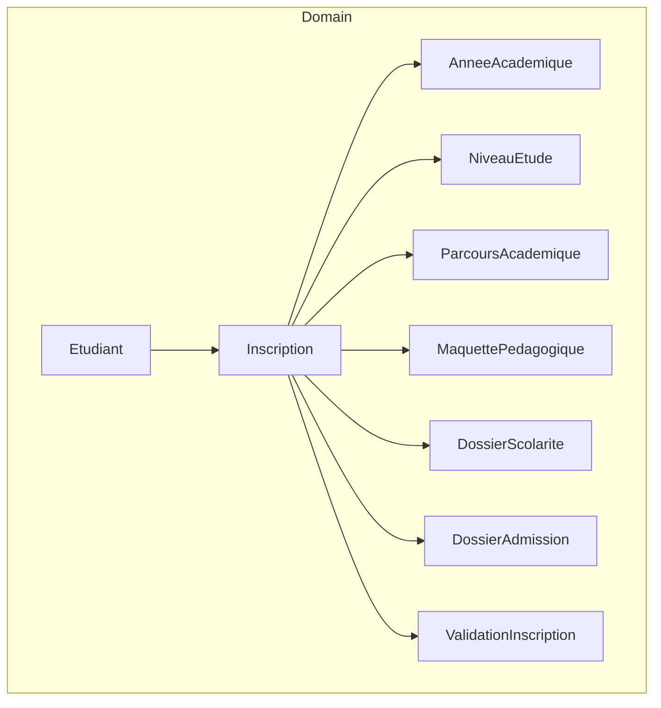
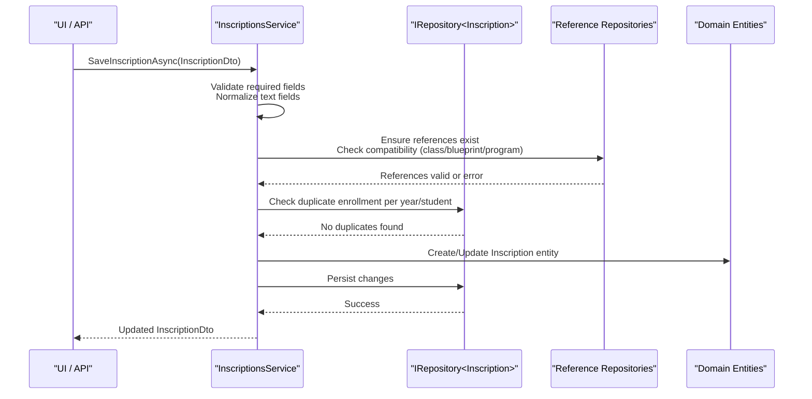
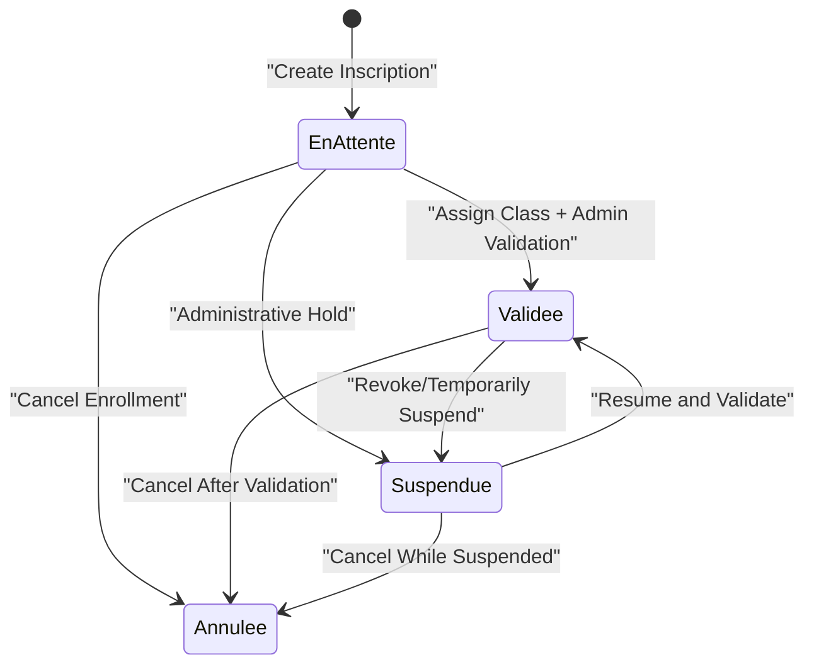
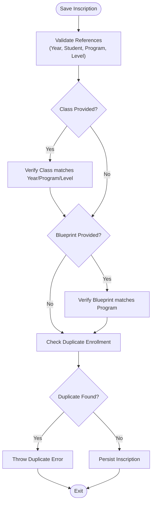
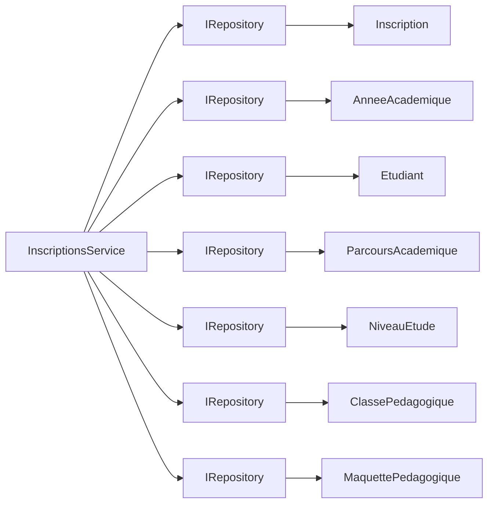

# Enrollment System Domain

<cite>
**Referenced Files in This Document**
- [Inscription.cs](file://RIIS.Academic.Domain/Inscriptions/Inscription.cs)
- [DossierAdmission.cs](file://RIIS.Academic.Domain/Inscriptions/DossierAdmission.cs)
- [ValidationInscription.cs](file://RIIS.Academic.Domain/Inscriptions/ValidationInscription.cs)
- [StatutInscription.cs](file://RIIS.Academic.Domain/Enums/StatutInscription.cs)
- [Etudiant.cs](file://RIIS.Academic.Domain/Etudiants/Etudiant.cs)
- [AnneeAcademique.cs](file://RIIS.Academic.Domain/Referentiels/AnneeAcademique.cs)
- [NiveauEtude.cs](file://RIIS.Academic.Domain/Referentiels/NiveauEtude.cs)
- [MaquettePedagogique.cs](file://RIIS.Academic.Domain/Programmes/MaquettePedagogique.cs)
- [ParcoursAcademique.cs](file://RIIS.Academic.Domain/Parcours/ParcoursAcademique.cs)
- [DossierScolarite.cs](file://RIIS.Academic.Domain/Scolarite/DossierScolarite.cs)
- [IInscriptionsService.cs](file://RIIS.Academic.Application/Inscriptions/Services/IInscriptionsService.cs)
- [InscriptionsService.cs](file://RIIS.Academic.Application/Inscriptions/Services/InscriptionsService.cs)
- [InscriptionDto.cs](file://RIIS.Academic.Application/Inscriptions/Dtos/InscriptionDto.cs)
</cite>

## Table of Contents
1. [Introduction](#introduction)
2. [Project Structure](#project-structure)
3. [Core Components](#core-components)
4. [Architecture Overview](#architecture-overview)
5. [Detailed Component Analysis](#detailed-component-analysis)
6. [Dependency Analysis](#dependency-analysis)
7. [Performance Considerations](#performance-considerations)
8. [Troubleshooting Guide](#troubleshooting-guide)
9. [Conclusion](#conclusion)
10. [Appendices](#appendices)

## Introduction
This document explains the Enrollment System domain model with a focus on three core entities: Inscription (Enrollment), DossierAdmission (Admission File), and ValidationInscription (Enrollment Validation). It describes how enrollment is created, validated, and integrated with student and program domains, including status transitions and approval processes. It also provides practical workflow examples and validation scenarios grounded in the application service logic.

## Project Structure
The enrollment domain spans the Domain layer (entities and enums) and the Application layer (services and DTOs). The key files are organized as follows:
- Domain entities define the enrollment lifecycle and relationships to students, academic years, study levels, programs, and administrative dossiers.
- Application services implement business rules for creating, validating, and saving enrollments, including reference integrity checks and status constraints.



**Diagram sources**
- [Inscription.cs:5-35](file://RIIS.Academic.Domain/Inscriptions/Inscription.cs#L5-L35)
- [DossierAdmission.cs:5-16](file://RIIS.Academic.Domain/Inscriptions/DossierAdmission.cs#L5-L16)
- [ValidationInscription.cs:5-17](file://RIIS.Academic.Domain/Inscriptions/ValidationInscription.cs#L5-L17)
- [Etudiant.cs:5-27](file://RIIS.Academic.Domain/Etudiants/Etudiant.cs#L5-L27)
- [AnneeAcademique.cs:5-14](file://RIIS.Academic.Domain/Referentiels/AnneeAcademique.cs#L5-L14)
- [NiveauEtude.cs:5-13](file://RIIS.Academic.Domain/Referentiels/NiveauEtude.cs#L5-L13)
- [MaquettePedagogique.cs:7-30](file://RIIS.Academic.Domain/Programmes/MaquettePedagogique.cs#L7-L30)
- [ParcoursAcademique.cs:5-23](file://RIIS.Academic.Domain/Parcours/ParcoursAcademique.cs#L5-L23)
- [DossierScolarite.cs:5-28](file://RIIS.Academic.Domain/Scolarite/DossierScolarite.cs#L5-L28)

**Section sources**
- [Inscription.cs:5-35](file://RIIS.Academic.Domain/Inscriptions/Inscription.cs#L5-L35)
- [InscriptionsService.cs:18-191](file://RIIS.Academic.Application/Inscriptions/Services/InscriptionsService.cs#L18-L191)

## Core Components
- Inscription: Represents a student’s enrollment in an academic year and program, including status, dates, and optional class assignment. It links to the student, academic year, study level, program, pedagogical blueprint, class, admission file, validation record, and tuition dossier.
- DossierAdmission: Captures admission-related data tied to an enrollment (e.g., baccalaureate series, year, mention, entry diploma, equivalence).
- ValidationInscription: Records signatures and administrative validation details for an enrollment.
- StatutInscription: Enumerates enrollment statuses used throughout the lifecycle.

Key relationships:
- One-to-many from Etudiant to Inscription.
- Many-to-one from Inscription to AnneeAcademique, NiveauEtude, ParcoursAcademique, MaquettePedagogique, ClassePedagogique.
- One-to-one from Inscription to DossierAdmission and ValidationInscription.
- One-to-one from Inscription to DossierScolarite.

**Section sources**
- [Inscription.cs:5-35](file://RIIS.Academic.Domain/Inscriptions/Inscription.cs#L5-L35)
- [DossierAdmission.cs:5-16](file://RIIS.Academic.Domain/Inscriptions/DossierAdmission.cs#L5-L16)
- [ValidationInscription.cs:5-17](file://RIIS.Academic.Domain/Inscriptions/ValidationInscription.cs#L5-L17)
- [StatutInscription.cs:3-9](file://RIIS.Academic.Domain/Enums/StatutInscription.cs#L3-L9)
- [Etudiant.cs:25-27](file://RIIS.Academic.Domain/Etudiants/Etudiant.cs#L25-L27)

## Architecture Overview
The enrollment workflow is orchestrated by the application service, which enforces business rules and integrates with domain entities.



**Diagram sources**
- [InscriptionsService.cs:108-191](file://RIIS.Academic.Application/Inscriptions/Services/InscriptionsService.cs#L108-L191)
- [InscriptionsService.cs:313-382](file://RIIS.Academic.Application/Inscriptions/Services/InscriptionsService.cs#L313-L382)
- [Inscription.cs:5-35](file://RIIS.Academic.Domain/Inscriptions/Inscription.cs#L5-L35)

## Detailed Component Analysis

### Inscription Entity
- Purpose: Central enrollment record linking a student to an academic year, program, study level, and optionally a pedagogical class and blueprint.
- Key attributes:
  - Identifiers for academic year, student, program, study level, blueprint, and class.
  - Enrollment date and status.
  - Administrative notes and codes.
  - Audit fields (creation timestamp, concurrency version).
- Relationships:
  - Links to Etudiant, AnneeAcademique, NiveauEtude, ParcoursAcademique, MaquettePedagogique, ClassePedagogique.
  - Optional one-to-one to DossierAdmission, ValidationInscription, DossierScolarite.
  - Aggregates evaluation results and minutes lines.

Lifecycle highlights:
- Default status is pending when created.
- Status can transition to validated when assigned to a pedagogical class and all validations pass.
- Can be suspended or canceled based on administrative decisions.

**Section sources**
- [Inscription.cs:5-35](file://RIIS.Academic.Domain/Inscriptions/Inscription.cs#L5-L35)
- [StatutInscription.cs:3-9](file://RIIS.Academic.Domain/Enums/StatutInscription.cs#L3-L9)

### DossierAdmission Entity
- Purpose: Stores admission-related information for an enrollment.
- Key attributes:
  - Baccalaureate series, year of obtaining, mention.
  - Entry diploma and specialization.
  - Equivalence number and diploma.
- Relationship:
  - Tied to a single Inscription via foreign key.

Usage:
- Created alongside or after enrollment to capture admission credentials and equivalences.

**Section sources**
- [DossierAdmission.cs:5-16](file://RIIS.Academic.Domain/Inscriptions/DossierAdmission.cs#L5-L16)

### ValidationInscription Entity
- Purpose: Captures enrollment validation artifacts and approvals.
- Key attributes:
  - Signature location and dates for student and administration.
  - Names and URLs of signatures.
  - Administration validation date and observations.
- Relationship:
  - Tied to a single Inscription.

Workflow role:
- Used to finalize administrative validation steps before or during enrollment status transition to validated.

**Section sources**
- [ValidationInscription.cs:5-17](file://RIIS.Academic.Domain/Inscriptions/ValidationInscription.cs#L5-L17)

### Status Transitions and Approval Process
- Initial state: Pending (EnAttente).
- Validated (Validee): Requires assignment to a pedagogical class; enforced by application service.
- Suspended (Suspendue) and Cancelled (Annulee): Administrative states indicating temporary hold or cancellation.

Approval flow:
- Student signs (date and signature URL recorded).
- Administration validates (date and signatory name recorded).
- Enrollment status updated to validated only if class assignment is present and references are coherent.



**Diagram sources**
- [StatutInscription.cs:3-9](file://RIIS.Academic.Domain/Enums/StatutInscription.cs#L3-L9)
- [InscriptionsService.cs:130-133](file://RIIS.Academic.Application/Inscriptions/Services/InscriptionsService.cs#L130-L133)

### Integration with Student and Program Domains
- Student integration:
  - Inscription references Etudiant; multiple inscriptions per student allowed across different academic years.
  - Service ensures uniqueness per academic year and student.
- Program integration:
  - Inscription references ParcoursAcademique (cycle/filiere/specialite), NiveauEtude, and optionally MaquettePedagogique.
  - Service validates that selected class and blueprint are compatible with the chosen program and academic year.



**Diagram sources**
- [InscriptionsService.cs:313-382](file://RIIS.Academic.Application/Inscriptions/Services/InscriptionsService.cs#L313-L382)
- [InscriptionsService.cs:142-151](file://RIIS.Academic.Application/Inscriptions/Services/InscriptionsService.cs#L142-L151)

### Example Workflows and Validation Scenarios
- New enrollment creation:
  - Select academic year, student, program, and study level.
  - Optionally assign a pedagogical class and blueprint.
  - Service validates references and prevents duplicates within the same academic year for the same student.
- Validation workflow:
  - Record student signature and administration signature details.
  - Assign pedagogical class if not already set.
  - Transition status to validated once all requirements are met.
- Admission file completion:
  - Populate baccalaureate and equivalence details linked to the enrollment.
- Tuition dossier linkage:
  - Associate a DossierScolarite to manage fees, payments, and notifications for the enrollment.

**Section sources**
- [InscriptionsService.cs:95-191](file://RIIS.Academic.Application/Inscriptions/Services/InscriptionsService.cs#L95-L191)
- [InscriptionDto.cs:7-27](file://RIIS.Academic.Application/Inscriptions/Dtos/InscriptionDto.cs#L7-L27)
- [DossierScolarite.cs:5-28](file://RIIS.Academic.Domain/Scolarite/DossierScolarite.cs#L5-L28)

## Dependency Analysis
- Application service depends on repositories for:
  - Inscription, AnneeAcademique, Etudiant, CycleFormation, ParcoursAcademique, NiveauEtude, ClassePedagogique, MaquettePedagogique.
- Domain entities depend on referential entities (academic year, study level, program) and related administrative entities (admission file, validation, tuition dossier).



**Diagram sources**
- [InscriptionsService.cs:8-16](file://RIIS.Academic.Application/Inscriptions/Services/InscriptionsService.cs#L8-L16)
- [Inscription.cs:5-35](file://RIIS.Academic.Domain/Inscriptions/Inscription.cs#L5-L35)

**Section sources**
- [InscriptionsService.cs:8-16](file://RIIS.Academic.Application/Inscriptions/Services/InscriptionsService.cs#L8-L16)
- [Inscription.cs:5-35](file://RIIS.Academic.Domain/Inscriptions/Inscription.cs#L5-L35)

## Performance Considerations
- Reference loading:
  - The service loads reference collections (years, students, programs, classes, blueprints) to validate and map DTOs. For large datasets, consider pagination or query-specific filtering to reduce memory usage.
- Filtering:
  - Use provided filter parameters (year, cycle, level, class) to narrow queries early and avoid unnecessary processing.
- Duplication check:
  - Duplicate detection scans existing inscriptions per academic year and student; ensure indexes on these columns for efficient lookups.

[No sources needed since this section provides general guidance]

## Troubleshooting Guide
Common errors and their causes:
- Missing required fields:
  - Academic year, student, program, and study level must be provided; otherwise, an exception is thrown.
- Invalid class assignment:
  - A validated enrollment must be assigned to a pedagogical class; missing class triggers an error.
- Reference mismatches:
  - Selected class or blueprint must match the academic year, program, and study level; mismatches raise exceptions.
- Duplicate enrollment:
  - An enrollment cannot exist for the same student in the same academic year; duplication raises an error.

Remediation steps:
- Verify all required identifiers are set correctly.
- Ensure class and blueprint selections align with the chosen program and academic year.
- Confirm no prior enrollment exists for the student in the target academic year.

**Section sources**
- [InscriptionsService.cs:108-151](file://RIIS.Academic.Application/Inscriptions/Services/InscriptionsService.cs#L108-L151)
- [InscriptionsService.cs:313-382](file://RIIS.Academic.Application/Inscriptions/Services/InscriptionsService.cs#L313-L382)

## Conclusion
The Enrollment System centers on the Inscription entity, enriched by DossierAdmission and ValidationInscription to support admission processing and validation workflows. The application service enforces critical business rules, ensuring data integrity and consistent status transitions. Integrations with student and program domains enable robust enrollment management across academic years and programs.

[No sources needed since this section summarizes without analyzing specific files]

## Appendices

### Data Model Summary
```mermaid
erDiagram
ETUDIANT {
long id PK
string matricule
string nom
string prenoms
date date_naissance
string lieu_naissance
enum sexe
enum aptitude_medical
string nationalite
string telephone_principal
string email
}
INSCRIPTION {
long id PK
long annee_academique_id FK
long etudiant_id FK
long parcours_academique_id FK
long niveau_etude_id FK
long maquette_pedagogique_id FK
long classe_pedagogique_id FK
date date_inscription
enum statut_inscription
string mention_speciale
string tutelle_academique
string observation
string code_administration
}
DOSSIER_ADMISSION {
long id PK
long inscription_id FK
string serie_baccalaureat
short annee_obtention_baccalaureat
string mention_baccalaureat
string diplome_entree
string specialite_diplome_entree
string numero_equivalence
string diplome_equivalence
}
VALIDATION_INSCRIPTION {
long id PK
long inscription_id FK
string lieu_signature
date date_signature_etudiant
string nom_signataire_etudiant
string signature_etudiant_url
string nom_signataire_administration
string signature_administration_url
date date_validation_administration
string observation
}
ANNEE_ACADEMIQUE {
long id PK
string libelle
short annee_debut
short annee_fin
boolean est_active
}
NIVEAU_ETUDE {
long id PK
byte numero
string libelle
boolean est_actif
}
MAQUETTE_PEDAGOGIQUE {
long id PK
long cycle_formation_id FK
long niveau_etude_id FK
long filiere_id FK
long specialite_id FK
string code
string libelle
string version
enum statut_maquette_pedagogique
date date_debut_validite
date date_fin_validite
}
PARCOURS_ACADEMIQUE {
long id PK
long annee_academique_id FK
long cycle_formation_id FK
long niveau_etude_id FK
long filiere_id FK
long specialite_id FK
string code
string libelle
boolean est_active
}
DOSSIER_SCOLARITE {
long id PK
long inscription_id FK
string annee_academique_code
string annee_academique_libelle
string cycle_code
string cycle_libelle
string filiere_code
string filiere_libelle
string specialite_code
string specialite_libelle
int niveau_numero
string niveau_libelle
enum statut_dossier_scolarite statut_administratif
enum statut_dossier_scolarite statut_financier
enum statut_dossier_scolarite statut_global
datetime date_creation_utc
datetime date_dernier_recalcul_utc
string observation
}
ETUDIANT ||--o{ INSCRIPTION : "has many"
INSCRIPTION ||--|| DOSSIER_ADMISSION : "has one"
INSCRIPTION ||--|| VALIDATION_INSCRIPTION : "has one"
INSCRIPTION ||--|| DOSSIER_SCOLARITE : "has one"
ANNEE_ACADEMIQUE ||--o{ INSCRIPTION : "has many"
NIVEAU_ETUDE ||--o{ INSCRIPTION : "has many"
MAQUETTE_PEDAGOGIQUE ||--o{ INSCRIPTION : "has many"
PARCOURS_ACADEMIQUE ||--o{ INSCRIPTION : "has many"
```

**Diagram sources**
- [Etudiant.cs:5-27](file://RIIS.Academic.Domain/Etudiants/Etudiant.cs#L5-L27)
- [Inscription.cs:5-35](file://RIIS.Academic.Domain/Inscriptions/Inscription.cs#L5-L35)
- [DossierAdmission.cs:5-16](file://RIIS.Academic.Domain/Inscriptions/DossierAdmission.cs#L5-L16)
- [ValidationInscription.cs:5-17](file://RIIS.Academic.Domain/Inscriptions/ValidationInscription.cs#L5-L17)
- [AnneeAcademique.cs:5-14](file://RIIS.Academic.Domain/Referentiels/AnneeAcademique.cs#L5-L14)
- [NiveauEtude.cs:5-13](file://RIIS.Academic.Domain/Referentiels/NiveauEtude.cs#L5-L13)
- [MaquettePedagogique.cs:7-30](file://RIIS.Academic.Domain/Programmes/MaquettePedagogique.cs#L7-L30)
- [ParcoursAcademique.cs:5-23](file://RIIS.Academic.Domain/Parcours/ParcoursAcademique.cs#L5-L23)
- [DossierScolarite.cs:5-28](file://RIIS.Academic.Domain/Scolarite/DossierScolarite.cs#L5-L28)