# Financial Administration Domain

<cite>
**Referenced Files in This Document**
- [DossierScolarite.cs](file://RIIS.Academic.Domain/Scolarite/DossierScolarite.cs)
- [PaiementScolarite.cs](file://RIIS.Academic.Domain/Scolarite/PaiementScolarite.cs)
- [EcheanceScolarite.cs](file://RIIS.Academic.Domain/Scolarite/EcheanceScolarite.cs)
- [TarifScolarite.cs](file://RIIS.Academic.Domain/Scolarite/TarifScolarite.cs)
- [ModePaiementScolarite.cs](file://RIIS.Academic.Domain/Scolarite/ModePaiementScolarite.cs)
- [TypeElementScolarite.cs](file://RIIS.Academic.Domain/Scolarite/TypeElementScolarite.cs)
- [AffectationPaiementEcheance.cs](file://RIIS.Academic.Domain/Scolarite/AffectationPaiementEcheance.cs)
- [NotificationScolarite.cs](file://RIIS.Academic.Domain/Scolarite/NotificationScolarite.cs)
- [DocumentElementScolarite.cs](file://RIIS.Academic.Domain/Scolarite/DocumentElementScolarite.cs)
- [ValidationElementScolarite.cs](file://RIIS.Academic.Domain/Scolarite/ValidationElementScolarite.cs)
- [ElementScolariteEtudiant.cs](file://RIIS.Academic.Domain/Scolarite/ElementScolariteEtudiant.cs)
- [StatutDossierScolarite.cs](file://RIIS.Academic.Domain/Enums/StatutDossierScolarite.cs)
- [StatutPaiementScolarite.cs](file://RIIS.Academic.Domain/Enums/StatutPaiementScolarite.cs)
- [StatutEcheanceScolarite.cs](file://RIIS.Academic.Domain/Enums/StatutEcheanceScolarite.cs)
- [CategorieTypeElementScolarite.cs](file://RIIS.Academic.Domain/Enums/CategorieTypeElementScolarite.cs)
- [FinancesScolariteService.cs](file://RIIS.Academic.Application/Scolarite/Services/FinancesScolariteService.cs)
</cite>

## Table of Contents
1. Introduction
2. Project Structure
3. Core Components
4. Architecture Overview
5. Detailed Component Analysis
6. Dependency Analysis
7. Performance Considerations
8. Troubleshooting Guide
9. Conclusion

## Introduction
This document describes the Financial Administration domain model for an academic system. It covers the complete financial ecosystem centered on student files, payments, due dates, fee structures, payment methods, and element types. It explains how payments are allocated to due dates, how notifications are generated, how documents are managed, and how validations are tracked. It also outlines financial calculations, payment processing workflows, invoicing considerations, and compliance requirements derived from the domain entities and services.

## Project Structure
The financial domain is implemented as a set of domain entities under the Scolarite module, with supporting enums and an application service that orchestrates reading, saving, and reporting operations. The key building blocks include:
- Student file (DossierScolarite) aggregating elements, payments, and notifications
- Element instances per student (ElementScolariteEtudiant) representing billable items or required actions
- Due dates (EcheanceScolarite) linked to elements
- Payments (PaiementScolarite) linked to elements and fees
- Fee structure (TarifScolarite) tied to element types and academic context
- Payment method (ModePaiementScolarite)
- Allocation records (AffectationPaiementEcheance) linking payments to due dates
- Notifications (NotificationScolarite), documents (DocumentElementScolarite), and validations (ValidationElementScolarite)

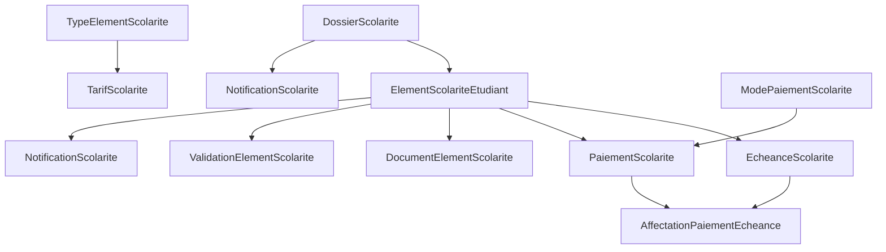

**Diagram sources**
- [DossierScolarite.cs:1-29](file://RIIS.Academic.Domain/Scolarite/DossierScolarite.cs#L1-L29)
- [ElementScolariteEtudiant.cs:1-26](file://RIIS.Academic.Domain/Scolarite/ElementScolariteEtudiant.cs#L1-L26)
- [EcheanceScolarite.cs:1-20](file://RIIS.Academic.Domain/Scolarite/EcheanceScolarite.cs#L1-L20)
- [PaiementScolarite.cs:1-29](file://RIIS.Academic.Domain/Scolarite/PaiementScolarite.cs#L1-L29)
- [TarifScolarite.cs:1-22](file://RIIS.Academic.Domain/Scolarite/TarifScolarite.cs#L1-L22)
- [ModePaiementScolarite.cs:1-13](file://RIIS.Academic.Domain/Scolarite/ModePaiementScolarite.cs#L1-L13)
- [AffectationPaiementEcheance.cs:1-15](file://RIIS.Academic.Domain/Scolarite/AffectationPaiementEcheance.cs#L1-L15)
- [NotificationScolarite.cs:1-21](file://RIIS.Academic.Domain/Scolarite/NotificationScolarite.cs#L1-L21)
- [DocumentElementScolarite.cs:1-17](file://RIIS.Academic.Domain/Scolarite/DocumentElementScolarite.cs#L1-L17)
- [ValidationElementScolarite.cs:1-15](file://RIIS.Academic.Domain/Scolarite/ValidationElementScolarite.cs#L1-L15)

**Section sources**
- [DossierScolarite.cs:1-29](file://RIIS.Academic.Domain/Scolarite/DossierScolarite.cs#L1-L29)
- [ElementScolariteEtudiant.cs:1-26](file://RIIS.Academic.Domain/Scolarite/ElementScolariteEtudiant.cs#L1-L26)
- [EcheanceScolarite.cs:1-20](file://RIIS.Academic.Domain/Scolarite/EcheanceScolarite.cs#L1-L20)
- [PaiementScolarite.cs:1-29](file://RIIS.Academic.Domain/Scolarite/PaiementScolarite.cs#L1-L29)
- [TarifScolarite.cs:1-22](file://RIIS.Academic.Domain/Scolarite/TarifScolarite.cs#L1-L22)
- [ModePaiementScolarite.cs:1-13](file://RIIS.Academic.Domain/Scolarite/ModePaiementScolarite.cs#L1-L13)
- [AffectationPaiementEcheance.cs:1-15](file://RIIS.Academic.Domain/Scolarite/AffectationPaiementEcheance.cs#L1-L15)
- [NotificationScolarite.cs:1-21](file://RIIS.Academic.Domain/Scolarite/NotificationScolarite.cs#L1-L21)
- [DocumentElementScolarite.cs:1-17](file://RIIS.Academic.Domain/Scolarite/DocumentElementScolarite.cs#L1-L17)
- [ValidationElementScolarite.cs:1-15](file://RIIS.Academic.Domain/Scolarite/ValidationElementScolarite.cs#L1-L15)

## Core Components
- DossierScolarite (Student File): Represents a student’s administrative and financial record for an academic year and program level. Tracks administrative, financial, and global statuses, creation date, last recalculation date, and observations. Aggregates student elements, payments, and notifications.
- ElementScolariteEtudiant (Student Element): A concrete instance of a school element (e.g., tuition, exam fee, document requirement) for a student file. Holds expected, allocated, and remaining amounts; status; timestamps; and links to due dates, payments, documents, validations, and notifications.
- EcheanceScolarite (Due Date): A scheduled obligation tied to a student element. Contains due date, expected amount, allocated amount, remaining amount, status, and last recalculation timestamp.
- PaiementScolarite (Payment): Records a monetary transaction against a student file, optionally linked to an element, element type, fee, and payment method. Tracks payment date, amount, mode, reference, cashier, observation, allocated/unallocated amounts, and status.
- TarifScolarite (Fee Structure): Defines applicable fees for an element type within an academic context (year, cycle, level, stream, specialty). Includes amount, currency, validity period, priority, and active flag.
- ModePaiementScolarite (Payment Method): Reference data for available payment methods with display order and active flag.
- TypeElementScolarite (Element Type): Master definition of school elements (fees, documents, validations, services, other). Flags indicate whether payable, documentary, subject to validation, mandatory, and active.
- AffectationPaiementEcheance (Allocation): Links a payment to a specific due date with allocated amount and assignment metadata.
- NotificationScolarite (Notification): Messages generated for student files, elements, or due dates, with channel, title, message, generation/sent dates, and status.
- DocumentElementScolarite (Document): Attachments for student elements with name, URL, status, deposit/verification dates, verifier, and observation.
- ValidationElementScolarite (Validation): Approval workflow for student elements including status, validation date, validator, rejection reason, and observation.

Key enums:
- StatutDossierScolarite: Administrative/financial/global lifecycle states for student files.
- StatutPaiementScolarite: Payment lifecycle states (unallocated, partially allocated, allocated, cancelled).
- StatutEcheanceScolarite: Due date lifecycle states (not due, pending, partial, paid, overdue, cancelled).
- CategorieTypeElementScolarite: Categories for element types (fee, document, validation, service, other).

**Section sources**
- [DossierScolarite.cs:1-29](file://RIIS.Academic.Domain/Scolarite/DossierScolarite.cs#L1-L29)
- [ElementScolariteEtudiant.cs:1-26](file://RIIS.Academic.Domain/Scolarite/ElementScolariteEtudiant.cs#L1-L26)
- [EcheanceScolarite.cs:1-20](file://RIIS.Academic.Domain/Scolarite/EcheanceScolarite.cs#L1-L20)
- [PaiementScolarite.cs:1-29](file://RIIS.Academic.Domain/Scolarite/PaiementScolarite.cs#L1-L29)
- [TarifScolarite.cs:1-22](file://RIIS.Academic.Domain/Scolarite/TarifScolarite.cs#L1-L22)
- [ModePaiementScolarite.cs:1-13](file://RIIS.Academic.Domain/Scolarite/ModePaiementScolarite.cs#L1-L13)
- [TypeElementScolarite.cs:1-19](file://RIIS.Academic.Domain/Scolarite/TypeElementScolarite.cs#L1-L19)
- [AffectationPaiementEcheance.cs:1-15](file://RIIS.Academic.Domain/Scolarite/AffectationPaiementEcheance.cs#L1-L15)
- [NotificationScolarite.cs:1-21](file://RIIS.Academic.Domain/Scolarite/NotificationScolarite.cs#L1-L21)
- [DocumentElementScolarite.cs:1-17](file://RIIS.Academic.Domain/Scolarite/DocumentElementScolarite.cs#L1-L17)
- [ValidationElementScolarite.cs:1-15](file://RIIS.Academic.Domain/Scolarite/ValidationElementScolarite.cs#L1-L15)
- [StatutDossierScolarite.cs:1-13](file://RIIS.Academic.Domain/Enums/StatutDossierScolarite.cs#L1-L13)
- [StatutPaiementScolarite.cs:1-10](file://RIIS.Academic.Domain/Enums/StatutPaiementScolarite.cs#L1-L10)
- [StatutEcheanceScolarite.cs:1-12](file://RIIS.Academic.Domain/Enums/StatutEcheanceScolarite.cs#L1-L12)
- [CategorieTypeElementScolarite.cs:1-11](file://RIIS.Academic.Domain/Enums/CategorieTypeElementScolarite.cs#L1-L11)

## Architecture Overview
The financial administration follows a layered architecture:
- Domain layer defines entities, relationships, and enumerations that capture business rules and state transitions.
- Application layer provides use cases via FinancesScolariteService, which coordinates persistence through repositories and delegates fee resolution to TarifsScolariteService.
- Infrastructure layer (not analyzed here) implements persistence and external integrations.

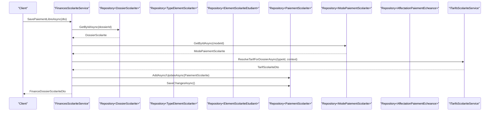

**Diagram sources**
- [FinancesScolariteService.cs:58-141](file://RIIS.Academic.Application/Scolarite/Services/FinancesScolariteService.cs#L58-L141)
- [FinancesScolariteService.cs:264-279](file://RIIS.Academic.Application/Scolarite/Services/FinancesScolariteService.cs#L264-L279)

**Section sources**
- [FinancesScolariteService.cs:17-56](file://RIIS.Academic.Application/Scolarite/Services/FinancesScolariteService.cs#L17-L56)
- [FinancesScolariteService.cs:58-141](file://RIIS.Academic.Application/Scolarite/Services/FinancesScolariteService.cs#L58-L141)
- [FinancesScolariteService.cs:143-193](file://RIIS.Academic.Application/Scolarite/Services/FinancesScolariteService.cs#L143-L193)
- [FinancesScolariteService.cs:264-279](file://RIIS.Academic.Application/Scolarite/Services/FinancesScolariteService.cs#L264-L279)

## Detailed Component Analysis

### Student File (DossierScolarite)
- Purpose: Central aggregate for a student’s academic year enrollment with administrative, financial, and global statuses.
- Key fields: Academic year code/libelle, cycle/filiere/specialty/niveau identifiers, statuses, creation/recalculation dates, observation.
- Relationships: One-to-many with student elements, payments, and notifications.

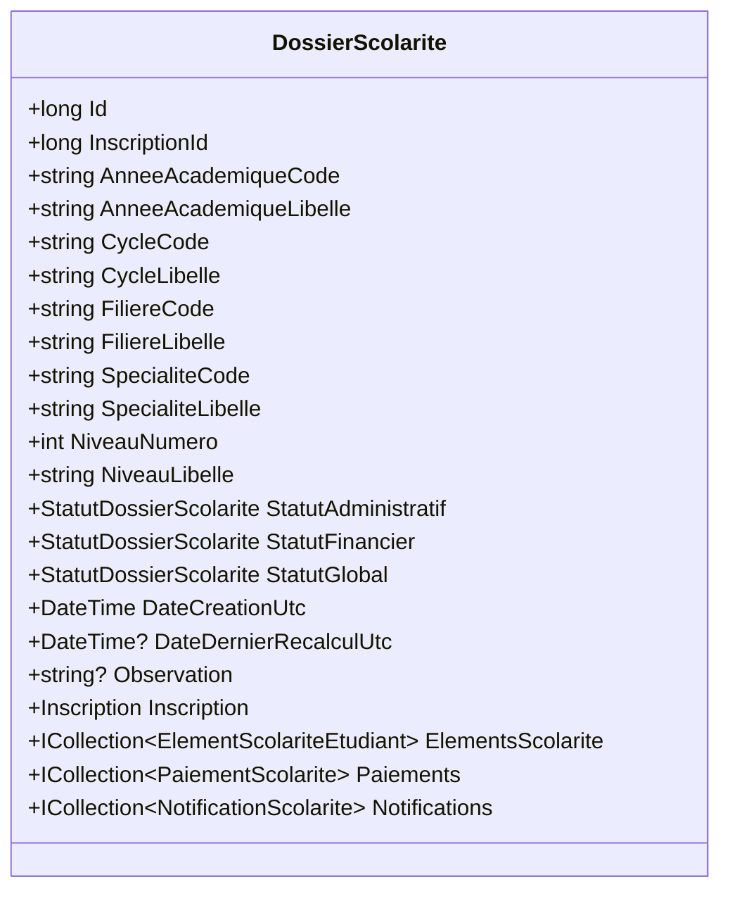

**Diagram sources**
- [DossierScolarite.cs:1-29](file://RIIS.Academic.Domain/Scolarite/DossierScolarite.cs#L1-L29)

**Section sources**
- [DossierScolarite.cs:1-29](file://RIIS.Academic.Domain/Scolarite/DossierScolarite.cs#L1-L29)

### Student Element (ElementScolariteEtudiant)
- Purpose: Concrete line item for a student (fee, document, validation, service).
- Key fields: Code/libelle, expected/allocated/remaining amounts, status, timestamps, observation.
- Relationships: Belongs to a student file; one-to-many with due dates, payments, documents, validations, notifications.

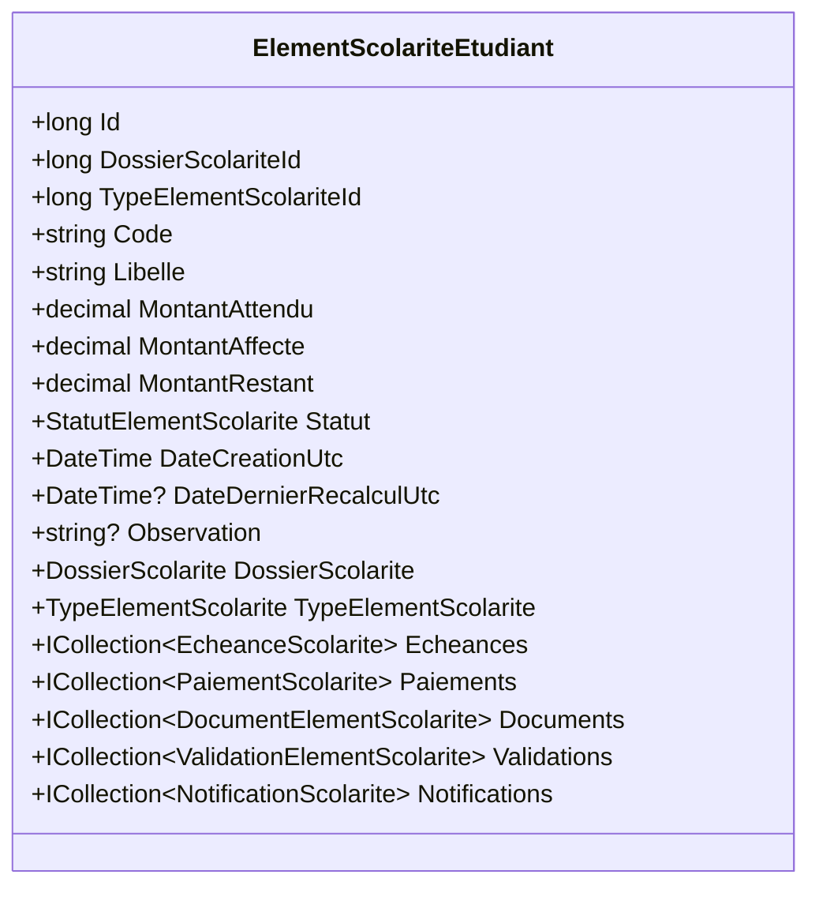

**Diagram sources**
- [ElementScolariteEtudiant.cs:1-26](file://RIIS.Academic.Domain/Scolarite/ElementScolariteEtudiant.cs#L1-L26)

**Section sources**
- [ElementScolariteEtudiant.cs:1-26](file://RIIS.Academic.Domain/Scolarite/ElementScolariteEtudiant.cs#L1-L26)

### Due Date (EcheanceScolarite)
- Purpose: Schedules obligations for a student element.
- Key fields: Number, label, due date, expected/allocated/remaining amounts, status, last recalculation.
- Relationships: Belongs to a student element; one-to-many allocations; one-to-many notifications.

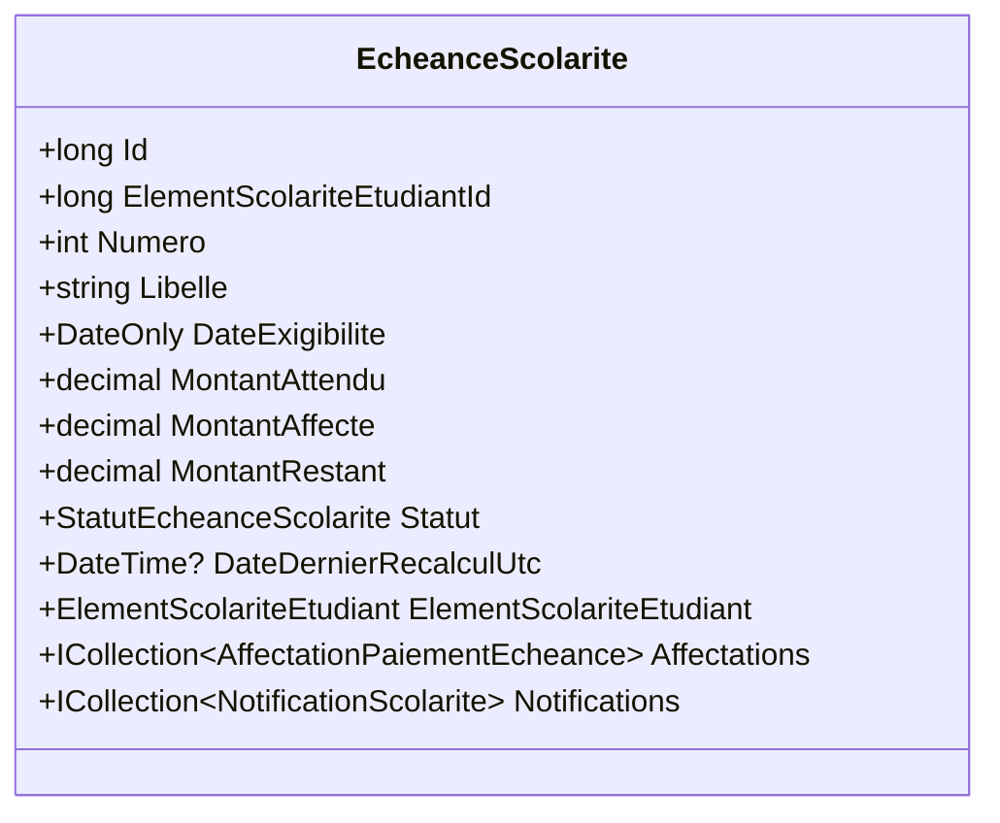

**Diagram sources**
- [EcheanceScolarite.cs:1-20](file://RIIS.Academic.Domain/Scolarite/EcheanceScolarite.cs#L1-L20)

**Section sources**
- [EcheanceScolarite.cs:1-20](file://RIIS.Academic.Domain/Scolarite/EcheanceScolarite.cs#L1-L20)

### Payment (PaiementScolarite)
- Purpose: Records monetary transactions for a student file, optionally tied to an element/type/fee/method.
- Key fields: Payment date, amount, mode, reference, cashier, observation, allocated/unallocated amounts, status, creation date.
- Relationships: Belongs to a student file; optional links to element/type/fee/method; one-to-many allocations.

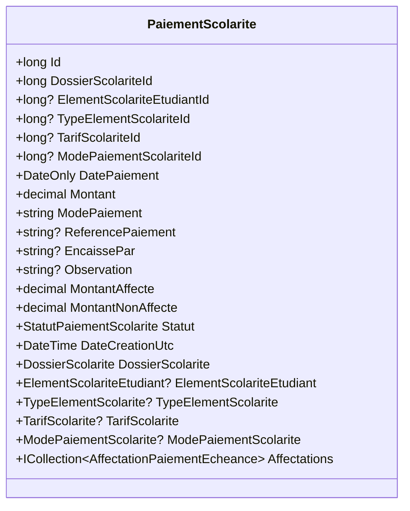

**Diagram sources**
- [PaiementScolarite.cs:1-29](file://RIIS.Academic.Domain/Scolarite/PaiementScolarite.cs#L1-L29)

**Section sources**
- [PaiementScolarite.cs:1-29](file://RIIS.Academic.Domain/Scolarite/PaiementScolarite.cs#L1-L29)

### Fee Structure (TarifScolarite)
- Purpose: Defines applicable fees for an element type within an academic context.
- Key fields: Code, type id, academic year code, cycle/level/stream/specialty filters, amount, currency, validity dates, priority, active flag.
- Relationships: Belongs to an element type.

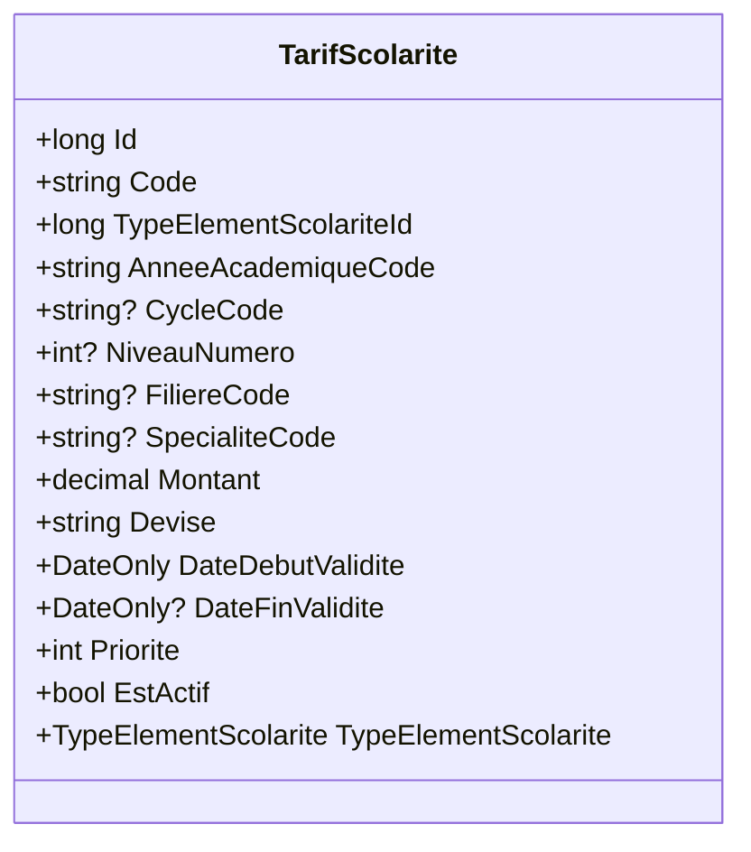

**Diagram sources**
- [TarifScolarite.cs:1-22](file://RIIS.Academic.Domain/Scolarite/TarifScolarite.cs#L1-L22)

**Section sources**
- [TarifScolarite.cs:1-22](file://RIIS.Academic.Domain/Scolarite/TarifScolarite.cs#L1-L22)

### Payment Method (ModePaiementScolarite)
- Purpose: Reference data for available payment methods.
- Key fields: Code, label, display order, active flag.
- Relationships: One-to-many payments.

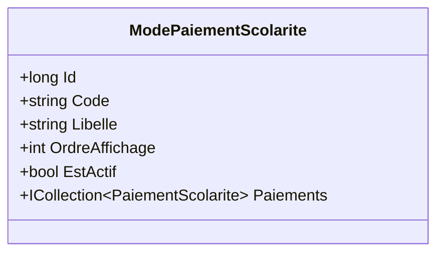

**Diagram sources**
- [ModePaiementScolarite.cs:1-13](file://RIIS.Academic.Domain/Scolarite/ModePaiementScolarite.cs#L1-L13)

**Section sources**
- [ModePaiementScolarite.cs:1-13](file://RIIS.Academic.Domain/Scolarite/ModePaiementScolarite.cs#L1-L13)

### Element Type (TypeElementScolarite)
- Purpose: Master definitions for school elements (fees, documents, validations, services, other).
- Key fields: Code, label, category, flags (payable, documentary, subject to validation, mandatory, active), display order.
- Relationships: One-to-many fees and student elements.

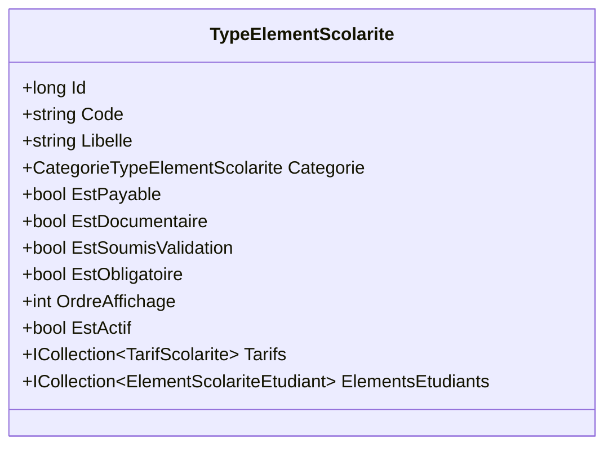

**Diagram sources**
- [TypeElementScolarite.cs:1-19](file://RIIS.Academic.Domain/Scolarite/TypeElementScolarite.cs#L1-L19)

**Section sources**
- [TypeElementScolarite.cs:1-19](file://RIIS.Academic.Domain/Scolarite/TypeElementScolarite.cs#L1-L19)

### Allocation (AffectationPaiementEcheance)
- Purpose: Links a payment to a specific due date with allocated amount and assignment metadata.
- Key fields: Payment id, due date id, allocated amount, assignment date, assigner.
- Relationships: Many-to-one with payment and due date.

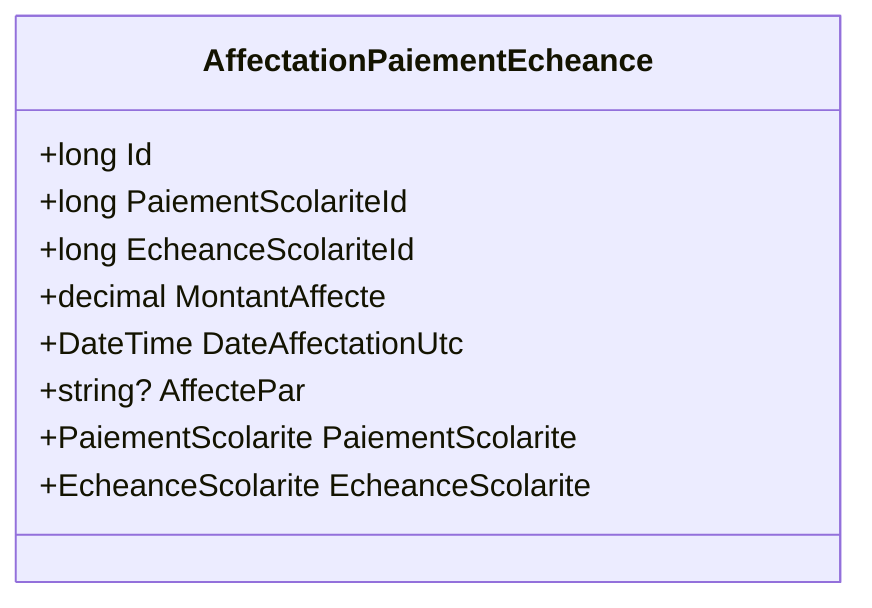

**Diagram sources**
- [AffectationPaiementEcheance.cs:1-15](file://RIIS.Academic.Domain/Scolarite/AffectationPaiementEcheance.cs#L1-L15)

**Section sources**
- [AffectationPaiementEcheance.cs:1-15](file://RIIS.Academic.Domain/Scolarite/AffectationPaiementEcheance.cs#L1-L15)

### Notification (NotificationScolarite)
- Purpose: Messages generated for student files, elements, or due dates.
- Key fields: Parent ids (dossier, element, due date), type, channel, title, message, generation/sent dates, status.
- Relationships: Belongs to a student file; optional links to element and due date.

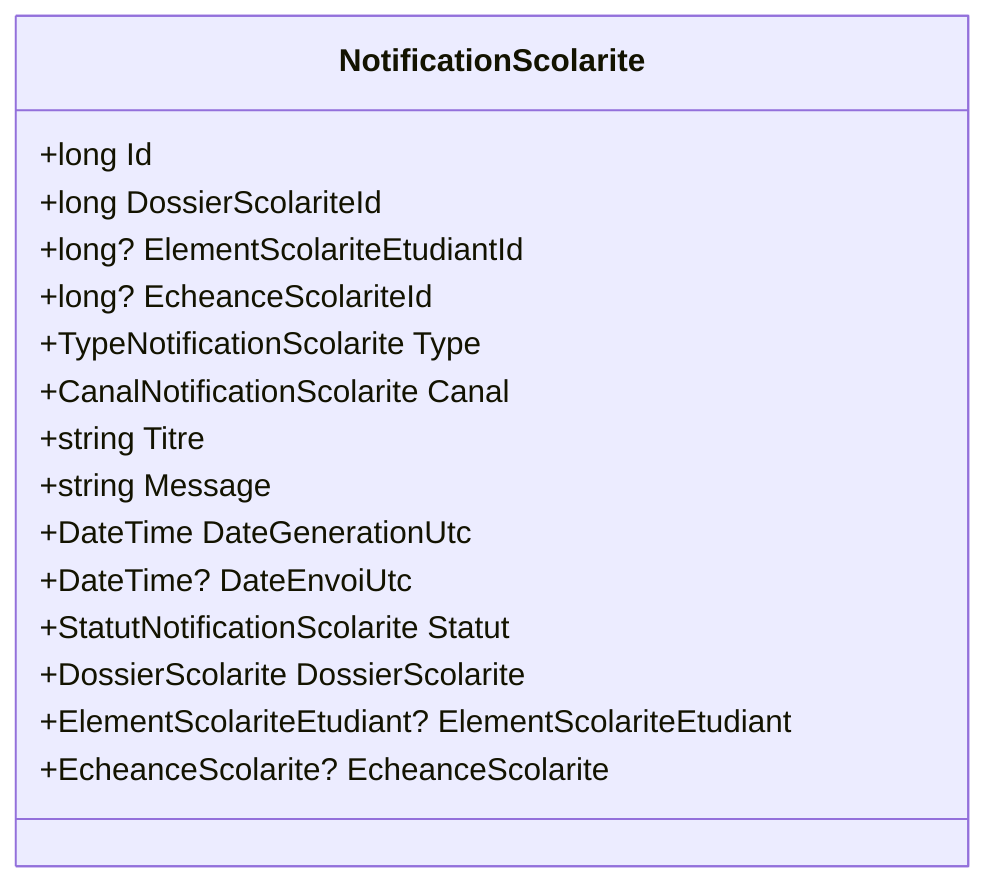

**Diagram sources**
- [NotificationScolarite.cs:1-21](file://RIIS.Academic.Domain/Scolarite/NotificationScolarite.cs#L1-L21)

**Section sources**
- [NotificationScolarite.cs:1-21](file://RIIS.Academic.Domain/Scolarite/NotificationScolarite.cs#L1-L21)

### Document (DocumentElementScolarite)
- Purpose: Attachments for student elements with lifecycle tracking.
- Key fields: Element id, document name, file URL, status, deposit/verification dates, verifier, observation.
- Relationships: Belongs to a student element.

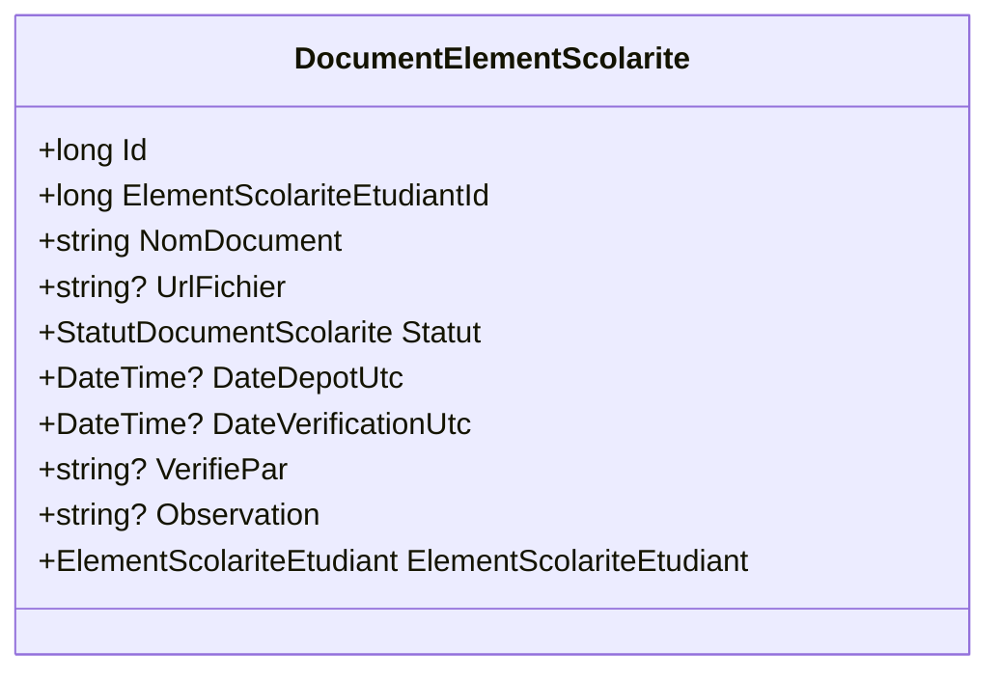

**Diagram sources**
- [DocumentElementScolarite.cs:1-17](file://RIIS.Academic.Domain/Scolarite/DocumentElementScolarite.cs#L1-L17)

**Section sources**
- [DocumentElementScolarite.cs:1-17](file://RIIS.Academic.Domain/Scolarite/DocumentElementScolarite.cs#L1-L17)

### Validation (ValidationElementScolarite)
- Purpose: Approval workflow for student elements.
- Key fields: Element id, status, validation date, validator, rejection reason, observation.
- Relationships: Belongs to a student element.

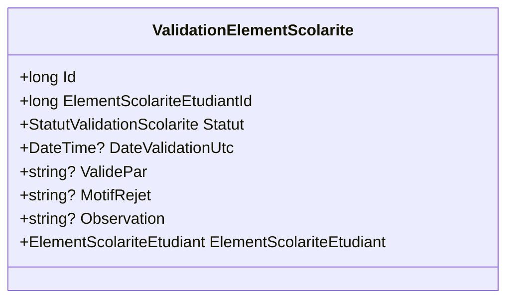

**Diagram sources**
- [ValidationElementScolarite.cs:1-15](file://RIIS.Academic.Domain/Scolarite/ValidationElementScolarite.cs#L1-L15)

**Section sources**
- [ValidationElementScolarite.cs:1-15](file://RIIS.Academic.Domain/Scolarite/ValidationElementScolarite.cs#L1-L15)

## Dependency Analysis
- Cohesion: Each entity encapsulates its own state and relationships, promoting high cohesion around financial concepts.
- Coupling: Entities are loosely coupled via foreign-key-like references; the application service coordinates interactions without tight coupling between entities.
- External dependencies: The application service depends on repository abstractions and a fee resolution service to compute applicable tariffs based on academic context.

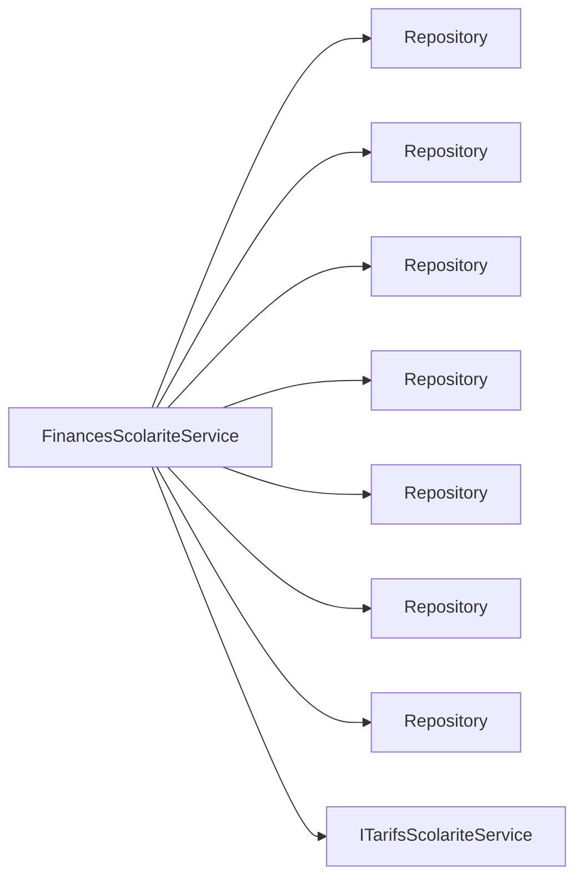

**Diagram sources**
- [FinancesScolariteService.cs:7-15](file://RIIS.Academic.Application/Scolarite/Services/FinancesScolariteService.cs#L7-L15)

**Section sources**
- [FinancesScolariteService.cs:7-15](file://RIIS.Academic.Application/Scolarite/Services/FinancesScolariteService.cs#L7-L15)

## Performance Considerations
- Batch queries: The service loads related collections (elements, due dates, payments, tariffs, allocations) in batches and filters in memory to minimize round trips.
- Indexing: Ensure indexes on foreign keys (e.g., DossierScolariteId, ElementScolariteEtudiantId, TypeElementScolariteId, TarifScolariteId, ModePaiementScolariteId) and frequently filtered fields (e.g., DateExigibilite, Statut).
- Calculations: Amounts are computed by summing over filtered sets; consider materialized views or precomputed totals for large datasets.
- Tariff resolution: Delegates to a dedicated service; ensure it caches or efficiently resolves tariffs by academic context and date.

[No sources needed since this section provides general guidance]

## Troubleshooting Guide
Common issues and their origins:
- Invalid or missing student file: Thrown when retrieving a non-existent dossier during payment save or options retrieval.
- Invalid payment amount: Thrown if the amount is not greater than zero.
- Missing element type or tariff: Thrown if required identifiers are absent or invalid.
- Inactive payment method: Thrown if the selected payment method is inactive.
- Mismatched tariff: Thrown if the provided tariff does not match the resolved tariff for the dossier and element type.
- Insufficient total allocation: Thrown if updating a payment would reduce total allocation below already allocated amount.

Operational checks:
- Validate that all referenced IDs exist and are active before persisting.
- Normalize text fields to avoid empty strings being stored.
- Ensure tariff resolution uses the correct academic context and effective date.

**Section sources**
- [FinancesScolariteService.cs:28-56](file://RIIS.Academic.Application/Scolarite/Services/FinancesScolariteService.cs#L28-L56)
- [FinancesScolariteService.cs:58-141](file://RIIS.Academic.Application/Scolarite/Services/FinancesScolariteService.cs#L58-L141)
- [FinancesScolariteService.cs:344-359](file://RIIS.Academic.Application/Scolarite/Services/FinancesScolariteService.cs#L344-L359)

## Conclusion
The Financial Administration domain model provides a robust foundation for managing student finances across fees, payments, due dates, and compliance artifacts. The clear separation between domain entities and application orchestration enables maintainable and testable code. By leveraging tariff resolution, allocation records, notifications, documents, and validations, institutions can enforce consistent financial processes, track compliance, and generate accurate reports.

[No sources needed since this section summarizes without analyzing specific files]