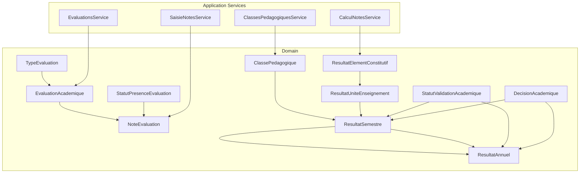
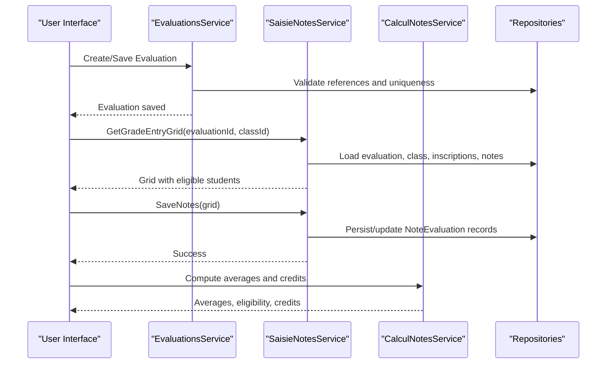
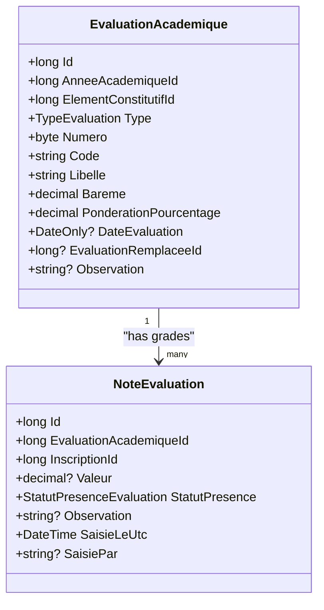
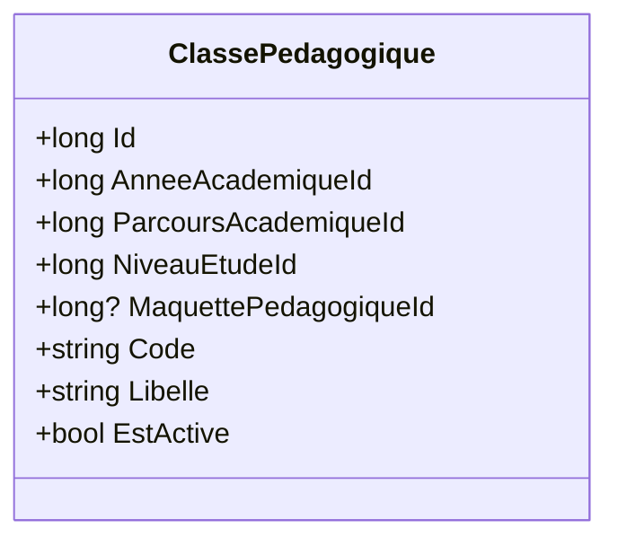
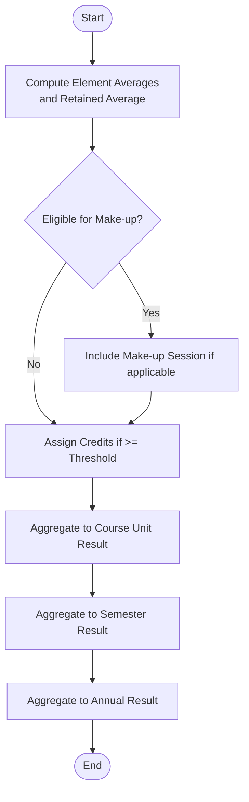
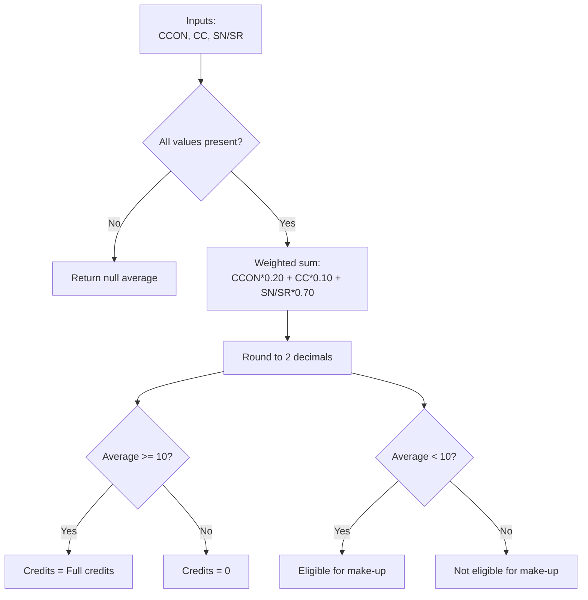
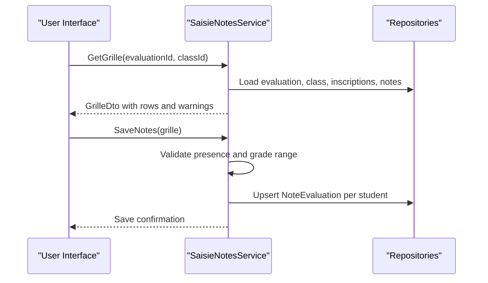
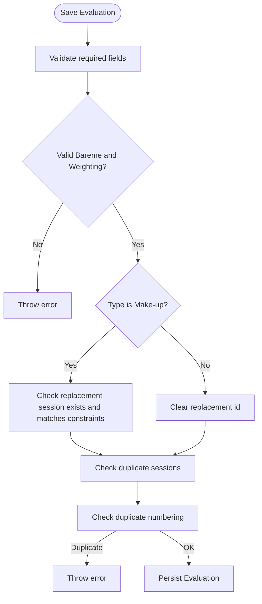
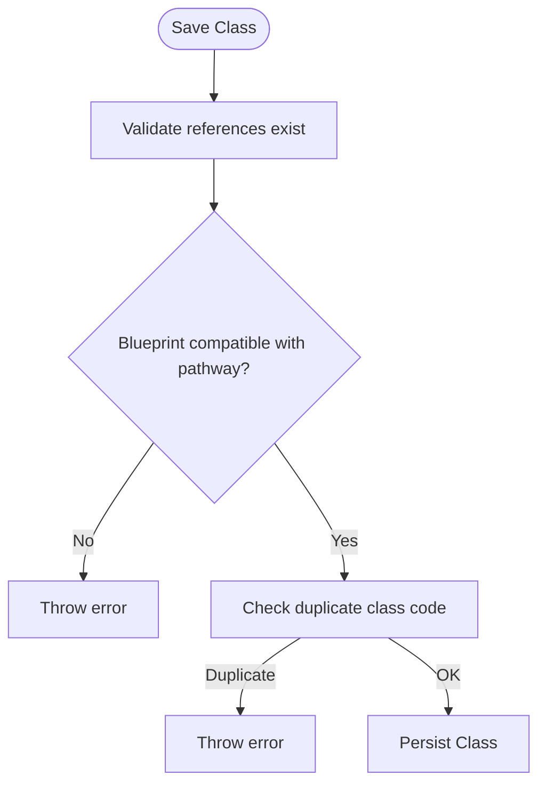
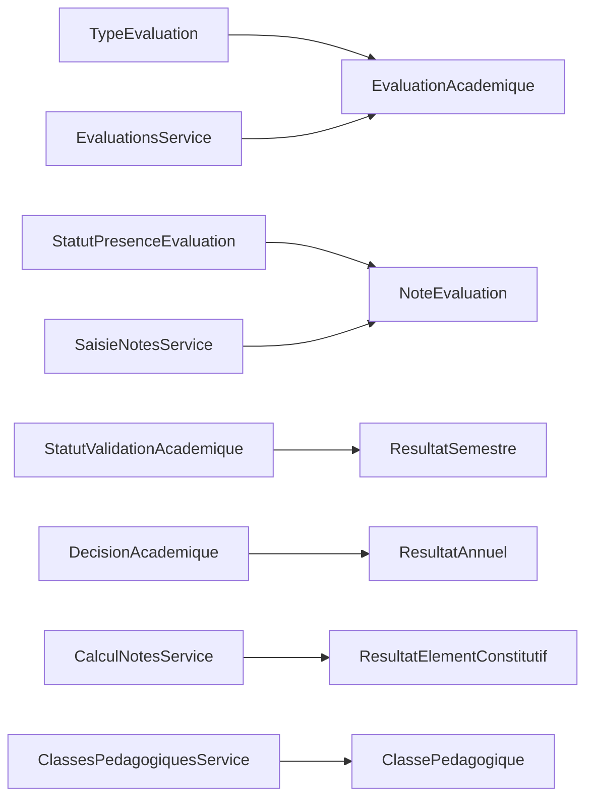

# Grade & Evaluation Domain

<cite>
**Referenced Files in This Document**
- [EvaluationAcademique.cs](file://RIIS.Academic.Domain/Notes/EvaluationAcademique.cs)
- [NoteEvaluation.cs](file://RIIS.Academic.Domain/Notes/NoteEvaluation.cs)
- [ClassePedagogique.cs](file://RIIS.Academic.Domain/Notes/ClassePedagogique.cs)
- [ResultatAnnuel.cs](file://RIIS.Academic.Domain/Notes/ResultatAnnuel.cs)
- [ResultatSemestre.cs](file://RIIS.Academic.Domain/Notes/ResultatSemestre.cs)
- [ResultatUniteEnseignement.cs](file://RIIS.Academic.Domain/Notes/ResultatUniteEnseignement.cs)
- [ResultatElementConstitutif.cs](file://RIIS.Academic.Domain/Notes/ResultatElementConstitutif.cs)
- [TypeEvaluation.cs](file://RIIS.Academic.Domain/Enums/TypeEvaluation.cs)
- [StatutPresenceEvaluation.cs](file://RIIS.Academic.Domain/Enums/StatutPresenceEvaluation.cs)
- [StatutValidationAcademique.cs](file://RIIS.Academic.Domain/Enums/StatutValidationAcademique.cs)
- [DecisionAcademique.cs](file://RIIS.Academic.Domain/Enums/DecisionAcademique.cs)
- [CalculNotesService.cs](file://RIIS.Academic.Application/Notes/Services/CalculNotesService.cs)
- [EvaluationsService.cs](file://RIIS.Academic.Application/Evaluations/Services/EvaluationsService.cs)
- [ClassesPedagogiquesService.cs](file://RIIS.Academic.Application/ClassesPedagogiques/Services/ClassesPedagogiquesService.cs)
- [SaisieNotesService.cs](file://RIIS.Academic.Application/Notes/Services/SaisieNotesService.cs)
</cite>

## Table of Contents
1. Introduction
2. Project Structure
3. Core Components
4. Architecture Overview
5. Detailed Component Analysis
6. Dependency Analysis
7. Performance Considerations
8. Troubleshooting Guide
9. Conclusion

## Introduction
This document explains the Grade & Evaluation domain model and workflows used to manage academic evaluations, grade entry, and result aggregation across constituent elements, course units, semesters, and academic years. It focuses on:
- Academic evaluation entities (EvaluationAcademique) and individual grades (NoteEvaluation)
- Pedagogical class context (ClassePedagogique) for grouping students
- Result aggregation hierarchy from constituent element to annual results
- Algorithms and rules for computing averages, eligibility for make-up sessions, credit acquisition, and validation decisions
- Practical examples of grade entry, calculation workflows, and result generation

## Project Structure
The domain is implemented using a layered architecture:
- Domain layer defines core entities and enums that represent evaluations, grades, classes, and aggregated results
- Application layer provides services for evaluation management, grade entry, and calculations
- Infrastructure and API layers persist and expose these capabilities

**Diagram sources**
- [EvaluationAcademique.cs:1-24](file://RIIS.Academic.Domain/Notes/EvaluationAcademique.cs#L1-L24)
- [NoteEvaluation.cs:1-17](file://RIIS.Academic.Domain/Notes/NoteEvaluation.cs#L1-L17)
- [ClassePedagogique.cs:1-21](file://RIIS.Academic.Domain/Notes/ClassePedagogique.cs#L1-L21)
- [ResultatElementConstitutif.cs:1-23](file://RIIS.Academic.Domain/Notes/ResultatElementConstitutif.cs#L1-L23)
- [ResultatUniteEnseignement.cs:1-17](file://RIIS.Academic.Domain/Notes/ResultatUniteEnseignement.cs#L1-L17)
- [ResultatSemestre.cs:1-23](file://RIIS.Academic.Domain/Notes/ResultatSemestre.cs#L1-L23)
- [ResultatAnnuel.cs:1-21](file://RIIS.Academic.Domain/Notes/ResultatAnnuel.cs#L1-L21)
- [TypeEvaluation.cs:1-10](file://RIIS.Academic.Domain/Enums/TypeEvaluation.cs#L1-L10)
- [StatutPresenceEvaluation.cs:1-10](file://RIIS.Academic.Domain/Enums/StatutPresenceEvaluation.cs#L1-L10)
- [StatutValidationAcademique.cs:1-10](file://RIIS.Academic.Domain/Enums/StatutValidationAcademique.cs#L1-L10)
- [DecisionAcademique.cs:1-10](file://RIIS.Academic.Domain/Enums/DecisionAcademique.cs#L1-L10)
- [EvaluationsService.cs:1-643](file://RIIS.Academic.Application/Evaluations/Services/EvaluationsService.cs#L1-L643)
- [SaisieNotesService.cs:1-317](file://RIIS.Academic.Application/Notes/Services/SaisieNotesService.cs#L1-L317)
- [CalculNotesService.cs:1-25](file://RIIS.Academic.Application/Notes/Services/CalculNotesService.cs#L1-L25)
- [ClassesPedagogiquesService.cs:1-296](file://RIIS.Academic.Application/ClassesPedagogiques/Services/ClassesPedagogiquesService.cs#L1-L296)

**Section sources**
- [EvaluationAcademique.cs:1-24](file://RIIS.Academic.Domain/Notes/EvaluationAcademique.cs#L1-L24)
- [NoteEvaluation.cs:1-17](file://RIIS.Academic.Domain/Notes/NoteEvaluation.cs#L1-L17)
- [ClassePedagogique.cs:1-21](file://RIIS.Academic.Domain/Notes/ClassePedagogique.cs#L1-L21)
- [ResultatElementConstitutif.cs:1-23](file://RIIS.Academic.Domain/Notes/ResultatElementConstitutif.cs#L1-L23)
- [ResultatUniteEnseignement.cs:1-17](file://RIIS.Academic.Domain/Notes/ResultatUniteEnseignement.cs#L1-L17)
- [ResultatSemestre.cs:1-23](file://RIIS.Academic.Domain/Notes/ResultatSemestre.cs#L1-L23)
- [ResultatAnnuel.cs:1-21](file://RIIS.Academic.Domain/Notes/ResultatAnnuel.cs#L1-L21)
- [TypeEvaluation.cs:1-10](file://RIIS.Academic.Domain/Enums/TypeEvaluation.cs#L1-L10)
- [StatutPresenceEvaluation.cs:1-10](file://RIIS.Academic.Domain/Enums/StatutPresenceEvaluation.cs#L1-L10)
- [StatutValidationAcademique.cs:1-10](file://RIIS.Academic.Domain/Enums/StatutValidationAcademique.cs#L1-L10)
- [DecisionAcademique.cs:1-10](file://RIIS.Academic.Domain/Enums/DecisionAcademique.cs#L1-L10)
- [EvaluationsService.cs:1-643](file://RIIS.Academic.Application/Evaluations/Services/EvaluationsService.cs#L1-L643)
- [SaisieNotesService.cs:1-317](file://RIIS.Academic.Application/Notes/Services/SaisieNotesService.cs#L1-L317)
- [CalculNotesService.cs:1-25](file://RIIS.Academic.Application/Notes/Services/CalculNotesService.cs#L1-L25)
- [ClassesPedagogiquesService.cs:1-296](file://RIIS.Academic.Application/ClassesPedagogiques/Services/ClassesPedagogiquesService.cs#L1-L296)

## Core Components
- EvaluationAcademique: Represents an academic assessment instance tied to an academic year and a constituent element. Includes type (e.g., continuous assessment, knowledge control, normal session, make-up), grading scale (Bareme), weighting percentage, date, and optional replacement relationship for make-up sessions.
- NoteEvaluation: Stores a student’s grade or attendance status for a specific evaluation, including presence status and observation.
- ClassePedagogique: Groups students within an academic year and program pathway; used to scope grade entry and reporting.
- ResultatElementConstitutif: Aggregates multiple evaluation types per constituent element into a retained average and determines eligibility for make-up and credits acquired.
- ResultatUniteEnseignement: Aggregates results at the course unit level with credits expected/acquired and validation status.
- ResultatSemestre: Aggregates semester-level averages across different assessment modes, credits, ranking, validation status, and jury decision.
- ResultatAnnuel: Aggregates annual averages, total credits, ranking, validation status, and final jury decision.

Key enums:
- TypeEvaluation: Defines categories of assessments (continuous assessment, knowledge control, normal session, make-up).
- StatutPresenceEvaluation: Presence statuses for grade entry (present, justified absence, unjustified absence, exempt).
- StatutValidationAcademique: Validation states (not calculated, validated, make-up allowed, not validated).
- DecisionAcademique: Jury decisions (not deliberated, validated, authorized make-up, deferred).

**Section sources**
- [EvaluationAcademique.cs:1-24](file://RIIS.Academic.Domain/Notes/EvaluationAcademique.cs#L1-L24)
- [NoteEvaluation.cs:1-17](file://RIIS.Academic.Domain/Notes/NoteEvaluation.cs#L1-L17)
- [ClassePedagogique.cs:1-21](file://RIIS.Academic.Domain/Notes/ClassePedagogique.cs#L1-L21)
- [ResultatElementConstitutif.cs:1-23](file://RIIS.Academic.Domain/Notes/ResultatElementConstitutif.cs#L1-L23)
- [ResultatUniteEnseignement.cs:1-17](file://RIIS.Academic.Domain/Notes/ResultatUniteEnseignement.cs#L1-L17)
- [ResultatSemestre.cs:1-23](file://RIIS.Academic.Domain/Notes/ResultatSemestre.cs#L1-L23)
- [ResultatAnnuel.cs:1-21](file://RIIS.Academic.Domain/Notes/ResultatAnnuel.cs#L1-L21)
- [TypeEvaluation.cs:1-10](file://RIIS.Academic.Domain/Enums/TypeEvaluation.cs#L1-L10)
- [StatutPresenceEvaluation.cs:1-10](file://RIIS.Academic.Domain/Enums/StatutPresenceEvaluation.cs#L1-L10)
- [StatutValidationAcademique.cs:1-10](file://RIIS.Academic.Domain/Enums/StatutValidationAcademique.cs#L1-L10)
- [DecisionAcademique.cs:1-10](file://RIIS.Academic.Domain/Enums/DecisionAcademique.cs#L1-L10)

## Architecture Overview
The system separates concerns by domain entities and application services:
- EvaluationsService manages evaluation definitions, filtering by academic year, cycle, semester, course unit, and constituent element, and enforces business rules for duplicates and replacements.
- SaisieNotesService prepares grade entry grids scoped by pedagogical class and evaluation, validates inputs, and persists grades.
- CalculNotesService implements core algorithms for averaging and credit acquisition.
- ClassesPedagogiquesService manages pedagogical classes and their relationships to academic years and programs.

**Diagram sources**
- [EvaluationsService.cs:142-294](file://RIIS.Academic.Application/Evaluations/Services/EvaluationsService.cs#L142-L294)
- [SaisieNotesService.cs:126-295](file://RIIS.Academic.Application/Notes/Services/SaisieNotesService.cs#L126-L295)
- [CalculNotesService.cs:9-23](file://RIIS.Academic.Application/Notes/Services/CalculNotesService.cs#L9-L23)

**Section sources**
- [EvaluationsService.cs:1-643](file://RIIS.Academic.Application/Evaluations/Services/EvaluationsService.cs#L1-L643)
- [SaisieNotesService.cs:1-317](file://RIIS.Academic.Application/Notes/Services/SaisieNotesService.cs#L1-L317)
- [CalculNotesService.cs:1-25](file://RIIS.Academic.Application/Notes/Services/CalculNotesService.cs#L1-L25)

## Detailed Component Analysis

### EvaluationAcademique and NoteEvaluation
- EvaluationAcademique models each assessment instance with type, number, code, label, grading scale, weighting, date, and optional replacement link for make-up sessions. It relates to academic year and constituent element and aggregates associated grades.
- NoteEvaluation captures per-student outcomes for an evaluation, including numeric value when present, presence status, observation, and metadata about when and who recorded it.

**Diagram sources**
- [EvaluationAcademique.cs:1-24](file://RIIS.Academic.Domain/Notes/EvaluationAcademique.cs#L1-L24)
- [NoteEvaluation.cs:1-17](file://RIIS.Academic.Domain/Notes/NoteEvaluation.cs#L1-L17)

**Section sources**
- [EvaluationAcademique.cs:1-24](file://RIIS.Academic.Domain/Notes/EvaluationAcademique.cs#L1-L24)
- [NoteEvaluation.cs:1-17](file://RIIS.Academic.Domain/Notes/NoteEvaluation.cs#L1-L17)

### ClassePedagogique
- ClassePedagogique groups students within an academic year and program pathway. It links to academic year, academic pathway, study level, and optionally a pedagogical blueprint. It also aggregates related enrollments and official records.

**Diagram sources**
- [ClassePedagogique.cs:1-21](file://RIIS.Academic.Domain/Notes/ClassePedagogique.cs#L1-L21)

**Section sources**
- [ClassePedagogique.cs:1-21](file://RIIS.Academic.Domain/Notes/ClassePedagogique.cs#L1-L21)

### Result Aggregation Hierarchy
- ResultatElementConstitutif: Computes per-element averages across different assessment modes, retains a final average, determines eligibility for make-up, and assigns credits based on thresholds.
- ResultatUniteEnseignement: Aggregates element results into course unit results with credits expected/acquired and validation status.
- ResultatSemestre: Aggregates across elements/course units into semester averages, credits, ranking, validation status, and jury decision.
- ResultatAnnuel: Aggregates semester results into annual averages, total credits, ranking, validation status, and final jury decision.

**Diagram sources**
- [ResultatElementConstitutif.cs:1-23](file://RIIS.Academic.Domain/Notes/ResultatElementConstitutif.cs#L1-L23)
- [ResultatUniteEnseignement.cs:1-17](file://RIIS.Academic.Domain/Notes/ResultatUniteEnseignement.cs#L1-L17)
- [ResultatSemestre.cs:1-23](file://RIIS.Academic.Domain/Notes/ResultatSemestre.cs#L1-L23)
- [ResultatAnnuel.cs:1-21](file://RIIS.Academic.Domain/Notes/ResultatAnnuel.cs#L1-L21)

**Section sources**
- [ResultatElementConstitutif.cs:1-23](file://RIIS.Academic.Domain/Notes/ResultatElementConstitutif.cs#L1-L23)
- [ResultatUniteEnseignement.cs:1-17](file://RIIS.Academic.Domain/Notes/ResultatUniteEnseignement.cs#L1-L17)
- [ResultatSemestre.cs:1-23](file://RIIS.Academic.Domain/Notes/ResultatSemestre.cs#L1-L23)
- [ResultatAnnuel.cs:1-21](file://RIIS.Academic.Domain/Notes/ResultatAnnuel.cs#L1-L21)

### Grade Calculation Algorithms
- Constituent element average: Combines continuous assessment, knowledge control, and session averages with fixed weights and rounds to two decimals.
- Make-up eligibility: Determines if a student can take a make-up session based on the retained average threshold.
- Credit acquisition: Assigns full credits if the retained average meets or exceeds the passing threshold; otherwise zero credits.

**Diagram sources**
- [CalculNotesService.cs:9-23](file://RIIS.Academic.Application/Notes/Services/CalculNotesService.cs#L9-L23)

**Section sources**
- [CalculNotesService.cs:1-25](file://RIIS.Academic.Application/Notes/Services/CalculNotesService.cs#L1-L25)

### Grade Entry Workflow
- Prepare grid: Loads evaluation details, pedagogical class, eligible students, existing grades, and contextual warnings (e.g., missing semester results for make-up eligibility).
- Validate and save: Ensures class matches evaluation’s academic year, validates grade ranges against the evaluation’s scale, updates or creates NoteEvaluation records, and persists changes.

**Diagram sources**
- [SaisieNotesService.cs:126-295](file://RIIS.Academic.Application/Notes/Services/SaisieNotesService.cs#L126-L295)

**Section sources**
- [SaisieNotesService.cs:126-295](file://RIIS.Academic.Application/Notes/Services/SaisieNotesService.cs#L126-L295)

### Evaluation Management Rules
- Creation and saving enforce required fields, valid grading scale, and percentage weighting bounds.
- Make-up sessions must replace a normal session within the same academic year and constituent element.
- Duplicate prevention ensures only one normal or make-up session per constituent element and academic year, and unique numbering per type.

**Diagram sources**
- [EvaluationsService.cs:172-294](file://RIIS.Academic.Application/Evaluations/Services/EvaluationsService.cs#L172-L294)

**Section sources**
- [EvaluationsService.cs:172-294](file://RIIS.Academic.Application/Evaluations/Services/EvaluationsService.cs#L172-L294)

### Pedagogical Class Management
- Validates academic year, pathway, study level, and optional pedagogical blueprint compatibility.
- Prevents duplicate class codes within the same academic year, pathway, and level.

**Diagram sources**
- [ClassesPedagogiquesService.cs:77-142](file://RIIS.Academic.Application/ClassesPedagogiques/Services/ClassesPedagogiquesService.cs#L77-L142)

**Section sources**
- [ClassesPedagogiquesService.cs:77-142](file://RIIS.Academic.Application/ClassesPedagogiques/Services/ClassesPedagogiquesService.cs#L77-L142)

## Dependency Analysis
- Domain entities depend on enums for standardized states and types.
- Application services depend on repositories to read/write domain entities and coordinate cross-entity validations.
- Grade entry depends on evaluation configuration (scale, weighting) and pedagogical class scoping.
- Result aggregation depends on constituent element results and enrollment data to compute semester and annual metrics.

**Diagram sources**
- [TypeEvaluation.cs:1-10](file://RIIS.Academic.Domain/Enums/TypeEvaluation.cs#L1-L10)
- [StatutPresenceEvaluation.cs:1-10](file://RIIS.Academic.Domain/Enums/StatutPresenceEvaluation.cs#L1-L10)
- [StatutValidationAcademique.cs:1-10](file://RIIS.Academic.Domain/Enums/StatutValidationAcademique.cs#L1-L10)
- [DecisionAcademique.cs:1-10](file://RIIS.Academic.Domain/Enums/DecisionAcademique.cs#L1-L10)
- [EvaluationsService.cs:1-643](file://RIIS.Academic.Application/Evaluations/Services/EvaluationsService.cs#L1-L643)
- [SaisieNotesService.cs:1-317](file://RIIS.Academic.Application/Notes/Services/SaisieNotesService.cs#L1-L317)
- [CalculNotesService.cs:1-25](file://RIIS.Academic.Application/Notes/Services/CalculNotesService.cs#L1-L25)
- [ClassesPedagogiquesService.cs:1-296](file://RIIS.Academic.Application/ClassesPedagogiques/Services/ClassesPedagogiquesService.cs#L1-L296)

**Section sources**
- [EvaluationsService.cs:1-643](file://RIIS.Academic.Application/Evaluations/Services/EvaluationsService.cs#L1-L643)
- [SaisieNotesService.cs:1-317](file://RIIS.Academic.Application/Notes/Services/SaisieNotesService.cs#L1-L317)
- [CalculNotesService.cs:1-25](file://RIIS.Academic.Application/Notes/Services/CalculNotesService.cs#L1-L25)
- [ClassesPedagogiquesService.cs:1-296](file://RIIS.Academic.Application/ClassesPedagogiques/Services/ClassesPedagogiquesService.cs#L1-L296)

## Performance Considerations
- Batch operations: When saving grades, update existing records rather than deleting and reinserting to reduce database churn.
- Filtering early: Apply filters on large datasets (e.g., inscriptions, evaluations) before transformations to minimize memory usage.
- Indexing: Ensure foreign keys (e.g., EvaluationAcademiqueId, InscriptionId) are indexed to speed up joins during grade entry and result aggregation.
- Avoid N+1 queries: Use efficient lookups or batch loads when assembling DTOs for grids and dashboards.

[No sources needed since this section provides general guidance]

## Troubleshooting Guide
Common issues and resolutions:
- Missing semester results for make-up eligibility: The grade entry grid may display all students provisionally; calculate semester results first to filter eligible students accurately.
- Invalid grade range: Ensure entered grades fall within the evaluation’s grading scale; otherwise, the system will reject the input.
- Duplicate evaluation: Only one normal or make-up session per constituent element and academic year is allowed; adjust numbering or remove duplicates.
- Incompatible pedagogical class: Ensure the selected class belongs to the evaluation’s academic year and that any referenced pedagogical blueprint is compatible with the class’s pathway.

**Section sources**
- [SaisieNotesService.cs:164-185](file://RIIS.Academic.Application/Notes/Services/SaisieNotesService.cs#L164-L185)
- [SaisieNotesService.cs:257-263](file://RIIS.Academic.Application/Notes/Services/SaisieNotesService.cs#L257-L263)
- [EvaluationsService.cs:230-254](file://RIIS.Academic.Application/Evaluations/Services/EvaluationsService.cs#L230-L254)
- [ClassesPedagogiquesService.cs:213-227](file://RIIS.Academic.Application/ClassesPedagogiques/Services/ClassesPedagogiquesService.cs#L213-L227)

## Conclusion
The Grade & Evaluation domain provides a robust framework for managing academic assessments, recording grades, and aggregating results across multiple levels. Clear separation between domain entities and application services enables maintainable workflows for evaluation management, grade entry, and result computation. By following the defined algorithms and rules, institutions can ensure consistent academic performance metrics and accurate reporting from constituent elements through to annual outcomes.

[No sources needed since this section summarizes without analyzing specific files]