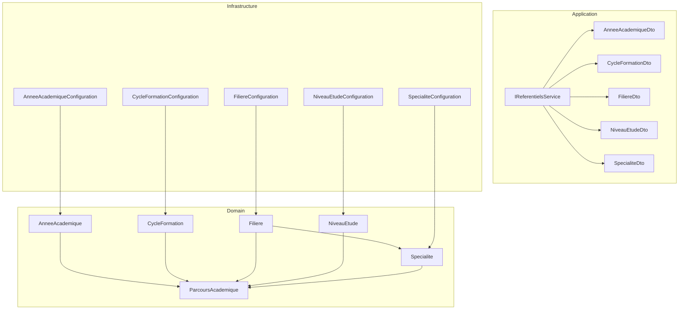
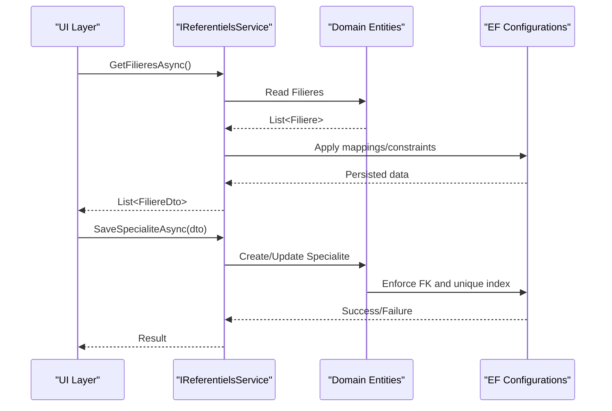
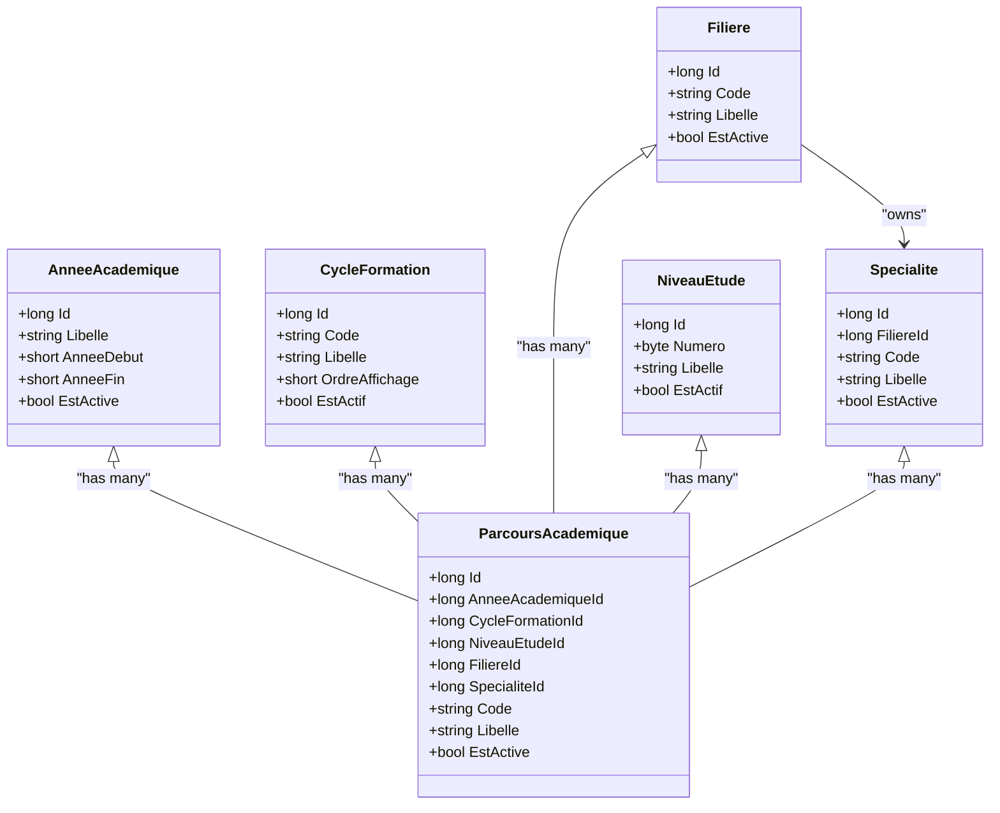
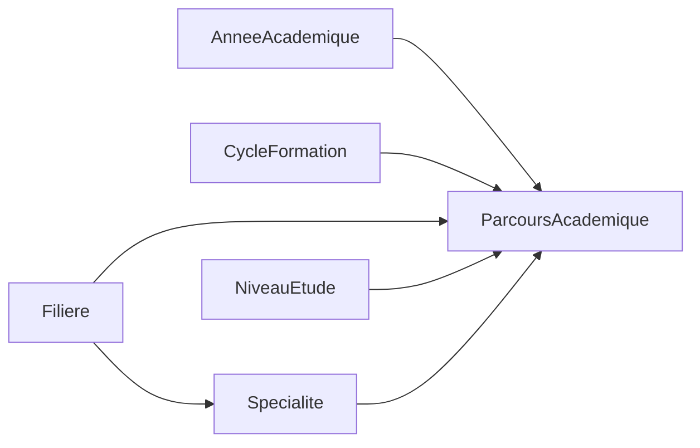

# Reference Data Domain

<cite>
**Referenced Files in This Document**
- [AnneeAcademique.cs](file://RIIS.Academic.Domain/Referentiels/AnneeAcademique.cs)
- [CycleFormation.cs](file://RIIS.Academic.Domain/Referentiels/CycleFormation.cs)
- [Filiere.cs](file://RIIS.Academic.Domain/Referentiels/Filiere.cs)
- [NiveauEtude.cs](file://RIIS.Academic.Domain/Referentiels/NiveauEtude.cs)
- [Specialite.cs](file://RIIS.Academic.Domain/Referentiels/Specialite.cs)
- [ParcoursAcademique.cs](file://RIIS.Academic.Domain/Parcours/ParcoursAcademique.cs)
- [IReferentielsService.cs](file://RIIS.Academic.Application/Referentiels/Services/IReferentielsService.cs)
- [AnneeAcademiqueDto.cs](file://RIIS.Academic.Application/Referentiels/Dtos/AnneeAcademiqueDto.cs)
- [CycleFormationDto.cs](file://RIIS.Academic.Application/Referentiels/Dtos/CycleFormationDto.cs)
- [FiliereDto.cs](file://RIIS.Academic.Application/Referentiels/Dtos/FiliereDto.cs)
- [NiveauEtudeDto.cs](file://RIIS.Academic.Application/Referentiels/Dtos/NiveauEtudeDto.cs)
- [SpecialiteDto.cs](file://RIIS.Academic.Application/Referentiels/Dtos/SpecialiteDto.cs)
- [AnneeAcademiqueConfiguration.cs](file://RIIS.Academic.Infrastructure/Persistence/Configurations/Referentiels/AnneeAcademiqueConfiguration.cs)
- [CycleFormationConfiguration.cs](file://RIIS.Academic.Infrastructure/Persistence/Configurations/Referentiels/CycleFormationConfiguration.cs)
- [FiliereConfiguration.cs](file://RIIS.Academic.Infrastructure/Persistence/Configurations/Referentiels/FiliereConfiguration.cs)
- [NiveauEtudeConfiguration.cs](file://RIIS.Academic.Infrastructure/Persistence/Configurations/Referentiels/NiveauEtudeConfiguration.cs)
- [SpecialiteConfiguration.cs](file://RIIS.Academic.Infrastructure/Persistence/Configurations/Referentiels/SpecialiteConfiguration.cs)
</cite>

## Table of Contents
1. Introduction
2. Project Structure
3. Core Components
4. Architecture Overview
5. Detailed Component Analysis
6. Dependency Analysis
7. Performance Considerations
8. Troubleshooting Guide
9. Conclusion

## Introduction
This document explains the Reference Data domain model that standardizes academic categorization across the application. It focuses on the hierarchical reference entities: Academic Year (AnneeAcademique), Training Cycle (CycleFormation), Department/Field (Filiere), Study Level (NiveauEtude), and Specialization (Specialite). These references provide consistent, reusable classification data used by programs, enrollments, classes, and reports to organize academic offerings and track student progress.

The hierarchy is anchored by ParcoursAcademique (Academic Program Path), which composes a specific combination of these references for a given academic year. This enables precise modeling of how students are enrolled, grouped into classes, evaluated, and reported over time.

## Project Structure
The Reference Data domain spans three layers:
- Domain layer: defines the core entities and their relationships.
- Application layer: exposes services and DTOs for CRUD and lookup operations.
- Infrastructure layer: configures persistence, constraints, indexes, and seed data.

**Diagram sources**
- [AnneeAcademique.cs:1-15](file://RIIS.Academic.Domain/Referentiels/AnneeAcademique.cs#L1-L15)
- [CycleFormation.cs:1-13](file://RIIS.Academic.Domain/Referentiels/CycleFormation.cs#L1-L13)
- [Filiere.cs:1-13](file://RIIS.Academic.Domain/Referentiels/Filiere.cs#L1-L13)
- [NiveauEtude.cs:1-14](file://RIIS.Academic.Domain/Referentiels/NiveauEtude.cs#L1-L14)
- [Specialite.cs:1-14](file://RIIS.Academic.Domain/Referentiels/Specialite.cs#L1-L14)
- [ParcoursAcademique.cs:1-24](file://RIIS.Academic.Domain/Parcours/ParcoursAcademique.cs#L1-L24)
- [IReferentielsService.cs:1-46](file://RIIS.Academic.Application/Referentiels/Services/IReferentielsService.cs#L1-L46)
- [AnneeAcademiqueConfiguration.cs:1-18](file://RIIS.Academic.Infrastructure/Persistence/Configurations/Referentiels/AnneeAcademiqueConfiguration.cs#L1-L18)
- [CycleFormationConfiguration.cs:1-23](file://RIIS.Academic.Infrastructure/Persistence/Configurations/Referentiels/CycleFormationConfiguration.cs#L1-L23)
- [FiliereConfiguration.cs:1-17](file://RIIS.Academic.Infrastructure/Persistence/Configurations/Referentiels/FiliereConfiguration.cs#L1-L17)
- [NiveauEtudeConfiguration.cs:1-23](file://RIIS.Academic.Infrastructure/Persistence/Configurations/Referentiels/NiveauEtudeConfiguration.cs#L1-L23)
- [SpecialiteConfiguration.cs:1-21](file://RIIS.Academic.Infrastructure/Persistence/Configurations/Referentiels/SpecialiteConfiguration.cs#L1-L21)

**Section sources**
- [AnneeAcademique.cs:1-15](file://RIIS.Academic.Domain/Referentiels/AnneeAcademique.cs#L1-L15)
- [CycleFormation.cs:1-13](file://RIIS.Academic.Domain/Referentiels/CycleFormation.cs#L1-L13)
- [Filiere.cs:1-13](file://RIIS.Academic.Domain/Referentiels/Filiere.cs#L1-L13)
- [NiveauEtude.cs:1-14](file://RIIS.Academic.Domain/Referentiels/NiveauEtude.cs#L1-L14)
- [Specialite.cs:1-14](file://RIIS.Academic.Domain/Referentiels/Specialite.cs#L1-L14)
- [ParcoursAcademique.cs:1-24](file://RIIS.Academic.Domain/Parcours/ParcoursAcademique.cs#L1-L24)
- [IReferentielsService.cs:1-46](file://RIIS.Academic.Application/Referentiels/Services/IReferentielsService.cs#L1-L46)
- [AnneeAcademiqueConfiguration.cs:1-18](file://RIIS.Academic.Infrastructure/Persistence/Configurations/Referentiels/AnneeAcademiqueConfiguration.cs#L1-L18)
- [CycleFormationConfiguration.cs:1-23](file://RIIS.Academic.Infrastructure/Persistence/Configurations/Referentiels/CycleFormationConfiguration.cs#L1-L23)
- [FiliereConfiguration.cs:1-17](file://RIIS.Academic.Infrastructure/Persistence/Configurations/Referentiels/FiliereConfiguration.cs#L1-L17)
- [NiveauEtudeConfiguration.cs:1-23](file://RIIS.Academic.Infrastructure/Persistence/Configurations/Referentiels/NiveauEtudeConfiguration.cs#L1-L23)
- [SpecialiteConfiguration.cs:1-21](file://RIIS.Academic.Infrastructure/Persistence/Configurations/Referentiels/SpecialiteConfiguration.cs#L1-L21)

## Core Components
Reference entities and their roles:
- AnneeAcademique (Academic Year): Defines a valid academic period with start/end years and an active flag. Used to scope programs, enrollments, and classes to a specific timeframe.
- CycleFormation (Training Cycle): Represents broad training cycles (for example, preparatory, BTS, Licence, Master) with display order and activation status.
- Filiere (Department/Field): Identifies a department or field of study with code and label; serves as a parent to Specialites.
- NiveauEtude (Study Level): Encodes study levels with a numeric ordering and labels; used to classify program depth and link to semesters and enrollments.
- Specialite (Specialization): A specialized track within a Filiere, with unique codes per department.

These references are composed in ParcoursAcademique to define a concrete academic program path for a given academic year, combining cycle, level, department, and specialization.

Examples of usage:
- Enrollment selection: Students enroll into a ParcoursAcademique identified by a specific combination of year, cycle, level, department, and specialization.
- Class organization: Classes are associated with both an academic year and a program path, enabling grouping by department/specialization and year.
- Reporting and dashboards: Reports filter by academic year, cycle, level, department, and specialization to produce targeted analytics.

**Section sources**
- [AnneeAcademique.cs:1-15](file://RIIS.Academic.Domain/Referentiels/AnneeAcademique.cs#L1-L15)
- [CycleFormation.cs:1-13](file://RIIS.Academic.Domain/Referentiels/CycleFormation.cs#L1-L13)
- [Filiere.cs:1-13](file://RIIS.Academic.Domain/Referentiels/Filiere.cs#L1-L13)
- [NiveauEtude.cs:1-14](file://RIIS.Academic.Domain/Referentiels/NiveauEtude.cs#L1-L14)
- [Specialite.cs:1-14](file://RIIS.Academic.Domain/Referentiels/Specialite.cs#L1-L14)
- [ParcoursAcademique.cs:1-24](file://RIIS.Academic.Domain/Parcours/ParcoursAcademique.cs#L1-L24)

## Architecture Overview
The reference data model provides a stable taxonomy that other domains consume. The service layer exposes read/write operations via DTOs, while infrastructure enforces database constraints and seeds canonical values.

**Diagram sources**
- [IReferentielsService.cs:1-46](file://RIIS.Academic.Application/Referentiels/Services/IReferentielsService.cs#L1-L46)
- [Filiere.cs:1-13](file://RIIS.Academic.Domain/Referentiels/Filiere.cs#L1-L13)
- [Specialite.cs:1-14](file://RIIS.Academic.Domain/Referentiels/Specialite.cs#L1-L14)
- [FiliereConfiguration.cs:1-17](file://RIIS.Academic.Infrastructure/Persistence/Configurations/Referentiels/FiliereConfiguration.cs#L1-L17)
- [SpecialiteConfiguration.cs:1-21](file://RIIS.Academic.Infrastructure/Persistence/Configurations/Referentiels/SpecialiteConfiguration.cs#L1-L21)

## Detailed Component Analysis

### Academic Year (AnneeAcademique)
Purpose:
- Models a two-year academic period with strict validation that end equals start + 1.
- Provides scoping for programs, classes, and enrollments.

Key characteristics:
- Unique label and unique composite key on start/end years.
- Active flag to control visibility and selection in UIs.

Persistence highlights:
- Check constraint ensures a valid academic period.
- Unique indexes protect against duplicates.

Usage examples:
- Selecting the current academic year for enrollment.
- Filtering class rosters and results by academic year.

**Section sources**
- [AnneeAcademique.cs:1-15](file://RIIS.Academic.Domain/Referentiels/AnneeAcademique.cs#L1-L15)
- [AnneeAcademiqueConfiguration.cs:1-18](file://RIIS.Academic.Infrastructure/Persistence/Configurations/Referentiels/AnneeAcademiqueConfiguration.cs#L1-L18)

### Training Cycle (CycleFormation)
Purpose:
- Captures high-level training cycles with a display order for UI sorting.

Key characteristics:
- Code and label identify each cycle.
- Activation flag controls availability.

Seed data:
- Predefined cycles include preparatory, BTS, Licence, and Master.

Usage examples:
- Grouping programs by cycle in dashboards.
- Filtering students by their training cycle.

**Section sources**
- [CycleFormation.cs:1-13](file://RIIS.Academic.Domain/Referentiels/CycleFormation.cs#L1-L13)
- [CycleFormationConfiguration.cs:1-23](file://RIIS.Academic.Infrastructure/Persistence/Configurations/Referentiels/CycleFormationConfiguration.cs#L1-L23)

### Department/Field (Filiere)
Purpose:
- Represents departments or fields of study with unique codes.

Key characteristics:
- Parent to Specialites.
- Active flag to manage available departments.

Usage examples:
- Building department-specific menus and filters.
- Aggregating performance metrics by department.

**Section sources**
- [Filiere.cs:1-13](file://RIIS.Academic.Domain/Referentiels/Filiere.cs#L1-L13)
- [FiliereConfiguration.cs:1-17](file://RIIS.Academic.Infrastructure/Persistence/Configurations/Referentiels/FiliereConfiguration.cs#L1-L17)

### Study Level (NiveauEtude)
Purpose:
- Encodes study levels with a numeric ordering and descriptive labels.

Key characteristics:
- Numeric ordering enforced by a check constraint.
- Unique index on number prevents duplication.

Usage examples:
- Ordering levels in UIs.
- Linking semesters and enrollments to a study level.

**Section sources**
- [NiveauEtude.cs:1-14](file://RIIS.Academic.Domain/Referentiels/NiveauEtude.cs#L1-L14)
- [NiveauEtudeConfiguration.cs:1-23](file://RIIS.Academic.Infrastructure/Persistence/Configurations/Referentiels/NiveauEtudeConfiguration.cs#L1-L23)

### Specialization (Specialite)
Purpose:
- Refines a department into a specific specialization with unique codes per department.

Key characteristics:
- Foreign key to Filiere with restrictive delete behavior.
- Unique index on (FiliereId, Code) ensures uniqueness within a department.

Usage examples:
- Narrowing program options when selecting a specialization.
- Tracking outcomes by specialization.

**Section sources**
- [Specialite.cs:1-14](file://RIIS.Academic.Domain/Referentiels/Specialite.cs#L1-L14)
- [SpecialiteConfiguration.cs:1-21](file://RIIS.Academic.Infrastructure/Persistence/Configurations/Referentiels/SpecialiteConfiguration.cs#L1-L21)

### Program Path Composition (ParcoursAcademique)
Purpose:
- Composes a concrete academic program path by linking an academic year with a cycle, level, department, and specialization.

Key characteristics:
- References all five reference entities.
- Acts as the central anchor for enrollments, classes, and official records.

Usage examples:
- Creating a new program path for a given year and department/specialization.
- Enrolling students into a specific program path.

**Diagram sources**
- [AnneeAcademique.cs:1-15](file://RIIS.Academic.Domain/Referentiels/AnneeAcademique.cs#L1-L15)
- [CycleFormation.cs:1-13](file://RIIS.Academic.Domain/Referentiels/CycleFormation.cs#L1-L13)
- [Filiere.cs:1-13](file://RIIS.Academic.Domain/Referentiels/Filiere.cs#L1-L13)
- [NiveauEtude.cs:1-14](file://RIIS.Academic.Domain/Referentiels/NiveauEtude.cs#L1-L14)
- [Specialite.cs:1-14](file://RIIS.Academic.Domain/Referentiels/Specialite.cs#L1-L14)
- [ParcoursAcademique.cs:1-24](file://RIIS.Academic.Domain/Parcours/ParcoursAcademique.cs#L1-L24)

### Service and DTOs
The application layer exposes a unified service for managing reference data and returns DTOs for UI consumption.

Key capabilities:
- Retrieve lists of academic years, cycles, departments, levels, and specializations.
- Create default entries for quick setup.
- Save and delete reference entities.
- Generate specialization codes and lookups for active departments.

DTOs mirror domain properties for safe transfer across boundaries.

**Section sources**
- [IReferentielsService.cs:1-46](file://RIIS.Academic.Application/Referentiels/Services/IReferentielsService.cs#L1-L46)
- [AnneeAcademiqueDto.cs:1-11](file://RIIS.Academic.Application/Referentiels/Dtos/AnneeAcademiqueDto.cs#L1-L11)
- [CycleFormationDto.cs:1-11](file://RIIS.Academic.Application/Referentiels/Dtos/CycleFormationDto.cs#L1-L11)
- [FiliereDto.cs:1-10](file://RIIS.Academic.Application/Referentiels/Dtos/FiliereDto.cs#L1-L10)
- [NiveauEtudeDto.cs:1-10](file://RIIS.Academic.Application/Referentiels/Dtos/NiveauEtudeDto.cs#L1-L10)
- [SpecialiteDto.cs:1-13](file://RIIS.Academic.Application/Referentiels/Dtos/SpecialiteDto.cs#L1-L13)

## Dependency Analysis
Reference entities form a directed dependency graph where ParcoursAcademique depends on all references, and Specialite depends on Filiere. Persistence configurations enforce referential integrity and uniqueness.

**Diagram sources**
- [ParcoursAcademique.cs:1-24](file://RIIS.Academic.Domain/Parcours/ParcoursAcademique.cs#L1-L24)
- [Specialite.cs:1-14](file://RIIS.Academic.Domain/Referentiels/Specialite.cs#L1-L14)
- [Filiere.cs:1-13](file://RIIS.Academic.Domain/Referentiels/Filiere.cs#L1-L13)

**Section sources**
- [ParcoursAcademique.cs:1-24](file://RIIS.Academic.Domain/Parcours/ParcoursAcademique.cs#L1-L24)
- [SpecialiteConfiguration.cs:1-21](file://RIIS.Academic.Infrastructure/Persistence/Configurations/Referentiels/SpecialiteConfiguration.cs#L1-L21)

## Performance Considerations
- Indexes:
  - Unique indexes on labels and codes reduce lookup times and prevent duplicates.
  - Composite unique index on (FiliereId, Code) optimizes queries filtering specializations by department.
- Constraints:
  - Check constraints ensure data validity at the database level, reducing application-side validation overhead.
- Seed data:
  - Pre-seeded cycles and levels minimize startup queries and improve initial UX.

[No sources needed since this section provides general guidance]

## Troubleshooting Guide
Common issues and resolutions:
- Invalid academic year:
  - Symptom: Error when saving an academic year where end year is not start + 1.
  - Cause: Database check constraint violation.
  - Resolution: Ensure AnneeFin equals AnneeDebut + 1.
- Duplicate codes:
  - Symptom: Uniqueness errors when creating or updating cycles, departments, or levels.
  - Cause: Unique index violations on Code or Numero.
  - Resolution: Use a distinct code or number.
- Deleting a department with specializations:
  - Symptom: Deletion fails due to foreign key restrictions.
  - Cause: Restrictive delete behavior on Specialite.FiliereId.
  - Resolution: Remove or reassign related specializations before deleting the department.
- Saving a specialization without a department:
  - Symptom: Validation or persistence error.
  - Cause: Required foreign key to Filiere.
  - Resolution: Provide a valid FiliereId.

**Section sources**
- [AnneeAcademiqueConfiguration.cs:1-18](file://RIIS.Academic.Infrastructure/Persistence/Configurations/Referentiels/AnneeAcademiqueConfiguration.cs#L1-L18)
- [CycleFormationConfiguration.cs:1-23](file://RIIS.Academic.Infrastructure/Persistence/Configurations/Referentiels/CycleFormationConfiguration.cs#L1-L23)
- [FiliereConfiguration.cs:1-17](file://RIIS.Academic.Infrastructure/Persistence/Configurations/Referentiels/FiliereConfiguration.cs#L1-L17)
- [NiveauEtudeConfiguration.cs:1-23](file://RIIS.Academic.Infrastructure/Persistence/Configurations/Referentiels/NiveauEtudeConfiguration.cs#L1-L23)
- [SpecialiteConfiguration.cs:1-21](file://RIIS.Academic.Infrastructure/Persistence/Configurations/Referentiels/SpecialiteConfiguration.cs#L1-L21)

## Conclusion
The Reference Data domain establishes a robust, constrained taxonomy for organizing academic programs and tracking students. By standardizing academic years, training cycles, departments, study levels, and specializations—and composing them into program paths—the system ensures consistency across enrollments, classes, evaluations, and reporting. The service layer and DTOs provide clear APIs for consuming and maintaining this reference data, while infrastructure configurations guarantee data integrity and performance.