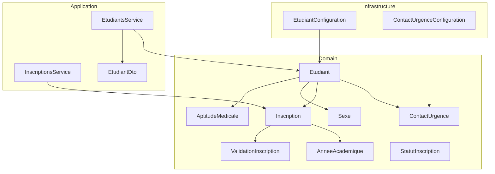
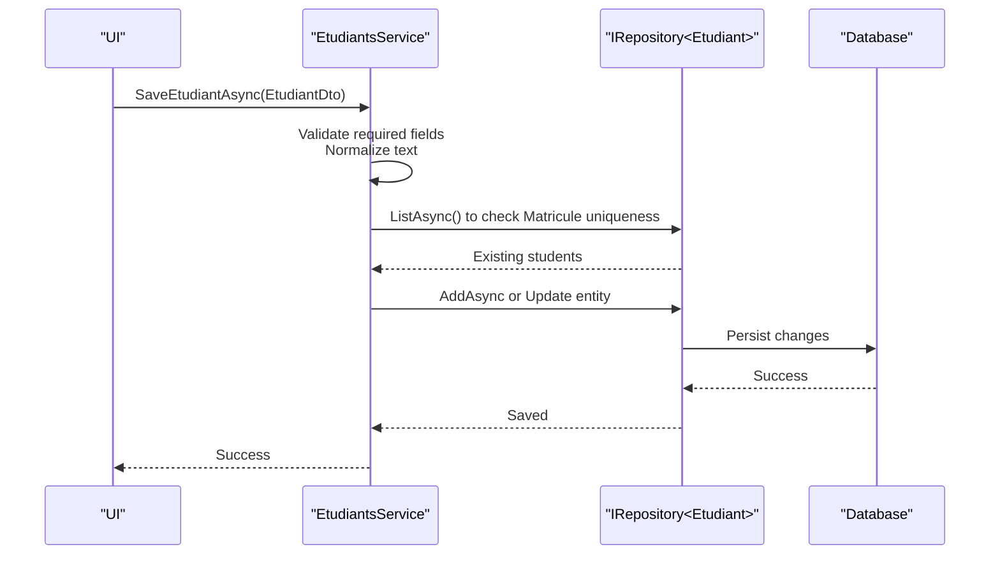
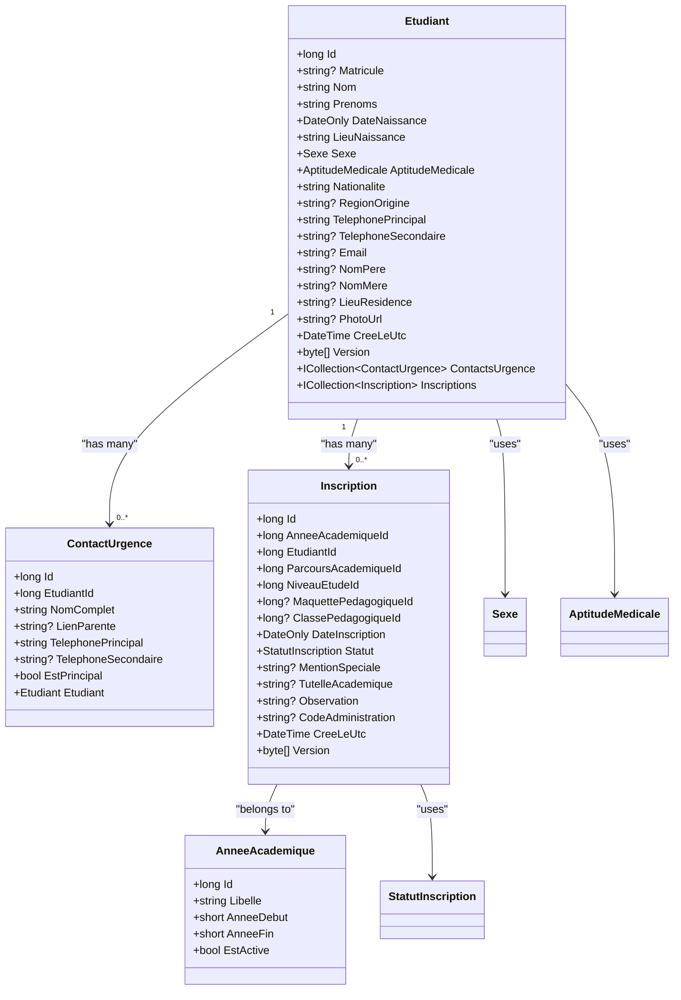
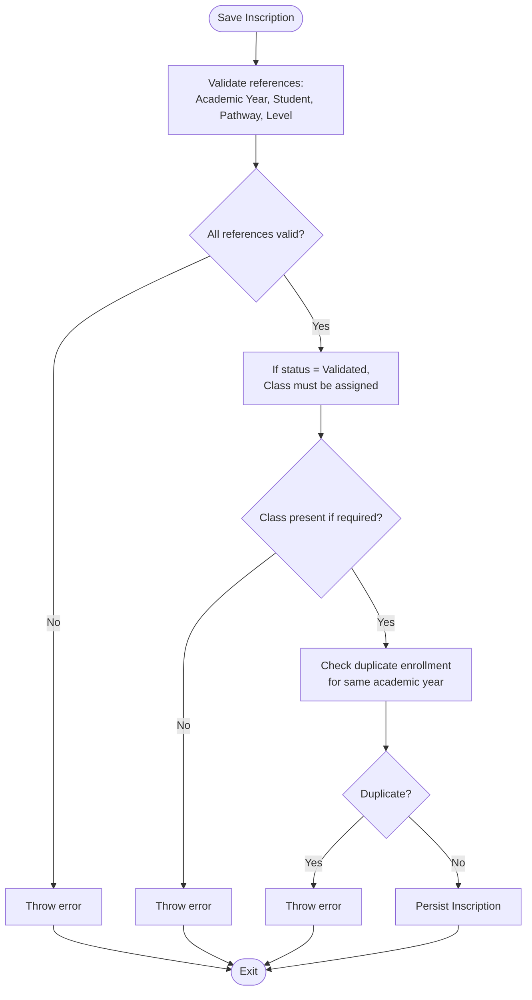
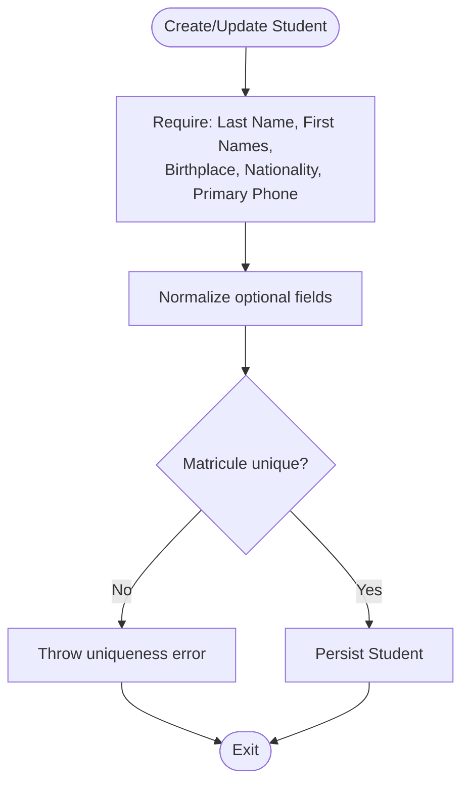
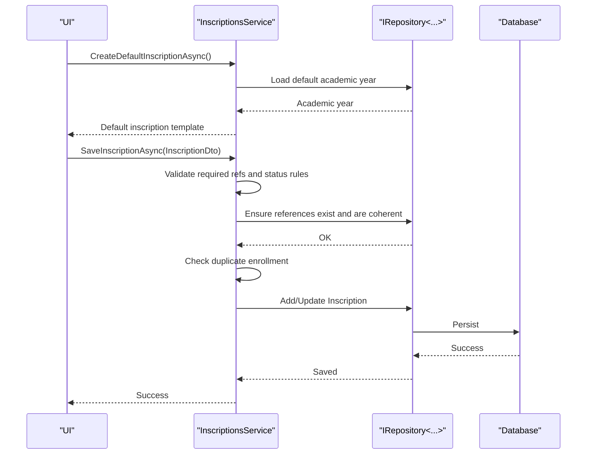
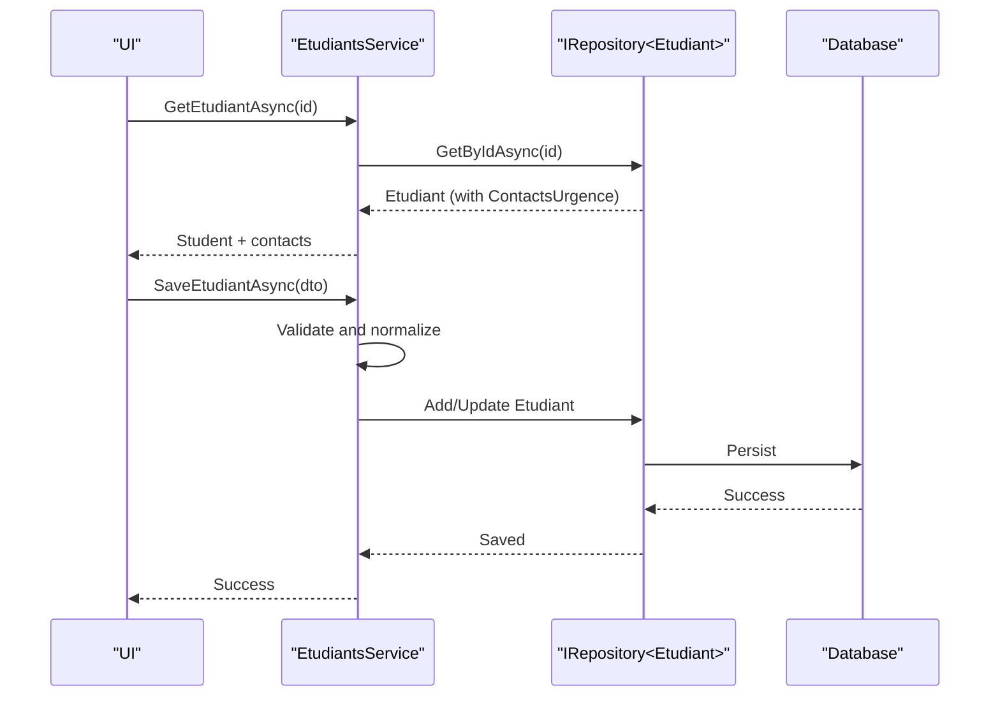
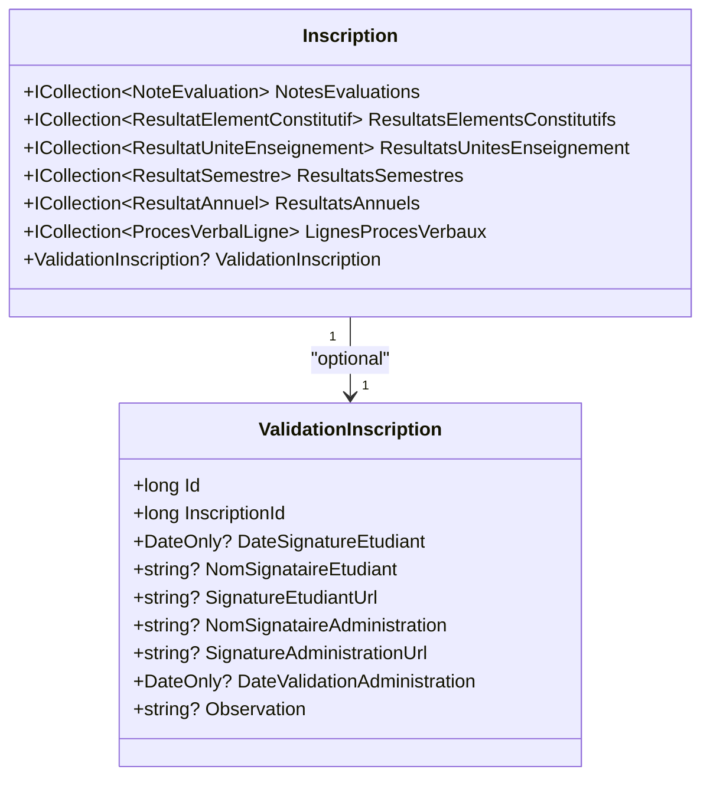
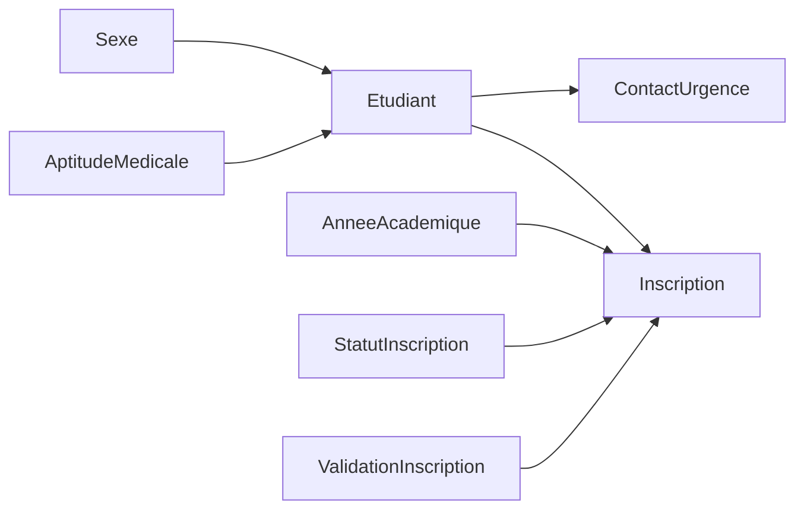

# Student Management Domain

<cite>
**Referenced Files in This Document**
- [Etudiant.cs](file://RIIS.Academic.Domain/Etudiants/Etudiant.cs)
- [ContactUrgence.cs](file://RIIS.Academic.Domain/Etudiants/ContactUrgence.cs)
- [Entity.cs](file://RIIS.Academic.Domain/Common/Entity.cs)
- [AuditableEntity.cs](file://RIIS.Academic.Domain/Common/AuditableEntity.cs)
- [Sexe.cs](file://RIIS.Academic.Domain/Enums/Sexe.cs)
- [AptitudeMedicale.cs](file://RIIS.Academic.Domain/Enums/AptitudeMedicale.cs)
- [Inscription.cs](file://RIIS.Academic.Domain/Inscriptions/Inscription.cs)
- [StatutInscription.cs](file://RIIS.Academic.Domain/Enums/StatutInscription.cs)
- [AnneeAcademique.cs](file://RIIS.Academic.Domain/Referentiels/AnneeAcademique.cs)
- [ValidationInscription.cs](file://RIIS.Academic.Domain/Inscriptions/ValidationInscription.cs)
- [EtudiantConfiguration.cs](file://RIIS.Academic.Infrastructure/Persistence/Configurations/Etudiants/EtudiantConfiguration.cs)
- [ContactUrgenceConfiguration.cs](file://RIIS.Academic.Infrastructure/Persistence/Configurations/Etudiants/ContactUrgenceConfiguration.cs)
- [EtudiantsService.cs](file://RIIS.Academic.Application/Etudiants/Services/EtudiantsService.cs)
- [EtudiantDto.cs](file://RIIS.Academic.Application/Etudiants/Dtos/EtudiantDto.cs)
- [InscriptionsService.cs](file://RIIS.Academic.Application/Inscriptions/Services/InscriptionsService.cs)
</cite>

## Table of Contents
1. [Introduction](#introduction)
2. [Project Structure](#project-structure)
3. [Core Components](#core-components)
4. [Architecture Overview](#architecture-overview)
5. [Detailed Component Analysis](#detailed-component-analysis)
6. [Dependency Analysis](#dependency-analysis)
7. [Performance Considerations](#performance-considerations)
8. [Troubleshooting Guide](#troubleshooting-guide)
9. [Conclusion](#conclusion)

## Introduction
This document describes the Student Management domain model with a focus on the Etudiant (Student) entity, its personal and academic attributes, relationships to other domain objects, and the ContactUrgence (Emergency Contact) entity. It also explains business rules for data validation, lifecycle management, state transitions, and how students participate in enrollment workflows and broader academic processes.

## Project Structure
The student management domain spans three layers:
- Domain layer: defines core entities, enums, and relationships.
- Application layer: implements use cases, validation, and orchestration via services and DTOs.
- Infrastructure layer: configures persistence mappings and database constraints.

**Diagram sources**
- [Etudiant.cs:3-27](file://RIIS.Academic.Domain/Etudiants/Etudiant.cs#L3-L27)
- [ContactUrgence.cs:3-14](file://RIIS.Academic.Domain/Etudiants/ContactUrgence.cs#L3-L14)
- [Inscription.cs:3-36](file://RIIS.Academic.Domain/Inscriptions/Inscription.cs#L3-L36)
- [AnneeAcademique.cs:3-14](file://RIIS.Academic.Domain/Referentiels/AnneeAcademique.cs#L3-L14)
- [ValidationInscription.cs:3-17](file://RIIS.Academic.Domain/Inscriptions/ValidationInscription.cs#L3-L17)
- [StatutInscription.cs:3-9](file://RIIS.Academic.Domain/Enums/StatutInscription.cs#L3-L9)
- [Sexe.cs:3-8](file://RIIS.Academic.Domain/Enums/Sexe.cs#L3-L8)
- [AptitudeMedicale.cs:3-8](file://RIIS.Academic.Domain/Enums/AptitudeMedicale.cs#L3-L8)
- [EtudiantsService.cs:7-173](file://RIIS.Academic.Application/Etudiants/Services/EtudiantsService.cs#L7-L173)
- [InscriptionsService.cs:8-457](file://RIIS.Academic.Application/Inscriptions/Services/InscriptionsService.cs#L8-L457)
- [EtudiantConfiguration.cs:6-33](file://RIIS.Academic.Infrastructure/Persistence/Configurations/Etudiants/EtudiantConfiguration.cs#L6-L33)
- [ContactUrgenceConfiguration.cs:6-21](file://RIIS.Academic.Infrastructure/Persistence/Configurations/Etudiants/ContactUrgenceConfiguration.cs#L6-L21)

**Section sources**
- [Etudiant.cs:3-27](file://RIIS.Academic.Domain/Etudiants/Etudiant.cs#L3-L27)
- [ContactUrgence.cs:3-14](file://RIIS.Academic.Domain/Etudiants/ContactUrgence.cs#L3-L14)
- [Inscription.cs:3-36](file://RIIS.Academic.Domain/Inscriptions/Inscription.cs#L3-L36)
- [EtudiantsService.cs:7-173](file://RIIS.Academic.Application/Etudiants/Services/EtudiantsService.cs#L7-L173)
- [InscriptionsService.cs:8-457](file://RIIS.Academic.Application/Inscriptions/Services/InscriptionsService.cs#L8-L457)
- [EtudiantConfiguration.cs:6-33](file://RIIS.Academic.Infrastructure/Persistence/Configurations/Etudiants/EtudiantConfiguration.cs#L6-L33)
- [ContactUrgenceConfiguration.cs:6-21](file://RIIS.Academic.Infrastructure/Persistence/Configurations/Etudiants/ContactUrgenceConfiguration.cs#L6-L21)

## Core Components
- Etudiant (Student): Represents a student’s identity, personal details, contact information, medical aptitude, and links to emergency contacts and enrollments.
- ContactUrgence (Emergency Contact): Captures one or more emergency contacts per student, including relationship and primary flag.
- Inscription (Enrollment): Links a student to an academic year, study level, program pathway, optional pedagogical class, and curriculum blueprint; carries status and administrative metadata.
- Enums: Sexe (gender), AptitudeMedicale (medical fitness), StatutInscription (enrollment status).
- Supporting references: AnneeAcademique (academic year), ValidationInscription (signatures and administrative validation).

Key responsibilities:
- Etudiant: Owns personal data and relationships to ContactsUrgence and Inscriptions.
- ContactUrgence: Provides emergency contact details tied to a specific student.
- Inscription: Encapsulates enrollment lifecycle and participates in evaluation and results aggregation.

**Section sources**
- [Etudiant.cs:3-27](file://RIIS.Academic.Domain/Etudiants/Etudiant.cs#L3-L27)
- [ContactUrgence.cs:3-14](file://RIIS.Academic.Domain/Etudiants/ContactUrgence.cs#L3-L14)
- [Inscription.cs:3-36](file://RIIS.Academic.Domain/Inscriptions/Inscription.cs#L3-L36)
- [Sexe.cs:3-8](file://RIIS.Academic.Domain/Enums/Sexe.cs#L3-L8)
- [AptitudeMedicale.cs:3-8](file://RIIS.Academic.Domain/Enums/AptitudeMedicale.cs#L3-L8)
- [StatutInscription.cs:3-9](file://RIIS.Academic.Domain/Enums/StatutInscription.cs#L3-L9)
- [AnneeAcademique.cs:3-14](file://RIIS.Academic.Domain/Referentiels/AnneeAcademique.cs#L3-L14)
- [ValidationInscription.cs:3-17](file://RIIS.Academic.Domain/Inscriptions/ValidationInscription.cs#L3-L17)

## Architecture Overview
The system follows clean architecture principles:
- Domain models define invariants and relationships.
- Application services enforce business rules and orchestrate operations using repositories.
- Infrastructure configures persistence and database constraints.

**Diagram sources**
- [EtudiantsService.cs:53-121](file://RIIS.Academic.Application/Etudiants/Services/EtudiantsService.cs#L53-L121)
- [EtudiantConfiguration.cs:10-31](file://RIIS.Academic.Infrastructure/Persistence/Configurations/Etudiants/EtudiantConfiguration.cs#L10-L31)

**Section sources**
- [EtudiantsService.cs:53-121](file://RIIS.Academic.Application/Etudiants/Services/EtudiantsService.cs#L53-L121)
- [EtudiantConfiguration.cs:10-31](file://RIIS.Academic.Infrastructure/Persistence/Configurations/Etudiants/EtudiantConfiguration.cs#L10-L31)

## Detailed Component Analysis

### Etudiant Entity
- Personal information: name, surname(s), date and place of birth, gender, nationality, region of origin, phone numbers, email, parents’ names, residence location, photo URL.
- Academic status: medical aptitude.
- Relationships:
  - One-to-many with ContactUrgence.
  - One-to-many with Inscription.
- Auditing/versioning: creation timestamp and concurrency row version.

**Diagram sources**
- [Etudiant.cs:3-27](file://RIIS.Academic.Domain/Etudiants/Etudiant.cs#L3-L27)
- [ContactUrgence.cs:3-14](file://RIIS.Academic.Domain/Etudiants/ContactUrgence.cs#L3-L14)
- [Inscription.cs:3-36](file://RIIS.Academic.Domain/Inscriptions/Inscription.cs#L3-L36)
- [AnneeAcademique.cs:3-14](file://RIIS.Academic.Domain/Referentiels/AnneeAcademique.cs#L3-L14)
- [StatutInscription.cs:3-9](file://RIIS.Academic.Domain/Enums/StatutInscription.cs#L3-L9)
- [Sexe.cs:3-8](file://RIIS.Academic.Domain/Enums/Sexe.cs#L3-L8)
- [AptitudeMedicale.cs:3-8](file://RIIS.Academic.Domain/Enums/AptitudeMedicale.cs#L3-L8)

**Section sources**
- [Etudiant.cs:3-27](file://RIIS.Academic.Domain/Etudiants/Etudiant.cs#L3-L27)
- [ContactUrgence.cs:3-14](file://RIIS.Academic.Domain/Etudiants/ContactUrgence.cs#L3-L14)
- [Inscription.cs:3-36](file://RIIS.Academic.Domain/Inscriptions/Inscription.cs#L3-L36)
- [AnneeAcademique.cs:3-14](file://RIIS.Academic.Domain/Referentiels/AnneeAcademique.cs#L3-L14)
- [StatutInscription.cs:3-9](file://RIIS.Academic.Domain/Enums/StatutInscription.cs#L3-L9)
- [Sexe.cs:3-8](file://RIIS.Academic.Domain/Enums/Sexe.cs#L3-L8)
- [AptitudeMedicale.cs:3-8](file://RIIS.Academic.Domain/Enums/AptitudeMedicale.cs#L3-L8)

### ContactUrgence Entity
- Purpose: Store emergency contact details for a student.
- Key fields: full name, relationship to student, primary and secondary phone numbers, primary flag.
- Relationship: belongs to exactly one Etudiant; cascade delete configured at the database level.

Business rules:
- At least one emergency contact is typically expected per student (application-level enforcement can be added where needed).
- Primary contact selection should be managed by the application layer when creating/updating multiple contacts.

Persistence notes:
- Foreign key to Etudiant with cascade delete ensures referential integrity.

**Section sources**
- [ContactUrgence.cs:3-14](file://RIIS.Academic.Domain/Etudiants/ContactUrgence.cs#L3-L14)
- [ContactUrgenceConfiguration.cs:16-19](file://RIIS.Academic.Infrastructure/Persistence/Configurations/Etudiants/ContactUrgenceConfiguration.cs#L16-L19)

### Enrollment Lifecycle and State Transitions
- Inscription ties a student to an academic year, study level, and program pathway; may include a pedagogical class and curriculum blueprint.
- Status enum StatutInscription supports states such as pending, validated, suspended, and canceled.
- Business rules enforced during save:
  - Required references: academic year, student, pathway, study level must exist and be valid.
  - If status is validated, a pedagogical class must be assigned.
  - Uniqueness: a student cannot have duplicate enrollments for the same academic year.
  - Class and curriculum compatibility checks ensure alignment with the selected pathway and academic year.

**Diagram sources**
- [InscriptionsService.cs:108-191](file://RIIS.Academic.Application/Inscriptions/Services/InscriptionsService.cs#L108-L191)
- [StatutInscription.cs:3-9](file://RIIS.Academic.Domain/Enums/StatutInscription.cs#L3-L9)

**Section sources**
- [InscriptionsService.cs:108-191](file://RIIS.Academic.Application/Inscriptions/Services/InscriptionsService.cs#L108-L191)
- [Inscription.cs:3-36](file://RIIS.Academic.Domain/Inscriptions/Inscription.cs#L3-L36)
- [StatutInscription.cs:3-9](file://RIIS.Academic.Domain/Enums/StatutInscription.cs#L3-L9)

### Student Data Validation Rules
- Required fields for Etudiant: last name, first names, birthplace, nationality, primary phone number.
- Optional fields are normalized (trimmed) and persisted as null if empty.
- Matricule uniqueness: enforced at save time against existing students.
- Default values provided for convenient creation flows.

**Diagram sources**
- [EtudiantsService.cs:53-121](file://RIIS.Academic.Application/Etudiants/Services/EtudiantsService.cs#L53-L121)
- [EtudiantConfiguration.cs:12-15](file://RIIS.Academic.Infrastructure/Persistence/Configurations/Etudiants/EtudiantConfiguration.cs#L12-L15)

**Section sources**
- [EtudiantsService.cs:53-121](file://RIIS.Academic.Application/Etudiants/Services/EtudiantsService.cs#L53-L121)
- [EtudiantConfiguration.cs:12-15](file://RIIS.Academic.Infrastructure/Persistence/Configurations/Etudiants/EtudiantConfiguration.cs#L12-L15)

### Enrollment Workflow Example
End-to-end flow from selecting a student to finalizing enrollment:

**Diagram sources**
- [InscriptionsService.cs:95-191](file://RIIS.Academic.Application/Inscriptions/Services/InscriptionsService.cs#L95-L191)
- [InscriptionsService.cs:313-382](file://RIIS.Academic.Application/Inscriptions/Services/InscriptionsService.cs#L313-L382)

**Section sources**
- [InscriptionsService.cs:95-191](file://RIIS.Academic.Application/Inscriptions/Services/InscriptionsService.cs#L95-L191)
- [InscriptionsService.cs:313-382](file://RIIS.Academic.Application/Inscriptions/Services/InscriptionsService.cs#L313-L382)

### Contact Management Example
Managing emergency contacts for a student:

Note: Emergency contacts are part of the student aggregate; updates to the student persist the related contacts according to your application logic.

**Diagram sources**
- [EtudiantsService.cs:35-121](file://RIIS.Academic.Application/Etudiants/Services/EtudiantsService.cs#L35-L121)
- [EtudiantConfiguration.cs:10-31](file://RIIS.Academic.Infrastructure/Persistence/Configurations/Etudiants/EtudiantConfiguration.cs#L10-L31)

**Section sources**
- [EtudiantsService.cs:35-121](file://RIIS.Academic.Application/Etudiants/Services/EtudiantsService.cs#L35-L121)
- [EtudiantConfiguration.cs:10-31](file://RIIS.Academic.Infrastructure/Persistence/Configurations/Etudiants/EtudiantConfiguration.cs#L10-L31)

### Participation in Broader Academic Processes
- Evaluations and results: An Inscription aggregates evaluations and results across elements, units, semesters, and annual outcomes.
- Administrative validation: ValidationInscription captures signatures and administrative approval dates for enrollment records.
- Academic year linkage: Inscriptions are scoped to an academic year, enabling reporting and filtering by year.

**Diagram sources**
- [Inscription.cs:3-36](file://RIIS.Academic.Domain/Inscriptions/Inscription.cs#L3-L36)
- [ValidationInscription.cs:3-17](file://RIIS.Academic.Domain/Inscriptions/ValidationInscription.cs#L3-L17)

**Section sources**
- [Inscription.cs:3-36](file://RIIS.Academic.Domain/Inscriptions/Inscription.cs#L3-L36)
- [ValidationInscription.cs:3-17](file://RIIS.Academic.Domain/Inscriptions/ValidationInscription.cs#L3-L17)

## Dependency Analysis
- Etudiant depends on enums Sexe and AptitudeMedicale for typed attributes.
- ContactUrgence depends on Etudiant via foreign key.
- Inscription depends on AnneeAcademique and other referential entities; it also holds collections of academic results and evaluations.
- Application services depend on repositories to access domain entities and enforce business rules before persistence.

**Diagram sources**
- [Sexe.cs:3-8](file://RIIS.Academic.Domain/Enums/Sexe.cs#L3-L8)
- [AptitudeMedicale.cs:3-8](file://RIIS.Academic.Domain/Enums/AptitudeMedicale.cs#L3-L8)
- [Etudiant.cs:3-27](file://RIIS.Academic.Domain/Etudiants/Etudiant.cs#L3-L27)
- [ContactUrgence.cs:3-14](file://RIIS.Academic.Domain/Etudiants/ContactUrgence.cs#L3-L14)
- [Inscription.cs:3-36](file://RIIS.Academic.Domain/Inscriptions/Inscription.cs#L3-L36)
- [AnneeAcademique.cs:3-14](file://RIIS.Academic.Domain/Referentiels/AnneeAcademique.cs#L3-L14)
- [StatutInscription.cs:3-9](file://RIIS.Academic.Domain/Enums/StatutInscription.cs#L3-L9)
- [ValidationInscription.cs:3-17](file://RIIS.Academic.Domain/Inscriptions/ValidationInscription.cs#L3-L17)

**Section sources**
- [Etudiant.cs:3-27](file://RIIS.Academic.Domain/Etudiants/Etudiant.cs#L3-L27)
- [ContactUrgence.cs:3-14](file://RIIS.Academic.Domain/Etudiants/ContactUrgence.cs#L3-L14)
- [Inscription.cs:3-36](file://RIIS.Academic.Domain/Inscriptions/Inscription.cs#L3-L36)
- [AnneeAcademique.cs:3-14](file://RIIS.Academic.Domain/Referentiels/AnneeAcademique.cs#L3-L14)
- [StatutInscription.cs:3-9](file://RIIS.Academic.Domain/Enums/StatutInscription.cs#L3-L9)
- [ValidationInscription.cs:3-17](file://RIIS.Academic.Domain/Inscriptions/ValidationInscription.cs#L3-L17)

## Performance Considerations
- Indexes:
  - Unique index on Etudiant.Matricule improves lookups and enforces uniqueness efficiently.
  - Index on Etudiant.Nom supports common sorting and search scenarios.
- Filtering and ordering:
  - Services filter and order lists in memory after loading; consider server-side pagination for large datasets.
- Concurrency:
  - RowVersion columns help detect concurrent updates; ensure optimistic concurrency handling in the application layer.

[No sources needed since this section provides general guidance]

## Troubleshooting Guide
Common issues and resolutions:
- Duplicate Matricule: Occurs when saving a student with a non-unique identifier. Resolve by changing the Matricule or updating the existing record.
- Missing required fields: Saving a student without required fields throws validation errors. Provide all mandatory fields.
- Invalid enrollment references: Saving an enrollment with missing or incompatible references (academic year, student, pathway, level, class) fails. Ensure all referenced entities exist and are compatible.
- Validated enrollment without class: When setting enrollment status to validated, a pedagogical class must be assigned. Assign a class before validating.

Operational tips:
- Use lookup endpoints to select valid references for enrollments.
- Normalize input strings to avoid accidental duplicates due to whitespace.
- Review error messages thrown by services to identify the exact rule violated.

**Section sources**
- [EtudiantsService.cs:53-121](file://RIIS.Academic.Application/Etudiants/Services/EtudiantsService.cs#L53-L121)
- [InscriptionsService.cs:108-191](file://RIIS.Academic.Application/Inscriptions/Services/InscriptionsService.cs#L108-L191)
- [InscriptionsService.cs:313-382](file://RIIS.Academic.Application/Inscriptions/Services/InscriptionsService.cs#L313-L382)

## Conclusion
The Student Management domain centers on the Etudiant entity, enriched by ContactUrgence for emergency situations and linked through Inscription to academic processes. Robust validation and clear state transitions ensure data integrity throughout enrollment lifecycles. The layered architecture cleanly separates domain rules, application orchestration, and persistence configuration, enabling maintainable and scalable evolution of the system.