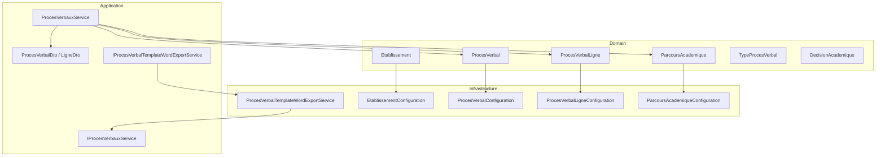
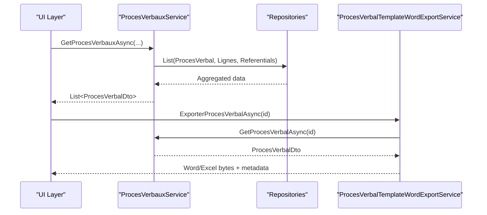
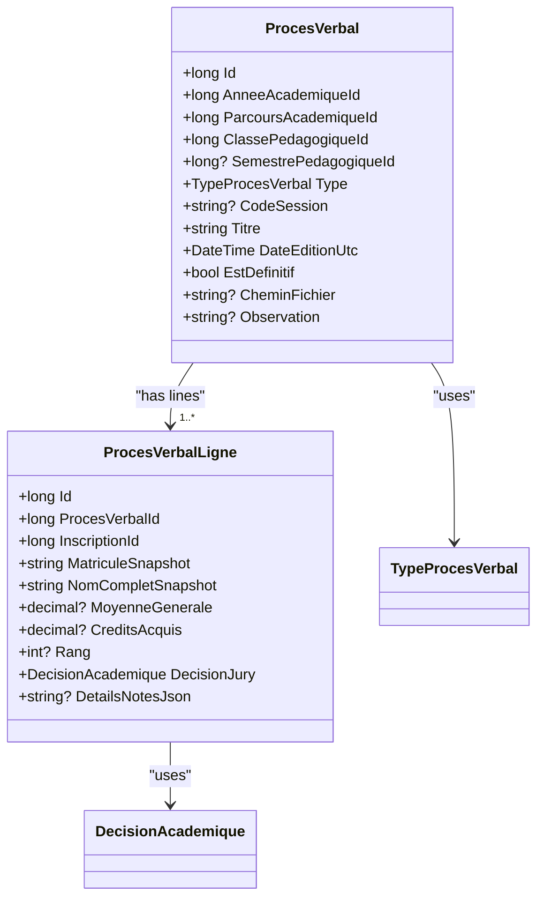
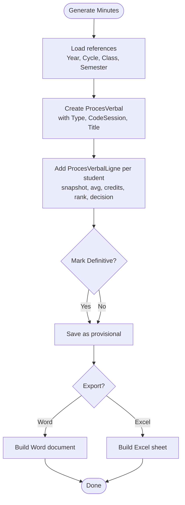
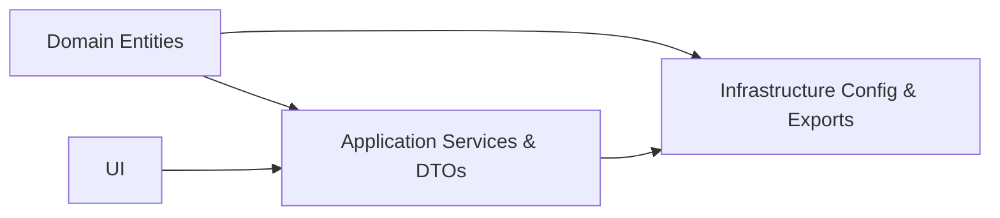

# Supporting Entities

<cite>
**Referenced Files in This Document**
- [Etablissement.cs](file://RIIS.Academic.Domain/Etablissements/Etablissement.cs)
- [ParcoursAcademique.cs](file://RIIS.Academic.Domain/Parcours/ParcoursAcademique.cs)
- [ProcesVerbal.cs](file://RIIS.Academic.Domain/ProcesVerbaux/ProcesVerbal.cs)
- [ProcesVerbalLigne.cs](file://RIIS.Academic.Domain/ProcesVerbaux/ProcesVerbalLigne.cs)
- [TypeProcesVerbal.cs](file://RIIS.Academic.Domain/Enums/TypeProcesVerbal.cs)
- [DecisionAcademique.cs](file://RIIS.Academic.Domain/Enums/DecisionAcademique.cs)
- [EtablissementConfiguration.cs](file://RIIS.Academic.Infrastructure/Persistence/Configurations/Etablissements/EtablissementConfiguration.cs)
- [ParcoursAcademiqueConfiguration.cs](file://RIIS.Academic.Infrastructure/Persistence/Configurations/Parcours/ParcoursAcademiqueConfiguration.cs)
- [ProcesVerbalConfiguration.cs](file://RIIS.Academic.Infrastructure/Persistence/Configurations/ProcesVerbaux/ProcesVerbalConfiguration.cs)
- [ProcesVerbalLigneConfiguration.cs](file://RIIS.Academic.Infrastructure/Persistence/Configurations/ProcesVerbaux/ProcesVerbalLigneConfiguration.cs)
- [ParcoursAcademiqueDto.cs](file://RIIS.Academic.Application/Referentiels/Dtos/ParcoursAcademiqueDto.cs)
- [ProcesVerbalDto.cs](file://RIIS.Academic.Application/ProcesVerbaux/Dtos/ProcesVerbalDto.cs)
- [ProcesVerbalLigneDto.cs](file://RIIS.Academic.Application/ProcesVerbaux/Dtos/ProcesVerbalLigneDto.cs)
- [ProcesVerbalWordExportDto.cs](file://RIIS.Academic.Application/ProcesVerbaux/Dtos/ProcesVerbalWordExportDto.cs)
- [ProcesVerbalExcelExportDto.cs](file://RIIS.Academic.Application/ProcesVerbaux/Dtos/ProcesVerbalExcelExportDto.cs)
- [IProcesVerbauxService.cs](file://RIIS.Academic.Application/ProcesVerbaux/Services/IProcesVerbauxService.cs)
- [ProcesVerbauxService.cs](file://RIIS.Academic.Application/ProcesVerbaux/Services/ProcesVerbauxService.cs)
- [IProcesVerbalTemplateWordExportService.cs](file://RIIS.Academic.Application/ProcesVerbaux/Services/IProcesVerbalTemplateWordExportService.cs)
- [ProcesVerbalTemplateWordExportService.cs](file://RIIS.Academic.Infrastructure/Documents/ProcesVerbalTemplateWordExportService.cs)
- [DependencyInjection.cs](file://RIIS.Academic.Infrastructure/DependencyInjection.cs)
</cite>

## Table of Contents
1. Introduction
2. Project Structure
3. Core Components
4. Architecture Overview
5. Detailed Component Analysis
6. Dependency Analysis
7. Performance Considerations
8. Troubleshooting Guide
9. Conclusion

## Introduction
This document explains the supporting domain entities that provide essential functionality across academic operations:
- Etablissement (Institution): Captures official institutional information used to brand and contextualize documents and reports.
- ParcoursAcademique (Academic Path): Represents a specific study path within an academic year, linking cycles, levels, fields, and specialties; it anchors student progression and class organization.
- ProcesVerbal and ProcesVerbalLigne (Meeting Minutes/Jury Records): Record official decisions for sessions, including per-student outcomes, averages, credits, and rankings.

These entities integrate with programs, classes, evaluations, and referential data to support institution management, academic path tracking, and official document generation (Word/Excel).

## Project Structure
The supporting entities are defined in the Domain layer, configured in Infrastructure, exposed via Application services and DTOs, and consumed by UI and export features.

**Diagram sources**
- [Etablissement.cs:1-24](file://RIIS.Academic.Domain/Etablissements/Etablissement.cs#L1-L24)
- [ParcoursAcademique.cs:1-24](file://RIIS.Academic.Domain/Parcours/ParcoursAcademique.cs#L1-L24)
- [ProcesVerbal.cs:1-24](file://RIIS.Academic.Domain/ProcesVerbaux/ProcesVerbal.cs#L1-L24)
- [ProcesVerbalLigne.cs:1-19](file://RIIS.Academic.Domain/ProcesVerbaux/ProcesVerbalLigne.cs#L1-L19)
- [TypeProcesVerbal.cs:1-10](file://RIIS.Academic.Domain/Enums/TypeProcesVerbal.cs#L1-L10)
- [DecisionAcademique.cs:1-10](file://RIIS.Academic.Domain/Enums/DecisionAcademique.cs#L1-L10)
- [EtablissementConfiguration.cs:1-50](file://RIIS.Academic.Infrastructure/Persistence/Configurations/Etablissements/EtablissementConfiguration.cs#L1-L50)
- [ParcoursAcademiqueConfiguration.cs:1-41](file://RIIS.Academic.Infrastructure/Persistence/Configurations/Parcours/ParcoursAcademiqueConfiguration.cs#L1-L41)
- [ProcesVerbalConfiguration.cs:1-37](file://RIIS.Academic.Infrastructure/Persistence/Configurations/ProcesVerbaux/ProcesVerbalConfiguration.cs#L1-L37)
- [ProcesVerbalLigneConfiguration.cs:1-29](file://RIIS.Academic.Infrastructure/Persistence/Configurations/ProcesVerbaux/ProcesVerbalLigneConfiguration.cs#L1-L29)
- [ProcesVerbauxService.cs:1-32](file://RIIS.Academic.Application/ProcesVerbaux/Services/ProcesVerbauxService.cs#L1-L32)
- [ProcesVerbalDto.cs:1-41](file://RIIS.Academic.Application/ProcesVerbaux/Dtos/ProcesVerbalDto.cs#L1-L41)
- [ProcesVerbalLigneDto.cs:1-25](file://RIIS.Academic.Application/ProcesVerbaux/Dtos/ProcesVerbalLigneDto.cs#L1-L25)
- [IProcesVerbauxService.cs:1-30](file://RIIS.Academic.Application/ProcesVerbaux/Services/IProcesVerbauxService.cs#L1-L30)
- [IProcesVerbalTemplateWordExportService.cs:1-10](file://RIIS.Academic.Application/ProcesVerbaux/Services/IProcesVerbalTemplateWordExportService.cs#L1-L10)
- [ProcesVerbalTemplateWordExportService.cs:1-39](file://RIIS.Academic.Infrastructure/Documents/ProcesVerbalTemplateWordExportService.cs#L1-L39)

**Section sources**
- [Etablissement.cs:1-24](file://RIIS.Academic.Domain/Etablissements/Etablissement.cs#L1-L24)
- [ParcoursAcademique.cs:1-24](file://RIIS.Academic.Domain/Parcours/ParcoursAcademique.cs#L1-L24)
- [ProcesVerbal.cs:1-24](file://RIIS.Academic.Domain/ProcesVerbaux/ProcesVerbal.cs#L1-L24)
- [ProcesVerbalLigne.cs:1-19](file://RIIS.Academic.Domain/ProcesVerbaux/ProcesVerbalLigne.cs#L1-L19)
- [EtablissementConfiguration.cs:1-50](file://RIIS.Academic.Infrastructure/Persistence/Configurations/Etablissements/EtablissementConfiguration.cs#L1-L50)
- [ParcoursAcademiqueConfiguration.cs:1-41](file://RIIS.Academic.Infrastructure/Persistence/Configurations/Parcours/ParcoursAcademiqueConfiguration.cs#L1-L41)
- [ProcesVerbalConfiguration.cs:1-37](file://RIIS.Academic.Infrastructure/Persistence/Configurations/ProcesVerbaux/ProcesVerbalConfiguration.cs#L1-L37)
- [ProcesVerbalLigneConfiguration.cs:1-29](file://RIIS.Academic.Infrastructure/Persistence/Configurations/ProcesVerbaux/ProcesVerbalLigneConfiguration.cs#L1-L29)
- [ProcesVerbauxService.cs:1-32](file://RIIS.Academic.Application/ProcesVerbaux/Services/ProcesVerbauxService.cs#L1-L32)
- [ProcesVerbalDto.cs:1-41](file://RIIS.Academic.Application/ProcesVerbaux/Dtos/ProcesVerbalDto.cs#L1-L41)
- [ProcesVerbalLigneDto.cs:1-25](file://RIIS.Academic.Application/ProcesVerbaux/Dtos/ProcesVerbalLigneDto.cs#L1-L25)
- [IProcesVerbauxService.cs:1-30](file://RIIS.Academic.Application/ProcesVerbaux/Services/IProcesVerbauxService.cs#L1-L30)
- [IProcesVerbalTemplateWordExportService.cs:1-10](file://RIIS.Academic.Application/ProcesVerbaux/Services/IProcesVerbalTemplateWordExportService.cs#L1-L10)
- [ProcesVerbalTemplateWordExportService.cs:1-39](file://RIIS.Academic.Infrastructure/Documents/ProcesVerbalTemplateWordExportService.cs#L1-L39)

## Core Components
- Etablissement: Stores official name, legal identifiers, contact details, location, social links, address, logo URL, and active status. Used as institutional context for branding and reporting.
- ParcoursAcademique: Identifies a study path by code and label, bound to an academic year, cycle, level, field, and specialty. Links to inscriptions, pedagogical classes, and meeting minutes.
- ProcesVerbal: Represents an official session record tied to an academic year, study path, pedagogical class, optional semester, and session type/code. Tracks whether it is definitive and stores file paths or observations.
- ProcesVerbalLigne: Per-student line item capturing snapshot identifiers, average, credits acquired, rank, jury decision, and detailed notes JSON.

These components together enable:
- Institution management (branding, contacts, legal info)
- Academic path tracking (yearly program structure and enrollment linkage)
- Official documentation (jury records and exports)

**Section sources**
- [Etablissement.cs:1-24](file://RIIS.Academic.Domain/Etablissements/Etablissement.cs#L1-L24)
- [ParcoursAcademique.cs:1-24](file://RIIS.Academic.Domain/Parcours/ParcoursAcademique.cs#L1-L24)
- [ProcesVerbal.cs:1-24](file://RIIS.Academic.Domain/ProcesVerbaux/ProcesVerbal.cs#L1-L24)
- [ProcesVerbalLigne.cs:1-19](file://RIIS.Academic.Domain/ProcesVerbaux/ProcesVerbalLigne.cs#L1-L19)

## Architecture Overview
The system follows clean architecture layers:
- Domain defines entities and enums.
- Infrastructure configures persistence and provides document export implementations.
- Application exposes services and DTOs for querying and exporting.
- UI consumes services to manage institutions, track academic paths, and generate official documents.

**Diagram sources**
- [ProcesVerbauxService.cs:1-32](file://RIIS.Academic.Application/ProcesVerbaux/Services/ProcesVerbauxService.cs#L1-L32)
- [IProcesVerbauxService.cs:1-30](file://RIIS.Academic.Application/ProcesVerbaux/Services/IProcesVerbauxService.cs#L1-L30)
- [ProcesVerbalTemplateWordExportService.cs:1-39](file://RIIS.Academic.Infrastructure/Documents/ProcesVerbalTemplateWordExportService.cs#L1-L39)
- [ProcesVerbalDto.cs:1-41](file://RIIS.Academic.Application/ProcesVerbaux/Dtos/ProcesVerbalDto.cs#L1-L41)

## Detailed Component Analysis

### Etablissement (Institution)
Purpose:
- Centralizes institutional identity and contact data used across the system for branding and official communications.

Key aspects:
- Official name, acronym, legal IDs, banking info, phone numbers, postal box, city/country, email, social media, address, logo URL, active flag.
- Unique index on acronym when present to avoid duplicates.
- Seed data provided for initial setup.

Integration points:
- Used implicitly by document templates and exports to include institution branding and contact details.
- Configured in EF Core with constraints and seed data.

Example usage scenarios:
- Display institution header/footer in exported Word/Excel documents.
- Show institutional contact information on dashboards and reports.

**Section sources**
- [Etablissement.cs:1-24](file://RIIS.Academic.Domain/Etablissements/Etablissement.cs#L1-L24)
- [EtablissementConfiguration.cs:1-50](file://RIIS.Academic.Infrastructure/Persistence/Configurations/Etablissements/EtablissementConfiguration.cs#L1-L50)

### ParcoursAcademique (Academic Path)
Purpose:
- Models a specific study path within an academic year, combining cycle, level, field, and specialty into a unique, queryable unit.

Key aspects:
- Code and label uniquely identify the path.
- Foreign keys to academic year, cycle, level, field, specialty.
- Relationships to inscriptions, pedagogical classes, and meeting minutes.
- Unique indexes ensure data integrity and efficient lookups.

Integration points:
- Drives filtering and grouping of classes, evaluations, and minutes by study path.
- Provides context for generating minutes per class/semester combination.

Example usage scenarios:
- List available study paths for a given academic year.
- Filter students and classes by study path.
- Generate minutes scoped to a specific study path.

**Section sources**
- [ParcoursAcademique.cs:1-24](file://RIIS.Academic.Domain/Parcours/ParcoursAcademique.cs#L1-L24)
- [ParcoursAcademiqueConfiguration.cs:1-41](file://RIIS.Academic.Infrastructure/Persistence/Configurations/Parcours/ParcoursAcademiqueConfiguration.cs#L1-L41)
- [ParcoursAcademiqueDto.cs:1-25](file://RIIS.Academic.Application/Referentiels/Dtos/ParcoursAcademiqueDto.cs#L1-L25)

### ProcesVerbal and ProcesVerbalLigne (Meeting Minutes)
Purpose:
- Capture official jury decisions for a session, including per-student outcomes and aggregates.

Key aspects:
- ProcesVerbal ties to academic year, study path, pedagogical class, optional semester, session type/code, title, date, definitiveness, file path, and observation.
- ProcesVerbalLigne captures per-student snapshot identifiers, average, credits, rank, jury decision, and detailed notes JSON.
- Enums define session types and academic decisions.
- Unique composite indexes optimize queries and enforce uniqueness.

Integration points:
- Application service aggregates data from multiple repositories to build DTOs for UI and exports.
- Export services produce Word/Excel files using DTOs.

Example usage scenarios:
- Query minutes by academic year, cycle, class, semester, and type.
- Generate official Word/Excel documents for a session.
- Track student outcomes and compute aggregates.

**Diagram sources**
- [ProcesVerbal.cs:1-24](file://RIIS.Academic.Domain/ProcesVerbaux/ProcesVerbal.cs#L1-L24)
- [ProcesVerbalLigne.cs:1-19](file://RIIS.Academic.Domain/ProcesVerbaux/ProcesVerbalLigne.cs#L1-L19)
- [TypeProcesVerbal.cs:1-10](file://RIIS.Academic.Domain/Enums/TypeProcesVerbal.cs#L1-L10)
- [DecisionAcademique.cs:1-10](file://RIIS.Academic.Domain/Enums/DecisionAcademique.cs#L1-L10)

**Diagram sources**
- [ProcesVerbauxService.cs:1-32](file://RIIS.Academic.Application/ProcesVerbaux/Services/ProcesVerbauxService.cs#L1-L32)
- [ProcesVerbalConfiguration.cs:1-37](file://RIIS.Academic.Infrastructure/Persistence/Configurations/ProcesVerbaux/ProcesVerbalConfiguration.cs#L1-L37)
- [ProcesVerbalLigneConfiguration.cs:1-29](file://RIIS.Academic.Infrastructure/Persistence/Configurations/ProcesVerbaux/ProcesVerbalLigneConfiguration.cs#L1-L29)

**Section sources**
- [ProcesVerbal.cs:1-24](file://RIIS.Academic.Domain/ProcesVerbaux/ProcesVerbal.cs#L1-L24)
- [ProcesVerbalLigne.cs:1-19](file://RIIS.Academic.Domain/ProcesVerbaux/ProcesVerbalLigne.cs#L1-L19)
- [TypeProcesVerbal.cs:1-10](file://RIIS.Academic.Domain/Enums/TypeProcesVerbal.cs#L1-L10)
- [DecisionAcademique.cs:1-10](file://RIIS.Academic.Domain/Enums/DecisionAcademique.cs#L1-L10)
- [ProcesVerbauxService.cs:1-32](file://RIIS.Academic.Application/ProcesVerbaux/Services/ProcesVerbauxService.cs#L1-L32)
- [ProcesVerbalConfiguration.cs:1-37](file://RIIS.Academic.Infrastructure/Persistence/Configurations/ProcesVerbaux/ProcesVerbalConfiguration.cs#L1-L37)
- [ProcesVerbalLigneConfiguration.cs:1-29](file://RIIS.Academic.Infrastructure/Persistence/Configurations/ProcesVerbaux/ProcesVerbalLigneConfiguration.cs#L1-L29)

### Official Document Generation (Word/Excel)
Purpose:
- Produce official Word and Excel exports for meeting minutes using DTOs.

Key aspects:
- Interfaces define export contracts returning filename, content type, and byte arrays.
- Template-based Word export reads a template, fills it with DTO data, and returns binary content.
- Excel export similarly builds spreadsheet content from DTOs.

Example usage scenarios:
- Download a Word document for a specific session ID.
- Export a spreadsheet summary of all lines for analysis.

**Section sources**
- [IProcesVerbalTemplateWordExportService.cs:1-10](file://RIIS.Academic.Application/ProcesVerbaux/Services/IProcesVerbalTemplateWordExportService.cs#L1-L10)
- [ProcesVerbalTemplateWordExportService.cs:1-39](file://RIIS.Academic.Infrastructure/Documents/ProcesVerbalTemplateWordExportService.cs#L1-L39)
- [ProcesVerbalWordExportDto.cs:1-8](file://RIIS.Academic.Application/ProcesVerbaux/Dtos/ProcesVerbalWordExportDto.cs#L1-L8)
- [ProcesVerbalExcelExportDto.cs:1-8](file://RIIS.Academic.Application/ProcesVerbaux/Dtos/ProcesVerbalExcelExportDto.cs#L1-L8)

## Dependency Analysis
- Domain entities depend only on core enums and other domain entities where relationships exist.
- Infrastructure depends on Domain to configure EF mappings and implement document exports.
- Application depends on Domain and Infrastructure abstractions to orchestrate queries and exports.

**Diagram sources**
- [DependencyInjection.cs:28-49](file://RIIS.Academic.Infrastructure/DependencyInjection.cs#L28-L49)
- [ProcesVerbauxService.cs:1-32](file://RIIS.Academic.Application/ProcesVerbaux/Services/ProcesVerbauxService.cs#L1-L32)

**Section sources**
- [DependencyInjection.cs:28-49](file://RIIS.Academic.Infrastructure/DependencyInjection.cs#L28-L49)

## Performance Considerations
- Use unique composite indexes on ParcoursAcademique and ProcesVerbal to speed up filtered queries and enforce uniqueness.
- Prefer DTOs for read-heavy operations to reduce over-fetching of related entities.
- When exporting large datasets, stream content where possible and avoid loading unnecessary navigation properties.
- Cache lookup lists (academic years, cycles, classes, semesters) at the application boundary if frequently accessed.

[No sources needed since this section provides general guidance]

## Troubleshooting Guide
Common issues and resolutions:
- Duplicate study paths: Ensure codes are unique per academic year and that composite uniqueness constraints are respected.
- Missing session data: Verify that all required references (academic year, cycle, class, semester) are set before creating minutes.
- Export failures: Confirm that DTOs contain required fields and that templates resolve correctly.
- Data integrity: Check foreign key relationships between minutes and inscriptions; ensure student snapshots match current records.

Operational tips:
- Validate inputs at the service layer before persisting.
- Log errors during export pipeline steps to pinpoint failures.
- Use database constraints to prevent invalid states.

[No sources needed since this section provides general guidance]

## Conclusion
Etablissement, ParcoursAcademique, and ProcesVerbal/ProcesVerbalLigne form the backbone for institutional context, academic path management, and official documentation. Together with robust configurations, services, and export capabilities, they enable reliable institution management, precise tracking of student progression, and authoritative generation of meeting minutes in multiple formats.

[No sources needed since this section summarizes without analyzing specific files]