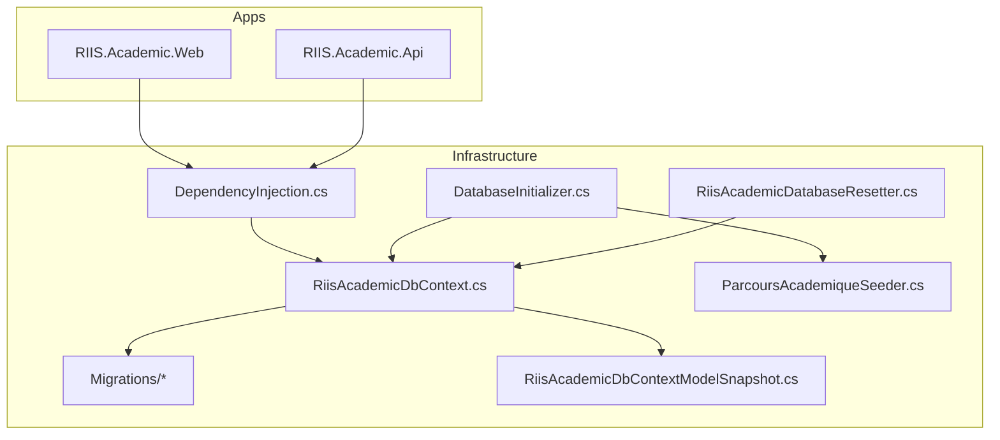
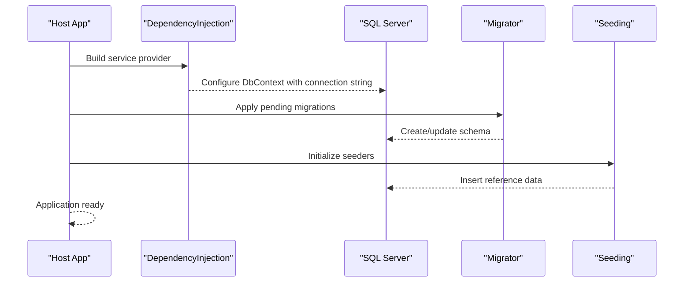
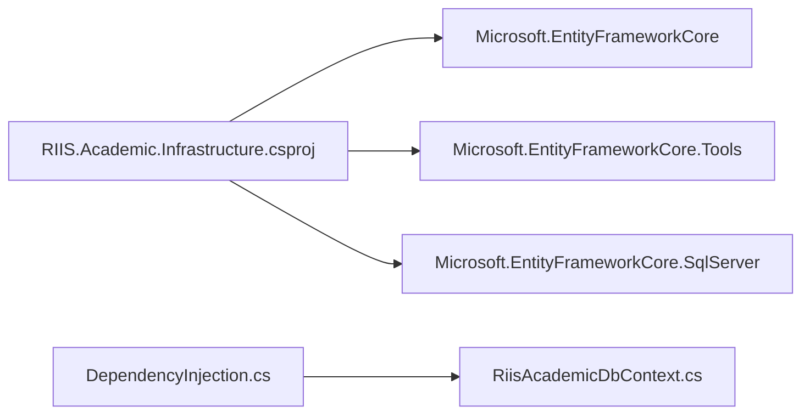

# Database Migrations

<cite>
**Referenced Files in This Document**
- [RiisAcademicDbContext.cs](file://RIIS.Academic.Infrastructure/Persistence/RiisAcademicDbContext.cs)
- [20260814000042_InitialCreate.cs](file://RIIS.Academic.Infrastructure/Persistence/Migrations/20260814000042_InitialCreate.cs)
- [RiisAcademicDbContextModelSnapshot.cs](file://RIIS.Academic.Infrastructure/Persistence/Migrations/RiisAcademicDbContextModelSnapshot.cs)
- [DependencyInjection.cs](file://RIIS.Academic.Infrastructure/DependencyInjection.cs)
- [DatabaseInitializer.cs](file://RIIS.Academic.Infrastructure/Persistence/DatabaseInitializer.cs)
- [ParcoursAcademiqueSeeder.cs](file://RIIS.Academic.Infrastructure/Persistence/Seeders/ParcoursAcademiqueSeeder.cs)
- [RiisAcademicDatabaseResetter.cs](file://RIIS.Academic.Infrastructure/Persistence/RiisAcademicDatabaseResetter.cs)
- [RIIS.Academic.Infrastructure.csproj](file://RIIS.Academic.Infrastructure/RIIS.Academic.Infrastructure.csproj)
- [appsettings.json (Web)](file://RIIS.Academic.Web/appsettings.json)
- [appsettings.json (Api)](file://RIIS.Academic.Api/appsettings.json)
</cite>

## Table of Contents
1. Introduction
2. Project Structure
3. Core Components
4. Architecture Overview
5. Detailed Component Analysis
6. Dependency Analysis
7. Performance Considerations
8. Troubleshooting Guide
9. Conclusion

## Introduction
This document explains the Entity Framework Core migration strategy used by the project. It covers the initial migration structure, model snapshot management, and how migrations are applied at runtime. It also provides guidance on creating new migrations, applying them across environments, handling conflicts, adding or modifying entities, performing data transformations, rollback procedures, and production deployment strategies.

## Project Structure
Migrations and related infrastructure live in the Infrastructure layer:
- DbContext and configuration are defined in the Persistence folder.
- EF migrations and the model snapshot are stored under Persistence/Migrations.
- Runtime database initialization and seeding are provided by dedicated services.
- Connection strings are configured per environment via appsettings files and resolved through dependency injection.

**Diagram sources**
- [DependencyInjection.cs:25-34](file://RIIS.Academic.Infrastructure/DependencyInjection.cs#L25-L34)
- [RiisAcademicDbContext.cs:6-49](file://RIIS.Academic.Infrastructure/Persistence/RiisAcademicDbContext.cs#L6-L49)
- [DatabaseInitializer.cs:8-21](file://RIIS.Academic.Infrastructure/Persistence/DatabaseInitializer.cs#L8-L21)
- [ParcoursAcademiqueSeeder.cs:51-118](file://RIIS.Academic.Infrastructure/Persistence/Seeders/ParcoursAcademiqueSeeder.cs#L51-L118)
- [RiisAcademicDatabaseResetter.cs:7-63](file://RIIS.Academic.Infrastructure/Persistence/RiisAcademicDatabaseResetter.cs#L7-L63)

**Section sources**
- [DependencyInjection.cs:25-34](file://RIIS.Academic.Infrastructure/DependencyInjection.cs#L25-L34)
- [RiisAcademicDbContext.cs:6-49](file://RIIS.Academic.Infrastructure/Persistence/RiisAcademicDbContext.cs#L6-L49)
- [RIIS.Academic.Infrastructure.csproj:8-18](file://RIIS.Academic.Infrastructure/RIIS.Academic.Infrastructure.csproj#L8-L18)
- [appsettings.json (Web):2-6](file://RIIS.Academic.Web/appsettings.json#L2-L6)
- [appsettings.json (Api):3-5](file://RIIS.Academic.Api/appsettings.json#L3-L5)

## Core Components
- RiisAcademicDbContext: Declares all DbSets and applies entity configurations from assembly.
- Initial migration: Creates the full schema with tables, constraints, and relationships.
- Model snapshot: Captures the current model state for EF to compute diffs.
- DependencyInjection: Registers DbContext with SQL Server provider and resolves connection string based on environment.
- DatabaseInitializer: Applies pending migrations and seeds reference data at startup.
- ParcoursAcademiqueSeeder: Populates academic pathways based on existing references.
- RiisAcademicDatabaseResetter: Safely clears non-referential data for development/testing scenarios.

**Section sources**
- [RiisAcademicDbContext.cs:6-49](file://RIIS.Academic.Infrastructure/Persistence/RiisAcademicDbContext.cs#L6-L49)
- [20260814000042_InitialCreate.cs:11-800](file://RIIS.Academic.Infrastructure/Persistence/Migrations/20260814000042_InitialCreate.cs#L11-L800)
- [RiisAcademicDbContextModelSnapshot.cs:13-24](file://RIIS.Academic.Infrastructure/Persistence/Migrations/RiisAcademicDbContextModelSnapshot.cs#L13-L24)
- [DependencyInjection.cs:25-34](file://RIIS.Academic.Infrastructure/DependencyInjection.cs#L25-L34)
- [DatabaseInitializer.cs:8-21](file://RIIS.Academic.Infrastructure/Persistence/DatabaseInitializer.cs#L8-L21)
- [ParcoursAcademiqueSeeder.cs:51-118](file://RIIS.Academic.Infrastructure/Persistence/Seeders/ParcoursAcademiqueSeeder.cs#L51-L118)
- [RiisAcademicDatabaseResetter.cs:7-63](file://RIIS.Academic.Infrastructure/Persistence/RiisAcademicDatabaseResetter.cs#L7-L63)

## Architecture Overview
The application uses EF Core migrations to evolve the database schema. At runtime, the web/api host initializes the database by applying any pending migrations and then seeding required reference data. The model snapshot ensures EF can generate accurate incremental migrations when models change.

**Diagram sources**
- [DependencyInjection.cs:25-34](file://RIIS.Academic.Infrastructure/DependencyInjection.cs#L25-L34)
- [DatabaseInitializer.cs:8-21](file://RIIS.Academic.Infrastructure/Persistence/DatabaseInitializer.cs#L8-L21)
- [appsettings.json (Web):2-6](file://RIIS.Academic.Web/appsettings.json#L2-L6)

## Detailed Component Analysis

### DbContext and Configuration
- The context exposes strongly typed DbSets for all domain entities.
- OnModelCreating applies all Fluent API configurations from the assembly, centralizing mapping rules.

Best practices observed:
- Centralized configuration via assembly scanning simplifies maintenance.
- Strongly typed DbSets improve discoverability and testability.

**Section sources**
- [RiisAcademicDbContext.cs:6-49](file://RIIS.Academic.Infrastructure/Persistence/RiisAcademicDbContext.cs#L6-L49)

### Initial Migration Structure
- The initial migration creates the complete schema, including tables, primary keys, foreign keys, check constraints, and indexes.
- It reflects the current model snapshot and serves as the baseline for future changes.

Key aspects:
- Consistent identity columns and types aligned with SQL Server.
- Business rules enforced via check constraints.
- Relationships explicitly modeled with foreign keys and cascade behaviors.

**Section sources**
- [20260814000042_InitialCreate.cs:11-800](file://RIIS.Academic.Infrastructure/Persistence/Migrations/20260814000042_InitialCreate.cs#L11-L800)

### Model Snapshot Management
- The model snapshot captures the exact shape of the model at a point in time.
- EF uses this snapshot to compute differences between the current model and the last migration, enabling accurate Up/Down operations.

Operational notes:
- Always keep the snapshot committed alongside code changes.
- Regenerate the snapshot after adding/modifying entities or configurations.

**Section sources**
- [RiisAcademicDbContextModelSnapshot.cs:13-24](file://RIIS.Academic.Infrastructure/Persistence/Migrations/RiisAcademicDbContextModelSnapshot.cs#L13-L24)

### Migration History Tracking
- EF tracks applied migrations in the database’s built-in history table.
- The migrator compares the snapshot and current model against recorded migrations to determine what to apply.

Implications:
- Do not manually edit history rows.
- Use EF tools to add/apply/reverse migrations safely.

[No sources needed since this section explains general EF behavior without analyzing specific files]

### Creating New Migrations
When you add or modify an entity or its configuration:
1. Update the domain model or Fluent configuration.
2. Generate a new migration to capture the diff against the snapshot.
3. Review the generated Up/Down methods before applying.
4. Apply the migration to target environments.

Recommended workflow:
- Create small, focused migrations per change.
- Include data migrations within the same migration if they are tightly coupled to schema changes.
- Test migrations locally before promoting to higher environments.

[No sources needed since this section provides general guidance]

### Applying Migrations to Different Environments
- The application calls the migrator at startup to apply pending migrations automatically.
- Connection strings vary per environment; ensure each environment points to the correct database.

Environment resolution:
- The infrastructure resolves the connection name based on an environment variable and selects the appropriate connection string.

Deployment steps:
- Ensure the target database exists and is reachable.
- Start the application so it applies pending migrations automatically.
- Verify that seeding runs successfully afterward.

**Section sources**
- [DependencyInjection.cs:25-34](file://RIIS.Academic.Infrastructure/DependencyInjection.cs#L25-L34)
- [DependencyInjection.cs:63-73](file://RIIS.Academic.Infrastructure/DependencyInjection.cs#L63-L73)
- [DatabaseInitializer.cs:8-21](file://RIIS.Academic.Infrastructure/Persistence/DatabaseInitializer.cs#L8-L21)
- [appsettings.json (Web):2-6](file://RIIS.Academic.Web/appsettings.json#L2-L6)

### Handling Migration Conflicts
Common causes:
- Multiple developers generating migrations concurrently.
- Manual edits to migrations or snapshot mismatches.
- Applying migrations out of order.

Resolution steps:
- Merge conflicting migrations into a single coherent migration.
- Rebase branches and regenerate migrations if necessary.
- Validate the snapshot matches the current model before applying.
- In production, prefer scripted deployments and avoid interactive tooling.

[No sources needed since this section provides general guidance]

### Adding New Entities
To add a new entity:
- Define the entity class in the Domain layer.
- Add Fluent configuration or annotations in the Infrastructure layer.
- Generate a migration to create the table and relationships.
- If the entity requires initial data, include a data seed in the migration or use a seeder.

Validation:
- Confirm the generated migration includes proper constraints and indexes.
- Run the application to verify schema creation and seeding.

[No sources needed since this section provides general guidance]

### Modifying Existing Schemas
For schema changes:
- Modify the entity or configuration.
- Generate a migration to alter tables, columns, or constraints.
- For breaking changes, write careful Up/Down logic and consider data transformation scripts.

Data safety:
- Back up databases before running destructive changes.
- Use transactions where supported to maintain consistency.
- Test migrations against realistic data volumes.

[No sources needed since this section provides general guidance]

### Managing Data Transformations During Migrations
Use migrations to transform data when schema changes require it:
- Perform safe, idempotent updates in the Up method.
- Provide corresponding reverse logic in the Down method.
- Avoid long-running operations during peak hours; schedule maintenance windows for large datasets.

Example patterns:
- Populate computed columns or normalize values.
- Split or merge columns while preserving historical data.
- Archive or migrate legacy records to new structures.

[No sources needed since this section provides general guidance]

### Rollback Procedures
- Use EF tools to roll back to a previous migration when safe.
- For production, prefer forward-only migrations with compensating changes rather than destructive rollbacks.
- Keep backups and validate rollback scripts in non-production first.

Caution:
- Some operations cannot be safely reversed; design migrations to be reversible or provide explicit compensation logic.

[No sources needed since this section provides general guidance]

### Deployment Strategies for Production
- Automate migration execution as part of the deployment pipeline.
- Use separate connection strings per environment.
- Apply migrations before releasing application code to avoid version skew.
- Monitor logs for migration errors and have a rollback plan.

Operational tips:
- Lock down direct database access in production.
- Use feature flags to gate risky data changes.
- Validate post-deploy health checks include database connectivity and schema version.

**Section sources**
- [DependencyInjection.cs:63-73](file://RIIS.Academic.Infrastructure/DependencyInjection.cs#L63-L73)
- [DatabaseInitializer.cs:8-21](file://RIIS.Academic.Infrastructure/Persistence/DatabaseInitializer.cs#L8-L21)

## Dependency Analysis
EF Core packages and tools are referenced in the Infrastructure project, enabling migration generation and runtime execution. The DbContext is registered with SQL Server provider and configured using environment-specific connection strings.

**Diagram sources**
- [RIIS.Academic.Infrastructure.csproj:8-18](file://RIIS.Academic.Infrastructure/RIIS.Academic.Infrastructure.csproj#L8-L18)
- [DependencyInjection.cs:25-34](file://RIIS.Academic.Infrastructure/DependencyInjection.cs#L25-L34)
- [RiisAcademicDbContext.cs:6-49](file://RIIS.Academic.Infrastructure/Persistence/RiisAcademicDbContext.cs#L6-L49)

**Section sources**
- [RIIS.Academic.Infrastructure.csproj:8-18](file://RIIS.Academic.Infrastructure/RIIS.Academic.Infrastructure.csproj#L8-L18)
- [DependencyInjection.cs:25-34](file://RIIS.Academic.Infrastructure/DependencyInjection.cs#L25-L34)

## Performance Considerations
- Prefer targeted migrations to minimize downtime.
- Batch data updates in migrations to reduce transaction size.
- Use appropriate indexing strategies in migrations to support query performance.
- Avoid heavy workloads during migration execution windows.

[No sources needed since this section provides general guidance]

## Troubleshooting Guide
Common issues and resolutions:
- Missing connection string: Ensure the environment variable and connection name match the expected configuration.
- Migration conflicts: Reconcile divergent migrations and regenerate as needed.
- Seeding failures: Validate reference data exists before dependent seeding runs.
- Permission errors: Confirm the database user has sufficient privileges.

Utilities available:
- Database reset utility for clearing non-referential data in development or testing.
- Startup initializer that applies migrations and seeds data.

**Section sources**
- [DependencyInjection.cs:63-73](file://RIIS.Academic.Infrastructure/DependencyInjection.cs#L63-L73)
- [DatabaseInitializer.cs:8-21](file://RIIS.Academic.Infrastructure/Persistence/DatabaseInitializer.cs#L8-L21)
- [RiisAcademicDatabaseResetter.cs:7-63](file://RIIS.Academic.Infrastructure/Persistence/RiisAcademicDatabaseResetter.cs#L7-L63)

## Conclusion
The project employs a robust EF Core migration strategy centered around a well-defined DbContext, a comprehensive initial migration, and a maintained model snapshot. Runtime initialization applies pending migrations and seeds essential data, while environment-based configuration supports multiple deployment targets. Following the recommended practices for creating, reviewing, and applying migrations will help maintain schema integrity and enable safe evolution of the database over time.