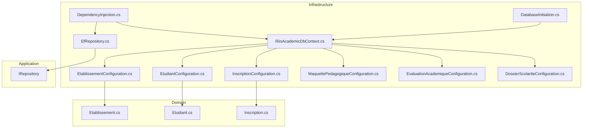
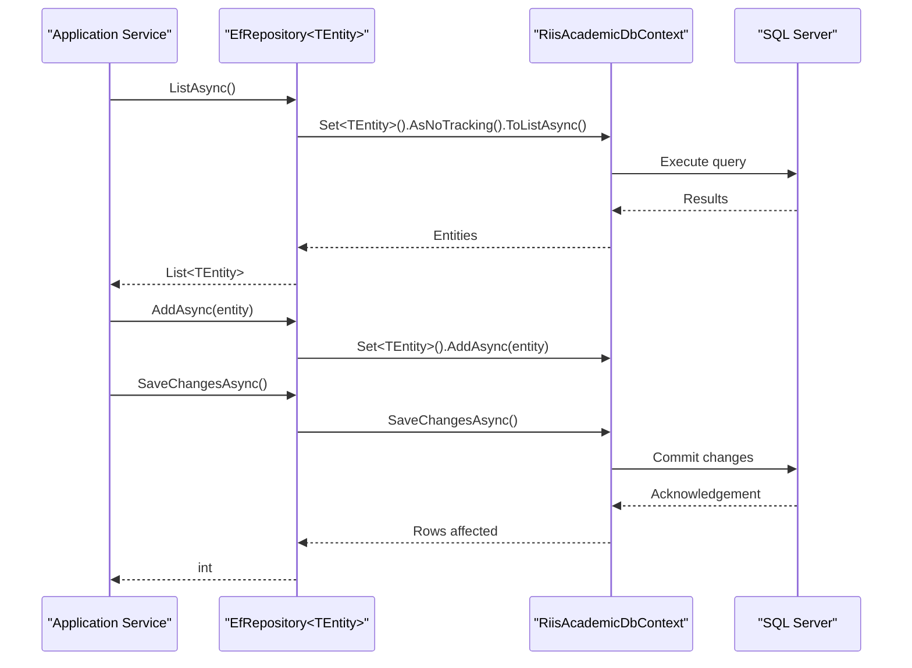
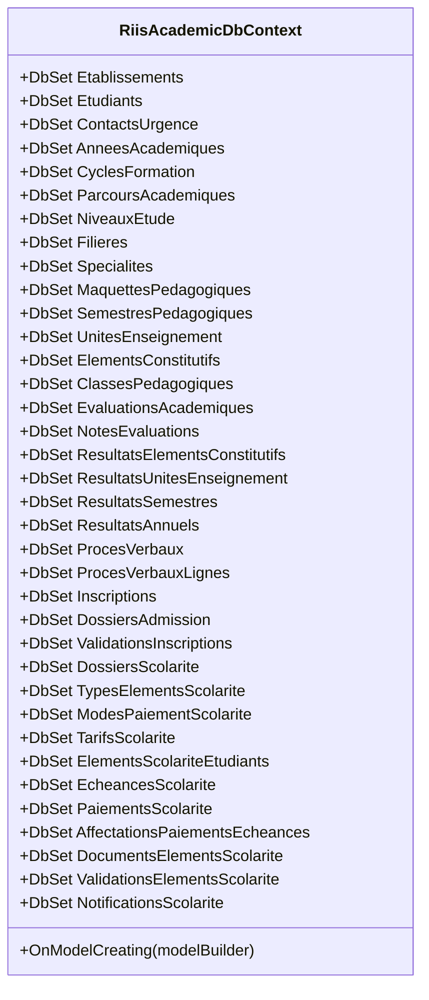
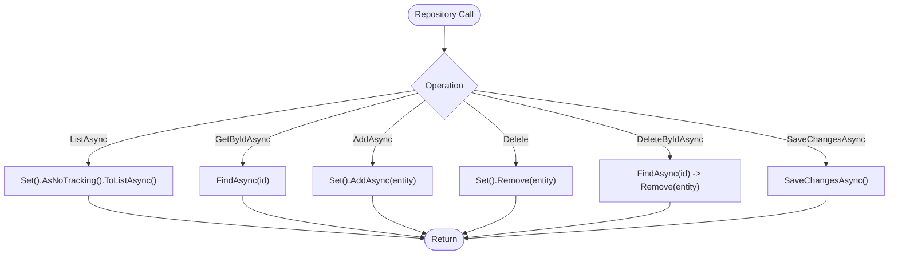
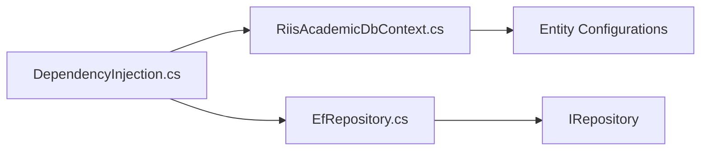

# Database Persistence

<cite>
**Referenced Files in This Document**
- [RiisAcademicDbContext.cs](file://RIIS.Academic.Infrastructure\Persistence\RiisAcademicDbContext.cs)
- [EfRepository.cs](file://RIIS.Academic.Infrastructure\Persistence\Repositories\EfRepository.cs)
- [IRepository.cs](file://RIIS.Academic.Application\Abstractions\Persistence\IRepository.cs)
- [DependencyInjection.cs](file://RIIS.Academic.Infrastructure\DependencyInjection.cs)
- [DatabaseInitializer.cs](file://RIIS.Academic.Infrastructure\Persistence\DatabaseInitializer.cs)
- [EtablissementConfiguration.cs](file://RIIS.Academic.Infrastructure\Persistence\Configurations\Etablissements\EtablissementConfiguration.cs)
- [EtudiantConfiguration.cs](file://RIIS.Academic.Infrastructure\Persistence\Configurations\Etudiants\EtudiantConfiguration.cs)
- [InscriptionConfiguration.cs](file://RIIS.Academic.Infrastructure\Persistence\Configurations\Inscriptions\InscriptionConfiguration.cs)
- [MaquettePedagogiqueConfiguration.cs](file://RIIS.Academic.Infrastructure\Persistence\Configurations\Programmes\MaquettePedagogiqueConfiguration.cs)
- [EvaluationAcademiqueConfiguration.cs](file://RIIS.Academic.Infrastructure\Persistence\Configurations\Notes\EvaluationAcademiqueConfiguration.cs)
- [DossierScolariteConfiguration.cs](file://RIIS.Academic.Infrastructure\Persistence\Configurations\Scolarite\DossierScolariteConfiguration.cs)
- [Etablissement.cs](file://RIIS.Academic.Domain\Etablissements\Etablissement.cs)
- [Etudiant.cs](file://RIIS.Academic.Domain\Etudiants\Etudiant.cs)
- [Inscription.cs](file://RIIS.Academic.Domain\Inscriptions\Inscription.cs)
- [appsettings.json (Web)](file://RIIS.Academic.Web\appsettings.json)
- [appsettings.json (Api)](file://RIIS.Academic.Api\appsettings.json)
</cite>

## Table of Contents
1. Introduction
2. Project Structure
3. Core Components
4. Architecture Overview
5. Detailed Component Analysis
6. Dependency Analysis
7. Performance Considerations
8. Troubleshooting Guide
9. Conclusion

## Introduction
This document explains the database persistence layer built with Entity Framework Core for the Riis Academic system. It covers the DbContext configuration, Fluent API entity mappings and relationships, a generic repository implementation for CRUD operations, the database schema design across key domain models, migration strategy, connection string management, and database initialization. It also provides guidance on common queries, bulk operations, and performance optimization techniques.

## Project Structure
The persistence layer resides in the Infrastructure project and is organized by feature:
- DbContext centralizes all DbSet declarations and applies Fluent API configurations from the assembly.
- Configurations are grouped under Persistence/Configurations by domain area (Etablissements, Etudiants, Inscriptions, Programmes, Notes, Scolarite, etc.).
- A generic EfRepository implements the application’s IRepository abstraction for consistent data access patterns.
- Dependency injection wires up the DbContext, repositories, and services.
- Database initializer runs migrations and seeds initial data.

**Diagram sources**
- [DependencyInjection.cs:25-60](file://RIIS.Academic.Infrastructure\DependencyInjection.cs#L25-L60)
- [RiisAcademicDbContext.cs:6-49](file://RIIS.Academic.Infrastructure\Persistence\RiisAcademicDbContext.cs#L6-L49)
- [EfRepository.cs:6-32](file://RIIS.Academic.Infrastructure\Persistence\Repositories\EfRepository.cs#L6-L32)
- [IRepository.cs:3-11](file://RIIS.Academic.Application\Abstractions\Persistence\IRepository.cs#L3-L11)
- [DatabaseInitializer.cs:6-21](file://RIIS.Academic.Infrastructure\Persistence\DatabaseInitializer.cs#L6-L21)
- [EtablissementConfiguration.cs:6-49](file://RIIS.Academic.Infrastructure\Persistence\Configurations\Etablissements\EtablissementConfiguration.cs#L6-L49)
- [EtudiantConfiguration.cs:6-32](file://RIIS.Academic.Infrastructure\Persistence\Configurations\Etudiants\EtudiantConfiguration.cs#L6-L32)
- [InscriptionConfiguration.cs:6-35](file://RIIS.Academic.Infrastructure\Persistence\Configurations\Inscriptions\InscriptionConfiguration.cs#L6-L35)
- [MaquettePedagogiqueConfiguration.cs:6-36](file://RIIS.Academic.Infrastructure\Persistence\Configurations\Programmes\MaquettePedagogiqueConfiguration.cs#L6-L36)
- [EvaluationAcademiqueConfiguration.cs:6-35](file://RIIS.Academic.Infrastructure\Persistence\Configurations\Notes\EvaluationAcademiqueConfiguration.cs#L6-L35)
- [DossierScolariteConfiguration.cs:7-33](file://RIIS.Academic.Infrastructure\Persistence\Configurations\Scolarite\DossierScolariteConfiguration.cs#L7-L33)
- [Etablissement.cs:3-23](file://RIIS.Academic.Domain\Etablissements\Etablissement.cs#L3-L23)
- [Etudiant.cs:3-27](file://RIIS.Academic.Domain\Etudiants\Etudiant.cs#L3-L27)
- [Inscription.cs:3-36](file://RIIS.Academic.Domain\Inscriptions\Inscription.cs#L3-L36)

**Section sources**
- [RiisAcademicDbContext.cs:6-49](file://RIIS.Academic.Infrastructure\Persistence\RiisAcademicDbContext.cs#L6-L49)
- [DependencyInjection.cs:25-60](file://RIIS.Academic.Infrastructure\DependencyInjection.cs#L25-L60)

## Core Components
- RiisAcademicDbContext: Declares all entity sets and applies Fluent API configurations via assembly scanning.
- EfRepository<TEntity>: Implements generic read/write operations using EF Core, including AsNoTracking for reads and SaveChangesAsync for commits.
- IRepository<TEntity>: Abstraction defining ListAsync, GetByIdAsync, AddAsync, Delete, DeleteByIdAsync, SaveChangesAsync.
- DependencyInjection: Registers DbContext with SQL Server, binds IRepository<> to EfRepository<>, and registers application services.
- DatabaseInitializer: Runs migrations and seeds reference data at startup.

Key behaviors:
- Reads use AsNoTracking to avoid change tracking overhead.
- Deletes support both entity-based and id-based removal.
- SaveChangesAsync delegates to DbContext for transactional persistence.

**Section sources**
- [RiisAcademicDbContext.cs:6-49](file://RIIS.Academic.Infrastructure\Persistence\RiisAcademicDbContext.cs#L6-L49)
- [EfRepository.cs:6-32](file://RIIS.Academic.Infrastructure\Persistence\Repositories\EfRepository.cs#L6-L32)
- [IRepository.cs:3-11](file://RIIS.Academic.Application\Abstractions\Persistence\IRepository.cs#L3-L11)
- [DependencyInjection.cs:25-60](file://RIIS.Academic.Infrastructure\DependencyInjection.cs#L25-L60)
- [DatabaseInitializer.cs:6-21](file://RIIS.Academic.Infrastructure\Persistence\DatabaseInitializer.cs#L6-L21)

## Architecture Overview
The persistence architecture follows clean separation:
- Application layer defines abstractions (IRepository).
- Infrastructure implements concrete EF Core-based repository and DbContext.
- Domain models define entities and relationships.
- Configurations map domain to relational schema with constraints and indexes.
- Startup wires everything via dependency injection and initializes the database.

**Diagram sources**
- [EfRepository.cs:9-32](file://RIIS.Academic.Infrastructure\Persistence\Repositories\EfRepository.cs#L9-L32)
- [RiisAcademicDbContext.cs:6-49](file://RIIS.Academic.Infrastructure\Persistence\RiisAcademicDbContext.cs#L6-L49)

## Detailed Component Analysis

### RiisAcademicDbContext Configuration
- Declares DbSets for all domain entities across Etablissements, Etudiants, Inscriptions, Programmes, Notes, Scolarite, and Referentiels.
- Applies all Fluent API configurations from the assembly, keeping mapping logic modular and testable.

**Diagram sources**
- [RiisAcademicDbContext.cs:6-49](file://RIIS.Academic.Infrastructure\Persistence\RiisAcademicDbContext.cs#L6-L49)

**Section sources**
- [RiisAcademicDbContext.cs:6-49](file://RIIS.Academic.Infrastructure\Persistence\RiisAcademicDbContext.cs#L6-L49)

### EfRepository Implementation
- Provides generic CRUD operations aligned with IRepository<TEntity>.
- Uses AsNoTracking for list queries to improve performance.
- Supports delete by entity or id, and delegates persistence to SaveChangesAsync.

**Diagram sources**
- [EfRepository.cs:9-32](file://RIIS.Academic.Infrastructure\Persistence\Repositories\EfRepository.cs#L9-L32)

**Section sources**
- [EfRepository.cs:6-32](file://RIIS.Academic.Infrastructure\Persistence\Repositories\EfRepository.cs#L6-L32)
- [IRepository.cs:3-11](file://RIIS.Academic.Application\Abstractions\Persistence\IRepository.cs#L3-L11)

### Database Schema Design and Entity Mappings

#### Etablissements
- Table: Etablissements
- Key: Id
- Constraints: NomOfficiel required; Sigle unique when not null; various string length limits
- Index: Unique filtered index on Sigle
- Seed: Initial institution record included

**Section sources**
- [EtablissementConfiguration.cs:6-49](file://RIIS.Academic.Infrastructure\Persistence\Configurations\Etablissements\EtablissementConfiguration.cs#L6-L49)
- [Etablissement.cs:3-23](file://RIIS.Academic.Domain\Etablissements\Etablissement.cs#L3-L23)

#### Etudiants
- Table: Etudiants
- Key: Id
- Constraints: Matricule unique when not null; Nom/Prenoms/LieuNaissance/Nationalite/TelephonePrincipal required; enums converted to strings; Version row versioning
- Indexes: Unique filtered index on Matricule; non-unique index on Nom

**Section sources**
- [EtudiantConfiguration.cs:6-32](file://RIIS.Academic.Infrastructure\Persistence\Configurations\Etudiants\EtudiantConfiguration.cs#L6-L32)
- [Etudiant.cs:3-27](file://RIIS.Academic.Domain\Etudiants\Etudiant.cs#L3-L27)

#### Inscriptions
- Table: Inscriptions
- Key: Id
- Constraints: Statut enum to string; Version row versioning
- Indexes: Unique composite on (AnneeAcademiqueId, EtudiantId); unique filtered on CodeAdministration
- Relationships:
  - Many-to-one with AnneeAcademique, Etudiant, ParcoursAcademique, NiveauEtude, MaquettePedagogique, ClassePedagogique
  - All foreign keys configured with restrictive delete behavior

**Section sources**
- [InscriptionConfiguration.cs:6-35](file://RIIS.Academic.Infrastructure\Persistence\Configurations\Inscriptions\InscriptionConfiguration.cs#L6-L35)
- [Inscription.cs:3-36](file://RIIS.Academic.Domain\Inscriptions\Inscription.cs#L3-L36)

#### Programmes (MaquettePedagogique)
- Table: MaquettesPedagogiques
- Key: Id
- Constraints: Code, Libelle, Version required; Statum enum to string; SourceDocument/Observation optional
- Index: Unique composite on (CycleFormationId, NiveauEtudeId, FiliereId, SpecialiteId, Code, Version)
- Relationships: Many-to-one with CycleFormation, NiveauEtude, Filiere, Specialite

**Section sources**
- [MaquettePedagogiqueConfiguration.cs:6-36](file://RIIS.Academic.Infrastructure\Persistence\Configurations\Programmes\MaquettePedagogiqueConfiguration.cs#L6-L36)

#### Notes (EvaluationAcademique)
- Table: EvaluationsAcademiques
- Key: Id
- Constraints: Type enum to string; Code/Libelle required; Bareme precision; PonderationPourcentage precision; Check constraint ensuring valid ranges
- Index: Unique composite on (AnneeAcademiqueId, ElementConstitutifId, Type, Numero)
- Relationships: Many-to-one with AnneeAcademique, ElementConstitutif; self-referencing replacement relationship

**Section sources**
- [EvaluationAcademiqueConfiguration.cs:6-35](file://RIIS.Academic.Infrastructure\Persistence\Configurations\Notes\EvaluationAcademiqueConfiguration.cs#L6-L35)

#### Scolarite (DossierScolarite)
- Table: DossiersScolarite
- Key: Id
- Constraints: Redundant descriptive fields for year/cycle/filiere/specialite/niveau; status enums to strings
- Indexes: Unique on InscriptionId; composite index on (AnneeAcademiqueCode, CycleCode, FiliereCode, SpecialiteCode, NiveauNumero)
- Relationship: One-to-one with Inscription (cascade delete)

**Section sources**
- [DossierScolariteConfiguration.cs:7-33](file://RIIS.Academic.Infrastructure\Persistence\Configurations\Scolarite\DossierScolariteConfiguration.cs#L7-L33)

### Migration Strategy
- Migrations are stored under Persistence/Migrations and include an initial creation script and model snapshot.
- At runtime, DatabaseInitializer runs migrations against the target database before seeding data.

Operational notes:
- Use standard EF Core CLI commands to add/update migrations when schema changes occur.
- Ensure the correct connection string is selected based on environment.

**Section sources**
- [DatabaseInitializer.cs:6-21](file://RIIS.Academic.Infrastructure\Persistence\DatabaseInitializer.cs#L6-L21)

### Connection String Management
- Connection string selection is driven by an environment variable envval.
- When envval equals dev, the “RiisSqlServer” connection string is used; otherwise, “OtherConnection”.
- If the chosen connection string is missing, an exception is thrown during startup.

Environment files:
- Web app includes multiple connection strings and sets envval to dev.
- Api app includes a default connection string named RIISAcademic.

**Section sources**
- [DependencyInjection.cs:63-73](file://RIIS.Academic.Infrastructure\DependencyInjection.cs#L63-L73)
- [appsettings.json (Web):1-23](file://RIIS.Academic.Web\appsettings.json#L1-L23)
- [appsettings.json (Api):1-7](file://RIIS.Academic.Api\appsettings.json#L1-L7)

### Database Initialization Processes
- DatabaseInitializer creates a service scope, retrieves RiisAcademicDbContext, runs migrations, and seeds reference data (e.g., academic pathways).
- This ensures the database schema is up-to-date and baseline data exists before handling requests.

**Section sources**
- [DatabaseInitializer.cs:6-21](file://RIIS.Academic.Infrastructure\Persistence\DatabaseInitializer.cs#L6-L21)

## Dependency Analysis
- DependencyInjection registers:
  - RiisAcademicDbContext with SQL Server provider
  - IRepository<> bound to EfRepository<>
  - Application services for each bounded context
- DbContext depends on Fluent API configurations applied from the same assembly.
- Repository depends on DbContext and exposes a stable interface to the application layer.

**Diagram sources**
- [DependencyInjection.cs:25-60](file://RIIS.Academic.Infrastructure\DependencyInjection.cs#L25-L60)
- [RiisAcademicDbContext.cs:6-49](file://RIIS.Academic.Infrastructure\Persistence\RiisAcademicDbContext.cs#L6-L49)
- [EfRepository.cs:6-32](file://RIIS.Academic.Infrastructure\Persistence\Repositories\EfRepository.cs#L6-L32)
- [IRepository.cs:3-11](file://RIIS.Academic.Application\Abstractions\Persistence\IRepository.cs#L3-L11)

**Section sources**
- [DependencyInjection.cs:25-60](file://RIIS.Academic.Infrastructure\DependencyInjection.cs#L25-L60)

## Performance Considerations
- Read-only queries should use AsNoTracking to avoid change tracking overhead. The repository already uses it for ListAsync.
- Prefer specific projections (select only needed columns) when building custom queries to reduce payload size.
- Leverage existing indexes:
  - Unique filtered index on Etablissements.Sigle
  - Unique filtered index on Etudiants.Matricule
  - Composite unique on Inscriptions (AnneeAcademiqueId, EtudiantId)
  - Composite unique on MaquettesPedagogiques (CycleFormationId, NiveauEtudeId, FiliereId, SpecialiteId, Code, Version)
  - Composite unique on EvaluationsAcademiques (AnneeAcademiqueId, ElementConstitutifId, Type, Numero)
  - Unique on DossierScolarite.InscriptionId
- Batch updates/deletes where possible to minimize round trips.
- Avoid loading large graphs eagerly; use explicit loading or projections for related data.
- Use transactions around multi-step writes to ensure consistency.

[No sources needed since this section provides general guidance]

## Troubleshooting Guide
Common issues and resolutions:
- Missing connection string:
  - Symptom: Exception indicating connection string not found.
  - Cause: Environment variable envval selects a connection name that does not exist in configuration.
  - Resolution: Ensure the appropriate connection string exists for the selected environment.

- Migration conflicts:
  - Symptom: Runtime errors during migration execution.
  - Cause: Local model differs from database or pending migrations.
  - Resolution: Apply migrations using EF Core tools; verify model snapshot matches current code.

- Duplicate key violations:
  - Symptom: Integrity constraint exceptions.
  - Cause: Inserting duplicate values for unique columns or composites.
  - Resolution: Validate inputs and leverage existing unique constraints; handle duplicates gracefully in business logic.

- Row version concurrency:
  - Symptom: Concurrency exceptions on update/delete.
  - Cause: Concurrent modifications without proper handling.
  - Resolution: Implement optimistic concurrency checks and user feedback.

**Section sources**
- [DependencyInjection.cs:63-73](file://RIIS.Academic.Infrastructure\DependencyInjection.cs#L63-L73)
- [DatabaseInitializer.cs:6-21](file://RIIS.Academic.Infrastructure\Persistence\DatabaseInitializer.cs#L6-L21)

## Conclusion
The persistence layer is structured around a clear separation of concerns: domain models, Fluent API configurations, a generic repository, and a centralized DbContext. Migrations and seeding are automated at startup, and connection strings are environment-driven. The design supports scalable querying through indexing and AsNoTracking, while maintaining strong referential integrity and validation via Fluent API constraints. For complex scenarios, extend the repository with specialized query methods and consider batching for high-throughput operations.