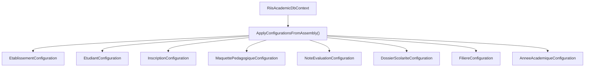
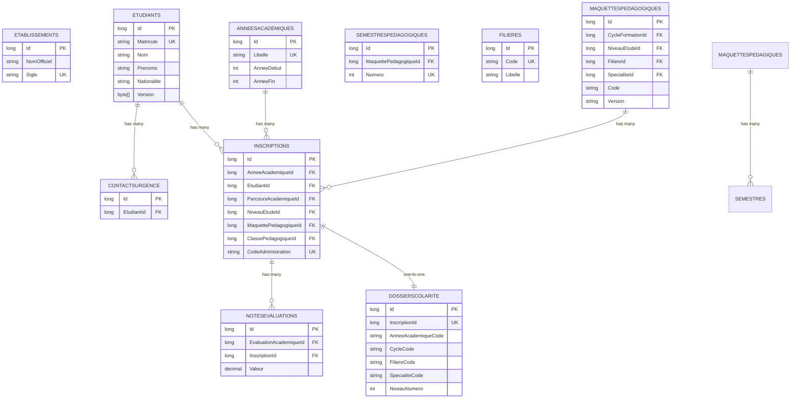
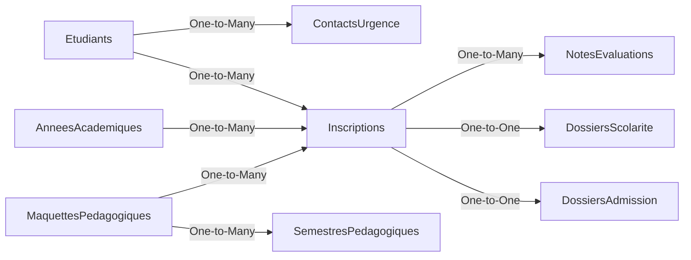

# Entity Configurations

<cite>
**Referenced Files in This Document**
- [RiisAcademicDbContext.cs](file://RIIS.Academic.Infrastructure/Persistence/RiisAcademicDbContext.cs)
- [EtablissementConfiguration.cs](file://RIIS.Academic.Infrastructure/Persistence/Configurations/Etablissements/EtablissementConfiguration.cs)
- [EtudiantConfiguration.cs](file://RIIS.Academic.Infrastructure/Persistence/Configurations/Etudiants/EtudiantConfiguration.cs)
- [ContactUrgenceConfiguration.cs](file://RIIS.Academic.Infrastructure/Persistence/Configurations/Etudiants/ContactUrgenceConfiguration.cs)
- [InscriptionConfiguration.cs](file://RIIS.Academic.Infrastructure/Persistence/Configurations/Inscriptions/InscriptionConfiguration.cs)
- [DossierAdmissionConfiguration.cs](file://RIIS.Academic.Infrastructure/Persistence/Configurations/Inscriptions/DossierAdmissionConfiguration.cs)
- [MaquettePedagogiqueConfiguration.cs](file://RIIS.Academic.Infrastructure/Persistence/Configurations/Programmes/MaquettePedagogiqueConfiguration.cs)
- [SemestrePedagogiqueConfiguration.cs](file://RIIS.Academic.Infrastructure/Persistence/Configurations/Programmes/SemestrePedagogiqueConfiguration.cs)
- [NoteEvaluationConfiguration.cs](file://RIIS.Academic.Infrastructure/Persistence/Configurations/Notes/NoteEvaluationConfiguration.cs)
- [DossierScolariteConfiguration.cs](file://RIIS.Academic.Infrastructure/Persistence/Configurations/Scolarite/DossierScolariteConfiguration.cs)
- [FiliereConfiguration.cs](file://RIIS.Academic.Infrastructure/Persistence/Configurations/Referentiels/FiliereConfiguration.cs)
- [AnneeAcademiqueConfiguration.cs](file://RIIS.Academic.Infrastructure/Persistence/Configurations/Referentiels/AnneeAcademiqueConfiguration.cs)
- [Etablissement.cs](file://RIIS.Academic.Domain/Etablissements/Etablissement.cs)
- [Etudiant.cs](file://RIIS.Academic.Domain/Etudiants/Etudiant.cs)
- [Inscription.cs](file://RIIS.Academic.Domain/Inscriptions/Inscription.cs)
- [MaquettePedagogique.cs](file://RIIS.Academic.Domain/Programmes/MaquettePedagogique.cs)
- [NoteEvaluation.cs](file://RIIS.Academic.Domain/Notes/NoteEvaluation.cs)
- [DossierScolarite.cs](file://RIIS.Academic.Domain/Scolarite/DossierScolarite.cs)
- [Filiere.cs](file://RIIS.Academic.Domain/Referentiels/Filiere.cs)
</cite>

## Table of Contents
1. Introduction
2. Project Structure
3. Core Components
4. Architecture Overview
5. Detailed Component Analysis
6. Dependency Analysis
7. Performance Considerations
8. Troubleshooting Guide
9. Conclusion

## Introduction
This document explains the Entity Framework Fluent API configurations for key domain entities across Etablissements, Etudiants, Inscriptions, Programmes, Notes, Scolarite, and Referentiels. It covers relationship mappings, foreign key constraints, indexing strategies, validation rules (including check constraints), composite keys, and business rule enforcement through configuration. It also provides guidance on maintaining consistency and best practices for database schema design.

## Project Structure
The EF model is configured via per-entity configuration classes that implement IEntityTypeConfiguration<T>. The DbContext applies all configurations from its assembly automatically.

**Diagram sources**
- [RiisAcademicDbContext.cs:46-49](file://RIIS.Academic.Infrastructure/Persistence/RiisAcademicDbContext.cs#L46-L49)

**Section sources**
- [RiisAcademicDbContext.cs:1-51](file://RIIS.Academic.Infrastructure/Persistence/RiisAcademicDbContext.cs#L1-L51)

## Core Components
- Etablissements: Institutional master data with optional unique Sigle index and seed data.
- Etudiants: Student identity with unique Matricule when present; name and contact fields; concurrency token.
- Inscriptions: Enrollment linking student to academic year, program, level, class; unique composite key; administrative code uniqueness.
- Programmes: Academic blueprint (Maquette) uniquely identified by cycle/level/filiere/speciality/code/version; semesters under maquettes.
- Notes: Evaluation scores with value range enforced via check constraint; unique per evaluation+enrollment.
- Scolarite: Financial/administrative dossier per enrollment with denormalized codes/libelles and status flags.
- Referentiels: Reference tables such as Filiere and AnneeAcademique with unique constraints and check constraints.

**Section sources**
- [EtablissementConfiguration.cs:10-28](file://RIIS.Academic.Infrastructure/Persistence/Configurations/Etablissements/EtablissementConfiguration.cs#L10-L28)
- [EtudiantConfiguration.cs:10-32](file://RIIS.Academic.Infrastructure/Persistence/Configurations/Etudiants/EtudiantConfiguration.cs#L10-L32)
- [InscriptionConfiguration.cs:10-34](file://RIIS.Academic.Infrastructure/Persistence/Configurations/Inscriptions/InscriptionConfiguration.cs#L10-L34)
- [MaquettePedagogiqueConfiguration.cs:10-35](file://RIIS.Academic.Infrastructure/Persistence/Configurations/Programmes/MaquettePedagogiqueConfiguration.cs#L10-L35)
- [NoteEvaluationConfiguration.cs:10-27](file://RIIS.Academic.Infrastructure/Persistence/Configurations/Notes/NoteEvaluationConfiguration.cs#L10-L27)
- [DossierScolariteConfiguration.cs:11-32](file://RIIS.Academic.Infrastructure/Persistence/Configurations/Scolarite/DossierScolariteConfiguration.cs#L11-L32)
- [FiliereConfiguration.cs:10-15](file://RIIS.Academic.Infrastructure/Persistence/Configurations/Referentiels/FiliereConfiguration.cs#L10-L15)
- [AnneeAcademiqueConfiguration.cs:10-16](file://RIIS.Academic.Infrastructure/Persistence/Configurations/Referentiels/AnneeAcademiqueConfiguration.cs#L10-L16)

## Architecture Overview
The Fluent API defines how domain models map to relational tables, including primary keys, property constraints, indexes, relationships, and check constraints. Relationships are mostly one-to-many with restrictive delete behaviors to preserve referential integrity.

**Diagram sources**
- [EtablissementConfiguration.cs:10-28](file://RIIS.Academic.Infrastructure/Persistence/Configurations/Etablissements/EtablissementConfiguration.cs#L10-L28)
- [EtudiantConfiguration.cs:10-32](file://RIIS.Academic.Infrastructure/Persistence/Configurations/Etudiants/EtudiantConfiguration.cs#L10-L32)
- [ContactUrgenceConfiguration.cs:10-20](file://RIIS.Academic.Infrastructure/Persistence/Configurations/Etudiants/ContactUrgenceConfiguration.cs#L10-L20)
- [InscriptionConfiguration.cs:10-34](file://RIIS.Academic.Infrastructure/Persistence/Configurations/Inscriptions/InscriptionConfiguration.cs#L10-L34)
- [MaquettePedagogiqueConfiguration.cs:10-35](file://RIIS.Academic.Infrastructure/Persistence/Configurations/Programmes/MaquettePedagogiqueConfiguration.cs#L10-L35)
- [SemestrePedagogiqueConfiguration.cs:10-25](file://RIIS.Academic.Infrastructure/Persistence/Configurations/Programmes/SemestrePedagogiqueConfiguration.cs#L10-L25)
- [NoteEvaluationConfiguration.cs:10-27](file://RIIS.Academic.Infrastructure/Persistence/Configurations/Notes/NoteEvaluationConfiguration.cs#L10-L27)
- [DossierScolariteConfiguration.cs:11-32](file://RIIS.Academic.Infrastructure/Persistence/Configurations/Scolarite/DossierScolariteConfiguration.cs#L11-L32)
- [FiliereConfiguration.cs:10-15](file://RIIS.Academic.Infrastructure/Persistence/Configurations/Referentiels/FiliereConfiguration.cs#L10-L15)
- [AnneeAcademiqueConfiguration.cs:10-16](file://RIIS.Academic.Infrastructure/Persistence/Configurations/Referentiels/AnneeAcademiqueConfiguration.cs#L10-L16)

## Detailed Component Analysis

### Etablissements
- Primary key: Id
- Property constraints: length limits on official name, sigle, authorization numbers, bank info, phone, postal box, city, country, email, social links, address, logo URL
- Indexing: Unique filtered index on Sigle when not null
- Seed data: Initial institution record provided

Business rules enforced at DB level:
- Sigle uniqueness when present ensures a single short code per institution.

**Section sources**
- [EtablissementConfiguration.cs:10-28](file://RIIS.Academic.Infrastructure/Persistence/Configurations/Etablissements/EtablissementConfiguration.cs#L10-L28)
- [Etablissement.cs:3-23](file://RIIS.Academic.Domain/Etablissements/Etablissement.cs#L3-L23)

### Etudiants and ContactUrgence
- Primary key: Id
- Property constraints: required name fields, birth place, nationality, phone numbers, email, photo URL
- Enums converted to strings with length limits
- Concurrency control: RowVersion field
- Indexing: Unique filtered index on Matricule when not null; non-unique index on Nom for search performance
- Relationship: One-to-many with ContactUrgence; cascade delete on contacts

Validation and integrity:
- Matricule uniqueness when present avoids duplicate student IDs.
- Cascade deletion keeps orphaned contacts out of the system.

**Section sources**
- [EtudiantConfiguration.cs:10-32](file://RIIS.Academic.Infrastructure/Persistence/Configurations/Etudiants/EtudiantConfiguration.cs#L10-L32)
- [ContactUrgenceConfiguration.cs:10-20](file://RIIS.Academic.Infrastructure/Persistence/Configurations/Etudiants/ContactUrgenceConfiguration.cs#L10-L20)
- [Etudiant.cs:3-27](file://RIIS.Academic.Domain/Etudiants/Etudiant.cs#L3-L27)

### Inscriptions
- Primary key: Id
- Property constraints: status enum, special mention, academic oversight, observation, administrative code
- Concurrency: RowVersion
- Indexing: Unique composite on (AnneeAcademiqueId, EtudiantId) to prevent duplicate enrollments per academic year; unique filtered index on CodeAdministration
- Relationships:
  - Many-to-one with AnneeAcademique, Etudiant, ParcoursAcademique, NiveauEtude, MaquettePedagogique, ClassePedagogique
  - Delete behavior set to Restrict to protect historical enrollment records

Business rules enforced:
- Composite unique key enforces one enrollment per student per academic year.
- Administrative code uniqueness supports external system integration.

**Section sources**
- [InscriptionConfiguration.cs:10-34](file://RIIS.Academic.Infrastructure/Persistence/Configurations/Inscriptions/InscriptionConfiguration.cs#L10-L34)
- [Inscription.cs:3-36](file://RIIS.Academic.Domain/Inscriptions/Inscription.cs#L3-L36)

### Programmes (MaquettePedagogique and SemestrePedagogique)
- MaquettePedagogique:
  - Primary key: Id
  - Required properties: Code, Libelle, Version, Status
  - Indexing: Unique composite on (CycleFormationId, NiveauEtudeId, FiliereId, SpecialiteId, Code, Version) to ensure a unique academic blueprint per combination
  - Relationships: References to CycleFormation, NiveauEtude, Filiere, Specialite with Restrict delete
- SemestrePedagogique:
  - Primary key: Id
  - Property constraints: Libelle, expected credits
  - Check constraint: Numero between 1 and 10
  - Indexing: Unique composite on (MaquettePedagogiqueId, Numero) to enforce unique semester numbering per blueprint
  - Relationships: References to MaquettePedagogique (Cascade) and NiveauEtude (Restrict)

Business rules enforced:
- Unique blueprint identity prevents overlapping or conflicting programs.
- Semester numbering validated at DB level.

**Section sources**
- [MaquettePedagogiqueConfiguration.cs:10-35](file://RIIS.Academic.Infrastructure/Persistence/Configurations/Programmes/MaquettePedagogiqueConfiguration.cs#L10-L35)
- [SemestrePedagogiqueConfiguration.cs:10-25](file://RIIS.Academic.Infrastructure/Persistence/Configurations/Programmes/SemestrePedagogiqueConfiguration.cs#L10-L25)
- [MaquettePedagogique.cs:5-30](file://RIIS.Academic.Domain/Programmes/MaquettePedagogique.cs#L5-L30)

### Notes (NoteEvaluation)
- Primary key: Id
- Property constraints: numeric grade with precision, presence status enum, observation, entry metadata
- Check constraint: Value must be null or within 0–20 range
- Indexing: Unique composite on (EvaluationAcademiqueId, InscriptionId) to allow only one score per evaluation per enrollment
- Relationships:
  - Many-to-one with EvaluationAcademique (Cascade)
  - Many-to-one with Inscription (Cascade)

Business rules enforced:
- Grade range validated at DB level.
- One score per evaluation per enrollment guaranteed.

**Section sources**
- [NoteEvaluationConfiguration.cs:10-27](file://RIIS.Academic.Infrastructure/Persistence/Configurations/Notes/NoteEvaluationConfiguration.cs#L10-L27)
- [NoteEvaluation.cs:3-16](file://RIIS.Academic.Domain/Notes/NoteEvaluation.cs#L3-L16)

### Scolarite (DossierScolarite)
- Primary key: Id
- Denormalized reference fields: academic year code/libelle, cycle/filiere/speciality codes/libelles, level number/libelle
- Status flags: administrative, financial, global statuses
- Indexing: Unique on InscriptionId (one dossier per enrollment); composite index on (AnneeAcademiqueCode, CycleCode, FiliereCode, SpecialiteCode, NiveauNumero) for reporting and lookups
- Relationship: One-to-one with Inscription (Cascade)

Business rules enforced:
- Exactly one financial/administrative dossier per enrollment.
- Denormalized codes/libelles support fast reporting without joins.

**Section sources**
- [DossierScolariteConfiguration.cs:11-32](file://RIIS.Academic.Infrastructure/Persistence/Configurations/Scolarite/DossierScolariteConfiguration.cs#L11-L32)
- [DossierScolarite.cs:3-28](file://RIIS.Academic.Domain/Scolarite/DossierScolarite.cs#L3-L28)

### Referentiels (Filiere and AnneeAcademique)
- Filiere:
  - Primary key: Id
  - Required properties: Code, Libelle
  - Indexing: Unique on Code
- AnneeAcademique:
  - Primary key: Id
  - Property constraints: Libelle
  - Check constraint: Year end equals start + 1
  - Indexing: Unique on Libelle; unique composite on (AnneeDebut, AnneeFin)

Business rules enforced:
- Unique academic year labels and valid year ranges.
- Unique program lines of study codes.

**Section sources**
- [FiliereConfiguration.cs:10-15](file://RIIS.Academic.Infrastructure/Persistence/Configurations/Referentiels/FiliereConfiguration.cs#L10-L15)
- [AnneeAcademiqueConfiguration.cs:10-16](file://RIIS.Academic.Infrastructure/Persistence/Configurations/Referentiels/AnneeAcademiqueConfiguration.cs#L10-L16)
- [Filiere.cs:3-12](file://RIIS.Academic.Domain/Referentiels/Filiere.cs#L3-L12)

### Admission Dossier (DossierAdmission)
- Primary key: Id
- Property constraints: baccalaureate series/mention, entry diploma/equivalence details
- Check constraint: Baccalaureate year within a reasonable range
- Indexing: Unique on InscriptionId (one admission dossier per enrollment)
- Relationship: One-to-one with Inscription (Cascade)

Business rules enforced:
- Valid baccalaureate year range.
- Single admission record per enrollment.

**Section sources**
- [DossierAdmissionConfiguration.cs:10-26](file://RIIS.Academic.Infrastructure/Persistence/Configurations/Inscriptions/DossierAdmissionConfiguration.cs#L10-L26)

## Dependency Analysis
Relationships and delete behaviors define data lifecycle and integrity:

Delete behaviors:
- Inscriptions restrict deletes to protect related notes and dossiers.
- Notes cascade deletes from evaluations and enrollments.
- Contacts cascade deletes from students.
- Semesters cascade from maquettes; levels restrict deletes.

**Diagram sources**
- [EtudiantConfiguration.cs:10-32](file://RIIS.Academic.Infrastructure/Persistence/Configurations/Etudiants/EtudiantConfiguration.cs#L10-L32)
- [ContactUrgenceConfiguration.cs:10-20](file://RIIS.Academic.Infrastructure/Persistence/Configurations/Etudiants/ContactUrgenceConfiguration.cs#L10-L20)
- [InscriptionConfiguration.cs:23-34](file://RIIS.Academic.Infrastructure/Persistence/Configurations/Inscriptions/InscriptionConfiguration.cs#L23-L34)
- [SemestrePedagogiqueConfiguration.cs:17-25](file://RIIS.Academic.Infrastructure/Persistence/Configurations/Programmes/SemestrePedagogiqueConfiguration.cs#L17-L25)
- [NoteEvaluationConfiguration.cs:19-27](file://RIIS.Academic.Infrastructure/Persistence/Configurations/Notes/NoteEvaluationConfiguration.cs#L19-L27)
- [DossierScolariteConfiguration.cs:29-32](file://RIIS.Academic.Infrastructure/Persistence/Configurations/Scolarite/DossierScolariteConfiguration.cs#L29-L32)
- [DossierAdmissionConfiguration.cs:22-26](file://RIIS.Academic.Infrastructure/Persistence/Configurations/Inscriptions/DossierAdmissionConfiguration.cs#L22-L26)

**Section sources**
- [InscriptionConfiguration.cs:23-34](file://RIIS.Academic.Infrastructure/Persistence/Configurations/Inscriptions/InscriptionConfiguration.cs#L23-L34)
- [NoteEvaluationConfiguration.cs:19-27](file://RIIS.Academic.Infrastructure/Persistence/Configurations/Notes/NoteEvaluationConfiguration.cs#L19-L27)
- [SemestrePedagogiqueConfiguration.cs:17-25](file://RIIS.Academic.Infrastructure/Persistence/Configurations/Programmes/SemestrePedagogiqueConfiguration.cs#L17-L25)
- [DossierScolariteConfiguration.cs:29-32](file://RIIS.Academic.Infrastructure/Persistence/Configurations/Scolarite/DossierScolariteConfiguration.cs#L29-L32)
- [DossierAdmissionConfiguration.cs:22-26](file://RIIS.Academic.Infrastructure/Persistence/Configurations/Inscriptions/DossierAdmissionConfiguration.cs#L22-L26)

## Performance Considerations
- Use filtered unique indexes where appropriate (e.g., Sigle, Matricule, CodeAdministration) to reduce index size and improve query selectivity.
- Composite unique indexes enforce business rules and optimize lookups (e.g., enrollment per academic year; semester numbering).
- Non-unique indexes on frequently searched columns (e.g., Nom) improve read performance.
- Precision and scale on numeric fields (e.g., grades) avoid unnecessary storage and ensure consistent calculations.
- Denormalized reference fields in DossiersScolarite reduce join overhead for reporting queries.

[No sources needed since this section provides general guidance]

## Troubleshooting Guide
Common issues and resolutions:
- Duplicate enrollment errors: Ensure no existing (AnneeAcademiqueId, EtudiantId) pair exists before creating an Inscription.
- Invalid grade values: Validate that NoteEvaluation.Valeur is null or within 0–20; otherwise, the DB check constraint will reject inserts/updates.
- Duplicate academic years: Avoid duplicate AnneeAcademique.Libelle or overlapping (AnneeDebut, AnneeFin) pairs; check constraints require AnneeFin = AnneeDebut + 1.
- Semester numbering conflicts: Ensure unique (MaquettePedagogiqueId, Numero) pairs; validate Numero between 1 and 10.
- Orphaned references: Deleting Inscriptions may be restricted; remove dependent Notes and Dossiers first or adjust application logic accordingly.

**Section sources**
- [InscriptionConfiguration.cs:18-21](file://RIIS.Academic.Infrastructure/Persistence/Configurations/Inscriptions/InscriptionConfiguration.cs#L18-L21)
- [NoteEvaluationConfiguration.cs:10-17](file://RIIS.Academic.Infrastructure/Persistence/Configurations/Notes/NoteEvaluationConfiguration.cs#L10-L17)
- [AnneeAcademiqueConfiguration.cs:10-16](file://RIIS.Academic.Infrastructure/Persistence/Configurations/Referentiels/AnneeAcademiqueConfiguration.cs#L10-L16)
- [SemestrePedagogiqueConfiguration.cs:10-15](file://RIIS.Academic.Infrastructure/Persistence/Configurations/Programmes/SemestrePedagogiqueConfiguration.cs#L10-L15)
- [InscriptionConfiguration.cs:23-34](file://RIIS.Academic.Infrastructure/Persistence/Configurations/Inscriptions/InscriptionConfiguration.cs#L23-L34)

## Conclusion
The Fluent API configurations enforce strong referential integrity, business rules, and performance-oriented indexing across the academic domain. Consistent patterns—such as using unique filtered indexes for optional identifiers, composite unique keys for business invariants, and check constraints for value ranges—ensure reliable data quality. Maintain these patterns when adding new entities to keep the schema coherent and efficient.

[No sources needed since this section summarizes without analyzing specific files]