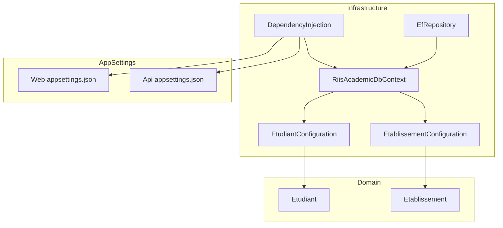
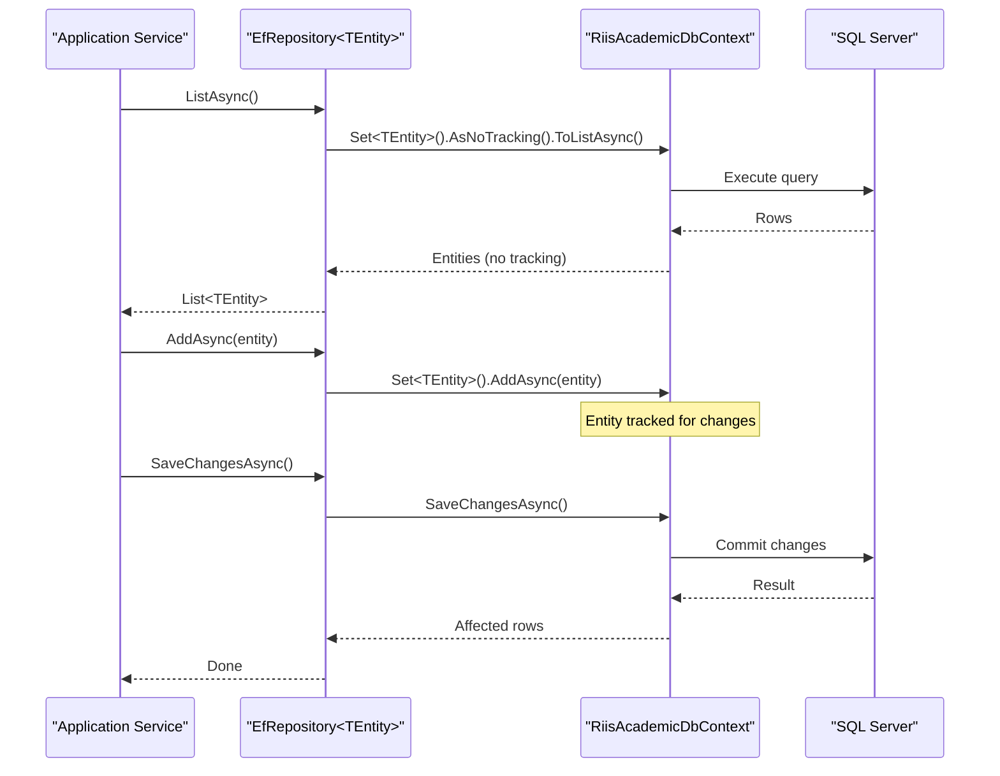
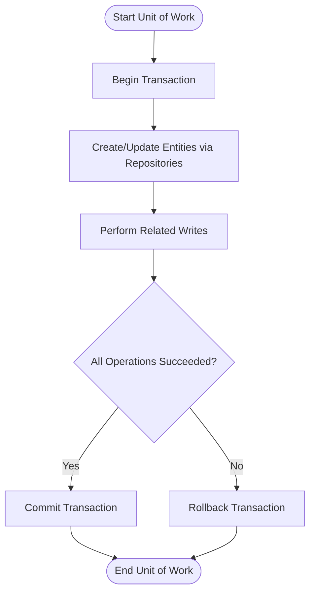
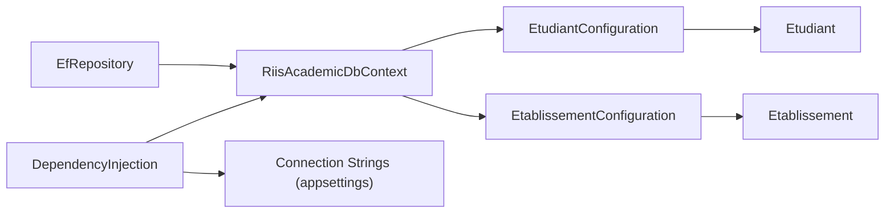

# Entity Framework Context

<cite>
**Referenced Files in This Document**
- [RiisAcademicDbContext.cs](file://RIIS.Academic.Infrastructure\Persistence\RiisAcademicDbContext.cs)
- [DependencyInjection.cs](file://RIIS.Academic.Infrastructure\DependencyInjection.cs)
- [EfRepository.cs](file://RIIS.Academic.Infrastructure\Persistence\Repositories\EfRepository.cs)
- [EtudiantConfiguration.cs](file://RIIS.Academic.Infrastructure\Persistence\Configurations\Etudiants\EtudiantConfiguration.cs)
- [EtablissementConfiguration.cs](file://RIIS.Academic.Infrastructure\Persistence\Configurations\Etablissements\EtablissementConfiguration.cs)
- [Etudiant.cs](file://RIIS.Academic.Domain\Etudiants\Etudiant.cs)
- [appsettings.json (Web)](file://RIIS.Academic.Web\appsettings.json)
- [appsettings.json (Api)](file://RIIS.Academic.Api\appsettings.json)
</cite>

## Table of Contents
1. Introduction
2. Project Structure
3. Core Components
4. Architecture Overview
5. Detailed Component Analysis
6. Dependency Analysis
7. Performance Considerations
8. Troubleshooting Guide
9. Conclusion

## Introduction
This document explains the RiisAcademicDbContext class, which is the primary Entity Framework Core context for the application. It covers how the context is configured, how connection strings are resolved, how services are registered, and how entity relationships and change tracking behave. It also provides usage patterns, transaction guidance, performance tips, lifecycle management, connection pooling notes, and troubleshooting advice.

## Project Structure
The EF Core data layer resides in the Infrastructure project:
- The DbContext declares all DbSet properties for domain entities and applies model configurations from a single assembly scan.
- Model configurations are organized by domain area under Persistence/Configurations.
- Service registration wires up the DbContext with SQL Server and registers repositories and application services.
- Configuration values (connection strings and environment selection) come from appsettings files.

**Diagram sources**
- [RiisAcademicDbContext.cs:6-49](file://RIIS.Academic.Infrastructure\Persistence\RiisAcademicDbContext.cs#L6-L49)
- [DependencyInjection.cs:25-34](file://RIIS.Academic.Infrastructure\DependencyInjection.cs#L25-L34)
- [EfRepository.cs:6-32](file://RIIS.Academic.Infrastructure\Persistence\Repositories\EfRepository.cs#L6-L32)
- [EtudiantConfiguration.cs:8-32](file://RIIS.Academic.Infrastructure\Persistence\Configurations\Etudiants\EtudiantConfiguration.cs#L8-L32)
- [EtablissementConfiguration.cs:8-28](file://RIIS.Academic.Infrastructure\Persistence\Configurations\Etablissements\EtablissementConfiguration.cs#L8-L28)
- [Etudiant.cs:3-27](file://RIIS.Academic.Domain\Etudiants\Etudiant.cs#L3-L27)
- [appsettings.json (Web):1-23](file://RIIS.Academic.Web\appsettings.json#L1-L23)
- [appsettings.json (Api):1-7](file://RIIS.Academic.Api\appsettings.json#L1-L7)

**Section sources**
- [RiisAcademicDbContext.cs:6-49](file://RIIS.Academic.Infrastructure\Persistence\RiisAcademicDbContext.cs#L6-L49)
- [DependencyInjection.cs:25-34](file://RIIS.Academic.Infrastructure\DependencyInjection.cs#L25-L34)
- [EfRepository.cs:6-32](file://RIIS.Academic.Infrastructure\Persistence\Repositories\EfRepository.cs#L6-L32)
- [EtudiantConfiguration.cs:8-32](file://RIIS.Academic.Infrastructure\Persistence\Configurations\Etudiants\EtudiantConfiguration.cs#L8-L32)
- [EtablissementConfiguration.cs:8-28](file://RIIS.Academic.Infrastructure\Persistence\Configurations\Etablissements\EtablissementConfiguration.cs#L8-L28)
- [Etudiant.cs:3-27](file://RIIS.Academic.Domain\Etudiants\Etudiant.cs#L3-L27)
- [appsettings.json (Web):1-23](file://RIIS.Academic.Web\appsettings.json#L1-L23)
- [appsettings.json (Api):1-7](file://RIIS.Academic.Api\appsettings.json#L1-L7)

## Core Components
- RiisAcademicDbContext: Declares DbSets for all domain entities and delegates model configuration to Fluent API classes via assembly scanning.
- DependencyInjection: Resolves the appropriate connection string based on an environment flag and registers the DbContext with SQL Server using Transient lifetime. Also registers generic repository and application services.
- EfRepository<TEntity>: Provides common CRUD operations over any entity type, including read-only queries that use AsNoTracking for performance.
- Entity Configurations: Define table names, keys, property constraints, indexes, row versioning, and seed data.

Key responsibilities:
- Connection resolution: Reads envval and selects between named connection strings.
- Provider setup: Uses SQL Server provider.
- Model mapping: Applies all IEntityTypeConfiguration implementations from the same assembly as the context.
- Change tracking defaults: Determined by EF Core defaults; reads often use AsNoTracking at the repository level.

**Section sources**
- [RiisAcademicDbContext.cs:6-49](file://RIIS.Academic.Infrastructure\Persistence\RiisAcademicDbContext.cs#L6-L49)
- [DependencyInjection.cs:25-72](file://RIIS.Academic.Infrastructure\DependencyInjection.cs#L25-L72)
- [EfRepository.cs:6-32](file://RIIS.Academic.Infrastructure\Persistence\Repositories\EfRepository.cs#L6-L32)
- [EtudiantConfiguration.cs:8-32](file://RIIS.Academic.Infrastructure\Persistence\Configurations\Etudiants\EtudiantConfiguration.cs#L8-L32)
- [EtablissementConfiguration.cs:8-28](file://RIIS.Academic.Infrastructure\Persistence\Configurations\Etablissements\EtablissementConfiguration.cs#L8-L28)

## Architecture Overview
The context is the central persistence abstraction. Application services depend on repositories, which depend on the context. Model configurations define schema details and constraints.

**Diagram sources**
- [EfRepository.cs:9-32](file://RIIS.Academic.Infrastructure\Persistence\Repositories\EfRepository.cs#L9-L32)
- [RiisAcademicDbContext.cs:6-49](file://RIIS.Academic.Infrastructure\Persistence\RiisAcademicDbContext.cs#L6-L49)

## Detailed Component Analysis

### RiisAcademicDbContext
- Purpose: Central EF Core context exposing DbSets for all domain entities and orchestrating model configuration via assembly scanning.
- Configuration: OnModelCreating applies all Fluent API configurations from the same assembly.
- Change tracking: Default behavior applies when entities are loaded through normal queries; read-only scenarios typically bypass tracking via AsNoTracking at the repository level.

Usage pattern highlights:
- Use DbSets directly or via repositories for CRUD.
- For bulk reads, prefer AsNoTracking to reduce memory and CPU overhead.

**Section sources**
- [RiisAcademicDbContext.cs:6-49](file://RIIS.Academic.Infrastructure\Persistence\RiisAcademicDbContext.cs#L6-L49)

### DependencyInjection and Connection String Setup
- Connection string selection: Reads envval and chooses between RiisSqlServer and OtherConnection. If not found, throws an error.
- Provider: Registers SQL Server provider for the context.
- Lifetime: Both context and options are registered as Transient, meaning a new context instance per dependency injection request.

Best practices:
- Ensure envval is set appropriately in deployment environments.
- Provide fallbacks or validation around connection string availability.

**Section sources**
- [DependencyInjection.cs:25-72](file://RIIS.Academic.Infrastructure\DependencyInjection.cs#L25-L72)
- [appsettings.json (Web):1-23](file://RIIS.Academic.Web\appsettings.json#L1-L23)
- [appsettings.json (Api):1-7](file://RIIS.Academic.Api\appsettings.json#L1-L7)

### Repository Pattern and Read-Only Queries
- Generic repository exposes ListAsync with AsNoTracking for efficient reads.
- GetByIdAsync uses FindAsync for identity-based retrieval with default tracking.
- AddAsync and Delete mark entities for add/remove; SaveChangesAsync persists changes.

Performance note:
- AsNoTracking avoids change tracking overhead for read-heavy operations.

**Section sources**
- [EfRepository.cs:6-32](file://RIIS.Academic.Infrastructure\Persistence\Repositories\EfRepository.cs#L6-L32)

### Entity Relationships and Cascade Behavior
- Etudiant has collections for ContactUrgence and Inscription, indicating one-to-many relationships.
- No explicit cascade delete rules are defined in the examined configurations; EF Core will apply its default relationship behaviors unless overridden in other configurations.
- Row versioning: Etudiant includes a Version property configured as a row version for concurrency control.

Indexes and constraints:
- Unique filtered index on Matricule for Etudiant.
- Unique filtered index on Sigle for Etablissement.

**Section sources**
- [Etudiant.cs:3-27](file://RIIS.Academic.Domain\Etudiants\Etudiant.cs#L3-L27)
- [EtudiantConfiguration.cs:8-32](file://RIIS.Academic.Infrastructure\Persistence\Configurations\Etudiants\EtudiantConfiguration.cs#L8-L32)
- [EtablissementConfiguration.cs:8-28](file://RIIS.Academic.Infrastructure\Persistence\Configurations\Etablissements\EtablissementConfiguration.cs#L8-L28)

### Model Configuration Strategy
- Assembly scanning: All IEntityTypeConfiguration implementations are automatically applied from the context’s assembly.
- Benefits: Centralized, modular, and testable configuration without cluttering the DbContext.

**Section sources**
- [RiisAcademicDbContext.cs:46-49](file://RIIS.Academic.Infrastructure\Persistence\RiisAcademicDbContext.cs#L46-L49)

### Usage Patterns and Transactions
- Typical flow: Resolve service -> repository -> context -> database.
- Transactions: Wrap multiple repository operations in a single unit of work using a shared context within a transaction scope. With Transient contexts, ensure you manage transactions explicitly if you need cross-operation atomicity.

Example workflow (conceptual):

[No sources needed since this diagram shows conceptual workflow, not actual code structure]

### Performance Optimization Techniques
- Use AsNoTracking for read-only queries to avoid change tracking overhead.
- Project only required fields when possible to reduce payload size.
- Avoid N+1 queries by using Include or separate queries where appropriate.
- Batch writes when feasible to minimize round trips.

**Section sources**
- [EfRepository.cs:9-12](file://RIIS.Academic.Infrastructure\Persistence\Repositories\EfRepository.cs#L9-L12)

### Context Lifecycle Management and Connection Pooling
- Lifecycle: Registered as Transient; each DI resolution creates a new context instance. This aligns with short-lived operations like HTTP requests.
- Connection pooling: Managed by the underlying SQL client library; connections are pooled by default. Ensure connection strings include appropriate pool settings if needed.

Guidance:
- Keep context instances scoped to a single operation or request.
- Dispose contexts promptly (handled by DI container).

**Section sources**
- [DependencyInjection.cs:31-34](file://RIIS.Academic.Infrastructure\DependencyInjection.cs#L31-L34)

## Dependency Analysis
The following diagram shows key dependencies among components involved in persistence.

**Diagram sources**
- [DependencyInjection.cs:25-72](file://RIIS.Academic.Infrastructure\DependencyInjection.cs#L25-L72)
- [RiisAcademicDbContext.cs:6-49](file://RIIS.Academic.Infrastructure\Persistence\RiisAcademicDbContext.cs#L6-L49)
- [EfRepository.cs:6-32](file://RIIS.Academic.Infrastructure\Persistence\Repositories\EfRepository.cs#L6-L32)
- [EtudiantConfiguration.cs:8-32](file://RIIS.Academic.Infrastructure\Persistence\Configurations\Etudiants\EtudiantConfiguration.cs#L8-L32)
- [EtablissementConfiguration.cs:8-28](file://RIIS.Academic.Infrastructure\Persistence\Configurations\Etablissements\EtablissementConfiguration.cs#L8-L28)
- [Etudiant.cs:3-27](file://RIIS.Academic.Domain\Etudiants\Etudiant.cs#L3-L27)
- [appsettings.json (Web):1-23](file://RIIS.Academic.Web\appsettings.json#L1-L23)
- [appsettings.json (Api):1-7](file://RIIS.Academic.Api\appsettings.json#L1-L7)

**Section sources**
- [DependencyInjection.cs:25-72](file://RIIS.Academic.Infrastructure\DependencyInjection.cs#L25-L72)
- [RiisAcademicDbContext.cs:6-49](file://RIIS.Academic.Infrastructure\Persistence\RiisAcademicDbContext.cs#L6-L49)
- [EfRepository.cs:6-32](file://RIIS.Academic.Infrastructure\Persistence\Repositories\EfRepository.cs#L6-L32)
- [EtudiantConfiguration.cs:8-32](file://RIIS.Academic.Infrastructure\Persistence\Configurations\Etudiants\EtudiantConfiguration.cs#L8-L32)
- [EtablissementConfiguration.cs:8-28](file://RIIS.Academic.Infrastructure\Persistence\Configurations\Etablissements\EtablissementConfiguration.cs#L8-L28)
- [Etudiant.cs:3-27](file://RIIS.Academic.Domain\Etudiants\Etudiant.cs#L3-L27)
- [appsettings.json (Web):1-23](file://RIIS.Academic.Web\appsettings.json#L1-L23)
- [appsettings.json (Api):1-7](file://RIIS.Academic.Api\appsettings.json#L1-L7)

## Performance Considerations
- Prefer AsNoTracking for read-only queries to reduce memory pressure and improve throughput.
- Use selective projections to fetch only necessary columns.
- Avoid unnecessary Includes; load related data only when needed.
- Batch updates/deletes where supported to reduce round trips.
- Monitor slow queries and adjust indexing based on access patterns.

[No sources needed since this section provides general guidance]

## Troubleshooting Guide
Common issues and resolutions:
- Missing connection string: Ensure envval is set correctly and the selected connection name exists in configuration. An exception is thrown if not found.
- Provider mismatch: Confirm SQL Server provider is used consistently across environments.
- Unexpected cascade deletes: Review relationship configurations; EF Core defaults may vary. Explicitly configure cascade behavior if needed.
- Concurrency conflicts: Etudiant uses row versioning; handle concurrency exceptions accordingly.
- N+1 queries: Replace lazy loading or repeated queries with eager loading or optimized projections.
- Memory growth: Use AsNoTracking for large read operations and dispose contexts promptly.

**Section sources**
- [DependencyInjection.cs:63-72](file://RIIS.Academic.Infrastructure\DependencyInjection.cs#L63-L72)
- [EtudiantConfiguration.cs:8-32](file://RIIS.Academic.Infrastructure\Persistence\Configurations\Etudiants\EtudiantConfiguration.cs#L8-L32)
- [EfRepository.cs:9-12](file://RIIS.Academic.Infrastructure\Persistence\Repositories\EfRepository.cs#L9-L12)

## Conclusion
RiisAcademicDbContext centralizes entity exposure and model configuration via assembly scanning. DependencyInjection configures SQL Server and resolves connection strings based on environment settings. The repository layer promotes consistent patterns, including AsNoTracking for efficient reads. Follow the recommended lifecycle, transaction, and performance practices to build robust and scalable data access layers.

[No sources needed since this section summarizes without analyzing specific files]