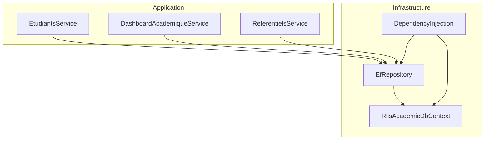
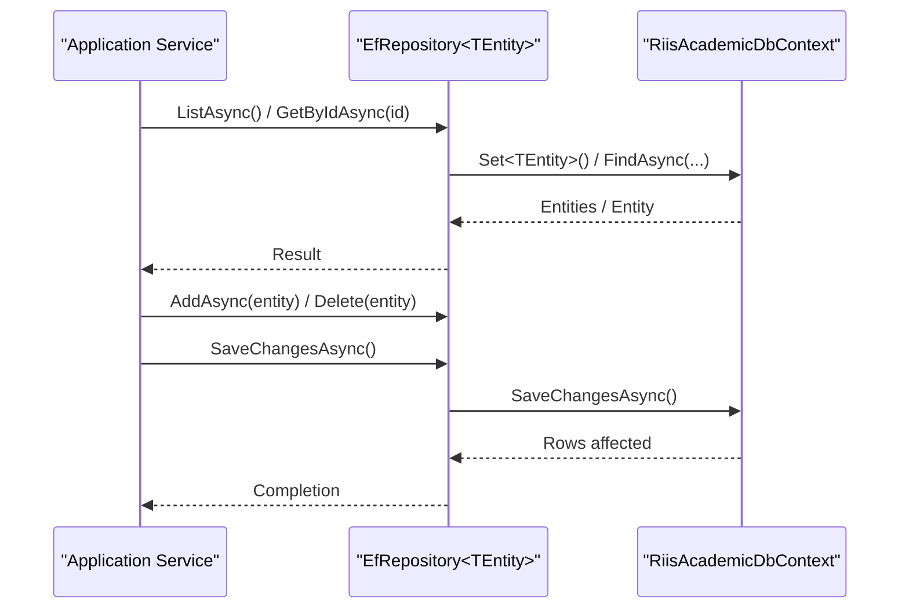
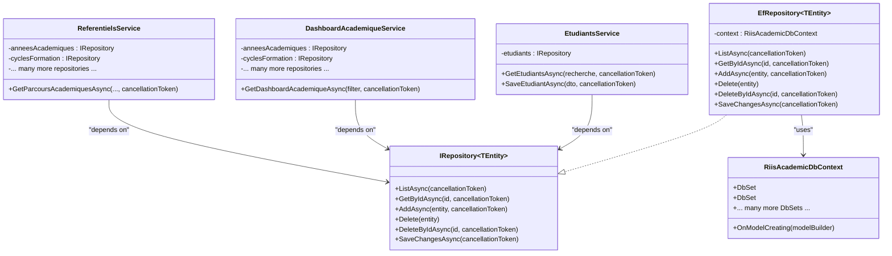

# Repository Pattern Implementation

<cite>
**Referenced Files in This Document**
- [IRepository.cs](file://RIIS.Academic.Application/Abstractions/Persistence/IRepository.cs)
- [EfRepository.cs](file://RIIS.Academic.Infrastructure/Persistence/Repositories/EfRepository.cs)
- [RiisAcademicDbContext.cs](file://RIIS.Academic.Infrastructure/Persistence/RiisAcademicDbContext.cs)
- [DependencyInjection.cs](file://RIIS.Academic.Infrastructure/DependencyInjection.cs)
- [EtudiantsService.cs](file://RIIS.Academic.Application/Etudiants/Services/EtudiantsService.cs)
- [DashboardAcademiqueService.cs](file://RIIS.Academic.Application/Dashboard/Services/DashboardAcademiqueService.cs)
- [ReferentielsService.cs](file://RIIS.Academic.Application/Referentiels/Services/ReferentielsService.cs)
</cite>

## Table of Contents
1. [Introduction](#introduction)
2. [Project Structure](#project-structure)
3. [Core Components](#core-components)
4. [Architecture Overview](#architecture-overview)
5. [Detailed Component Analysis](#detailed-component-analysis)
6. [Dependency Analysis](#dependency-analysis)
7. [Performance Considerations](#performance-considerations)
8. [Troubleshooting Guide](#troubleshooting-guide)
9. [Conclusion](#conclusion)

## Introduction
This document explains the repository pattern implementation used to abstract data access and provide generic CRUD operations with query building capabilities. It focuses on the IRepository abstraction, its EfRepository implementation over Entity Framework Core, and how application services use these abstractions to achieve loose coupling. It also covers advanced querying patterns (filtering, sorting), transaction handling via SaveChangesAsync, and performance considerations for large datasets.

## Project Structure
The repository is implemented in the Infrastructure layer and consumed by Application services:
- Abstraction: IRepository<TEntity> defines a minimal set of persistence operations.
- Implementation: EfRepository<TEntity> implements IRepository using EF Core’s DbContext.
- Context: RiisAcademicDbContext exposes DbSet properties for all domain entities and configures model mappings.
- Composition: DependencyInjection registers repositories and services with scoped lifetimes.
- Consumers: Application services depend on IRepository<T> to perform reads/writes without knowing about EF Core.

**Diagram sources**
- [DependencyInjection.cs:25-60](file://RIIS.Academic.Infrastructure/DependencyInjection.cs#L25-L60)
- [EfRepository.cs:6-32](file://RIIS.Academic.Infrastructure/Persistence/Repositories/EfRepository.cs#L6-L32)
- [RiisAcademicDbContext.cs:6-49](file://RIIS.Academic.Infrastructure/Persistence/RiisAcademicDbContext.cs#L6-L49)
- [EtudiantsService.cs:7-127](file://RIIS.Academic.Application/Etudiants/Services/EtudiantsService.cs#L7-L127)
- [DashboardAcademiqueService.cs:7-79](file://RIIS.Academic.Application/Dashboard/Services/DashboardAcademiqueService.cs#L7-L79)
- [ReferentielsService.cs:7-212](file://RIIS.Academic.Application/Referentiels/Services/ReferentielsService.cs#L7-L212)

**Section sources**
- [DependencyInjection.cs:25-60](file://RIIS.Academic.Infrastructure/DependencyInjection.cs#L25-L60)
- [RiisAcademicDbContext.cs:6-49](file://RIIS.Academic.Infrastructure/Persistence/RiisAcademicDbContext.cs#L6-L49)

## Core Components
- IRepository<TEntity>: Defines ListAsync, GetByIdAsync, AddAsync, Delete, DeleteByIdAsync, and SaveChangesAsync.
- EfRepository<TEntity>: Implements IRepository using EF Core Set methods; uses AsNoTracking for read-only queries; delegates persistence to context.
- RiisAcademicDbContext: Central EF Core context exposing DbSets for all domain entities and applying configurations from assembly.
- DependencyInjection: Registers DbContext as Transient and IRepository<> as Scoped; wires up application services.

Key responsibilities:
- Loose coupling: Services depend on IRepository<T>, not on EF Core directly.
- Generic CRUD: Single repository type supports any entity class.
- Query composition: Services build LINQ expressions after retrieving base sets or filter in-memory when appropriate.

**Section sources**
- [IRepository.cs:3-12](file://RIIS.Academic.Application/Abstractions/Persistence/IRepository.cs#L3-L12)
- [EfRepository.cs:6-32](file://RIIS.Academic.Infrastructure/Persistence/Repositories/EfRepository.cs#L6-L32)
- [RiisAcademicDbContext.cs:6-49](file://RIIS.Academic.Infrastructure/Persistence/RiisAcademicDbContext.cs#L6-L49)
- [DependencyInjection.cs:25-60](file://RIIS.Academic.Infrastructure/DependencyInjection.cs#L25-L60)

## Architecture Overview
The architecture follows Clean Architecture principles:
- Application services orchestrate business logic and depend on repository abstractions.
- Infrastructure provides concrete repository implementations backed by EF Core.
- Dependency injection wires abstractions to implementations at runtime.

**Diagram sources**
- [EfRepository.cs:9-32](file://RIIS.Academic.Infrastructure/Persistence/Repositories/EfRepository.cs#L9-L32)
- [RiisAcademicDbContext.cs:6-49](file://RIIS.Academic.Infrastructure/Persistence/RiisAcademicDbContext.cs#L6-L49)

## Detailed Component Analysis

### IRepository<TEntity> Abstraction
- Purpose: Define a consistent contract for data access across all entities.
- Methods:
  - ListAsync: Retrieve all entities (read-only).
  - GetByIdAsync: Retrieve a single entity by primary key.
  - AddAsync: Stage a new entity for insertion.
  - Delete: Mark an existing entity for deletion.
  - DeleteByIdAsync: Convenience method to find and delete by id.
  - SaveChangesAsync: Persist pending changes to the database.

Benefits:
- Decouples application services from EF Core specifics.
- Enables testability via mocking.
- Provides a uniform API for all entities.

**Section sources**
- [IRepository.cs:3-12](file://RIIS.Academic.Application/Abstractions/Persistence/IRepository.cs#L3-L12)

### EfRepository<TEntity> Implementation
- Uses EF Core’s Set<TEntity> for typed access.
- Read operations:
  - ListAsync uses AsNoTracking for performance on read-only scenarios.
  - GetByIdAsync uses FindAsync for efficient key-based lookup.
- Write operations:
  - AddAsync stages entities; Delete marks for removal; SaveChangesAsync commits.
  - DeleteByIdAsync composes GetByIdAsync + Delete for convenience.

Complexity:
- ListAsync: O(n) over table size due to full scan; suitable for small-to-medium tables or when combined with filtering in memory.
- GetByIdAsync: O(1) average with proper indexing on primary keys.
- AddAsync/Delete: O(1) staging; actual cost occurs at SaveChangesAsync.

Optimization notes:
- For large datasets, prefer server-side filtering/sorting/pagination at the service layer before materializing results.
- Use AsNoTracking consistently for read-heavy operations to avoid change tracking overhead.

**Section sources**
- [EfRepository.cs:6-32](file://RIIS.Academic.Infrastructure/Persistence/Repositories/EfRepository.cs#L6-L32)

### RiisAcademicDbContext
- Exposes strongly-typed DbSets for all domain entities.
- Applies configuration from assembly to define relationships, constraints, and mapping details.
- Registered as Transient in DI to align with per-request usage patterns.

Usage implications:
- Each request typically gets a fresh context instance, ensuring isolation and thread-safety.
- Changes are tracked per context; SaveChangesAsync persists them atomically within that scope.

**Section sources**
- [RiisAcademicDbContext.cs:6-49](file://RIIS.Academic.Infrastructure/Persistence/RiisAcademicDbContext.cs#L6-L49)
- [DependencyInjection.cs:31-34](file://RIIS.Academic.Infrastructure/DependencyInjection.cs#L31-L34)

### Dependency Injection and Registration
- Registers DbContext with SQL Server provider using configured connection string.
- Registers IRepository<> mapped to EfRepository<> with Scoped lifetime.
- Wires multiple application services for dependency resolution.

Implications:
- Scoped lifetime ensures one repository per HTTP request, preventing shared state issues.
- Centralized registration simplifies testing and environment-specific configuration.

**Section sources**
- [DependencyInjection.cs:25-60](file://RIIS.Academic.Infrastructure/DependencyInjection.cs#L25-L60)

### Usage in Application Services

#### EtudiantsService
- Demonstrates basic CRUD:
  - ListAsync with in-memory filtering and ordering.
  - GetByIdAsync for retrieval.
  - AddAsync for creation and SaveChangesAsync for persistence.
  - DeleteByIdAsync for removal.
- Shows typical service-level validation and DTO mapping.

Query patterns:
- Filtering performed in-memory after ListAsync; suitable for moderate result sets.
- Sorting applied via LINQ OrderBy/ThenOrderBy.

**Section sources**
- [EtudiantsService.cs:7-127](file://RIIS.Academic.Application/Etudiants/Services/EtudiantsService.cs#L7-L127)

#### DashboardAcademiqueService
- Loads multiple entity sets concurrently via ListAsync calls into a composite data structure.
- Performs complex filtering and grouping in memory to compute dashboard metrics.
- Illustrates advanced LINQ usage: Where, Select, GroupBy, ToHashSet, Take for limiting results.

Performance considerations:
- Loading entire tables into memory can be heavy; ensure filters reduce dataset size early.
- Use ToHashSet for fast membership checks during joins/grouping.

**Section sources**
- [DashboardAcademiqueService.cs:7-79](file://RIIS.Academic.Application/Dashboard/Services/DashboardAcademiqueService.cs#L7-L79)
- [DashboardAcademiqueService.cs:81-145](file://RIIS.Academic.Application/Dashboard/Services/DashboardAcademiqueService.cs#L81-L145)
- [DashboardAcademiqueService.cs:167-207](file://RIIS.Academic.Application/Dashboard/Services/DashboardAcademiqueService.cs#L167-L207)
- [DashboardAcademiqueService.cs:315-408](file://RIIS.Academic.Application/Dashboard/Services/DashboardAcademiqueService.cs#L315-L408)

#### ReferentielsService
- Demonstrates multi-parameter filtering with optional parameters.
- Builds LINQ queries incrementally based on provided filters.
- Joins related entities in memory to enrich DTOs.

Query patterns:
- Conditional Where clauses for flexible filtering.
- In-memory joins and projections to produce rich DTOs.

**Section sources**
- [ReferentielsService.cs:150-212](file://RIIS.Academic.Application/Referentiels/Services/ReferentielsService.cs#L150-L212)
- [ReferentielsService.cs:404-426](file://RIIS.Academic.Application/Referentiels/Services/ReferentielsService.cs#L404-L426)

### Advanced Query Methods: Filtering, Sorting, Pagination
Current repository does not expose dedicated filtering/sorting/pagination APIs. Services compose LINQ after ListAsync or operate on in-memory collections. Recommended enhancements:
- Add FilterAsync(predicate) to push Where conditions to the database.
- Add SortAsync(orderBySelector, descending) to generate server-side ordering.
- Add PageAsync(page, pageSize) to implement skip/take pagination.
- Provide Expression<Func<TEntity, bool>> overloads to enable query translation.

Example patterns observed:
- Filtering: Multiple Where clauses chained conditionally.
- Sorting: OrderBy/ThenOrderBy applied post-read.
- Pagination: Take used to limit result sets (e.g., top N items).

[No sources needed since this section proposes enhancements beyond current code]

### Transaction Handling and Batch Operations
- Transactions:
  - SaveChangesAsync commits all pending changes within the current DbContext scope.
  - For multi-entity transactions, wrap multiple Add/Update/Delete calls followed by a single SaveChangesAsync call.
  - For explicit transactions, consider using Database.BeginTransactionAsync around multiple SaveChangesAsync calls.
- Batch operations:
  - Current implementation stages changes individually; batch execution happens at SaveChangesAsync.
  - For true bulk inserts/updates, consider EF Core bulk extensions or raw SQL commands outside the repository.

Best practices:
- Keep unit-of-work boundaries aligned with service methods to minimize open transactions.
- Handle exceptions around SaveChangesAsync to rollback or compensate as needed.

**Section sources**
- [EfRepository.cs:17-32](file://RIIS.Academic.Infrastructure/Persistence/Repositories/EfRepository.cs#L17-L32)
- [EtudiantsService.cs:53-127](file://RIIS.Academic.Application/Etudiants/Services/EtudiantsService.cs#L53-L127)
- [ReferentielsService.cs:45-82](file://RIIS.Academic.Application/Referentiels/Services/ReferentielsService.cs#L45-L82)

### Custom Query Implementations
- Services demonstrate custom queries by composing LINQ against loaded collections.
- For complex analytics (dashboard), load necessary sets once and compute metrics in memory using GroupBy, Select, and aggregations.
- When possible, move filtering closer to the database to reduce payload sizes.

**Section sources**
- [DashboardAcademiqueService.cs:60-79](file://RIIS.Academic.Application/Dashboard/Services/DashboardAcademiqueService.cs#L60-L79)
- [DashboardAcademiqueService.cs:210-246](file://RIIS.Academic.Application/Dashboard/Services/DashboardAcademiqueService.cs#L210-L246)
- [ReferentielsService.cs:150-212](file://RIIS.Academic.Application/Referentiels/Services/ReferentielsService.cs#L150-L212)

## Dependency Analysis
The following diagram shows how components depend on each other:

**Diagram sources**
- [IRepository.cs:3-12](file://RIIS.Academic.Application/Abstractions/Persistence/IRepository.cs#L3-L12)
- [EfRepository.cs:6-32](file://RIIS.Academic.Infrastructure/Persistence/Repositories/EfRepository.cs#L6-L32)
- [RiisAcademicDbContext.cs:6-49](file://RIIS.Academic.Infrastructure/Persistence/RiisAcademicDbContext.cs#L6-L49)
- [EtudiantsService.cs:7-127](file://RIIS.Academic.Application/Etudiants/Services/EtudiantsService.cs#L7-L127)
- [DashboardAcademiqueService.cs:7-79](file://RIIS.Academic.Application/Dashboard/Services/DashboardAcademiqueService.cs#L7-L79)
- [ReferentielsService.cs:7-212](file://RIIS.Academic.Application/Referentiels/Services/ReferentielsService.cs#L7-L212)

**Section sources**
- [DependencyInjection.cs:25-60](file://RIIS.Academic.Infrastructure/DependencyInjection.cs#L25-L60)

## Performance Considerations
- Read-only queries:
  - AsNoTracking is used in ListAsync to avoid change tracking overhead.
  - Prefer server-side filtering/sorting/pagination to reduce memory footprint and network transfer.
- Large datasets:
  - Avoid loading entire tables into memory unless necessary; apply filters early.
  - Use ToHashSet for efficient lookups during joins/grouping.
  - Limit result sets with Take where appropriate.
- Transactions:
  - Minimize the number of SaveChangesAsync calls within a logical unit of work.
  - Consider explicit transactions for multi-step operations to ensure consistency.
- Indexing:
  - Ensure primary keys and frequently filtered columns are indexed in the database to optimize FindAsync and Where clauses.

[No sources needed since this section provides general guidance]

## Troubleshooting Guide
Common issues and remedies:
- Null reference after GetByIdAsync:
  - Check if the entity exists before updating; handle null returns gracefully.
- Duplicate key errors:
  - Validate uniqueness in service layer before AddAsync; throw clear error messages.
- Performance degradation:
  - Review in-memory filtering; move Where clauses to server-side queries when possible.
  - Reduce result set size with pagination and selective projection.
- Transaction failures:
  - Wrap critical sequences in try/catch around SaveChangesAsync; log and roll back as needed.

**Section sources**
- [EtudiantsService.cs:53-127](file://RIIS.Academic.Application/Etudiants/Services/EtudiantsService.cs#L53-L127)
- [ReferentielsService.cs:45-82](file://RIIS.Academic.Application/Referentiels/Services/ReferentielsService.cs#L45-L82)

## Conclusion
The repository pattern in this project provides a clean abstraction over EF Core, enabling loose coupling between application services and data access. While the current repository offers essential CRUD operations, advanced querying (server-side filtering, sorting, pagination) should be added to improve scalability for large datasets. Services demonstrate robust LINQ composition for filtering and aggregation, and transaction handling is achieved through SaveChangesAsync within scoped contexts. Following the recommended enhancements will further strengthen performance and maintainability.