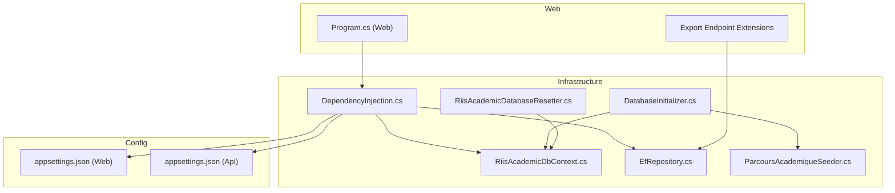
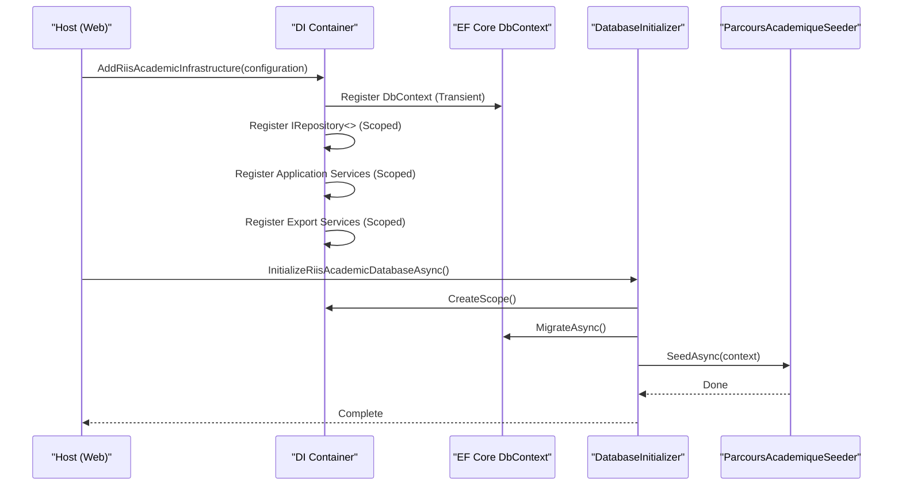
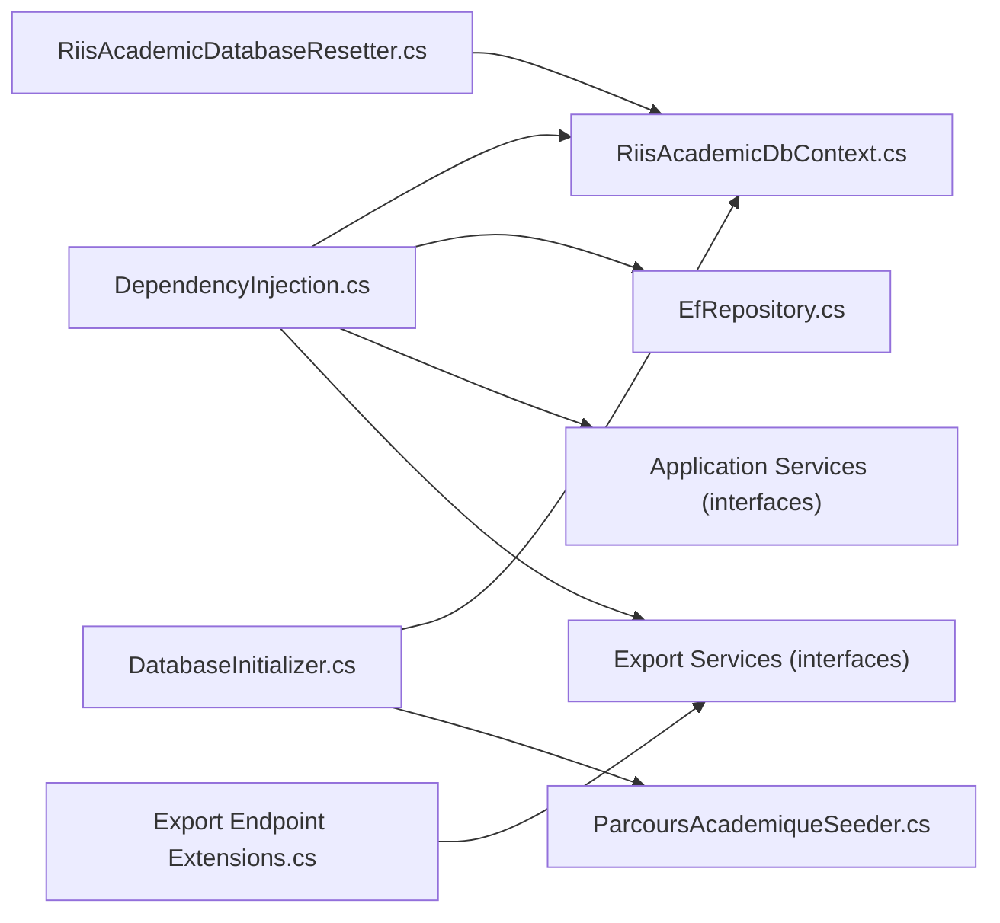

# Dependency Injection & Service Registration

<cite>
**Referenced Files in This Document**
- [DependencyInjection.cs](file://RIIS.Academic.Infrastructure/DependencyInjection.cs)
- [DatabaseInitializer.cs](file://RIIS.Academic.Infrastructure/Persistence/DatabaseInitializer.cs)
- [RiisAcademicDatabaseResetter.cs](file://RIIS.Academic.Infrastructure/Persistence/RiisAcademicDatabaseResetter.cs)
- [RiisAcademicDbContext.cs](file://RIIS.Academic.Infrastructure/Persistence/RiisAcademicDbContext.cs)
- [EfRepository.cs](file://RIIS.Academic.Infrastructure/Persistence/Repositories/EfRepository.cs)
- [ParcoursAcademiqueSeeder.cs](file://RIIS.Academic.Infrastructure/Persistence/Seeders/ParcoursAcademiqueSeeder.cs)
- [Program.cs (Web)](file://RIIS.Academic.Web/Program.cs)
- [appsettings.json (Web)](file://RIIS.Academic.Web/appsettings.json)
- [appsettings.json (Api)](file://RIIS.Academic.Api/appsettings.json)
- [RiisAcademicExportEndpointExtensions.cs](file://RIIS.Academic.Web/Extensions/RiisAcademicExportEndpointExtensions.cs)
</cite>

## Table of Contents
1. Introduction
2. Project Structure
3. Core Components
4. Architecture Overview
5. Detailed Component Analysis
6. Dependency Analysis
7. Performance Considerations
8. Troubleshooting Guide
9. Conclusion
10. Appendices

## Introduction
This document explains how the Infrastructure Layer configures dependency injection and registers services, repositories, and external integrations with appropriate lifetimes. It also covers database initialization and seeding, development/testing reset utilities, service resolution patterns, configuration providers, environment-specific behavior, and guidance for extending the DI container with custom services and middleware.

## Project Structure
The Infrastructure Layer centralizes:
- DI registration for EF Core DbContext, repositories, application services, and export services
- Database context and model configurations
- Database initialization and seeding
- Development-time database reset utility
- Integration points used by the Web API and Web UI projects

**Diagram sources**
- [DependencyInjection.cs:23-60](file://RIIS.Academic.Infrastructure/DependencyInjection.cs#L23-L60)
- [RiisAcademicDbContext.cs:6-49](file://RIIS.Academic.Infrastructure/Persistence/RiisAcademicDbContext.cs#L6-L49)
- [EfRepository.cs:6-33](file://RIIS.Academic.Infrastructure/Persistence/Repositories/EfRepository.cs#L6-L33)
- [ParcoursAcademiqueSeeder.cs:51-118](file://RIIS.Academic.Infrastructure/Persistence/Seeders/ParcoursAcademiqueSeeder.cs#L51-L118)
- [DatabaseInitializer.cs:6-22](file://RIIS.Academic.Infrastructure/Persistence/DatabaseInitializer.cs#L6-L22)
- [RiisAcademicDatabaseResetter.cs:5-63](file://RIIS.Academic.Infrastructure/Persistence/RiisAcademicDatabaseResetter.cs#L5-L63)
- [Program.cs (Web):8-12](file://RIIS.Academic.Web/Program.cs#L8-L12)
- [RiisAcademicExportEndpointExtensions.cs:9-92](file://RIIS.Academic.Web/Extensions/RiisAcademicExportEndpointExtensions.cs#L9-L92)
- [appsettings.json (Web):1-23](file://RIIS.Academic.Web/appsettings.json#L1-L23)
- [appsettings.json (Api):1-7](file://RIIS.Academic.Api/appsettings.json#L1-L7)

**Section sources**
- [DependencyInjection.cs:23-73](file://RIIS.Academic.Infrastructure/DependencyInjection.cs#L23-L73)
- [Program.cs (Web):8-12](file://RIIS.Academic.Web/Program.cs#L8-L12)
- [appsettings.json (Web):1-23](file://RIIS.Academic.Web/appsettings.json#L1-L23)
- [appsettings.json (Api):1-7](file://RIIS.Academic.Api/appsettings.json#L1-L7)

## Core Components
- DI registration extension that adds EF Core DbContext, repository, application services, and export services with appropriate lifetimes.
- Database initializer that applies migrations and seeds reference data.
- Database resetter for development/testing to clear non-referential data safely.
- Export endpoints demonstrating service resolution via minimal APIs.

Key responsibilities:
- Centralize service lifetime management and configuration binding
- Provide safe, transactional operations for seeding and resetting data
- Expose clean abstractions for consumers (application services, exports)

**Section sources**
- [DependencyInjection.cs:23-73](file://RIIS.Academic.Infrastructure/DependencyInjection.cs#L23-L73)
- [DatabaseInitializer.cs:6-22](file://RIIS.Academic.Infrastructure/Persistence/DatabaseInitializer.cs#L6-L22)
- [RiisAcademicDatabaseResetter.cs:5-63](file://RIIS.Academic.Infrastructure/Persistence/RiisAcademicDatabaseResetter.cs#L5-L63)
- [RiisAcademicExportEndpointExtensions.cs:9-92](file://RIIS.Academic.Web/Extensions/RiisAcademicExportEndpointExtensions.cs#L9-L92)

## Architecture Overview
The DI container is configured once at application startup. The Web project calls the infrastructure registration method, which binds configuration, registers the DbContext, repositories, and all application/export services. The database is initialized on demand using a scoped operation that runs migrations and seeds data.

**Diagram sources**
- [DependencyInjection.cs:23-60](file://RIIS.Academic.Infrastructure/DependencyInjection.cs#L23-L60)
- [DatabaseInitializer.cs:6-22](file://RIIS.Academic.Infrastructure/Persistence/DatabaseInitializer.cs#L6-L22)
- [ParcoursAcademiqueSeeder.cs:51-118](file://RIIS.Academic.Infrastructure/Persistence/Seeders/ParcoursAcademiqueSeeder.cs#L51-L118)

## Detailed Component Analysis

### DependencyInjection Configuration
- Registers the EF Core DbContext with SQL Server using a connection string resolved from configuration based on an environment value.
- Registers a generic repository abstraction bound to an EF implementation with Scoped lifetime.
- Registers application services (domain features like referentiels, students, evaluations, notes, dashboard, process verbaux, transcripts, and school finance services) with Scoped lifetime.
- Registers export services (Word/Excel) with Scoped lifetime.
- Provides a helper to select the correct connection name based on environment configuration.

Lifetime summary:
- DbContext: Transient
- Repository: Scoped
- Application services: Scoped
- Export services: Scoped

Configuration provider:
- Uses IConfiguration to read an environment flag and connection strings.

Environment-specific behavior:
- Reads an environment key to choose between two connection names, then resolves the corresponding connection string.

Extensibility:
- New services can be added by registering their interface-to-implementation mapping with the appropriate lifetime.
- New DbContext options or logging can be added within this method.

**Section sources**
- [DependencyInjection.cs:23-73](file://RIIS.Academic.Infrastructure/DependencyInjection.cs#L23-L73)
- [appsettings.json (Web):1-23](file://RIIS.Academic.Web/appsettings.json#L1-L23)
- [appsettings.json (Api):1-7](file://RIIS.Academic.Api/appsettings.json#L1-L7)

### EfRepository Implementation
- Implements a generic repository over EF Core DbSet with common CRUD operations.
- Uses AsNoTracking for read-only list queries to improve performance.
- Delegates persistence to the injected DbContext.

Performance considerations:
- Read paths use AsNoTracking to avoid change tracking overhead.
- Write paths rely on DbContext change tracking.

**Section sources**
- [EfRepository.cs:6-33](file://RIIS.Academic.Infrastructure/Persistence/Repositories/EfRepository.cs#L6-L33)

### RiisAcademicDbContext
- Declares DbSets for all domain entities.
- Applies entity configurations from the assembly automatically.

Usage:
- Consumed by the repository and seeders.
- Registered in DI with a specific lifetime.

**Section sources**
- [RiisAcademicDbContext.cs:6-49](file://RIIS.Academic.Infrastructure/Persistence/RiisAcademicDbContext.cs#L6-L49)

### DatabaseInitializer
- Creates a service scope to resolve DbContext.
- Applies pending migrations.
- Invokes the seeder to ensure reference data exists.

Operational notes:
- Should be invoked during application startup or deployment scripts.
- Safe to call multiple times due to idempotent seeding logic.

**Section sources**
- [DatabaseInitializer.cs:6-22](file://RIIS.Academic.Infrastructure/Persistence/DatabaseInitializer.cs#L6-L22)
- [ParcoursAcademiqueSeeder.cs:51-118](file://RIIS.Academic.Infrastructure/Persistence/Seeders/ParcoursAcademiqueSeeder.cs#L51-L118)

### ParcoursAcademiqueSeeder
- Ensures academic pathways are present for each academic year based on cycles, levels, fields, and specialties.
- Computes codes and labels deterministically.
- Upserts records to maintain consistency across runs.

Error handling:
- Throws when required reference data is missing, making setup failures explicit.

**Section sources**
- [ParcoursAcademiqueSeeder.cs:51-118](file://RIIS.Academic.Infrastructure/Persistence/Seeders/ParcoursAcademiqueSeeder.cs#L51-L118)

### RiisAcademicDatabaseResetter
- Clears non-referential data in a single transaction to maintain referential integrity.
- Requires an explicit confirmation flag to prevent accidental resets.
- Optionally includes tuition-related tables.

Use cases:
- Development and testing to quickly reset state without dropping the database.

Safety:
- Fails fast if confirmation is not provided.
- Wraps all deletions in a transaction to ensure atomicity.

**Section sources**
- [RiisAcademicDatabaseResetter.cs:5-63](file://RIIS.Academic.Infrastructure/Persistence/RiisAcademicDatabaseResetter.cs#L5-L63)

### Export Endpoints and Service Resolution
- Minimal API endpoints demonstrate resolving export services via [FromServices].
- Each endpoint returns either a file result or a 404 when content is unavailable.

Integration pattern:
- Controllers or endpoints request only the interfaces they need; DI provides implementations.

**Section sources**
- [RiisAcademicExportEndpointExtensions.cs:9-92](file://RIIS.Academic.Web/Extensions/RiisAcademicExportEndpointExtensions.cs#L9-L92)

## Dependency Analysis
The following diagram shows how components depend on each other through DI and EF Core.

**Diagram sources**
- [DependencyInjection.cs:23-60](file://RIIS.Academic.Infrastructure/DependencyInjection.cs#L23-L60)
- [RiisAcademicDbContext.cs:6-49](file://RIIS.Academic.Infrastructure/Persistence/RiisAcademicDbContext.cs#L6-L49)
- [EfRepository.cs:6-33](file://RIIS.Academic.Infrastructure/Persistence/Repositories/EfRepository.cs#L6-L33)
- [DatabaseInitializer.cs:6-22](file://RIIS.Academic.Infrastructure/Persistence/DatabaseInitializer.cs#L6-L22)
- [ParcoursAcademiqueSeeder.cs:51-118](file://RIIS.Academic.Infrastructure/Persistence/Seeders/ParcoursAcademiqueSeeder.cs#L51-L118)
- [RiisAcademicDatabaseResetter.cs:5-63](file://RIIS.Academic.Infrastructure/Persistence/RiisAcademicDatabaseResetter.cs#L5-L63)
- [RiisAcademicExportEndpointExtensions.cs:9-92](file://RIIS.Academic.Web/Extensions/RiisAcademicExportEndpointExtensions.cs#L9-L92)

**Section sources**
- [DependencyInjection.cs:23-73](file://RIIS.Academic.Infrastructure/DependencyInjection.cs#L23-L73)
- [RiisAcademicExportEndpointExtensions.cs:9-92](file://RIIS.Academic.Web/Extensions/RiisAcademicExportEndpointExtensions.cs#L9-L92)

## Performance Considerations
- DbContext lifetime:
  - The DbContext is registered as Transient. Ensure you do not hold references beyond a short-lived operation. If you need per-request DbContext semantics, consider registering it as Scoped in your host pipeline.
- Repository reads:
  - Use AsNoTracking for read-only queries to reduce memory pressure and improve throughput.
- Seeding and migrations:
  - Run migrations once at startup or deployment time to avoid repeated schema checks.
- Export services:
  - Keep export operations asynchronous and stream large files when possible to minimize memory usage.

[No sources needed since this section provides general guidance]

## Troubleshooting Guide
Common issues and resolutions:
- Missing connection string:
  - Ensure the selected connection name exists in configuration and is accessible at runtime.
- Environment-based connection selection:
  - Verify the environment flag used to choose the connection name is set correctly.
- Migration errors:
  - Confirm the target database is reachable and the user has sufficient permissions.
- Seeder failures:
  - Reference data must exist before seeding pathways; check cycles, levels, fields, and specialties.
- Accidental data reset:
  - The resetter requires an explicit confirmation flag; double-check callers to prevent unintended resets.

**Section sources**
- [DependencyInjection.cs:63-73](file://RIIS.Academic.Infrastructure/DependencyInjection.cs#L63-L73)
- [ParcoursAcademiqueSeeder.cs:51-118](file://RIIS.Academic.Infrastructure/Persistence/Seeders/ParcoursAcademiqueSeeder.cs#L51-L118)
- [RiisAcademicDatabaseResetter.cs:5-63](file://RIIS.Academic.Infrastructure/Persistence/RiisAcademicDatabaseResetter.cs#L5-L63)

## Conclusion
The Infrastructure Layer centralizes DI configuration, database access, seeding, and reset utilities. Services are registered with clear lifetimes, and configuration is environment-aware. Consumers resolve services via interfaces, enabling testability and extensibility. Use the initializer for setup and the resetter for controlled development workflows.

[No sources needed since this section summarizes without analyzing specific files]

## Appendices

### Service Lifetime Summary
- DbContext: Transient
- Repository: Scoped
- Application services: Scoped
- Export services: Scoped

**Section sources**
- [DependencyInjection.cs:23-60](file://RIIS.Academic.Infrastructure/DependencyInjection.cs#L23-L60)

### Extending the DI Container
To add a new service:
- Define an interface in the appropriate layer.
- Implement the interface in the Infrastructure layer.
- Register the mapping in the infrastructure DI extension with the desired lifetime.
- Resolve via constructor injection or [FromServices] in endpoints.

Example integration point:
- Add a new registration line in the infrastructure DI extension method.

**Section sources**
- [DependencyInjection.cs:23-60](file://RIIS.Academic.Infrastructure/DependencyInjection.cs#L23-L60)

### Adding Middleware or Custom Endpoints
- Register any required services in the DI container.
- Map minimal API endpoints that resolve services via [FromServices].
- Ensure error handling and cancellation tokens are propagated.

Reference example:
- Export endpoints demonstrate service resolution and file responses.

**Section sources**
- [RiisAcademicExportEndpointExtensions.cs:9-92](file://RIIS.Academic.Web/Extensions/RiisAcademicExportEndpointExtensions.cs#L9-L92)