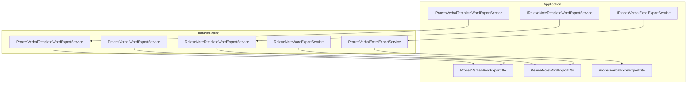
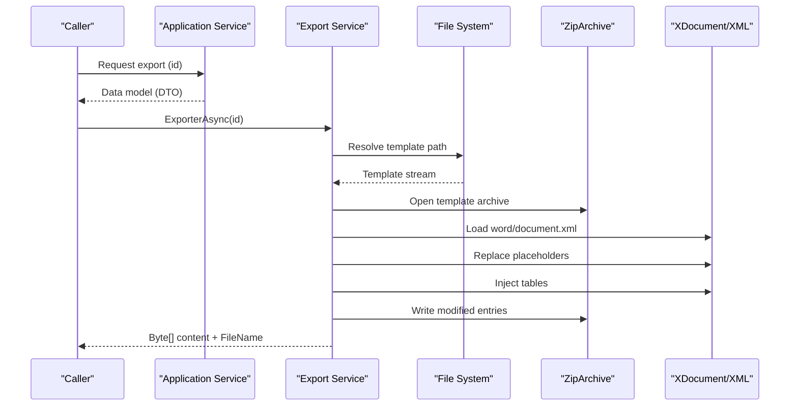
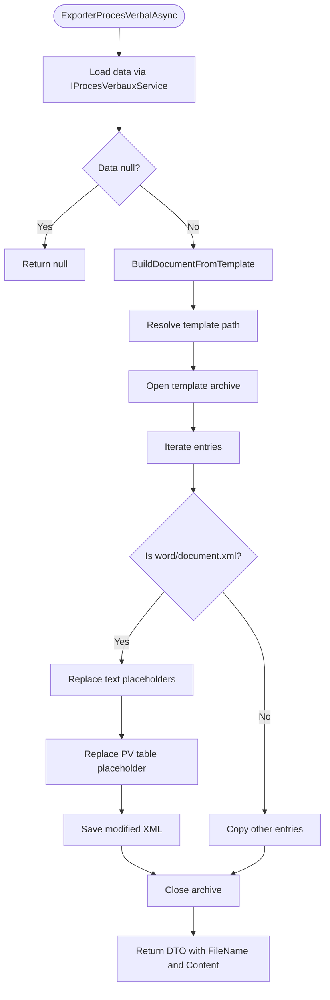
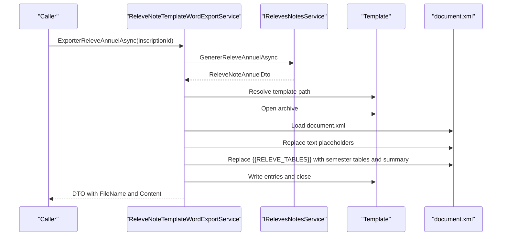
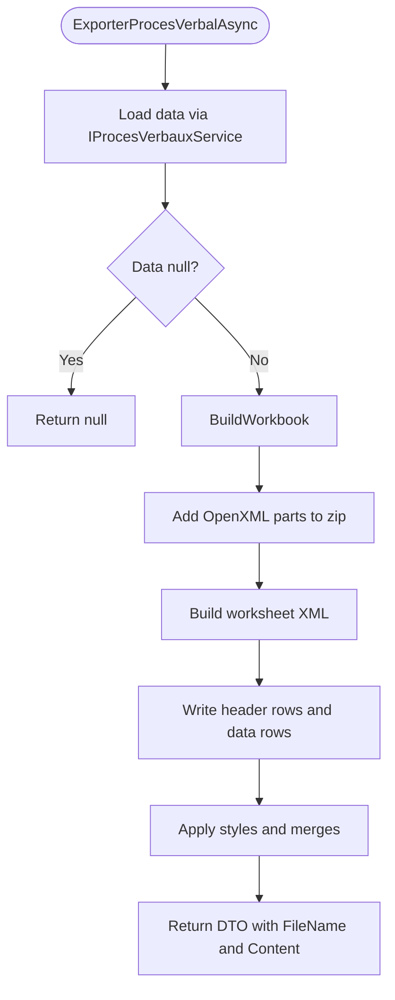
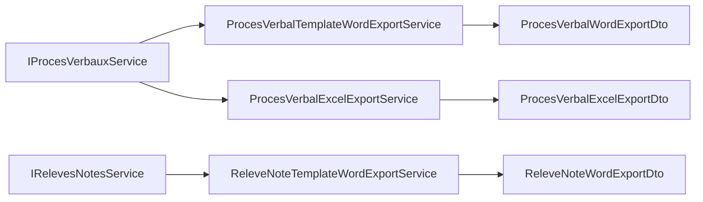

# Document Generation Services

<cite>
**Referenced Files in This Document**
- [ProcesVerbalTemplateWordExportService.cs](file://RIIS.Academic.Infrastructure/Documents/ProcesVerbalTemplateWordExportService.cs)
- [ReleveNoteTemplateWordExportService.cs](file://RIIS.Academic.Infrastructure/Documents/ReleveNoteTemplateWordExportService.cs)
- [ProcesVerbalExcelExportService.cs](file://RIIS.Academic.Infrastructure/Documents/ProcesVerbalExcelExportService.cs)
- [ProcesVerbalWordExportService.cs](file://RIIS.Academic.Infrastructure/Documents/ProcesVerbalWordExportService.cs)
- [ReleveNoteWordExportService.cs](file://RIIS.Academic.Infrastructure/Documents/ReleveNoteWordExportService.cs)
- [IProcesVerbalTemplateWordExportService.cs](file://RIIS.Academic.Application/ProcesVerbaux/Services/IProcesVerbalTemplateWordExportService.cs)
- [IReleveNoteTemplateWordExportService.cs](file://RIIS.Academic.Application/Releves/Services/IReleveNoteTemplateWordExportService.cs)
- [IProcesVerbalExcelExportService.cs](file://RIIS.Academic.Application/ProcesVerbaux/Services/IProcesVerbalExcelExportService.cs)
- [ProcesVerbalWordExportDto.cs](file://RIIS.Academic.Application/ProcesVerbaux/Dtos/ProcesVerbalWordExportDto.cs)
- [ReleveNoteWordExportDto.cs](file://RIIS.Academic.Application/Releves/Dtos/ReleveNoteWordExportDto.cs)
- [ProcesVerbalExcelExportDto.cs](file://RIIS.Academic.Application/ProcesVerbaux/Dtos/ProcesVerbalExcelExportDto.cs)
</cite>

## Table of Contents
1. [Introduction](#introduction)
2. [Project Structure](#project-structure)
3. [Core Components](#core-components)
4. [Architecture Overview](#architecture-overview)
5. [Detailed Component Analysis](#detailed-component-analysis)
6. [Dependency Analysis](#dependency-analysis)
7. [Performance Considerations](#performance-considerations)
8. [Troubleshooting Guide](#troubleshooting-guide)
9. [Conclusion](#conclusion)
10. [Appendices](#appendices)

## Introduction
This document explains the document generation services that produce professional Word and Excel exports for academic records. It focuses on:
- Template-based Word export for meeting minutes (Proces Verbaux) using OpenXML SDK via XML manipulation
- Template-based Word export for academic transcripts (Relevés de notes) using OpenXML SDK via XML manipulation
- Programmatic Excel export for meeting minutes (Proces Verbaux) by building an OpenXML-compatible workbook from scratch
- Data binding, formatting options, and file output handling
- Customization guidelines to add new document types or modify existing templates

The implementation uses a clean architecture approach with application interfaces and infrastructure implementations.

## Project Structure
Document generation is implemented under Infrastructure/Documents with corresponding application interfaces and DTOs under Application. The services are organized per domain feature:
- Proces Verbaux (meeting minutes): Word template export, programmatic Word export, Excel export
- Relevé de Notes (academic transcripts): Word template export, programmatic Word export

**Diagram sources**
- [IProcesVerbalTemplateWordExportService.cs:5-10](file://RIIS.Academic.Application/ProcesVerbaux/Services/IProcesVerbalTemplateWordExportService.cs#L5-L10)
- [IReleveNoteTemplateWordExportService.cs:5-10](file://RIIS.Academic.Application/Releves/Services/IReleveNoteTemplateWordExportService.cs#L5-L10)
- [IProcesVerbalExcelExportService.cs:5-10](file://RIIS.Academic.Application/ProcesVerbaux/Services/IProcesVerbalExcelExportService.cs#L5-L10)
- [ProcesVerbalTemplateWordExportService.cs:11-12](file://RIIS.Academic.Infrastructure/Documents/ProcesVerbalTemplateWordExportService.cs#L11-L12)
- [ReleveNoteTemplateWordExportService.cs:11-12](file://RIIS.Academic.Infrastructure/Documents/ReleveNoteTemplateWordExportService.cs#L11-L12)
- [ProcesVerbalExcelExportService.cs:10-10](file://RIIS.Academic.Infrastructure/Documents/ProcesVerbalExcelExportService.cs#L10-L10)
- [ProcesVerbalWordExportService.cs:10-10](file://RIIS.Academic.Infrastructure/Documents/ProcesVerbalWordExportService.cs#L10-L10)
- [ReleveNoteWordExportService.cs:10-10](file://RIIS.Academic.Infrastructure/Documents/ReleveNoteWordExportService.cs#L10-L10)
- [ProcesVerbalWordExportDto.cs:3-8](file://RIIS.Academic.Application/ProcesVerbaux/Dtos/ProcesVerbalWordExportDto.cs#L3-L8)
- [ReleveNoteWordExportDto.cs:3-8](file://RIIS.Academic.Application/Releves/Dtos/ReleveNoteWordExportDto.cs#L3-L8)
- [ProcesVerbalExcelExportDto.cs:3-8](file://RIIS.Academic.Application/ProcesVerbaux/Dtos/ProcesVerbalExcelExportDto.cs#L3-L8)

**Section sources**
- [ProcesVerbalTemplateWordExportService.cs:11-12](file://RIIS.Academic.Infrastructure/Documents/ProcesVerbalTemplateWordExportService.cs#L11-L12)
- [ReleveNoteTemplateWordExportService.cs:11-12](file://RIIS.Academic.Infrastructure/Documents/ReleveNoteTemplateWordExportService.cs#L11-L12)
- [ProcesVerbalExcelExportService.cs:10-10](file://RIIS.Academic.Infrastructure/Documents/ProcesVerbalExcelExportService.cs#L10-L10)
- [ProcesVerbalWordExportService.cs:10-10](file://RIIS.Academic.Infrastructure/Documents/ProcesVerbalWordExportService.cs#L10-L10)
- [ReleveNoteWordExportService.cs:10-10](file://RIIS.Academic.Infrastructure/Documents/ReleveNoteWordExportService.cs#L10-L10)

## Core Components
- ProcesVerbalTemplateWordExportService: Builds a Word document from a template by replacing placeholders and injecting tables into the template’s XML.
- ReleveNoteTemplateWordExportService: Builds a transcript Word document from a template by replacing placeholders and injecting semester tables and summaries.
- ProcesVerbalExcelExportService: Generates an Excel workbook programmatically by composing OpenXML-compatible XML parts and zipping them into .xlsx.
- ProcesVerbalWordExportService: Generates a Word document programmatically without a template, including headers, info table, student details, and signature blocks.
- ReleveNoteWordExportService: Generates a transcript Word document programmatically, including header, student info, per-semester tables, summary, and decision lines.

Key responsibilities:
- Resolve template files at runtime
- Load and manipulate OpenXML XML structures
- Replace text placeholders and inject dynamic tables
- Format numbers, credits, colors, and alignment
- Produce byte arrays representing .docx/.xlsx files

**Section sources**
- [ProcesVerbalTemplateWordExportService.cs:16-68](file://RIIS.Academic.Infrastructure/Documents/ProcesVerbalTemplateWordExportService.cs#L16-L68)
- [ReleveNoteTemplateWordExportService.cs:16-68](file://RIIS.Academic.Infrastructure/Documents/ReleveNoteTemplateWordExportService.cs#L16-L68)
- [ProcesVerbalExcelExportService.cs:14-50](file://RIIS.Academic.Infrastructure/Documents/ProcesVerbalExcelExportService.cs#L14-L50)
- [ProcesVerbalWordExportService.cs:12-45](file://RIIS.Academic.Infrastructure/Documents/ProcesVerbalWordExportService.cs#L12-L45)
- [ReleveNoteWordExportService.cs:12-43](file://RIIS.Academic.Infrastructure/Documents/ReleveNoteWordExportService.cs#L12-L43)

## Architecture Overview
The system follows a layered design:
- Application layer defines service interfaces and DTOs
- Infrastructure layer implements services and performs low-level OpenXML manipulations
- Data retrieval is delegated to application services (e.g., IProcesVerbauxService, IRelevesNotesService)

**Diagram sources**
- [ProcesVerbalTemplateWordExportService.cs:36-68](file://RIIS.Academic.Infrastructure/Documents/ProcesVerbalTemplateWordExportService.cs#L36-L68)
- [ReleveNoteTemplateWordExportService.cs:36-68](file://RIIS.Academic.Infrastructure/Documents/ReleveNoteTemplateWordExportService.cs#L36-L68)

## Detailed Component Analysis

### ProcesVerbalTemplateWordExportService
Purpose: Generate a meeting minutes Word document from a template.

Key behaviors:
- Resolves template path from multiple candidate locations
- Opens the .docx as a zip archive and processes each entry
- For word/document.xml: loads XML, replaces text placeholders, and replaces a placeholder table with a dynamically built table
- Returns a DTO with FileName and Content

Data binding and placeholders:
- Text placeholders include type, semester, academic year, cycle, pathway, level, class, session, status, counts, and observation
- Table placeholder {{PV_TABLE}} is replaced with a generated table containing either a simple list or detailed EC columns

Formatting:
- Header rows use dark fill and white text
- Notes are formatted to two decimals; credits are formatted as integers or decimals
- Final note color is green if passing, red otherwise
- File name is slugified from metadata

**Diagram sources**
- [ProcesVerbalTemplateWordExportService.cs:16-68](file://RIIS.Academic.Infrastructure/Documents/ProcesVerbalTemplateWordExportService.cs#L16-L68)
- [ProcesVerbalTemplateWordExportService.cs:88-137](file://RIIS.Academic.Infrastructure/Documents/ProcesVerbalTemplateWordExportService.cs#L88-L137)
- [ProcesVerbalTemplateWordExportService.cs:139-227](file://RIIS.Academic.Infrastructure/Documents/ProcesVerbalTemplateWordExportService.cs#L139-L227)

**Section sources**
- [ProcesVerbalTemplateWordExportService.cs:16-68](file://RIIS.Academic.Infrastructure/Documents/ProcesVerbalTemplateWordExportService.cs#L16-L68)
- [ProcesVerbalTemplateWordExportService.cs:70-86](file://RIIS.Academic.Infrastructure/Documents/ProcesVerbalTemplateWordExportService.cs#L70-L86)
- [ProcesVerbalTemplateWordExportService.cs:88-137](file://RIIS.Academic.Infrastructure/Documents/ProcesVerbalTemplateWordExportService.cs#L88-L137)
- [ProcesVerbalTemplateWordExportService.cs:139-227](file://RIIS.Academic.Infrastructure/Documents/ProcesVerbalTemplateWordExportService.cs#L139-L227)
- [ProcesVerbalTemplateWordExportService.cs:230-261](file://RIIS.Academic.Infrastructure/Documents/ProcesVerbalTemplateWordExportService.cs#L230-L261)
- [ProcesVerbalTemplateWordExportService.cs:284-375](file://RIIS.Academic.Infrastructure/Documents/ProcesVerbalTemplateWordExportService.cs#L284-L375)
- [ProcesVerbalTemplateWordExportService.cs:399-469](file://RIIS.Academic.Infrastructure/Documents/ProcesVerbalTemplateWordExportService.cs#L399-L469)

### ReleveNoteTemplateWordExportService
Purpose: Generate an annual transcript Word document from a template.

Key behaviors:
- Loads data via IRelevesNotesService
- Resolves template path and opens the .docx archive
- For word/document.xml: replaces text placeholders and injects semester tables and summary
- Supports both table and paragraph placeholders for dynamic sections

Data binding and placeholders:
- Placeholders include title, cycle, academic year, student name, matricule, birth date/place, filiere, specialty, level, averages, credits, decisions, mentions, and edition date
- Placeholder {{RELEVE_TABLES}} can be replaced by a table or paragraph depending on template structure

Formatting:
- Semester sections are grouped by Unit d’Enseignement with merged cells
- Summary table shows period, average, credits, and decision/mention
- Notes and credits are formatted consistently

**Diagram sources**
- [ReleveNoteTemplateWordExportService.cs:16-68](file://RIIS.Academic.Infrastructure/Documents/ReleveNoteTemplateWordExportService.cs#L16-L68)
- [ReleveNoteTemplateWordExportService.cs:88-154](file://RIIS.Academic.Infrastructure/Documents/ReleveNoteTemplateWordExportService.cs#L88-L154)
- [ReleveNoteTemplateWordExportService.cs:156-286](file://RIIS.Academic.Infrastructure/Documents/ReleveNoteTemplateWordExportService.cs#L156-L286)

**Section sources**
- [ReleveNoteTemplateWordExportService.cs:16-68](file://RIIS.Academic.Infrastructure/Documents/ReleveNoteTemplateWordExportService.cs#L16-L68)
- [ReleveNoteTemplateWordExportService.cs:70-86](file://RIIS.Academic.Infrastructure/Documents/ReleveNoteTemplateWordExportService.cs#L70-L86)
- [ReleveNoteTemplateWordExportService.cs:88-154](file://RIIS.Academic.Infrastructure/Documents/ReleveNoteTemplateWordExportService.cs#L88-L154)
- [ReleveNoteTemplateWordExportService.cs:156-286](file://RIIS.Academic.Infrastructure/Documents/ReleveNoteTemplateWordExportService.cs#L156-L286)
- [ReleveNoteTemplateWordExportService.cs:288-463](file://RIIS.Academic.Infrastructure/Documents/ReleveNoteTemplateWordExportService.cs#L288-L463)

### ProcesVerbalExcelExportService
Purpose: Generate a meeting minutes Excel workbook programmatically.

Key behaviors:
- Builds all required OpenXML parts: content types, relationships, properties, workbook, styles, and worksheet
- Creates a single sheet named “PV” with frozen panes, print titles, and page setup
- Writes header information, student lists, and signature areas
- Uses inline strings, numbers, and conditional styling for notes

Formatting:
- Header rows use bold fonts and fills
- Notes are styled green/red based on threshold
- Column widths are set via <cols>
- Print settings configured for landscape and fit-to-width

**Diagram sources**
- [ProcesVerbalExcelExportService.cs:14-50](file://RIIS.Academic.Infrastructure/Documents/ProcesVerbalExcelExportService.cs#L14-L50)
- [ProcesVerbalExcelExportService.cs:52-139](file://RIIS.Academic.Infrastructure/Documents/ProcesVerbalExcelExportService.cs#L52-L139)
- [ProcesVerbalExcelExportService.cs:141-253](file://RIIS.Academic.Infrastructure/Documents/ProcesVerbalExcelExportService.cs#L141-L253)
- [ProcesVerbalExcelExportService.cs:255-500](file://RIIS.Academic.Infrastructure/Documents/ProcesVerbalExcelExportService.cs#L255-L500)

**Section sources**
- [ProcesVerbalExcelExportService.cs:14-50](file://RIIS.Academic.Infrastructure/Documents/ProcesVerbalExcelExportService.cs#L14-L50)
- [ProcesVerbalExcelExportService.cs:52-139](file://RIIS.Academic.Infrastructure/Documents/ProcesVerbalExcelExportService.cs#L52-L139)
- [ProcesVerbalExcelExportService.cs:141-253](file://RIIS.Academic.Infrastructure/Documents/ProcesVerbalExcelExportService.cs#L141-L253)
- [ProcesVerbalExcelExportService.cs:255-500](file://RIIS.Academic.Infrastructure/Documents/ProcesVerbalExcelExportService.cs#L255-L500)

### ProcesVerbalWordExportService
Purpose: Generate a meeting minutes Word document programmatically without a template.

Key behaviors:
- Composes document.xml with headings, info table, student details, and signature block
- Uses fixed layout tables with borders and cell margins
- Applies styles via embedded styles.xml and row shading

Formatting:
- Header rows shaded with brand color and white text
- Notes colored green/red based on threshold
- Section page size and margins set for landscape printing

**Section sources**
- [ProcesVerbalWordExportService.cs:12-45](file://RIIS.Academic.Infrastructure/Documents/ProcesVerbalWordExportService.cs#L12-L45)
- [ProcesVerbalWordExportService.cs:47-89](file://RIIS.Academic.Infrastructure/Documents/ProcesVerbalWordExportService.cs#L47-L89)
- [ProcesVerbalWordExportService.cs:91-165](file://RIIS.Academic.Infrastructure/Documents/ProcesVerbalWordExportService.cs#L91-L165)
- [ProcesVerbalWordExportService.cs:167-240](file://RIIS.Academic.Infrastructure/Documents/ProcesVerbalWordExportService.cs#L167-L240)
- [ProcesVerbalWordExportService.cs:242-513](file://RIIS.Academic.Infrastructure/Documents/ProcesVerbalWordExportService.cs#L242-L513)

### ReleveNoteWordExportService
Purpose: Generate an annual transcript Word document programmatically without a template.

Key behaviors:
- Composes document.xml with national motto, title, student info, per-semester tables, summary, and decision lines
- Uses merged cells for grouping by Unit d’Enseignement
- Sets page size and margins for portrait printing

Formatting:
- Header rows use light blue shading
- Total rows use gray shading
- Notes and credits formatted consistently

**Section sources**
- [ReleveNoteWordExportService.cs:12-43](file://RIIS.Academic.Infrastructure/Documents/ReleveNoteWordExportService.cs#L12-L43)
- [ReleveNoteWordExportService.cs:45-93](file://RIIS.Academic.Infrastructure/Documents/ReleveNoteWordExportService.cs#L45-L93)
- [ReleveNoteWordExportService.cs:95-190](file://RIIS.Academic.Infrastructure/Documents/ReleveNoteWordExportService.cs#L95-L190)
- [ReleveNoteWordExportService.cs:192-405](file://RIIS.Academic.Infrastructure/Documents/ReleveNoteWordExportService.cs#L192-L405)

## Dependency Analysis
- Template-based services depend on application services to fetch data models and on file system to locate templates
- Programmatic services do not require external templates but embed styles and layouts directly
- All services return standardized DTOs with FileName, ContentType, and Content bytes

**Diagram sources**
- [ProcesVerbalTemplateWordExportService.cs:16-34](file://RIIS.Academic.Infrastructure/Documents/ProcesVerbalTemplateWordExportService.cs#L16-L34)
- [ReleveNoteTemplateWordExportService.cs:16-34](file://RIIS.Academic.Infrastructure/Documents/ReleveNoteTemplateWordExportService.cs#L16-L34)
- [ProcesVerbalExcelExportService.cs:14-32](file://RIIS.Academic.Infrastructure/Documents/ProcesVerbalExcelExportService.cs#L14-L32)
- [ProcesVerbalWordExportDto.cs:3-8](file://RIIS.Academic.Application/ProcesVerbaux/Dtos/ProcesVerbalWordExportDto.cs#L3-L8)
- [ReleveNoteWordExportDto.cs:3-8](file://RIIS.Academic.Application/Releves/Dtos/ReleveNoteWordExportDto.cs#L3-L8)
- [ProcesVerbalExcelExportDto.cs:3-8](file://RIIS.Academic.Application/ProcesVerbaux/Dtos/ProcesVerbalExcelExportDto.cs#L3-L8)

**Section sources**
- [ProcesVerbalTemplateWordExportService.cs:16-34](file://RIIS.Academic.Infrastructure/Documents/ProcesVerbalTemplateWordExportService.cs#L16-L34)
- [ReleveNoteTemplateWordExportService.cs:16-34](file://RIIS.Academic.Infrastructure/Documents/ReleveNoteTemplateWordExportService.cs#L16-L34)
- [ProcesVerbalExcelExportService.cs:14-32](file://RIIS.Academic.Infrastructure/Documents/ProcesVerbalExcelExportService.cs#L14-L32)

## Performance Considerations
- Template processing opens the .docx as a zip archive and streams entries; this avoids loading entire documents into memory unnecessarily
- XML modifications are performed only on word/document.xml; other entries are copied verbatim
- Tables are built using StringBuilder to minimize allocations
- Number and credit formatting uses invariant culture to avoid locale-related overhead
- Excel generation writes minimal XML parts and uses compact numeric formats

[No sources needed since this section provides general guidance]

## Troubleshooting Guide
Common issues and resolutions:
- Missing template file: Both template services throw a specific error when the template cannot be found. Ensure the template exists in one of the resolved paths.
- Missing placeholder in template: If a required placeholder like {{PV_TABLE}} or {{RELEVE_TABLES}} is absent, an exception is thrown. Verify the template contains the expected markers.
- Incorrect data mapping: Ensure the DTO fields used for placeholders match the template keys exactly.
- Formatting anomalies: Check number formatting functions and color thresholds for notes.

**Section sources**
- [ProcesVerbalTemplateWordExportService.cs:70-86](file://RIIS.Academic.Infrastructure/Documents/ProcesVerbalTemplateWordExportService.cs#L70-L86)
- [ProcesVerbalTemplateWordExportService.cs:123-137](file://RIIS.Academic.Infrastructure/Documents/ProcesVerbalTemplateWordExportService.cs#L123-L137)
- [ReleveNoteTemplateWordExportService.cs:70-86](file://RIIS.Academic.Infrastructure/Documents/ReleveNoteTemplateWordExportService.cs#L70-L86)
- [ReleveNoteTemplateWordExportService.cs:125-154](file://RIIS.Academic.Infrastructure/Documents/ReleveNoteTemplateWordExportService.cs#L125-L154)

## Conclusion
The document generation services provide robust, template-driven and programmatic approaches to producing professional Word and Excel outputs for academic workflows. They leverage OpenXML concepts through XML manipulation and ZIP packaging, ensuring consistent formatting and reliable file generation. The modular design allows easy extension for new document types and customization of existing templates.

[No sources needed since this section summarizes without analyzing specific files]

## Appendices

### Customization Guidelines

Adding a new Word template-based document type:
- Create a new template file (.docx) with placeholders for static text and a placeholder table for dynamic content
- Define a new interface method in the application layer similar to existing template services
- Implement a new service that:
  - Resolves the template path
  - Loads and modifies word/document.xml
  - Replaces placeholders and injects tables
  - Returns a DTO with FileName and Content
- Follow existing naming conventions for placeholders and table markers

Modifying an existing template:
- Update placeholders in the template to match current DTO fields
- Adjust table placeholder markers if necessary
- Validate that the service still finds and replaces placeholders correctly

Extending Excel exports:
- Add new columns or sections in the worksheet builder
- Update column width definitions and merge ranges
- Apply consistent styles and number formats

Best practices:
- Use invariant culture for numbers and dates to ensure consistency
- Escape user-provided text to prevent XML injection
- Keep table structures aligned with grid definitions to avoid rendering issues
- Test with edge cases such as empty datasets and missing optional fields

[No sources needed since this section provides general guidance]