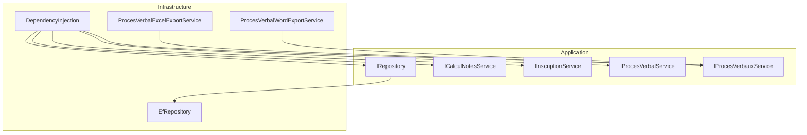
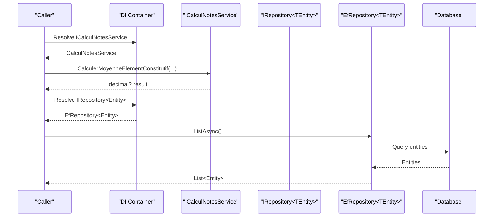
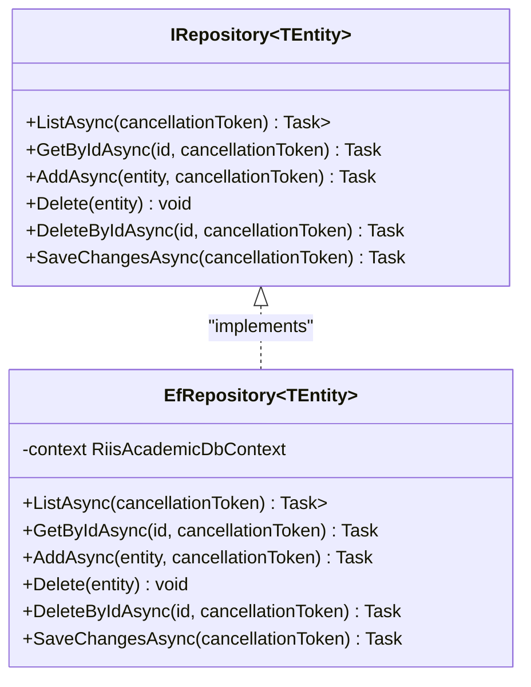
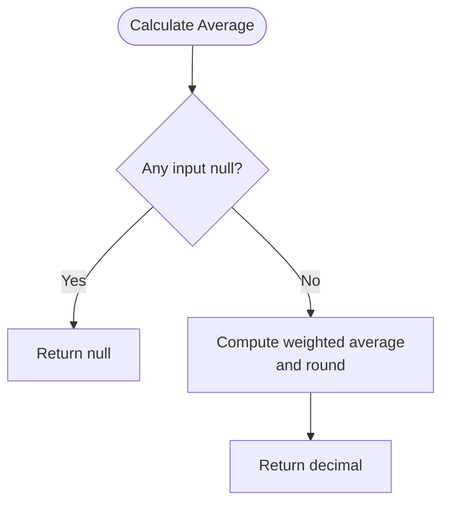
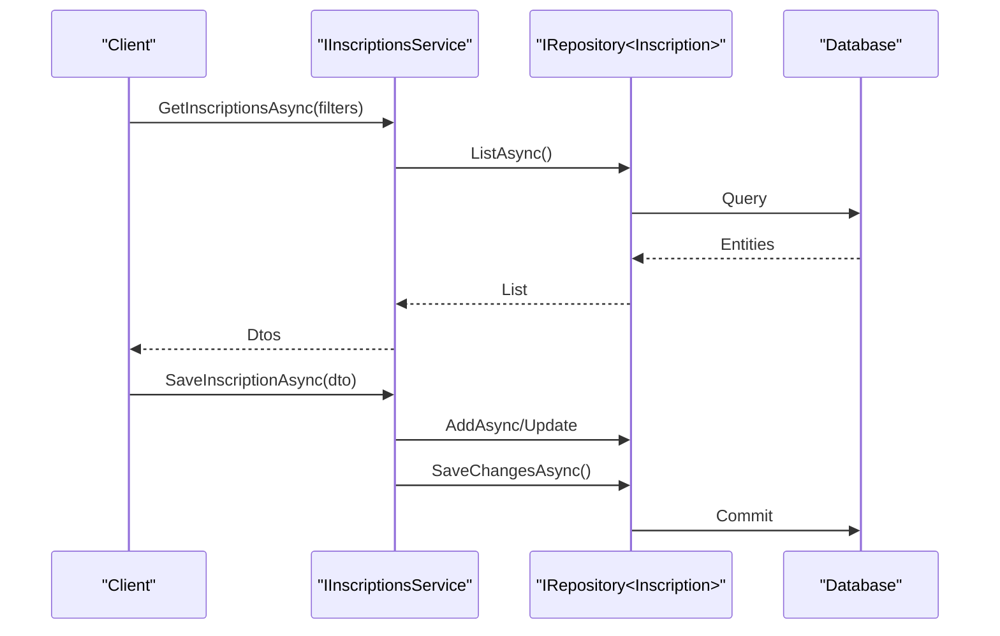
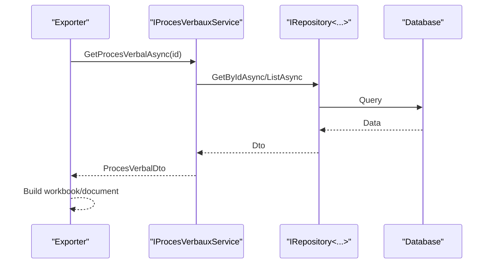
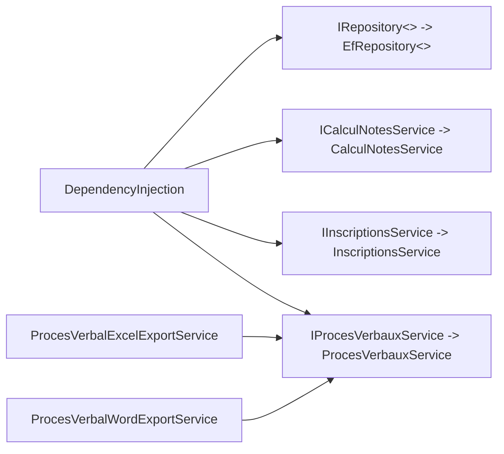

# External Integrations & Abstractions

<cite>
**Referenced Files in This Document**
- [IRepository.cs](file://RIIS.Academic.Application/Abstractions/Persistence/IRepository.cs)
- [EfRepository.cs](file://RIIS.Academic.Infrastructure/Persistence/Repositories/EfRepository.cs)
- [ICalculNotesService.cs](file://RIIS.Academic.Application/Abstractions/Services/ICalculNotesService.cs)
- [CalculNotesService.cs](file://RIIS.Academic.Application/Notes/Services/CalculNotesService.cs)
- [IInscriptionService.cs](file://RIIS.Academic.Application/Abstractions/Services/IInscriptionService.cs)
- [IInscriptionsService.cs](file://RIIS.Academic.Application/Inscriptions/Services/IInscriptionsService.cs)
- [IProcesVerbalService.cs](file://RIIS.Academic.Application/Abstractions/Services/IProcesVerbalService.cs)
- [IProcesVerbauxService.cs](file://RIIS.Academic.Application/ProcesVerbaux/Services/IProcesVerbauxService.cs)
- [DependencyInjection.cs](file://RIIS.Academic.Infrastructure/DependencyInjection.cs)
- [ProcesVerbalExcelExportService.cs](file://RIIS.Academic.Infrastructure/Documents/ProcesVerbalExcelExportService.cs)
- [ProcesVerbalWordExportService.cs](file://RIIS.Academic.Infrastructure/Documents/ProcesVerbalWordExportService.cs)
</cite>

## Table of Contents
1. [Introduction](#introduction)
2. [Project Structure](#project-structure)
3. [Core Components](#core-components)
4. [Architecture Overview](#architecture-overview)
5. [Detailed Component Analysis](#detailed-component-analysis)
6. [Dependency Analysis](#dependency-analysis)
7. [Performance Considerations](#performance-considerations)
8. [Troubleshooting Guide](#troubleshooting-guide)
9. [Conclusion](#conclusion)
10. [Appendices](#appendices)

## Introduction
This document explains the external integration and abstraction interfaces defined in the Infrastructure Layer that enable loose coupling, testability, and pluggable integrations across the system. It focuses on:
- A generic data access abstraction for persistence (IRepository) with an Entity Framework implementation.
- Service abstractions for grade calculations (ICalculNotesService), enrollment operations (IInscriptionService), and official document processing (IProcesVerbalService).
- How these abstractions decouple layers, support mocking for tests, and allow alternative implementations to be plugged in via dependency injection.
- Error handling patterns and integration testing strategies grounded in the repository’s design.

## Project Structure
The relevant parts of the codebase are organized by layer:
- Application layer defines domain-facing abstractions and services (interfaces and service contracts).
- Infrastructure layer provides concrete implementations (Entity Framework repository, document export services) and wires them into the DI container.
- Domain models and DTOs are consumed by application services and infrastructure components.

**Diagram sources**
- [IRepository.cs:3-11](file://RIIS.Academic.Application/Abstractions/Persistence/IRepository.cs#L3-L11)
- [EfRepository.cs:6-32](file://RIIS.Academic.Infrastructure/Persistence/Repositories/EfRepository.cs#L6-L32)
- [ICalculNotesService.cs:6-10](file://RIIS.Academic.Application/Abstractions/Services/ICalculNotesService.cs#L6-L10)
- [IInscriptionService.cs:4-8](file://RIIS.Academic.Application/Abstractions/Services/IInscriptionService.cs#L4-L8)
- [IProcesVerbalService.cs:4-6](file://RIIS.Academic.Application/Abstractions/Services/IProcesVerbalService.cs#L4-L6)
- [IProcesVerbauxService.cs:7-30](file://RIIS.Academic.Application/ProcesVerbaux/Services/IProcesVerbauxService.cs#L7-L30)
- [DependencyInjection.cs:23-60](file://RIIS.Academic.Infrastructure/DependencyInjection.cs#L23-L60)
- [ProcesVerbalExcelExportService.cs:10-31](file://RIIS.Academic.Infrastructure/Documents/ProcesVerbalExcelExportService.cs#L10-L31)
- [ProcesVerbalWordExportService.cs:10-29](file://RIIS.Academic.Infrastructure/Documents/ProcesVerbalWordExportService.cs#L10-L29)

**Section sources**
- [IRepository.cs:3-11](file://RIIS.Academic.Application/Abstractions/Persistence/IRepository.cs#L3-L11)
- [EfRepository.cs:6-32](file://RIIS.Academic.Infrastructure/Persistence/Repositories/EfRepository.cs#L6-L32)
- [DependencyInjection.cs:23-60](file://RIIS.Academic.Infrastructure/DependencyInjection.cs#L23-L60)

## Core Components
- IRepository<TEntity>: Generic read/write abstraction over persistence with async list, get by id, add, delete, delete by id, and save changes.
- EfRepository<TEntity>: Concrete EF-based implementation using a DbContext; uses AsNoTracking for reads and standard EF change tracking for writes.
- ICalculNotesService: Pure calculation contract for academic scoring rules (weighted averages, eligibility for retakes, credits earned).
- IInscriptionService: Minimal enrollment lifecycle contract (create and validate).
- IProcesVerbalService: Contract to generate an official document (procès-verbal) for a class and semester.
- IProcesVerbauxService: Broader query and lookup surface for procès-verbaux used by export services.

These abstractions enable:
- Loose coupling: Consumers depend on interfaces, not EF or file formats.
- Testability: Interfaces can be mocked to isolate business logic.
- Pluggability: Different implementations can be registered via DI without changing consumers.

**Section sources**
- [IRepository.cs:3-11](file://RIIS.Academic.Application/Abstractions/Persistence/IRepository.cs#L3-L11)
- [EfRepository.cs:6-32](file://RIIS.Academic.Infrastructure/Persistence/Repositories/EfRepository.cs#L6-L32)
- [ICalculNotesService.cs:6-10](file://RIIS.Academic.Application/Abstractions/Services/ICalculNotesService.cs#L6-L10)
- [CalculNotesService.cs:7-23](file://RIIS.Academic.Application/Notes/Services/CalculNotesService.cs#L7-L23)
- [IInscriptionService.cs:4-8](file://RIIS.Academic.Application/Abstractions/Services/IInscriptionService.cs#L4-L8)
- [IProcesVerbalService.cs:4-6](file://RIIS.Academic.Application/Abstractions/Services/IProcesVerbalService.cs#L4-L6)
- [IProcesVerbauxService.cs:7-30](file://RIIS.Academic.Application/ProcesVerbaux/Services/IProcesVerbauxService.cs#L7-L30)

## Architecture Overview
The system follows clean architecture principles:
- Application layer defines stable contracts (interfaces).
- Infrastructure implements those contracts and wires them through DI.
- Export services depend on application services (e.g., IProcesVerbauxService) to produce Excel/Word outputs.

**Diagram sources**
- [DependencyInjection.cs:23-60](file://RIIS.Academic.Infrastructure/DependencyInjection.cs#L23-L60)
- [ICalculNotesService.cs:6-10](file://RIIS.Academic.Application/Abstractions/Services/ICalculNotesService.cs#L6-L10)
- [EfRepository.cs:6-32](file://RIIS.Academic.Infrastructure/Persistence/Repositories/EfRepository.cs#L6-L32)

## Detailed Component Analysis

### IRepository and EfRepository
- Purpose: Provide a consistent CRUD-like interface for any entity type.
- Key methods:
  - ListAsync: returns all entities without tracking for performance.
  - GetByIdAsync: retrieves a single entity by id.
  - AddAsync: stages new entities for persistence.
  - Delete/DeleteByIdAsync: removes entities by reference or id.
  - SaveChangesAsync: commits pending changes to the database.
- Implementation notes:
  - Uses EF Core DbContext under the hood.
  - Read queries use AsNoTracking to avoid unnecessary change tracking overhead.
  - DeleteByIdAsync safely handles missing entities.

**Diagram sources**
- [IRepository.cs:3-11](file://RIIS.Academic.Application/Abstractions/Persistence/IRepository.cs#L3-L11)
- [EfRepository.cs:6-32](file://RIIS.Academic.Infrastructure/Persistence/Repositories/EfRepository.cs#L6-L32)

**Section sources**
- [IRepository.cs:3-11](file://RIIS.Academic.Application/Abstractions/Persistence/IRepository.cs#L3-L11)
- [EfRepository.cs:6-32](file://RIIS.Academic.Infrastructure/Persistence/Repositories/EfRepository.cs#L6-L32)

### ICalculNotesService and CalculNotesService
- Purpose: Encapsulate academic scoring rules independent of persistence.
- Methods:
  - CalculerMoyenneElementConstituf: computes weighted average from component scores.
  - EstEligibleRattrapage: determines eligibility for retake based on threshold.
  - CalculerCreditsAcquis: awards credits when passing threshold is met.
- Characteristics:
  - Stateless, deterministic functions suitable for unit testing.
  - No side effects; easy to mock or replace if rules change.

**Diagram sources**
- [ICalculNotesService.cs:6-10](file://RIIS.Academic.Application/Abstractions/Services/ICalculNotesService.cs#L6-L10)
- [CalculNotesService.cs:7-23](file://RIIS.Academic.Application/Notes/Services/CalculNotesService.cs#L7-L23)

**Section sources**
- [ICalculNotesService.cs:6-10](file://RIIS.Academic.Application/Abstractions/Services/ICalculNotesService.cs#L6-L10)
- [CalculNotesService.cs:7-23](file://RIIS.Academic.Application/Notes/Services/CalculNotesService.cs#L7-L23)

### IInscriptionService and IInscriptionsService
- IInscriptionService: Minimal enrollment lifecycle (create and validate).
- IInscriptionsService: Full CRUD and lookup surface for enrollments, including filters and dropdown lookups.
- Use cases:
  - Create default enrollment templates.
  - Persist and delete enrollment records.
  - Retrieve filtered lists and lookup values for UIs.

**Diagram sources**
- [IInscriptionsService.cs:6-31](file://RIIS.Academic.Application/Inscriptions/Services/IInscriptionsService.cs#L6-L31)
- [IRepository.cs:3-11](file://RIIS.Academic.Application/Abstractions/Persistence/IRepository.cs#L3-L11)

**Section sources**
- [IInscriptionService.cs:4-8](file://RIIS.Academic.Application/Abstractions/Services/IInscriptionService.cs#L4-L8)
- [IInscriptionsService.cs:6-31](file://RIIS.Academic.Application/Inscriptions/Services/IInscriptionsService.cs#L6-L31)

### IProcesVerbalService and IProcesVerbauxService
- IProcesVerbalService: Generates an official document for a given class and semester.
- IProcesVerbauxService: Provides querying and lookup capabilities for procès-verbaux used by export services.
- Export services depend on IProcesVerbauxService to build Excel and Word documents.

**Diagram sources**
- [IProcesVerbauxService.cs:7-30](file://RIIS.Academic.Application/ProcesVerbaux/Services/IProcesVerbauxService.cs#L7-L30)
- [ProcesVerbalExcelExportService.cs:10-31](file://RIIS.Academic.Infrastructure/Documents/ProcesVerbalExcelExportService.cs#L10-L31)
- [ProcesVerbalWordExportService.cs:10-29](file://RIIS.Academic.Infrastructure/Documents/ProcesVerbalWordExportService.cs#L10-L29)

**Section sources**
- [IProcesVerbalService.cs:4-6](file://RIIS.Academic.Application/Abstractions/Services/IProcesVerbalService.cs#L4-L6)
- [IProcesVerbauxService.cs:7-30](file://RIIS.Academic.Application/ProcesVerbaux/Services/IProcesVerbauxService.cs#L7-L30)
- [ProcesVerbalExcelExportService.cs:10-31](file://RIIS.Academic.Infrastructure/Documents/ProcesVerbalExcelExportService.cs#L10-L31)
- [ProcesVerbalWordExportService.cs:10-29](file://RIIS.Academic.Infrastructure/Documents/ProcesVerbalWordExportService.cs#L10-L29)

## Dependency Analysis
- DI registration binds interfaces to concrete types in the Infrastructure layer.
- Repository abstraction decouples application services from EF details.
- Export services depend on application services (not directly on repositories), preserving layer boundaries.

**Diagram sources**
- [DependencyInjection.cs:23-60](file://RIIS.Academic.Infrastructure/DependencyInjection.cs#L23-L60)

**Section sources**
- [DependencyInjection.cs:23-60](file://RIIS.Academic.Infrastructure/DependencyInjection.cs#L23-L60)

## Performance Considerations
- Reads use AsNoTracking to reduce memory and change-tracking overhead.
- Prefer filtering at the source where possible to minimize payload sizes.
- For large exports, consider streaming or pagination in future enhancements.
- Keep calculation services stateless to avoid shared mutable state and improve concurrency safety.

[No sources needed since this section provides general guidance]

## Troubleshooting Guide
Common issues and remedies:
- Missing connection string: The DI configuration throws when a required connection string is not found. Ensure environment-specific settings are present.
- Null results: Many services return null for not-found entities; callers should handle null gracefully.
- Validation errors: Services may throw exceptions for invalid inputs; wrap calls with appropriate error handling in higher layers.

Practical checks:
- Verify DI registrations include all required services.
- Confirm repository methods are called within proper lifetimes (scoped contexts).
- For exports, ensure underlying data exists before generating files.

**Section sources**
- [DependencyInjection.cs:63-73](file://RIIS.Academic.Infrastructure/DependencyInjection.cs#L63-L73)

## Conclusion
The abstractions in the Application layer and their Infrastructure implementations provide a clean separation of concerns:
- IRepository abstracts persistence, enabling EF or alternative stores.
- Service interfaces encapsulate domain behavior (calculations, enrollment, document generation).
- DI wiring centralizes composition and supports swapping implementations.
This design promotes testability, maintainability, and extensibility while keeping cross-cutting concerns isolated.

[No sources needed since this section summarizes without analyzing specific files]

## Appendices

### Pluggable Integration Strategies
- Replace repository: Implement a custom IRepository<T> and register it in DI instead of EfRepository<T>.
- Swap calculation rules: Provide an alternate ICalculNotesService implementation and register it in DI.
- New export formats: Implement additional exporters depending on IProcesVerbauxService and register them.

### Error Handling Patterns
- Use null returns for optional resources (e.g., GetByIdAsync returning null).
- Throw explicit exceptions for invalid inputs or configuration issues.
- Propagate cancellation tokens through async operations to support responsive cancellation.

### Integration Testing Approaches
- Use an in-memory or test database with EF Core to exercise EfRepository against real queries.
- Mock ICalulNotesService to isolate persistence tests from business rule changes.
- For export services, assert generated content structure and metadata rather than exact byte sequences.

[No sources needed since this section provides general guidance]