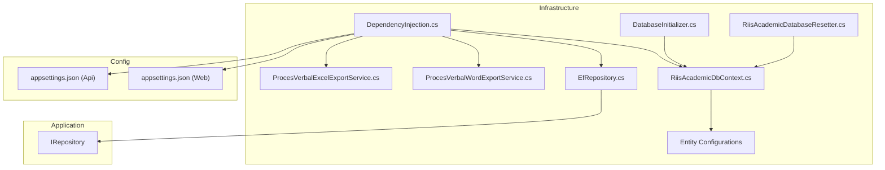
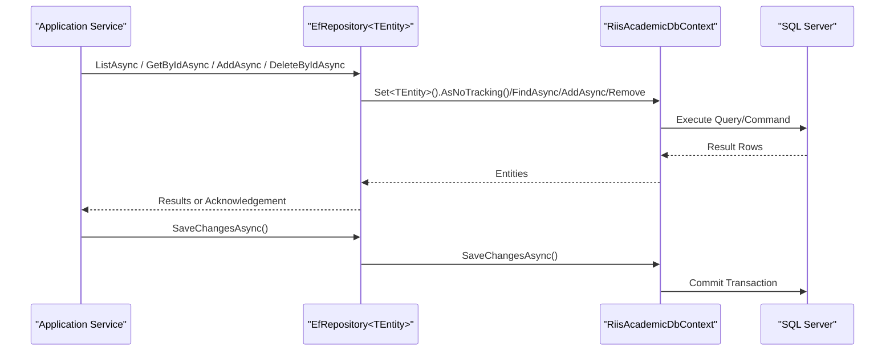
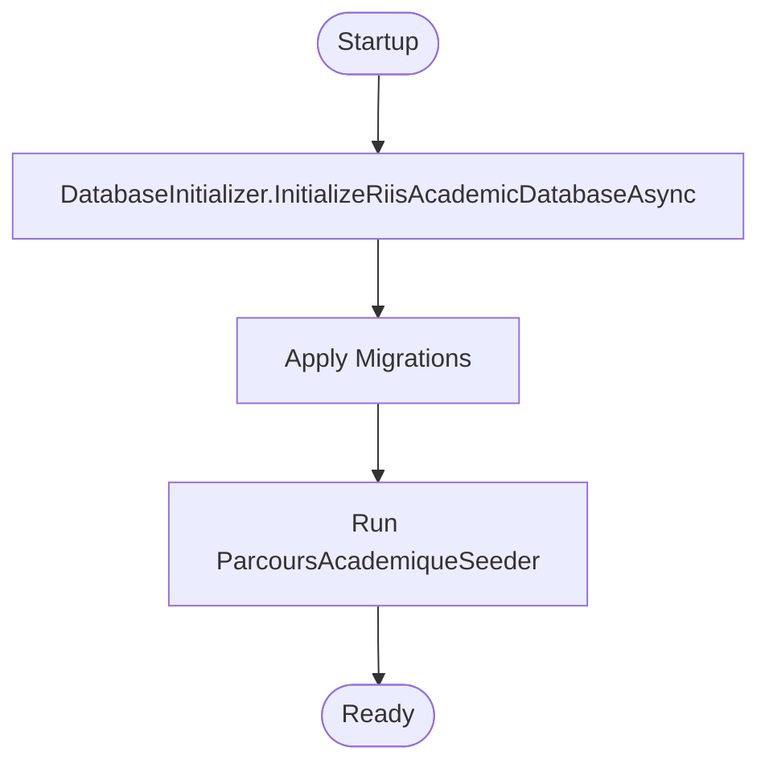
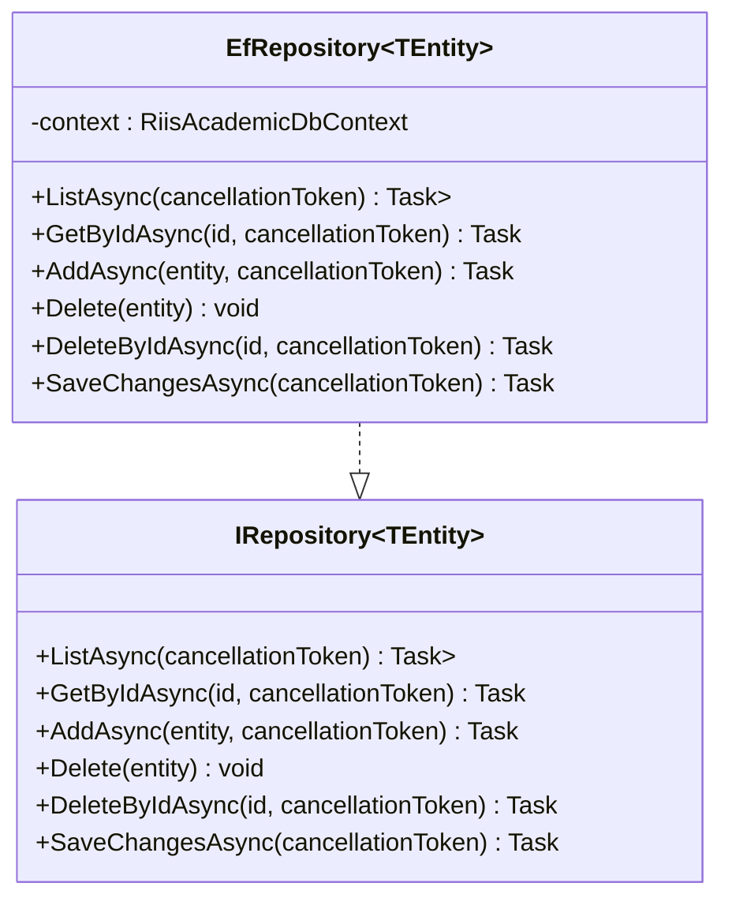
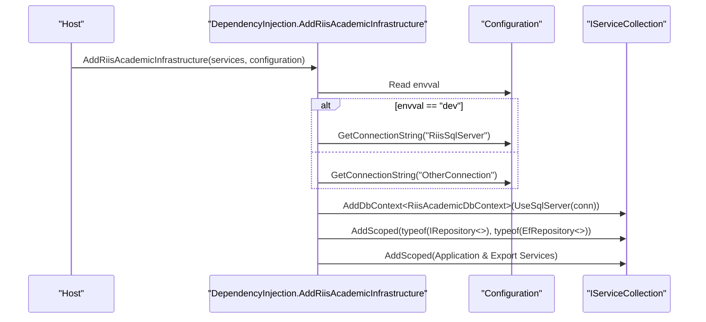
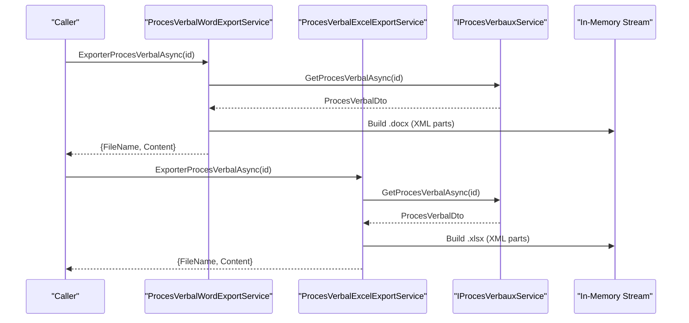
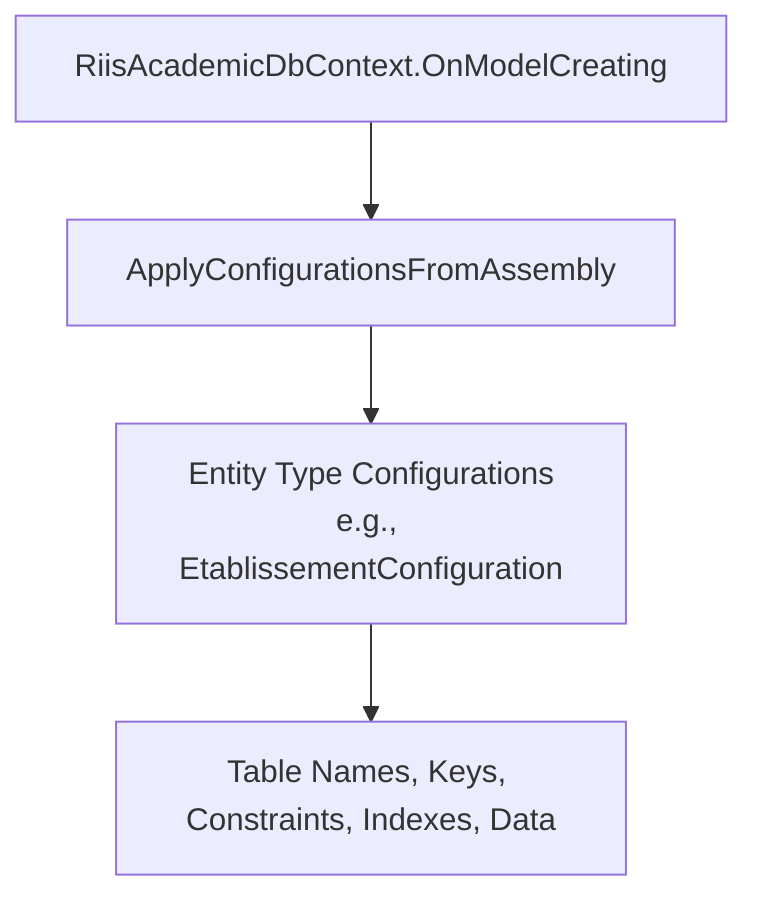
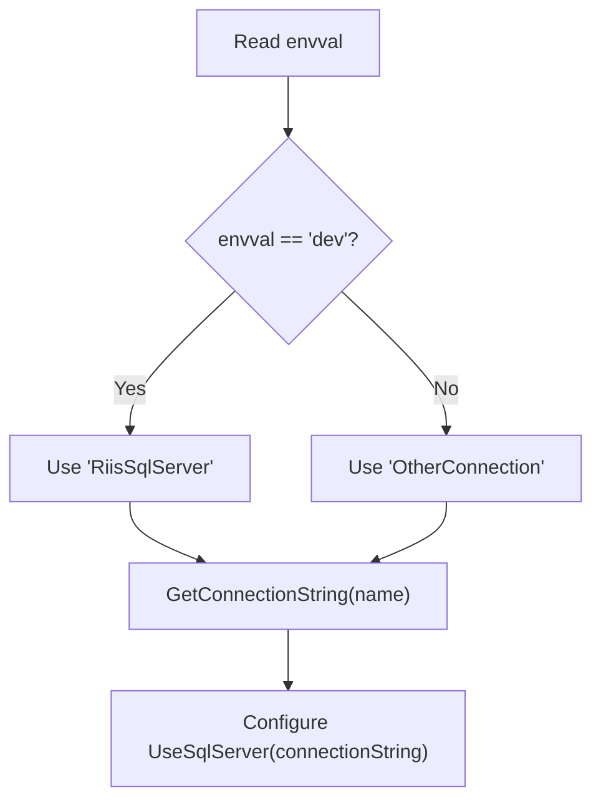
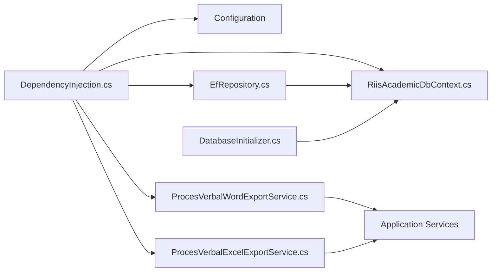

# Infrastructure Layer

<cite>
**Referenced Files in This Document**
- [DependencyInjection.cs](file://RIIS.Academic.Infrastructure/DependencyInjection.cs)
- [RiisAcademicDbContext.cs](file://RIIS.Academic.Infrastructure/Persistence/RiisAcademicDbContext.cs)
- [EfRepository.cs](file://RIIS.Academic.Infrastructure/Persistence/Repositories/EfRepository.cs)
- [IRepository.cs](file://RIIS.Academic.Application/Abstractions/Persistence/IRepository.cs)
- [DatabaseInitializer.cs](file://RIIS.Academic.Infrastructure/Persistence/DatabaseInitializer.cs)
- [RiisAcademicDatabaseResetter.cs](file://RIIS.Academic.Infrastructure/Persistence/RiisAcademicDatabaseResetter.cs)
- [ParcoursAcademiqueSeeder.cs](file://RIIS.Academic.Infrastructure/Persistence/Seeders/ParcoursAcademiqueSeeder.cs)
- [EtablissementConfiguration.cs](file://RIIS.Academic.Infrastructure/Persistence/Configurations/Etablissements/EtablissementConfiguration.cs)
- [ProcesVerbalWordExportService.cs](file://RIIS.Academic.Infrastructure/Documents/ProcesVerbalWordExportService.cs)
- [ProcesVerbalExcelExportService.cs](file://RIIS.Academic.Infrastructure/Documents/ProcesVerbalExcelExportService.cs)
- [appsettings.json (Web)](file://RIIS.Academic.Web/appsettings.json)
- [appsettings.json (Api)](file://RIIS.Academic.Api/appsettings.json)
</cite>

## Table of Contents
1. Introduction
2. Project Structure
3. Core Components
4. Architecture Overview
5. Detailed Component Analysis
6. Dependency Analysis
7. Performance Considerations
8. Troubleshooting Guide
9. Conclusion

## Introduction
This document explains the Infrastructure Layer’s technical implementations and external integrations for the RIIS Academic system. It covers Entity Framework Core configuration, entity mappings, database schema management, a generic repository implementation, dependency injection setup, and document generation services for Word and Excel exports. It also details migration strategy, connection string management, and environment-specific configurations.

## Project Structure
The Infrastructure Layer is organized around persistence, dependency injection, seeding/migrations, and document generation:
- Persistence: DbContext, entity configurations, repositories, seeders, and database utilities
- Documents: Word and Excel export services that generate Office Open XML documents from domain data
- Configuration: DI registration and environment-based connection string resolution

**Diagram sources**
- [DependencyInjection.cs:25-60](file://RIIS.Academic.Infrastructure/DependencyInjection.cs#L25-L60)
- [RiisAcademicDbContext.cs:6-49](file://RIIS.Academic.Infrastructure/Persistence/RiisAcademicDbContext.cs#L6-L49)
- [EfRepository.cs:6-33](file://RIIS.Academic.Infrastructure/Persistence/Repositories/EfRepository.cs#L6-L33)
- [IRepository.cs:3-12](file://RIIS.Academic.Application/Abstractions/Persistence/IRepository.cs#L3-L12)
- [DatabaseInitializer.cs:8-21](file://RIIS.Academic.Infrastructure/Persistence/DatabaseInitializer.cs#L8-L21)
- [RiisAcademicDatabaseResetter.cs:7-63](file://RIIS.Academic.Infrastructure/Persistence/RiisAcademicDatabaseResetter.cs#L7-L63)
- [ProcesVerbalWordExportService.cs:10-31](file://RIIS.Academic.Infrastructure/Documents/ProcesVerbalWordExportService.cs#L10-L31)
- [ProcesVerbalExcelExportService.cs:10-32](file://RIIS.Academic.Infrastructure/Documents/ProcesVerbalExcelExportService.cs#L10-L32)
- [appsettings.json (Web):1-23](file://RIIS.Academic.Web/appsettings.json#L1-L23)
- [appsettings.json (Api):1-7](file://RIIS.Academic.Api/appsettings.json#L1-L7)

**Section sources**
- [DependencyInjection.cs:25-60](file://RIIS.Academic.Infrastructure/DependencyInjection.cs#L25-L60)
- [RiisAcademicDbContext.cs:6-49](file://RIIS.Academic.Infrastructure/Persistence/RiisAcademicDbContext.cs#L6-L49)
- [EfRepository.cs:6-33](file://RIIS.Academic.Infrastructure/Persistence/Repositories/EfRepository.cs#L6-L33)
- [IRepository.cs:3-12](file://RIIS.Academic.Application/Abstractions/Persistence/IRepository.cs#L3-L12)
- [DatabaseInitializer.cs:8-21](file://RIIS.Academic.Infrastructure/Persistence/DatabaseInitializer.cs#L8-L21)
- [RiisAcademicDatabaseResetter.cs:7-63](file://RIIS.Academic.Infrastructure/Persistence/RiisAcademicDatabaseResetter.cs#L7-L63)
- [ProcesVerbalWordExportService.cs:10-31](file://RIIS.Academic.Infrastructure/Documents/ProcesVerbalWordExportService.cs#L10-L31)
- [ProcesVerbalExcelExportService.cs:10-32](file://RIIS.Academic.Infrastructure/Documents/ProcesVerbalExcelExportService.cs#L10-L32)
- [appsettings.json (Web):1-23](file://RIIS.Academic.Web/appsettings.json#L1-L23)
- [appsettings.json (Api):1-7](file://RIIS.Academic.Api/appsettings.json#L1-L7)

## Core Components
- RiisAcademicDbContext: Central EF Core context exposing DbSets for all domain entities and applying entity configurations via assembly scanning.
- EfRepository<TEntity>: Generic repository implementing IRepository<TEntity> with async CRUD operations and SaveChangesAsync.
- DependencyInjection: Registers DbContext, repository, application services, and document export services; resolves environment-specific connection strings.
- DatabaseInitializer: Applies migrations and runs seeders at startup.
- RiisAcademicDatabaseResetter: Provides safe, transactional reset of non-referential data.
- Export Services: Generate Word (.docx) and Excel (.xlsx) files using Office Open XML structures without third-party libraries.

**Section sources**
- [RiisAcademicDbContext.cs:6-49](file://RIIS.Academic.Infrastructure/Persistence/RiisAcademicDbContext.cs#L6-L49)
- [EfRepository.cs:6-33](file://RIIS.Academic.Infrastructure/Persistence/Repositories/EfRepository.cs#L6-L33)
- [DependencyInjection.cs:25-60](file://RIIS.Academic.Infrastructure/DependencyInjection.cs#L25-L60)
- [DatabaseInitializer.cs:8-21](file://RIIS.Academic.Infrastructure/Persistence/DatabaseInitializer.cs#L8-L21)
- [RiisAcademicDatabaseResetter.cs:7-63](file://RIIS.Academic.Infrastructure/Persistence/RiisAcademicDatabaseResetter.cs#L7-L63)
- [ProcesVerbalWordExportService.cs:10-31](file://RIIS.Academic.Infrastructure/Documents/ProcesVerbalWordExportService.cs#L10-L31)
- [ProcesVerbalExcelExportService.cs:10-32](file://RIIS.Academic.Infrastructure/Documents/ProcesVerbalExcelExportService.cs#L10-L32)

## Architecture Overview
The Infrastructure Layer bridges Application services to SQL Server via EF Core, while providing reusable persistence abstractions and document generation capabilities.

**Diagram sources**
- [EfRepository.cs:9-32](file://RIIS.Academic.Infrastructure/Persistence/Repositories/EfRepository.cs#L9-L32)
- [RiisAcademicDbContext.cs:6-49](file://RIIS.Academic.Infrastructure/Persistence/RiisAcademicDbContext.cs#L6-L49)

## Detailed Component Analysis

### Entity Framework Core and Schema Management
- Context: Declares DbSets for all domain entities and applies configurations from the same assembly.
- Migrations: Applied at startup via DatabaseInitializer which calls MigrateAsync before seeding.
- Seeders: ParcoursAcademiqueSeeder creates academic pathways based on existing reference data.
- Reset Utility: RiisAcademicDatabaseResetter clears business data in a single transaction with explicit confirmation.

**Diagram sources**
- [DatabaseInitializer.cs:8-21](file://RIIS.Academic.Infrastructure/Persistence/DatabaseInitializer.cs#L8-L21)
- [ParcoursAcademiqueSeeder.cs:51-118](file://RIIS.Academic.Infrastructure/Persistence/Seeders/ParcoursAcademiqueSeeder.cs#L51-L118)

**Section sources**
- [RiisAcademicDbContext.cs:6-49](file://RIIS.Academic.Infrastructure/Persistence/RiisAcademicDbContext.cs#L6-L49)
- [DatabaseInitializer.cs:8-21](file://RIIS.Academic.Infrastructure/Persistence/DatabaseInitializer.cs#L8-L21)
- [ParcoursAcademiqueSeeder.cs:51-118](file://RIIS.Academic.Infrastructure/Persistence/Seeders/ParcoursAcademiqueSeeder.cs#L51-L118)
- [RiisAcademicDatabaseResetter.cs:7-63](file://RIIS.Academic.Infrastructure/Persistence/RiisAcademicDatabaseResetter.cs#L7-L63)

### Repository Pattern Implementation
- Abstraction: IRepository<TEntity> defines ListAsync, GetByIdAsync, AddAsync, Delete, DeleteByIdAsync, SaveChangesAsync.
- Concrete: EfRepository<TEntity> implements these methods using EF Core with AsNoTracking for reads and standard tracking for writes.

**Diagram sources**
- [IRepository.cs:3-12](file://RIIS.Academic.Application/Abstractions/Persistence/IRepository.cs#L3-L12)
- [EfRepository.cs:6-33](file://RIIS.Academic.Infrastructure/Persistence/Repositories/EfRepository.cs#L6-L33)

**Section sources**
- [IRepository.cs:3-12](file://RIIS.Academic.Application/Abstractions/Persistence/IRepository.cs#L3-L12)
- [EfRepository.cs:6-33](file://RIIS.Academic.Infrastructure/Persistence/Repositories/EfRepository.cs#L6-L33)

### Dependency Injection Setup
- Registers RiisAcademicDbContext with SQL Server provider and transient lifetime.
- Binds IRepository<TEntity> to EfRepository<TEntity>.
- Registers application services and document export services as scoped.
- Resolves connection string by environment variable envval: dev selects RiisSqlServer; otherwise OtherConnection.

**Diagram sources**
- [DependencyInjection.cs:25-73](file://RIIS.Academic.Infrastructure/DependencyInjection.cs#L25-L73)
- [appsettings.json (Web):1-23](file://RIIS.Academic.Web/appsettings.json#L1-L23)

**Section sources**
- [DependencyInjection.cs:25-73](file://RIIS.Academic.Infrastructure/DependencyInjection.cs#L25-L73)
- [appsettings.json (Web):1-23](file://RIIS.Academic.Web/appsettings.json#L1-L23)

### Document Generation Services
- Word Export: Builds an Office Open XML .docx package in memory, composing content types, relationships, styles, and a dynamic document.xml table based on the process-verbal data.
- Excel Export: Builds an Office Open XML .xlsx workbook with a styled worksheet, merged headers, frozen panes, and print settings.
- Both services accept a process-verbal ID, fetch data via application service, and return file name plus binary content.

**Diagram sources**
- [ProcesVerbalWordExportService.cs:12-45](file://RIIS.Academic.Infrastructure/Documents/ProcesVerbalWordExportService.cs#L12-L45)
- [ProcesVerbalExcelExportService.cs:14-50](file://RIIS.Academic.Infrastructure/Documents/ProcesVerbalExcelExportService.cs#L14-L50)

**Section sources**
- [ProcesVerbalWordExportService.cs:12-45](file://RIIS.Academic.Infrastructure/Documents/ProcesVerbalWordExportService.cs#L12-L45)
- [ProcesVerbalExcelExportService.cs:14-50](file://RIIS.Academic.Infrastructure/Documents/ProcesVerbalExcelExportService.cs#L14-L50)

### Entity Mapping and Database Schema
- The DbContext registers many DbSets covering students, evaluations, results, programs, referentials, school administration, and related entities.
- Entity configurations are applied via assembly scanning; example shows Etablissement mapping including table name, key, property lengths, unique filtered index, and sample data.

**Diagram sources**
- [RiisAcademicDbContext.cs:46-49](file://RIIS.Academic.Infrastructure/Persistence/RiisAcademicDbContext.cs#L46-L49)
- [EtablissementConfiguration.cs:8-49](file://RIIS.Academic.Infrastructure/Persistence/Configurations/Etablissements/EtablissementConfiguration.cs#L8-L49)

**Section sources**
- [RiisAcademicDbContext.cs:9-44](file://RIIS.Academic.Infrastructure/Persistence/RiisAcademicDbContext.cs#L9-L44)
- [EtablissementConfiguration.cs:8-49](file://RIIS.Academic.Infrastructure/Persistence/Configurations/Etablissements/EtablissementConfiguration.cs#L8-L49)

### Connection String Management and Environment-Specific Configuration
- Environment selection: Reads envval from configuration; dev uses RiisSqlServer; other values use OtherConnection.
- Web appsettings includes both named connections and envval set to dev.
- Api appsettings includes a default connection string under a different name; ensure the host wiring matches the DI expectation.

**Diagram sources**
- [DependencyInjection.cs:63-73](file://RIIS.Academic.Infrastructure/DependencyInjection.cs#L63-L73)
- [appsettings.json (Web):1-23](file://RIIS.Academic.Web/appsettings.json#L1-L23)
- [appsettings.json (Api):1-7](file://RIIS.Academic.Api/appsettings.json#L1-L7)

**Section sources**
- [DependencyInjection.cs:63-73](file://RIIS.Academic.Infrastructure/DependencyInjection.cs#L63-L73)
- [appsettings.json (Web):1-23](file://RIIS.Academic.Web/appsettings.json#L1-L23)
- [appsettings.json (Api):1-7](file://RIIS.Academic.Api/appsettings.json#L1-L7)

## Dependency Analysis
- DI layer depends on Configuration and registers DbContext, repository, application services, and export services.
- Repository depends on DbContext and implements the application’s persistence abstraction.
- Export services depend on application services to retrieve domain data and produce Office Open XML packages.
- DatabaseInitializer orchestrates migrations and seeding.

**Diagram sources**
- [DependencyInjection.cs:25-60](file://RIIS.Academic.Infrastructure/DependencyInjection.cs#L25-L60)
- [EfRepository.cs:6-33](file://RIIS.Academic.Infrastructure/Persistence/Repositories/EfRepository.cs#L6-L33)
- [RiisAcademicDbContext.cs:6-49](file://RIIS.Academic.Infrastructure/Persistence/RiisAcademicDbContext.cs#L6-L49)
- [ProcesVerbalWordExportService.cs:10-31](file://RIIS.Academic.Infrastructure/Documents/ProcesVerbalWordExportService.cs#L10-L31)
- [ProcesVerbalExcelExportService.cs:10-32](file://RIIS.Academic.Infrastructure/Documents/ProcesVerbalExcelExportService.cs#L10-L32)
- [DatabaseInitializer.cs:8-21](file://RIIS.Academic.Infrastructure/Persistence/DatabaseInitializer.cs#L8-L21)

**Section sources**
- [DependencyInjection.cs:25-60](file://RIIS.Academic.Infrastructure/DependencyInjection.cs#L25-L60)
- [EfRepository.cs:6-33](file://RIIS.Academic.Infrastructure/Persistence/Repositories/EfRepository.cs#L6-L33)
- [RiisAcademicDbContext.cs:6-49](file://RIIS.Academic.Infrastructure/Persistence/RiisAcademicDbContext.cs#L6-L49)
- [ProcesVerbalWordExportService.cs:10-31](file://RIIS.Academic.Infrastructure/Documents/ProcesVerbalWordExportService.cs#L10-L31)
- [ProcesVerbalExcelExportService.cs:10-32](file://RIIS.Academic.Infrastructure/Documents/ProcesVerbalExcelExportService.cs#L10-L32)
- [DatabaseInitializer.cs:8-21](file://RIIS.Academic.Infrastructure/Persistence/DatabaseInitializer.cs#L8-L21)

## Performance Considerations
- Read queries use AsNoTracking to avoid change-tracking overhead when entities are not modified.
- In-memory ZIP archives are used for document generation to minimize disk I/O.
- Scoped lifetimes for services and DbContext per request reduce contention and improve throughput.
- Large tables benefit from appropriate indexes; ensure filters and projections are used where possible.

[No sources needed since this section provides general guidance]

## Troubleshooting Guide
- Missing connection string: If the selected connection name is absent, an exception is thrown during DI registration. Verify envval and corresponding connection entries.
- Migration failures: Ensure migrations exist and are applied; run initialization through DatabaseInitializer.
- Seed errors: Seeder requires reference data (cycles, levels, filieres, specialites). Validate their presence before running.
- Reset safety: Reset utility requires explicit confirmation; it operates within a transaction to maintain consistency.

**Section sources**
- [DependencyInjection.cs:63-73](file://RIIS.Academic.Infrastructure/DependencyInjection.cs#L63-L73)
- [DatabaseInitializer.cs:8-21](file://RIIS.Academic.Infrastructure/Persistence/DatabaseInitializer.cs#L8-L21)
- [ParcoursAcademiqueSeeder.cs:51-118](file://RIIS.Academic.Infrastructure/Persistence/Seeders/ParcoursAcademiqueSeeder.cs#L51-L118)
- [RiisAcademicDatabaseResetter.cs:7-63](file://RIIS.Academic.Infrastructure/Persistence/RiisAcademicDatabaseResetter.cs#L7-L63)

## Conclusion
The Infrastructure Layer provides a robust foundation for data access, persistence abstraction, environment-aware configuration, and document generation. Its design emphasizes separation of concerns, testability via abstractions, and efficient execution patterns. Proper configuration of environment variables and connection strings ensures smooth operation across environments, while migrations and seeders streamline deployment and onboarding.