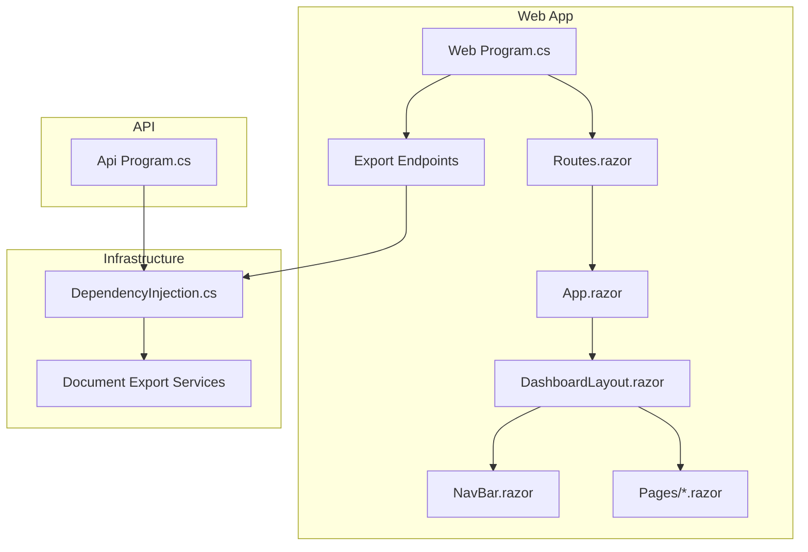
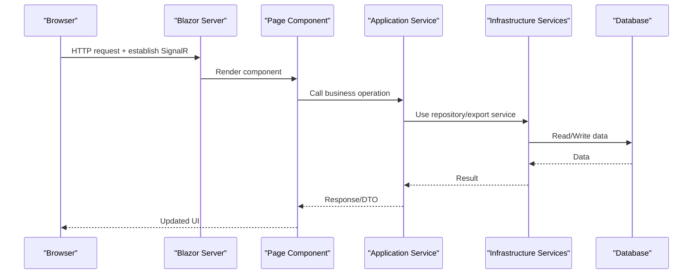
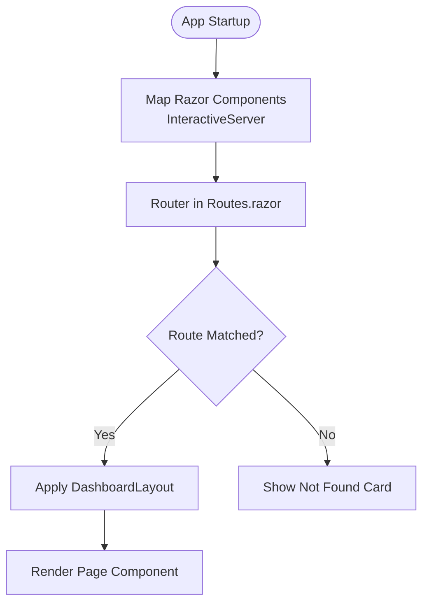
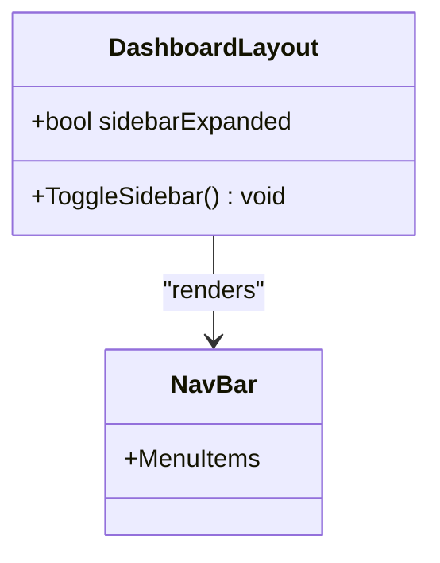
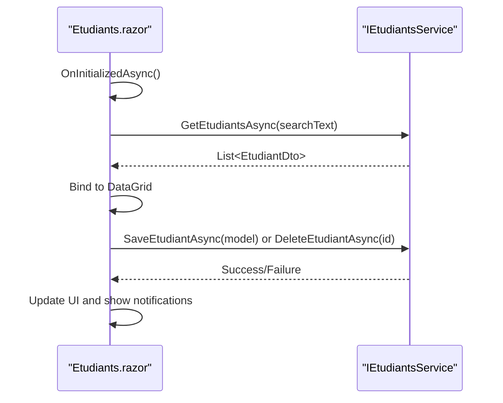
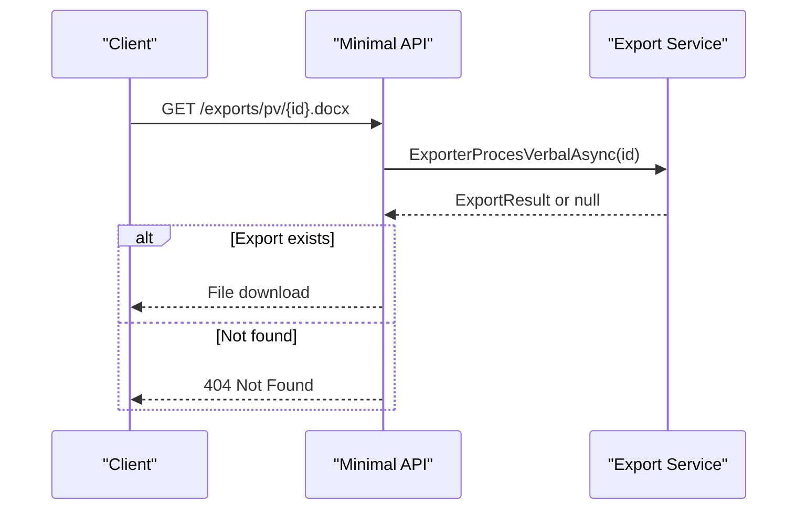
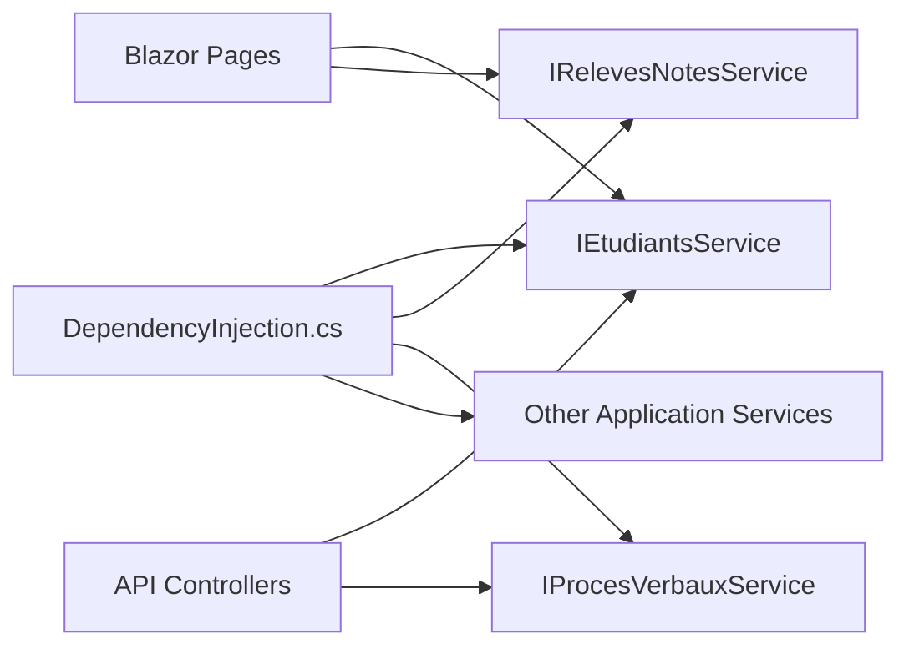
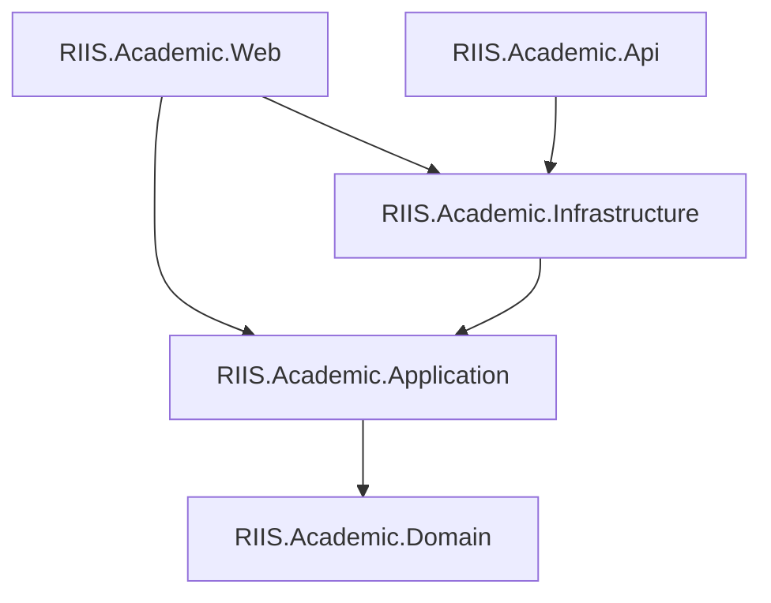

# Web & API Layer

<cite>
**Referenced Files in This Document**
- [Program.cs](file://RIIS.Academic.Web/Program.cs)
- [Routes.razor](file://RIIS.Academic.Web/Components/Routes.razor)
- [App.razor](file://RIIS.Academic.Web/Components/App.razor)
- [DashboardLayout.razor](file://RIIS.Academic.Web/Components/Layout/DashboardLayout.razor)
- [NavBar.razor](file://RIIS.Academic.Web/Components/Layout/NavBar.razor)
- [Dashboard.razor](file://RIIS.Academic.Web/Components/Pages/Dashboard.razor)
- [Etudiants.razor](file://RIIS.Academic.Web/Components/Pages/Etudiants.razor)
- [RiisAcademicExportEndpointExtensions.cs](file://RIIS.Academic.Web/Extensions/RiisAcademicExportEndpointExtensions.cs)
- [DependencyInjection.cs](file://RIIS.Academic.Infrastructure/DependencyInjection.cs)
- [Program.cs](file://RIIS.Academic.Api/Program.cs)
- [appsettings.json](file://RIIS.Academic.Web/appsettings.json)
- [appsettings.json](file://RIIS.Academic.Api/appsettings.json)
</cite>

## Table of Contents
1. Introduction
2. Project Structure
3. Core Components
4. Architecture Overview
5. Detailed Component Analysis
6. Dependency Analysis
7. Performance Considerations
8. Troubleshooting Guide
9. Conclusion

## Introduction
This document explains the Web and API presentation layers of the RIIS Academic Management System. It covers the Blazor Server architecture with Razor Components, component lifecycle and state management patterns, routing structure, ASP.NET Core Minimal API endpoints for document export, integration with application services via dependency injection, and configuration setup. It also clarifies how the Blazor UI components communicate with application services and how the minimal API exposes export endpoints that delegate to infrastructure services.

## Project Structure
The solution is organized into distinct projects:
- RIIS.Academic.Web: Blazor Server app hosting Razor Components and minimal export endpoints.
- RIIS.Academic.Api: Standalone ASP.NET Core API project (minimal controllers enabled).
- RIIS.Academic.Application: Application services and DTOs.
- RIIS.Academic.Infrastructure: Persistence, repositories, document export implementations, and DI registration.
- RIIS.Academic.Domain: Domain models and enums.

Key entry points:
- Web host bootstrap and Blazor server configuration in Program.cs.
- Export endpoints mapped via an extension method.
- Routes configured in Routes.razor with a default layout and not-found handling.
- Application services registered centrally in Infrastructure DI.

**Diagram sources**
- [Program.cs:8-26](file://RIIS.Academic.Web/Program.cs#L8-L26)
- [Routes.razor:1-15](file://RIIS.Academic.Web/Components/Routes.razor#L1-L15)
- [App.razor:1-20](file://RIIS.Academic.Web/Components/App.razor#L1-L20)
- [DashboardLayout.razor:1-33](file://RIIS.Academic.Web/Components/Layout/DashboardLayout.razor#L1-L33)
- [NavBar.razor:1-55](file://RIIS.Academic.Web/Components/Layout/NavBar.razor#L1-L55)
- [RiisAcademicExportEndpointExtensions.cs:9-92](file://RIIS.Academic.Web/Extensions/RiisAcademicExportEndpointExtensions.cs#L9-L92)
- [DependencyInjection.cs:25-60](file://RIIS.Academic.Infrastructure/DependencyInjection.cs#L25-L60)
- [Program.cs:5-17](file://RIIS.Academic.Api/Program.cs#L5-L17)

**Section sources**
- [Program.cs:8-26](file://RIIS.Academic.Web/Program.cs#L8-L26)
- [Routes.razor:1-15](file://RIIS.Academic.Web/Components/Routes.razor#L1-L15)
- [App.razor:1-20](file://RIIS.Academic.Web/Components/App.razor#L1-L20)
- [DashboardLayout.razor:1-33](file://RIIS.Academic.Web/Components/Layout/DashboardLayout.razor#L1-L33)
- [NavBar.razor:1-55](file://RIIS.Academic.Web/Components/Layout/NavBar.razor#L1-L55)
- [DependencyInjection.cs:25-60](file://RIIS.Academic.Infrastructure/DependencyInjection.cs#L25-L60)
- [Program.cs:5-17](file://RIIS.Academic.Api/Program.cs#L5-L17)

## Core Components
- Blazor Server pipeline: The web app registers Radzen components, Razor Components with interactive server mode, and wires up infrastructure services.
- Routing: Routes.razor configures the Router, sets a default layout, and provides a not-found page.
- Layouts: DashboardLayout.razor composes header, sidebar, and body content; NavBar.razor defines navigation links.
- Pages: Example pages like Dashboard.razor and Etudiants.razor demonstrate data loading, forms, grids, and service calls.
- Export endpoints: Minimal API endpoints under /exports return generated documents by delegating to application/infrastructure services.
- DI registration: All application and infrastructure services are registered in one place for reuse across Web and API.

**Section sources**
- [Program.cs:8-26](file://RIIS.Academic.Web/Program.cs#L8-L26)
- [Routes.razor:1-15](file://RIIS.Academic.Web/Components/Routes.razor#L1-L15)
- [DashboardLayout.razor:1-33](file://RIIS.Academic.Web/Components/Layout/DashboardLayout.razor#L1-L33)
- [NavBar.razor:1-55](file://RIIS.Academic.Web/Components/Layout/NavBar.razor#L1-L55)
- [Dashboard.razor:1-114](file://RIIS.Academic.Web/Components/Pages/Dashboard.razor#L1-L114)
- [Etudiants.razor:1-272](file://RIIS.Academic.Web/Components/Pages/Etudiants.razor#L1-L272)
- [RiisAcademicExportEndpointExtensions.cs:9-92](file://RIIS.Academic.Web/Extensions/RiisAcademicExportEndpointExtensions.cs#L9-L92)
- [DependencyInjection.cs:25-60](file://RIIS.Academic.Infrastructure/DependencyInjection.cs#L25-L60)

## Architecture Overview
The Blazor Server UI renders Razor Components on the server and maintains a persistent SignalR connection. Pages call application services injected via DI. For document generation, minimal API endpoints accept IDs and invoke export services to produce downloadable files. The API project is configured with controllers and EF Core context for potential future REST endpoints.

**Diagram sources**
- [Program.cs:8-26](file://RIIS.Academic.Web/Program.cs#L8-L26)
- [DependencyInjection.cs:25-60](file://RIIS.Academic.Infrastructure/DependencyInjection.cs#L25-L60)
- [Etudiants.razor:162-272](file://RIIS.Academic.Web/Components/Pages/Etudiants.razor#L162-L272)

## Detailed Component Analysis

### Blazor Server Setup and Routing
- Interactive server rendering is enabled, mapping Razor components with a default layout.
- Routes.razor uses the built-in Router, applies DashboardLayout by default, and shows a friendly not-found message.
- App.razor includes theme, static assets, and injects the router with interactive server render mode.

**Diagram sources**
- [Program.cs:17-22](file://RIIS.Academic.Web/Program.cs#L17-L22)
- [Routes.razor:1-15](file://RIIS.Academic.Web/Components/Routes.razor#L1-L15)
- [App.razor:1-20](file://RIIS.Academic.Web/Components/App.razor#L1-L20)

**Section sources**
- [Program.cs:17-22](file://RIIS.Academic.Web/Program.cs#L17-L22)
- [Routes.razor:1-15](file://RIIS.Academic.Web/Components/Routes.razor#L1-L15)
- [App.razor:1-20](file://RIIS.Academic.Web/Components/App.razor#L1-L20)

### Layout and Navigation
- DashboardLayout.razor composes header, collapsible sidebar, and page body using Radzen components.
- NavBar.razor defines grouped navigation entries for referentiels, programme pédagogique, académique, scolarité, and évaluations.

**Diagram sources**
- [DashboardLayout.razor:1-33](file://RIIS.Academic.Web/Components/Layout/DashboardLayout.razor#L1-L33)
- [NavBar.razor:1-55](file://RIIS.Academic.Web/Components/Layout/NavBar.razor#L1-L55)

**Section sources**
- [DashboardLayout.razor:1-33](file://RIIS.Academic.Web/Components/Layout/DashboardLayout.razor#L1-L33)
- [NavBar.razor:1-55](file://RIIS.Academic.Web/Components/Layout/NavBar.razor#L1-L55)

### Page Components: Lifecycle and State Management
- Etudiants.razor demonstrates:
  - OnInitializedAsync for initial data load.
  - Local state for model, search text, grid items, and form visibility.
  - Form submission with validation and error notifications.
  - CRUD operations via injected IEtudiantsService.
- Dashboard.razor demonstrates navigation and section-based shortcuts.

**Diagram sources**
- [Etudiants.razor:162-272](file://RIIS.Academic.Web/Components/Pages/Etudiants.razor#L162-L272)

**Section sources**
- [Etudiants.razor:1-272](file://RIIS.Academic.Web/Components/Pages/Etudiants.razor#L1-L272)
- [Dashboard.razor:1-114](file://RIIS.Academic.Web/Components/Pages/Dashboard.razor#L1-L114)

### Export Endpoints (Minimal API)
- Endpoints under /exports generate Word and Excel documents for procès-verbaux and relevés.
- Each endpoint resolves the appropriate export service from DI and returns either NotFound or a file result.

**Diagram sources**
- [RiisAcademicExportEndpointExtensions.cs:11-91](file://RIIS.Academic.Web/Extensions/RiisAcademicExportEndpointExtensions.cs#L11-L91)

**Section sources**
- [RiisAcademicExportEndpointExtensions.cs:9-92](file://RIIS.Academic.Web/Extensions/RiisAcademicExportEndpointExtensions.cs#L9-L92)

### Application Services Integration
- All application services (e.g., IEtudiantsService, IRelevesNotesService, IProcesVerbauxService) are registered in Infrastructure DI.
- Both Web and API can consume these services through DI, ensuring consistent behavior across UI and API layers.

**Diagram sources**
- [DependencyInjection.cs:25-60](file://RIIS.Academic.Infrastructure/DependencyInjection.cs#L25-L60)

**Section sources**
- [DependencyInjection.cs:25-60](file://RIIS.Academic.Infrastructure/DependencyInjection.cs#L25-L60)

### API Project Setup
- The API project enables controllers and EF Core with SQL Server.
- OpenAPI endpoints explorer is added for discovery.

**Section sources**
- [Program.cs:5-17](file://RIIS.Academic.Api/Program.cs#L5-L17)

## Dependency Analysis
- The Web project depends on Infrastructure for DI registration and database context.
- Export endpoints depend on application services which in turn use infrastructure services for persistence and document generation.
- The API project shares the same DI registration to access application services.

**Diagram sources**
- [Program.cs:8-26](file://RIIS.Academic.Web/Program.cs#L8-L26)
- [DependencyInjection.cs:25-60](file://RIIS.Academic.Infrastructure/DependencyInjection.cs#L25-L60)
- [Program.cs:5-17](file://RIIS.Academic.Api/Program.cs#L5-L17)

**Section sources**
- [Program.cs:8-26](file://RIIS.Academic.Web/Program.cs#L8-L26)
- [DependencyInjection.cs:25-60](file://RIIS.Academic.Infrastructure/DependencyInjection.cs#L25-L60)
- [Program.cs:5-17](file://RIIS.Academic.Api/Program.cs#L5-L17)

## Performance Considerations
- Blazor Server interactive rendering maintains a persistent connection; ensure proper scaling and connection limits.
- Use pagination, filtering, and sorting in DataGrid to reduce payload size and improve responsiveness.
- Export endpoints stream files directly; avoid unnecessary buffering and handle cancellation tokens for long-running exports.
- Configure logging levels appropriately to minimize overhead in production.

[No sources needed since this section provides general guidance]

## Troubleshooting Guide
- Not Found routes: Routes.razor displays a not-found card when no matching route is found. Verify page paths and menu entries.
- Export endpoints returning 404: Ensure the requested ID exists and the corresponding export service returns a non-null result.
- Database connectivity: Check connection strings in appsettings.json and environment selection logic in Infrastructure DI.
- Service resolution errors: Confirm all required services are registered in DependencyInjection.cs and that the correct project references exist.

**Section sources**
- [Routes.razor:6-13](file://RIIS.Academic.Web/Components/Routes.razor#L6-L13)
- [RiisAcademicExportEndpointExtensions.cs:11-91](file://RIIS.Academic.Web/Extensions/RiisAcademicExportEndpointExtensions.cs#L11-L91)
- [DependencyInjection.cs:63-73](file://RIIS.Academic.Infrastructure/DependencyInjection.cs#L63-L73)
- [appsettings.json:1-23](file://RIIS.Academic.Web/appsettings.json#L1-L23)
- [appsettings.json:1-7](file://RIIS.Academic.Api/appsettings.json#L1-L7)

## Conclusion
The RIIS Academic Management System’s Web layer uses Blazor Server with Razor Components for a responsive, server-rendered UI. Routing is centralized in Routes.razor with a consistent layout and user-friendly not-found handling. Pages follow clear lifecycle patterns and manage local state while delegating business logic to application services. Export functionality is exposed via minimal API endpoints that integrate seamlessly with infrastructure services for document generation. The shared DI registration ensures consistency between Web and API layers. Configuration is centralized in appsettings files, supporting multiple environments and databases.

[No sources needed since this section summarizes without analyzing specific files]