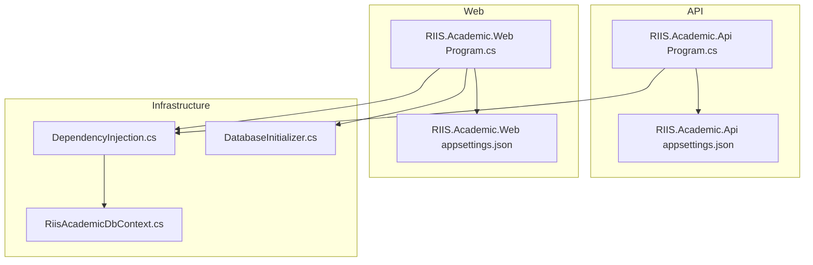
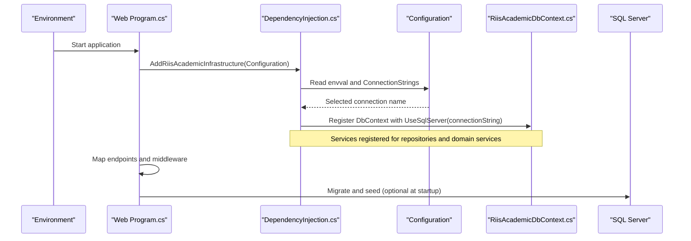
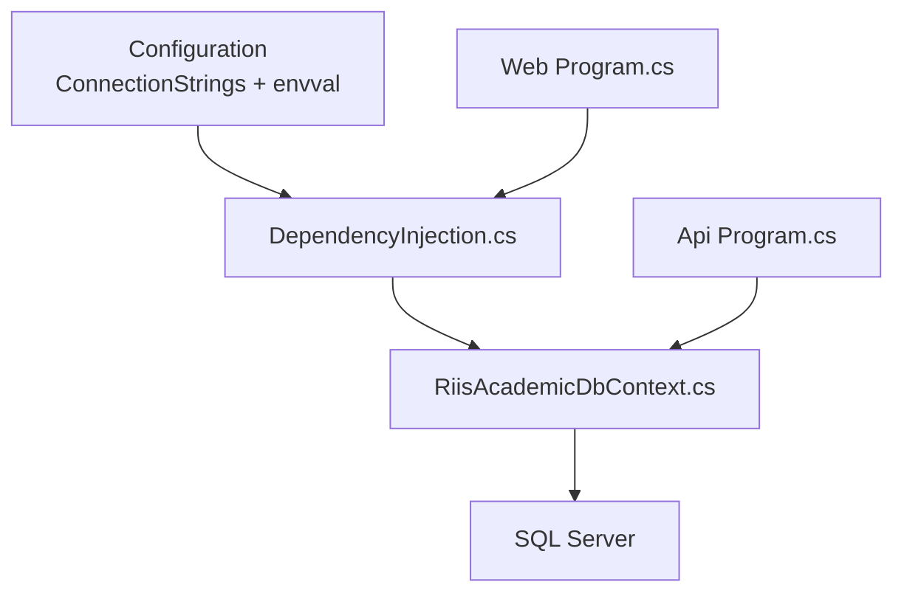

# Configuration & Deployment

<cite>
**Referenced Files in This Document**
- [Program.cs](file://RIIS.Academic.Api/Program.cs)
- [appsettings.json](file://RIIS.Academic.Api/appsettings.json)
- [launchSettings.json](file://RIIS.Academic.Api/Properties/launchSettings.json)
- [Program.cs](file://RIIS.Academic.Web/Program.cs)
- [appsettings.json](file://RIIS.Academic.Web/appsettings.json)
- [launchSettings.json](file://RIIS.Academic.Web/Properties/launchSettings.json)
- [DependencyInjection.cs](file://RIIS.Academic.Infrastructure/DependencyInjection.cs)
- [RiisAcademicDbContext.cs](file://RIIS.Academic.Infrastructure/Persistence/RiisAcademicDbContext.cs)
- [DatabaseInitializer.cs](file://RIIS.Academic.Infrastructure/Persistence/DatabaseInitializer.cs)
- [RIIS.Academic.Api.csproj](file://RIIS.Academic.Api/RIIS.Academic.Api.csproj)
- [RIIS.Academic.Web.csproj](file://RIIS.Academic.Web/RIIS.Academic.Web.csproj)
</cite>

## Table of Contents
1. Introduction
2. Project Structure
3. Core Components
4. Architecture Overview
5. Detailed Component Analysis
6. Dependency Analysis
7. Performance Considerations
8. Troubleshooting Guide
9. Conclusion

## Introduction
This document provides configuration and deployment guidance for the RIIS Academic Management System. It covers environment-specific settings, connection string management, application configuration, dependency injection setup, middleware configuration, security considerations, logging, monitoring integration points, performance tuning, and operational best practices. The system consists of an API project and a Blazor Web project that share infrastructure services and database access via Entity Framework Core.

## Project Structure
The solution is organized into layered projects:
- RIIS.Academic.Api: Minimal ASP.NET Core API entry point with controllers and EF registration.
- RIIS.Academic.Web: Blazor Server app with Radzen UI, infrastructure wiring, and export endpoints.
- RIIS.Academic.Infrastructure: Shared DI registration, EF DbContext, repositories, and document exports.
- RIIS.Academic.Application: Domain services and DTOs (not directly involved in configuration).
- RIIS.Academic.Domain: Domain models and enums.

**Diagram sources**
- [Program.cs:5-17](file://RIIS.Academic.Api/Program.cs#L5-L17)
- [appsettings.json:1-7](file://RIIS.Academic.Api/appsettings.json#L1-L7)
- [Program.cs:8-26](file://RIIS.Academic.Web/Program.cs#L8-L26)
- [appsettings.json:1-23](file://RIIS.Academic.Web/appsettings.json#L1-L23)
- [DependencyInjection.cs:23-74](file://RIIS.Academic.Infrastructure/DependencyInjection.cs#L23-L74)
- [RiisAcademicDbContext.cs:6-49](file://RIIS.Academic.Infrastructure/Persistence/RiisAcademicDbContext.cs#L6-L49)
- [DatabaseInitializer.cs:6-22](file://RIIS.Academic.Infrastructure/Persistence/DatabaseInitializer.cs#L6-L22)

**Section sources**
- [Program.cs:5-17](file://RIIS.Academic.Api/Program.cs#L5-L17)
- [Program.cs:8-26](file://RIIS.Academic.Web/Program.cs#L8-L26)
- [DependencyInjection.cs:23-74](file://RIIS.Academic.Infrastructure/DependencyInjection.cs#L23-L74)
- [RiisAcademicDbContext.cs:6-49](file://RIIS.Academic.Infrastructure/Persistence/RiisAcademicDbContext.cs#L6-L49)

## Core Components
- API startup registers controllers, EF DbContext, and minimal middleware.
- Web startup registers Radzen components, Razor interactive server components, infrastructure services, HTTPS redirection, static assets, antiforgery, routing, and custom export endpoints.
- Infrastructure DI wires EF DbContext, repository abstraction, and all application services plus document export services.
- DbContext declares entity sets and applies model configurations from assembly.
- Database initializer migrates schema and seeds data.

Key configuration locations:
- Connection strings are defined per project in their respective appsettings files.
- Environment selection for connection strings is driven by a custom key used in infrastructure DI.

**Section sources**
- [Program.cs:5-17](file://RIIS.Academic.Api/Program.cs#L5-L17)
- [Program.cs:8-26](file://RIIS.Academic.Web/Program.cs#L8-L26)
- [DependencyInjection.cs:23-74](file://RIIS.Academic.Infrastructure/DependencyInjection.cs#L23-L74)
- [RiisAcademicDbContext.cs:6-49](file://RIIS.Academic.Infrastructure/Persistence/RiisAcademicDbContext.cs#L6-L49)
- [DatabaseInitializer.cs:6-22](file://RIIS.Academic.Infrastructure/Persistence/DatabaseInitializer.cs#L6-L22)

## Architecture Overview
The runtime bootstrap sequence connects configuration to services and persistence:

**Diagram sources**
- [Program.cs:8-26](file://RIIS.Academic.Web/Program.cs#L8-L26)
- [DependencyInjection.cs:23-74](file://RIIS.Academic.Infrastructure/DependencyInjection.cs#L23-L74)
- [RiisAcademicDbContext.cs:6-49](file://RIIS.Academic.Infrastructure/Persistence/RiisAcademicDbContext.cs#L6-L49)

## Detailed Component Analysis

### Connection String Management
- The Web project defines multiple connection strings and selects one based on a custom environment key.
- The API project defines its own connection string for local development.

Behavior:
- Infrastructure DI reads a custom environment key to choose between two named connection strings in the Web project’s configuration.
- If the selected connection string is missing, startup fails with a clear error indicating the missing key.

Recommendations:
- Maintain separate connection strings per environment (development, staging, production).
- Store secrets using secure configuration providers (e.g., Azure Key Vault, AWS Secrets Manager, or container secret mounts).
- Avoid committing secrets to source control; use environment variables or secret stores at runtime.

**Section sources**
- [appsettings.json:1-23](file://RIIS.Academic.Web/appsettings.json#L1-L23)
- [DependencyInjection.cs:63-74](file://RIIS.Academic.Infrastructure/DependencyInjection.cs#L63-L74)
- [appsettings.json:1-7](file://RIIS.Academic.Api/appsettings.json#L1-L7)

### Application Settings and Environment Selection
- The Web project uses a custom key to switch connection strings.
- Logging levels and allowed hosts are configured in the Web project.
- Launch profiles set ASPNETCORE_ENVIRONMENT and URLs for local development.

Operational notes:
- Ensure the environment key matches expected values across environments.
- Adjust logging verbosity per environment (Information in dev, Warning or Error in prod).
- Restrict AllowedHosts in production to known hostnames.

**Section sources**
- [appsettings.json:7-14](file://RIIS.Academic.Web/appsettings.json#L7-L14)
- [launchSettings.json:1-12](file://RIIS.Academic.Web/Properties/launchSettings.json#L1-L12)
- [launchSettings.json:1-12](file://RIIS.Academic.Api/Properties/launchSettings.json#L1-L12)

### Dependency Injection and Service Registration
- All application services, repositories, and document export services are registered in infrastructure DI.
- DbContext is registered with transient lifetime for both context and options.
- Repository pattern abstracts persistence behind an interface.

Best practices:
- Keep service lifetimes appropriate (transient for DbContext in this design).
- Centralize registrations in one place to simplify maintenance.
- Avoid registering heavy services as singletons unless thread-safe.

**Section sources**
- [DependencyInjection.cs:23-60](file://RIIS.Academic.Infrastructure/DependencyInjection.cs#L23-L60)
- [RiisAcademicDbContext.cs:6-49](file://RIIS.Academic.Infrastructure/Persistence/RiisAcademicDbContext.cs#L6-L49)

### Middleware Setup
- HTTPS redirection is enabled in both projects.
- Static assets are mapped in the Web project.
- Antiforgery protection is enabled for forms in the Web project.
- Custom export endpoints are mapped via extension methods.

Security note:
- Ensure HTTPS is enforced in production and configure proper TLS termination at the reverse proxy if needed.

**Section sources**
- [Program.cs:13-17](file://RIIS.Academic.Api/Program.cs#L13-L17)
- [Program.cs:17-24](file://RIIS.Academic.Web/Program.cs#L17-L24)

### Database Initialization and Seeding
- A database initializer migrates schema and seeds reference data.
- It can be invoked at startup or during deployment scripts.

Operational guidance:
- Run migrations in CI/CD before deploying the application.
- Seed only non-sensitive reference data.
- Guard seeding with idempotent checks to avoid duplicate data.

**Section sources**
- [DatabaseInitializer.cs:6-22](file://RIIS.Academic.Infrastructure/Persistence/DatabaseInitializer.cs#L6-L22)

### Security Configuration
- HTTPS redirection is enabled.
- Antiforgery protection is enabled for form submissions in the Web project.
- Connection strings should be secured via environment variables or secret managers.

Production checklist:
- Enforce HTTPS everywhere.
- Configure CORS only for trusted origins.
- Apply input validation and authorization policies in APIs.
- Rotate credentials regularly and limit database permissions.

**Section sources**
- [Program.cs:13-17](file://RIIS.Academic.Api/Program.cs#L13-L17)
- [Program.cs:17-20](file://RIIS.Academic.Web/Program.cs#L17-L20)
- [DependencyInjection.cs:63-74](file://RIIS.Academic.Infrastructure/DependencyInjection.cs#L63-L74)

### Logging and Monitoring Integration Points
- Logging levels are configurable per category in the Web project.
- No explicit telemetry SDK is registered in the analyzed files; integrate OpenTelemetry or Application Insights via NuGet packages and register them in program startup.

Recommended steps:
- Add logging providers (Console, File, Seq, etc.) as needed.
- Integrate metrics and tracing libraries and configure endpoints.
- Correlate logs with request IDs for distributed tracing.

**Section sources**
- [appsettings.json:7-12](file://RIIS.Academic.Web/appsettings.json#L7-L12)

### Performance Tuning
- DbContext and options are registered as transient, which suits high-throughput scenarios where each request gets a fresh context.
- Enable query caching where appropriate and avoid N+1 queries in services.
- Tune connection pool settings via connection string parameters if necessary.

Optimization tips:
- Use async I/O throughout.
- Profile hot paths with diagnostics and adjust batching or pagination.
- Consider read replicas for read-heavy operations.

**Section sources**
- [DependencyInjection.cs:31-34](file://RIIS.Academic.Infrastructure/DependencyInjection.cs#L31-L34)

## Dependency Analysis
The following diagram shows how configuration flows into service registration and persistence:

**Diagram sources**
- [DependencyInjection.cs:23-74](file://RIIS.Academic.Infrastructure/DependencyInjection.cs#L23-L74)
- [RiisAcademicDbContext.cs:6-49](file://RIIS.Academic.Infrastructure/Persistence/RiisAcademicDbContext.cs#L6-L49)
- [Program.cs:8-26](file://RIIS.Academic.Web/Program.cs#L8-L26)
- [Program.cs:5-17](file://RIIS.Academic.Api/Program.cs#L5-L17)

**Section sources**
- [DependencyInjection.cs:23-74](file://RIIS.Academic.Infrastructure/DependencyInjection.cs#L23-L74)
- [Program.cs:8-26](file://RIIS.Academic.Web/Program.cs#L8-L26)
- [Program.cs:5-17](file://RIIS.Academic.Api/Program.cs#L5-L17)

## Performance Considerations
- Use transient DbContext to reduce contention under load.
- Configure connection pooling and timeouts in connection strings.
- Enable compression and caching at the reverse proxy level.
- Monitor CPU, memory, and database metrics; scale horizontally when needed.

[No sources needed since this section provides general guidance]

## Troubleshooting Guide
Common issues and resolutions:
- Missing connection string: Startup throws an error indicating the selected connection string was not found. Verify the environment key and ensure the corresponding connection string exists in configuration.
- Database migration failures: Ensure the database user has sufficient privileges and the server is reachable. Run migrations explicitly if not executed at startup.
- HTTPS errors locally: Confirm launch profile URLs and certificates are correctly configured.
- Antiforgery errors: Ensure forms include antiforgery tokens and that cookies are enabled.

Validation steps:
- Check environment variables and configuration precedence.
- Validate network connectivity to the SQL Server instance.
- Review logs for detailed error messages.

**Section sources**
- [DependencyInjection.cs:63-74](file://RIIS.Academic.Infrastructure/DependencyInjection.cs#L63-L74)
- [DatabaseInitializer.cs:6-22](file://RIIS.Academic.Infrastructure/Persistence/DatabaseInitializer.cs#L6-L22)
- [Program.cs:17-20](file://RIIS.Academic.Web/Program.cs#L17-L20)

## Conclusion
The RIIS Academic Management System centralizes configuration in appsettings and environment variables, wires dependencies through a shared infrastructure module, and uses EF Core for persistence. For reliable deployments, externalize secrets, enforce HTTPS, enable antiforgery, configure logging and monitoring, and run migrations in CI/CD. Follow the operational recommendations to maintain performance, security, and observability across environments.

[No sources needed since this section summarizes without analyzing specific files]