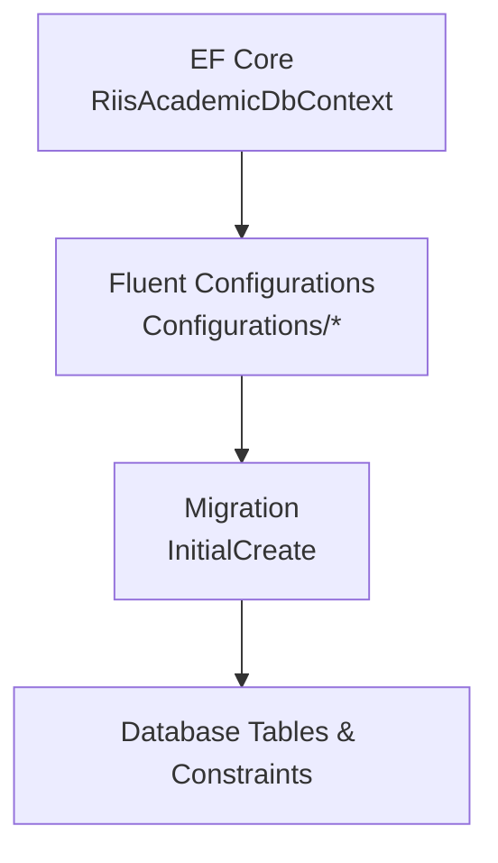
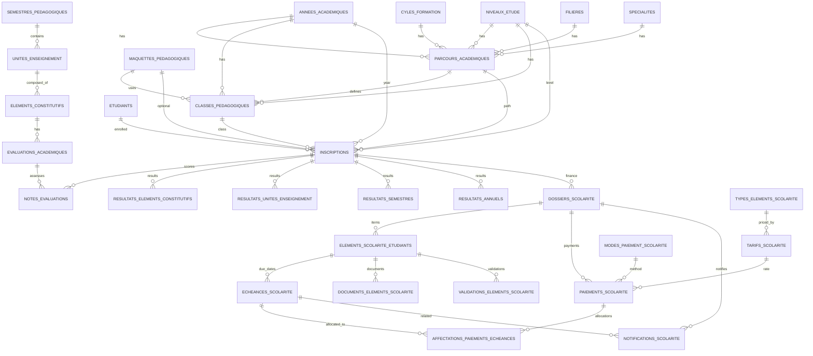
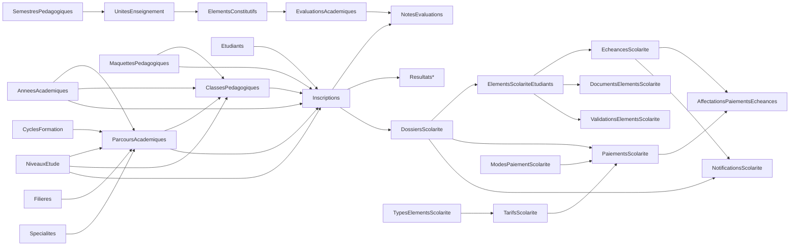

# Database Schema

<cite>
**Referenced Files in This Document**
- [RiisAcademicDbContext.cs](file://src/RIIS.Academic.Infrastructure\Persistence\RiisAcademicDbContext.cs)
- [20260814000042_InitialCreate.cs](file://src/RIIS.Academic.Infrastructure\Persistence\Migrations\20260814000042_InitialCreate.cs)
- [EtudiantConfiguration.cs](file://src/RIIS.Academic.Infrastructure\Persistence\Configurations\Etudiants\EtudiantConfiguration.cs)
- [AnneeAcademiqueConfiguration.cs](file://src/RIIS.Academic.Infrastructure\Persistence\Configurations\Referentiels\AnneeAcademiqueConfiguration.cs)
- [Entity.cs](file://src/RIIS.Academic.Domain\Common\Entity.cs)
- [AuditableEntity.cs](file://src/RIIS.Academic.Domain\Common\AuditableEntity.cs)
- [Etudiant.cs](file://src/RIIS.Academic.Domain\Etudiants\Etudiant.cs)
- [Inscription.cs](file://src/RIIS.Academic.Domain\Inscriptions\Inscription.cs)
- [EvaluationAcademique.cs](file://src/RIIS.Academic.Domain\Notes\EvaluationAcademique.cs)
</cite>

## Table of Contents
1. Introduction
2. Project Structure
3. Core Components
4. Architecture Overview
5. Detailed Component Analysis
6. Dependency Analysis
7. Performance Considerations
8. Troubleshooting Guide
9. Conclusion

## Introduction
This document describes the relational database schema for the academic management system. It covers all tables, relationships, constraints, indexes, and data types derived from the Entity Framework migrations and configurations. It also explains primary and foreign key relationships, versioning, audit fields, migration strategy, and provides guidance on performance tuning, backup/recovery, scalability, and common queries.

## Project Structure
The database is modeled using Entity Framework Core with:
- A DbContext that exposes DbSets for all domain entities
- Fluent API configurations per entity (table names, keys, indexes, constraints)
- A single initial migration that creates all tables, constraints, and indexes

**Diagram sources**
- [RiisAcademicDbContext.cs:6-49](file://src/RIIS.Academic.Infrastructure\Persistence\RiisAcademicDbContext.cs#L6-L49)
- [20260814000042_InitialCreate.cs:14-1773](file://src/RIIS.Academic.Infrastructure\Persistence\Migrations\20260814000042_InitialCreate.cs#L14-L1773)

**Section sources**
- [RiisAcademicDbContext.cs:6-49](file://src/RIIS.Academic.Infrastructure\Persistence\RiisAcademicDbContext.cs#L6-L49)

## Core Components
- Base entities:
  - Entity: defines a long Id used by all entities
  - AuditableEntity: adds creation timestamp; some entities add rowversion for concurrency control
- Domain entities exposed via DbContext include students, academic years, programs, classes, evaluations, results, records, and tuition/school finance entities

Key base definitions:
- Entity.Id as primary key type across tables
- RowVersion columns on selected entities for optimistic concurrency

**Section sources**
- [Entity.cs:4-7](file://src/RIIS.Academic.Domain\Common\Entity.cs#L4-L7)
- [AuditableEntity.cs:4-8](file://src/RIIS.Academic.Domain\Common\AuditableEntity.cs#L4-L8)
- [RiisAcademicDbContext.cs:9-44](file://src/RIIS.Academic.Infrastructure\Persistence\RiisAcademicDbContext.cs#L9-L44)

## Architecture Overview
High-level data model overview showing major aggregates and their relationships:

**Diagram sources**
- [20260814000042_InitialCreate.cs:16-1773](file://src/RIIS.Academic.Infrastructure\Persistence\Migrations\20260814000042_InitialCreate.cs#L16-L1773)

## Detailed Component Analysis

### Academic Year (AnneesAcademiques)
- Purpose: Represents an academic year with start/end years and active flag
- Key fields: Id (bigint PK), Libelle (unique), AnneeDebut, AnneeFin, EstActive
- Constraints: Check constraint ensures AnneeFin = AnneeDebut + 1
- Indexes: Unique on Libelle; unique composite on (AnneeDebut, AnneeFin)

**Section sources**
- [20260814000042_InitialCreate.cs:16-31](file://src/RIIS.Academic.Infrastructure\Persistence\Migrations\20260814000042_InitialCreate.cs#L16-L31)
- [AnneeAcademiqueConfiguration.cs:8-16](file://src/RIIS.Academic.Infrastructure\Persistence\Configurations\Referentiels\AnneeAcademiqueConfiguration.cs#L8-L16)

### Student (Etudiants)
- Purpose: Stores student personal and contact information
- Key fields: Id (PK), Matricule (unique filtered), Nom, Prenoms, DateNaissance, Sexe, AptitudeMedicale, Nationalite, phone/email fields, PhotoUrl
- Audit/Concurrency: CreeLeUtc, Version (rowversion)
- Indexes: Unique filtered index on Matricule; index on Nom

**Section sources**
- [20260814000042_InitialCreate.cs:78-106](file://src/RIIS.Academic.Infrastructure\Persistence\Migrations\20260814000042_InitialCreate.cs#L78-L106)
- [EtudiantConfiguration.cs:8-32](file://src/RIIS.Academic.Infrastructure\Persistence\Configurations\Etudiants\EtudiantConfiguration.cs#L8-L32)
- [Etudiant.cs:3-27](file://src/RIIS.Academic.Domain\Etudiants\Etudiant.cs#L3-L27)

### Academic Path (ParcoursAcademiques)
- Purpose: Links academic year, cycle, level, field, and specialty to define a study path
- Key fields: Id (PK), AnneeAcademiqueId, CycleFormationId, NiveauEtudeId, FiliereId, SpecialiteId, Code (unique), Libelle, EstActive
- Indexes: Unique composite on (AnneeAcademiqueId, CycleFormationId, NiveauEtudeId, FiliereId, SpecialiteId); unique on Code

**Section sources**
- [20260814000042_InitialCreate.cs:303-351](file://src/RIIS.Academic.Infrastructure\Persistence\Migrations\20260814000042_InitialCreate.cs#L303-L351)
- [20260814000042_InitialCreate.cs:1498-1507](file://src/RIIS.Academic.Infrastructure\Persistence\Migrations\20260814000042_InitialCreate.cs#L1498-L1507)

### Pedagogical Class (ClassesPedagogiques)
- Purpose: Groups students per academic year, path, level, and optional pedagogical blueprint
- Key fields: Id (PK), AnneeAcademiqueId, ParcoursAcademiqueId, NiveauEtudeId, MaquettePedagogiqueId (nullable), Code, Libelle, EstActive
- Indexes: Unique composite on (AnneeAcademiqueId, ParcoursAcademiqueId, NiveauEtudeId, Code); indexes on MaquettePedagogiqueId, NiveauEtudeId, ParcoursAcademiqueId

**Section sources**
- [20260814000042_InitialCreate.cs:385-426](file://src/RIIS.Academic.Infrastructure\Persistence\Migrations\20260814000042_InitialCreate.cs#L385-L426)
- [20260814000042_InitialCreate.cs:1226-1244](file://src/RIIS.Academic.Infrastructure\Persistence\Migrations\20260814000042_InitialCreate.cs#L1226-L1244)

### Enrollment (Inscriptions)
- Purpose: Enrolls a student into a program/path/class for an academic year
- Key fields: Id (PK), AnneeAcademiqueId, EtudiantId, ParcoursAcademiqueId, NiveauEtudeId, MaquettePedagogiqueId (nullable), ClassePedagogiqueId (nullable), DateInscription, Statut, MentionSpeciale, TutelleAcademique, Observation, CodeAdministration (unique filtered), CreeLeUtc, Version (rowversion)
- Indexes: Unique on (AnneeAcademiqueId, EtudiantId); indexes on ClassePedagogiqueId, MaquettePedagogiqueId, NiveauEtudeId, ParcoursAcademiqueId; unique filtered on CodeAdministration

**Section sources**
- [20260814000042_InitialCreate.cs:454-514](file://src/RIIS.Academic.Infrastructure\Persistence\Migrations\20260814000042_InitialCreate.cs#L454-L514)
- [20260814000042_InitialCreate.cs:1361-1396](file://src/RIIS.Academic.Infrastructure\Persistence\Migrations\20260814000042_InitialCreate.cs#L1361-L1396)
- [Inscription.cs:3-36](file://src/RIIS.Academic.Domain\Inscriptions\Inscription.cs#L3-L36)

### Program Elements and Units
- SemestresPedagogiques: belong to MaquettesPedagogiques; have Numero (1..10 check), CreditsAttendus, VolumeHoraireAttendu, OrdreAffichage
- UnitesEnseignement: belong to SemestrePedagogiques; have Credits, VolumeHoraire, OrdreAffichage, EstObligatoire; check non-negative credits/volume
- ElementsConstitutifs: belong to UnitesEnseignement; have Code (unique per unit when present), Libelle, Type, Credits, Coefficient, VolumeHoraire, OrdreAffichage, EstObligatoire; check non-negative credits/coefficient/volume

**Section sources**
- [20260814000042_InitialCreate.cs:353-383](file://src/RIIS.Academic.Infrastructure\Persistence\Migrations\20260814000042_InitialCreate.cs#L353-L383)
- [20260814000042_InitialCreate.cs:428-452](file://src/RIIS.Academic.Infrastructure\Persistence\Migrations\20260814000042_InitialCreate.cs#L428-L452)
- [20260814000042_InitialCreate.cs:563-590](file://src/RIIS.Academic.Infrastructure\Persistence\Migrations\20260814000042_InitialCreate.cs#L563-L590)
- [20260814000042_InitialCreate.cs:1291-1301](file://src/RIIS.Academic.Infrastructure\Persistence\Migrations\20260814000042_InitialCreate.cs#L1291-L1301)

### Evaluations and Scores
- EvaluationsAcademiques: defined per ElementConstitutif and academic year; includes Type, Numero, Code, Libelle, Bareme, PonderationPourcentage, DateEvaluation, EvaluationRemplaceeId (self-reference), Observation; check bareme>0 and ponderation in [0,100]
- NotesEvaluations: score per evaluation and enrollment; includes Valeur (0..20 if present), StatutPresence, SaisieLeUtc, SaisiePar; unique on (EvaluationAcademiqueId, InscriptionId)

**Section sources**
- [20260814000042_InitialCreate.cs:822-862](file://src/RIIS.Academic.Infrastructure\Persistence\Migrations\20260814000042_InitialCreate.cs#L822-L862)
- [20260814000042_InitialCreate.cs:937-967](file://src/RIIS.Academic.Infrastructure\Persistence\Migrations\20260814000042_InitialCreate.cs#L937-L967)
- [20260814000042_InitialCreate.cs:1437-1445](file://src/RIIS.Academic.Infrastructure\Persistence\Migrations\20260814000042_InitialCreate.cs#L1437-L1445)
- [EvaluationAcademique.cs:3-23](file://src/RIIS.Academic.Domain\Notes\EvaluationAcademique.cs#L3-L23)

### Results Aggregation
- ResultatsElementsConstitutifs: per enrollment and element; multiple average fields, credits acquired/required, validation status, rattrapage eligibility, CalculeLeUtc; unique on (InscriptionId, ElementConstitutifId)
- ResultatsUnitesEnseignement: per enrollment and unit; average, credits acquired/required, validation status, CalculeLeUtc; unique on (InscriptionId, UniteEnseignementId)
- ResultatsSemestres: per enrollment and semester; averages, credits, rank, validation, decision, CalculeLeUtc; unique on (InscriptionId, SemestrePedagogiqueId)
- ResultatsAnnuels: per enrollment/year/level; annual average, credits, rank, validation, decision, CalculeLeUtc; unique on (InscriptionId, AnneeAcademiqueId, NiveauEtudeId)

**Section sources**
- [20260814000042_InitialCreate.cs:864-899](file://src/RIIS.Academic.Infrastructure\Persistence\Migrations\20260814000042_InitialCreate.cs#L864-L899)
- [20260814000042_InitialCreate.cs:731-760](file://src/RIIS.Academic.Infrastructure\Persistence\Migrations\20260814000042_InitialCreate.cs#L731-L760)
- [20260814000042_InitialCreate.cs:694-729](file://src/RIIS.Academic.Infrastructure\Persistence\Migrations\20260814000042_InitialCreate.cs#L694-L729)
- [20260814000042_InitialCreate.cs:654-692](file://src/RIIS.Academic.Infrastructure\Persistence\Migrations\20260814000042_InitialCreate.cs#L654-L692)
- [20260814000042_InitialCreate.cs:1576-1591](file://src/RIIS.Academic.Infrastructure\Persistence\Migrations\20260814000042_InitialCreate.cs#L1576-L1591)
- [20260814000042_InitialCreate.cs:1565-1574](file://src/RIIS.Academic.Infrastructure\Persistence\Migrations\20260814000042_InitialCreate.cs#L1565-L1574)

### Records (ProcesVerbaux and Lignes)
- ProcesVerbaux: session record per class/year/path/semester; includes Type, CodeSession, Titre, DateEditionUtc, EstDefinitif, CheminFichier, Observation; indexes on AnneeAcademiqueId, ClassePedagogiqueId, SemestrePedagogiqueId; unique composite on (ParcoursAcademiqueId, ClassePedagogiqueId, SemestrePedagogiqueId, Type, CodeSession)
- ProcesVerbauxLignes: per-process-verbal line per enrollment; snapshots of student info, average, credits, rank, decision, JSON details; unique on (ProcesVerbalId, InscriptionId)

**Section sources**
- [20260814000042_InitialCreate.cs:516-561](file://src/RIIS.Academic.Infrastructure\Persistence\Migrations\20260814000042_InitialCreate.cs#L516-L561)
- [20260814000042_InitialCreate.cs:789-820](file://src/RIIS.Academic.Infrastructure\Persistence\Migrations\20260814000042_InitialCreate.cs#L789-L820)
- [20260814000042_InitialCreate.cs:1529-1558](file://src/RIIS.Academic.Infrastructure\Persistence\Migrations\20260814000042_InitialCreate.cs#L1529-L1558)

### Tuition and Finance (DossiersScolarite, Types/Tarifs, Elements, Echeances, Paiements, Notifications)
- DossiersScolarite: snapshot of administrative/financial status per enrollment; includes denormalized codes/libelles for year/cycle/field/specialty/level; unique on InscriptionId; indexed by (AnneeAcademiqueCode, CycleCode, FiliereCode, SpecialiteCode, NiveauNumero)
- TypesElementsScolarite: reference table for fee/document types with flags and ordering
- TarifsScolarite: pricing rules per type/year/cycle/level/field/specialty with validity windows and priority; check Montant >= 0
- ElementsScolariteEtudiants: per-student items linked to dossier; amounts expected/allocated/remaining; status; unique on (DossierScolariteId, TypeElementScolariteId)
- EcheancesScolarite: due dates per item; number unique per item; status; check amounts >= 0; index on (DateExigibilite, Statut)
- PaiementsScolarite: payments linked to dossier/item/type/rate/method; amounts and status; indexes on DossierScolariteId+DatePaiement, TypeElementScolariteId, ModePaiementScolariteId, TarifScolariteId, ReferencePaiement
- AffectationsPaiementsEcheances: allocation of payments to due dates; positive amount; indexes on EcheanceScolariteId and composite (PaiementScolariteId, EcheanceScolariteId)
- DocumentsElementsScolarite: documents attached to student items; status and verification metadata; index on (ElementScolariteEtudiantId, NomDocument)
- ValidationsElementsScolarite: validation records per student item; status, validator, rejection reason
- NotificationsScolarite: notifications tied to dossiers/items/due dates; channel, title/message, generation/sent timestamps, status; indexes on (DossierScolariteId, Statut, DateGenerationUtc) and (EcheanceScolariteId, Type)

**Section sources**
- [20260814000042_InitialCreate.cs:619-652](file://src/RIIS.Academic.Infrastructure\Persistence\Migrations\20260814000042_InitialCreate.cs#L619-L652)
- [20260814000042_InitialCreate.cs:156-174](file://src/RIIS.Academic.Infrastructure\Persistence\Migrations\20260814000042_InitialCreate.cs#L156-L174)
- [20260814000042_InitialCreate.cs:222-252](file://src/RIIS.Academic.Infrastructure\Persistence\Migrations\20260814000042_InitialCreate.cs#L222-L252)
- [20260814000042_InitialCreate.cs:901-935](file://src/RIIS.Academic.Infrastructure\Persistence\Migrations\20260814000042_InitialCreate.cs#L901-L935)
- [20260814000042_InitialCreate.cs:995-1021](file://src/RIIS.Academic.Infrastructure\Persistence\Migrations\20260814000042_InitialCreate.cs#L995-L1021)
- [20260814000042_InitialCreate.cs:1023-1079](file://src/RIIS.Academic.Infrastructure\Persistence\Migrations\20260814000042_InitialCreate.cs#L1023-L1079)
- [20260814000042_InitialCreate.cs:1145-1173](file://src/RIIS.Academic.Infrastructure\Persistence\Migrations\20260814000042_InitialCreate.cs#L1145-L1173)
- [20260814000042_InitialCreate.cs:969-993](file://src/RIIS.Academic.Infrastructure\Persistence\Migrations\20260814000042_InitialCreate.cs#L969-L993)
- [20260814000042_InitialCreate.cs:1081-1103](file://src/RIIS.Academic.Infrastructure\Persistence\Migrations\20260042_InitialCreate.cs#L1081-L1103)
- [20260814000042_InitialCreate.cs:1105-1143](file://src/RIIS.Academic.Infrastructure\Persistence\Migrations\20260814000042_InitialCreate.cs#L1105-L1143)
- [20260814000042_InitialCreate.cs:1268-1288](file://src/RIIS.Academic.Infrastructure\Persistence\Migrations\20260814000042_InitialCreate.cs#L1268-L1288)
- [20260814000042_InitialCreate.cs:1304-1317](file://src/RIIS.Academic.Infrastructure\Persistence\Migrations\20260814000042_InitialCreate.cs#L1304-L1317)
- [20260814000042_InitialCreate.cs:1462-1495](file://src/RIIS.Academic.Infrastructure\Persistence\Migrations\20260814000042_InitialCreate.cs#L1462-L1495)
- [20260814000042_InitialCreate.cs:1203-1211](file://src/RIIS.Academic.Infrastructure\Persistence\Migrations\20260814000042_InitialCreate.cs#L1203-L1211)
- [20260814000042_InitialCreate.cs:1447-1460](file://src/RIIS.Academic.Infrastructure\Persistence\Migrations\20260814000042_InitialCreate.cs#L1447-L1460)

### Admission and Validation
- DossiersAdmission: one-to-one with Inscription; includes baccalaureate and equivalence details; check on year range
- ValidationsInscriptions: signature/validation metadata for enrollment; one-to-one with Inscription

**Section sources**
- [20260814000042_InitialCreate.cs:592-617](file://src/RIIS.Academic.Infrastructure\Persistence\Migrations\20260814000042_InitialCreate.cs#L592-L617)
- [20260814000042_InitialCreate.cs:762-787](file://src/RIIS.Academic.Infrastructure\Persistence\Migrations\20260814000042_InitialCreate.cs#L762-L787)
- [20260814000042_InitialCreate.cs:1262-1266](file://src/RIIS.Academic.Infrastructure\Persistence\Migrations\20260814000042_InitialCreate.cs#L1262-L1266)

### Referential Data
- CyclesFormation: code (unique), libelle, order, active flag
- Filieres: code (unique), libelle, active flag
- NiveauxEtude: numero (unique), libelle, active flag; check numero >= 1
- Specialites: belongs to Filieres; code, libelle, active flag
- ModesPaiementScolarite: code (unique), libelle, order, active flag; index on (EstActif, OrdreAffichage)

**Section sources**
- [20260814000042_InitialCreate.cs:33-47](file://src/RIIS.Academic.Infrastructure\Persistence\Migrations\20260814000042_InitialCreate.cs#L33-L47)
- [20260814000042_InitialCreate.cs:108-121](file://src/RIIS.Academic.Infrastructure\Persistence\Migrations\20260814000042_InitialCreate.cs#L108-L121)
- [20260814000042_InitialCreate.cs:139-153](file://src/RIIS.Academic.Infrastructure\Persistence\Migrations\20260814000042_InitialCreate.cs#L139-L153)
- [20260814000042_InitialCreate.cs:200-220](file://src/RIIS.Academic.Infrastructure\Persistence\Migrations\20260814000042_InitialCreate.cs#L200-L220)
- [20260814000042_InitialCreate.cs:124-137](file://src/RIIS.Academic.Infrastructure\Persistence\Migrations\20260814000042_InitialCreate.cs#L124-L137)
- [20260814000042_InitialCreate.cs:1420-1428](file://src/RIIS.Academic.Infrastructure\Persistence\Migrations\20260814000042_InitialCreate.cs#L1420-L1428)

### Relationships Summary
- One-to-many: e.g., Semestre -> UniteEnseignement -> ElementConstitutif -> EvaluationAcademique -> NoteEvaluation
- One-to-one: Inscription <-> DossiersAdmission; Inscription <-> ValidationsInscriptions; Inscription <-> DossierScolarite
- Self-referencing: EvaluationsAcademiques.EvaluationRemplaceeId references another evaluation
- Many-to-many resolved via junctions where needed (e.g., AffectationsPaiementsEcheances links PaiementsScolarite and EcheancesScolarite)

**Section sources**
- [20260814000042_InitialCreate.cs:16-1773](file://src/RIIS.Academic.Infrastructure\Persistence\Migrations\20260814000042_InitialCreate.cs#L16-L1773)

## Dependency Analysis
The following diagram shows how core entities depend on each other through foreign keys:

**Diagram sources**
- [20260814000042_InitialCreate.cs:16-1773](file://src/RIIS.Academic.Infrastructure\Persistence\Migrations\20260814000042_InitialCreate.cs#L16-L1773)

**Section sources**
- [20260814000042_InitialCreate.cs:16-1773](file://src/RIIS.Academic.Infrastructure\Persistence\Migrations\20260814000042_InitialCreate.cs#L16-L1773)

## Performance Considerations
- Primary Keys: All tables use bigint identity-based primary keys for efficient clustering and indexing.
- Unique Constraints: Used extensively to enforce business uniqueness (e.g., academic year periods, codes, enrollment per year/student).
- Filtered Indexes: Applied on optional unique columns (e.g., Matricule, Sigle, CodeAdministration, ElementsConstitutifs.Code) to reduce index size and improve lookup performance.
- Composite Indexes: Optimized for common query patterns such as:
  - Enrollment lookups by year and student
  - Results retrieval by enrollment and unit/semester
  - Payment queries by dossier and date
  - Due date scheduling by date/status
- Check Constraints: Enforce value ranges and business rules at the database level (e.g., credit/non-negative amounts, grade ranges, period continuity).
- RowVersion: Concurrency control on key entities to prevent lost updates.
- Denormalization: DossierScolarite stores denormalized codes/libelles to speed up reporting and reduce joins.

[No sources needed since this section provides general guidance]

## Troubleshooting Guide
- Constraint Violations:
  - Period constraint on AnneesAcademiques requires AnneeFin = AnneeDebut + 1
  - Grade constraints on NotesEvaluations require values between 0 and 20 when present
  - Amount constraints ensure non-negative monetary fields across tuition tables
- Duplicate Key Errors:
  - Unique indexes on codes (e.g., Matricule, Libelle, Codes) will raise duplicates; verify input uniqueness or update existing records
- Foreign Key Errors:
  - Ensure referenced entities exist before inserting related records (e.g., Inscriptions require valid AnneeAcademiqueId, EtudiantId, etc.)
- Concurrency Conflicts:
  - Entities with rowversion may fail on concurrent updates; refresh and retry operations

**Section sources**
- [20260814000042_InitialCreate.cs:16-31](file://src/RIIS.Academic.Infrastructure\Persistence\Migrations\20260814000042_InitialCreate.cs#L16-L31)
- [20260814000042_InitialCreate.cs:937-967](file://src/RIIS.Academic.Infrastructure\Persistence\Migrations\20260814000042_InitialCreate.cs#L937-L967)
- [20260814000042_InitialCreate.cs:1023-1079](file://src/RIIS.Academic.Infrastructure\Persistence\Migrations\20260814000042_InitialCreate.cs#L1023-L1079)
- [EtudiantConfiguration.cs:8-32](file://src/RIIS.Academic.Infrastructure\Persistence\Configurations\Etudiants\EtudiantConfiguration.cs#L8-L32)

## Conclusion
The database schema implements a robust, constraint-rich model for academic administration, including student lifecycle, program structure, evaluations and results, and comprehensive tuition management. The design leverages EF Core conventions, explicit configurations, and a single initial migration to maintain consistency. Strong indexing strategies and check constraints support performance and data integrity. For ongoing development, follow the established migration pattern and keep configurations aligned with domain changes.

[No sources needed since this section summarizes without analyzing specific files]

## Appendices

### Migration Strategy and Version Management
- Use Entity Framework migrations to evolve the schema. The provided InitialCreate establishes the baseline. Subsequent migrations should be additive where possible to preserve data.
- Apply migrations in target environments consistently. Validate after applying by running tests against representative datasets.
- Maintain backward compatibility for column additions and avoid destructive changes unless necessary.

**Section sources**
- [20260814000042_InitialCreate.cs:11-1773](file://src/RIIS.Academic.Infrastructure\Persistence\Migrations\20260814000042_InitialCreate.cs#L11-L1773)

### Backup and Recovery Procedures
- Perform regular full backups of the database. Include transaction log backups for point-in-time recovery.
- Test restore procedures periodically to ensure recoverability.
- For high availability, consider read replicas for reporting workloads to reduce load on the primary.

[No sources needed since this section provides general guidance]

### Stored Procedures, Views, and Functions
- No stored procedures, views, or functions are defined in the current schema. All logic is implemented in application services and enforced via constraints and indexes.

[No sources needed since this section provides general guidance]

### Common Queries and Access Patterns
- Retrieve a student’s enrollment for a given academic year:
  - Query Inscriptions filtered by EtudiantId and AnneeAcademiqueId
- Get evaluation scores for a student in a specific evaluation:
  - Query NotesEvaluations by EvaluationAcademiqueId and InscriptionId
- Compute semester results for a student:
  - Aggregate from ResultatsSemestres by InscriptionId and SemestrePedagogiqueId
- List outstanding dues for a student:
  - Join ElementsScolariteEtudiants with EcheancesScolarite and filter by status and due date
- Allocate payments to due dates:
  - Insert AffectationsPaiementsEcheances linking PaiementScolarite and EcheanceScolarite with allocated amount

[No sources needed since this section provides general guidance]