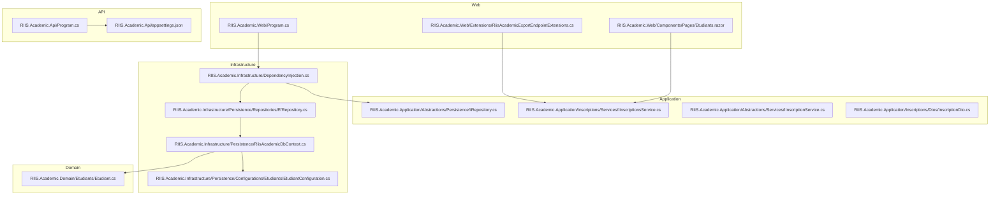
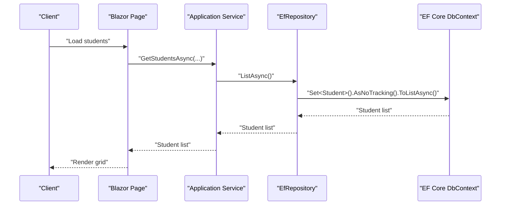
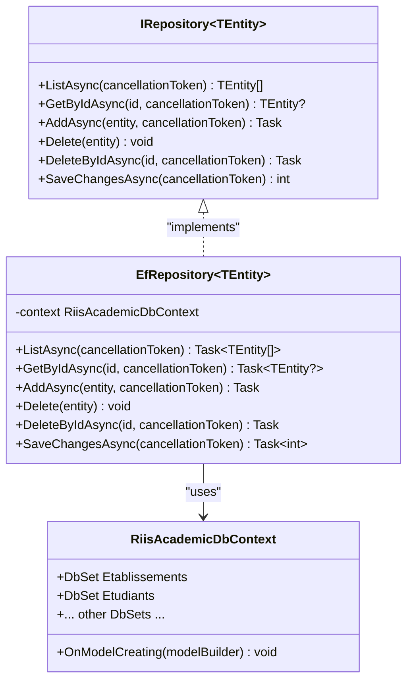
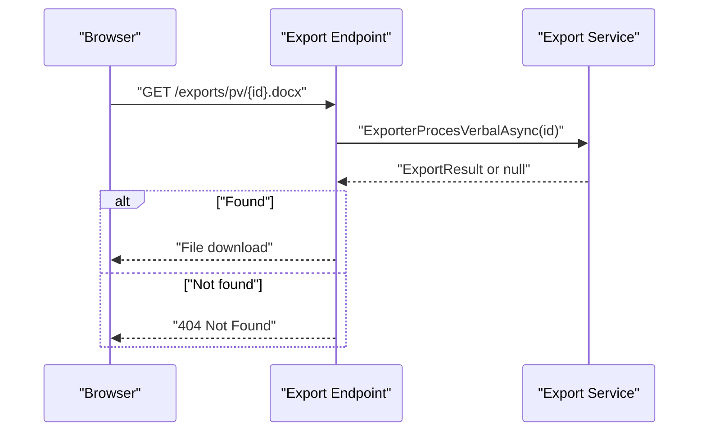
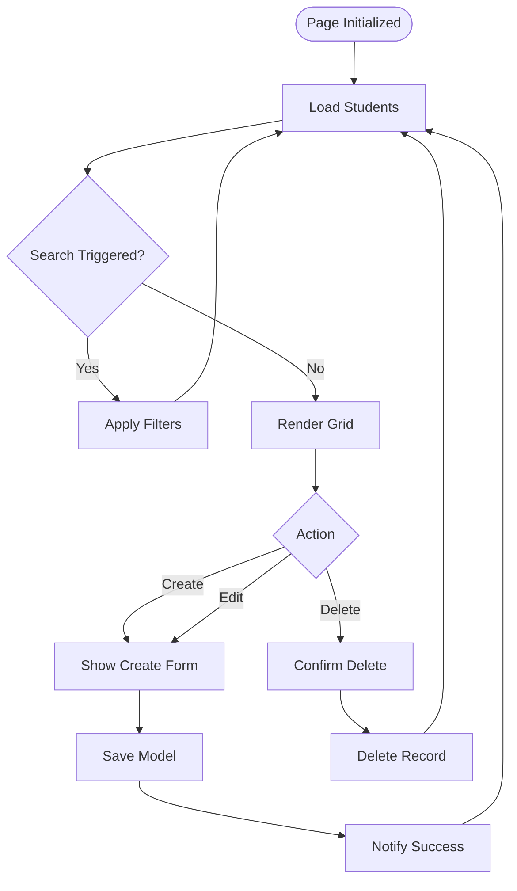
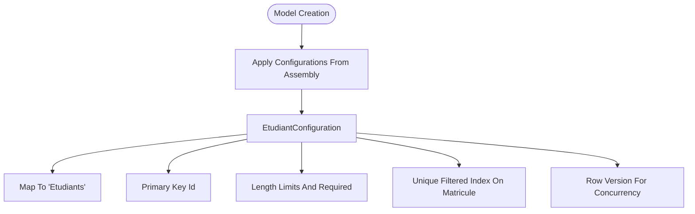
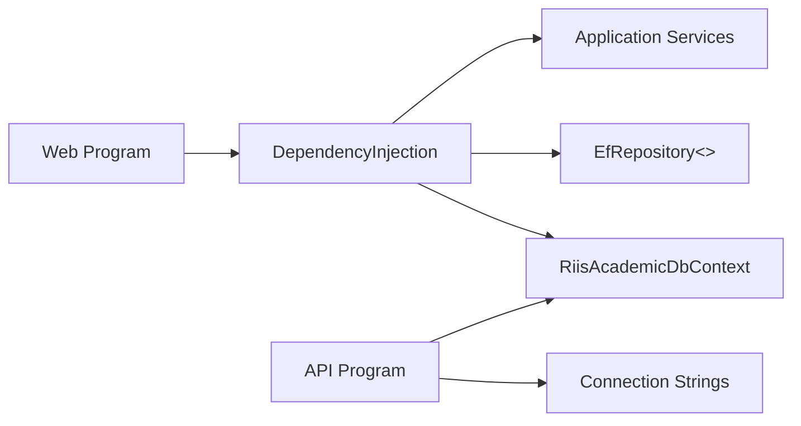

# Developer Guide

<cite>
**Referenced Files in This Document**
- [Program.cs](file://RIIS.Academic.Api/Program.cs)
- [appsettings.json](file://RIIS.Academic.Api/appsettings.json)
- [Program.cs](file://RIIS.Academic.Web/Program.cs)
- [DependencyInjection.cs](file://RIIS.Academic.Infrastructure/DependencyInjection.cs)
- [RiisAcademicDbContext.cs](file://RIIS.Academic.Infrastructure/Persistence/RiisAcademicDbContext.cs)
- [IRepository.cs](file://RIIS.Academic.Application/Abstractions/Persistence/IRepository.cs)
- [EfRepository.cs](file://RIIS.Academic.Infrastructure/Persistence/Repositories/EfRepository.cs)
- [EtudiantConfiguration.cs](file://RIIS.Academic.Infrastructure/Persistence/Configurations/Etudiants/EtudiantConfiguration.cs)
- [Etudiant.cs](file://RIIS.Academic.Domain/Etudiants/Etudiant.cs)
- [InscriptionDto.cs](file://RIIS.Academic.Application/Inscriptions/Dtos/InscriptionDto.cs)
- [IInscriptionsService.cs](file://RIIS.Academic.Application/Inscriptions/Services/IInscriptionsService.cs)
- [IInscriptionService.cs](file://RIIS.Academic.Application/Abstractions/Services/IInscriptionService.cs)
- [RiisAcademicExportEndpointExtensions.cs](file://RIIS.Academic.Web/Extensions/RiisAcademicExportEndpointExtensions.cs)
- [Etudiants.razor](file://RIIS.Academic.Web/Components/Pages/Etudiants.razor)
</cite>

## Table of Contents
1. Introduction
2. Project Structure
3. Core Components
4. Architecture Overview
5. Detailed Component Analysis
6. Dependency Analysis
7. Performance Considerations
8. Troubleshooting Guide
9. Conclusion
10. Appendices

## Introduction
This guide explains how to develop, extend, and maintain the RIIS Academic system. It covers coding standards, project structure conventions, development workflow, contribution guidelines, code review processes, branching strategies, design patterns, naming conventions, architectural principles, debugging techniques, profiling tools, performance optimization strategies, extension points, plugin architecture, customization opportunities, and practical examples for adding features or modifying existing functionality while maintaining code quality.

## Project Structure
The solution follows Clean Architecture with clear separation of concerns:
- Domain layer: core business entities and enums
- Application layer: use cases, services, DTOs, and abstractions
- Infrastructure layer: persistence (EF Core), document exports, dependency injection wiring
- Web layer: Blazor UI and minimal API endpoints for exports
- API layer: lightweight ASP.NET Core API entry point

**Diagram sources**
- [Program.cs:1-27](file://RIIS.Academic.Web/Program.cs#L1-L27)
- [DependencyInjection.cs:1-75](file://RIIS.Academic.Infrastructure/DependencyInjection.cs#L1-L75)
- [RiisAcademicDbContext.cs:1-51](file://RIIS.Academic.Infrastructure/Persistence/RiisAcademicDbContext.cs#L1-L51)
- [EfRepository.cs:1-34](file://RIIS.Academic.Infrastructure/Persistence/Repositories/EfRepository.cs#L1-L34)
- [EtudiantConfiguration.cs:1-34](file://RIIS.Academic.Infrastructure/Persistence/Configurations/Etudiants/EtudiantConfiguration.cs#L1-L34)
- [Etudiant.cs:1-28](file://RIIS.Academic.Domain/Etudiants/Etudiant.cs#L1-L28)
- [IRepository.cs:1-13](file://RIIS.Academic.Application/Abstractions/Persistence/IRepository.cs#L1-L13)
- [IInscriptionsService.cs:1-32](file://RIIS.Academic.Application/Inscriptions/Services/IInscriptionsService.cs#L1-L32)
- [IInscriptionService.cs:1-9](file://RIIS.Academic.Application/Abstractions/Services/IInscriptionService.cs#L1-L9)
- [InscriptionDto.cs:1-28](file://RIIS.Academic.Application/Inscriptions/Dtos/InscriptionDto.cs#L1-L28)
- [RiisAcademicExportEndpointExtensions.cs:1-94](file://RIIS.Academic.Web/Extensions/RiisAcademicExportEndpointExtensions.cs#L1-L94)
- [Program.cs:1-18](file://RIIS.Academic.Api/Program.cs#L1-L18)
- [appsettings.json:1-7](file://RIIS.Academic.Api/appsettings.json#L1-L7)

**Section sources**
- [Program.cs:1-27](file://RIIS.Academic.Web/Program.cs#L1-L27)
- [DependencyInjection.cs:1-75](file://RIIS.Academic.Infrastructure/DependencyInjection.cs#L1-L75)
- [RiisAcademicDbContext.cs:1-51](file://RIIS.Academic.Infrastructure/Persistence/RiisAcademicDbContext.cs#L1-L51)
- [Program.cs:1-18](file://RIIS.Academic.Api/Program.cs#L1-L18)
- [appsettings.json:1-7](file://RIIS.Academic.Api/appsettings.json#L1-L7)

## Core Components
- Domain entities define the business model and relationships. Example: student entity includes personal details, contact info, audit fields, and navigation properties.
- Application services encapsulate use cases and orchestrate operations using DTOs for input/output.
- Infrastructure provides EF Core DbContext, repository implementation, and configuration mappings.
- Web layer exposes UI pages and export endpoints that consume application services.
- API layer configures controllers and database context for server-side APIs.

Key responsibilities:
- Domain: pure business rules and state
- Application: use cases, validation boundaries, DTOs
- Infrastructure: data access, external integrations, DI registration
- Web: user interactions, export endpoints
- API: HTTP surface for controllers

**Section sources**
- [Etudiant.cs:1-28](file://RIIS.Academic.Domain/Etudiants/Etudiant.cs#L1-L28)
- [IInscriptionsService.cs:1-32](file://RIIS.Academic.Application/Inscriptions/Services/IInscriptionsService.cs#L1-L32)
- [EfRepository.cs:1-34](file://RIIS.Academic.Infrastructure/Persistence/Repositories/EfRepository.cs#L1-L34)
- [RiisAcademicDbContext.cs:1-51](file://RIIS.Academic.Infrastructure/Persistence/RiisAcademicDbContext.cs#L1-L51)
- [RiisAcademicExportEndpointExtensions.cs:1-94](file://RIIS.Academic.Web/Extensions/RiisAcademicExportEndpointExtensions.cs#L1-L94)

## Architecture Overview
The system uses Clean Architecture with layered separation and dependency inversion:
- The Web and API layers depend on Application interfaces
- Application depends on Domain models and Abstractions
- Infrastructure implements Abstractions and is registered via a central DI container

**Diagram sources**
- [Etudiants.razor:1-272](file://RIIS.Academic.Web/Components/Pages/Etudiants.razor#L1-L272)
- [IRepository.cs:1-13](file://RIIS.Academic.Application/Abstractions/Persistence/IRepository.cs#L1-L13)
- [EfRepository.cs:1-34](file://RIIS.Academic.Infrastructure/Persistence/Repositories/EfRepository.cs#L1-L34)
- [RiisAcademicDbContext.cs:1-51](file://RIIS.Academic.Infrastructure/Persistence/RiisAcademicDbContext.cs#L1-L51)

## Detailed Component Analysis

### Repository Pattern and Data Access
- IRepository defines generic CRUD operations with async methods and cancellation support.
- EfRepository implements repository over EF Core with AsNoTracking for read-only queries and FindAsync for GetById.
- DbContext registers all domain entities and applies configurations from assembly.

**Diagram sources**
- [IRepository.cs:1-13](file://RIIS.Academic.Application/Abstractions/Persistence/IRepository.cs#L1-L13)
- [EfRepository.cs:1-34](file://RIIS.Academic.Infrastructure/Persistence/Repositories/EfRepository.cs#L1-L34)
- [RiisAcademicDbContext.cs:1-51](file://RIIS.Academic.Infrastructure/Persistence/RiisAcademicDbContext.cs#L1-L51)

**Section sources**
- [IRepository.cs:1-13](file://RIIS.Academic.Application/Abstractions/Persistence/IRepository.cs#L1-L13)
- [EfRepository.cs:1-34](file://RIIS.Academic.Infrastructure/Persistence/Repositories/EfRepository.cs#L1-L34)
- [RiisAcademicDbContext.cs:1-51](file://RIIS.Academic.Infrastructure/Persistence/RiisAcademicDbContext.cs#L1-L51)

### Export Endpoints (Word/Excel)
- Minimal API endpoints expose file downloads for academic records and process-verbal documents.
- Each endpoint resolves an export service via DI and returns either NotFound or a file result.

**Diagram sources**
- [RiisAcademicExportEndpointExtensions.cs:1-94](file://RIIS.Academic.Web/Extensions/RiisAcademicExportEndpointExtensions.cs#L1-L94)

**Section sources**
- [RiisAcademicExportEndpointExtensions.cs:1-94](file://RIIS.Academic.Web/Extensions/RiisAcademicExportEndpointExtensions.cs#L1-L94)

### Student Management UI Flow
- Blazor page injects application service and renders a search form, data grid, and edit/create form.
- Save and delete operations call service methods and handle success/error notifications.

**Diagram sources**
- [Etudiants.razor:1-272](file://RIIS.Academic.Web/Components/Pages/Etudiants.razor#L1-L272)

**Section sources**
- [Etudiants.razor:1-272](file://RIIS.Academic.Web/Components/Pages/Etudiants.razor#L1-L272)

### Entity Configuration and Conventions
- EF Core configurations define table names, constraints, indexes, and row versioning.
- Enums are converted to strings with length limits; unique filtered indexes ensure data integrity.

**Diagram sources**
- [RiisAcademicDbContext.cs:1-51](file://RIIS.Academic.Infrastructure/Persistence/RiisAcademicDbContext.cs#L1-L51)
- [EtudiantConfiguration.cs:1-34](file://RIIS.Academic.Infrastructure/Persistence/Configurations/Etudiants/EtudiantConfiguration.cs#L1-L34)

**Section sources**
- [EtudiantConfiguration.cs:1-34](file://RIIS.Academic.Infrastructure/Persistence/Configurations/Etudiants/EtudiantConfiguration.cs#L1-L34)
- [RiisAcademicDbContext.cs:1-51](file://RIIS.Academic.Infrastructure/Persistence/RiisAcademicDbContext.cs#L1-L51)

## Dependency Analysis
Centralized dependency injection wires infrastructure services, repositories, and application services. The Web app bootstraps Radzen components, Razor interactive server mode, and registers infrastructure services. The API app sets up controllers and EF Core context with connection string configuration.

**Diagram sources**
- [Program.cs:1-27](file://RIIS.Academic.Web/Program.cs#L1-L27)
- [DependencyInjection.cs:1-75](file://RIIS.Academic.Infrastructure/DependencyInjection.cs#L1-L75)
- [Program.cs:1-18](file://RIIS.Academic.Api/Program.cs#L1-L18)
- [appsettings.json:1-7](file://RIIS.Academic.Api/appsettings.json#L1-L7)

**Section sources**
- [Program.cs:1-27](file://RIIS.Academic.Web/Program.cs#L1-L27)
- [DependencyInjection.cs:1-75](file://RIIS.Academic.Infrastructure/DependencyInjection.cs#L1-L75)
- [Program.cs:1-18](file://RIIS.Academic.Api/Program.cs#L1-L18)
- [appsettings.json:1-7](file://RIIS.Academic.Api/appsettings.json#L1-L7)

## Performance Considerations
- Use AsNoTracking for read-only queries to avoid change tracking overhead.
- Prefer specific projections and filters at the query level to reduce payload size.
- Leverage unique filtered indexes to enforce constraints efficiently.
- Keep DbContext lifetime appropriate; here it is transient for per-operation contexts.
- Avoid N+1 queries by loading related data explicitly when needed.
- Profile database calls and consider caching for lookup data where appropriate.

[No sources needed since this section provides general guidance]

## Troubleshooting Guide
Common issues and resolutions:
- Missing connection string: Ensure environment-specific connection name exists and is configured.
- Duplicate keys: Validate unique constraints such as matricule; check filtered unique index behavior.
- Export not found: Verify requested IDs exist before exporting; endpoints return NotFound when missing.
- UI errors: Inspect service exceptions and display user-friendly messages; validate inputs on forms.

Debugging tips:
- Enable EF Core logging to inspect generated SQL.
- Add structured logging around service methods and export endpoints.
- Use browser dev tools to trace network requests for export endpoints.
- Validate configuration values during startup.

**Section sources**
- [DependencyInjection.cs:63-73](file://RIIS.Academic.Infrastructure/DependencyInjection.cs#L63-L73)
- [RiisAcademicExportEndpointExtensions.cs:1-94](file://RIIS.Academic.Web/Extensions/RiisAcademicExportEndpointExtensions.cs#L1-L94)
- [EtudiantConfiguration.cs:1-34](file://RIIS.Academic.Infrastructure/Persistence/Configurations/Etudiants/EtudiantConfiguration.cs#L1-L34)

## Conclusion
This codebase demonstrates a well-structured Clean Architecture with clear separation between domain, application, infrastructure, and presentation layers. The repository pattern abstracts data access, while centralized dependency injection simplifies service composition. Export endpoints provide flexible document generation, and the Blazor UI offers interactive management capabilities. Following the conventions and practices outlined here will help maintain consistency, scalability, and testability as the system evolves.

[No sources needed since this section summarizes without analyzing specific files]

## Appendices

### Coding Standards and Naming Conventions
- Entities: PascalCase nouns; include Id, audit fields, and navigation properties.
- DTOs: PascalCase nouns representing transfer contracts; include only necessary fields.
- Services: Interface-first design with I-prefix; implementations in Infrastructure or Application as appropriate.
- Methods: Async verbs with CancellationToken support; prefer descriptive names like GetXxxAsync, SaveXxxAsync.
- Configuration: Use typed options and environment-based settings; keep secrets out of source control.

**Section sources**
- [Etudiant.cs:1-28](file://RIIS.Academic.Domain/Etudiants/Etudiant.cs#L1-L28)
- [InscriptionDto.cs:1-28](file://RIIS.Academic.Application/Inscriptions/Dtos/InscriptionDto.cs#L1-L28)
- [IInscriptionsService.cs:1-32](file://RIIS.Academic.Application/Inscriptions/Services/IInscriptionsService.cs#L1-L32)
- [IInscriptionService.cs:1-9](file://RIIS.Academic.Application/Abstractions/Services/IInscriptionService.cs#L1-L9)

### Development Workflow and Branching Strategy
- Feature branches: Create feature branches from main for each new capability; prefix with feature/.
- Pull requests: Open PRs with clear descriptions, tests, and screenshots for UI changes.
- Code reviews: Require at least one reviewer; verify adherence to standards and architecture.
- Merging: Squash merge after approvals; update changelog and version tags as needed.
- CI/CD: Run automated builds, tests, and static analysis on PRs; block merges on failures.

[No sources needed since this section provides general guidance]

### Contribution Guidelines and Code Review Process
- Follow established patterns: repository, DTOs, services, and configuration.
- Write unit tests for critical logic; add integration tests for data flows.
- Document public APIs and significant changes in README or inline comments.
- Ensure accessibility and usability in UI components.

[No sources needed since this section provides general guidance]

### Extension Points and Customization Opportunities
- New domains: Add entities in Domain, DTOs and services in Application, configurations in Infrastructure, and UI pages in Web.
- Export formats: Implement new export services and register them in DI; expose endpoints via extensions.
- Lookups and filters: Extend services with additional lookup methods and UI filters.
- Validation: Add custom validators and error handling in services and UI.

**Section sources**
- [DependencyInjection.cs:23-61](file://RIIS.Academic.Infrastructure/DependencyInjection.cs#L23-L61)
- [RiisAcademicExportEndpointExtensions.cs:1-94](file://RIIS.Academic.Web/Extensions/RiisAcademicExportEndpointExtensions.cs#L1-L94)

### Examples: Adding a New Feature
Steps to add a new feature:
1. Define domain entity and any required enums in Domain.
2. Create DTOs in Application under the relevant feature folder.
3. Implement service interface and class in Application; wire in DI.
4. Add EF Core configuration and DbSet if needed; run migrations.
5. Expose endpoints or UI pages in Web; integrate with services.
6. Add tests and documentation; open a PR for review.

Practical references:
- Service interface example: [IInscriptionsService.cs:1-32](file://RIIS.Academic.Application/Inscriptions/Services/IInscriptionsService.cs#L1-L32)
- DTO example: [InscriptionDto.cs:1-28](file://RIIS.Academic.Application/Inscriptions/Dtos/InscriptionDto.cs#L1-L28)
- DI registration: [DependencyInjection.cs:23-61](file://RIIS.Academic.Infrastructure/DependencyInjection.cs#L23-L61)
- Export endpoint example: [RiisAcademicExportEndpointExtensions.cs:1-94](file://RIIS.Academic.Web/Extensions/RiisAcademicExportEndpointExtensions.cs#L1-L94)

**Section sources**
- [IInscriptionsService.cs:1-32](file://RIIS.Academic.Application/Inscriptions/Services/IInscriptionsService.cs#L1-L32)
- [InscriptionDto.cs:1-28](file://RIIS.Academic.Application/Inscriptions/Dtos/InscriptionDto.cs#L1-L28)
- [DependencyInjection.cs:23-61](file://RIIS.Academic.Infrastructure/DependencyInjection.cs#L23-L61)
- [RiisAcademicExportEndpointExtensions.cs:1-94](file://RIIS.Academic.Web/Extensions/RiisAcademicExportEndpointExtensions.cs#L1-L94)

### Profiling Tools and Optimization Strategies
- Use Visual Studio Profiler or dotnet-trace to identify hot paths.
- Enable EF Core detailed logging to analyze query performance.
- Optimize indexes based on query patterns; monitor execution plans.
- Cache frequently accessed lookups to reduce database load.

[No sources needed since this section provides general guidance]